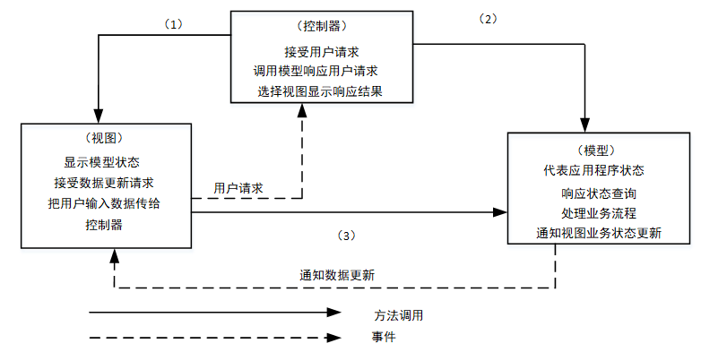

# 案例题_Web应用设计

- 对应软考高级系统架构设计师章节：系统质量属性与架构评估、信息系统架构设计理论与实践、层次式架构设计理论与实践

- 大题数量：4
- 小问数量：11

---

> **知识点分组：响应式 Web 与多终端**

## 1. 2017年11月第5题（响应式 Web 与多终端）

- 题号：0020170501005
- 题目标签：响应式 Web 与多终端
- 难度：简单
- 频率：中频
- 浓缩知识点：响应式 Web 与多终端；重点围绕题干场景、架构决策与质量属性进行分析。

### 题目说明

阅读以下关于 Web 系统架构设计的叙述，在答题纸上回答问题 1至问题 3。
【说明】
某电子商务企业因发展良好，客户量逐步增大，企业业务不断扩充，导致其原有的B2C商品交易平台已不能满足现有业务需求。因此，该企业委托某软件公司重新开发一套商品交易平台。该企业要求新平台应可适应客户从手机、平板设备、电脑等不同终端设备访问系统，同时满足电商定期开展"秒杀"、"限时促销"等活动的系统高并发访问量的需求。面对系统需求，软件公司召开项目组讨论会议，制定系统设计方案。讨论会议上，王工提出可以应用响应式Web设计满足客户从不同设备正确访问系统的需求。 同时，采用增加镜像站点、CDN内容分发等方式解决高并发访问量带来的问题。李工在王工的提议上补充，仅仅依靠上述外网加速技术不能完全解决高用户并发访问问题，如果访问量持续增加，系统仍存在崩溃可能。李工提出应同时结合负载均衡、缓存服务器、Web 应用服务器、分布式文件系统、分布式数据库等方法设计系统架构。经过项目组讨论，最终决定综合王工和李工的思路，完成新系统的架构设计。

### 问题1

请用200字以内的文字描述什么是"响应式 Web 设计"，并列举2个响应式Web设计的实现方式。

**参考答案**

响应式Web设计是一种网页设计方法，旨在使网站能够在不同设备上提供最佳的用户体验。通过响应式设计，网页能根据访问设备的屏幕大小、分辨率和方向等特征，自动调整布局和内容展示方式，确保页面内容在各种设备上都能清晰、易读和易用。这种设计方法能够提高网站的可访问性和用户满意度，适应了多样化的设备和屏幕尺寸。
实现响应式Web设计的方式包括流式布局（Fluid Layout）和媒体查询（Media Queries）。流式布局通过使用百分比或相对单位定义元素宽度，使页面能根据屏幕大小自动调整布局，适应不同设备的显示尺寸。而媒体查询则利用CSS3中的功能，根据设备特性（如屏幕宽度、分辨率等）应用不同样式表，以在不同设备上呈现不同布局和样式，实现页面的响应式展示。

**答案解析**

响应式Web设计是针对各种设备的浏览器优化设计，确保网页在不同终端（如PC、手机、平板等）上都能有良好的浏览体验。通过这种设计，网站能够根据用户的设备特性（如屏幕尺寸、分辨率）进行自动适配，达到自适应的效果。
流式布局（Fluid Layout）：使用相对单位（如百分比）来设计网页元素，使得网页可以根据设备屏幕大小自动调整。
媒体查询（Media Queries）：CSS3的功能，允许开发者根据设备的特征（如宽度、分辨率）加载不同的样式，从而使页面在各种设备上呈现最佳显示效果。

**浓缩知识点**：响应式 Web 与多终端 响应式Web设计是一种网页设计方法，旨在使网站能够在不同设备上提供最佳的用户体验。通过响应式设计，网页能根据访问设备的屏幕大小、分辨率和方向等特征，自动调整布局和内容展示方式，确保页面内容在各种设备上都能清晰、易读和易用。这种设计方法能够提高网站的可访问性和用户满意度，适应了多样化的设备和屏幕尺寸。 实现响应式Web设计的方式包括流式布局（Fluid Layout）和媒体查询（Media Queries）。流式布局通过使用百分比或相对单位定义元素宽度，使页面能根据屏幕大小自动调整布局，适应不同设备的显示尺寸。而媒体查询则利用CSS3中的功能，根据设备特性（如屏幕宽度、

---

### 问题2

综合王工和李工的提议，项目组完成了新商品交易平台的系统架构设计方案。新系统架构图如图 5-1 所示。请从选项 （a） - （j） 中为架构图中（1） - （8） 处空白选择相应的内容，补充支持高并发的 Web 应用系统架构设计图。
（a）Web应用层
（b）界面层
（c）负载均衡层
（d）CDN 内容分发
（e）主数据库
（f） 缓存服务器集群
（g）从数据库
（h）写操作
（i） 读操作
（j） 文件服务器集群

**参考答案**

（1）（d） （2）（c） （3）（f） （4）（a）
（5）（6）（e）（h） （7）（8）（g）（i）

**答案解析**

在该架构设计中，考虑到高并发访问的问题，王工和李工的方案结合了多种技术和方法：
CDN内容分发（d）：通过将静态内容分发到离用户更近的边缘服务器，减少了中心服务器的负担，提高了系统的响应速度。
负载均衡层（c）：通过负载均衡技术，将用户请求均匀地分配到不同的服务器节点上，从而有效处理高并发请求，避免单点故障。
缓存服务器集群（f）：通过设置缓存服务器，减少数据库的访问频率，提高数据访问速度。缓存服务器集群可存储常用数据，加快响应时间。
Web应用层（a）：这是处理用户请求和业务逻辑的核心层，它负责与后端服务（如数据库、缓存）交互，处理用户请求。
主数据库（e）：用于存储核心业务数据，包括用户信息、商品信息等。
写操作（h）：所有写操作（如数据更新、订单生成等）通常写入主数据库。
从数据库（g）：从数据库主要用于读取操作，缓解主数据库的负担，提供更高的查询性能。
读操作（i）：读操作通常从从数据库获取，减少了主数据库的负担，提升了系统的并发处理能力。

**浓缩知识点**：响应式 Web 与多终端 （1）（d） （2）（c） （3）（f） （4）（a） （5）（6）（e）（h） （7）（8）（g）（i） 在该架构设计中，考虑到高并发访问的问题，王工和李工的方案结合了多种技术和方法： CDN内容分发（d）：通过将静态内容分发到离用户更近的边缘服务器，减少了中心服务器的负担，提高了系统的响应速度。

---

### 问题3

根据李工的提议，新的B2C商品交易平台引入了主从复制机制。请针对B2C商品交易平台的特点，简要叙述引入该机制的好处。

**参考答案**

引入主从复制机制对B2C商品交易平台的好处包括：提升性能，通过读写分离提高并发度；可扩展性更优，快速增加从服务器应对访问量增加；提升可用性，一台从服务器故障不影响系统正常工作；实现负载均衡，分担任务；提升数据安全性，数据冗余存放多份，避免数据丢失。

**答案解析**

主从复制机制是指将数据库的读操作和写操作分离，主数据库处理所有的写操作（如插入、更新、删除），从数据库用于处理读操作（如查询）。这种机制在B2C商品交易平台中具有以下优势：
提升性能：通过读写分离，主数据库承担写操作，而从数据库专门处理读请求，减少了主数据库的负载，从而提升了系统的整体性能。
可扩展性更优：随着访问量的增加，可以通过增加更多的从数据库来应对更高的读请求，避免了系统性能瓶颈。
提升可用性：如果一台从数据库发生故障，系统仍能继续提供服务，因为写操作依赖主数据库，而读取操作可以从其他健康的从数据库获取。
负载均衡：多个从数据库可以分担读请求的压力，平衡各个节点的负载，提高系统处理能力。
数据安全性：数据在主数据库和从数据库之间进行复制，增加了数据的冗余备份，防止了数据丢失，确保系统的稳定性和可靠性。

**浓缩知识点**：响应式 Web 与多终端 引入主从复制机制对B2C商品交易平台的好处包括：提升性能，通过读写分离提高并发度；可扩展性更优，快速增加从服务器应对访问量增加；提升可用性，一台从服务器故障不影响系统正常工作；实现负载均衡，分担任务；提升数据安全性，数据冗余存放多份，避免数据丢失。 主从复制机制是指将数据库的读操作和写操作分离，主数据库处理所有的写操作（如插入、更新、删除），从数据库用于处理读操作（如查询）。这种机制在B2C商品交易平台中具有以下优势： 提升性能：通过读写分离，主数据库承担写操作，而从数据库专门处理读请求，减少了主数据库的负载，从而提升了系统的整体性能。

---

> **知识点分组：Java Web 框架与应用服务器**

## 2. 2016年11月第4题（Java Web 框架与应用服务器）

- 题号：0020160501004
- 题目标签：Java Web 框架与应用服务器
- 难度：中等
- 频率：中频
- 浓缩知识点：Java Web 框架与应用服务器；重点围绕题干场景、架构决策与质量属性进行分析。

### 题目说明

阅读以下关于应用服务器的叙述，在答题纸上回答问题1至问题3。
【说明】
某电子产品制造公司，几年前开发建设了企业网站系统，实现了企业宣传、产品介绍、客服以及售后服务等基本功能。该网站技术上采用了Web服务器、动态脚本语言PHP。随着市场销售渠道变化以及企业业务的急剧拓展，该公司急需建立完善的电子商务平台。
公司张工建议对原有网站系统进行扩展，增加新的功能（包括订单系统、支付系统、库存管理等），这样有利于降低成本、快速上线；而王工则认为原有网站系统在技术上存在先天不足，不能满足企业业务的快速发展，尤其是企业业务将服务全球，需要提供24小时不间断服务，系统在大负荷和长时间运行下的稳定性至关重要。建议采用应用服务器的Web开发方法，例如J2EE，为该企业重新开发新的电子商务平台。

### 问题1

王工认为原有网站在技术上存在先天不足，不能满足企业业务的快速发展，根据你的理解，请用300字以内的文字说明原系统存在哪几个方面的不足。

**参考答案**

PHP适合简单的两层或三层架构，但在多层网络架构方面不如Java强大。PHP是面向过程的语言，可修改性和复用性较差，而Java是面向对象的，更易于维护和扩展。在可靠性方面，J2EE平台有成熟解决方案，而PHP缺乏。PHP在数据库访问方面不如Java统一，修改数据库连接工作量大。虽然PHP适合小型项目，但在大型项目中稳定性、可维护性、扩展性和安全性方面不如Java表现出色。综合来看，针对企业电子商务平台的需求，使用J2EE平台重新开发可能更适合，以提升系统的性能、可靠性和安全性。

**答案解析**

原有系统采用的技术路线较为简单，只依赖Web服务器与PHP动态脚本语言，这类方案非常适合中小型网站，能快速开发和上线，但不足之处十分明显。
首先，在架构层面，PHP主要面向过程开发，其扩展性和代码复用性较差，难以适应大型电子商务平台不断增长的功能需求。相比之下，Java的面向对象机制和J2EE的多层体系架构能够提供更强的模块化与灵活性。
其次，在稳定性方面，PHP适合轻量型应用，一旦系统需要 24小时不间断运行，并处理大量并发请求，PHP的运行环境容易成为瓶颈，而J2EE 提供了集群、事务管理等成熟机制，更能保证系统稳定性。
第三，在数据库访问层，PHP缺乏统一的访问标准，修改或扩展数据库支持时需要大量手工代码，而Java 提供JDBC标准接口，支持多种数据库切换与扩展。

**浓缩知识点**：Java Web 框架与应用服务器 PHP适合简单的两层或三层架构，但在多层网络架构方面不如Java强大。PHP是面向过程的语言，可修改性和复用性较差，而Java是面向对象的，更易于维护和扩展。在可靠性方面，J2EE平台有成熟解决方案，而PHP缺乏。PHP在数据库访问方面不如Java统一，修改数据库连接工作量大。虽然PHP适合小型项目，但在大型项目中稳定性、可维护性、扩展性和安全性方面不如Java表现出色。综合来看，针对企业电子商务平台的需求，使用J2EE平台重新开发可能更适合，以提升系统的性能、可靠性和安全性。 原有系统采用的技术路线较为简单，只依赖Web服务器与PHP动态脚本语言，这类方案

---

### 问题2

请简要说明应用服务器的概念，并重点说明应用服务器如何来保障系统在大负荷和长时间运行下的稳定性以及可扩展性。

**参考答案**

应用服务器是一种软件框架，用于托管、管理和运行应用程序，提供各种服务和功能，如处理用户请求、管理数据库连接、执行业务逻辑等。应用服务器通过负载均衡、集群部署、资源管理、监控调优和自动扩展等功能来保障系统在大负荷和长时间运行下的稳定性和可扩展性。负载均衡可分发请求，集群部署提高可用性，资源管理避免瓶颈，监控调优实时调整，自动扩展根据负载动态调整服务器实例，确保系统高性能、稳定运行。

**答案解析**

应用服务器（Application Server）是现代企业级系统的核心基础设施，通常作为中间件运行在操作系统与应用程序之间，提供统一的运行环境和多种服务支持。它不仅仅是一个Web服务器，还包括会话管理、事务管理、安全认证、消息中间件、对象持久化等功能。对于电子商务类系统，应用服务器承担了“容器”的角色，可以将不同层次的应用逻辑分别部署和托管，并且屏蔽底层复杂性，开发人员只需关注业务逻辑的实现。
在稳定性和扩展性方面，应用服务器的优势更为突出。第一，应用服务器通常支持 集群与负载均衡，能够将用户请求分散到多台机器处理，从而消除单点瓶颈，并在某一节点故障时自动切换，提高系统可用性。第二，它支持 资源池化管理，如数据库连接池、线程池，通过复用机制减少频繁创建资源带来的性能损耗。第三，应用服务器提供 运行时监控与调优 功能，可以根据实时负载情况动态调整资源分配。第四，某些应用服务器还支持 自动扩展（Auto Scaling），根据系统压力动态增加或减少实例数量，从而保障系统在大规模并发和长时间运行下依旧保持稳定和高效。
因此，应用服务器不仅仅是一个运行环境，更是保障系统在高并发、大流量和长周期运行场景下的关键支撑平台。

**浓缩知识点**：Java Web 框架与应用服务器 应用服务器是一种软件框架，用于托管、管理和运行应用程序，提供各种服务和功能，如处理用户请求、管理数据库连接、执行业务逻辑等。应用服务器通过负载均衡、集群部署、资源管理、监控调优和自动扩展等功能来保障系统在大负荷和长时间运行下的稳定性和可扩展性。负载均衡可分发请求，集群部署提高可用性，资源管理避免瓶颈，监控调优实时调整，自动扩展根据负载动态调整服务器实例，确保系统高性能、稳定运行。 应用服务器（Application Server）是现代企业级系统的核心基础设施，通常作为中间件运行在操作系统与应用程序之间，提供统一的运行环境和多种服务支持。它不仅仅是一个Web

---

### 问题3

J2EE平台采用了多层分布式应用程序模型，实现不同逻辑功能的应用程序被封装到不同的构件中，处于不同层次的构件可被分别部署到不同的机器中。请填写图4-1中（1）～（5）处的空白，完成J2EE的N层体系结构。

**参考答案**

（1）Applet （2）Servlet （3）EJB容器 （4）Session Bean （5）Entity Bean

**答案解析**

J2EE（Java 2 Platform, Enterprise Edition）平台采用多层分布式应用模型，将不同逻辑功能划分为不同层次，并封装到不同构件中，进而支持跨平台、跨网络的部署。典型的 J2EE N层架构包括：客户端层、Web层、业务逻辑层和数据持久层。
具体来说：
（1）Applet：属于客户端层，运行在浏览器环境中，负责与用户交互。
（2）Servlet：位于Web层，处理来自客户端的请求，并与后端业务逻辑层交互。
（3）EJB容器：运行在应用服务器中，用于托管企业级Bean组件，提供事务管理、安全性、分布式服务等功能。
（4）Session Bean：属于业务逻辑层，用于处理用户会话和具体的业务逻辑。
（5）Entity Bean：属于持久层，主要用于表示数据库中的数据实体，实现对象与关系数据库的映射。
这种分层模式的最大好处是 解耦与可扩展性。客户端只负责交互，不涉及业务逻辑；Web层主要处理协议与请求转发；业务逻辑层通过Session Bean实现复杂的业务规则；数据访问则由Entity Bean负责。这样一来，系统不仅便于扩展和维护，而且不同层次的组件可以分布在不同物理服务器上，实现负载分担和容错能力。这也是王工推荐使用 J2EE 应用服务器的重要原因。

**浓缩知识点**：Java Web 框架与应用服务器 （1）Applet （2）Servlet （3）EJB容器 （4）Session Bean （5）Entity Bean J2EE（Java 2 Platform, Enterprise Edition）平台采用多层分布式应用模型，将不同逻辑功能划分为不同层次，并封装到不同构件中，进而支持跨平台、跨网络的部署。典型的 J2EE N层架构包括：客户端层、Web层、业务逻辑层和数据持久层。 具体来说：

---

## 3. 2023年11月第2题（Java Web 框架与应用服务器）

- 题号：0020230501002
- 题目标签：Java Web 框架与应用服务器
- 难度：中等
- 频率：中频
- 浓缩知识点：Java Web 框架与应用服务器；重点围绕题干场景、架构决策与质量属性进行分析。

### 问题1

JWT 是由哪三个部分组成，请写出对应的组成和作用。

**参考答案**

Header（头部）：描述算法和类型，如 {"alg": "HS256", "typ": "JWT"}。
Payload（载荷）：存放用户信息和声明，如用户 ID、角色、过期时间。
Signature（签名）：由 Header+Payload+密钥生成，防止数据篡改。

**答案解析**

JWT 的结构由三部分组成，格式为 Header.Payload.Signature。
Header（头部）：主要说明使用的签名算法（如 HMAC SHA256）和类型（JWT），其作用是为解析方提供校验依据。
Payload（载荷）：存放用户相关信息以及声明（Claims），如用户 ID、角色、签发时间、过期时间等。需要注意的是，载荷部分本身未加密，仅做 Base64 编码，因此不应存放敏感信息。
Signature（签名）：使用密钥和 Header+Payload 生成，验证 JWT 是否完整，确保令牌未被伪造。

**浓缩知识点**：Java Web 框架与应用服务器 Header（头部）：描述算法和类型，如 {"alg": "HS256", "typ": "JWT"}。 Payload（载荷）：存放用户信息和声明，如用户 ID、角色、过期时间。 JWT 的结构由三部分组成，格式为 Header.Payload.Signature。 Header（头部）：主要说明使用的签名算法（如 HMAC SHA256）和类型（JWT），其作用是为解析方提供校验依据。

---

### 问题2

请完善下方 Hibernate 的体系架构图。

**参考答案**

（1）Hibernate 属性（2）XML 映射 （3）数据库

**答案解析**

Hibernate 的体系架构，核心思想就是 应用层 → Hibernate 层 → 数据库层，其中 Hibernate 层承担了 ORM（对象关系映射） 的关键作用。
(1) Hibernate 属性： 指 Hibernate 的 配置管理部分，主要由 hibernate.cfg.xml 或 hibernate.properties 文件来定义。内容包括：数据库连接信息（驱动、URL、用户名、密码）、方言（Dialect）、缓存策略、SQL 显示开关等。为 Hibernate 提供运行所需的环境配置。
(2) XML 映射： 指 Hibernate 的 对象关系映射配置，核心是 .hbm.xml 文件，或者基于 JPA 注解的映射。 描述 Java 类与数据库表、类属性与表字段之间的对应关系。让 Hibernate 能够将 Java 对象自动转换为数据库记录，反之亦然。
(3) 数据库：Hibernate 最终通过 JDBC 与数据库交互。它屏蔽了具体数据库的差异，开发人员只需面向对象编程，而不必直接编写大量 SQL。

**浓缩知识点**：Java Web 框架与应用服务器 （1）Hibernate 属性（2）XML 映射 （3）数据库 Hibernate 的体系架构，核心思想就是 应用层 → Hibernate 层 → 数据库层，其中 Hibernate 层承担了 ORM（对象关系映射） 的关键作用。 (1) Hibernate 属性： 指 Hibernate 的 配置管理部分，主要由 hibernate.cfg.xml 或 hibernate.properties 文件来定义。内容包括：数据库连接信息（驱动、URL、用户名、密码）、方言（Dialect）、缓存策略、SQL 显示开关等。为 Hibernate 提供运行所需的环

---

> **知识点分组：Web 表现层与 MVC**

## 4. 2013年11月第4题（Web 表现层与 MVC）

- 题号：0020130501004
- 题目标签：Web 表现层与 MVC
- 难度：简单
- 频率：中频
- 浓缩知识点：Web 表现层与 MVC；重点围绕题干场景、架构决策与质量属性进行分析。

### 题目说明

阅读以下有关表现层设计方面的说明，在答题纸上回答问题1至问题3。
【说明】
某商业银行欲开发一套个人银行系统，为用户提供常见的金融服务，包括转账、查询、存款变更和个人信息管理等功能。该软件除了业务需求外，还有一些特殊的表现层需求：
（1）根据用户级别的不同，界面和可用功能是不同的；
（2）支持Web、Windows、手机App等多种不同类型的界面；
（3）考虑到将来功能的扩展，需要系统支持界面的定制以及动态生成等功能，以降低系统维护和新功能发布的成本。
经过对需求的讨论，该银行初步决定采用MVC模式设计该个人银行系统的表现层，采用XML作为GUI的描述语言，并应用XML的界面管理技术来实现灵活的界面配置、界面动态生成和界面定制。

### 问题1

MVC模式强制性地将一个应用处理流程按照模型、视图、控制的方式进行分离，三者的协作关系如图4-1所示。
请填写图4-1中的（1）～（3），并简要说明在该个人银行系统中采用MVC模式对界面设计的作用。

**参考答案**

（1）选择视图 （2）业务处理 （3）状态查询
MVC模式对该个人银行系统的作用：（1）允许多种界面的扩展，视图的变更与增加，与模型无关；（2）易于维护，控制器和视图随着模型的扩展而扩展，只要保持公共接口，控制器和视图的旧版本可以继续使用；（3）可支持功能强大的用户界面。

**答案解析**

MVC（Model-View-Controller）模式是一种经典的表现层架构风格，核心思想是将业务逻辑（模型）、界面展示（视图）、用户交互（控制器）分离。在图 4-1 的交互关系中：控制器负责“选择视图”，即用户操作由控制器解释后映射到某个具体的视图展示；模型负责“业务处理”，即完成数据存取和业务逻辑计算；视图则通过“状态查询”从模型获取数据并刷新界面。这种分工实现了关注点分离，避免了界面逻辑和业务逻辑耦合。
在个人银行系统中应用 MVC 模式具有显著作用。首先，支持多界面扩展：无论是 Web、Windows 客户端，还是手机 App，都可以复用同一套模型逻辑，只需开发不同的视图层即可。其次，降低维护成本：随着银行业务扩展（如增加理财、贷款功能），只需扩展模型接口并更新控制器逻辑，而不必大幅修改已有界面。再次，提升可定制性：用户可根据身份级别看到不同视图，但底层模型与控制器保持一致，从而实现界面的灵活配置。

**浓缩知识点**：Web 表现层与 MVC （1）选择视图 （2）业务处理 （3）状态查询 MVC模式对该个人银行系统的作用：（1）允许多种界面的扩展，视图的变更与增加，与模型无关；（2）易于维护，控制器和视图随着模型的扩展而扩展，只要保持公共接口，控制器和视图的旧版本可以继续使用；（3）可支持功能强大的用户界面。 MVC（Model-View-Controller）模式是一种经典的表现层架构风格，核心思想是将业务逻辑（模型）、界面展示（视图）、用户交互（控制器）分离。在图 4-1 的交互关系中：控制器负责“选择视图”，即用户操作由控制器解释后映射到某个具体的视图展示；模型负责“业务处理”，即完成数据存取和业务

---

### 问题2

请从设计模式的角度，简要说明设计方案采用XML作为GUI描述语言的机制。

**参考答案**

从设计模式的角度来说，整个XML表现层解析的机制是一种策略模式。在调用显示GUI时，不是直接调用特定的表现技术的API，而是装载GUI对应的XML配置文件，然后根据特定的表现技术的解析器解析XML，得到GUI视图实例对象。这样，对于GUI开发人员来说，GUI视图只需要维护一套XML文件即可。

**答案解析**

在软件工程中，策略模式（Strategy Pattern） 是一种定义一系列算法（或行为）的方式，并将每一个算法封装起来，使它们可以相互替换，从而让算法的变化独立于使用它的客户端。在表现层设计中，XML 被用作 GUI 的描述语言，本质上相当于把“界面定义”与“具体实现”解耦，使界面展现逻辑可由不同解析策略决定。
在该银行系统中，GUI 的实现可能基于 Web 技术（HTML/JS）、Windows 桌面框架（WinForm/WPF）、移动端框架（Android/iOS） 等。如果采用硬编码方式，界面需要为每个平台单独开发和维护，工作量大且难以统一。而引入 XML 描述语言后，界面结构与布局由 XML 定义；系统根据不同平台加载不同的 解析器（具体策略类），生成相应的视图实例。例如，在 Web 场景中调用 HTML 渲染解析器，在移动端调用 Android XML 渲染解析器。这种机制不仅减少了重复开发，还能在新增展示平台时通过扩展新策略解析器来适配，无需修改原有 XML 文件。由此，XML 描述语言的引入很好地体现了策略模式的思想：以不变的界面配置，适配多变的表现实现。

**浓缩知识点**：Web 表现层与 MVC 从设计模式的角度来说，整个XML表现层解析的机制是一种策略模式。在调用显示GUI时，不是直接调用特定的表现技术的API，而是装载GUI对应的XML配置文件，然后根据特定的表现技术的解析器解析XML，得到GUI视图实例对象。这样，对于GUI开发人员来说，GUI视图只需要维护一套XML文件即可。 在软件工程中，策略模式（Strategy Pattern） 是一种定义一系列算法（或行为）的方式，并将每一个算法封装起来，使它们可以相互替换，从而让算法的变化独立于使用它的客户端。在表现层设计中，XML 被用作 GUI 的描述语言，本质上相当于把“界面定义”与“具体实现”解耦，使

---

### 问题3

基于XML的界面管理技术可实现灵活的界面配置、界面动态生成和界面定制，其思路是用XML生成配置文件及界面所需的元数据，按不同需求生成界面元素及软件界面，其技术框图如图4-2所示。
请将恰当的内容填入图4-2中的（1）～（3），并简要解释说明其含义。

**参考答案**

（1）界面定制
（2）界面动态生成
（3）界面配置
界面配置是对用户界面的静态定义，通过读取配置文件的初始值对界面配置。由界面配置对软件功能进行裁剪、重组和扩充，以实现特殊需求。
界面定制是对用户界面的动态修改过程，在软件运行过程中，用户可按需求和使用习惯，对界面元素（如菜单、工具栏、键盘命令）的属性（如文字、图标、大小、位置等）进行修改。软件运行结束后，界面定制的结果被保存。
界面动态生成是系统通过 DOM API 读取XML 配置文件的表示层信息（初始界面大小、位置等），通过数据存取类读取数据库中的数据层信息，运行时由界面元素动态生成界面。界面配置和定制模块在软件运行前后修改配置文件 、 更改界面内容。

**答案解析**

基于 XML 的界面管理技术能够有效支持个人银行系统的灵活性需求。其核心思路是把界面元数据抽象到 XML 配置文件中，系统运行时解析这些元数据并动态生成 GUI，从而支持不同级别用户、不同展示平台以及未来功能扩展。图 4-2 中的三个环节分别代表了 XML 驱动界面的三种应用方式。
首先，界面配置是静态层面的定制，主要在系统初始化阶段进行。管理员或开发人员可以通过修改 XML 配置文件，来决定界面初始布局与可用功能，例如为普通用户隐藏高级功能，为 VIP 用户开启理财服务入口。通过配置机制，系统功能能够被裁剪、重组、扩充，减少了硬编码修改的代价。其次，界面定制是动态层面的个性化调整。用户在系统运行时可对菜单、工具栏、键盘命令等属性（文字、图标、位置、大小等）进行修改，并将调整结果保存到配置文件中，实现下次运行时的复用。这保证了系统的可定制性与用户体验。最后，界面动态生成是运行时的自动化渲染过程，系统通过 DOM API 解析 XML 文件描述的界面元素，再结合数据库中存储的相关数据，在运行中即时构建 GUI。这种机制允许不同平台根据相同的配置文件动态生成界面，支持多端统一与快速扩展。

**浓缩知识点**：Web 表现层与 MVC （1）界面定制 （2）界面动态生成 基于 XML 的界面管理技术能够有效支持个人银行系统的灵活性需求。其核心思路是把界面元数据抽象到 XML 配置文件中，系统运行时解析这些元数据并动态生成 GUI，从而支持不同级别用户、不同展示平台以及未来功能扩展。图 4-2 中的三个环节分别代表了 XML 驱动界面的三种应用方式。 首先，界面配置是静态层面的定制，主要在系统初始化阶段进行。管理员或开发人员可以通过修改 XML 配置文件，来决定界面初始布局与可用功能，例如为普通用户隐藏高级功能，为 VIP 用户开启理财服务入口。通过配置机制，系统功能能够被裁剪、重组、扩充，减少了硬编

---
