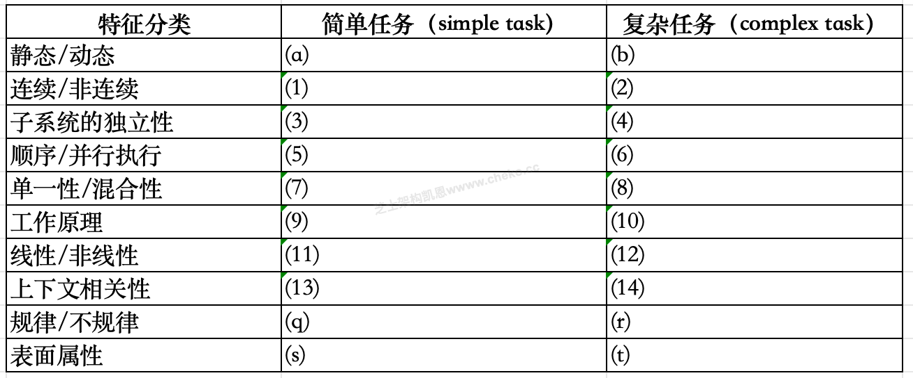

# 案例题_嵌入式系统架构设计

- 对应软考高级系统架构设计师章节：系统质量属性与架构评估、未来信息综合技术、嵌入式系统架构设计理论与实践、通信系统架构设计理论与实践

- 大题数量：4
- 小问数量：11

---

> **知识点分组：嵌入式开放式架构**

## 1. 2020年11月第3题（嵌入式开放式架构）

- 题号：0020200501003
- 题目标签：嵌入式开放式架构
- 难度：简单
- 频率：中频
- 浓缩知识点：嵌入式开放式架构；重点围绕题干场景、架构决策与质量属性进行分析。

### 题目说明

阅读以下关于开放式嵌入式软件架构设计的相关描述，回答问题1至问题3。
[说明]
某公司一直从事宇航系统研制任务，随着宇航产品综合化、网络化技术发展的需要，公司的业务量急剧增加，研制新的软件架构已迫在眉睫。公司架构师王工广泛调研了多种现代架构的基础，建议采用基于FACE (Future Airborne Capability Environment)的宇航系统开放式软件架构，以实现宇航系统的跨平台复用，实现宇航软件高质量、低成本的开发。公司领导肯定了王工的提案，并指出公司要全面实施基于FACE的开放式软件架构，应注意每个具体项目在实施中如何有效实现从需求到架构设计的关系，掌握基于软件需求的软件架构设计方法，并做好开放式软件架构中各段间的接口标准化设计工作。

### 问题1

王工指出，软件开发中需求分析是根本，架构设计是核心，不考虑软件需求便进行软件架构设计很可能导致架构设计的失败，因此，如何把软件需求映射到软件架构至关重要。请从描述语言、非功能性需求描述、需求和架构的一致性等三个方面，用 300字以内的文字说明软件需求到架构的映射存在哪些难点。

**参考答案**

(1)需求和架构描述语言存在差异:软件需求是频繁获取的非正规的自然语言，而软件架构常用的是一种正式语言。
(2)非功能属性难于在架构中描述:系统属性中描述的非功能性需求通常很难在架构模型中形成规约。
(3)需求和架构的一致性难以保障:从软件需求映射到软件架构的过程中，保持-.致性和可追溯性很难，且复杂程度很高，因为单一的软件需求可能定位到多个软件架构的关注点。反之，架构元素也可能有多个软件需求。

**答案解析**

软件需求是指为用户解决某一问题或达到某一目标所需的软件功能；系统或系统构件为了满足合同、规约、标准或其他正式实行的文档而必须满足或具备的软件功能。
软件需求包括三个不同的层次：业务需求、用户需求和功能需求；软件需求规格说明还应包括非功能需求，它描述了系统展现给用户的行为和执行的操作等。它包括产品必须遵从的标准、规范和合约；外部界面的具体细节；性能要求；设计或实现的约束条件及质量属性。
架构，又名软件架构，是有关软件整体结构与组件的抽象描述，用于指导大型软件系统各个方面的设计。
通常在软件开发过程中，需求会随着开发深入而有所变化，而架构又不能完全地将需求全部反映出来，因此，如何把软件需求映射到软件架构是至关重要的一个问题。
（1）从描述语言方面来讲：软件需求是频繁获取的非正规的自然语言，而软件架构常用的是一种正式语言。
（2）从非功能性需求描述方面来讲：系统属性中描述的非功能性需求通常很难在架构模型中形成规约。
（3）从需求和架构的一致性方面来讲：从软件需求映射到软件架构的过程中，保持一致性和可追溯性很难，且复杂程度很高，因为单一的软件需求可能定位到多个软件架构的关注点。反之，架构元素也可能有多个软件需求。

**浓缩知识点**：嵌入式开放式架构 (1)需求和架构描述语言存在差异:软件需求是频繁获取的非正规的自然语言，而软件架构常用的是一种正式语言。 (2)非功能属性难于在架构中描述:系统属性中描述的非功能性需求通常很难在架构模型中形成规约。 软件需求是指为用户解决某一问题或达到某一目标所需的软件功能；系统或系统构件为了满足合同、规约、标准或其他正式实行的文档而必须满足或具备的软件功能。 软件需求包括三个不同的层次：业务需求、用户需求和功能需求；软件需求规格说明还应包括非功能需求，它描述了系统展现给用户的行为和执行的操作等。它包括产品必须遵从的标准、规范和合约；外部界面的具体细节；性能要求；设计或实现的约束条件及质量属

---

### 问题2

图3-1是王工给出的FACE架构布局，包括操作系统、I/O 服务、平台服务、传输服务和可移植组件等5个段;操作系统、I/0 和传输等3个标准接口。请分析图3-1给出的FACE架构的相关信息，用300字以内的文字简要说明FACE5个段的含义。

**参考答案**

操作系统服务段:为FACE架构其他段提供操作系统、运行时和操作系统级健康监控等服务。通过开放式OSGi框架为上层功能提供OS标准接口，并可实现上层组件的即插即用能力。I/0服务段:主要针对专用I/O设备进行抽象，屏蔽平台服务段软件与硬件设备的关系。由于图形服务软件和GPU处理器紧密相关，因此I/0服务段不对GPU驱动进行抽象。，平台服务段:主要是指用户需要的共性软件，如:系统级健康监控(HM)、配置、日志和流媒体等服务。本段可包括平台公共服务、平台设备服务和平台图像服务等三类。传输服务段:主要为.上层可移植组件段提供平台性的数据交换服务。可移植组件将通过传输服务段提供的服务实现交换，禁止组件间直接调用。可移植组件段:提供了多组件使用能力和功能服务。主要包括公共服务和可移植组件两类。

**答案解析**

FACE架构布局包括操作系统、I/O服务、平台服务、传输服务和可移植组件等5个段，其中操作系统、I/O和传输是3个标准接口。简要说明FACE5个段的含义如下：
操作系统：这个段指的是操作系统提供的基本功能和服务，包括处理器管理、内存管理、文件系统等。操作系统提供了软件与硬件之间的接口，为应用程序提供运行环境。
I/O服务：I/O服务段包括输入/输出服务，用于管理系统与外部设备之间的数据传输。这个段涵盖了与外部设备交互的功能，如文件读写、网络通信等。
平台服务：平台服务段提供了一系列通用的服务和功能，如安全性、日志记录、配置管理等。这个段的目的是提供一些通用的服务，以支持系统的稳定性和可靠性。
传输服务：传输服务段涵盖了数据传输和通信相关的功能，包括网络通信、数据传输协议等。这个段负责处理数据在系统内部和系统外部之间的传输。
可移植组件：可移植组件段包括可以在不同平台上移植和重用的组件，如库、工具等。这个段的目的是提供可重用的组件，以便在不同系统中实现相似的功能。

**浓缩知识点**：嵌入式开放式架构 操作系统服务段:为FACE架构其他段提供操作系统、运行时和操作系统级健康监控等服务。通过开放式OSGi框架为上层功能提供OS标准接口，并可实现上层组件的即插即用能力。I/0服务段:主要针对专用I/O设备进行抽象，屏蔽平台服务段软件与硬件设备的关系。由于图形服务软件和GPU处理器紧密相关，因此I/0服务段不对GPU驱动进行抽象。，平台服务段:主要是指用户需要的共性软件，如:系统级健康监控(HM)、配置、日志和流媒体等服务。本段可包括平台公共服务、平台设备服务和平台图像服务等三类。传输服务段:主要为.上层可移植组件段提供平台性的数据交换服务。可移植组件将通过传输服务段提供的服务实

---

### 问题3

FACE架构的核心能力是可支持应用程序的跨平台执行和可移植性，要达到可移植能力，必须解决应用程序的紧耦合和封装的障碍。请用200字以内的文字简要说明在可移植性上，应用程序的紧耦合和封装问题的主要表现分别是什么，并给出解决方案。

**参考答案**

紧耦合问题主要表现在: I/O 问题、业务逻辑问题和表现问题。解决方案:可采用分离原则，通过隔离实现硬件特定信息和少数模块的代码，减少耦合性。封装问题主要表现在: ICD 硬编码问题、组件的紧耦合问题、直接调用问题。解决方案:可以通过提供数据源或槽的软件服务的方法，将紧耦合组件分解出应用程序，并将平台相关部分加入计算环境中，在计算平台内提供数据源或槽的软件服务，并实现接口标准化。

**答案解析**

在可移植性上，应用程序的紧耦合和封装问题主要表现为：紧耦合：应用程序中各个模块之间存在较强的依赖关系，一个模块的修改可能会影响其他模块，导致难以将模块独立地移植到其他平台。封装问题：应用程序的某些功能或数据没有良好的封装，导致与特定平台相关的部分与通用部分混合在一起，使得移植时难以区分和处理。
解决方案包括：松耦合设计：通过使用接口、抽象类等方式降低模块之间的耦合度，使模块之间的依赖关系更加灵活，便于在不同平台上移植和重用。良好的封装：将与特定平台相关的部分进行良好的封装，使其与通用部分分离，提高模块的独立性和可移植性。通过封装，可以隐藏平台相关细节，使得应用程序更易于移植到不同平台上。

**浓缩知识点**：嵌入式开放式架构 紧耦合问题主要表现在: I/O 问题、业务逻辑问题和表现问题。解决方案:可采用分离原则，通过隔离实现硬件特定信息和少数模块的代码，减少耦合性。封装问题主要表现在: ICD 硬编码问题、组件的紧耦合问题、直接调用问题。解决方案:可以通过提供数据源或槽的软件服务的方法，将紧耦合组件分解出应用程序，并将平台相关部分加入计算环境中，在计算平台内提供数据源或槽的软件服务，并实现接口标准化。 在可移植性上，应用程序的紧耦合和封装问题主要表现为：紧耦合：应用程序中各个模块之间存在较强的依赖关系，一个模块的修改可能会影响其他模块，导致难以将模块独立地移植到其他平台。封装问题：应用程序的某些功

---

> **知识点分组：实时系统与 RTOS**

## 2. 2016年11月第3题（实时系统与 RTOS）

- 题号：0020160501003
- 题目标签：实时系统与 RTOS
- 难度：简单
- 频率：中频
- 浓缩知识点：实时系统与 RTOS；重点围绕题干场景、架构决策与质量属性进行分析。

### 题目说明

阅读以下关于嵌入式实时系统设计的描述，回答问题1至问题3。
【说明】
嵌入式系统是当前航空、航天、船舶及工业、医疗等领域的核心技术，嵌入式系统可包括实时系统与非实时系统两种。某宇航公司长期从事航空航天飞行器电子设备的研制工作，随着业务的扩大，需要大量大学毕业生补充到科研生产部门。按照公司规定，大学毕业生必须进行相关基础知识培训，为此，公司经理安排王工对他们进行了长达一个月的培训。

### 问题1

王工在培训中指出：嵌入式系统主要负责对设备的各种传感器进行管理与控制。而航空航天飞行器的电子设备由于对时间具有很强的敏感性，通常由嵌入式实时系统进行管控，请用300字以内文字说明什么是实时系统，实时系统有哪些主要特性。

**参考答案**

实时系统是指向系统发出指令后，在一个极短的时间内，系统回复结果。实时系统的特性：
（1）时间约束性（及时性）
（2）可预测性
（3）高可靠性
（4）与外部环境的交互作用性
（5）多任务类型
（6）约束的复杂性
（7）具有短暂超载的特点

**答案解析**

实时系统的定义:实时系统是指能够在 特定时间约束内完成指定功能 的计算机系统，它不仅要保证功能正确，还要保证在时间限制下完成。例如，飞行控制系统必须在几毫秒内对姿态变化作出响应，否则飞行器可能失控。实时系统可分为 硬实时系统 和 软实时系统。硬实时系统必须严格满足时间要求（如火箭点火控制），任何延迟都不可接受；软实时系统允许偶尔违反时间约束（如多媒体播放），但总体性能需可接受。
实时系统的主要特性:
时间约束性：这是实时系统的核心，即任务必须在截止时间内完成，否则会导致功能失效或灾难性后果。
可预测性：系统必须能够对执行时间和行为进行预测，调度策略应确保任务在预期范围内完成。
高可靠性：系统通常应用于航空、医疗等安全关键场景，必须具备长时间稳定运行的能力。
与外部环境交互性：实时系统通常依赖传感器与执行器，必须能够即时响应外部环境变化。
多任务性：需要同时处理多种并发任务，例如数据采集、信号处理和控制指令。
复杂约束性：涉及资源限制、优先级分配和实时调度，约束条件复杂。
短暂超载处理：在某些情况下，实时系统必须能应对短时间的超载任务，仍保持基本功能。

**浓缩知识点**：实时系统与 RTOS 实时系统是指向系统发出指令后，在一个极短的时间内，系统回复结果。实时系统的特性： （1）时间约束性（及时性） 实时系统的定义:实时系统是指能够在 特定时间约束内完成指定功能 的计算机系统，它不仅要保证功能正确，还要保证在时间限制下完成。例如，飞行控制系统必须在几毫秒内对姿态变化作出响应，否则飞行器可能失控。实时系统可分为 硬实时系统 和 软实时系统。硬实时系统必须严格满足时间要求（如火箭点火控制），任何延迟都不可接受；软实时系统允许偶尔违反时间约束（如多媒体播放），但总体性能需可接受。 实时系统的主要特性:

---

### 问题2

实时系统根据应用场景、时间特征以及工作方式的不同，存在多种实时特性，大致有三种分类方法，即时间类别、时间需求和工作方式结构。根据自己所掌握的"实时性"知识，将图3-1给出的实时特性按三种分类方式，填写图3-1中（1）～（8）处空白。
备选答案：时限的危害程度；时间角色；弱；时间响应；固定；时限／反应时间；时间明确；输入／输出激励；时间触发；强；周期／零星／非周期；事件触发。

**参考答案**

（1）强
（2）（3）时间响应、时间明确
（4）（5）（6）时限/反应时间、输入/输出激励、周期/零星/非周期
（7）（8）时间触发、事件触发

**答案解析**

时间类别分类（1）:在“时限的危害程度”维度下，实时系统可分为 强实时 与 弱实时。强实时要求任务严格按时完成，否则会造成严重后果（如导弹制导）。因此（1）填“强”。
时间角色分类（2）（3） 实时系统在不同任务中可承担不同时间角色：
（2）时间响应：表示系统必须对外部事件在时间约束内做出反应，例如传感器检测到异常信号后立即调整飞行姿态。
（3）时间明确：系统的行为是可预测的，执行时间确定，例如任务调度在固定周期执行。
时间需求分类（4）（5）（6）
（4）时限/反应时间：系统必须在任务规定的截止时间前完成。
（5）输入/输出激励：实时任务通常由外部输入触发，并要求在输出端及时响应。
（6）周期/零星/非周期：任务的触发方式多样，有些是周期性的（如采样），有些是零星或非周期事件（如外部中断）。
工作方式结构分类（7）（8）
（7）时间触发：系统按照预设时间点启动任务，例如定时任务。
（8）事件触发：由外部事件（如中断信号）引起任务执行。
综上，时间角色你需要理解成系统中和时序相关的两种设计。响应任务和定时任务。时间需求是针对这两种设计的评价方式。

**浓缩知识点**：实时系统与 RTOS （1）强 （2）（3）时间响应、时间明确 时间类别分类（1）:在“时限的危害程度”维度下，实时系统可分为 强实时 与 弱实时。强实时要求任务严格按时完成，否则会造成严重后果（如导弹制导）。因此（1）填“强”。 时间角色分类（2）（3） 实时系统在不同任务中可承担不同时间角色：

---

### 问题3

可靠性是实时系统的关键特性之一，区分软件的错误（Error）、缺陷（Defect）、故障（Fault）和失效（Failure）概念是软件可靠性设计工作的基础。请简要说明错误、缺陷、故障和失效的定义；并在图3-2中标出错误、缺陷和失效出现阶段，说明缺陷、故障和失效的表现形式，填写图3-2中（1）～（6)）处的空白。

**参考答案**

软件错误：软件错误是指在软件生存期内的不希望或不可接受的人为错误，其结果是导致软件缺陷的产生。
软件缺陷：软件缺陷是指存在于软件（文档、数据、程序）之中的那些不希望或不可接受的偏差。
软件故障：软件故障是指软件运行过程中出现的一种不希望或不可接受的内部状态。
软件失效：软件失效是指软件运行时产生 的一种不希望或不可接受的外部行为结果。
（1）存在
（2）引起
（3）用户经历
（4）在开发过程中
（5）在产品中
（6）在运行时

**答案解析**

错误（Error）：错误是人类活动中的失误或思维偏差，通常发生在 需求分析、设计或编码阶段。例如开发人员误解需求或实现逻辑错误。错误本身并不会直接影响用户，但会导致缺陷的引入。
缺陷（Defect）：缺陷是由错误引入到软件制品中的 潜在问题，它存在于程序代码、设计文档或数据库中。例如一个数组越界问题就是典型缺陷。缺陷存在于软件制品之中，即（1）“存在”，并由错误（2）“引起”。
故障（Fault）：当缺陷在运行时被激活时，就会形成 故障。故障属于系统的内部状态，例如内存溢出、变量取值错误。故障通常表现为软件运行中不正确的中间状态，它存在（5）“在产品中”。
失效（Failure）：失效是故障在外部表现出的 可见错误行为，例如程序崩溃、输出结果错误等，这是用户（3）“经历”到的结果。失效发生（6）“在运行时”，表现为系统未能满足预期需求。
因此四者的关系可描述为：错误 → 缺陷 → 故障 → 失效。
错误（产生阶段：开发过程中，4）；
缺陷（存在于产品中，5）；
故障（被激活后导致内部异常）；
失效（运行时被用户感知，6）。

**浓缩知识点**：实时系统与 RTOS 软件错误：软件错误是指在软件生存期内的不希望或不可接受的人为错误，其结果是导致软件缺陷的产生。 软件缺陷：软件缺陷是指存在于软件（文档、数据、程序）之中的那些不希望或不可接受的偏差。 错误（Error）：错误是人类活动中的失误或思维偏差，通常发生在 需求分析、设计或编码阶段。例如开发人员误解需求或实现逻辑错误。错误本身并不会直接影响用户，但会导致缺陷的引入。 缺陷（Defect）：缺陷是由错误引入到软件制品中的 潜在问题，它存在于程序代码、设计文档或数据库中。例如一个数组越界问题就是典型缺陷。缺陷存在于软件制品之中，即（1）“存在”，并由错误（2）“引起”。

---

## 3. 2018年11月第3题（实时系统与 RTOS）

- 题号：0020180501003
- 题目标签：实时系统与 RTOS
- 难度：简单
- 频率：中频
- 浓缩知识点：实时系统与 RTOS；重点围绕题干场景、架构决策与质量属性进行分析。

### 题目说明

阅读以下关于嵌入式实时系统相关技术的叙述，在答题纸上回答问题1和问题2。
【说明】
某公司长期从事宇航领域嵌入式实时系统的软件研制任务。公司为了适应未来嵌入式系统网络化、智能化和综合化的技术发展需要，决定重新考虑新产品的架构问题，经理将论证工作交给王工负责。王工经调研和分析，完成了新产品架构设计方案，提交公司高层讨论。

### 问题1

王工提交的设计方案中指出：由于公司目前研制的嵌入式实时产品属于简单型系统，其嵌入式子系统相互独立，功能单一，时序简单。而未来满足网络化、智能化和综合化的嵌入式实时系统将是一种复杂系统，其核心特征体现为实时任务的机理、状态和行为的复杂性。简单任务和复杂任务的特征区分主要表现在十个方面。请参考表3-1给出的实时任务特征分类，用题干中给出的（a）~（t）20个实时任务特征描述，补充完善表3-1给出的空（1）~（14）。
（a）任务属性不会随时间变化而改变；
（b）任务的属性与时间相关；
（c）任务仅可以从非连续集中获取特征变量；
（d）任务变量域是连续的；
（e）功能原理不依赖于上下文；
（f） 功能原理依赖于上下文；
（g）任务行为可以用step-by-step顺序分析方法来理解；
（h）许多任务在产生访问活动时相互间是并发处理的，很难用step-by-step方法分析；
（i） 因果关系相互影响；
（j） 行为特征依赖于大量的反馈机制；
（k）系统内构成、策略和描述是相似的；
（l） 系统内存在许多不同的构成、策略和描述；
（m）功能关系是非线性的；
（n） 功能关系是线性的；
（o） 不同的子任务是相互独立的，任务内部仅存在少量的交互操作；
（p） 不同的子任务有很高的交互操作，要把一个单任务的行为隔离开是困难的；
（q） 域特征有非常整齐的原则和规则；
（r） 许多不同的上下文依赖于规则；
（s） 原理和规则在表面属性上很容易被识别；
（t） 原理被覆盖、抽象，而不会在表面属性上被识别。

**参考答案**

（1）（c） （2）（d） （3）（o） （4）（p）
（5）（g） （6）（h） （7）（k） （8）（l）
（9）（i） （10）（j） （11）（n） （12）（m）
（13）（e） （14）（f）

**答案解析**

本题考查嵌入式实时任务特征分类。在嵌入式实时系统中，任务可以分为简单任务与复杂任务。
简单任务多见于独立型嵌入式设备（如单功能传感器控制），而复杂任务往往出现在网络化、智能化装备中（如飞控系统、卫星姿态控制）。它们的区别主要体现在十个方面：①静态/动态特性：简单任务属性固定，不随时间改变，而复杂任务与时间紧密相关；②非连续/连续性：简单任务特征变量不连续，而复杂任务变量域连续；③独立/交互性：简单子任务相互独立，复杂任务交互性强；④顺序/并行性：简单任务可逐步分析，而复杂任务常有并发处理；⑤相似/多样性：简单任务结构策略相似，复杂任务存在多种构成与描述；⑥因果/反馈性：简单任务因果关系明确，复杂任务依赖大量反馈机制；⑦线性/非线性：简单任务功能关系线性，复杂任务呈非线性；⑧上下文无关/相关：简单任务原理与上下文无关，复杂任务需依赖上下文；⑨规则性：简单任务规则整齐易识别，复杂任务规则受上下文影响，不规律。
因此，在表 3-1 中，（1）～（14）的匹配结果正体现了这些对比特征。例如，简单任务的“功能原理不依赖上下文（e）”对应复杂任务的“功能原理依赖上下文（f）”；简单任务“顺序分析（g）”对应复杂任务“并发分析困难（h）”；简单任务“线性关系（n）”对应复杂任务“非线性关系（m）”。通过这种对比，可以看出复杂实时任务具备高动态性、高交互性与强反馈依赖，这正是未来网络化、智能化嵌入式系统的本质特征。

**浓缩知识点**：实时系统与 RTOS （1）（c） （2）（d） （3）（o） （4）（p） （5）（g） （6）（h） （7）（k） （8）（l） 本题考查嵌入式实时任务特征分类。在嵌入式实时系统中，任务可以分为简单任务与复杂任务。 简单任务多见于独立型嵌入式设备（如单功能传感器控制），而复杂任务往往出现在网络化、智能化装备中（如飞控系统、卫星姿态控制）。它们的区别主要体现在十个方面：①静态/动态特性：简单任务属性固定，不随时间改变，而复杂任务与时间紧密相关；②非连续/连续性：简单任务特征变量不连续，而复杂任务变量域连续；③独立/交互性：简单子任务相互独立，复杂任务交互性强；④顺序/并行性：简单任务可逐步分

---

### 问题2

工设计方案中指出：要满足未来网络化、智能化和综合化的需求，应该设计一种能够充分表达嵌入式系统行为的、且具有一定通用性的通信架构， 以避免复杂任务的某些特征带来的通信复杂性。通常为了实现嵌入式系统中计算组件间的通信，在架构上需要一种简单的架构风格，用于屏蔽不同协议、不同硬件和不同结构组成所带来的复杂性。图3-1给出了一种"腰（Waistline）" 型通信模式的架构风格。腰型架构的关键是基本消息通信（BMTS），通常BMTS的消息与时间属性相关，支持事件触发消息、速率约束消息和时间触发消息。
请用400以内的文字说明基于BMTS的消息通信网络的主要特征和上述三种消息的基本含义，并举例给出两种具有时间触发消息能力的网络总线。

**参考答案**

BMTS的消息通信网络主要特征为：一个计算组件传输消息到另一个或多个接收组件，传输可靠性高，延迟低，抖动微小。
事件触发消息：以事件作为触发方式，事件发生便触发相应消息。
速率约束消息：消息偶发性产生，而不考虑发送者承诺消息不超出最大消息速率。
时间触发消息：发送者和接收者遵循一个精确的时间片周期完成消息的发送与接收。
具有时间触发消息能力的网络总线：航空电子全双工交换式以太网（Avionics Full Duplex Switched Ethernet，AFDX），时间触发以太网（Time-Triggered Ethernet，TTE），FC（Fiber Channel）总线

**答案解析**

BMTS（Basic Message Transmission System，基本消息传输系统）是一种“腰型架构”的核心机制，其目标是屏蔽底层协议、硬件差异，为上层计算组件提供统一的消息通信接口。其特征包括：①支持一对一或一对多消息传输；②在实时环境下保持低延迟和小抖动；③适应多种消息模式，满足不同实时任务需求。
在 BMTS 中，事件触发消息适合突发事件处理，如传感器告警；速率约束消息适合周期不严格但有速率上限的场景，如状态更新；时间触发消息则适合高可靠、强实时的场景，如飞控指令分发。当前具有时间触发能力的总线包括 TTE、AFDX 和 FC，它们广泛应用于航空航天和高可靠嵌入式系统，保证任务在严格时间约束下执行，是未来嵌入式实时系统实现网络化、智能化的基础通信技术。

**浓缩知识点**：实时系统与 RTOS BMTS的消息通信网络主要特征为：一个计算组件传输消息到另一个或多个接收组件，传输可靠性高，延迟低，抖动微小。 事件触发消息：以事件作为触发方式，事件发生便触发相应消息。 BMTS（Basic Message Transmission System，基本消息传输系统）是一种“腰型架构”的核心机制，其目标是屏蔽底层协议、硬件差异，为上层计算组件提供统一的消息通信接口。其特征包括：①支持一对一或一对多消息传输；②在实时环境下保持低延迟和小抖动；③适应多种消息模式，满足不同实时任务需求。 在 BMTS 中，事件触发消息适合突发事件处理，如传感器告警；速率约束消息适合周期不严格但

---

> **知识点分组：物联网与 CPS**

## 4. 2019年11月第3题（物联网与 CPS）

- 题号：0020190501003
- 题目标签：物联网与 CPS
- 难度：简单
- 频率：中频
- 浓缩知识点：物联网与 CPS；重点围绕题干场景、架构决策与质量属性进行分析。

### 题目说明

阅读以下关于嵌入式系统开放式架构相关技术的描述，在答题纸上回答问题1至问题3。
【说明】
信息物理系统（Cyber Physical Systems，CPS）技术已成为未来宇航装备发展的重点关键技术之一。某公司长期从事嵌入式系统的研制工作 ，随着公司业务范围不断扩展，公司决定进入宇航装备的研制领域。为了做好前期准备，公司决定让王工程师负责编制公司进军宇航装备领域的战略规划。王工经调研和分析，认为未来宇航装备将向着网络化、智能化和综合化的目标发展，CPS 将会是宇航装备的核心技术，公司应构建基于CPS技术的新产品架构，实现超前的技术战略储备。

### 问题1

通常CPS结构分为感知层、网络层和控制层，请用300字以内文字说明CPS的定义，并简要说明各层的含义。

**参考答案**

信息物理系统（Cyber Physical Systems，CPS）作为计算进程和物理进程的统一体，是集计算、通信与控制于一体的下一代智能系统。信息物理系统通过人机交互接口实现和物理进程的交互，使用网络化空间，以远程的、可靠的、实时的、安全的、协作的方式操控一个物理实体。
感知层：主要由传感器、控制器和采集器等设备组成，它属于信息物理系统中的末端设备。
网络层：主要是连接信息世界和物理世界的桥梁，实现的是数据传输，为系统提供实时的网络服务，保证网络分组传输的实时可靠。
控制层：主要是根据认知结果及物理设备传回来的数据进行相应的分析，将相应的结果返回给客户端。

**答案解析**

信息物理系统（CPS）是未来智能装备的核心基础，其本质是通过3C 技术（计算、通信、控制）的深度融合，实现物理实体与网络空间的高效交互。与传统嵌入式系统相比，CPS 不仅关注单一设备的控制，还强调多个子系统之间的网络化协同，使系统具备实时感知、动态控制与自适应能力。这使得 CPS 在宇航、工业控制、智能制造、智能交通等领域具有广阔应用前景。
CPS 的三层结构明确了不同层次的功能分工。感知层主要是各种传感器和末端设备，负责将物理环境的数据采集并上报，是数据来源的基础；网络层是物理世界与信息世界的桥梁，保证信息能够低时延、可靠、安全地传输，是实现远程控制与分布式协作的关键；控制层则是系统的大脑，负责数据分析、逻辑判断和决策，并向执行机构下发指令。三层协作，构成了一个闭环的感知—传输—控制系统，确保 CPS 在复杂应用环境中具备高效、智能和安全的运行能力。

**浓缩知识点**：物联网与 CPS 信息物理系统（Cyber Physical Systems，CPS）作为计算进程和物理进程的统一体，是集计算、通信与控制于一体的下一代智能系统。信息物理系统通过人机交互接口实现和物理进程的交互，使用网络化空间，以远程的、可靠的、实时的、安全的、协作的方式操控一个物理实体。 感知层：主要由传感器、控制器和采集器等设备组成，它属于信息物理系统中的末端设备。 信息物理系统（CPS）是未来智能装备的核心基础，其本质是通过3C 技术（计算、通信、控制）的深度融合，实现物理实体与网络空间的高效交互。与传统嵌入式系统相比，CPS 不仅关注单一设备的控制，还强调多个子系统之间的网络化协同，使

---

### 问题2

王工在提交的战略规划中指出：飞行器中的电子设备是一个大型分布式系统，其传感器、控制器和采集器分布在飞机各个部位，相互间采用高速总线互连，实现子系统间的数据交换，而飞行员或地面指挥系统根据飞行数据的汇总决策飞行任务的执行。图3-1给出了飞行器系统功能组成图。
请参考图3-1给出的功能图，依据你所掌握的CPS知识，说明以下所列的功能分别属于CPS结构中的哪层，哪项功能不属于CPS任何一层。
飞行传感器管理
步进电机控制
显控
发电机控制
环控
配电管理
转速传感器
传感器总线
飞行员
火警信号探测

**参考答案**

感知层：2、4、7、10
网络层：8
控制层：1、3、5、6
不属于 CPS 结构中的功能：9

**答案解析**

飞行器电子设备是一个典型的 分布式 CPS 系统。其传感器、控制器、采集器分布在机体各处，通过高速总线互联，实现对飞行状态、环境参数、设备运行的实时监测与控制。
根据三层架构，可将图 3-1 中的功能逐一对应到 CPS 层次。感知层负责对物理环境进行直接交互，例如电机控制、发电机运行、转速测量、火警信号探测等，均是传感器或执行器的职能；网络层则体现在数据传输渠道，这里是传感器总线，起到连接不同部件的桥梁作用；控制层则负责综合管理与决策，包括飞行传感器管理、显示控制（显控）、环境控制（环控）、配电管理等，它们基于感知数据进行分析并下发指令。
特别需要注意的是“飞行员”。飞行员作为系统的操作者，是通过人机交互接口与 CPS 进行交互的对象，但不属于 CPS 系统本身的层次。因此，应将飞行员排除在 CPS 三层之外，而视为外部控制主体。这也说明 CPS 不仅包括设备与网络本身，还需要与人机交互、地面指挥系统结合，才能完成复杂任务。

**浓缩知识点**：物联网与 CPS 感知层：2、4、7、10 网络层：8 飞行器电子设备是一个典型的 分布式 CPS 系统。其传感器、控制器、采集器分布在机体各处，通过高速总线互联，实现对飞行状态、环境参数、设备运行的实时监测与控制。 根据三层架构，可将图 3-1 中的功能逐一对应到 CPS 层次。感知层负责对物理环境进行直接交互，例如电机控制、发电机运行、转速测量、火警信号探测等，均是传感器或执行器的职能；网络层则体现在数据传输渠道，这里是传感器总线，起到连接不同部件的桥梁作用；控制层则负责综合管理与决策，包括飞行传感器管理、显示控制（显控）、环境控制（环控）、配电管理等，它们基于感知数据进行分析并下发指令。

---

### 问题3

王工在提交的战略规划中指出：未来宇航领域装备将呈现网络化、智能化和综合化等特征，形成集群式的协同能力，安全性尤为重要。在宇航领域的CPS系统中，不同层面上都会存在一定的安全威胁。请用100字以内文字说明CPS系统会存在哪三类安全威胁，并对每类安全威胁至少举出两个例子说明。

**参考答案**

（1）感知层安全威胁：感知数据破坏、信息窃听、节点捕获。
（2）网络层安全威胁：拒绝服务攻击、选择性转发、方向误导攻击。
（3）控制层安全威胁：用户隐私泄露、恶意代码、非授权访问。

**答案解析**

CPS 的核心问题之一是系统安全。由于 CPS 融合了物理世界与网络空间，任何安全漏洞都可能导致严重的物理后果。安全威胁主要体现在三层：
①感知层，作为数据入口，面临物理节点被捕获、传感器数据篡改或窃听的问题，例如攻击者篡改飞行器温度传感器数据，会导致错误决策；
②网络层，面临拒绝服务（DoS）、选择性转发或路由误导攻击，导致数据无法可靠传输，例如攻击者阻塞飞控总线会导致飞行系统瘫痪；
③控制层，作为决策大脑，若被注入恶意代码或非授权访问，可能直接造成任务失败或设备损坏，例如攻击者植入木马程序窃取飞行数据，或绕过权限系统操纵飞行任务。CPS 安全不仅要求传统的信息安全手段，还必须结合物理安全、冗余设计和容错控制，才能保障宇航装备的稳定运行。

**浓缩知识点**：物联网与 CPS （1）感知层安全威胁：感知数据破坏、信息窃听、节点捕获。 （2）网络层安全威胁：拒绝服务攻击、选择性转发、方向误导攻击。 CPS 的核心问题之一是系统安全。由于 CPS 融合了物理世界与网络空间，任何安全漏洞都可能导致严重的物理后果。安全威胁主要体现在三层： ①感知层，作为数据入口，面临物理节点被捕获、传感器数据篡改或窃听的问题，例如攻击者篡改飞行器温度传感器数据，会导致错误决策；

---
