# 案例题_数据库系统与缓存设计

- 对应软考高级系统架构设计师章节：数据库设计基础知识、系统质量属性与架构评估、云原生架构设计理论与实践、大数据架构设计理论与实践

- 大题数量：18
- 小问数量：54

---

> **知识点分组：大数据处理与数据挖掘**

## 1. 2023年11月第1题（大数据处理与数据挖掘）

- 题号：0020230501001
- 题目标签：大数据处理与数据挖掘
- 难度：困难
- 频率：中频
- 浓缩知识点：大数据处理与数据挖掘；重点围绕题干场景、架构决策与质量属性进行分析。

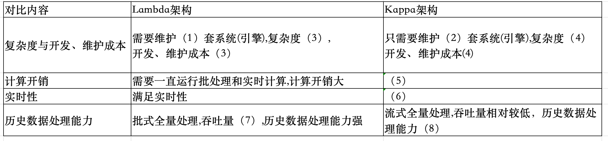
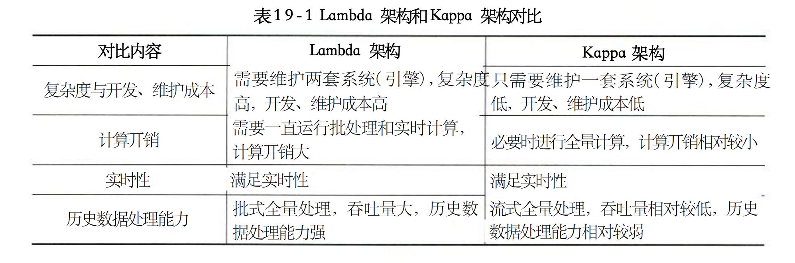

### 问题1

请根据Lambda架构和Kappa架构特点，填写以下表格。
#1846px #429px

**参考答案**

（1） 2
（2） 1
（3）高
（4）低
（5）必要时进行全量计算，计算开销相对较小
（6）满足实时性
（7）大
（8）弱

**答案解析**

此题出自 19 章大数据架构原图，有关对比类概念类是案例第一题常考的内容，需要好好重视。

**浓缩知识点**：大数据处理与数据挖掘 （1） 2 （2） 1 此题出自 19 章大数据架构原图，有关对比类概念类是案例第一题常考的内容，需要好好重视。

---

### 问题2

下图给出了某网奥运的大数据架构图，请根据下面的 (a)~ (n) 的相关技术，判断这些技术属于架构图的哪个部分，补充完善下图1的 (1) - (9) 的空白处。
(a) Nginx;(b) Hbase;(c) Spark Streaming(d) Spark;(e) MapReduce;(f) ETL;(g) MemSQL; (h) HDFS; (i)Sqoop; (j) Flume ; (k)数据存储层; (I) kafka;（m）业务逻辑层；(n）数据采集层

**参考答案**

(1)d (2)e (3)k (4)g (5)h (6)l (7)j (8)f (9)n

**答案解析**

此题出自 19 章大数据架构原图，此类架构图也需要好好重视。

**浓缩知识点**：大数据处理与数据挖掘 (1)d (2)e (3)k (4)g (5)h (6)l (7)j (8)f (9)n 此题出自 19 章大数据架构原图，此类架构图也需要好好重视。

---

### 问题3

大数据的架构包括了Lambda架构和Kappa架构，Lambda架构分解为三层，Kappa架构不同于Lambda同时计算流计算和批计算并合并视图，Kappa只会通过流计算一条的数据链路计算并产生视图。请问该系统的大数据架构是基于哪种架构搭建的大数据平台处理奥运会大规模视频网络观看数据。

**参考答案**

该系统的大数据架构是基于Lambda架构搭建的大数据平台处理电运会大规模视频网络观看。

**答案解析**

Lambda架构是一种用于处理大数据的架构设计模式，将数据处理流程分为批处理层、速度层和服务层三个部分。具体来说，Lambda架构包括以下三层：批处理层（Batch Layer）：负责处理大规模数据的批量处理任务，通常使用分布式计算框架（如Hadoop）进行批处理操作，生成批处理视图。速度层（Speed Layer）：负责处理实时数据流，通常使用流处理引擎（如Storm、Spark Streaming）进行实时计算，生成实时视图。服务层（Serving Layer）：负责将批处理层和速度层生成的视图合并，提供统一的查询接口给用户，使用户可以查询批处理和实时处理的结果。
Kappa架构是一种简化的大数据架构设计模式，与Lambda架构不同，Kappa架构只使用流处理引擎来处理数据流，而不区分批处理和实时处理。Kappa架构通过流处理一条数据链路计算并产生视图，简化了架构设计和维护，但也可能在处理大规模数据时性能不如Lambda架构。

**浓缩知识点**：大数据处理与数据挖掘 该系统的大数据架构是基于Lambda架构搭建的大数据平台处理电运会大规模视频网络观看。 Lambda架构是一种用于处理大数据的架构设计模式，将数据处理流程分为批处理层、速度层和服务层三个部分。具体来说，Lambda架构包括以下三层：批处理层（Batch Layer）：负责处理大规模数据的批量处理任务，通常使用分布式计算框架（如Hadoop）进行批处理操作，生成批处理视图。速度层（Speed Layer）：负责处理实时数据流，通常使用流处理引擎（如Storm、Spark Streaming）进行实时计算，生成实时视图。服务层（Serving Layer）：负责将批处理层和速

---

## 2. 2024年5月第5题（大数据处理与数据挖掘）

- 题号：0020240501005
- 题目标签：大数据处理与数据挖掘
- 难度：困难
- 频率：中频
- 浓缩知识点：大数据处理与数据挖掘；重点围绕题干场景、架构决策与质量属性进行分析。

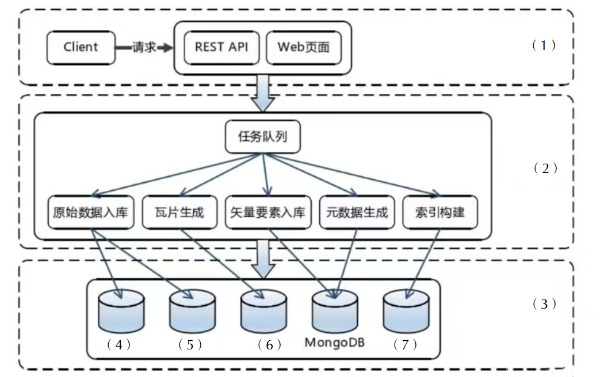

### 问题1

请根据自身作用 把下面的选项填写到上方的系统架构图中。
(1) 接口层 (2) 处理层 (3) 存储层 (4) MySQL (5) HDFS (6) HBase (7) ES

**参考答案**

（1）接口层（2）处理层（3）存储层（4）MySQL （5）HDFS（6）HBase（7）ES

**答案解析**

图中 Client 发送请求到 REST API 和 Web 页面，这部分起到对外提供访问接口、接收请求的作用，符合接口层功能，所以（1）对应接口层 。
任务队列接收来自接口层的请求，并调度原始数据入库、瓦片生成等任务，这些任务处理操作属于对业务逻辑的处理，因此（2）是处理层 。
最下方的数据库用于存储经过处理层处理后的数据，起到数据持久化存储的作用，所以（3）为存储层 。
MySQL是关系型数据库，适用于结构化数据存储。在系统中可用于存储一些结构规整、事务性要求较高的数据，如用户信息等基础数据，可对应到（4） 。
HDFS分布式文件系统，适合存储海量的、一次写入多次读取的数据，像原始地理空间数据等大文件数据，可由它存储，对应（5） 。
HBase基于 Hadoop 的分布式列式数据库，能处理海量数据的随机读写，适合存储像瓦片数据等需要快速查询和更新的数据，对应（6） 。
ES开源分布式搜索和分析引擎，在存储层可用于存储索引数据，方便对数据进行快速检索，比如构建的地理空间数据索引等可存储于此，对应（7） 。

**浓缩知识点**：大数据处理与数据挖掘 （1）接口层（2）处理层（3）存储层（4）MySQL （5）HDFS（6）HBase（7）ES 图中 Client 发送请求到 REST API 和 Web 页面，这部分起到对外提供访问接口、接收请求的作用，符合接口层功能，所以（1）对应接口层 。 任务队列接收来自接口层的请求，并调度原始数据入库、瓦片生成等任务，这些任务处理操作属于对业务逻辑的处理，因此（2）是处理层 。

---

### 问题2

MongoDB如何存储非结构性数据的，MongoDB 矢量化存储的优点。

**参考答案**

MongoDB 是典型的 NoSQL 文档型数据库，其数据存储单位为 BSON 文档。相较关系型数据库需要严格的模式定义，MongoDB 无需固定模式，能灵活存储非结构化或半结构化数据，如 JSON 文档、图像元信息、日志、传感器数据等。同时它支持嵌套文档、数组字段与灵活的索引机制，使得数据结构可以与应用场景自然贴合，避免频繁的表结构变更，适应动态性强的业务需求。
在 矢量化存储方面，MongoDB 支持将高维特征向量（如文本 embedding、图像特征向量）直接存储为字段，并结合向量索引机制实现快速的相似度检索。这在推荐系统、图像搜索、自然语言处理等场景下具有明显优势。例如，将用户兴趣向量存储后，可通过向量相似度检索找到最相关的内容，提升系统智能化水平。其优势在于 兼容分布式架构、高性能搜索、适配 AI 场景。

**答案解析**

MongoDB 矢量化存储 适用于系统架构设计、AI 应用、数据库选型等多种场景。矢量化存储是指将高维特征（如图像特征、文本 embedding 向量、音频信号等）以数组的形式存入数据库中，并能基于相似度进行高效检索的能力。
例如：将一张图片的 ResNet （有兴趣可去了解）向量 [0.01, 0.52, -0.33, ...] 存入数据库，支持找出与某张图片最相似的其他图片。MongoDB 可将向量（通常是 float[]）作为字段直接存储在文档中。

**浓缩知识点**：大数据处理与数据挖掘 MongoDB 是典型的 NoSQL 文档型数据库，其数据存储单位为 BSON 文档。相较关系型数据库需要严格的模式定义，MongoDB 无需固定模式，能灵活存储非结构化或半结构化数据，如 JSON 文档、图像元信息、日志、传感器数据等。同时它支持嵌套文档、数组字段与灵活的索引机制，使得数据结构可以与应用场景自然贴合，避免频繁的表结构变更，适应动态性强的业务需求。 在 矢量化存储方面，MongoDB 支持将高维特征向量（如文本 embedding、图像特征向量）直接存储为字段，并结合向量索引机制实现快速的相似度检索。这在推荐系统、图像搜索、自然语言处理等场景下具有明显优势

---

### 问题3

该系统中 HDFS 使用热数据、温数据和冷数据存储的原因。

**参考答案**

HDFS 采用热数据、温数据和冷数据分层存储，是为了优化性能与降低存储成本。
热数据：访问频繁、响应要求高，通常存储在 SSD 上，读取速度快；
温数据：访问较少，对性能要求一般，适合存储在普通硬盘（如 SATA）上；
冷数据：几乎不访问的历史数据或归档数据，存储在廉价介质如磁带或云冷存储上，节省成本。
这种分级存储策略可根据数据使用频率匹配不同存储资源，实现资源利用最大化、系统运行更高效。

**答案解析**

在大规模地理空间数据处理中，数据量巨大且访问模式差异明显。如果所有数据都存储在高性能介质（如 SSD）上，将导致成本过高，而若全部放在低成本存储上又会影响查询与处理效率。因此需要根据数据访问频率与业务需求进行分层管理。
热数据（如近期瓦片数据、常用索引）需频繁访问，应存储在高性能存储介质，保证实时性与交互体验。温数据（如不常用的历史任务数据）访问相对少，可存储在普通 HDD 以降低成本。冷数据（如归档影像、历史版本数据）几乎不访问，可存放在廉价存储介质如磁带或云冷存储。通过这种 冷热分层存储策略，系统能实现性能与成本的最佳平衡，提高整体资源利用率。

**浓缩知识点**：大数据处理与数据挖掘 HDFS 采用热数据、温数据和冷数据分层存储，是为了优化性能与降低存储成本。 热数据：访问频繁、响应要求高，通常存储在 SSD 上，读取速度快； 在大规模地理空间数据处理中，数据量巨大且访问模式差异明显。如果所有数据都存储在高性能介质（如 SSD）上，将导致成本过高，而若全部放在低成本存储上又会影响查询与处理效率。因此需要根据数据访问频率与业务需求进行分层管理。 热数据（如近期瓦片数据、常用索引）需频繁访问，应存储在高性能存储介质，保证实时性与交互体验。温数据（如不常用的历史任务数据）访问相对少，可存储在普通 HDD 以降低成本。冷数据（如归档影像、历史版本数据）几乎不访

---

> **知识点分组：分布式缓存与高并发**

## 3. 2014年11月第5题（分布式缓存与高并发）

- 题号：0020140501005
- 题目标签：分布式缓存与高并发
- 难度：简单
- 频率：高频
- 浓缩知识点：分布式缓存与高并发；重点围绕题干场景、架构决策与质量属性进行分析。

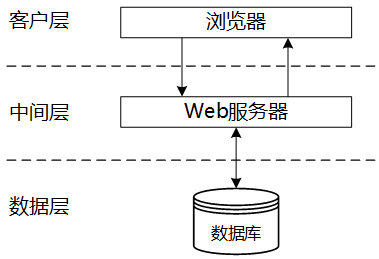
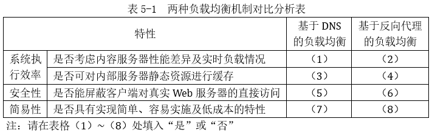

### 问题1

针对目前出现的Web服务器负载过大问题，项目组决定在客户端与中间层Web服务器之间引入负载均衡器，通过中间层Web服务器集群来提高Web请求的并发处理能力。在讨论拟采用的负载均衡机制时，王工提出采用基于DNS的负载均衡机制，而李工则认为应采用基于反向代理的负载均衡机制，项目组经过讨论，最终确定采用李工提出的方案。请用200字以内的文字，分别简要说明两个机制的基本原理，并从系统执行效率、安全性及简易性等方面将两种机制进行对比，将对比结果填入表5-1中。

**参考答案**

基于DNS的负载均衡是在DNS服务器中为同一个主机名配置多个IP 地址，在应答DNS 查询时，DNS 服务器对每个查询将以DNS文件中主机记录的IP地址按顺序返回不同的解析结果，将客户端的访问引导到不同的节点上去，使得不同的客户端访问不同的节点，从而达到负载均衡的目的。
反向代理负载均衡。反向代理负载均衡是将来自Internet上的连接请求以反向代理的方式动态地转发给内部网络上的多个节点进行处理，从而达到负载均衡的目的。
（1）否
（2）是
（3）否
（4）是
（5）否
（6）是
（7）是
（8）否

**答案解析**

DNS负载均衡的原理是利用DNS服务器为一个域名配置多个IP地址，在解析时通过轮询或简单策略将不同的请求分配给不同的服务器节点。这种方式部署简单，几乎不需要额外的硬件或软件支持，适合早期阶段的中小型网站。但是它的缺点也十分明显：其调度策略非常有限，通常只能基于轮询，无法感知后端服务器的实时运行状态。例如当某个节点宕机时，DNS服务器依旧可能将请求分配到该节点，导致客户端访问失败。此外，由于DNS解析结果会缓存于本地和各级DNS服务器，更新延迟较大，不能快速响应负载变化。另外，DNS方式要求每个节点都有公网IP，浪费资源且降低安全性。
反向代理负载均衡则通过在Web服务器集群前增加一个代理层，所有请求首先到达代理，再由代理根据后端节点的实际负载情况进行智能调度。例如可以基于当前连接数、CPU利用率等指标选择最优的节点。这不仅提升了调度的灵活性和执行效率，还能屏蔽后端节点的真实地址，从而增强安全性，防止直接攻击后端服务器。同时反向代理服务器本身还可以结合缓存机制，例如缓存静态资源，进一步提高性能。不过，它的缺点是部署和维护成本较高，当并发量极大时代理服务器本身可能成为瓶颈。
DNS负载均衡适合小规模、低成本场景，但在高并发和高安全需求下，反向代理机制更优。因此，项目组选择了李工提出的反向代理方案。

**浓缩知识点**：分布式缓存与高并发 基于DNS的负载均衡是在DNS服务器中为同一个主机名配置多个IP 地址，在应答DNS 查询时，DNS 服务器对每个查询将以DNS文件中主机记录的IP地址按顺序返回不同的解析结果，将客户端的访问引导到不同的节点上去，使得不同的客户端访问不同的节点，从而达到负载均衡的目的。 反向代理负载均衡。反向代理负载均衡是将来自Internet上的连接请求以反向代理的方式动态地转发给内部网络上的多个节点进行处理，从而达到负载均衡的目的。 DNS负载均衡的原理是利用DNS服务器为一个域名配置多个IP地址，在解析时通过轮询或简单策略将不同的请求分配给不同的服务器节点。这种方式部署简单，几乎不需

---

### 问题2

针对并发数据库访问所带来的磁盘I/O瓶颈问题，项目组决定在数据层引入数据库扩展机制。经过调研得知系统数据库中存储的主要数据为以用户标识为索引的社交网络数据，且系统运行时发生的大部分数据库操作为查询操作。经过讨论，项目组决定引入数据库分区和MySQL主从复制两种扩展机制。数据库分区可采用水平分区和垂直分区两种方式，请用350字以内的文字说明在本系统中应采用哪种方式及其原因，并分析引入主从复制机制给系统带来的好处。

**参考答案**

本系统应采用水平分区，因为社交网络数据库的数据表记录数量非常庞大，而且记录的访问，大多集中于本地区域，所以水平分区能极大提高处理效率。
主从复制机制使得同样的数据，存在多个副本，这样让用户查询数据时，可以选择该数据最近的副本进行访问，提高效率，降低资源使用时的冲突。另一方面主从复制机制中一台数据库服务器故障不会导致站点无法访问。

**答案解析**

数据库扩展常用方法包括 分区（Partitioning） 和 主从复制（Replication）。
在本案例中，数据库中存储的数据是以用户标识为索引的社交网络数据，访问模式主要是“按用户查询”。此类业务特点决定了最合适的分区方式是 水平分区。
水平分区的原理是根据某个分区键（例如用户ID范围或哈希值），将一张大表拆分成多张子表（或存放在不同数据库节点上）。例如用户ID为11000000的数据存储在分区1，10000012000000的数据存储在分区2。这样，每次查询只需访问特定的分区，避免了全表扫描和单表过大的索引性能问题，极大提高了查询效率。而垂直分区则是根据列进行拆分，例如把用户基本信息和好友关系分开存储。但在本案例中，所有数据都是基于用户ID进行查询，使用垂直分区反而会增加联合查询的复杂度，因此不合适。
主从复制机制进一步提升了系统性能与可靠性。MySQL主从复制的典型模式是：主库处理所有写操作，同时通过binlog日志将更新操作同步到多个从库。从库则主要承担查询操作。由于本系统绝大部分操作是查询，因此读写分离非常适用：主库压力显著减轻，从库并行响应大量查询，提升吞吐量。另一方面，从库可以作为冗余备份，当某个数据库节点故障时，系统依旧能通过其他副本提供服务，显著提升了可用性和容错性。此外，该机制还有助于系统水平扩展，当访问量增加时，可以通过增加更多的从库来满足需求。
在本系统中采用水平分区+主从复制的组合，是提升数据库性能与可靠性的最佳选择。

**浓缩知识点**：分布式缓存与高并发 本系统应采用水平分区，因为社交网络数据库的数据表记录数量非常庞大，而且记录的访问，大多集中于本地区域，所以水平分区能极大提高处理效率。 主从复制机制使得同样的数据，存在多个副本，这样让用户查询数据时，可以选择该数据最近的副本进行访问，提高效率，降低资源使用时的冲突。另一方面主从复制机制中一台数据库服务器故障不会导致站点无法访问。 数据库扩展常用方法包括 分区（Partitioning） 和 主从复制（Replication）。 在本案例中，数据库中存储的数据是以用户标识为索引的社交网络数据，访问模式主要是“按用户查询”。此类业务特点决定了最合适的分区方式是 水平分区。

---

### 问题3

为进一步提高数据库访问效率，项目组决定在中间层与数据层之间引入缓存机制。赵工开始提出可直接使用MySQL的查询缓存（query cache）机制，但项目组经过分析好友动态显示等典型业务的操作需求，同时考虑已引入的数据库扩展机制，认为查询缓存尚不能很好地提升系统的查询操作效率，项目组最终决定在中间层与数据层之间引入Memcached分布式缓存机制。
（a）请补充下述关于引入Memcached后系统访问数据库的基本过程：系统需要读取后台数据时，先检查数据是否存在于（1）中，若存在则直接从其中读取，若不存在则从（2）中读取并保存在（3）中；当（4）中数据发生更新时，需要将更新后的内容同步到（5）实例中。（备选答案：数据库、Memcached缓存）
（b）请结合已知信息从缓存架构、缓存有效性及缓存数据类型等方面分析使用Memcached代替数据库查询缓存的原因。

**参考答案**

（1）Memcached缓存
（2）数据库
（3）Memcached缓存
（4）数据库
（5）Memcached缓存
Memcached相比数据库查询缓存：缓存架构：数据库查询缓存只是将查询结果进行缓存，适用面很窄，而Memcached缓存是将数据库中的表进行缓存，对于在这些表之上的操作均可适用。缓存有效性：Memcached缓存时效较长，只要未更新，就属于有效状态，而数据库查询缓存时效较短（具体时效与配置有关），所以在此方面Memcached缓存有优势。缓存数据类型：Memcached缓存数据为键值对，而数据库查询缓存为元组。

**答案解析**

在Web系统架构优化中，缓存机制是缓解数据库压力、提升响应速度的关键措施。本案例中，项目组在中间层与数据库之间引入了Memcached分布式缓存，而不是依赖MySQL自带的查询缓存。
首先来看缓存的基本访问流程：当系统需要读取数据时，先检查Memcached缓存中是否已有数据，如果有则直接返回，避免访问数据库；如果没有，则访问数据库获取，并将结果写入缓存，供下次快速访问。当数据库中的数据发生更新时，必须同步更新缓存中的副本，确保数据一致性。这个流程显著减少了数据库的直接访问次数，从而降低了磁盘I/O压力。
对比MySQL查询缓存与Memcached：
缓存架构方面：MySQL查询缓存属于数据库内部机制，只在单个数据库实例内生效，无法跨节点共享；而Memcached是独立的分布式缓存服务，可以部署在多台服务器上，具备良好的扩展性，非常适合互联网级高并发场景。
缓存有效性方面：MySQL查询缓存一旦表发生更新，与该表相关的所有缓存查询结果都会被清空，导致缓存命中率低；而Memcached采用灵活的过期时间与手动更新机制，可以根据业务特性精细化地管理缓存数据，使缓存利用率更高。
缓存数据类型方面：MySQL查询缓存仅缓存SQL语句的结果集，局限性大，不能满足复杂业务；Memcached以键值对方式存储数据，可以缓存对象、JSON、序列化数据等，特别适合社交网络中复杂多样的数据访问场景，如好友动态流、用户信息缓存等。
Memcached能够为本系统提供更高效、更灵活、更可扩展的缓存服务，在性能和适用性上远优于MySQL的查询缓存。

**浓缩知识点**：分布式缓存与高并发 （1）Memcached缓存 （2）数据库 在Web系统架构优化中，缓存机制是缓解数据库压力、提升响应速度的关键措施。本案例中，项目组在中间层与数据库之间引入了Memcached分布式缓存，而不是依赖MySQL自带的查询缓存。 首先来看缓存的基本访问流程：当系统需要读取数据时，先检查Memcached缓存中是否已有数据，如果有则直接返回，避免访问数据库；如果没有，则访问数据库获取，并将结果写入缓存，供下次快速访问。当数据库中的数据发生更新时，必须同步更新缓存中的副本，确保数据一致性。这个流程显著减少了数据库的直接访问次数，从而降低了磁盘I/O压力。

---

## 4. 2018年11月第4题（分布式缓存与高并发）

- 题号：0020180501004
- 题目标签：分布式缓存与高并发
- 难度：简单
- 频率：高频
- 浓缩知识点：分布式缓存与高并发；重点围绕题干场景、架构决策与质量属性进行分析。

### 题目说明

阅读以下关于分布式数据库缓存设计的叙述，在答题纸上回答问题1至问题3。
【说明】
某企业是为城市高端用户提供高品质蔬菜生鲜服务的初创企业，创业初期为快速开展业务，该企业采用轻量型的开发架构（脚本语言+关系型数据库）研制了一套业务系统。业务开展后受到用户普遍欢迎，用户数和业务数量迅速增长，原有的数据库服务器已不能满足高度并发的业务要求。为此，该企业成立了专门的研发团队来解决该问题。
张工建议重新开发整个系统， 采用新的服务器和数据架构，解决当前问题的同时为日后的扩展提供支持。但是，李工认为张工的方案开发周期过长，投入过大，当前应该在改动尽量小的前提下解决该问题。李工认为访问量很大的只是部分数据，建议采用缓存工具MemCache来减轻数据库服务器的压力，这样开发量小，开发周期短，比较适合初创公司，同时将来也可以通过集群进行扩展。然而，刘工又认为李工的方案中存在数据可靠性和一致性问题，在宕机时容易丢失交易数据，建议采用Redis来解决问题。经过充分讨论，该公司最终决定采用刘工的方案。

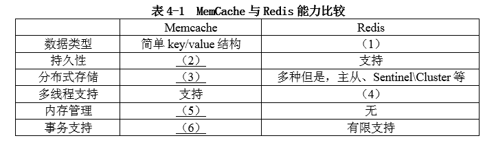

### 问题1

在李工和刘工的方案中，均采用分布式数据库缓存技术来解决问题。请用100字以内的文字说明分布式数据库缓存的基本概念。
表4-1中对MemCache和Redis两种工具的优缺点进行了比较，请补充完善表 4-1中的空（1）~ （6）。

**参考答案**

分布式数据库缓存指的是在高并发环境下，为了减轻数据库压力和提高系统响应时间，在数据库系统和应用系统之间增加的独立缓存系统。
（1）key/value，list，set，string，sorted 或 丰富/多种数据结构
（2）不支持
（3）客户端哈希分片/一致性哈希
（4）Redis5.0及以前版本不支持
（5）有，私有内存池
（6）不支持

**答案解析**

分布式缓存的核心思想是利用“内存 + 分布式”的架构手段解决高并发下的数据库性能瓶颈。数据库作为系统的权威存储，常常面临读写请求的洪峰，而其中大部分请求集中在少量热点数据（如热门商品、用户会话）。通过缓存，将这些热点数据存放到内存中，让应用优先读取缓存，减少数据库访问频率，从而极大地提升系统性能。分布式部署则通过分片、复制和一致性哈希等机制，把缓存负载分散到多台节点，实现容量扩展和高可用。
Redis 与 MemCache 的差异主要体现在：
①数据结构，MemCache 仅支持简单的 key-value，而 Redis 支持 string、list、hash、set、zset 等复杂结构，更适合处理多样化业务场景；
②持久化，MemCache 不支持持久化，掉电数据全丢，而 Redis 提供 RDB、AOF 等机制保障数据可靠性；
③分片机制，MemCache 一般依赖客户端一致性哈希，而 Redis 提供 Cluster 模式实现服务端分片；
④内存管理，Redis 的早期版本并不支持高级的内存管理功能，但从Redis 3.2 版本开始引入了内存淘汰策略等机制；
⑤事务支持，Redis 提供事务功能，而 MemCache 不支持。正因如此，Redis 常被用于对可靠性、一致性有要求的场景，而 MemCache 更适合纯缓存、读多写少的轻量级应用。

**浓缩知识点**：分布式缓存与高并发 分布式数据库缓存指的是在高并发环境下，为了减轻数据库压力和提高系统响应时间，在数据库系统和应用系统之间增加的独立缓存系统。 （1）key/value，list，set，string，sorted 或 丰富/多种数据结构 分布式缓存的核心思想是利用“内存 + 分布式”的架构手段解决高并发下的数据库性能瓶颈。数据库作为系统的权威存储，常常面临读写请求的洪峰，而其中大部分请求集中在少量热点数据（如热门商品、用户会话）。通过缓存，将这些热点数据存放到内存中，让应用优先读取缓存，减少数据库访问频率，从而极大地提升系统性能。分布式部署则通过分片、复制和一致性哈希等机制，把缓存负载分散到

---

### 问题2

刘工认为李工的方案存在数据可靠性和一致性的问题，请用100字以内的文字解释说明。为避免数据可靠性和一致性的问题，刘工的方案采用Redis作为数据库缓存，请用200字以内的文字说明基本的Redis与原有关系数据库的数据同步方案。

**参考答案**

（1）MemCache没有持久化功能，所以掉电数据会全部丢失，而且无法直接恢复，这存在可靠性问题。
（2）MemCache不支持事务，所以操作过程中可能产生数据的不一致性。
同步方案：读取数据时，先读取Redis中的数据，如果Redis没有，则从原数据库中读取，并同步更新Redis中的数据。写回时，写入到原数据库中，并同步更新至Redis中。

**答案解析**

李工的方案基于 MemCache，虽然开发量小，但存在严重缺陷。
第一，可靠性差：MemCache 所有数据存于内存，不支持持久化，服务器宕机或重启后缓存数据完全丢失，业务可能出现数据丢失或重新加载数据库的性能抖动。
第二，一致性差：MemCache 不支持事务，多个并发请求可能导致缓存与数据库内容不一致，尤其在电商下单、支付场景中风险较大。这些问题使得李工方案无法满足核心业务的可靠性需求。
Redis 的方案则通过“缓存 + 数据库双存储”的方式实现优化。典型模式是 Cache-Aside（旁路缓存）：
读操作：应用程序先访问 Redis，如果命中则直接返回；若未命中，则访问数据库，取回数据后写入 Redis，以供后续使用。
写操作：先更新数据库，成功后再删除或更新 Redis 缓存，确保数据库作为权威数据源，避免双写不一致。
此外，Redis 通过持久化机制（RDB 快照、AOF 日志）提升数据可靠性，还能结合主从复制、哨兵模式实现高可用。这样即能兼顾高性能，又能保障交易数据安全，解决 MemCache 的短板。

**浓缩知识点**：分布式缓存与高并发 （1）MemCache没有持久化功能，所以掉电数据会全部丢失，而且无法直接恢复，这存在可靠性问题。 （2）MemCache不支持事务，所以操作过程中可能产生数据的不一致性。 李工的方案基于 MemCache，虽然开发量小，但存在严重缺陷。 第一，可靠性差：MemCache 所有数据存于内存，不支持持久化，服务器宕机或重启后缓存数据完全丢失，业务可能出现数据丢失或重新加载数据库的性能抖动。

---

### 问题3

请用300字以内的文字，说明Redis分布式存储的两种常见方案，并解释说明Redis集群切片的几种常见方式。

**参考答案**

Redis分布式存储的常见方案：主从模式（Master/Slave）、哨兵模式（Sentinel）、集群模式（Cluster）
Redis集群切片的常见方式：（2）客户端分片，即在客户端就通过key的hash值对应到不同的服务器。（2）中间件实现分片。在应用软件和Redis中间，例如：Twemproxy、Codis等，由中间件实现服务到后台Redis节点的路由分派。（3）客户端服务端协作分片。Redis Cluster模式，客户端可采用一致性哈希，服务端提供错误节点的重定向服务slot上。不同的slot对应到不同服务器。

**答案解析**

Redis 单机虽高效，但受限于内存和并发能力，必须通过分布式扩展支撑高并发业务。三种常见方案分别针对不同场景：
主从模式主要解决读写分离和数据备份，但主库宕机时需人工切换；
哨兵模式在主从基础上增加自动化监控与故障转移，提升高可用性；
集群模式则通过内置的 slot 分片机制，支持多主多从、自动负载均衡，是互联网企业应对大规模业务的主流方案。
在 数据分片方式上，客户端分片逻辑简单但耦合度高，需要客户端维护分片策略；中间件分片通过代理层屏蔽复杂性，应用透明，但会引入转发开销；Redis Cluster采用 16384 个 slot，服务端负责管理 slot 与节点映射，客户端根据 key 的 CRC16 计算 slot 并路由到对应节点，若节点迁移则通过 MOVED/ASK 重定向实现动态调整。

**浓缩知识点**：分布式缓存与高并发 Redis分布式存储的常见方案：主从模式（Master/Slave）、哨兵模式（Sentinel）、集群模式（Cluster） Redis集群切片的常见方式：（2）客户端分片，即在客户端就通过key的hash值对应到不同的服务器。（2）中间件实现分片。在应用软件和Redis中间，例如：Twemproxy、Codis等，由中间件实现服务到后台Redis节点的路由分派。（3）客户端服务端协作分片。Redis Cluster模式，客户端可采用一致性哈希，服务端提供错误节点的重定向服务slot上。不同的slot对应到不同服务器。 Redis 单机虽高效，但受限于内存和并发能力，必须

---

## 5. 2019年11月第4题（分布式缓存与高并发）

- 题号：0020190501004
- 题目标签：分布式缓存与高并发
- 难度：简单
- 频率：高频
- 浓缩知识点：分布式缓存与高并发；重点围绕题干场景、架构决策与质量属性进行分析。

### 题目说明

阅读以下关于分布式数据库缓存设计的叙述，在答题纸上回答问题1至问题3。
【 说明 】
某初创企业的主营业务是为用户提供高度个性化的商品订购业务，其业务系统支持PC端、手机App等多种访问方式。系统上线后受到用户普遍欢迎，在线用户数和订单数量迅速增长，原有的关系数据库服务器不能满足高速并发的业务要求。
为了减轻数据库服务器的压力，该企业采用了分布式缓存系统，将应用系统经常使用的数据放置在内存，降低对数据库服务器的查询请求，提高了系统性能。在使用缓存系统的过程中，企业碰到了一系列技术问题。

### 问题1

该系统使用过程中，由于同样的数据分别存在于数据库和缓存系统中，必然会造成数据同步或数据不一致性的问题。该企业团队为解决这个问题，提出了如下解决思路：应用程序读数据时，首先读缓存，当该数据不在缓存时，再读取数据库；应用程序写数据时，先写缓存，成功后再写数据库；或者先写数据库，再写缓存。
王工认为该解决思路并未解决数据同步或数据不一致性的问题，请用100字以内的文字解释其原因 。
王工给出了一种可以解决该问题的数据读写步骤如下 ：
读数据操作的基本步骤 ：
根据key读缓存；
读取成功则直接返回；
若key不在缓存中时，根据key（a）；
读取成功后，（b）；
成功返回 。
写数据操作的基本步骤 ：
根据key值写（c）；
成功后（d）；
成功返回。
请填写完善上述步骤中（a）~（d）处的空白内容。

**参考答案**

原方案采用“写缓存再写数据库”或“写数据库再写缓存”，看似能保证缓存与数据库的数据一致，但实际上存在双写不一致问题。
例如，先写缓存后写数据库时，如果缓存写成功而数据库写失败，会导致数据不一致；反之，若先写数据库再写缓存，缓存更新失败时也会造成矛盾。
此外，当多个请求同时发生时，可能出现读写冲突，即一个请求刚写数据库但缓存未更新，另一个请求却从缓存读到旧数据，造成脏读。这些问题说明，双写方案并不能彻底解决一致性。
王工的改进方案采用缓存淘汰机制（Cache-Aside Pattern）。
读操作：优先从缓存读，若未命中，则从数据库读并更新缓存；写操作：先写数据库，再删除或使缓存失效。
这种方式的优势在于避免了缓存与数据库的双写，只需保证数据库正确写入即可。缓存失效后，下一次读请求会触发数据库读取并刷新缓存，从而实现最终一致性。
由于删除缓存的操作是轻量级内存操作，失败概率极低；即便出现偶发不一致，也会在下一次读取时自动修复。
因此，该方案在保证高性能的同时，极大地降低了缓存与数据库不一致的风险，成为业界常见的实践。
（a）从数据库中读取数据或读数据库
（b）更新缓存中key值或更新缓存
（c）数据库
（d）删除缓存key或使缓存key失效或更新缓存（key值）

**答案解析**

在原有方案中，应用程序写数据时，先写缓存，成功后再写数据库；或者先写数据库，再写缓存。这里存在双写不一致问题。不管先写缓存还是数据库，都会存在一方写成功，另一方写失败的问题，从而造成数据不一致。当多个请求发生时，也可能产生读写冲突的并发问题。
王工的解决思路是（同样是旁路模式，但是写操作的细节进行了改进，变成了删除缓存）：读操作的顺序是，先读缓存，如果数据在缓存中，则直接返回，无须数据库操作；如果数据不在缓存，则读数据库，如成功，则更新缓存，如失败，则返回无此数据。
读操作主要解决查询效率问题。写操作的顺序是先写数据库，如失败，则返回失败；如成功，则更新缓存。
Cache-Aside Pattern 更新缓存的方式有：如缓存中无此key值，则在缓存中不作处理；如缓存中存在此key值，则删除key值或使该key值失效。写操作的顺序主要防止数据库写操作失败，缓存更新为内存操作，失败的概率很小。同时删除key或使key失效，则在下一次查询该key值时，会发起数据库读操作，并同步更新缓存中的key值，从而最大程度上避免双写不一致问题。

**浓缩知识点**：分布式缓存与高并发 原方案采用“写缓存再写数据库”或“写数据库再写缓存”，看似能保证缓存与数据库的数据一致，但实际上存在双写不一致问题。 例如，先写缓存后写数据库时，如果缓存写成功而数据库写失败，会导致数据不一致；反之，若先写数据库再写缓存，缓存更新失败时也会造成矛盾。 在原有方案中，应用程序写数据时，先写缓存，成功后再写数据库；或者先写数据库，再写缓存。这里存在双写不一致问题。不管先写缓存还是数据库，都会存在一方写成功，另一方写失败的问题，从而造成数据不一致。当多个请求发生时，也可能产生读写冲突的并发问题。 王工的解决思路是（同样是旁路模式，但是写操作的细节进行了改进，变成了删除缓存）：读操

---

### 问题2

缓存系统一般以key/value形式存储数据，在系统运维中发现，部分针对缓存的查询，未在缓存系统中找到对应的key，从而引发了大量对数据库服务器的查询请求，最严重时甚至导致了数据库服务器的宕机。
经过运维人员的深入分析，发现存在两种情况：
（1）用户请求的key值在系统中不存在时，会查询数据库系统，加大了数据库服务器的压力；
（2）系统运行期间，发生了黑客攻击，以大量系统不存在的随机key发起了查询请求，从而导致了数据库服务器的宕机 。经过研究，研发团队决定，当在数据库中也未查找到该key时，在缓存系统中为key设置空值，防止对数据库服务器发起重复查询 。
请用100字以内文字说明该设置空值方案存在的问题，并给出解决思路。

**参考答案**

存在问题：不在系统中的key值是无限的，如果均设置key值为空，会造成内存资源的极大浪费，引起性能急剧下降。解决思路：查询缓存之前，对key值进行过滤，只允许系统中存在的key进行后续操作（例如采用布隆过滤器进行过滤）。

**答案解析**

研发团队采用“为空值设置缓存”的方式，防止对数据库的重复查询，但这一方案存在隐患：系统不存在的 key 值理论上是无限的，如果黑客或恶意用户提交大量随机 key，每个 key 都会被写入缓存为空值，最终导致缓存内存被迅速耗尽，从而影响正常业务请求，严重时甚至会拖垮缓存系统本身。
解决该问题的核心思路是在查询缓存之前过滤掉无效 key。常见方法是布隆过滤器：它基于位数组和多哈希函数，能够高效判断某个 key 是否可能存在于系统中，如果布隆过滤器判断 key 不存在，则无需访问数据库和缓存，从源头阻断恶意请求。此外，还可采用字典表或位图记录已存在 key 的范围和规则。这样，系统只对合理 key 发起查询，从而避免无效 key 导致缓存膨胀，保证整体稳定性和性能。

**浓缩知识点**：分布式缓存与高并发 存在问题：不在系统中的key值是无限的，如果均设置key值为空，会造成内存资源的极大浪费，引起性能急剧下降。解决思路：查询缓存之前，对key值进行过滤，只允许系统中存在的key进行后续操作（例如采用布隆过滤器进行过滤）。 研发团队采用“为空值设置缓存”的方式，防止对数据库的重复查询，但这一方案存在隐患：系统不存在的 key 值理论上是无限的，如果黑客或恶意用户提交大量随机 key，每个 key 都会被写入缓存为空值，最终导致缓存内存被迅速耗尽，从而影响正常业务请求，严重时甚至会拖垮缓存系统本身。 解决该问题的核心思路是在查询缓存之前过滤掉无效 key。常见方法是布隆过滤器：

---

### 问题3

缓存系统中的key一般会存在有效期，超过有效期则key失效；有时也会根据LRU算法将某些key移出内存。当应用软件查询key时，如key失效或不在内存，会重新读取数据库，并更新缓存中的key。
运维团队发现在某些情况下，若大量的key设置了相同的失效时间，导致缓存在同一时刻众多key同时失效，或者瞬间产生对缓存系统不存在key的大量访问，或者缓存系统重启等原因，都会造成数据库服务器请求瞬时爆量，引起大量缓存更新操作，导致整个系统性能急剧下降，进而造成整个系统崩溃。请用100字以内文字，给出解决该问题的两种不同思路。

**参考答案**

思路 1：缓存失效后，通过加排它锁或者队列方式控制数据库写缓存的线程数量，使得缓存更新串行化；
思路 2：给不同key设置随机或不同的失效时间，使失效时间的分布尽量均匀；
思路 3：设置两级或多级缓存，避免访问数据库服务器。

**答案解析**

当大量缓存 key 设置了相同过期时间，或者缓存系统重启导致 key 大量失效，会出现“缓存雪崩”现象：瞬间有海量请求绕过缓存直击数据库，导致数据库 QPS 暴增，甚至直接宕机。
本题中的场景就是典型的缓存雪崩问题。其原因在于缓存失效集中触发数据库访问，加上并发请求数大，数据库无法承受瞬时流量。
解决思路主要有三类：①串行化更新，通过加锁或排队控制同一 key 的并发写请求，避免重复写数据库刷新缓存；②过期时间随机化，为不同 key 设置不同或带随机偏移的 TTL，使缓存过期时间分布更均匀，减少同一时刻的大规模失效；③多级缓存，在应用节点本地维护 L1 缓存，分布式缓存作为 L2，双层缓存共同抵御突发流量，即使部分失效，也能通过局部缓存抵消部分请求压力。结合实际业务特点，往往需要综合使用，例如在热点数据上启用多级缓存与锁机制，在长尾数据上采用过期时间分散策略，从而整体上避免缓存雪崩，保障系统性能与可用性。

**浓缩知识点**：分布式缓存与高并发 思路 1：缓存失效后，通过加排它锁或者队列方式控制数据库写缓存的线程数量，使得缓存更新串行化； 思路 2：给不同key设置随机或不同的失效时间，使失效时间的分布尽量均匀； 当大量缓存 key 设置了相同过期时间，或者缓存系统重启导致 key 大量失效，会出现“缓存雪崩”现象：瞬间有海量请求绕过缓存直击数据库，导致数据库 QPS 暴增，甚至直接宕机。 本题中的场景就是典型的缓存雪崩问题。其原因在于缓存失效集中触发数据库访问，加上并发请求数大，数据库无法承受瞬时流量。

---

## 6. 2020年11月第4题（分布式缓存与高并发）

- 题号：0020200501004
- 题目标签：分布式缓存与高并发
- 难度：简单
- 频率：高频
- 浓缩知识点：分布式缓存与高并发；重点围绕题干场景、架构决策与质量属性进行分析。

### 题目说明

阅读以下关于数据库缓存的叙述，在答题纸上回答问题1至问题3。
[说明]
某互联网文化发展公司因业务发展，需要建立网上社区平台，为用户提供一个对网络文化产品(如互联网小说、电影、漫画等)进行评论、交流的平台。该平台的部分功能如下:
(a)用户帖子的评论计数器;
(b)支持粉丝列表功能;
(c)支持标签管理;
(d)支持共同好友功能等;
(e)提供排名功能，如当天最热前10名帖子排名、热搜榜前5排名等;
(f)用户信息的结构化存储;
(g)提供好友信息的发布/订阅功能。
该系统在性能上需要考虑高性能、高并发，以支持大量用户的同时访问。开发团队经过综合考虑，在数据管理上决定采用Redis+数据库(缓存+数据库)的解决方案。

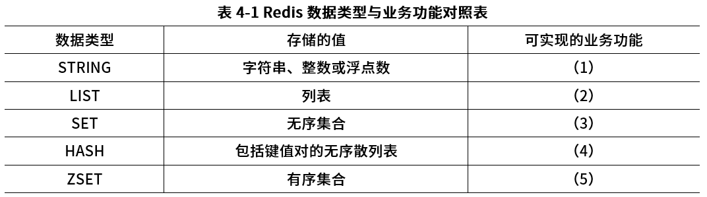

### 问题1

Redis支持丰富的数据类型，并能够提供--些常见功能需求的解决方案。请选择题干描述的(a)~(g) 功能选项，填入表4-1中(1)~ (5)的空白处。

**参考答案**

（1） (a)
（2） (b)、(g)
（3） (c)、(d)
（4） (f)
（5） (e)

**答案解析**

（1）(a) 依据：STRING 类型在 Redis 中可用于存储简单的字符串、整数或浮点数 。用户帖子的评论计数器，主要是对整数进行计数操作，利用 STRING 类型的原子自增（INCR）、自减（DECR）等命令，能方便高效地实现评论数量的统计，所以（1）对应 (a) 。
（2）(b)、(g) 对于 (b)：LIST 类型是一个双向链表，可以在链表两端进行插入和删除操作 。粉丝列表功能中，可将粉丝信息按添加顺序依次存储在 LIST 中，能满足粉丝列表这种具有顺序性的数据存储需求，便于按顺序遍历粉丝列表等操作，所以 LIST 可对应 (b) 。有的同学说粉丝要算共同好友怎么办，的确有争议，选 SET也可以，实际还是要看具体的应用场景。针对这题，题干出现列表，我们就选列表，绝对没错。
对于 (g)：好友信息的发布 / 订阅功能，发布的好友信息可按时间顺序等依次存入 LIST 。比如新发布的好友动态可以从链表一端插入，在订阅查看时能按顺序依次获取，符合 LIST 类型顺序存储和操作的特性，因此（2）也对应 (g) 。
（3）(c)、(d)。对于 (c)：SET 类型是无序且不重复的集合。在标签管理功能中，标签集合不需要考虑顺序，且每个标签应该是唯一的，使用 SET 类型可以利用其自动去重特性，方便地实现标签的存储、添加、删除以及判断某个标签是否存在等操作，所以 SET 对应 (c) 。这里标签用顺序是否可以，凯恩认为也可以。题干描述不清楚，留给大家讨论。
对于 (d)：共同好友功能中，共同好友组成的集合不需要有特定顺序，且好友个体不能重复，SET 类型的无序去重特性正好适用于存储共同好友集合，能有效进行共同好友的相关操作，所以 SET 也对应 (d) 。
（4）(f)。依据：HASH 类型是由字段和值组成的键值对集合，适合存储结构化数据。用户信息包含姓名、年龄、联系方式等多个属性，以 HASH 类型存储时，可将用户 ID 作为键，用户各项属性作为字段和对应的值，方便对用户信息的各个属性进行独立的增删改查操作，所以（4）对应 (f) 。
（5）(e)。依据：ZSET 类型是有序集合，每个元素都关联一个分数，Redis 会根据分数对元素进行排序。在提供排名功能（如当天最热前 10 名帖子排名、热搜榜前 5 排名等）中，可将帖子或热搜词条作为元素，将其热度值、搜索次数等作为分数存储在 ZSET 中，通过对分数的排序就能轻松获取排名情况，所以（5）对应 (e) 。

**浓缩知识点**：分布式缓存与高并发 （1） (a) （2） (b)、(g) （1）(a) 依据：STRING 类型在 Redis 中可用于存储简单的字符串、整数或浮点数 。用户帖子的评论计数器，主要是对整数进行计数操作，利用 STRING 类型的原子自增（INCR）、自减（DECR）等命令，能方便高效地实现评论数量的统计，所以（1）对应 (a) 。 （2）(b)、(g) 对于 (b)：LIST 类型是一个双向链表，可以在链表两端进行插入和删除操作 。粉丝列表功能中，可将粉丝信息按添加顺序依次存储在 LIST 中，能满足粉丝列表这种具有顺序性的数据存储需求，便于按顺序遍历粉丝列表等操作，所以 LIST 可对应 

---

### 问题2

该网上社区平台需要为用户提供7×24小时的不间断服务。同时在系统出现宕机等故障时，能在最短时间内通过重启等方式重新建立服务。为此，开发团队选择了Redis 持久化支持。Redis有两种持久化方式，分别是RDB(Redis DataBase)持久化方式和AOF (Append OnlyFile)持久化方式。开发团队最终选择了RDB方式。请用200字以内的文字，从磁盘更新频率、数据安全、数据一致性、 重启性能和数据文件大小五个方面比较两种方式，并简要说明开发团队选择RDB的原因。

**参考答案**

RDB持久化方式和AOF持久化方式在以下面有所不同：
（1）磁盘更新频率：RDB方式在指定时间间隔内将内存中的数据快照保存到磁盘，而AOF方式则实时记录每次写操作到磁盘。
（2）数据安全：AOF方式通过追加日志的方式记录每次写操作，可以更好地保证数据的安全性，但可能会增加磁盘IO负担。
（3）数据一致性：RDB方式在快照时刻保存数据，可能会导致部分数据丢失，而AOF方式记录每次写操作，数据更加完整和一致。
（4）重启性能：RDB方式在重启时加载快照文件，速度较快；而AOF方式需要重新执行日志文件中的写操作，重启时间可能较长。
（5）数据文件大小：AOF方式通常比RDB方式的数据文件更大，因为AOF记录了每次写操作。
开发团队选择RDB方式可能是因为其在重启性能方面更优，能够在最短时间内重新建立服务，符合要求的7x24小时不间断服务需求。同时，RDB方式也相对简单，易于管理和维护

**答案解析**

磁盘更新频率：AOF比RDB文件更新频率高。数据安全："AOF比RDB更安全。数据一致性： RDB间隔一段时间存储，可能发生数据丢失和不一致；AOF 通过append模式写文件，即使发生服务器宕机，也可通过redis-check-aof 工具解决数据一致性问题。重启性能：RDB性能比AOF好。数据文件大小：AOF 文件比RDB文件大。
综合上述五个方面的比较，考虑在系统出现宕机等故障时，需要在最短时间内通过重启等方式重新建立服务，因此开发团队最终选择了RDB方式。
有的同学提出 AOF 有多种刷新模式，这里回答不准确，在 Redis 中，AOF 磁盘刷新方式主要由配置参数 appendfsync 控制，该参数决定了 Redis 将数据刷新（fsync）到磁盘的频率。下面是 AOF 的三种磁盘刷新方式：
（1）appendfsync always（总是刷新）：在每次写操作后，Redis 都会立即将 AOF 缓冲区的数据写入并同步到磁盘。优点：提供最高的数据安全性，确保在系统崩溃时数据不会丢失。缺点：性能较低，因为频繁的磁盘 I/O 操作会增加系统开销。
（2）appendfsync everysec（每秒刷新一次）：描述：Redis 每秒钟在后台线程中将 AOF 缓冲区的数据写入并同步到磁盘。优点：在性能和数据安全性之间提供了良好的平衡。大多数情况下，即使系统崩溃，最多只会丢失一秒钟的数据。缺点：在极端情况下（如系统故障或断电），可能会丢失最近一秒钟的数据。
（3）appendfsync no（不主动刷新）：描述：Redis 不主动调用 fsync，而是依赖操作系统自行决定何时将数据从缓冲区刷新到磁盘。优点：性能最佳，因为减少了磁盘 I/O 操作。缺点：数据安全性最低，可能会在系统崩溃时丢失大量数据，因为最后的写操作可能尚未同步到磁盘。

**浓缩知识点**：分布式缓存与高并发 RDB持久化方式和AOF持久化方式在以下面有所不同： （1）磁盘更新频率：RDB方式在指定时间间隔内将内存中的数据快照保存到磁盘，而AOF方式则实时记录每次写操作到磁盘。 磁盘更新频率：AOF比RDB文件更新频率高。数据安全："AOF比RDB更安全。数据一致性： RDB间隔一段时间存储，可能发生数据丢失和不一致；AOF 通过append模式写文件，即使发生服务器宕机，也可通过redis-check-aof 工具解决数据一致性问题。重启性能：RDB性能比AOF好。数据文件大小：AOF 文件比RDB文件大。 综合上述五个方面的比较，考虑在系统出现宕机等故障时，需要在最短时间内通

---

### 问题3

缓存中存储当前的热点数据，Redis 为每个KEY值都设置了过期时间，以提高缓存命中率。为了清除非热点数据，Redis 选择"定期删除+惰性删除"策略。如果该策略失效，Redis内存使用率会越来越高，一般应采用内存淘汰机制来解决。请用100字以内的文字简要描述该策略的失效场景，并给出三种内存淘汰机制。

**参考答案**

Redis 的过期键（Expired Keys）是自动删除的，Redis 会在每个键的过期时间秒数到达时检查该键是否过期，如果是，它会自动从 Redis 中删除该键。Redis 内部通过使用时间轮算法和惰性删除方法来实现过期键的删除。具体来说，过期键的定期删除策略由redis.c/activeExpireCycle函数实现，每当Redis的服务器周期性操作redis.c/serverCron函数执行时，activeExpireCycle函数就会被调用，它在规定的时间内，分多次遍历服务器中的各个数据库，从数据库的expires字典中随机检查一部分键的过期时间，并删除其中的过期键。然后，Redis 会启动一个后台线程，使用惰性删除方法来删除已过期的键。惰性删除指的是，当需要访问一个键时，Redis 判断该键是否过期，如果过期就立即删除。
失效场景：是指"定期删除"没删除KEY，"惰性删除"也没生效。因为大量过期的key在定期删除策略下没有及时删除 + 外部在这段时间内没有要查询这个key的动作，导致无法做惰性删除，所以还占用着内存。对此，可采用内存淘汰机制解决：（1）从已设置过期时间的数据集最近最少使用的数据淘汰。（2）从已设置过期时间的数据集将要过期的数据淘汰。（3）从已设置过期时间的数据集任意选择数据淘汰。（4）从数据集最近最少使用的数据淘汰。（5）从数据集任意选择数据淘汰。

**答案解析**

Redis 默认使用“定期删除+惰性删除”策略。定期删除是后台线程随机抽样过期键并清理，惰性删除则在访问时判断是否过期并删除。但若抽样未覆盖到过期键，且这些键长期无人访问，就会出现过期数据残留，内存占用率上升。
此时必须启用内存淘汰机制（Eviction Policy），例如：①LRU，从最近最少使用的数据中淘汰，保证热点数据留存；②LFU，从访问频率最低的数据中淘汰，更精准地维护活跃数据；③随机淘汰，简单高效，适用于性能优先的场景。通过合理配置淘汰机制，能确保内存使用稳定，避免 OOM。

**浓缩知识点**：分布式缓存与高并发 Redis 的过期键（Expired Keys）是自动删除的，Redis 会在每个键的过期时间秒数到达时检查该键是否过期，如果是，它会自动从 Redis 中删除该键。Redis 内部通过使用时间轮算法和惰性删除方法来实现过期键的删除。具体来说，过期键的定期删除策略由redis.c/activeExpireCycle函数实现，每当Redis的服务器周期性操作redis.c/serverCron函数执行时，activeExpireCycle函数就会被调用，它在规定的时间内，分多次遍历服务器中的各个数据库，从数据库的expires字典中随机检查一部分键的过期时间，并删除其中的过期

---

## 7. 2025年5月第3题（分布式缓存与高并发）

- 题号：0020250501003
- 题目标签：分布式缓存与高并发
- 难度：简单
- 频率：高频
- 浓缩知识点：分布式缓存与高并发；重点围绕题干场景、架构决策与质量属性进行分析。

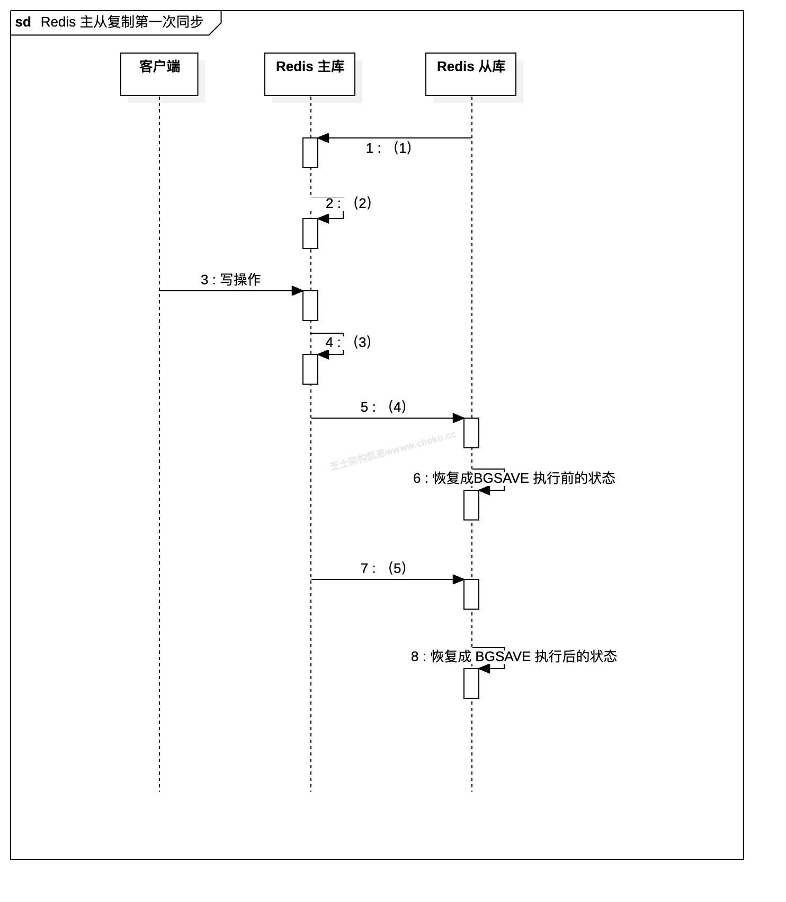

### 问题1

请根据 Redis 的主从架构原理和下图的同步流程，在图示中填入正确的关键步骤和指令。

**参考答案**

（1）从库向主库发送 PSYNC ? -1 或 SYNC 请求，表示首次同步请求
（2）BGSAVE 命令，主库收到请求后执行 BGSAVE，生成 RDB 快照
（3）主库将写操作追加到 backlog，用于稍后的增量复制
（4）主库将 RDB 文件通过 socket 传输给从库（传输全量快照）
（5）主库将 backlog 中积压的写命令（增量）发送给从库

**答案解析**

当 Redis 从库（Slave）第一次与主库（Master）建立复制关系时，会进行一次完整的数据同步，这一过程称为“全量同步”。其主要流程如下：
从库发起同步请求。从库在启动并配置主库地址后，主动向主库发送 PSYNC ? -1 命令（老版本使用 SYNC），表明自己是第一次同步，请求主库发送完整的数据副本。
主库执行 BGSAVE 生成快照。主库接收到同步请求后，会启动一个后台子进程执行 BGSAVE 命令，生成当前数据库的 RDB 快照文件（即数据库当前状态的完整镜像）。此时，主库仍然可以继续响应客户端的写入请求。
写操作被追加到复制缓冲区。由于 BGSAVE 执行期间主库仍然对外提供服务，客户端可能继续写入数据。为了不丢失这部分写操作，主库会将这些命令追加到复制积压缓冲区（replication backlog）中，准备后续发送给从库。
主库发送 RDB 快照给从库。当 BGSAVE 完成后，主库将生成的 RDB 文件通过网络发送给从库。从库收到文件后会清空原有数据，并加载这份 RDB 快照，数据状态回滚至主库执行 BGSAVE 时的快照状态。
主库发送增量命令流。RDB 加载完成后，从库继续接收主库发送的 backlog 缓冲区中的写命令。这些命令是在 BGSAVE 执行期间产生的，用于追平主从之间的数据差异。
同步完成。从库执行完 backlog 中的所有写操作后，主从数据状态保持一致。此时主从之间进入“命令传播阶段”，即主库每次收到写命令时，都会实时同步给从库，从库保持实时追随主库的数据变更。

**浓缩知识点**：分布式缓存与高并发 （1）从库向主库发送 PSYNC ? -1 或 SYNC 请求，表示首次同步请求 （2）BGSAVE 命令，主库收到请求后执行 BGSAVE，生成 RDB 快照 当 Redis 从库（Slave）第一次与主库（Master）建立复制关系时，会进行一次完整的数据同步，这一过程称为“全量同步”。其主要流程如下： 从库发起同步请求。从库在启动并配置主库地址后，主动向主库发送 PSYNC ? -1 命令（老版本使用 SYNC），表明自己是第一次同步，请求主库发送完整的数据副本。

---

### 问题2

主从库第一次同步完成之后，后面是如何同步的，请在图示中填入正确的关键步骤和指令。

**参考答案**

（1）主库将写命令写入 AOF 日志和复制积压缓冲区（replication backlog buffer）
（2）主库将写命令通过 replication buffer（复制缓冲区） 发送给从库
（3）从库执行主库发来的命令，应用到本地数据

**答案解析**

在 Redis 主从架构中，主从库之间的数据一致性通过“命令传播”的机制持续保持。
当客户端向主库发送写操作时，主库不仅会在本地执行这些命令、更新内存，还会将这些写操作记录到两个地方：一个是用于持久化的 AOF 文件，另一个是复制积压缓冲区（backlog buffer），这是主库内存中专门用于存储最近一段命令历史的数据结构。如果从库网络中断后重连，可以通过 backlog 中的内容快速补齐，避免重新做全量同步。
接下来，主库还会把这些写命令放入每个从库对应的复制缓冲区（replication buffer）中，通过网络将命令推送给从库。从库收到后会逐条执行，确保数据状态与主库保持一致。整个过程从库则紧跟其后，不断执行主库发来的操作指令。

**浓缩知识点**：分布式缓存与高并发 （1）主库将写命令写入 AOF 日志和复制积压缓冲区（replication backlog buffer） （2）主库将写命令通过 replication buffer（复制缓冲区） 发送给从库 在 Redis 主从架构中，主从库之间的数据一致性通过“命令传播”的机制持续保持。 当客户端向主库发送写操作时，主库不仅会在本地执行这些命令、更新内存，还会将这些写操作记录到两个地方：一个是用于持久化的 AOF 文件，另一个是复制积压缓冲区（backlog buffer），这是主库内存中专门用于存储最近一段命令历史的数据结构。如果从库网络中断后重连，可以通过 backlog 中的

---

### 问题3

Redis 的数据持久化机制在生产环境中至关重要，当系统遭遇故障时需依赖持久化数据进行快速恢复。请详细阐述 Redis 的两种主要持久化方式，并对比分析其优缺点。

**参考答案**

Redis 主要有两种数据持久化方式：RDB（快照持久化）和 AOF（追加日志）。
RDB 是通过定期生成内存快照的方式将数据保存为二进制文件，优点是文件体积小、恢复速度快，适合用于灾备和冷启动场景，但它是定时保存，可能在故障时丢失最近修改的数据。
AOF 则是将每一次写命令以日志形式追加记录到磁盘，优点是数据丢失更少、可读性高，但缺点是文件更大、恢复速度相对慢，且长期运行后需要重写以控制体积。

**答案解析**

Redis 主要有两种数据持久化方式：RDB（快照持久化）和 AOF（追加日志）。RDB 通过定期将内存中的数据生成快照保存为二进制文件，优点是文件体积小、恢复速度快，适用于启动速度要求高或需要定时备份的系统场景。例如在电商平台中，凌晨业务低谷期可定时生成 RDB 快照，作为整站数据的每日备份。但由于其是间隔性保存，一旦系统在两次快照之间发生异常宕机，可能会造成数分钟的数据丢失，如用户刚刚下单的数据未被记录。
AOF 则是将每一次写命令以日志形式追加写入磁盘，可实现几乎实时的持久化，数据丢失极少，适用于数据精度要求高的业务场景，如金融系统中的转账、扣款等操作，哪怕丢失一笔都可能造成严重后果。但 AOF 文件体积相对更大，恢复时间更长，并且长时间运行后需执行日志重写以压缩文件体积。实际生产中，为了兼顾性能和数据安全，通常推荐开启 RDB + AOF 混合持久化模式，以实现恢复速度与数据完整性的双重保障。

**浓缩知识点**：分布式缓存与高并发 Redis 主要有两种数据持久化方式：RDB（快照持久化）和 AOF（追加日志）。 RDB 是通过定期生成内存快照的方式将数据保存为二进制文件，优点是文件体积小、恢复速度快，适合用于灾备和冷启动场景，但它是定时保存，可能在故障时丢失最近修改的数据。 Redis 主要有两种数据持久化方式：RDB（快照持久化）和 AOF（追加日志）。RDB 通过定期将内存中的数据生成快照保存为二进制文件，优点是文件体积小、恢复速度快，适用于启动速度要求高或需要定时备份的系统场景。例如在电商平台中，凌晨业务低谷期可定时生成 RDB 快照，作为整站数据的每日备份。但由于其是间隔性保存，一旦系统在两

---

## 8. 2025年11月第3题（分布式缓存与高并发）

- 题号：0020251101003
- 题目标签：分布式缓存与高并发
- 难度：简单
- 频率：高频
- 浓缩知识点：分布式缓存与高并发；重点围绕题干场景、架构决策与质量属性进行分析。

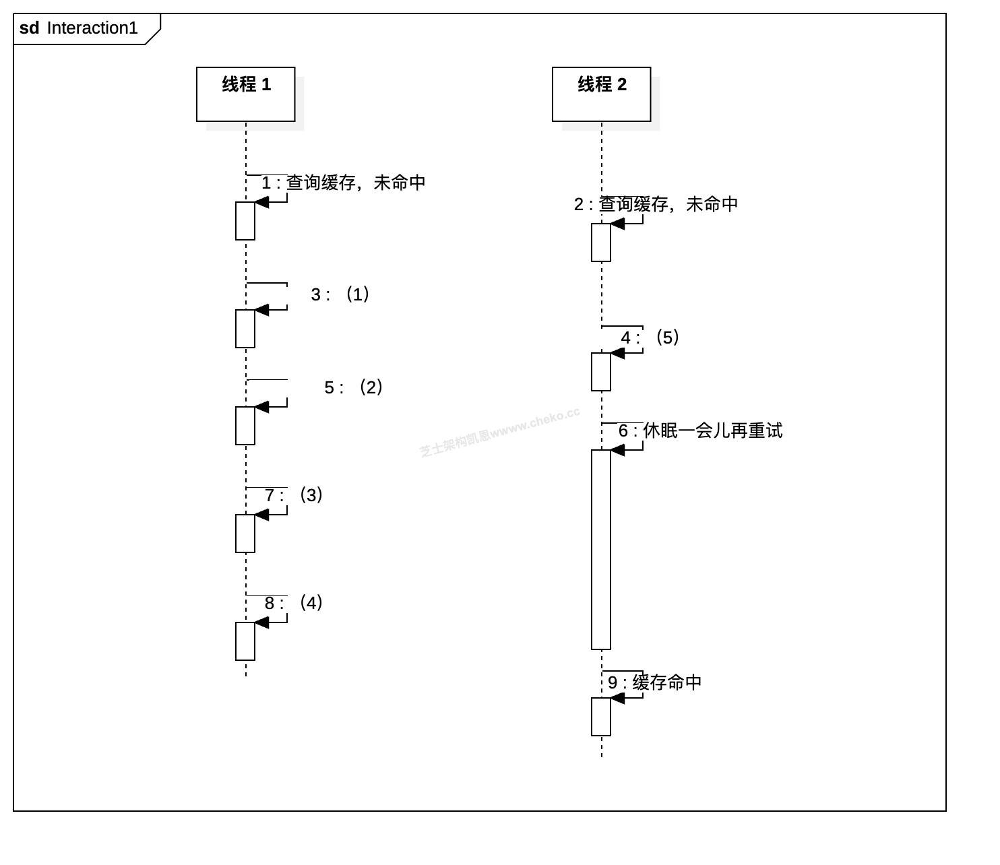
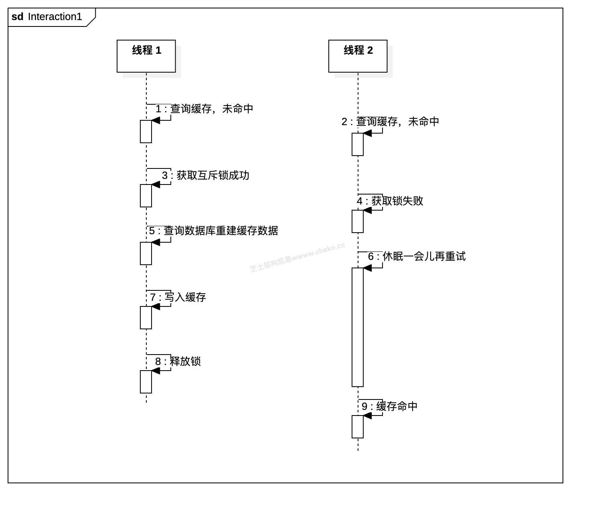

### 问题1

请根据王工“基于互斥锁的缓存查询过程”（物理过期方案）的主要处理步骤，把下方的序列图补充完整。

**参考答案**

（1）获取互斥锁成功（2）查询数据库重建缓存数据（3）写入缓存（4）释放锁（5）获取锁失败

**答案解析**

本题考察的是 基于互斥锁防止缓存击穿 的典型流程，以及如何用序列图刻画两个并发线程在同一热点 Key 上的协作关系。关键点是：只有一个线程真正访问数据库并重建缓存，其它线程都通过等待与重试的方式复用已经重建好的缓存，从而保护数据库不被突发流量冲击。
在补图时，应先理清时间线：线程 1 先到达，线程 2 后到达。两者在步骤 1 和 2 都做了“查询缓存”，因为缓存物理过期，结果都是未命中。接下来线程 1 在步骤 3 成功获得互斥锁（一般用 Redis SETNX 实现），说明它成为“重建者”；线程 2 在步骤 4 获取锁失败，因此不能再去数据库，只能进入步骤 6“休眠一会儿再重试”。这体现了互斥锁的核心目的：串行化对数据库的访问。随后线程 1 在持锁状态下执行步骤 5“查询数据库重建缓存数据”，拿到结果后在步骤 7 将数据写入缓存，最后在步骤 8 释放锁。到这里，缓存中已经重新有了最新的数据。
而线程 2 在休眠一段时间后被唤醒，根据王工的流程，不是直接再去加锁，而是先重新查询缓存。若缓存已经被线程 1 重建，则这次查询会命中，这就是序列图中步骤 9“缓存命中”。线程 2 直接返回数据，不需要访问数据库，也不再参与锁竞争。这部分在画图时容易漏掉：6 后面必须有“再次查询缓存”的消息线，才能解释为何 9 是“命中”，也体现了“等待别人重建好缓存后自己复用”的设计思想。
通过这个序列图可以看出：互斥锁方案的优点是数据库只被一个线程访问，避免热点 key 击穿；缺点是其他线程在等待期间被阻塞或轮询，对响应时间有一定影响。因此在题目的大案例中，还需要和逻辑过期方案结合“高可用”要求进行权衡。

**浓缩知识点**：分布式缓存与高并发 （1）获取互斥锁成功（2）查询数据库重建缓存数据（3）写入缓存（4）释放锁（5）获取锁失败 本题考察的是 基于互斥锁防止缓存击穿 的典型流程，以及如何用序列图刻画两个并发线程在同一热点 Key 上的协作关系。关键点是：只有一个线程真正访问数据库并重建缓存，其它线程都通过等待与重试的方式复用已经重建好的缓存，从而保护数据库不被突发流量冲击。 在补图时，应先理清时间线：线程 1 先到达，线程 2 后到达。两者在步骤 1 和 2 都做了“查询缓存”，因为缓存物理过期，结果都是未命中。接下来线程 1 在步骤 3 成功获得互斥锁（一般用 Redis SETNX 实现），说明它成为“重

---

### 问题2

请给出李工“逻辑过期方案（可返回过期数据）”的缓存查询过程的主要处理步骤，把下方的序列图补充完整。

**参考答案**

（1）获取互斥锁成功（2）返回过期消息（3）查询数据库重置缓存（4）写入缓存重置逻辑过期时间（5）获取互斥锁失败

**答案解析**

李工的逻辑过期方案核心思想是：缓存永远尽量有值，只是区分“是否过期”。在 Redis 中保存 {data, expireTime} 结构，真正判断是否过期的是 expireTime 字段，而不是 Redis TTL。序列图中，线程1先查询缓存，发现逻辑时间已过期，但缓存里仍有旧数据可用。此时线程1尝试获取互斥锁，步骤3成功后，说明它成为“刷新发起者”。为了不阻塞当前请求，它在步骤5中启动一个新线程（线程2）去后台刷新缓存，自己在步骤6就把当前这份“过期数据”返回给调用方，实现快速响应。
线程2在后台按照步骤7从数据库查询最新数据，再在步骤9把数据写回缓存并重置逻辑过期时间，最后在步骤10释放锁。与此同时，线程3也在访问同一缓存，它在步骤2也发现逻辑过期，但在步骤4获取锁失败，说明已经有别的线程在刷新，于是它直接在步骤8返回旧数据，不再访问数据库，避免出现缓存击穿。
当线程2刷新完毕后，后续新的请求（如线程4）在步骤11查询时，就会命中已更新且未过期的缓存数据。整个流程体现了逻辑过期方案的特点：主流程永远可以返回数据，只是短时间内可能是旧数据；真正访问数据库的只有极少数负责刷新的线程，从而在高并发场景下显著提升系统可用性和整体性能。

**浓缩知识点**：分布式缓存与高并发 （1）获取互斥锁成功（2）返回过期消息（3）查询数据库重置缓存（4）写入缓存重置逻辑过期时间（5）获取互斥锁失败 李工的逻辑过期方案核心思想是：缓存永远尽量有值，只是区分“是否过期”。在 Redis 中保存 {data, expireTime} 结构，真正判断是否过期的是 expireTime 字段，而不是 Redis TTL。序列图中，线程1先查询缓存，发现逻辑时间已过期，但缓存里仍有旧数据可用。此时线程1尝试获取互斥锁，步骤3成功后，说明它成为“刷新发起者”。为了不阻塞当前请求，它在步骤5中启动一个新线程（线程2）去后台刷新缓存，自己在步骤6就把当前这份“过期数据”返回

---

### 问题3

从实现复杂度、数据一致性、性能影响、内存占用、适用场景等维度分析两种方法的优劣，

**参考答案**

逻辑过期方案的实现复杂度较高，需额外维护过期时间字段并通过异步更新机制保障数据有效性，其数据一致性表现为最终一致，允许系统在短时间内返回旧数据，但因更新操作在后台异步执行，对核心业务主流程的性能影响较小；而物理过期（互斥锁）方案的实现难度更低，主要依托 Redis 的 TTL 机制与锁控制实现数据过期管理，能实现强一致性保障，确保数据更新后才对外可见，不过在缓存击穿场景下，可能出现大量请求阻塞或重试的情况，对并发处理效率产生影响。
在内存占用方面，逻辑过期方案需额外存储过期时间等辅助字段，会增加一定的内存开销，适用于高并发读场景，且对数据一致性要求相对宽松的业务场景；物理过期（互斥锁）方案仅需存储核心业务数据，内存利用效率更高，更适合对数据一致性要求严格、整体并发压力适中的应用场景。
在题目明确“要求高可用”的前提下，建议优先选择逻辑过期方案：因为逻辑过期即使在数据已过期、正在重建期间，仍能用旧数据响应请求，避免大面积阻塞和超时，能更好支撑高并发和高可用；而互斥锁方案在缓存重建阶段会阻塞许多线程，请求体验较差，容易在热点 key 上形成“雪崩”式排队。

**答案解析**

王工方案本质上是对传统 Cache-Aside 模式加上一把 互斥锁（分布式锁），避免同一个热点 key 过期时被多个线程同时回源数据库。题中典型实现是借助 SETNX 或 SET key value NX EX 命令加锁：当缓存未命中时，线程先尝试加锁，只有加锁成功的线程才去数据库查询并重建缓存，完成后删除锁；加锁失败的线程采取“休眠 + 重试”的方式，不断检测缓存是否已经被填充。该模式能有效避免缓存击穿带来的数据库瞬时压力，是业界常见的“互斥重建缓存”方案。实现时还要注意锁的 过期时间设置，防止线程异常退出造成死锁，同时重试间隔要合理，既不能太频繁导致无谓的 Redis 压力，也不能过长引起延迟过大。
但需要注意，这一模式强调的是强一致性：在重建期间，如果没有旧值可用，其他线程会一直等待或轮询，业务请求无法立即返回，接口 RT 会显著升高，极端情况下可能出现大量请求同时卡在等待锁或等待缓存的状态，对系统可用性不利。此外，若热点 key 特别多或锁粒度过粗，还可能形成锁竞争热点，成为新的瓶颈。因此，这种方案更适合读压力不是特别大、但对数据一致性非常敏感的业务场景，如核心交易流水、账户余额等，对高可用高吞吐的读取接口并不一定是最佳选择。
李工提出的逻辑过期方案的核心思想是：把“是否过期”的判断从 Redis 的 TTL 转移到业务数据本身。缓存中不再只存业务数据，而是存 {data, expireTime} 这样的结构，expireTime 表示业务层认为数据失效的时间点。查询时，只要 Redis 能命中这条记录，就一定能拿到一份可用数据；如果当前时间未超过 expireTime，说明数据在逻辑上未过期，直接返回即可；如果已经超过了该时间，则说明数据“逻辑过期”。此时，为了 保证高可用，系统可以先将这份“过期但不为空”的旧数据返回给用户，确保请求快速完成；与此同时，系统异步触发一次缓存刷新流程（通过一个非互斥锁或轻量锁控制只有少量线程真正执行刷新），在后台从数据库加载最新数据并更新缓存。这样，新旧数据在短时间内会存在一定不一致，但系统整体处于“有旧数据可用”的状态，请求不会因为缓存重建而大面积阻塞。
逻辑过期方案带来的代价是 实现复杂度和一致性模型的变化。开发人员需要设计缓存结构、维护逻辑过期时间、实现异步刷新和刷新失败重试等机制，还要在业务层充分评估“短暂返回过期数据”对业务的影响。因此，此方案通常适合新闻、商品详情、排行榜等读多写少、对实时性要求不是毫秒级严格的场景。它的优势在于：缓存重建时不会阻塞主流程，对高并发场景下的系统可用性和性能提升非常明显，是当前应对缓存击穿的推荐做法之一。
综合来看，两种方案形成了一种典型的 一致性—可用性—性能 之间的权衡。互斥锁物理过期方案依赖 Redis 的 TTL 控制数据生命周期，当某个 key 过期后，外部看起来数据彻底消失，只能等待新的缓存构建完成才能再次提供服务，因此能保证“只要有数据就是最新的”这种强一致体验；但这也意味着在缓存重建期间大量请求可能被阻塞或轮询，尤其是热点 key 占比高时，锁竞争会很激烈，接口响应时间抖动严重，系统整体可用性下降。其优点在于逻辑简单、运维成本低，缺点是 高并发下性能风险较大。
逻辑过期方案则选择牺牲短暂的一致性，换取系统高可用和高性能。由于逻辑层面允许先返回过期数据，再在后台刷新缓存，用户请求几乎不会因为缓存重建而被阻塞；只有极少数负责刷新的线程会访问数据库，数据库压力也被平滑掉。代价是需要额外字段和代码来维护逻辑过期时间，还要接受“在某个刷新窗口内读到旧数据”的事实，这在金融等强一致业务中可能无法接受。结合题干“要求高可用”这一前提，系统更看重在热点 key 失效、网络波动等异常场景下依然能够快速响应，而不是每次都返回绝对最新数据。因此，本题应推荐 优先采用逻辑过期方案，并在关键业务上适当缩短逻辑过期时间、增加监控和降级策略，以在可接受的一致性范围内获得更高的吞吐和更好的用户体验。

**浓缩知识点**：分布式缓存与高并发 逻辑过期方案的实现复杂度较高，需额外维护过期时间字段并通过异步更新机制保障数据有效性，其数据一致性表现为最终一致，允许系统在短时间内返回旧数据，但因更新操作在后台异步执行，对核心业务主流程的性能影响较小；而物理过期（互斥锁）方案的实现难度更低，主要依托 Redis 的 TTL 机制与锁控制实现数据过期管理，能实现强一致性保障，确保数据更新后才对外可见，不过在缓存击穿场景下，可能出现大量请求阻塞或重试的情况，对并发处理效率产生影响。 在内存占用方面，逻辑过期方案需额外存储过期时间等辅助字段，会增加一定的内存开销，适用于高并发读场景，且对数据一致性要求相对宽松的业务场景；物理过

---

## 9. 2026年5月第5题（分布式缓存与高并发）

- 题号：0020260501005
- 题目标签：分布式缓存与高并发
- 难度：简单
- 频率：高频
- 浓缩知识点：分布式缓存与高并发；重点围绕题干场景、架构决策与质量属性进行分析。

### 题目说明

阅读以下关于 Redis 缓存与并发控制的叙述，在答题纸上回答问题1-3。
【说明】
某互联网平台在大促活动中提供优惠券领取和限量商品抢购功能。活动开始后的前几分钟，请求量会瞬间上升，大量用户同时访问库存、优惠券余量和订单创建接口。系统当前使用 Redis 缓存活动信息和库存数量，并通过数据库最终保存订单和扣减结果。在一次压测中，项目组发现热点商品库存被多个线程同时读取和扣减，偶尔出现重复领取、库存扣减不一致和数据库写入冲突等问题。
为解决高并发下共享资源竞争问题，张工建议采用悲观锁控制临界区，确保同一时刻只有一个请求能够修改关键资源；李工建议采用乐观锁，通过版本号或 CAS 方式减少阻塞，提高并发吞吐。架构师进一步提出，在 Redis 场景中可以结合分布式锁、原子递减、Lua 脚本、限流、队列削峰和异步落库等机制，综合保障库存、优惠券和订单数据的一致性。
项目组需要比较不同锁机制的适用场景，并给出 Redis 高并发控制的设计方案。
视频解析
收起视频
非会员试看权益剩余 5 / 5 次

### 问题1

说明悲观锁的常见分类，并给出两类设计方案。

**参考答案**

悲观锁认为并发冲突较可能发生，因此访问共享资源前先加锁，其他请求必须等待或失败。
常见分类包括：共享锁和排他锁，读锁和写锁，数据库行锁和表锁，本地互斥锁和分布式锁。共享锁/读锁允许多个读请求并发访问，排他锁/写锁会独占资源，适用于库存扣减、优惠券领取等需要强约束的临界区。
两类设计方案可以这样写：第一，数据库悲观锁方案，利用行锁或 SELECT ... FOR UPDATE 锁定库存记录，在事务中完成校验和扣减；第二，Redis 分布式锁方案，使用 SET key value NX PX 获取锁，value 使用唯一请求标识，释放锁时通过 Lua 脚本校验 value 后删除，防止误删他人锁。还可以扩展读写锁方案，对读多写少资源区分读锁和写锁。

**答案解析**

本问考查悲观锁的概念、分类和工程化方案。悲观锁的基本假设是共享资源发生并发冲突的概率较高，因此在访问资源前先加锁，使同一时刻只有持锁请求能进入临界区。常见分类可以从多个角度写：按读写能力分为共享锁和排他锁，或读锁和写锁；按数据库粒度分为行锁、表锁和间隙锁；按部署范围分为本地互斥锁、数据库锁和分布式锁。共享锁适合多个读请求并发读取但不允许写，排他锁适合库存扣减、账户余额变更、优惠券领取这类必须独占修改的场景。
两类设计方案可以结合题干写。第一类是数据库悲观锁方案，使用事务和 SELECT ... FOR UPDATE 锁定库存行，在同一事务内完成查询余量、校验资格、扣减库存和写入订单。这种方案语义清楚、一致性强，但热点商品会造成数据库行锁竞争，吞吐量有限。第二类是 Redis 分布式锁方案，使用 SET key value NX PX 获取锁，其中 NX 保证不存在才设置，PX 设置过期时间防止死锁，value 使用唯一请求标识防止误删他人锁，释放锁时用 Lua 脚本先校验 value 再删除，保证判断和删除原子执行。如果业务耗时可能超过锁过期时间，还要考虑续期或缩短临界区。答题时把这些细节写出来，比只说“用 Redis 加锁”更符合架构师案例题要求。
还可以补充锁粒度和临界区设计。库存活动中不应把整个下单流程都放进锁里，否则支付、风控、远程调用都会拖长持锁时间，造成大量请求等待。更合理的做法是只锁定必须互斥的短操作，例如校验并扣减某个活动商品库存，后续订单创建、通知和落库尽量异步化。锁 key 也要有合适粒度，可以按活动ID和商品ID组织，而不是全站共用一把大锁。如果是 Redis 集群或主从切换场景，还需要理解单实例锁、RedLock 或基于数据库唯一约束的取舍，但考试中写清 SET NX PX、唯一 value、Lua 释放和超时控制通常已覆盖主要得分点。

**浓缩知识点**：分布式缓存与高并发 悲观锁认为并发冲突较可能发生，因此访问共享资源前先加锁，其他请求必须等待或失败。 常见分类包括：共享锁和排他锁，读锁和写锁，数据库行锁和表锁，本地互斥锁和分布式锁。共享锁/读锁允许多个读请求并发访问，排他锁/写锁会独占资源，适用于库存扣减、优惠券领取等需要强约束的临界区。 本问考查悲观锁的概念、分类和工程化方案。悲观锁的基本假设是共享资源发生并发冲突的概率较高，因此在访问资源前先加锁，使同一时刻只有持锁请求能进入临界区。常见分类可以从多个角度写：按读写能力分为共享锁和排他锁，或读锁和写锁；按数据库粒度分为行锁、表锁和间隙锁；按部署范围分为本地互斥锁、数据库锁和分布式锁。共享

---

### 问题2

比较乐观锁和悲观锁的优缺点。

**参考答案**

乐观锁假设并发冲突较少，访问资源时不先阻塞其他请求，提交更新时通过版本号、时间戳或 CAS 判断数据是否被其他请求修改。优点是无锁或少锁、吞吐量高、不会长时间阻塞，适合读多写少、冲突概率低的场景；缺点是冲突高时会频繁失败和重试，导致 CPU 和数据库压力上升，还需要处理重试次数、用户提示和幂等问题。
悲观锁假设冲突较多，访问资源前先加锁。优点是互斥关系明确，能强约束临界区，适合库存扣减、账户余额、优惠券领取等强一致场景；缺点是会阻塞其他请求，降低并发吞吐，锁粒度过大可能造成性能下降，设计不当还会出现死锁、锁超时、锁泄漏或热点锁竞争。

**答案解析**

比较乐观锁和悲观锁时，建议按假设、实现方式、优点、缺点和适用场景展开。乐观锁假设冲突较少，读取数据时不阻塞其他请求，提交更新时通过版本号、时间戳、CAS 或条件更新判断数据是否被别人修改。例如更新库存时带上 version 或当前库存条件，只有版本未变化才更新成功。它的优点是阻塞少、吞吐量高、不会长时间占用锁，适合读多写少、冲突概率不高的场景；缺点是冲突高时会大量失败和重试，重试会消耗 CPU、数据库连接和用户等待时间，还要处理重试次数、失败提示、幂等和补偿。
悲观锁假设冲突较多，进入临界区前先锁定资源。它的优点是互斥关系明确，可以强约束库存扣减、账户余额、优惠券领取等不能出错的操作；缺点是会阻塞其他请求，降低并发吞吐，锁粒度过大会放大等待，锁顺序不当可能死锁，锁超时或释放失败又可能造成异常。在秒杀或大促活动中，纯乐观锁面对少量库存和海量请求时可能出现大量 CAS 失败；纯悲观锁又会把请求堆在热点锁上。所以工程上常采用组合策略：入口限流减少竞争，Redis 原子扣减快速判断库存，必要时用短时分布式锁保护复杂临界区，再通过 MQ 异步落库和幂等表保证最终一致。
在答题表达上，乐观锁和悲观锁不要写成绝对优劣。乐观锁适合冲突少，因为失败重试成本低；悲观锁适合冲突多且一致性要求强，因为它直接限制并发进入临界区。但两者在高并发秒杀中都不能单独解决全部问题：乐观锁可能把压力转化成大量失败重试，悲观锁可能把压力转化成锁等待和超时。因此架构师更关注组合设计和权衡，例如用 Redis 原子扣减挡住大部分请求，用数据库唯一约束防重复订单，用乐观版本控制处理最终落库冲突，用短粒度悲观锁保护复杂互斥逻辑。

**浓缩知识点**：分布式缓存与高并发 乐观锁假设并发冲突较少，访问资源时不先阻塞其他请求，提交更新时通过版本号、时间戳或 CAS 判断数据是否被其他请求修改。优点是无锁或少锁、吞吐量高、不会长时间阻塞，适合读多写少、冲突概率低的场景；缺点是冲突高时会频繁失败和重试，导致 CPU 和数据库压力上升，还需要处理重试次数、用户提示和幂等问题。 悲观锁假设冲突较多，访问资源前先加锁。优点是互斥关系明确，能强约束临界区，适合库存扣减、账户余额、优惠券领取等强一致场景；缺点是会阻塞其他请求，降低并发吞吐，锁粒度过大可能造成性能下降，设计不当还会出现死锁、锁超时、锁泄漏或热点锁竞争。 比较乐观锁和悲观锁时，建议按假设、实现方

---

### 问题3

在 Redis 场景下给出高并发控制方案。

**参考答案**

Redis 高并发控制可采用组合方案：
入口限流和资格校验：在网关或活动服务中限制请求速率，过滤未登录、重复请求、无资格用户，减少进入库存扣减链路的流量。
Redis 原子扣减：库存或优惠券余量可使用 DECR、INCRBY 或 Lua 脚本完成检查与扣减的一体化操作，保证判断余量和扣减余量的原子性。
分布式锁保护临界区：对不能只靠原子扣减解决的共享资源，使用 SET key value NX PX 加锁，释放时用 Lua 校验唯一 value 后删除，避免锁误删；锁要设置合理过期时间，必要时做续期。
幂等控制：使用用户ID、活动ID、订单号或请求流水号记录领取状态，防止重复领取和重复下单。
队列削峰和异步落库：Redis 预扣成功后写入 MQ，由消费者异步创建订单和落库，失败时进行补偿或回滚库存。
最终一致性校验：通过对账任务比对 Redis、订单表和库存表，处理超时未支付、消费失败和重复消息。

**答案解析**

Redis 高并发控制不能只靠一个分布式锁，而应把流量治理、原子操作、幂等、异步削峰和对账补偿组合起来。入口层先做限流、风控和资格校验，过滤未登录、无资格、重复点击和明显超频请求，避免所有流量都打到库存扣减链路。库存或优惠券余量在 Redis 中可用 DECR、INCRBY 或 Lua 脚本完成“判断余量、扣减余量、记录领取标识”的一体化操作，因为 Lua 在 Redis 单线程执行模型下具备原子性，可以避免先查库存再扣库存之间被其他请求插入。
对不能单靠原子扣减解决的共享资源，例如创建订单前需要同时检查用户资格、活动状态和互斥领取关系，可以使用 Redis 分布式锁保护临界区。锁要使用 SET key value NX PX，设置唯一 value 和合理过期时间，释放时用 Lua 校验 value 后删除，避免锁超时后误删其他请求的新锁。对于耗时链路，要么缩短持锁范围，要么设计续期机制，并保证异常路径也能释放或自然过期。
业务层还必须做幂等控制，可用用户ID、活动ID、商品ID、订单号或请求流水号记录领取状态，防止重复下单和重复消费。Redis 预扣成功后，可以把请求写入 MQ，由消费者异步创建订单和落库，通过队列削峰保护数据库。最后需要补偿和对账任务，比对 Redis 余量、订单表、库存表和支付状态，处理消息重复、消费失败、超时未支付和库存回滚。常见错误包括锁没有过期时间、释放锁不校验 value、库存检查和扣减不是原子操作、MQ 消费不幂等、Redis 成功但数据库失败后没有补偿。把这些风险和措施对应起来，才是完整的 Redis 高并发方案。
还应补充失败处理路径。比如 Redis 预扣成功但 MQ 发送失败时，要回滚库存或记录补偿任务；MQ 消费成功但数据库写入失败时，要重试并保证消费幂等；用户超时未支付时，要释放库存并更新订单状态；活动结束后，要通过对账任务校验 Redis 剩余量、订单成功量、优惠券领取记录和数据库库存是否一致。热点 key 也是 Redis 高并发的典型问题，可以通过本地缓存活动配置、库存分片、预热、限流和排队减少单 key 压力。案例题如果能写出“入口限流、Redis 原子、短锁保护、MQ 削峰、幂等消费、补偿对账”这一整条链路，就基本覆盖了高并发控制的主要架构点。

**浓缩知识点**：分布式缓存与高并发 Redis 高并发控制可采用组合方案： 入口限流和资格校验：在网关或活动服务中限制请求速率，过滤未登录、重复请求、无资格用户，减少进入库存扣减链路的流量。 Redis 高并发控制不能只靠一个分布式锁，而应把流量治理、原子操作、幂等、异步削峰和对账补偿组合起来。入口层先做限流、风控和资格校验，过滤未登录、无资格、重复点击和明显超频请求，避免所有流量都打到库存扣减链路。库存或优惠券余量在 Redis 中可用 DECR、INCRBY 或 Lua 脚本完成“判断余量、扣减余量、记录领取标识”的一体化操作，因为 Lua 在 Redis 单线程执行模型下具备原子性，可以避免先查库存再扣

---

> **知识点分组：分布式搜索与 Elasticsearch**

## 10. 2024年11月第4题（分布式搜索与 Elasticsearch）

- 题号：0020241101004
- 题目标签：分布式搜索与 Elasticsearch
- 难度：困难
- 频率：中频
- 浓缩知识点：分布式搜索与 Elasticsearch；重点围绕题干场景、架构决策与质量属性进行分析。

### 题目说明

阅读以下关于数据库缓存架构的叙述，在答题纸上回答问题1-3。
【说明】
某电商企业计划开发一款商品推荐系统，并接入微信小程序，以提升用户购物体验，增加商品销量。该企业组建了项目团队，团队成员包括项目经理、架构师、开发工程师、测试工程师等。在技术选型方面，架构师经过调研和评估，选择了 Elasticsearch 作为搜索引擎，利用其强大的分词功能和分布式架构，实现对海量商品数据的高效存储和检索。

### 问题1

Elasticsearch中内置了很多分词器，请用150字说明Simple, Whitespace, Keyword 分词引擎的特点差异。

**参考答案**

Simple 分词器：按非字母字符拆分文本，转为小写，适合英文文本，不保留标点和数字。
Whitespace 分词器：仅按空格分词，不做大小写转换或符号过滤，保留原始形式，适用于格式固定的内容。
Keyword 分词器：不分词，整体作为一个词项，常用于精确匹配场景，如ID、标签等。

**答案解析**

分词一个非常关键的基础问题，指的是将一段连续的文本拆分成一个个有意义的“词”或“词项（token）”的过程。
例如：
原始文本：我爱北京天安门
分词结果：["我", "爱", "北京", "天安门"]
ES构建索引时拆分文本，也就是将字段值分解为多个词项（tokens），建立倒排索引。如果你查询 "北京"，就能直接命中文档中相应的词项，而不是全表检索，效率差、效果差。
假如你不知道什么是分词，实际上根据字面意思Whitespace和Keyword 分词的含义也很好猜出来，拿个 4 分没有问题。其他常见的分词方法如下所示，作为补充拓展。
Standard 分词器
原理：默认分词器，基于 Unicode 文本分割算法，自动识别单词边界并将字母转为小写。
示例："Hello, world!" → ["hello", "world"]
适用场景：通用英文文本搜索。
Simple 分词器
原理：按非字母字符切分文本，结果转为小写；不识别数字或标点。
示例："Hello, world!" → ["hello", "world"]
适用场景：英文文本中快速获取单词，处理简单清洗任务。
Whitespace 分词器
原理：仅按空格切分文本，保留大小写和标点，不做任何预处理。
示例："Hello WORLD" → ["Hello", "WORLD"]
适用场景：日志、代码等格式固定文本的处理。
Keyword 分词器
原理：整体保留原始文本为一个词项，不进行分词处理。
示例："Hello World" → ["Hello World"]
适用场景：ID、标签、URL 等需精确匹配的字段。
NGram 分词器
原理：将文本按 n 个字符滑动分割，适用于模糊匹配。
示例："apple"，n=2 → ["ap", "pp", "pl", "le"]
适用场景：搜索建议、拼写纠错、中文子串匹配。
CJK 分词器
原理：面向中日韩语言的正向最大匹配算法。
示例："我爱北京天安门" → ["我", "爱", "北京", "天安门"]
适用场景：中日韩文本搜索。
Stop 分词器
原理：在分词时过滤停用词（如 "is"、"the" 等），保留有价值词项。
示例："The cat is cute" → ["cat", "cute"]
适用场景：英文搜索优化，减少干扰项。
Pattern 分词器
原理：基于正则表达式自定义分割规则。
示例：文本 "a;b|c"，分隔符正则为 ;|\| → ["a", "b", "c"]
适用场景：结构化日志、特殊格式字符串。
uax_url_email 分词器
原理：扩展分词器，能识别和保留 URL、邮箱等结构化实体。
示例："test@example.com" → ["test@example.com"]
适用场景：网页索引、邮箱字段搜索。

**浓缩知识点**：分布式搜索与 Elasticsearch Simple 分词器：按非字母字符拆分文本，转为小写，适合英文文本，不保留标点和数字。 Whitespace 分词器：仅按空格分词，不做大小写转换或符号过滤，保留原始形式，适用于格式固定的内容。 分词一个非常关键的基础问题，指的是将一段连续的文本拆分成一个个有意义的“词”或“词项（token）”的过程。 例如：

---

### 问题2

请根据下图所示的商品推荐系统架构图，将下列名称填写空白处的内容（原题是红色标注处挖空）。
备选名称：接入层、显示层、数据层、应用层、业务逻辑层、控制层、网络层、Mybatis, Nginx, Flink，Javascript, Node.js, RESTful，Elasticsearch，kafka。

**参考答案**

（1）显示层
（2）控制层
（3）JavaScript
（4）RESTful
（5）业务逻辑层
（6）数据层
（7）MyBaits
（8）Nginx

**答案解析**

这道题不严谨，凯恩逐个选项分析：
编号①“显示层”：表示的是移动端的展示终端，如小程序、App 等。这部分没问题
编号②“控制层”：这里指的是基于 Vue.js 的前端控制逻辑，但“控制层”这个词在后端 MVC 架构中也广泛使用（如 Controller），所以不太准确。凯恩认为更好的说法是“前端逻辑层”或“前端控制层”。
编号③“JavaScript”：“JavaScript”更像是一种基础语言支撑。Node.js 是 JavaScript 的运行平台 或者说执行环境。这里箭头的语义有点奇怪。
编号④“RESTful API”：这部分表示前后端接口通信方式，使用 REST 风格，和右侧 HTTP 相对应。
编号⑤“业务逻辑层”：表示后端核心业务逻辑处理部分，通常由 Java 实现。结构上容易理解。
编号⑥“数据层”：用于描述后端的数据存储，包括 MySQL、Redis、文件等。这个划分也比较常见，没有歧义。
编号⑦“MyBatis”：包括 SpringBoot、MyBatis、JWT 等。这个也没歧义。
编号⑧“服务提供者”：用于展示部署服务中的组件，如 Nginx、Node.js、Webpack 等。但“服务提供者”这个说法容易让人联想到第三方服务商、微服务组件等，表意不够准确。因此凯恩认为这块叫做“部署与运行服务”或“服务组件”更合适。

**浓缩知识点**：分布式搜索与 Elasticsearch （1）显示层 （2）控制层 这道题不严谨，凯恩逐个选项分析： 编号①“显示层”：表示的是移动端的展示终端，如小程序、App 等。这部分没问题

---

### 问题3

该方案中使用了RESTful风格，请用150字描述如何使用前后端分离如何实现RESTful。

**参考答案**

在前后端分离架构中，前端通过 HTTP 协议调用后端提供的 RESTful 接口进行数据交互。后端根据资源（如用户、商品）设计统一的 URL 路由，并通过 GET、POST、PUT、DELETE 等方法表示不同操作。前端通过 Ajax 或 Axios 发起请求，后端返回 JSON 格式数据，实现逻辑与视图解耦，提高了开发效率与模块复用性。这种方式契合现代前端框架与微服务架构的协作需求。

**答案解析**

REST（Representational State Transfer）是一种基于资源的架构风格。RESTful 接口设计强调：
使用 统一的资源路径（URL） 表达对象；
通过 HTTP 方法（GET、POST、PUT、DELETE） 表达操作；
采用 无状态通信，每次请求都自包含信息；
返回结果通常为 JSON 格式，结构统一清晰。
示例：
GET /users 获取用户列表
POST /users 创建用户
PUT /users/1 更新 ID 为 1 的用户
DELETE /users/1 删除用户
前后端分离是指：前端与后端分属不同的项目/服务，各自独立开发、部署、运行，通过接口进行数据交互。
前端使用 Vue、React 等框架，专注 UI 和交互；
后端负责提供 RESTful API，处理业务逻辑和数据存储；
通信通过 Ajax、Axios 等工具进行 HTTP 请求；
前后端可以并行开发，提升效率，适配多终端需求（如 Web、移动端）。
在实际的答题中，你要结合上面两个部分综合作答。

**浓缩知识点**：分布式搜索与 Elasticsearch 在前后端分离架构中，前端通过 HTTP 协议调用后端提供的 RESTful 接口进行数据交互。后端根据资源（如用户、商品）设计统一的 URL 路由，并通过 GET、POST、PUT、DELETE 等方法表示不同操作。前端通过 Ajax 或 Axios 发起请求，后端返回 JSON 格式数据，实现逻辑与视图解耦，提高了开发效率与模块复用性。这种方式契合现代前端框架与微服务架构的协作需求。 REST（Representational State Transfer）是一种基于资源的架构风格。RESTful 接口设计强调： 使用 统一的资源路径（URL） 表达

---

> **知识点分组：关系数据库设计与规范化**

## 11. 2021年11月第4题（关系数据库设计与规范化）

- 题号：0020210501004
- 题目标签：关系数据库设计与规范化
- 难度：简单
- 频率：中频
- 浓缩知识点：关系数据库设计与规范化；重点围绕题干场景、架构决策与质量属性进行分析。

### 题目说明

阅读以下关于数据库设计的叙述，在答题纸上回答问题1至问题3。
【说明】
某医药销售企业因业务发展，需要建立线上药品销售系统，为用户提供便捷的互联网药品销售服务。该系统除了常规药品展示、订单、用户交流与反馈功能外，还需要提供当前热销产品排名、评价分类管理等功能。通过对需求的分析，在数据管理上初步决定采用关系数据库（MySQL）和数据库缓存（Redis）的混合架构实现。
经过规范化设计之后，该系统的部分数据库表结构如下所示。
供应商（供应商ID，供应商名称，联系方式，供应商地址）；
药品（药品ID，药品名称，药品型号，药品价格，供应商ID）；
药品库存（药品ID，当前库存数量）；
订单（订单号码，药品ID，供应商ID，药品数量，订单金额）。

### 问题1

在系统初步运行后，发现系统数据访问性能较差。经过分析，刘工认为原来数据库规范化设计后，关系表过于细分，造成了大量的多表关联查询，影响了性能。例如当用户查询商品信息时，需要同时显示该药品的信息、供应商的信息、当前库存等信息。
为此，刘工认为可以采用反规范化设计来改造药品关系的结构，以提高查询性能。修改后的药品关系结构为：
药品(药品ID，药品名称，药品型号，药品价格，供应商ID，供应商名称，当前库存数量) ；
请用200字以内的文字说明常见的反规范化设计方法，并说明用户查询商品信息应该采用哪种反规范化设计方法。

**参考答案**

（1）增加冗余列：增加冗余列是指在多个表中具有相同的列，它常用来在查询时避免连接操作。
（2）增加派生列：增加派生列指增加的列可以通过表中其他数据计算生成。它的作用是在查询时减少计算量，从而加快查询速度。
（3）重新组表：重新组表指如果许多用户需要查看两个表连接出来的结果数据，则把这两个表重新组成一个表来减少连接而提高性能。
（4）分割表：有时对表做分割可以提高性能。
用户查询商品信息应该采用：增加冗余列。
用户查询商品信息时，需要显示药品信息（药品表中），供应商信息（供应商表），库存信息（库存表中） ，此时查询的是药品表，但表中缺了供应商的信息和库存信息，可以通过增加冗余列的方式把这些信息并过来。以避免连接操作带来的查询性能下降。

**答案解析**

在数据库设计中，规范化能够减少数据冗余、提高一致性，但带来的副作用就是 多表关联查询过多，降低性能。反规范化设计的目的就是在一定程度上增加冗余数据或改变表结构，从而提高查询性能。常见方法包括：
增加冗余列：在多个表中保存相同字段，避免频繁连接。
增加派生列：将通过计算得到的数据直接存储，减少运行时计算。
重新组表：合并频繁关联的表，减少 JOIN 操作。
分割表：通过横向或纵向切分提高查询效率。
在本案例中，用户查询商品信息时需要同时展示药品信息、供应商信息和库存信息。若采用规范化结构，必然要对三张表进行 JOIN 操作，性能较差。因此，应采用 增加冗余列 的反规范化方法，把供应商名称、库存数量冗余到药品表中。这样用户只需查询药品表即可一次性获得完整信息，大大降低了数据库的查询压力。

**浓缩知识点**：关系数据库设计与规范化 （1）增加冗余列：增加冗余列是指在多个表中具有相同的列，它常用来在查询时避免连接操作。 （2）增加派生列：增加派生列指增加的列可以通过表中其他数据计算生成。它的作用是在查询时减少计算量，从而加快查询速度。 在数据库设计中，规范化能够减少数据冗余、提高一致性，但带来的副作用就是 多表关联查询过多，降低性能。反规范化设计的目的就是在一定程度上增加冗余数据或改变表结构，从而提高查询性能。常见方法包括： 增加冗余列：在多个表中保存相同字段，避免频繁连接。

---

### 问题2

王工认为，反规范化设计可提高查询的性能，但必然会带来数据的不一致性问题。请用200字以内的文字说明在反规范化设计中，解决数据不一致性问题的三种常见方法，并说明该系统应该采用哪种方法。

**参考答案**

解决数据不一致性问题的常见方法包括定期同步更新、使用触发器和应用程序级别的数据校验。定期同步更新指定期性地将冗余数据与原始数据进行同步更新，确保数据一致性；使用触发器可以在数据更新时自动触发相关操作，保持数据的一致性；应用程序级别的数据校验则是通过应用程序逻辑来验证数据的一致性。该医药销售系统，药品数据更新频繁，采用触发器法和应用程序校验较合适。因为它能在数据更新瞬间自动维护一致性，无需应用程序过多干预，也避免了定时任务的延迟性，可实时保证数据一致性 ，不影响系统对药品信息的实时展示和业务操作。

**答案解析**

反规范化虽然提升了性能，但冗余数据容易与源数据不一致。例如，药品表冗余了供应商名称，如果供应商表中的供应商名称发生修改，而药品表未同步更新，就会出现数据不一致。为解决这一问题，常见方法有：
定期同步更新：通过定时任务批量更新冗余字段，适合实时性要求不高的场景。
触发器同步：在数据库中设置触发器，当源表更新时自动同步冗余字段，实时性高。
应用程序级同步：在业务逻辑中，更新源表数据的同时也更新冗余数据，通常借助事务保持一致性。
在医药销售系统中，药品价格和库存变动频繁，对一致性要求很高，因此不能仅依赖定时任务，而应选择 触发器或应用程序同步。触发器能保证在数据更新时自动修改冗余字段，应用程序级同步则可以结合事务管理，确保一次性更新所有相关数据。二者结合能够在保证性能的同时，确保数据一致性。

**浓缩知识点**：关系数据库设计与规范化 解决数据不一致性问题的常见方法包括定期同步更新、使用触发器和应用程序级别的数据校验。定期同步更新指定期性地将冗余数据与原始数据进行同步更新，确保数据一致性；使用触发器可以在数据更新时自动触发相关操作，保持数据的一致性；应用程序级别的数据校验则是通过应用程序逻辑来验证数据的一致性。该医药销售系统，药品数据更新频繁，采用触发器法和应用程序校验较合适。因为它能在数据更新瞬间自动维护一致性，无需应用程序过多干预，也避免了定时任务的延迟性，可实时保证数据一致性 ，不影响系统对药品信息的实时展示和业务操作。 反规范化虽然提升了性能，但冗余数据容易与源数据不一致。例如，药品表冗余了供

---

### 问题3

该系统采用了Redis来实现某些特定功能(如当前热销药品排名等)，同时将药品关系数据放到内存以提高商品查询的性能，但必然会造成Redis和MySQL的数据实时同步问题。
（1）Redis的数据类型包括String、 Hash、 List、 Set和ZSet等，请说明实现当前热销药品排名的功能应该选择使用哪种数据类型。
（2）请用200字以内的文字解释说明解决Redis和MySQL数据实时同步问题的常见方案。

**参考答案**

（1）热销药品排名适合用：ZSet，即有序集合类型。
（2）基于 Binlog 异步同步 。用 Canal 等工具监听 MySQL 的 Binlog 日志，解析数据变更事件并推送到 Redis。对应用透明，能捕获多种操作，可靠性高，但有延迟，部署复杂。适用于高频写且要求最终一致场景。应用层双写。 业务代码中同步写 MySQL 和 Redis，靠事务保证原子性。强一致、低延迟，但双写增加耗时，事务处理复杂。适用于低频写、强一致场景 。消息队列解耦。 写 MySQL 后发消息到队列，消费者异步更新 Redis。可解耦、削峰填谷，但有秒级延迟和消息堆积风险。适用于高并发写、允许短暂不一致场景。延迟双删。更新 MySQL 前后各删一次 Redis 缓存。简单有效，能减少不一致窗口，但极端并发下仍可能有脏数据。适用于读多写少、对一致性要求不苛刻场景。结合数据库触发器。在 MySQL 设触发器，监听数据变更并调外部程序更新 Redis。会增加数据库负载，维护困难。适用于遗留系统改造。

**答案解析**

（1）Redis 提供了 String、Hash、List、Set、ZSet 等数据类型。其中 ZSet（有序集合） 最适合实现热销药品排名，因为它可以通过 score 存储销量，并且支持自动排序、区间查询，非常契合排行榜场景。例如：ZINCRBY sales 1 drugID 可以为某药品销量加 1，然后通过 ZREVRANGE 获取销量前 N 的药品。
（2）Redis 与 MySQL 并存时，常见问题是缓存与数据库的数据一致性。常见解决方案有：
应用层双写：应用同时写 MySQL 和 Redis，通过事务保证一致性，适合低并发场景。
基于 Binlog 异步同步：通过 Canal 等工具监听 MySQL Binlog，捕获更新操作并推送到 Redis，适合高并发但可容忍延迟的场景。
消息队列异步更新：写 MySQL 后发送消息到消息队列，由消费者异步更新 Redis，可解耦、抗高并发。
延迟双删策略：更新 MySQL 前后各删除一次 Redis 缓存，确保脏数据概率最小，适合读多写少的场景。
在医药销售系统中，热销药品排名属于高并发访问、但允许轻微延迟的业务，因此推荐使用 Binlog 异步同步或消息队列方案，既能保证最终一致性，又不会拖慢数据库的写操作。

**浓缩知识点**：关系数据库设计与规范化 （1）热销药品排名适合用：ZSet，即有序集合类型。 （2）基于 Binlog 异步同步 。用 Canal 等工具监听 MySQL 的 Binlog 日志，解析数据变更事件并推送到 Redis。对应用透明，能捕获多种操作，可靠性高，但有延迟，部署复杂。适用于高频写且要求最终一致场景。应用层双写。 业务代码中同步写 MySQL 和 Redis，靠事务保证原子性。强一致、低延迟，但双写增加耗时，事务处理复杂。适用于低频写、强一致场景 。消息队列解耦。 写 MySQL 后发消息到队列，消费者异步更新 Redis。可解耦、削峰填谷，但有秒级延迟和消息堆积风险。适用于高并发写、允

---

> **知识点分组：数据访问层与 ORM**

## 12. 2015年11月第5题（数据访问层与 ORM）

- 题号：0020150501005
- 题目标签：数据访问层与 ORM
- 难度：简单
- 频率：中频
- 浓缩知识点：数据访问层与 ORM；重点围绕题干场景、架构决策与质量属性进行分析。

### 题目说明

阅读以下关于Web应用系统架构设计的叙述，在答题纸上回答问题1至问题3。
【说明】
某信息技术公司计划开发一套在线投票系统，用于为市场调研、信息调查和销售反馈等业务提供服务。该系统计划通过大量宣传和奖品鼓励的方式快速积累用户，当用户规模扩大到一定程度时，开始联系相关企业提供信息服务，并按照信息服务种类和用户投票数量收取费用。
为了降低开发成本和提高开发效率，项目组经过讨论后决定采用轻量级Java EE开发框架设计系统应用架构。在应用架构设计中，除了满足系统主要功能需求，还需要考虑的因素包括：
（1）项目开发采用MySQL数据库存储数据，但将来可能移植到其他数据库平台；
（2）系统开发过程中尽可能降低或者消除SQL语句开发的工作量；
（3）投票系统中数据之间的关系复杂，需要支持数据对象的聚合和继承等关系。
项目组基于MVC模式设计出了投票系统的架构，包括表示层、业务逻辑层、数据持久层和数据层。在具体讨论数据持久层采用哪种技术方案时，老王建议采用成熟的Hibernate框架，小李则认为iBatis更加灵活，更适合作为投票系统数据持久层开发技术。

### 问题1

请用300以内文字说明什么是数据持久层，使用数据持久层能够为项目开发带来哪些好处？

**参考答案**

数据持久层是指应用程序中负责与数据库或其他数据存储系统进行交互的模块或组件。它负责数据的读取、写入、更新和删除操作，以及数据的持久化和管理。数据持久层的设计旨在实现数据访问的有效性、可靠性和安全性，同时与业务逻辑层和表示层相互独立，提高系统的灵活性和可维护性。
使用数据持久层可以为项目开发带来多方面的好处。首先，数据持久层将数据访问逻辑与业务逻辑分离，降低了系统的耦合度，使得系统更易于维护和扩展。其次，通过数据持久层的封装和抽象，可以提高数据访问的效率和性能，减少重复代码的编写，提高开发效率。此外，数据持久层还可以提供数据安全性和一致性的保障，确保数据的完整性和可靠性。

**答案解析**

数据持久层（Persistence Layer）在 Web 应用系统中扮演着承上启下的作用。它的核心任务是 持久化数据的管理，即保证数据从临时的程序运行内存中保存到长期存储介质（数据库）中，并在需要时能够高效读取。数据持久层通常位于 业务逻辑层与数据库层之间，它将复杂的数据库操作封装起来，对外提供简洁统一的接口。
优势在于：
降低耦合度：通过持久层，业务逻辑层无需关心底层数据库的具体实现，只需通过对象接口操作数据即可。这种分层设计遵循了“关注点分离”原则，使得各层的职责清晰，系统维护性提高。
提高开发效率：传统 JDBC 需要开发人员手动编写大量的 SQL 和数据解析代码，而持久层框架（如 Hibernate、MyBatis）能自动或半自动完成 SQL 的生成与执行，大幅度减少重复劳动。
增强系统可扩展性：由于持久层屏蔽了数据库差异，当未来数据库迁移（如从 MySQL 转向 Oracle）时，开发人员只需修改持久层配置，而不必大规模修改业务逻辑。
保障数据一致性与安全性：持久层通常内置事务管理与数据校验机制，避免了开发人员因处理不当导致的数据不一致或安全隐患。

**浓缩知识点**：数据访问层与 ORM 数据持久层是指应用程序中负责与数据库或其他数据存储系统进行交互的模块或组件。它负责数据的读取、写入、更新和删除操作，以及数据的持久化和管理。数据持久层的设计旨在实现数据访问的有效性、可靠性和安全性，同时与业务逻辑层和表示层相互独立，提高系统的灵活性和可维护性。 使用数据持久层可以为项目开发带来多方面的好处。首先，数据持久层将数据访问逻辑与业务逻辑分离，降低了系统的耦合度，使得系统更易于维护和扩展。其次，通过数据持久层的封装和抽象，可以提高数据访问的效率和性能，减少重复代码的编写，提高开发效率。此外，数据持久层还可以提供数据安全性和一致性的保障，确保数据的完整性和可靠性。 

---

### 问题2

针对在线投票系统的实际应用需求和要求，项目组应选用哪种技术实现数据持久层？请用200字以内文字说明其采用该技术的原因。

**参考答案**

项目组应选择Hibernate框架作为数据持久层技术实现。选择Hibernate的原因包括：1. 移植性强，易于在不同数据库平台之间移植；2. 减少SQL语句开发工作量，提供持久层操作方法；3. 提供对象状态管理功能，减少对底层数据库细节的关注，简化开发流程。相比之下，Hibernate相对于MyBatis更具移植性、开发效率和对象管理方面的优势。

**答案解析**

结合题干需求分析选择 Hibernate 的理由：
数据库移植性需求：题干指出“当前使用 MySQL，但未来可能迁移到其他数据库”。Hibernate 提供了 数据库方言机制，只需更换配置文件即可支持不同数据库，而不必改动大量 SQL 语句。这一特性使其在移植性方面优于 MyBatis。
减少 SQL 工作量：Hibernate 属于 O/R Mapping 框架，开发人员主要操作对象即可完成持久化操作，大部分情况下不需要编写 SQL。MyBatis 虽然灵活，但高度依赖人工编写 SQL，在复杂业务中会增加开发负担。
对象关系复杂性支持：在线投票系统的数据模型复杂，存在聚合、继承等关系。Hibernate 在处理对象继承映射、多表关联等方面功能强大，能够自动生成相应 SQL 并保证性能优化。而 MyBatis 更依赖人工配置，维护成本高。
状态管理与事务支持：Hibernate 能够自动管理对象的生命周期（瞬时、持久、游离），并内置事务控制机制。MyBatis 在这方面支持有限，需要开发人员额外处理。
综上，从系统的长远发展与维护角度看，Hibernate 更适合该在线投票系统，而 MyBatis 适合需求变动频繁、需要手写 SQL 精细优化的系统。

**浓缩知识点**：数据访问层与 ORM 项目组应选择Hibernate框架作为数据持久层技术实现。选择Hibernate的原因包括：1. 移植性强，易于在不同数据库平台之间移植；2. 减少SQL语句开发工作量，提供持久层操作方法；3. 提供对象状态管理功能，减少对底层数据库细节的关注，简化开发流程。相比之下，Hibernate相对于MyBatis更具移植性、开发效率和对象管理方面的优势。 结合题干需求分析选择 Hibernate 的理由： 数据库移植性需求：题干指出“当前使用 MySQL，但未来可能迁移到其他数据库”。Hibernate 提供了 数据库方言机制，只需更换配置文件即可支持不同数据库，而不必改动大量

---

### 问题3

数据持久层是Web应用系统框架中重要的组成部分，主流的数据持久层技术分别基于不同的技术方案，请在表5-1中（1）-（4）处分别根据（a）~（d）所列技术的方案类别填入其序号。
（a）BMP，CMP
（b）iBatis/MyBatis
（c）Spring JdbcTemplate
（d）TopLink，JDO，Hibernate

**参考答案**

（1）（c）
（2）（b）
（3）（d）
（4）（a）

**答案解析**

四类主流数据持久层技术方案分析：
JDBC 封装技术（答案 c）：Spring JdbcTemplate 属于典型的 JDBC 封装 技术。它对 JDBC 的操作进行了二次封装，简化了连接获取、SQL 执行、异常处理和资源释放等繁琐流程，使得开发者能够更高效地进行数据库操作，但仍需编写 SQL。
SQL Mapping 技术（答案 b）：iBatis/MyBatis 属于 SQL 映射框架。它通过 XML 或注解将 SQL 语句与 Java 对象映射，开发人员可以灵活控制 SQL，同时通过映射机制减少手动数据解析的负担。优点是灵活、易调优，缺点是 SQL 工作量大，移植性不足。
O/R Mapping 技术（答案 d）：TopLink、JDO、Hibernate 属于 对象关系映射（O/RM）框架。它们能够自动将对象与关系数据库表进行映射，实现对象与数据库的透明交互。开发者只需操作对象即可完成数据持久化，大大减少 SQL 编写，且支持复杂对象关系。
Entity Bean 技术（答案 a）：BMP（Bean-Managed Persistence）和 CMP（Container-Managed Persistence）属于 EJB 规范中的实体 Bean 持久化技术。这种方式较为传统，依赖 J2EE 容器，开发和维护成本较高，但在早期大型企业应用中较为常见。
因此，表格对应为：
（1）→ c（JdbcTemplate）
（2）→ b（MyBatis）
（3）→ d（Hibernate）
（4）→ a（Entity Bean 技术）

**浓缩知识点**：数据访问层与 ORM （1）（c） （2）（b） 四类主流数据持久层技术方案分析： JDBC 封装技术（答案 c）：Spring JdbcTemplate 属于典型的 JDBC 封装 技术。它对 JDBC 的操作进行了二次封装，简化了连接获取、SQL 执行、异常处理和资源释放等繁琐流程，使得开发者能够更高效地进行数据库操作，但仍需编写 SQL。

---

## 13. 2017年11月第4题（数据访问层与 ORM）

- 题号：0020170501004
- 题目标签：数据访问层与 ORM
- 难度：简单
- 频率：中频
- 浓缩知识点：数据访问层与 ORM；重点围绕题干场景、架构决策与质量属性进行分析。

### 题目说明

阅读以下关于数据库设计的叙述，在答题纸上回答问题 1至问题 3。
【说明】
某制造企业为拓展网上销售业务，委托某软件企业开发一套电子商务网站。初期仅解决基本的网上销售、订单等功能需求。该软件企业很快决定基于.NET平台和SQL Server数据库进行开发，但在数据库访问方式上出现了争议。王工认为应该采用程序在线访问的方式访问数据库；而李工认为本企业内部程序员缺乏数据库开发经验，而且应用简单，应该采用 ORM （对象关系映射）方式。最终经过综合考虑，该软件企业采用了李工的建议。
随着业务的发展，该电子商务网站逐渐发展成一个通用的电子商务平台，销售多家制造企业的产品，电子商务平台的功能也日益复杂。目前急需对该电子商务网站进行改造，以支持对多种异构数据库平台的数据访问，同时满足复杂的数据管理需求。该软件企业针对上述需求，对电子商务网站的架构进行了重新设计，新增加了数据访问层，同时采用工厂设计模式解决异构数据库访问的问题。新设计的系统架构如图 4-1所示。

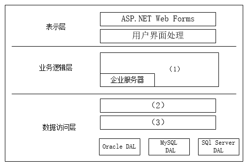

### 问题1

请用300字以内的文字分别说明数据库程序在线访问方式和ORM方式的优缺点，说明该软件企业采用ORM的原因。

**参考答案**

数据库程序的在线访问方式是直接使用SQL语句与数据库进行交互，开发人员需要手动编写SQL查询、更新等操作。优点是对数据库操作更加灵活，可以直接优化SQL语句以提高性能，适用于复杂查询和特定性能要求；缺点是需要开发人员具备较强的数据库知识和编程技能，且容易引入安全风险和代码冗余。
ORM（对象关系映射）方式通过将数据库表映射为面向对象的实体类，由ORM框架自动处理对象与数据库之间的映射关系，开发人员无需编写SQL语句，提高了开发效率和代码可维护性。优点包括减少了开发工作量、降低了数据库操作的复杂度、提高了代码的可读性和可维护性；缺点是可能存在性能损失、对复杂查询支持不足等问题。
该软件企业采用ORM的原因可能是为了提高开发效率、降低维护成本、减少人为错误，以及更好地实现面向对象编程范式。ORM可以帮助开发人员更专注于业务逻辑的实现，而不是关注数据库操作的细节，从而加快软件开发周期并提高整体的开发质量。

**答案解析**

数据库程序在线访问方式：开发人员直接编写SQL语句，灵活性高，但需要较强的数据库知识，且会带来安全隐患和代码冗余问题。
ORM方式：通过ORM框架自动处理数据库与对象之间的映射，简化开发流程和维护，但可能存在性能问题，特别是在复杂查询方面。
选择ORM的原因：由于该企业开发人员缺乏数据库开发经验，ORM的简便性降低了学习成本，避免了数据库操作的复杂性，同时提高了开发效率。

**浓缩知识点**：数据访问层与 ORM 数据库程序的在线访问方式是直接使用SQL语句与数据库进行交互，开发人员需要手动编写SQL查询、更新等操作。优点是对数据库操作更加灵活，可以直接优化SQL语句以提高性能，适用于复杂查询和特定性能要求；缺点是需要开发人员具备较强的数据库知识和编程技能，且容易引入安全风险和代码冗余。 ORM（对象关系映射）方式通过将数据库表映射为面向对象的实体类，由ORM框架自动处理对象与数据库之间的映射关系，开发人员无需编写SQL语句，提高了开发效率和代码可维护性。优点包括减少了开发工作量、降低了数据库操作的复杂度、提高了代码的可读性和可维护性；缺点是可能存在性能损失、对复杂查询支持不足等问

---

### 问题2

请用100宇以内的文字说明新体系架构中增加数据访问层的原因。请根据图4-1所示，填写图中空白处（1）-（3）。

**参考答案**

增加数据访问层的原因是为了实现数据与业务逻辑的分离，提高系统的可维护性、扩展性和灵活性。数据访问层负责处理数据库操作，封装数据访问细节，使业务逻辑层与具体的数据存储技术解耦，简化开发流程，同时也方便对数据访问进行统一管理和优化，从而提升系统的整体性能和可靠性。
（1）执行业务逻辑/业务组件/业务构件
（2）数据访问接口层/DAL接口
（3）工厂层/DAL工厂/数据访问工厂

**答案解析**

增加数据访问层是为了在系统架构中实现清晰的分层，将数据访问与业务逻辑解耦，提高系统的可维护性和扩展性。数据访问层（DAL）屏蔽了数据库的异构性，简化了数据库操作，并方便了后期的优化和管理。在图4-1中：
（1） 是业务层或组件，负责执行业务逻辑。
（2） 是数据访问接口层，定义统一的数据访问接口。
（3） 是工厂层，负责根据不同的数据库类型实例化相应的数据库访问对象。

**浓缩知识点**：数据访问层与 ORM 增加数据访问层的原因是为了实现数据与业务逻辑的分离，提高系统的可维护性、扩展性和灵活性。数据访问层负责处理数据库操作，封装数据访问细节，使业务逻辑层与具体的数据存储技术解耦，简化开发流程，同时也方便对数据访问进行统一管理和优化，从而提升系统的整体性能和可靠性。 （1）执行业务逻辑/业务组件/业务构件 增加数据访问层是为了在系统架构中实现清晰的分层，将数据访问与业务逻辑解耦，提高系统的可维护性和扩展性。数据访问层（DAL）屏蔽了数据库的异构性，简化了数据库操作，并方便了后期的优化和管理。在图4-1中： （1） 是业务层或组件，负责执行业务逻辑。

---

### 问题3

应用程序设计中，数据库访问需要良好的封装性和可维护性，因此经常使用工厂设计模式来实现对数据库访问的封装。请解释工厂设计模式，并说明其优点和应用场景；请解释说明工厂模式在数据访问层中的应用。

**参考答案**

工厂模式分抽象工厂与工厂方法，题目中的场景适合采用抽象工厂设计模式。
抽象工厂设计模式提供一个接口，可以创建一系列相关或相互依赖的对象，而无需指定它们具体的类。其优点是可以非常方便地创建一系列的对象，其使用场景也是创建系列对象的情况。在本题中，可以针对Oracle、MySQL、SQLServer分别建立抽象工厂，若指定当前工厂为Oracle工厂，则创建出来的数据库连接、数据集等一系列的对象都是符合Oracle操作要求的。这样便于数据库之间的切换。

**答案解析**

工厂设计模式：用于创建对象的设计模式，主要分为抽象工厂模式和工厂方法模式。工厂方法模式针对一个产品类的创建，而抽象工厂模式用于创建一系列相关的产品。通过封装对象创建过程，使得客户端代码与具体类的实例化解耦，避免了直接依赖具体类，便于扩展和维护。
应用场景：适用于创建一系列相关的对象，而不关心其具体实现类的情况。在数据访问层，工厂模式可以根据不同的数据库类型（如Oracle、MySQL、SQLServer）创建不同的数据库访问对象。通过这种方式，业务逻辑层无需关心具体的数据库类型，只需依赖于统一的接口，大大提高了系统的可维护性和扩展性。

**浓缩知识点**：数据访问层与 ORM 工厂模式分抽象工厂与工厂方法，题目中的场景适合采用抽象工厂设计模式。 抽象工厂设计模式提供一个接口，可以创建一系列相关或相互依赖的对象，而无需指定它们具体的类。其优点是可以非常方便地创建一系列的对象，其使用场景也是创建系列对象的情况。在本题中，可以针对Oracle、MySQL、SQLServer分别建立抽象工厂，若指定当前工厂为Oracle工厂，则创建出来的数据库连接、数据集等一系列的对象都是符合Oracle操作要求的。这样便于数据库之间的切换。 工厂设计模式：用于创建对象的设计模式，主要分为抽象工厂模式和工厂方法模式。工厂方法模式针对一个产品类的创建，而抽象工厂模式用于

---

> **知识点分组：数据架构与数据治理**

## 14. 2015年11月第4题（数据架构与数据治理）

- 题号：0020150501004
- 题目标签：数据架构与数据治理
- 难度：简单
- 频率：中频
- 浓缩知识点：数据架构与数据治理；重点围绕题干场景、架构决策与质量属性进行分析。

### 题目说明

阅读以下关于应用系统数据架构的说明，在答题纸上回答问题1至问题3。
【说明】
某软件公司拟开发一套贸易综合管理系统，包括客户关系管理子系统和商品信息管理子系统两部分。客户关系管理子系统主要管理客户信息，并根据贸易业务需要频繁向客户发送相关的电子邮件、短信等提醒信息。商品信息管理子系统主要为客户提供商品信息在线查询功能，包括商品基本信息、实时库存与价格等。
在对系统进行数据架构设计时，公司项目组的架构师王工主张采用文件系统进行数据管理，原因是目前公司客户和商品数量不大，且系统功能较为简单，采用文件系统进行数据管理简单直观，开发周期短。架构师李工则建议采用关系数据库进行数据管理，原因在于公司目前正处在高速扩张期，虽然目前的客户和商品数量不大，但随着公司快速发展，需要管理的数据必然飞速膨胀，采用关系数据库作为数据存储层，系统的扩展性更强，并能够对未来可能增加的复杂业务提供有效支持。经过讨论，项目组初步采纳了李工的意见，决定采用关系数据库存储客户数据，并针对业务特征对系统性能进行优化。

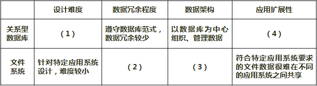

### 问题1

请从设计难度、数据冗余程度、数据架构、应用扩展性等4个方面对关系型数据库管理系统和文件系统两种数据存储方式进行比较，填写表4-1中(1)～(4)。

**参考答案**

（1）数据结构需要符合关系模式，设计难度较大
（2）可能在多个文件中复制相同的数据属性，数据冗余较大
（3）以应用系统为中心管理数据
（4）数据独立于应用系统，数据库系统接口标准化，易于在不同应用之间共享数据

**答案解析**

在信息系统架构设计中，选择文件系统还是关系数据库管理系统（RDBMS），取决于 系统复杂性、数据增长趋势、扩展需求 等。
设计难度：文件系统的数据组织简单，开发者仅需编写 I/O 操作即可，但缺乏数据模型约束，容易造成混乱。关系数据库必须遵循关系模式，需要设计 数据表、主外键、范式约束 等，设计难度更大，但数据结构更规范，利于长期维护。
数据冗余程度：文件系统往往是 应用驱动的数据存储，各应用独立管理数据，容易出现相同数据被重复存储在多个文件中，冗余度大，数据一致性难以保证。关系数据库通过 集中式数据管理 和规范化设计，能够有效减少冗余，提高一致性。
数据架构：文件系统是“以应用为中心”的数据架构，即应用直接驱动数据存取，数据组织依赖具体应用，缺乏统一的全局管理。关系数据库是“以数据为中心”的架构，数据库系统作为独立组件运行，应用通过标准接口访问数据，更具规范性。
应用扩展性：文件系统扩展性差，新应用往往无法直接重用已有数据，需要单独开发数据接口。关系数据库具有 标准化接口（如 JDBC/ODBC），实现了数据与应用的分离，使得数据更易共享和扩展。
综上，文件系统适用于数据量小、业务简单、开发周期短的场景，而关系数据库更适合 数据量大、业务复杂、扩展性要求高的企业应用。

**浓缩知识点**：数据架构与数据治理 （1）数据结构需要符合关系模式，设计难度较大 （2）可能在多个文件中复制相同的数据属性，数据冗余较大 在信息系统架构设计中，选择文件系统还是关系数据库管理系统（RDBMS），取决于 系统复杂性、数据增长趋势、扩展需求 等。 设计难度：文件系统的数据组织简单，开发者仅需编写 I/O 操作即可，但缺乏数据模型约束，容易造成混乱。关系数据库必须遵循关系模式，需要设计 数据表、主外键、范式约束 等，设计难度更大，但数据结构更规范，利于长期维护。

---

### 问题2

对系统的核心业务需求进行认真分析后，公司的资深架构师张工提出一种内存数据库和关系数据库的混合存储架构，其核心思想是将需要频繁读写的数据存入内存数据库，而将相对固定不变的数据存入关系数据库。请首先分析比较内存数据库和关系数据库在数据模型、读写性能、存储容量、可靠性等方面的差异，填写表4-2中（1）～（4）的空白，并根据张工的思路指定各种业务数据的存储方式，填写表4-3中（5）～（9）的空白。

**参考答案**

（1）Key-Value模式
（2）外存读写，性能相对较低
（3）运行时整个数据库基本全调入内存，数据库容量受内存容量限制，容量较小
（4）虽然也有恢复机制，但并不是所有故障都能恢复，可靠性较低
（5）内存数据库
（6）内存数据库
（7）关系数据库
（8）内存数据库
（9）内存数据库

**答案解析**

1. 内存数据库与关系数据库的差异：
数据模型：关系数据库采用表-行-列的关系模型，支持 SQL 查询和复杂事务。而内存数据库多采用 Key-Value 结构（如 Redis），结构简单，适合高频快速访问。
读写性能：关系数据库以磁盘存储为主，需经过磁盘 I/O，性能相对较低。而内存数据库将数据存放在内存中，访问延迟极低，吞吐量可提升数十倍。
存储容量：关系数据库容量大，可管理海量数据；内存数据库容量受物理内存限制，适合存储热点数据或频繁访问数据。
可靠性：关系数据库具有 日志、备份、恢复机制，可靠性高。内存数据库虽然有快照和持久化机制，但在掉电、宕机等情况下，部分数据可能丢失，可靠性相对较低。
2. 业务数据的存储方式：
（5）客户电子邮件：需要频繁调用和发送，存入 内存数据库。
（6）客户联系电话：同样高频使用，存入 内存数据库。
（7）客户基本信息：变化不频繁，适合存入 关系数据库。
（8）商品库存信息：需实时更新，存入 内存数据库。
（9）商品价格信息：经常变动，客户频繁查询，存入 内存数据库。
这种混合架构充分利用了关系数据库的 稳定性 与内存数据库的 高性能，实现了性能与可靠性的平衡，特别适用于电商、金融、贸易类系统。

**浓缩知识点**：数据架构与数据治理 （1）Key-Value模式 （2）外存读写，性能相对较低 1. 内存数据库与关系数据库的差异： 数据模型：关系数据库采用表-行-列的关系模型，支持 SQL 查询和复杂事务。而内存数据库多采用 Key-Value 结构（如 Redis），结构简单，适合高频快速访问。

---

### 问题3

系统开发完成进行压力测试时，发现在较大数据量的情况下，部分业务查询响应时间过长，经过分析发现其主要原因是部分SQL查询语句效率低下。请判断表4-4中的SQL语句设计策略哪些可能会提升查询效率，哪些可能会降低查询效率，在（1）~（4）中填入"提升"或"降低"。

**参考答案**

（1）提升
（2）降低
（3）降低
（4）提升

**答案解析**

SQL 查询效率与 语句结构、索引利用、返回数据量 密切相关。
（1）只返回需要的列：减少数据传输量，降低网络与内存开销，显然 提升 查询效率。
（2）使用子查询替代连接查询：子查询往往会导致数据库先生成临时表，再执行外层查询，增加开销，相比 JOIN 性能更差，因此 降低 效率。
（3）使用 NOT IN 或 NOT EXISTS：此类语句通常触发全表扫描，尤其在大数据量下效率低下，因此 降低。
（4）避免使用DISTINCT：DISTINCT 本质是“后处理去重”，往往增加一次全局操作，降低查询效率。如果能通过 索引设计、SQL 改写、逻辑优化 来避免产生重复数据，就能显著提升性能。

**浓缩知识点**：数据架构与数据治理 （1）提升 （2）降低 SQL 查询效率与 语句结构、索引利用、返回数据量 密切相关。 （1）只返回需要的列：减少数据传输量，降低网络与内存开销，显然 提升 查询效率。

---

## 15. 2021年11月第3题（数据架构与数据治理）

- 题号：0020210501003
- 题目标签：数据架构与数据治理
- 难度：简单
- 频率：中频
- 浓缩知识点：数据架构与数据治理；重点围绕题干场景、架构决策与质量属性进行分析。

### 题目说明

阅读以下关于嵌入式数据架构设计的相关描述，在答题纸上回答问题1至问题3。
【说明】
数据架构(Data architecture）是系统架构设计的主要工作之一。它主要用于描述业务数据以及数据间的关系。数据架构着重考虑"数据需求"，关注的是持久化数据的组织。数据架构的设计过程主要包括：数据定义、数据分布与数据管理。某公司为了适应宇航装备的持续发展，提升本公司的核心竞争力，改变原来事件驱动的架构设计模式。公司领导将新产品架构规划工作交给张工。张工经过分析、调研给出了本企业宇航产品的未来架构规划方案。

### 问题1

张工在规划方案中指出：宇航装备要实现以数据为中心的架构设计模式，就应改变传统的各个子系统独 的设计方式，打破原宇航装备的生产关系。为了达到这个目标，我们首先要解决装备数据的共享、管理和存储等问题，做好顶层的数据架构规划工作。请用300字以内的文字说明数据定义、数据分布与数据管理的具体内涵。

**参考答案**

数据定义：数据定义要反映业务模式的本质，确保数据架构为业务需求提供全面、一致、完整的高质量数据。数据定义要划分应用系统边界，明确数据引用关系，定义应用系统间的集成接口。定义数据模型主要包括：数据概念模型、数据逻辑模型、数据物理模型和数据标准。
数据分布：数据分布是数据系统分布的基础。包含数据业务、数据分析和数据存储。数据业务是分析数据在业务各环节的创建、引用、修改或删除的关系。数据分析是在单一应用系统中的分析数据结构与应用系统各功能间的引用关系，分析数据在多个系统间的引用关系。数据存储包含分析数据集中存储和数据分布存储两种模式，要根据需求选择数据分布策略。
数据管理：数据管理是要制定贯穿数据生命周期的各项管理制度，包括：数据模型与数据标准管理，数据分布管理，数据质量管理和数据安全管理等制度。确定数据管理组织或岗位。

**答案解析**

在顶层数据架构设计中，首先要解决数据定义问题。数据定义决定了数据元素的 语义、格式、约束和关系，通过统一的数据模型可实现跨系统的数据理解与复用。其次是数据分布，它关系到 数据存储的物理位置和访问策略，涉及集中存储与分布式存储的权衡，保证不同子系统的数据流转与共享。最后是数据管理，即对数据生命周期全过程的 制度化管控，如数据采集、清洗、存储、备份、安全与权限控制等，确保数据完整性和一致性。通过这三方面的统筹，能够实现宇航装备的数据驱动设计与生产，促进协同开发和高效决策。

**浓缩知识点**：数据架构与数据治理 数据定义：数据定义要反映业务模式的本质，确保数据架构为业务需求提供全面、一致、完整的高质量数据。数据定义要划分应用系统边界，明确数据引用关系，定义应用系统间的集成接口。定义数据模型主要包括：数据概念模型、数据逻辑模型、数据物理模型和数据标准。 数据分布：数据分布是数据系统分布的基础。包含数据业务、数据分析和数据存储。数据业务是分析数据在业务各环节的创建、引用、修改或删除的关系。数据分析是在单一应用系统中的分析数据结构与应用系统各功能间的引用关系，分析数据在多个系统间的引用关系。数据存储包含分析数据集中存储和数据分布存储两种模式，要根据需求选择数据分布策略。 在顶层数据架构设

---

### 问题2

张工在规划方案中提出公司未来产品设计要遵从一种开放式的架构体系，并在此基础上完善数据架构的设计工作，形成一套规格化的数据模型语言。张工给出了基于FACE（Future Airborne Capability Environment)架构的新产品架构，其中，图3-1说明了数据模型语言在架构模型中的作用。
请根据你所掌握的数据架构的相关知识，从以下a~g中进行选择，填充完善图3-1中的（1）~（7）空格。
a.数据模型定义
b.平台数据模型（PDM）
c.UoP（Unit of Portability）数据模型（UM）
d.提炼
e.传输定义
f.代码和配置
g.概念数据模型（CDM）

**参考答案**

(1) a
(2) g
(3) b
(4) f
(5) c
(6) d
(7) e

**答案解析**

在 FACE 架构中，数据模型语言承担了从 概念建模到实现落地 的桥梁作用。首先进行 数据模型定义（a），再通过 概念数据模型（g） 表达业务语义。随后形成面向平台的 PDM（b），最终生成可运行的 代码与配置（f）。同时，还需映射至 UoP 数据模型（c），以保证可移植性和复用性。数据模型的演进过程中要经过 提炼（d） 的过程，以去除冗余，提取核心信息，并通过 传输定义（e） 来确保跨模块、跨系统间的数据交换一致性。该流程展示了 FACE 架构下数据建模的分层思想。

**浓缩知识点**：数据架构与数据治理 (1) a (2) g 在 FACE 架构中，数据模型语言承担了从 概念建模到实现落地 的桥梁作用。首先进行 数据模型定义（a），再通过 概念数据模型（g） 表达业务语义。随后形成面向平台的 PDM（b），最终生成可运行的 代码与配置（f）。同时，还需映射至 UoP 数据模型（c），以保证可移植性和复用性。数据模型的演进过程中要经过 提炼（d） 的过程，以去除冗余，提取核心信息，并通过 传输定义（e） 来确保跨模块、跨系统间的数据交换一致性。该流程展示了 FACE 架构下数据建模的分层思想。

---

### 问题3

"数据需求"是数据架构设计中需要着重考虑的问题。在张工给出的基于FACE架构的新产品架构中，分别就架构中的各个部分逐条给出了需求项。请判断表3-1给出的9项需求是否属于数据需求。

**参考答案**

（1）否
（2）是
（3）否
（4）是
（5）是
（6）否
（7）是
（8）否
（9）否

**答案解析**

数据需求是指对 数据内容、结构、质量、安全与共享方式 的要求，而非对功能、性能或硬件的要求。表 3-1 中第 (2)(4)(5)(7) 涉及数据一致性、共享、存储与安全等，符合数据需求的范畴；而第 (1)(3)(6)(8)(9) 则涉及业务逻辑、接口性能、系统实现或运行特性，不属于数据需求。明确区分数据需求与其他需求，有助于架构设计中各层次的责任划分，避免混淆。特别注意这里的(6)，是指我们的“安全传输模块”在访问数据时，必须遵守 FACE 数据架构规定的边界与访问规范，不可以随意访问或操作架构外的数据。所以他强调的是数据安全规范的一致性，而不是数据本身的内容，了解即可，不用深究。

**浓缩知识点**：数据架构与数据治理 （1）否 （2）是 数据需求是指对 数据内容、结构、质量、安全与共享方式 的要求，而非对功能、性能或硬件的要求。表 3-1 中第 (2)(4)(5)(7) 涉及数据一致性、共享、存储与安全等，符合数据需求的范畴；而第 (1)(3)(6)(8)(9) 则涉及业务逻辑、接口性能、系统实现或运行特性，不属于数据需求。明确区分数据需求与其他需求，有助于架构设计中各层次的责任划分，避免混淆。特别注意这里的(6)，是指我们的“安全传输模块”在访问数据时，必须遵守 FACE 数据架构规定的边界与访问规范，不可以随意访问或操作架构外的数据。所以他强调的是数据安全规范的一致性，而不是数据本身

---

> **知识点分组：数据库缓存策略**

## 16. 2022年11月第4题（数据库缓存策略）

- 题号：0020220501004
- 题目标签：数据库缓存策略
- 难度：中等
- 频率：高频
- 浓缩知识点：数据库缓存策略；重点围绕题干场景、架构决策与质量属性进行分析。

### 题目说明

阅读以下关于数据库缓存的叙述，在答题纸上回答问题1至问题3。
【说明】
某大型电商平台建立了一个在线 B2B 商店系统，并在全国多地建设了货物仓储中心，通过提前备货的方式来提高货物的运送效率。但是在运营过程中，发现会出现很多跨仓储中心调货从而延误货物运送的情况。为此，该企业计划新建立一个全国仓储货物管理系统，在实现仓储中心常规管理功能之外，通过对在线 B2B 商店系统中订单信息进行及时的分析和挖掘，并通过大数据分析预测各地仓储中心中各类货物的配置数量，从而提高运送效率，降低成本。
当用户通过在线 B2B 商店系统选购货物时，全国仓储货物管理系统会通过该用户所在地址、商品类别以及仓储中心的货物信息和地址，实时为用户订单反馈货物起运地（某仓储中心）并预测送达时间。反馈送达时间的响应时间应小于1秒。
为满足反馈送达时间功能的性能要求，设计团队建议在全国仓储货物管理系统中采用数据缓存集群的方式，将仓储中心基本信息、商品类别以及库存数量放置在内存的缓存中，而仓储中心的其它商品信息则存储在数据库系统。

### 问题1

设计团队在讨论缓存和数据库的数据一致性问题时，李工建议采取数据实时同步更新方案，而张工则建议采用数据异步准实时更新方案。请用200字以内的文字，简要介绍两种方案的基本思路，说明全国仓储货物管理系统应该采用哪种方案，并说明采取该方案的原因。

**参考答案**

实时同步方案：数据库数据一旦更新，立即同步更新缓存中的对应数据，保证数据强一致性。
异步准实时方案：数据库更新时不立即更新缓存，而是将变更记录入日志或消息队列中，再由后台任务异步刷新缓存，最终实现数据一致性。
全国仓储货物管理系统应采用异步准实时方案。原因是该系统对响应性能要求极高（小于1秒），而实时同步在高并发场景下存在性能瓶颈和风险。异步更新可以减小响应延迟，满足业务对高性能的需求。

**答案解析**

题干中强调用户操作需“实时反馈起运地并预测送达时间”，其关键是快速响应，而非缓存数据绝对实时。异步准实时方案在绝大多数场景下可实现秒级或更快的数据同步，能有效减少系统阻塞与性能开销，是大型系统缓存设计的主流做法。

**浓缩知识点**：数据库缓存策略 实时同步方案：数据库数据一旦更新，立即同步更新缓存中的对应数据，保证数据强一致性。 异步准实时方案：数据库更新时不立即更新缓存，而是将变更记录入日志或消息队列中，再由后台任务异步刷新缓存，最终实现数据一致性。 题干中强调用户操作需“实时反馈起运地并预测送达时间”，其关键是快速响应，而非缓存数据绝对实时。异步准实时方案在绝大多数场景下可实现秒级或更快的数据同步，能有效减少系统阻塞与性能开销，是大型系统缓存设计的主流做法。

---

### 问题2

随着业务的发展，仓储中心以及商品的数量日益增加，需要对集群部署多个缓存节点，提高缓存的处理能力。李工建议采用缓存分片方法，把缓存的数据拆分到多个节点分别存储，减轻单个缓存节点的访问压力，达到分流效果。缓存分片方法常用的有哈希算法和一致性哈希算法，李工建议采用一致性哈希算法来进行分片。请用200字以内的文字简要说明两种算法的基本原理，并说明李工采用一致性哈希算法的原因。

**参考答案**

普通哈希算法通过哈希函数将键值映射到固定缓存节点上，节点变动会导致大量数据迁移。
一致性哈希算法将节点和数据通过哈希函数映射到一个环形空间，节点增减只影响局部数据，迁移量小。
李工建议使用一致性哈希算法，是因为它具备良好的节点扩展性与容错性，适应系统动态变化，同时保持数据分布均衡，保障缓存访问效率。

**答案解析**

一致性哈希其实就是为了解决「分布式系统中节点变化时数据迁移太多」的问题。
最初的负载均衡办法是轮询，比如 3 个节点就轮流分配请求，这样适合每个节点存的都是一样的数据。但一旦进入分布式场景，每个节点保存的数据不同，就需要一种“定点”的办法来找到某个 key 在哪个节点上。
于是大家想到哈希取模：hash(key) % 节点数。这种方式简单高效，但有致命缺陷：只要节点数一变（扩容或缩容），几乎所有 key 的映射都会失效，最坏情况需要迁移全部数据，成本太高。举个例子，假设一开始有 3 个节点 A、B、C，key-01 落在 A，key-02 落在 B，key-03 落在 C；当我们新增一个节点 D 时，取模公式从 %3 变成 %4，结果 key-01 被映射到 C、key-02 被映射到 D、key-03 又被映射到 A，几乎所有数据都要迁移，非常麻烦。
一致性哈希的思路是：不对节点数取模，而是固定对一个大数（比如 2^32）取模，把结果组织成一个环，叫哈希环。节点和数据都经过哈希后落到环上。数据的归属规则是：顺时针找到的第一个节点就是它的宿主。这样一来，新增或减少一个节点，只会影响它在环上邻近的一小部分数据，不再需要全局迁移。比如刚才新增节点 D 的场景下，只有 key-02 会被迁移到 D，key-01 和 key-03 依然留在原来的节点，迁移量大大减少。
不过，一致性哈希有个问题：节点可能在环上分布不均，导致有的节点负担过重。为了解决这个问题，引入了“虚拟节点”。一个真实节点可以对应多个虚拟节点，这些虚拟节点分散映射到环上，再统一指向真实节点。这样一来，分布会更均匀，负载也能根据权重灵活分配。工程里常常一个真实节点就会挂上百个虚拟节点。比如节点 A 不再只出现在环上的一个位置，而是映射成 A-01、A-02、A-03 等多个虚拟节点，均匀散落在环上，这样数据就不会都挤到某个节点上了。

**浓缩知识点**：数据库缓存策略 普通哈希算法通过哈希函数将键值映射到固定缓存节点上，节点变动会导致大量数据迁移。 一致性哈希算法将节点和数据通过哈希函数映射到一个环形空间，节点增减只影响局部数据，迁移量小。 一致性哈希其实就是为了解决「分布式系统中节点变化时数据迁移太多」的问题。 最初的负载均衡办法是轮询，比如 3 个节点就轮流分配请求，这样适合每个节点存的都是一样的数据。但一旦进入分布式场景，每个节点保存的数据不同，就需要一种“定点”的办法来找到某个 key 在哪个节点上。

---

### 问题3

全国仓储货物管理系统开发完成，在运营一段时间后，系统维护人员发现大量黑客故意发起非法的商品送达时间查询请求，造成了缓存穿透。张工建议尽快采用布隆过滤器方法解决。请用200字以内的文字解释布隆过滤器的工作原理和优缺点。

**参考答案**

布隆过滤器通过多个哈希函数将元素映射到位数组上，用于判断某元素是否存在于集合中。查询时检查对应位是否全为1，若有0则必然不存在。
优点：占用内存小，查询速度快，适合大规模数据过滤。缺点：存在误判率（可能将不存在的数据判断为存在），且不支持删除操作。
布隆过滤器可有效拦截大量无效请求，防止缓存穿透，提升系统稳定性。

**答案解析**

布隆过滤器（Bloom Filter）是处理海量数据存在性判断的利器。
简单来说，它回答的问题是：“某个元素可能在集合中吗？”——如果它说“不在”，那一定不在；如果它说“在”，则有极小的概率是误判。
它的原理并不复杂。布隆过滤器由一个位数组（bit array）和若干个哈希函数组成。初始时，位数组全是 0。当我们往布隆过滤器里添加一个元素时，会经过多个哈希函数映射出几个下标，并把对应下标的位设置为 1。以后要判断某个元素是否存在时，再用相同的哈希函数去计算，如果这些下标对应的位都为 1，就认为元素存在；只要有一位是 0，就可以确定元素一定不存在。这就是它的节省空间的秘密：每个元素并不存储实际内容，而只是“打了几个标记”。
布隆过滤器的优缺点非常鲜明。优点是空间效率极高，比如要存 100 万个元素，只需要大约 122KB 的内存；查询速度也很快，适合高并发场景。缺点是会有误判，尤其是元素越多，误判率越高；另外删除不方便，因为多个元素可能共用同一位置。
在实际应用中，布隆过滤器可以做到：
缓存穿透防护：用户请求一个数据库中根本不存在的 key，如果没有布隆过滤器，可能每次都打到数据库，拖垮后端。有了布隆过滤器，可以快速判断请求是否无效，直接拦截。
爬虫去重：在抓取网页时，已经爬过的 URL 通过布隆过滤器标记，下次遇到就可以直接跳过。
黑名单拦截：比如邮箱垃圾过滤、手机号黑名单判断，快速筛查某个元素是否在海量名单中。
在工程上，我们既可以手写一个布隆过滤器（用 Java 的 BitSet 和自定义哈希函数实现），也可以直接用 Google Guava 提供的布隆过滤器工具类，设置容量和误判率即可开箱即用。如果想在分布式场景下使用，还可以借助 RedisBloom 模块，把布隆过滤器部署在 Redis 中，天然支持扩展和多语言调用。

**浓缩知识点**：数据库缓存策略 布隆过滤器通过多个哈希函数将元素映射到位数组上，用于判断某元素是否存在于集合中。查询时检查对应位是否全为1，若有0则必然不存在。 优点：占用内存小，查询速度快，适合大规模数据过滤。缺点：存在误判率（可能将不存在的数据判断为存在），且不支持删除操作。 布隆过滤器（Bloom Filter）是处理海量数据存在性判断的利器。 简单来说，它回答的问题是：“某个元素可能在集合中吗？”——如果它说“不在”，那一定不在；如果它说“在”，则有极小的概率是误判。

---

## 17. 2024年11月第2题（数据库缓存策略）

- 题号：0020241101002
- 题目标签：数据库缓存策略
- 难度：中等
- 频率：高频
- 浓缩知识点：数据库缓存策略；重点围绕题干场景、架构决策与质量属性进行分析。

### 题目说明

阅读以下关于数据库缓存架构的叙述，在答题纸上回答问题1-3。
某电商平台使用缓存来存储热点商品数据。旁路缓存模式是常见的一种缓存模式，其核心是将缓存模块设置为I/O路径的一个非强制性组成部分。这意味着缓存模块可以根据需要灵活地加入或移除，而不会影响原有的I/O路径的完整性。在这种模式下，缓存是一个附加组件，提供了一个可选的数据访问路径。

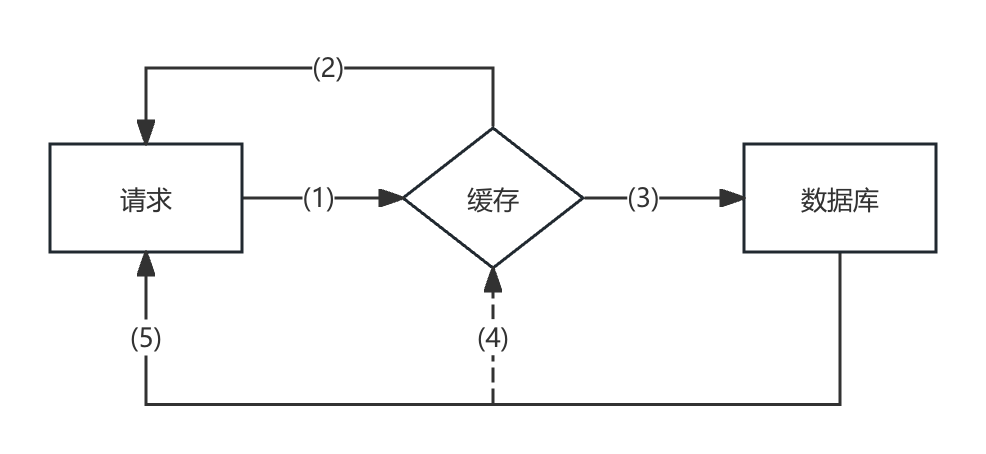

### 问题1

根据旁路缓存模式的读数据原理，填写下图中（1）到（5）的空白。

**参考答案**

（1）向缓存请求读取该商品信息
（2）有缓存目标数据则直接返回， 若命中则返回该商品信息
（3）没有则提交给数据库进行查询，若未命中则访问数据库查询该商品信息
（4）将查询到的数据库数据更新到缓存
（5）将查询到的数据库目标数据返回

**答案解析**

旁路模式在开发中用的比较多，其核心是将缓存模块设置为I/O路径的一个非强制性组成部分。在这种模式下，缓存是一个附加组件。在读操作中，首先根据Key在缓存中查找所需的数据。如果成功找到（命中），则直接返回数据；若未命中，则会从存储模块获取，并在适当的时候把数据写入缓存。
另外还有两种模式凯恩建议大家了解。
读写穿透（Read/Write Through） 模式是指所有读写操作都经过缓存，缓存负责同步数据库。该模式保证了缓存与数据库的数据一致性，适合读写均衡且对一致性要求较高的系统，例如权限管理或账户信息场景。但它高度依赖缓存系统，一旦缓存出现故障，将严重影响整体服务稳定性。在日常开发中，可以尝试使用 Redisson + RMapLoader/Writer 的组合。
写回缓存（Write Back / Write Behind） 模式是将写操作先写入缓存，再异步写入数据库，能显著提升写入性能，适用于写多读少、对实时一致性要求不高的场景，如日志收集或行为打点系统。缺点是数据可能在写入数据库前丢失，存在一致性风险，需配合持久化机制确保可靠性。一般和消息队列进行配合。

**浓缩知识点**：数据库缓存策略 （1）向缓存请求读取该商品信息 （2）有缓存目标数据则直接返回， 若命中则返回该商品信息 旁路模式在开发中用的比较多，其核心是将缓存模块设置为I/O路径的一个非强制性组成部分。在这种模式下，缓存是一个附加组件。在读操作中，首先根据Key在缓存中查找所需的数据。如果成功找到（命中），则直接返回数据；若未命中，则会从存储模块获取，并在适当的时候把数据写入缓存。 另外还有两种模式凯恩建议大家了解。

---

### 问题2

根据旁路缓存模式写数据原理，填写下图中（1）（2）的空白。

**参考答案**

（1）更新数据库中的目标商品信息（2）删除缓存中的目标商品信息

**答案解析**

旁路模式的写操作流程如下所示：（1）接收到写请求后，首先更新数据库中的数据。（2）数据库中的数据更新完毕后，会发请求给缓存，删除相关联的缓存条目。这里应当删除相应的缓存条目，而非更新缓存。这个主要是出于缓存数据库一致性的考虑了解即可。

**浓缩知识点**：数据库缓存策略 （1）更新数据库中的目标商品信息（2）删除缓存中的目标商品信息 旁路模式的写操作流程如下所示：（1）接收到写请求后，首先更新数据库中的数据。（2）数据库中的数据更新完毕后，会发请求给缓存，删除相关联的缓存条目。这里应当删除相应的缓存条目，而非更新缓存。这个主要是出于缓存数据库一致性的考虑了解即可。

---

### 问题3

王工使用了多线程技术进行缓存处理，线程1负责写入，线程2负责读取，可能存在数据不一致性问题，请解释其原因，并给出3个以上的解决办法。

**参考答案**

旁路模式在多线程场景下：线程1 正在写入数据库，但还没来得及删除缓存；线程2 此时仍然从旧缓存读取，拿到过期数据。
解决方案如下：
（1）延迟双删（最终一致性）。在写入数据时，先删除缓存中的数据，然后更新数据源中的数据，最后在经过一段短暂的延迟后再次删除缓存（记住结论即可，推论比较复杂，这里就很玄学了，什么叫短暂的时间，多短多长，不同的时间设置，在不同的业务场景也有可能导致不一致，概率高低罢了）。
（2）先写数据库再删除缓存（最终一致性）（会有失效的情况，但是概率很低，就是缓存失效和写数据库同时发生的时候，这时候会有旧数据填充到缓存里，记住结论即可，实践中常用这个方法，因为最简单）。
（3）分布式锁（强一致性）。写操作的过程为获取写锁、更新数据库、删除缓存、释放写锁。读数据的时候也要对访问数据库的操作获取读锁。缓存读取完毕之后，释放读锁，确保读写操作序列化。这里的锁可以通过 Redis SET lock_key unique_value NX PX 10000 命令设置（一般以数据为 Key）。
（4）消息队列进行序列化读写操作（强一致性）。消息队列进行读写操作。把同一业务键的写请求路由到同一消息队列，天然顺序、无乱序覆盖。
（5）订阅binlog日志（最终一致性）。在写入数据时，先数据源中的数据。同时可以使用阿里的canal将binlog日志采集发送到MQ队列里面，然后通过ACK机制确认处理这条更新消息，修改缓存，保证数据缓存一致性。因为队列消费是按顺序的，所以缓存最终会依据顺序修改达到最后的状态。

**答案解析**

这里会有一个同步问题。假设线程1做了一个写入数据库的操作，此时数据库的值是新的，缓存是旧的，我当然希望缓存也是立刻变成新的，这样肯定不会有业务问题。但是我们是一个高并发的系统，可能你在写完数据库之后，还没来得及改缓存，后面的一个线程就来读，此时它读的是缓存的就旧值，这样就可能发生业务问题。
所以这里的解决办法：一种是基于强一致性，也就是保证数据库中的值和缓存中的数据任何情况下都一致，假如不一致，缓存没改完前不给别人读，但是这种方法需要用分布式锁/事务/队列串行化，会显著影响性能，不太适合高并发场景。另外一种是最终一致性，允许数据库和缓存短暂不一致，但是可以确保过了一段时间，数据库和缓存的值肯定是一样的，都是最新的。我们要做的就是缩短这个不一致的时间。

**浓缩知识点**：数据库缓存策略 旁路模式在多线程场景下：线程1 正在写入数据库，但还没来得及删除缓存；线程2 此时仍然从旧缓存读取，拿到过期数据。 解决方案如下： 这里会有一个同步问题。假设线程1做了一个写入数据库的操作，此时数据库的值是新的，缓存是旧的，我当然希望缓存也是立刻变成新的，这样肯定不会有业务问题。但是我们是一个高并发的系统，可能你在写完数据库之后，还没来得及改缓存，后面的一个线程就来读，此时它读的是缓存的就旧值，这样就可能发生业务问题。 所以这里的解决办法：一种是基于强一致性，也就是保证数据库中的值和缓存中的数据任何情况下都一致，假如不一致，缓存没改完前不给别人读，但是这种方法需要用分布式锁/事

---

## 18. 2024年11月第3题（数据库缓存策略）

- 题号：0020241101003
- 题目标签：数据库缓存策略
- 难度：中等
- 频率：高频
- 浓缩知识点：数据库缓存策略；重点围绕题干场景、架构决策与质量属性进行分析。

### 题目说明

阅读以下关于数据库缓存架构的叙述，在答题纸上回答问题1-3。
【说明】
某智能科技公司承接了一项开发服务型机器人的重要项目，该机器人旨在应用于大型商场，为顾客提供导购、信息咨询以及简单的货物搬运等服务。在项目开发过程中，选用了嵌入式系统架构，并决定采用机器人操作系统 ROS 来构建机器人的软件平台。

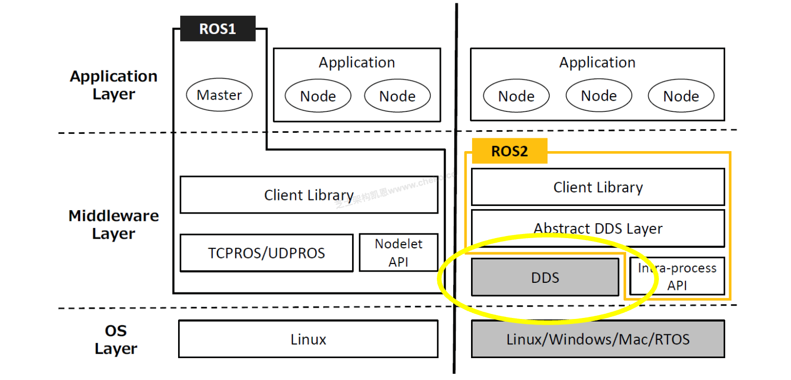

### 问题1

请用150字说明ROS定义和特点。ROS2 与 ROS1 相比哪些地方做了改进，请用150 字描述。

**参考答案**

（1）ROS（机器人操作系统）是一个开源的机器人软件平台，提供了一系列工具、库和约定，用于帮助开发者创建机器人应用程序，能实现机器人各模块间的通信与协作。特点是具有分布式架构，可使不同节点协同工作；有丰富的开源库和工具，能减少开发成本与周期；还具备良好的可扩展性和兼容性，方便添加新功能与硬件。
（2）ROS2 在通信机制上更高效，采用数据分发服务（Data Distribution Service） DDS 提高实时性和可靠性。增强了跨平台支持，可更好适配多种系统。改进了软件架构，让系统更稳定、灵活，且安全性提升。同时，解决了 ROS1 中的一些痛点，如多机通信更便捷等，更适合复杂机器人系统开发。

**答案解析**

这道题本质上是考察你对 ROS 基础知识的理解，以及对 ROS2 相较于 ROS1 技术演进的掌握。ROS1相关内容书本有简单介绍，但是ROS2没有，要看考生行业积累。

**浓缩知识点**：数据库缓存策略 （1）ROS（机器人操作系统）是一个开源的机器人软件平台，提供了一系列工具、库和约定，用于帮助开发者创建机器人应用程序，能实现机器人各模块间的通信与协作。特点是具有分布式架构，可使不同节点协同工作；有丰富的开源库和工具，能减少开发成本与周期；还具备良好的可扩展性和兼容性，方便添加新功能与硬件。 （2）ROS2 在通信机制上更高效，采用数据分发服务（Data Distribution Service） DDS 提高实时性和可靠性。增强了跨平台支持，可更好适配多种系统。改进了软件架构，让系统更稳定、灵活，且安全性提升。同时，解决了 ROS1 中的一些痛点，如多机通信更便捷等，更适合

---

### 问题2

请将符合的描述的 ROS 的通信机制名称填入下方空格处。
（1） 是一种单向通信模型，在通信双方中，发布方发布数据，订阅方订阅数据，数据流单向的由发布方传输到订阅方。
（2） 是一种基于请求响应的通信模型，在通信双方中，客户端发送请求数据到服务端，服务端响应结果给客户端。
（3） 是一种带有连续反馈的通信模型，在通信双方中，客户端发送请求数据到服务端，服务端响应结果给客户端，但是在服务端接收到请求到产生最终响应的过程中，会发送中间连续的反馈（进度）信息到客户端。
（4） 是一种基于共享的通信模型，在通信双方中，服务端可以设置数据，而客户端可以连接服务端并操作服务端数据。

**参考答案**

（1）话题通信 / 发布-订阅机制（2）服务通信（3）动作通信（4）参数服务

**答案解析**

（1）发布-订阅机制（Publish/Subscribe）
“单向通信模型”、“发布方”、“订阅方”、“数据单向传输”都给出了提示。这是 ROS 最基本的通信机制之一。节点通过发布（publish）消息到某个 topic，订阅者（subscriber）监听该 topic 并接收消息。特点是解耦、多对多、实时传输。这里使用“话题通信”或“发布-订阅机制”都可以，关键是体现出你理解这个模型的核心特征：基于 topic，数据单向流动，解耦式通信。
（2）服务机制（Service）
“请求响应”、“客户端发送请求”、“服务端响应结果”是关键。在服务机制模式下，类似传统 RPC 通信模式，客户端调用服务（service），服务端返回结果，适用于同步、一对一通信。特点是阻塞式、同步请求响应。
（3）动作机制（Action）
题干中提到“连续反馈”、“中间反馈”、“最终响应”，适用于需要持续执行、状态反馈的任务，如导航或机械臂运动。基于 service+topic 实现，提供中间状态（feedback）、最终结果（result）等。特点是支持异步、带进度反馈。
（4）参数机制（Parameter Server）
题干中提到“共享”、“服务端设置数据”、“客户端连接与操作”。ROS 提供了一个参数服务器，用于存储运行时可共享的配置参数。节点可读写这些参数。特点是集中式存储、配置共享、适合静态参数。

**浓缩知识点**：数据库缓存策略 （1）话题通信 / 发布-订阅机制（2）服务通信（3）动作通信（4）参数服务 （1）发布-订阅机制（Publish/Subscribe） “单向通信模型”、“发布方”、“订阅方”、“数据单向传输”都给出了提示。这是 ROS 最基本的通信机制之一。节点通过发布（publish）消息到某个 topic，订阅者（subscriber）监听该 topic 并接收消息。特点是解耦、多对多、实时传输。这里使用“话题通信”或“发布-订阅机制”都可以，关键是体现出你理解这个模型的核心特征：基于 topic，数据单向流动，解耦式通信。

---

### 问题3

立足系统架构，ROS2 可以划分为三层。请解析 ROS2架构每一层含义。

**参考答案**

ROS2 从系统架构角度可分为三层：通信层、中间层和应用层。通信层基于 DDS 实现节点间的高性能、实时分布式通信；中间层提供如 rclcpp、rclpy 等客户端库，封装底层通信接口，供用户用主流语言开发节点；应用层则包含具体的功能包与节点，用于实现感知、导航、控制等高层逻辑，支撑整个机器人系统的业务运行。

**答案解析**

ROS2 的系统架构可以清晰划分为三层结构：操作系统层（OS Layer）、中间件层（Middleware Layer） 和 应用层（Application Layer）。每层功能如下：
操作系统层提供基础运行环境，支持多平台和实时系统；中间件层采用 DDS 实现高性能通信，并通过抽象层屏蔽具体实现，支持进程内通信优化；应用层包括用户编写的节点和功能包，通过客户端库与中间件交互，实现机器人系统的感知、控制与决策等功能。

**浓缩知识点**：数据库缓存策略 ROS2 从系统架构角度可分为三层：通信层、中间层和应用层。通信层基于 DDS 实现节点间的高性能、实时分布式通信；中间层提供如 rclcpp、rclpy 等客户端库，封装底层通信接口，供用户用主流语言开发节点；应用层则包含具体的功能包与节点，用于实现感知、导航、控制等高层逻辑，支撑整个机器人系统的业务运行。 ROS2 的系统架构可以清晰划分为三层结构：操作系统层（OS Layer）、中间件层（Middleware Layer） 和 应用层（Application Layer）。每层功能如下： 操作系统层提供基础运行环境，支持多平台和实时系统；中间件层采用 DDS 实现高性能通

---
