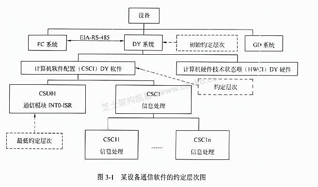

# 案例题_系统安全

- 对应软考高级系统架构设计师章节：信息安全技术基础知识、软件可靠性基础知识、嵌入式系统架构设计理论与实践、安全架构设计理论与实践

- 大题数量：4
- 小问数量：12

---

> **知识点分组：安全架构与威胁防护**

## 1. 2013年11月第5题（安全架构与威胁防护）

- 题号：0020130501005
- 题目标签：安全架构与威胁防护
- 难度：中等
- 频率：中频
- 浓缩知识点：安全架构与威胁防护；重点围绕题干场景、架构决策与质量属性进行分析。

### 题目说明

阅读以下有关软件与信息安全方面的说明，在答题纸上回答问题1至问题3。
【说明】
某软件公司拟开发一套信息安全支撑平台，为客户的局域网业务环境提供信息安全保护。该支撑平台的主要需求如下：
（1）为局域网业务环境提供用户身份鉴别与资源访问授权功能；
（2）为局域网环境中交换的网络数据提供加密保护；
（3）为服务器和终端机存储的敏感持久数据提供加密保护；
（4）保护的主要实体对象包括局域网内交换的网络数据包、文件服务器中的敏感数据文件、数据库服务器中的敏感关系数据和终端机用户存储的敏感数据文件；
（5）服务器中存储的敏感数据按安全管理员配置的权限访问；
（6）业务系统生成的单个敏感数据文件可能会达到数百兆的规模；
（7）终端机用户存储的敏感数据为用户私有；
（8）局域网业务环境的总用户数在100人以内。

### 问题1

在确定该支撑平台所采用的用户身份鉴别机制时，王工提出采用基于口令的简单认证机制，而李工则提出采用基于公钥体系的认证机制。项目组经过讨论，确定采用基于公钥体系的机制，请结合上述需求具体分析采用李工方案的原因。

**参考答案**

（1）基于口令的认证方式实现简单，但由于口令复杂度及管理方面的原因，易受到认证攻击；而在基于公钥体系的认证方式中，由于其密钥机制的复杂性，同时在认证过程中私钥不在网络上传输，因此可以有效防止认证攻击，与基于口令的认证方式相比更为安全。
（2）按照需求描述，在完成用户身份鉴别后，需依据用户身份进一步对业务数据进行安全保护，且受保护数据中包含用户私有的终端机数据文件，在基于口令的认证方式中，用户口令为用户和认证服务器共享，没有用户独有的直接秘密信息，而在基于公钥的认证方式中，可基于用户私钥对私有数据进行加密保护，实现更加简便。
（3）基于公钥体系的认证方式协议和计算更加复杂，因此其计算复杂度要高于基于口令的认证方式，但业务环境的总用户数在100人以内，用户规模不大，运行环境又为局域网环境，因此基于公钥体系的认证方式可以满足平台效率要求。

**答案解析**

在用户身份鉴别机制的选择上，安全性与效率的平衡是关键。口令认证的优势在于实现简单、成本低，但缺点十分突出：一方面，用户口令可能过于简单、重复使用或未及时更新，极易遭受暴力破解、字典攻击、社工攻击；另一方面，口令在传输或存储过程中若缺乏完善的加密保护，容易被窃取或伪造，从而导致身份冒充。在本案例中，用户数量虽不大，但涉及的安全对象涵盖网络数据、文件、数据库敏感字段等，一旦口令被攻破，系统将失去防护意义。
相比之下，基于公钥体系的认证机制（PKI） 依托非对称加密技术，客户端通过持有的私钥和公钥对进行认证，私钥仅保存在用户本地，从未在网络中传输，因此可以避免口令传输的脆弱性。同时，系统能够利用用户的私钥为其生成独有的签名，从而绑定用户身份与私有数据，实现身份认证与数据保护一体化。虽然其计算代价较大，但考虑到业务环境为局域网、用户规模仅100人以内，性能开销完全可接受。因此，该系统选择基于公钥体系的认证机制，能够兼顾高安全性与可行性，是更加合理的架构决策。

**浓缩知识点**：安全架构与威胁防护 （1）基于口令的认证方式实现简单，但由于口令复杂度及管理方面的原因，易受到认证攻击；而在基于公钥体系的认证方式中，由于其密钥机制的复杂性，同时在认证过程中私钥不在网络上传输，因此可以有效防止认证攻击，与基于口令的认证方式相比更为安全。 （2）按照需求描述，在完成用户身份鉴别后，需依据用户身份进一步对业务数据进行安全保护，且受保护数据中包含用户私有的终端机数据文件，在基于口令的认证方式中，用户口令为用户和认证服务器共享，没有用户独有的直接秘密信息，而在基于公钥的认证方式中，可基于用户私钥对私有数据进行加密保护，实现更加简便。 在用户身份鉴别机制的选择上，安全性与效率的平衡是关

---

### 问题2

针对需求（7），项目组经过讨论，确定了基于数字信封的加密方式，其加密后的文件结构如图5-1所示。请结合需求说明对文件数据进行加密时，应采用对称加密的块加密方式还是流加密方式，为什么？并对该机制中的数据加密与解密过程进行描述。

**参考答案**

应采用流加密方式。因为需求中提及"单个敏感数据文件可能会达到数百兆的规模"，文件数据量较大，使用流加密方式可以获得更高的加解密效率。
数据加密与解密过程如下：其加密过程为：首先生成一个对称密钥，使用用户公钥加密这个对称密钥后存储在文件头，然后用生成的对称密钥加密文件数据存储。其解密过程为：用户首先使用自己的私钥解密被加密的对称密钥，再用该对称密钥解密出数据原文。

**答案解析**

在数据加密方式的选择上，核心考虑因素是性能与安全性。对称加密通常有两类：块加密（Block Cipher）和流加密（Stream Cipher）。块加密将数据分成固定大小的块逐一处理，适合中小规模数据的高安全性保护；流加密则将明文与伪随机密钥流逐位或逐字节异或运算，能够快速处理大规模数据文件，效率优势明显。本案例中的文件可能达到数百兆，若采用块加密，不仅需要复杂的分组和填充，还可能因文件过大造成性能下降与存储开销增加。因此，应采用流加密方式。
数字信封机制结合了非对称加密与对称加密的优点。非对称加密（公钥/私钥）安全性高但效率低，适合用于密钥保护；对称加密效率高但密钥分发困难，适合用于大数据加密。在加密过程中，系统先生成一个临时对称密钥，用用户的公钥加密该密钥并放在文件头部，之后利用该对称密钥对文件数据执行流加密，从而实现高效的数据保护。在解密过程中，用户使用私钥解密文件头的对称密钥，再用该密钥解密数据正文，恢复原文。此机制确保了密钥传输的安全性与大数据处理的效率，完全契合本案例中“文件大、数据敏感”的需求。

**浓缩知识点**：安全架构与威胁防护 应采用流加密方式。因为需求中提及"单个敏感数据文件可能会达到数百兆的规模"，文件数据量较大，使用流加密方式可以获得更高的加解密效率。 数据加密与解密过程如下：其加密过程为：首先生成一个对称密钥，使用用户公钥加密这个对称密钥后存储在文件头，然后用生成的对称密钥加密文件数据存储。其解密过程为：用户首先使用自己的私钥解密被加密的对称密钥，再用该对称密钥解密出数据原文。 在数据加密方式的选择上，核心考虑因素是性能与安全性。对称加密通常有两类：块加密（Block Cipher）和流加密（Stream Cipher）。块加密将数据分成固定大小的块逐一处理，适合中小规模数据的高安全性保护

---

### 问题3

对数据库服务器中的敏感关系数据进行加密保护时，客户业务系统中的敏感关系数据主要是特定数据库表中的敏感字段值，客户要求对不同程度的敏感字段采用不同强度的密钥进行防护，且加密方式应尽可能减少安全管理与应用程序的负担。目前数据库管理系统提供的基本数据加密方式主要包括加解密API和透明加密两种，请用300字以内的文字对这两种方式进行解释，并结合需求说明应采用哪种加密方式。

**参考答案**

数据库管理系统提供的基本数据加密支持主要有两种方式：一是加解密API，允许应用程序通过调用API自行构建加密基础架构；二是透明加密，由安全管理员选择加密方式和密钥强度，数据库系统自动处理数据的加密和解密。加解密API方式灵活但复杂，透明加密方式简单但灵活性较差。考虑到用户要求减少安全管理与应用程序负担，建议选择透明加密方式。

**答案解析**

在数据库加密方案设计中，选择合适的方式关系到性能、开发成本和安全保障。加解密API 是数据库提供的编程接口，允许应用系统在读写敏感数据时主动调用API完成加密和解密。其优势在于灵活，开发者可以根据业务需求为不同字段定义加密方式和密钥强度。但它的劣势同样明显：需要修改应用程序代码，增加开发与维护成本；并且加密逻辑嵌入在应用层，可能导致安全职责分散，不利于集中管理。
透明加密（Transparent Data Encryption, TDE） 由数据库管理系统自动完成加解密工作，应用程序看到的依然是明文数据，所有加密逻辑都在数据库内部完成。安全管理员可通过策略配置为不同字段、表或库设置不同强度的加密方式与密钥，而应用层无需做任何改动。这种方式大幅降低了开发人员负担和安全管理复杂性。结合本案例的需求：客户要求对不同敏感字段采用不同强度的密钥，并且“尽可能减少安全管理与应用程序负担”。显然，透明加密能够很好满足要求，在提供分级加密能力的同时，也避免了应用系统的大规模改造。因此，本系统应采用透明加密方案，确保在安全性、易用性和可维护性之间取得最佳平衡。

**浓缩知识点**：安全架构与威胁防护 数据库管理系统提供的基本数据加密支持主要有两种方式：一是加解密API，允许应用程序通过调用API自行构建加密基础架构；二是透明加密，由安全管理员选择加密方式和密钥强度，数据库系统自动处理数据的加密和解密。加解密API方式灵活但复杂，透明加密方式简单但灵活性较差。考虑到用户要求减少安全管理与应用程序负担，建议选择透明加密方式。 在数据库加密方案设计中，选择合适的方式关系到性能、开发成本和安全保障。加解密API 是数据库提供的编程接口，允许应用系统在读写敏感数据时主动调用API完成加密和解密。其优势在于灵活，开发者可以根据业务需求为不同字段定义加密方式和密钥强度。但它的劣势同样

---

## 2. 2024年11月第5题（安全架构与威胁防护）

- 题号：0020241101005
- 题目标签：安全架构与威胁防护
- 难度：中等
- 频率：中频
- 浓缩知识点：安全架构与威胁防护；重点围绕题干场景、架构决策与质量属性进行分析。

### 题目说明

阅读以下关于安全分析的叙述，在答题纸上回答问题1-3。
【说明】
随着科技的进步与医疗需求的增长，某医疗科技公司计划开发一套智能胰岛素注射系统，旨在为糖尿病患者提供更精准、便捷且安全的胰岛素注射方案。
系统的核心流程如下：患者需先使用配套的血糖仪进行血糖测量，血糖仪会将实时测量得到的血糖数据，通过蓝牙等无线通信技术，快速且准确地传输至胰岛素泵系统。胰岛素泵系统内置了先进的算法模型，该模型会结合患者的个体信息（如年龄、体重、病史等）以及实时测量的血糖数据，自动、精准地计算出本次需要注射的胰岛素剂量。
计算完成后，胰岛素泵系统会依据计算所得的剂量，自动控制泵设备，将适量的胰岛素准确无误地注射到患者体内。

### 问题1

请用150字简要说明风险驱动的安全分析4个步骤的内容。

**参考答案**

风险识别：全面查找系统中可能存在的各类危险，如物理风险、软件故障等。
风险评估：对识别出的风险进行评估，考量其发生的可能性及潜在后果的严重程度。
安全需求定义：基于风险评估结果，明确系统应具备的安全需求和功能。
安全设计与验证：依据安全需求进行系统设计，并验证设计是否满足需求，降低风险。

**答案解析**

风险驱动的安全分析的概念书本没有。经过凯恩调研，风险驱动的安全测试机制通过结合风险分析和威胁建模，识别系统中的高风险状态。该方法通过风险可能性、风险影响和风险阈值等指标，识别系统中的风险。

**浓缩知识点**：安全架构与威胁防护 风险识别：全面查找系统中可能存在的各类危险，如物理风险、软件故障等。 风险评估：对识别出的风险进行评估，考量其发生的可能性及潜在后果的严重程度。 风险驱动的安全分析的概念书本没有。经过凯恩调研，风险驱动的安全测试机制通过结合风险分析和威胁建模，识别系统中的高风险状态。该方法通过风险可能性、风险影响和风险阈值等指标，识别系统中的风险。

---

### 问题2

胰岛素剂量传输不准会带来一些安全问题，请将下列内容填入下方的空格处，完善可能导致胰岛素剂量不准的原因。
备选选项：（a）血糖传感器错误（b）传输系统异常（c）血糖计算不准（d）定时器失效（e）泵信号失效（f）错误时间推送预定的量（g）算法错误（h）计算错误（i）胰岛素计算错误

**参考答案**

（1）f（2）b（3）d（4）e（5）i（6）g（7）h（8）a（9）c

**答案解析**

这是典型的故障分析树（FTA），书本没有介绍过这个知识点。故障分析树是一种系统性、演绎性的分析方法，用于识别和评估导致系统故障或不良事件的潜在原因。它通过构建树状结构，将顶事件（即不期望的事件）分解为一系列基本事件，并通过逻辑门表示这些事件之间的因果关系。
根据题干给出的信息，你要分析导致胰岛素剂量不准的原因。备选选项传达出了一些信息。顶层问题是“胰岛素剂量不准”，它被细分为三个主要原因：1. 血糖不准 2. 传输系统异常 3. 胰岛素计算错误，我们逐一分析各个编号对应的选项。
(1) → f：错误时间推送预定的量
胰岛素在不该输送的时候输送了“正确量”，也会导致剂量不准。
(3) → d：定时器失效
与“错误时间推送”相关的一个直接原因是定时器没有正常工作。
(2) → b：传输系统异常
胰岛素输送系统故障，会造成剂量不准。
(4) → e：泵信号失效
输送系统依赖于泵的信号驱动，信号失败自然会导致输送问题。
(5) → i：胰岛素计算错误
即便系统正常，若计算错误也会导致剂量不准。
(6) → g：算法错误
可能的计算错误之一。
(7) → h：计算错误
泛指代码或实现层面的计算逻辑错误。
血糖不准 的两种来源：
(8) → a：血糖传感器错误
采集原始数据出错，导致血糖测不准。
(9) → c：血糖计算不准
即便传感器读数正确，后续处理（如算法换算）出错，也会导致血糖不准。
参考答案如下图所示。

**浓缩知识点**：安全架构与威胁防护 （1）f（2）b（3）d（4）e（5）i（6）g（7）h（8）a（9）c 这是典型的故障分析树（FTA），书本没有介绍过这个知识点。故障分析树是一种系统性、演绎性的分析方法，用于识别和评估导致系统故障或不良事件的潜在原因。它通过构建树状结构，将顶事件（即不期望的事件）分解为一系列基本事件，并通过逻辑门表示这些事件之间的因果关系。 根据题干给出的信息，你要分析导致胰岛素剂量不准的原因。备选选项传达出了一些信息。顶层问题是“胰岛素剂量不准”，它被细分为三个主要原因：1. 血糖不准 2. 传输系统异常 3. 胰岛素计算错误，我们逐一分析各个编号对应的选项。

---

### 问题3

请用300字论述形式化开发和软件测试技术各自的特点。

**参考答案**

形式化开发和软件测试技术是保障软件质量的两种重要方法，它们在理念、实施方式和适用场景上各具特点。
形式化开发基于数学逻辑和形式化语言对系统需求、设计与实现进行建模和验证，强调在开发早期消除缺陷。其主要优点是严谨性强、适用于高安全性系统，如航空、核能或医疗系统。形式化方法能发现传统测试难以覆盖的边界条件或逻辑错误，但其缺点是学习成本高、建模复杂、推广受限。
相比之下，软件测试技术是一种动态验证方法，主要通过实际运行软件并观察输出结果来发现问题，覆盖面广、实施灵活，适合各类开发场景。测试包括单元测试、集成测试、系统测试等，支持自动化。其缺点是无法穷尽所有路径、不能完全保证程序无错。

**答案解析**

纯概念题，形式化开发再讲软件工程的时候提到过，主要是通过数学模型和逻辑推理确保软件的正确性，纯理论的方法，工程上很少用。

**浓缩知识点**：安全架构与威胁防护 形式化开发和软件测试技术是保障软件质量的两种重要方法，它们在理念、实施方式和适用场景上各具特点。 形式化开发基于数学逻辑和形式化语言对系统需求、设计与实现进行建模和验证，强调在开发早期消除缺陷。其主要优点是严谨性强、适用于高安全性系统，如航空、核能或医疗系统。形式化方法能发现传统测试难以覆盖的边界条件或逻辑错误，但其缺点是学习成本高、建模复杂、推广受限。 纯概念题，形式化开发再讲软件工程的时候提到过，主要是通过数学模型和逻辑推理确保软件的正确性，纯理论的方法，工程上很少用。

---

> **知识点分组：软件 FMEA 与故障诊断**

## 3. 2013年11月第3题（软件 FMEA 与故障诊断）

- 题号：0020130501003
- 题目标签：软件 FMEA 与故障诊断
- 难度：简单
- 频率：中频
- 浓缩知识点：软件 FMEA 与故障诊断；重点围绕题干场景、架构决策与质量属性进行分析。

### 题目说明

阅读以下有关嵌入式软件FMEA方法和相关案例的说明，在答题纸上回答问题1至问题3。
【说明】
故障（失效）模型影响分析FMEA是分析产品所有可能的故障模式及其可能产生的影响，并按每个故障模式产生影响的严重程度及其发生概率予以分类的一种归纳分析方法。近年来，FMEA方法已被广泛用于安全关键系统的嵌入式软件可靠性分析工作。
某软件公司承担了一项通信软件的开发项目。该项目由FC系统、DY系统和GD系统组成，而DY系统（TMS320C25S）软件负责按系统的通信协议完成与FC系统的通信，图3-1给出了该通信软件的约定层次图。公司高层将项目交给王工程师，王工认为此项目是安全关键系统，安全等级应为Ⅱ类（致命的），因此应开展软件的FMEA分析。

### 问题1

请阅读以下有关FMEA的描述，将恰当的内容填入（1）～（7）。
FMEA是FMA（故障模式分析）和FEA（故障影响分析）的组合，它对系统各种可能的风险进行评价、分析后，在现有技术的基础上消除这些风险或将这些风险降低到可接受的水平。为达到最佳效益，FMEA必须在产品研制初期进行。
FMEA实际是一组系列化的活动，其主要活动包括：
（1）（ ）；
（2）（ ）；
（3）（ ）。
由于产品故障可能与设计、制造过程、使用、承包商/供应商以及服务有关，因此FMEA又细分为（4）FMEA、（5）FMEA、（6）FMEA和（7）FMEA四类。

**参考答案**

（1）找出产品/过程中潜在的故障模式
（2）根据相应的评价体系对找出的潜在故障模式进行风险量化评估
（3）列出故障起因/机理，寻找预防或改进措施
（4）设计
（5）过程
（6）使用
（7）服务

**答案解析**

FMEA（Failure Mode and Effects Analysis） 是一种系统性、前瞻性的可靠性分析方法，它的目标是识别出产品或系统可能存在的所有潜在故障模式，分析这些故障对系统运行和用户的影响，并据此采取措施消除或降低风险。它实际上是 FMA（故障模式分析） 与 FEA（故障影响分析） 的结合。实施FMEA的最佳时机是在产品研制的早期阶段，此时设计还未完全固化，修改和优化的成本最低，可以用最小的代价消除潜在风险。
具体来说，FMEA包括三个主要活动：
识别潜在故障模式：分析系统、子系统、模块、过程等可能会出现的失效情况。例如在嵌入式通信模块中，可能出现“接收数据不完整”“发送失败”“中断未触发”等故障模式。
风险量化评估：根据严酷度（Severity）、发生概率（Occurrence）、检测难度（Detection）三个维度对每个故障模式进行量化，常用的指标是 RPN（Risk Priority Number），即 RPN = S × O × D，用于排序和确定优先处理的故障模式。
提出改进措施：分析故障起因和机理，制定相应的预防和改进措施，例如增加超时检测、冗余机制、完善异常处理等。
根据产品生命周期中可能出现的不同环节，FMEA可以分为 设计FMEA（关注设计阶段缺陷）、过程FMEA（关注制造或开发过程中的失效）、使用FMEA（关注用户使用过程中的问题）、服务FMEA（关注售后服务与维护阶段可能出现的故障）。这种分类保证了FMEA在产品从开发、生产到使用和维护的全生命周期中都能发挥作用。

**浓缩知识点**：软件 FMEA 与故障诊断 （1）找出产品/过程中潜在的故障模式 （2）根据相应的评价体系对找出的潜在故障模式进行风险量化评估 FMEA（Failure Mode and Effects Analysis） 是一种系统性、前瞻性的可靠性分析方法，它的目标是识别出产品或系统可能存在的所有潜在故障模式，分析这些故障对系统运行和用户的影响，并据此采取措施消除或降低风险。它实际上是 FMA（故障模式分析） 与 FEA（故障影响分析） 的结合。实施FMEA的最佳时机是在产品研制的早期阶段，此时设计还未完全固化，修改和优化的成本最低，可以用最小的代价消除潜在风险。 具体来说，FMEA包括三个主要活动：

---

### 问题2

从图3-1可以看出，CSU01通信模块是该项目的关键模块，主要功能定义为：总线通信控制器自动完成一帧数据的接收，存入数据缓冲区，并产生中断(INT0)通知CPU从数据缓冲区中读取数据；CPU读完数据后，将准备好的发送数据写至数据缓存区，写完后通知总线通信控制器自动完成一帧数据的发送。CRC校验由外部电路完成判别，其结果通过数据线上的相应位进行标识。针对CSU01通信模块，简要描述实施FMEA的具体内容，填写完成表3-1的（1）～（5）。

**参考答案**

（1）根据通信协议，可按接收数据功能和发送数据功能分别确定故障模式
（2）故障原因分为总线通信控制器原因、对方发送的原因和自身程序的原因
（3）针对每个故障模式分析其对本模块直至整个DY系统造成的影响
（4）采用风险优先数RPN方法进行该通信模块的危害性分析
（5）根据以上故障模式、原因、影响及危害性的分析结果，综合考虑故障的影响及SRPN值等情况，对每个故障模式制定了相应的改进措施。

**答案解析**

在嵌入式通信软件的可靠性设计中，关键模块的FMEA分析至关重要。本案例中的 CSU01 通信模块，是 DY 系统的核心组成部分，它负责数据帧的接收与发送，同时与 CPU、总线控制器和外部 CRC 校验逻辑交互。由于它处在协议实现的中心位置，一旦失效会直接导致整个系统的通信中断，因此是实施 FMEA 的重点对象。
实施步骤如下：
确定故障模式：根据 CSU01 模块的功能定义，可从“接收数据”和“发送数据”两个核心功能点入手，定义潜在故障模式，例如“接收帧丢失”“发送超时”“缓冲区覆盖”等。
分析故障原因：潜在原因可以归结为三大类：①总线通信控制器的硬件问题，如控制寄存器异常；②对方设备发送问题，如数据格式错误；③自身程序错误，如中断处理逻辑缺陷。
分析故障影响：采用分层思路，先分析对 CSU01 模块本身的影响（如中断无法触发），再上升到对 DY 软件的影响（如通信协议无法继续），最后扩展到对整个系统的影响（如与 FC 系统的通信中断）。
危害性分析：利用 RPN（风险优先数） 方法，将每个故障模式按照严重度、发生概率和检测难度进行量化，计算出 RPN 值，从而区分需要重点关注的故障。
提出改进措施：根据风险大小和影响范围，提出具体措施，例如增加数据冗余校验、增加中断超时处理、在缓冲区操作时加入边界检查等。

**浓缩知识点**：软件 FMEA 与故障诊断 （1）根据通信协议，可按接收数据功能和发送数据功能分别确定故障模式 （2）故障原因分为总线通信控制器原因、对方发送的原因和自身程序的原因 在嵌入式通信软件的可靠性设计中，关键模块的FMEA分析至关重要。本案例中的 CSU01 通信模块，是 DY 系统的核心组成部分，它负责数据帧的接收与发送，同时与 CPU、总线控制器和外部 CRC 校验逻辑交互。由于它处在协议实现的中心位置，一旦失效会直接导致整个系统的通信中断，因此是实施 FMEA 的重点对象。 实施步骤如下：

---

### 问题3

表3-2给出针对该项目的CSU01通信模块的软件故障（失效）模型影响分析FMECA表（局部），请根据此题描述情况填写表3-2中的（1）~（7）。注：表3-2中的SRPN（软件风险优先数）=SESR（软件故障模式的严酷度等级）×SOPR（软件故障模式的发生概率等级）×SDDR（软件故障模式的被检测难度等级）。

**参考答案**

（1）程序写0C300H地址单元不当
（2）无法响应INT0中断
（3）线路误码
（4）通信错误
（5）程序控制错误
（6）210
（7）数据发送始终不成功

**答案解析**

FMECA（Failure Mode, Effects, and Criticality Analysis）是在FMEA的基础上加入定量的关键度分析，常用指标是 SRPN（软件风险优先数），其计算公式为：SRPN = SESR × SOPR × SDDR，
即严酷度等级 × 发生概率等级 × 检测难度等级。
在本题中，针对 CSU01 通信模块，FMECA 表格列出了部分潜在故障模式。结合题干与表格：
故障模式（1）程序写 0C300H 地址单元不当：这是典型的软件控制错误，可能导致数据缓冲区操作异常，从而影响数据收发。
故障影响（2）无法响应 INT0 中断：由于写错寄存器地址，导致中断响应失效，CPU无法及时处理数据，通信中断。
故障原因（3）线路误码：当通信线路上出现比特误码时，会直接导致接收数据异常。
故障影响（4）通信错误：线路误码会引发整个通信过程错误，数据无法正确传输。
故障模式（5）程序控制错误：如果程序逻辑有缺陷，例如状态机切换错误，会导致通信过程不符合协议。
SRPN 值（6）= 210：通过 SESR × SOPR × SDDR 计算得出。
最终影响（7）数据发送始终不成功：该错误将导致 CSU01 模块无法完成数据传输，严重影响系统运行。
值得注意的是，在表中故障模式（5）“程序控制错误”的 SRPN 高达 336，说明该模式的严重度和检测难度极高，必须在设计阶段重点关注。例如，可以通过形式化验证、代码静态检查、单元测试和集成测试来降低该类故障发生的可能性，并通过监控和日志机制提升可检测性。

**浓缩知识点**：软件 FMEA 与故障诊断 （1）程序写0C300H地址单元不当 （2）无法响应INT0中断 FMECA（Failure Mode, Effects, and Criticality Analysis）是在FMEA的基础上加入定量的关键度分析，常用指标是 SRPN（软件风险优先数），其计算公式为：SRPN = SESR × SOPR × SDDR， 即严酷度等级 × 发生概率等级 × 检测难度等级。

---

## 4. 2022年11月第3题（软件 FMEA 与故障诊断）

- 题号：0020220501003
- 题目标签：软件 FMEA 与故障诊断
- 难度：简单
- 频率：中频
- 浓缩知识点：软件 FMEA 与故障诊断；重点围绕题干场景、架构决策与质量属性进行分析。

### 题目说明

阅读以下关于嵌入式系统故障检测和诊断的相关描述，在答题纸上回答问题1至问题3。
【说明】
系统的故障检测和诊断是宇航系统提高装备可靠性的主要技术之一，随着装备信息化的发展，分布式架构下的资源配置越来越多、资源布局也越来越分散，这对系统的故障检测和诊断方法提出了新的要求。为了适应宇航装备的分布式综合化电子系统的发展，解决由于系统资源部署的分散性，造成系统状态的综合和监控困难的问题，公司领导安排张工进行研究。张工经过分析、调研提出了针对分布式综合化电子系统架构的故障检测和诊断的方案。

### 问题1

张工提出：宇航装备的软件架构可采用四层的层次化体系结构，即模块支持层、操作系统层、分布式中间件层和功能应用层。为了有效、方便地实现分布式系统的故障检测和诊断能力，方案建议将系统的故障检测和诊断能力构建在分布式中间件内，通过使用心跳或者超时探测技术来实现故障检测器。请用300字以内的文字分别说明心跳检测和超时探测技术的基本原理及特点。

**参考答案**

心跳检测： 系统中各节点周期性向监控器发送“心跳”信号，若在设定时间未收到心跳，即认为节点失效。优点是实现简单，实时性强；缺点是对通信依赖高，易受网络波动干扰。
超时机制： 监控器在预设时间内等待节点响应，如未收到回复即判定超时并上报故障。优点是适用于异步通信，缺点是设置合理的超时时间具有挑战性。

**答案解析**

心跳检测是一种主动式故障检测机制，系统中的每个节点会定期向监控器发送“心跳”信号，表示自身正常运行。若监控器在设定时间内未收到心跳信号，则判断该节点可能发生故障。该方法实现简单、实时性强，常用于判断节点是否存活，但对网络稳定性依赖较大，可能因丢包或网络延迟引发误判。
超时探测是一种被动式故障检测方式，监控端在发起请求后设定超时时间，若在规定时间内未收到响应，则认为目标节点或服务异常。超时机制适用于检测服务调用是否正常，能够发现“卡顿”或“半失效”问题，对通信实时性要求较低，但超时时间设置不当可能影响检测的准确性或效率。

**浓缩知识点**：软件 FMEA 与故障诊断 心跳检测： 系统中各节点周期性向监控器发送“心跳”信号，若在设定时间未收到心跳，即认为节点失效。优点是实现简单，实时性强；缺点是对通信依赖高，易受网络波动干扰。 超时机制： 监控器在预设时间内等待节点响应，如未收到回复即判定超时并上报故障。优点是适用于异步通信，缺点是设置合理的超时时间具有挑战性。 心跳检测是一种主动式故障检测机制，系统中的每个节点会定期向监控器发送“心跳”信号，表示自身正常运行。若监控器在设定时间内未收到心跳信号，则判断该节点可能发生故障。该方法实现简单、实时性强，常用于判断节点是否存活，但对网络稳定性依赖较大，可能因丢包或网络延迟引发误判。 超时

---

### 问题2

张工针对分布式综合化电子系统的架构特征，给出了初步设计方案，指出每个节点的故障监测与诊断器主要负责监控系统中所有的故障信息，并将故障信息进行综合分析判断，使用故障诊断器分析出故障原因，给出解决方案和措施。系统可以给模块的每个处理机器核配置核状态监控器、给每个分区配置分区状态监控器、给每个模块配置模块状态监控器、给系统配置系统状态监控器，如图3-1所示。
请根据下面给出的分布式综合化电子系统可能产生的故障(a)～(h)，判断这些故障分别属于哪类监控器检测的范围，完善表3-1的(1)～(8)的空白。
(a)应用程序除零
(b)看门狗故障
(c)任务超时
(d)网络诊断故障
(e)BIT检测故障
(f)分区堆栈溢出
(g)操作系统异常
(h)模块掉电

**参考答案**

（1） b（2） e
（3）f
（4）a（5）d（6）h
（7）g（8）c

**答案解析**

b、e：看门狗与BIT检测属于底层硬件层面，归属“核”监控；
f：堆栈溢出发生于分区内部，归属“分区监控”；
a、d、h：程序错误、网络异常、模块掉电均作用于模块整体；
g、c：操作系统层面事件归“系统监控”；

**浓缩知识点**：软件 FMEA 与故障诊断 （1） b（2） e （3）f b、e：看门狗与BIT检测属于底层硬件层面，归属“核”监控； f：堆栈溢出发生于分区内部，归属“分区监控”；

---

### 问题3

张工在方案中指出，本系统的故障诊断采用故障诊断器实现，它可综合多种故障信息和系统状态，依据智能决策数据库提供的决策策略判定出故障类型和处理方法。智能决策数据库中的策略可以对故障开展定性或定量分析。通常，在定量分析中，普遍采用基于解析模型的方法和数据驱动的方法。张工在方案中提出该系统定量分析时应采用基于解析模型的方法。但是此提议受到王工的反对，王工指出采用数据驱动的方法更适合分布式综合化电子系统架构的设计。请用300字以内的文字，说明数据驱动方法的基本概念，以及王工提出采用此方法的理由。

**参考答案**

数据驱动方法是基于系统运行中的历史或实时数据，通过机器学习、统计分析或信号处理等手段，无需精确建模即可实现故障识别和预测。适用于复杂、高耦合、难建模系统。
王工理由：宇航系统结构复杂、组件多样，难以构建精确解析模型；数据驱动方法依赖实测数据，适应性强、部署灵活，更适合分布式架构系统。

**答案解析**

数据驱动的方法是一种不依赖系统精确数学模型、而依托历史或实时运行数据进行故障识别和预测的技术路线，其核心是通过采集大量系统运行状态数据，利用机器学习、统计建模或信号处理等方法从数据中提取特征、构建模型，识别异常模式、定位故障源。相比于解析模型方法，数据驱动方法具有更强的适应性与可扩展性。
张工提出的基于解析模型的方案，虽然在理论上可以通过系统输入输出之间的数学关系推导故障特征，但这要求建立系统的精确数学模型，而分布式综合化电子系统由于涉及模块众多、结构复杂、耦合性强、运行环境多变，很难用统一的解析模型准确刻画，建模代价高、维护困难、泛化能力弱。
而王工认为，数据驱动方法更贴合当前系统的实际需求和工程可行性。尤其是在宇航装备等高度集成的复杂系统中，已部署大量传感器、监控器、日志记录器，为数据驱动方法提供了丰富的数据基础。此外，数据驱动方法可实现在线学习与自适应调整，不依赖人工规则设计，适用于多种未知故障类型的检测和诊断。综上所述，王工建议采用数据驱动方法是基于工程实践的合理选择，更能满足分布式综合化电子系统对智能化、自主化故障诊断的需求。

**浓缩知识点**：软件 FMEA 与故障诊断 数据驱动方法是基于系统运行中的历史或实时数据，通过机器学习、统计分析或信号处理等手段，无需精确建模即可实现故障识别和预测。适用于复杂、高耦合、难建模系统。 王工理由：宇航系统结构复杂、组件多样，难以构建精确解析模型；数据驱动方法依赖实测数据，适应性强、部署灵活，更适合分布式架构系统。 数据驱动的方法是一种不依赖系统精确数学模型、而依托历史或实时运行数据进行故障识别和预测的技术路线，其核心是通过采集大量系统运行状态数据，利用机器学习、统计建模或信号处理等方法从数据中提取特征、构建模型，识别异常模式、定位故障源。相比于解析模型方法，数据驱动方法具有更强的适应性与可扩展性

---
