# 案例题_系统架构设计与评估

- 对应软考高级系统架构设计师章节：信息系统基础知识、系统架构设计基础知识、系统质量属性与架构评估、软件架构的演化和维护、未来信息综合技术、信息系统架构设计理论与实践、层次式架构设计理论与实践、云原生架构设计理论与实践、面向服务架构设计理论与实践、安全架构设计理论与实践、大数据架构设计理论与实践

- 大题数量：33
- 小问数量：88

---

> **知识点分组：分布式架构与协调机制**

## 1. 2024年5月第4题（分布式架构与协调机制）

- 题号：0020240501004
- 题目标签：分布式架构与协调机制
- 难度：中等
- 频率：中频
- 浓缩知识点：分布式架构与协调机制；重点围绕题干场景、架构决策与质量属性进行分析。

### 问题1

基于数据库实现分布式锁的缺点。

**参考答案**

基于数据库实现分布式锁虽然实现简单、依赖少，但存在明显缺点：在高并发场景下性能较差，容易成为系统瓶颈；若服务异常未能释放锁，易导致死锁；可重入性和公平性支持弱；扩展性差，难以支撑大规模分布式系统的稳定运行。因此，在对性能和可靠性要求较高的系统中，通常不推荐使用数据库作为分布式锁的实现方式。

**答案解析**

基于数据库实现分布式锁常见的实现方式主要有以下两种：
1. 利用唯一索引插入
基本原理是 唯一性约束充当“互斥机制”，确保同一时间只有一个客户端能获得锁。
创建一张锁表，如 distributed_locks (lock_key VARCHAR PRIMARY KEY, owner_id VARCHAR, expire_time DATETIME)
某客户端尝试通过插入一条唯一的 lock_key 记录来加锁：
INSERT INTO distributed_locks (lock_key, owner_id, expire_time)
VALUES ('my_lock', 'instance_1', NOW() + INTERVAL 10 SECOND);
如果插入成功，则加锁成功；如果因主键冲突插入失败，说明锁已被持有。
由 owner_id 判断是否是当前客户端持有锁，只有持有者才可删除：
DELETE FROM distributed_locks WHERE lock_key = 'my_lock' AND owner_id = 'instance_1';
2. 利用数据库的 SELECT ... FOR UPDATE 加悲观锁
基本原理是通过数据库行锁实现互斥。
在锁表中先插入一条标志性记录。
使用事务和 SELECT ... FOR UPDATE 对该记录加锁。
BEGIN;
SELECT * FROM distributed_locks WHERE lock_key = 'my_lock' FOR UPDATE;
-- 执行临界区代码
COMMIT;
这种方法的主要的问题是
竞争激烈时插入失败频繁。在高并发场景中，大量节点同时尝试 INSERT 锁记录会频繁触发主键冲突，导致性能下降，数据库压力剧增。
锁重入难实现。默认情况下无法支持可重入（同一线程/服务可多次加锁），需要额外存储 owner_id 和 lock_count 等字段，并设计相应逻辑，增加实现难度。
数据库成为瓶颈。分布式锁操作本质是对数据库的高频写入和查询操作，容易将数据库打满，拖慢主业务性能。

**浓缩知识点**：分布式架构与协调机制 基于数据库实现分布式锁虽然实现简单、依赖少，但存在明显缺点：在高并发场景下性能较差，容易成为系统瓶颈；若服务异常未能释放锁，易导致死锁；可重入性和公平性支持弱；扩展性差，难以支撑大规模分布式系统的稳定运行。因此，在对性能和可靠性要求较高的系统中，通常不推荐使用数据库作为分布式锁的实现方式。 基于数据库实现分布式锁常见的实现方式主要有以下两种： 1. 利用唯一索引插入

---

### 问题2

举一个产生Redis分布式锁死锁的场景。

**参考答案**

当用Redis 做分布式锁时，当 A 用户竞争锁成功，A 用户所在的主机挂了，这时候还没有来得及释放锁，且设置的过期时间较长，还未到期，那么其他用户去用 setnx 指令去竞争锁时发现 Redis 有这个锁的 key，所以就导致其他用户永远都竞争不成功。

**答案解析**

死锁的本质是
锁未及时释放 + 锁还未自动过期
⇒ 所有其他节点都被“锁”住了，无法进入临界区 ⇒ 死锁
系统使用 Redis 实现分布式锁，每个节点在执行关键业务逻辑前通过 SET key value NX PX 加锁。
加锁成功后执行临界区操作，最后显式调用 DEL key 解锁。
服务 A 加锁成功，执行如下命令：
bash复制编辑SET lock:order:123 "nodeA-uuid" NX PX 30000
表示锁住订单 123，锁有效期为 30 秒。
服务 A 开始执行下单逻辑。
执行过程中服务 A 崩溃（进程退出、机器重启、OOM 等）。
因为服务 A 没来得及执行 DEL 解锁命令，Redis 上的锁 lock:order:123 仍然存在。
此时锁还没过期（30 秒未到），其他服务节点（如服务 B）尝试加锁失败，始终得不到锁，业务阻塞。

**浓缩知识点**：分布式架构与协调机制 当用Redis 做分布式锁时，当 A 用户竞争锁成功，A 用户所在的主机挂了，这时候还没有来得及释放锁，且设置的过期时间较长，还未到期，那么其他用户去用 setnx 指令去竞争锁时发现 Redis 有这个锁的 key，所以就导致其他用户永远都竞争不成功。 死锁的本质是 锁未及时释放 + 锁还未自动过期

---

### 问题3

根据描述，在括号中填入对应的 zset 指令，存入秒杀的分数命令（1），获取分数范围的命令（2），获取分数（3）。

**参考答案**

（1）ZADD
（2）ZRANGEBYSCORE
（3）ZSCORE

**答案解析**

（1）ZADD — 添加元素到有序集合（ZSet）
将一个或多个成员及其对应的“分数”添加到指定的有序集合中。如果成员已存在，则更新其分数。
ZADD seckill 1624698000 user123
表示将 user123 加入名为 seckill 的有序集合，分数为 1624698000（通常是时间戳，可用于记录秒杀时间）。
（2）ZRANGEBYSCORE — 按分数范围获取成员
返回指定有序集合中 分数在给定范围内的所有成员，按分数从小到大排序。
ZRANGEBYSCORE seckill 1624698000 1624699000
表示查询在指定时间段（秒杀时间段）内参与的用户列表。
（3）ZSCORE — 查询成员对应的分数
序集合中的分数（即排序权重）。
ZSCORE seckill user123
表示查询 user123 在 seckill 集合中的分数（如其参与时间戳）。

**浓缩知识点**：分布式架构与协调机制 （1）ZADD （2）ZRANGEBYSCORE （1）ZADD — 添加元素到有序集合（ZSet） 将一个或多个成员及其对应的“分数”添加到指定的有序集合中。如果成员已存在，则更新其分数。

---

> **知识点分组：构件化与插件架构**

## 2. 2014年11月第1题（构件化与插件架构）

- 题号：0020140501001
- 题目标签：构件化与插件架构
- 难度：简单
- 频率：高频
- 浓缩知识点：构件化与插件架构；重点围绕题干场景、架构决策与质量属性进行分析。

### 问题1

请用300字以内的文字解释什么是MVC架构风格以及其中的组件交互关系，并根据题干描述，指出该系统中的M、V、C分别对应什么。

**参考答案**

MVC架构风格：用一种业务逻辑、数据、界面显示分离的方法组织代码，将业务逻辑聚集到一个部件里面，在改进和个性化定制界面及用户交互的同时，不需要重新编写业务逻辑。
MVC架构将整个软件系统划分为模型、视图和控制器3个部分。模型负责维护并保存具有持久性的业务数据，实现业务处理功能，并将业务数据的变化情况及时通知视图；视图负责呈现模型中包含的业务数据，响应模型变化通知，更新呈现形式，并向控制器传递用户的界面动作；控制器负责将用户的界面动作映射为模型中的业务处理功能并实际调用之，然后根据模型返回的业务处理结果选择新的视图。
在本题中：M：监控组件；V：控制终端 ；C：管理模块。

**答案解析**

MVC（Model-View-Controller）架构风格最早起源于 Smalltalk-80，现已广泛应用于软件系统的架构设计，尤其是用户界面与后台逻辑分离的系统。它的优势在于将关注点分离：模型聚焦于业务逻辑与数据一致性，视图聚焦于信息呈现和用户交互，控制器则充当中间层协调两者。这种分工有效降低了代码耦合，使系统在扩展性、可维护性、可移植性方面表现良好。例如，在更换显示界面时，无需修改核心的业务处理模块；当业务逻辑调整时，也不会直接影响视图的实现。
在网络设备管理系统的具体应用中，监控组件是模型（M），它直接与厂商提供的接口交互，完成数据采集与指令下发；控制终端是视图（V），为管理员提供统一的操作界面，负责数据展示与结果反馈；管理模块是控制器（C），它把用户发出的命令转化为对监控组件的调用，从而实现对设备的远程控制。这样的分层使得当未来有新类别的网络设备接入时，仅需在模型层（监控组件）新增实现，不会影响已有的终端界面和管理模块逻辑，从而实现系统的扩展性与解耦。

**浓缩知识点**：构件化与插件架构 MVC架构风格：用一种业务逻辑、数据、界面显示分离的方法组织代码，将业务逻辑聚集到一个部件里面，在改进和个性化定制界面及用户交互的同时，不需要重新编写业务逻辑。 MVC架构将整个软件系统划分为模型、视图和控制器3个部分。模型负责维护并保存具有持久性的业务数据，实现业务处理功能，并将业务数据的变化情况及时通知视图；视图负责呈现模型中包含的业务数据，响应模型变化通知，更新呈现形式，并向控制器传递用户的界面动作；控制器负责将用户的界面动作映射为模型中的业务处理功能并实际调用之，然后根据模型返回的业务处理结果选择新的视图。 MVC（Model-View-Controller）架构风格

---

### 问题2

扩展接口模式结构通常包含四个角色：基础接口、组件、扩展接口和客户端，它们之间的关系如图1-1所示。
其中每个扩展接口需要通过扩展基础接口获得基本操作能力，然后加入自己特有的操作接口，并通过设置全局唯一接口ID对自身接口进行标识；每个具体的组件需要实现扩展接口完成实际操作；客户端不与组件直接交互，而需要通过与扩展接口进行交互从而提出调用请求，扩展接口根据请求查找并选择合适的实现组件响应客户端请求。请根据上图所示和题干描述，指出扩展接口模式结构中的四个角色分别对应网络设备管理系统的哪些部分；并以客户端发起调用操作这一场景为例，填写表1-1中的（1）～（5）。

**参考答案**

基础接口：统一操作接口 ，组件：监控组件 ，扩展接口：新网络设备的操作接口 ，客户端：控制终端。
（1）扩展接口 （2）组件 （3）操作接口（4）接口ID （5）扩展接口

**答案解析**

扩展接口模式（Extension Interface Pattern） 是为了解决系统在支持未来新功能或新设备时，能够以较低代价进行扩展的一种架构设计模式。其基本思想是：定义一个统一的基础接口，所有扩展接口都要继承该接口以保证基本操作一致性；同时，每个扩展接口可以在继承的基础上增加自己的特有方法，以满足新类别设备或功能的需求。组件则是对这些扩展接口的具体实现，而客户端则通过扩展接口与组件间接交互，避免直接依赖具体实现类，从而实现高内聚低耦合和可扩展性。
在本题的网络设备管理系统中：基础接口是统一操作接口，它屏蔽了不同厂商设备实现的差异；组件是监控组件，负责调用设备厂商的底层接口并实现具体操作；扩展接口则是面向未来新设备所定义的特定接口，例如针对新型交换机的扩展接口；客户端是控制终端，管理员通过终端发出操作请求，但并不直接与监控组件交互，而是通过扩展接口来完成。这样，客户端只需依赖扩展接口，就能在后续新增设备时无需改动，真正实现了“对扩展开放，对修改关闭”的设计原则。
结合表1-1的调用场景：客户端首先通过（1）扩展接口发起调用请求；扩展接口会定位并选择合适的（2）组件来完成具体操作；组件实现具体的（3）操作接口逻辑；为了区分不同扩展接口，系统利用全局唯一的（4）接口ID进行标识和调用路由；最后，执行结果通过（5）扩展接口返回给客户端。整个流程保证了调用统一、实现分散、扩展灵活。

**浓缩知识点**：构件化与插件架构 基础接口：统一操作接口 ，组件：监控组件 ，扩展接口：新网络设备的操作接口 ，客户端：控制终端。 （1）扩展接口 （2）组件 （3）操作接口（4）接口ID （5）扩展接口 扩展接口模式（Extension Interface Pattern） 是为了解决系统在支持未来新功能或新设备时，能够以较低代价进行扩展的一种架构设计模式。其基本思想是：定义一个统一的基础接口，所有扩展接口都要继承该接口以保证基本操作一致性；同时，每个扩展接口可以在继承的基础上增加自己的特有方法，以满足新类别设备或功能的需求。组件则是对这些扩展接口的具体实现，而客户端则通过扩展接口与组件间接交互，避免直接依

---

## 3. 2014年11月第3题（构件化与插件架构）

- 题号：0020140501003
- 题目标签：构件化与插件架构
- 难度：简单
- 频率：高频
- 浓缩知识点：构件化与插件架构；重点围绕题干场景、架构决策与质量属性进行分析。

### 问题1

请用200字以内文字说明获取构件的方法有哪几种？开发构件通常采用哪几种策略？并列举出两种主流构件标准。

**参考答案**

获取构件的方法包括：（1）从现有构件中获得符合要求的构件，直接使用或做适应性（flexibility）修改，得到可重用的构件；（2）通过遗留工程（Legacy engineering），将具有潜在复用价值的构件提取出来，得到可重用的构件；（3）从市场上购买现成的商业构件，即COTS（Commercial Off-The-Shell）构件；（4）开发新的符合要求的构件。
开发构件的策略：分区：指的是将问题情景的空间分割成几乎可以独立研究的部分；抽象：是对给定时间内执行指定计算的软/硬件单元的一种抽象；分割：是将结构引入构件的行为，支持对行为性质进行时序推理。主流构件标准包括：CORBA、COM/DCOM/COM+、EJB（答出其中两种即可）。

**答案解析**

获取构件的方式多种多样，主要分为四类：直接复用现有构件、遗留工程提取、购买COTS构件以及重新开发构件。直接复用或经过小幅度适应性修改的构件能够大幅节省研发成本；遗留工程则强调对已有系统进行分析、分解，从中抽取潜在的可复用构件，适合像题干中这类有大量积累软件的公司；购买COTS构件是一种工业界常见手段，例如现成的通信库、加密库；最后，在没有可用资源时，就需要从零开始开发新的构件。
在构件开发策略上，分区、抽象、分割 是核心手段。分区强调将复杂问题划分为相对独立的部分，以便构件化设计；抽象强调将软件/硬件功能提炼为统一接口，使其能够独立于具体实现而复用；分割则通过在构件中引入结构，支持形式化推理和组合验证。关于主流标准，业界常见的有 CORBA（通用对象请求代理架构）、COM/DCOM/COM+（微软组件对象模型）、EJB（企业级Java Bean），它们为构件化设计提供了规范和工具。

**浓缩知识点**：构件化与插件架构 获取构件的方法包括：（1）从现有构件中获得符合要求的构件，直接使用或做适应性（flexibility）修改，得到可重用的构件；（2）通过遗留工程（Legacy engineering），将具有潜在复用价值的构件提取出来，得到可重用的构件；（3）从市场上购买现成的商业构件，即COTS（Commercial Off-The-Shell）构件；（4）开发新的符合要求的构件。 开发构件的策略：分区：指的是将问题情景的空间分割成几乎可以独立研究的部分；抽象：是对给定时间内执行指定计算的软/硬件单元的一种抽象；分割：是将结构引入构件的行为，支持对行为性质进行时序推理。主流构件标准包括：C

---

### 问题2

由于该公司已具备大量的成熟软件，王工程师此次的主要工作就是采用遗留工程（Legacy Engineering）方法，将具有潜在复用价值的软件提取出来，得到可复用的构件。因此，在设计软件时与原开发技术人员产生了重大意见分歧，主要分歧焦点在于大家对构件概念理解上的差异。请根据你对构件的理解，判断表3-1给出的有关构件的说法是否正确，将答案写在答题纸上。

**参考答案**

（1）√ （2）× （3）× （4）√ （5）× （6）×

**答案解析**

（1）构件是系统中的一个封装了设计与实现、而只披露接口的可更换部分。正确。这是构件的核心特征：封装实现、暴露接口、可独立替换。符合 Szyperski《Component Software》中构件的经典定义。
（2）构件是解决软件复用的基础，复用可分为垂直复用和水平复用，水平复用的关键在于领域分析。不正确。虽然“水平复用/垂直复用”是复用的重要区分，但它们针对的是复用技术分类，而不是构件概念本身。构件复用关注接口标准化与独立交付，而非简单地等同于水平/垂直复用。此处表述偏离了构件定义。
（3）构件构建在平台之上，平台提供核心平台服务，是构件实现与构件组装的基础。构件组装通常采用基于功能的组装技术、基于数据的组装技术和面向对象的组装技术等三种技术。题干中配置只是一种构件功能组合动态方法，而不是构件组装的技术。
（4）软件架构为软件系统提供结构、行为和属性的高级抽象，由构件及其交互组成。正确。软件架构就是由构件 + 连接件构成的整体抽象，并描述了它们的交互关系。构件是架构的核心组成单元，这与 IEEE 1471 和 ISO/IEC 42010 的架构定义相符。
（5）构件可分为硬件构件、软件构件、系统构件和应用构件，RTL 属于软件构件，应属于垂直复用构件。不正确。RTL，由于RTL可适应多种应用领域，所以RTL属于水平式复用构件”。不属于垂直式复用构件。
（6）硬件构件功能固定不可修改，软件构件在 FPGA 或 CPU 上确定后也不可修改。不正确。构件强调的是可独立部署、可复用，而非“固定不可修改”。软件构件恰恰是可扩展、可替换的，而不是一旦放在某平台上就不能改。这种说法明显背离了构件复用的初衷。

**浓缩知识点**：构件化与插件架构 （1）√ （2）× （3）× （4）√ （5）× （6）× （1）构件是系统中的一个封装了设计与实现、而只披露接口的可更换部分。正确。这是构件的核心特征：封装实现、暴露接口、可独立替换。符合 Szyperski《Component Software》中构件的经典定义。 （2）构件是解决软件复用的基础，复用可分为垂直复用和水平复用，水平复用的关键在于领域分析。不正确。虽然“水平复用/垂直复用”是复用的重要区分，但它们针对的是复用技术分类，而不是构件概念本身。构件复用关注接口标准化与独立交付，而非简单地等同于水平/垂直复用。此处表述偏离了构件定义。

---

### 问题3

王工程师的实施方案指出：本公司的大部分产品是为用户提供标准计算平台的，而此平台中的主要开发工作是为嵌入式操作系统研制板级支持软件（BSP）。为了提高BSP软件的复用，应首先开展BSP构件的开发，且构件架构应符合国外GENESYS规范定义的嵌入式系统架构风格。图3-1给出了架构风格定义的构件通用接口，其中：链接接口（LIF）是构件对外提供的功能服务接口；局部接口建立了构件和它的局部环境的连接，如传感器、作动器或人机接口；技术相关接口（TDI）提供了查看构件内部、观察构件的内部变量的手段，如诊断等；技术无关接口（TII）用来在运行时配置、复位、重启构件的接口。现需要针对BSP中常用的RS-232串行驱动程序设计一个可复用的软构件，请说明该软构件四类接口的具体功能。

**参考答案**

局部接口：将RS-232芯片的外部中断向量连接到CPU，从RS-232芯片中读取寄存器的内容，将控制信息定稿RS-232芯片寄存器。
技术相关接口（TDI）：诊断数据传输校验的错误。
链接接口（LIF）：对RS-232芯片初始化，并向其发送数据与从芯片接收数据。
技术无关接口（TII）：RS-232芯片或驱动构件复位和重启，重新配置传输速率。

**答案解析**

根据 GENESYS 规范，嵌入式系统构件的通用接口主要分为 LIF、局部接口、TDI、TII 四类。它们共同构成了嵌入式构件在系统中的完整交互机制。在 RS-232 驱动构件的设计中，这四类接口的功能应当清晰划分。
链接接口（LIF） 是该构件对外暴露的核心功能接口。对于 RS-232 串行驱动而言，必须包括初始化功能（设置波特率、数据位、停止位、校验位等），以及数据收发接口（send/receive）。这部分接口直接面向上层应用，是最常用的调用点。局部接口 则是驱动与底层硬件环境的连接，如将外部中断信号连接到 CPU、访问芯片寄存器，这使得驱动能够感知硬件状态并控制硬件运行。技术相关接口（TDI） 主要用于诊断与调试，典型功能如检测传输过程中的奇偶校验错误、帧错误、溢出错误等，便于开发和维护人员定位故障。技术无关接口（TII） 则属于管理类接口，例如复位驱动构件、在运行时重新配置传输速率，这些功能与具体硬件无关，但关系到运行时的灵活性和容错性。
通过这种划分，RS-232 驱动构件既能作为独立的可复用单元存在，又能通过标准接口在不同系统中灵活组合。这种设计方式大大提高了 BSP 软件的可复用性和可维护性，符合现代嵌入式构件化开发的趋势。

**浓缩知识点**：构件化与插件架构 局部接口：将RS-232芯片的外部中断向量连接到CPU，从RS-232芯片中读取寄存器的内容，将控制信息定稿RS-232芯片寄存器。 技术相关接口（TDI）：诊断数据传输校验的错误。 根据 GENESYS 规范，嵌入式系统构件的通用接口主要分为 LIF、局部接口、TDI、TII 四类。它们共同构成了嵌入式构件在系统中的完整交互机制。在 RS-232 驱动构件的设计中，这四类接口的功能应当清晰划分。 链接接口（LIF） 是该构件对外暴露的核心功能接口。对于 RS-232 串行驱动而言，必须包括初始化功能（设置波特率、数据位、停止位、校验位等），以及数据收发接口（send/rec

---

## 4. 2017年11月第2题（构件化与插件架构）

- 题号：0020170501002
- 题目标签：构件化与插件架构
- 难度：简单
- 频率：高频
- 浓缩知识点：构件化与插件架构；重点围绕题干场景、架构决策与质量属性进行分析。

### 题目说明

阅读以下关于软件系统设计的叙述，在答题纸上回答问题1至问题3。
【说明】
某软件企业受该省教育部门委托建设高校数字化教育教学资源共享平台，实现以众筹众创的方式组织省内普通高校联合开展教育教学资源内容建设，实现全省优质教学资源整合和共享。该资源共享平台的主要功能模块包括：
（1）统一身份认证模块：提供统一的认证入口，为平台其他核心业务模块提供用户管理、身份认证、权限分级和单点登录等功能；
（2）共享资源管理模块：提供教学资源申报流程服务，包括了资源申报、分类定制、资料上传、资源审核和资源发布等功能；
（3）共享资源展示模块：提供教育教学共享资源的展示服务，包括资源导航、视频点播、资源检索、分类展示、资源评价和推荐等功能；
（4）资源元模型管理模块：依据资源类型提供共享资源的描述属性、内容属性和展示属性，包括共享资源统一标准和规范、资源加工和在线编辑工具、数字水印和模板定制等功能；
（5）系统综合管理模块：提供系统管理和维护服务，包括系统配置、数据备份恢复、资源导入导出和统计分析等功能。
项目组经过分析和讨论，决定采用基于 Java EE 的 MVC 模式设计资源共享平台的软件架构，如图 2-1 所示。

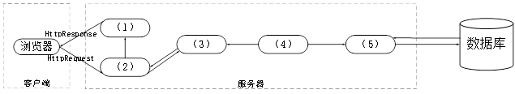

### 问题1

MVC架构中包含哪三种元素，它们的作用分别是什么？请根据图2-1所示架构将JavaEE中 JSP、Servlet、Service、JavaBean、DAO五种构件分别填入空 （1）~（5） 所示位置。

**参考答案**

MVC架构包含：视图、控制器、模型
视图（View）：视图是用户看到并与之交互的界面。视图向用户显示相关的数据，并能接收用户的输入数据，但是它并不进行任何实际的业务处理。
控制器（Controller）：控制器接受用户的输入并调用模型和视图去完成用户的需求。该部分是用户界面与Model的接口。一方面它解释来自于视图的输入，将其解释成为系统能够理解的对象，同时它也识别用户动作，并将其解释为对模型特定方法的调用；另一方面，它处理来自于模型的事件和模型逻辑执行的结果，调用适当的视图为用户提供反馈。
模型（Model）：模型是应用程序的主体部分。模型表示业务数据和业务逻辑。一个模型能为多个视图提供数据。
（1）JSP （2）Servlet （3）JavaBean （4）Service （5）DAO

**答案解析**

在MVC架构中，三种主要元素及其作用是：
视图（View）：负责显示数据并向用户展示交互界面。它接收用户的输入，但不处理业务逻辑。典型的实现是JSP。
控制器（Controller）：负责接收用户输入、处理请求并决定如何更新模型和视图。Servlet是MVC中典型的控制器。
模型（Model）：表示业务逻辑或数据，并与视图和控制器交互。它处理数据，计算或其他业务操作。典型的JavaBean和Service类属于模型部分，DAO负责数据访问，封装了对数据库的操作。
根据图2-1中的架构，JavaEE中的构件如下所示：
（1）JSP → 视图（View）：负责展示数据给用户。
（2）Servlet → 控制器（Controller）：接收用户请求并调度处理。
（3）JavaBean → 模型（Model）：包含业务逻辑或数据。
（4）Service → 模型（Model）：处理具体的业务逻辑，服务层。
（5）DAO → 模型（Model）：负责数据访问，处理与数据库的交互。

**浓缩知识点**：构件化与插件架构 MVC架构包含：视图、控制器、模型 视图（View）：视图是用户看到并与之交互的界面。视图向用户显示相关的数据，并能接收用户的输入数据，但是它并不进行任何实际的业务处理。 在MVC架构中，三种主要元素及其作用是： 视图（View）：负责显示数据并向用户展示交互界面。它接收用户的输入，但不处理业务逻辑。典型的实现是JSP。

---

### 问题2

项目组架构师王工提出在图2-1所示架构设计中加入EJB构件，采用企业级JavaEE架构开发资源共享平台。请说明EJB构件中的Bean （构件）分为哪三种类型，每种类型Bean的职责是什么。

**参考答案**

EJB中的Bean分三种类型：Session Bean、Entity Bean 和 Message-Driven Bean。Session Bean的职责是：维护一个短暂的会话。Entity Bean 的职责是：维护一行持久稳固的数据。Message-Driven Bean的职责是：异步接受消息。

**答案解析**

EJB（Enterprise JavaBeans）是一种服务器端组件模型，用于开发企业级应用程序。EJB中的Bean分为三种类型：
会话Bean（Session Bean）：职责：负责执行业务逻辑并处理客户端的请求。会话Bean有两种类型：无状态会话Bean（Stateless）和有状态会话Bean（Stateful）。有状态会话Bean会在会话期间维护客户端的状态，而无状态会话Bean不会保持客户端的状态。
实体Bean（Entity Bean）：职责：表示持久化数据对象，通常与数据库中的表格行对应。Entity Bean用于保存应用程序的业务数据，并可以通过JPA（Java Persistence API）进行数据库的交互。
消息驱动Bean（Message-Driven Bean）： 职责：用于异步处理消息。它从消息队列中接收消息并响应处理。通常与消息传递系统（如JMS）配合使用，处理异步消息。

**浓缩知识点**：构件化与插件架构 EJB中的Bean分三种类型：Session Bean、Entity Bean 和 Message-Driven Bean。Session Bean的职责是：维护一个短暂的会话。Entity Bean 的职责是：维护一行持久稳固的数据。Message-Driven Bean的职责是：异步接受消息。 EJB（Enterprise JavaBeans）是一种服务器端组件模型，用于开发企业级应用程序。EJB中的Bean分为三种类型： 会话Bean（Session Bean）：职责：负责执行业务逻辑并处理客户端的请求。会话Bean有两种类型：无状态会话Bean（Stateless）和

---

### 问题3

如果采用王工提出的企业级Java EE架构，请说明下列（a）-（e）所给出的业务功能构件中，有状态和无状态构件分别包括哪些。
（a）Identification Bean（身份认证构件）
（b）ResPublish Bean（资源发布构件）
（c）ResRetrieval Bean（资源检索构件）
（d）OnlineEdit Bean（在线编辑构件）
（e）Statistics Bean（统计分析构件）

**参考答案**

有状态：（a）、（d）
无状态：（b）、（c）、（e）

**答案解析**

根据EJB中的有状态和无状态构件的特点：
有状态构件（Stateful Session Beans）：
（a）Identification Bean（身份认证构件）：身份认证需要维护用户的会话状态，确保认证过程中的状态信息得到保留，因此需要设计为有状态构件。
（d）OnlineEdit Bean（在线编辑构件）：在线编辑构件通常需要记录用户的编辑状态、前一次操作的结果，因此它也是有状态构件。
无状态构件（Stateless Session Beans）：
（b）ResPublish Bean（资源发布构件）：资源发布操作通常独立于其他操作，且每个请求都是独立的，因而它是无状态构件。
（c）ResRetrieval Bean（资源检索构件）：资源检索是一个独立的、无须维护状态的操作，因此它是无状态构件。
（e）Statistics Bean（统计分析构件）：统计分析通常处理的是独立请求的结果，不需要保留客户端的交互状态，因此它也是无状态构件。

**浓缩知识点**：构件化与插件架构 有状态：（a）、（d） 无状态：（b）、（c）、（e） 根据EJB中的有状态和无状态构件的特点： 有状态构件（Stateful Session Beans）：

---

> **知识点分组：架构评估方法**

## 5. 2014年11月第4题（架构评估方法）

- 题号：0020140501004
- 题目标签：架构评估方法
- 难度：简单
- 频率：高频
- 浓缩知识点：架构评估方法；重点围绕题干场景、架构决策与质量属性进行分析。

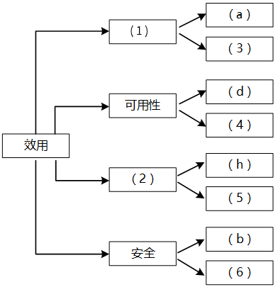

### 问题1

在架构评估过程中，质量属性效用树（utility tree）是对系统质量属性进行识别和优先级排序的重要工具。请给出合适的质量属性，填入图4-1中（1）、（2）空白处；并选择题干描述的（a）～（m），填入（3）～（6）空白处，完成该系统的效用树。

**参考答案**

（1）性能
（2）可修改性
（3）（e）
（4）（j）
（5）（l）
（6）（k）

**答案解析**

在软件架构评估过程中，质量属性效用树（Utility Tree） 是识别和组织质量需求的核心工具。它通过分层方式把系统的关键质量属性、场景和优先级逐步展开，帮助架构师和评估专家明确系统应重点关注哪些方面。结合题干中的描述，可以清楚地将部分需求映射到典型的质量属性。
首先，性能 是该系统的关键质量属性之一。题干（a）要求在正常负载下 0.5 秒内响应交易请求，（e）要求在高峰负载下 10 秒内完成支付，这些都直接涉及系统的响应时间和吞吐能力，典型地属于性能范畴，因此（1）应填“性能”，并将（e）填入（3）。
其次，可修改性 是指系统在功能扩展、界面变更时能否快速适应。题干（h）要求在 30 人月内完成中间件添加，（l）要求在 4 人月内修改界面风格，说明架构需要支持较低成本的修改，因此（2）填“可修改性”，并在（5）填（l）。
再看 可用性，它强调系统在出现故障时的持续服务能力。题干（d）要求在 2 分钟内切换备用系统，（j）要求主站点断电后 3 秒内重定向请求，显然属于典型的可用性要求，因此（4）应填（j）。
安全性 是关键属性。题干（b）明确提出支付安全性要求，而（k）则强调用户信息数据库授权必须保证极高可用性，本质上体现了对数据访问控制与保护的需求，因此（6）填（k）。

**浓缩知识点**：架构评估方法 （1）性能 （2）可修改性 在软件架构评估过程中，质量属性效用树（Utility Tree） 是识别和组织质量需求的核心工具。它通过分层方式把系统的关键质量属性、场景和优先级逐步展开，帮助架构师和评估专家明确系统应重点关注哪些方面。结合题干中的描述，可以清楚地将部分需求映射到典型的质量属性。 首先，性能 是该系统的关键质量属性之一。题干（a）要求在正常负载下 0.5 秒内响应交易请求，（e）要求在高峰负载下 10 秒内完成支付，这些都直接涉及系统的响应时间和吞吐能力，典型地属于性能范畴，因此（1）应填“性能”，并将（e）填入（3）。

---

### 问题2

在架构评估过程中，需要正确识别系统的架构风险、敏感点和权衡点，并进行合理的架构决策。请用300字以内的文字给出系统架构风险、敏感点和权衡点的定义，并从题干（a）～（m）中各选出1个对系统架构风险、敏感点和权衡点最为恰当的描述。

**参考答案**

系统架构风险是指架构设计中潜在的、存在问题的架构决策所带来的隐患。敏感点是指为了实现某种特定的质量属性，一个或多个构件所具有的特性。权衡点是指影响多个质量属性的特性，是多个质量属性的敏感点。
风险点：（i）； 敏感点：（g）； 权衡点：（f）。

**答案解析**

在架构评估中，风险、敏感点和权衡点 是三类需要重点识别的关注对象。
架构风险是指潜在的隐患，通常源于架构设计中的某些不合理假设或紧耦合结构。风险一旦发生，往往会显著增加系统的维护成本，甚至导致项目失败。题干（i）描述“支付部分与第三方平台紧耦合”，意味着当业务需要接入新支付平台时，必须修改大量现有代码，显著影响系统的可修改性与扩展性，因此这是典型的架构风险。
敏感点是实现某种质量属性的核心依赖点。如果这些点的设计不合理，就可能无法达到目标质量。题干（g）指出“处理时间要求影响数据传输协议和交易处理过程设计”，说明系统的性能指标高度依赖于架构中某些协议与组件的选择，这是性能质量属性的敏感点。
权衡点则更加复杂，是指某个架构决策同时作用于多个质量属性，需要在不同属性之间取舍。题干（f）说明“新的加密算法提高安全性但降低性能”，正是安全与性能之间的冲突，这种情况往往需要评估权重并做出折中。

**浓缩知识点**：架构评估方法 系统架构风险是指架构设计中潜在的、存在问题的架构决策所带来的隐患。敏感点是指为了实现某种特定的质量属性，一个或多个构件所具有的特性。权衡点是指影响多个质量属性的特性，是多个质量属性的敏感点。 风险点：（i）； 敏感点：（g）； 权衡点：（f）。 在架构评估中，风险、敏感点和权衡点 是三类需要重点识别的关注对象。 架构风险是指潜在的隐患，通常源于架构设计中的某些不合理假设或紧耦合结构。风险一旦发生，往往会显著增加系统的维护成本，甚至导致项目失败。题干（i）描述“支付部分与第三方平台紧耦合”，意味着当业务需要接入新支付平台时，必须修改大量现有代码，显著影响系统的可修改性与扩展性，因此

---

## 6. 2015年11月第1题（架构评估方法）

- 题号：0020150501001
- 题目标签：架构评估方法
- 难度：简单
- 频率：高频
- 浓缩知识点：架构评估方法；重点围绕题干场景、架构决策与质量属性进行分析。

### 题目说明

阅读以下关于软件架构评估的说明，在答题纸上回答问题1和问题2。
【说明】
某软件公司拟为某市级公安机关开发一套特种车辆管理与监控系统，以提高特种车辆管理的效率和准确性。在系统需求分析与架构设计阶段，用户提出的部分需求和关键质量属性场景如下：
（a）系统用户分为管理员、分管领导和普通民警等三类；
（b）正常负载情况下，系统必须在0.5秒内对用户的车辆查询请求进行响应；
（c）系统能够抵御99.999%的黑客攻击；
（d）系统的用户名必须以字母开头，长度不少于5个字符；
（e）对查询请求处理时间的要求将影响系统的数据传输协议和处理过程的设计；
（f）网络失效后，系统需要在2分钟内发现并启用备用网络系统；
（g）在系统升级时，需要保证在1个月内添加一个新的消息处理中间件；
（h）查询过程中涉及的车辆实时视频传输必须保证20帧/秒的速率，且画面具有600×480的分辨率；
（i）更改系统加密的级别将对安全性和性能产生影响；
（j）系统主站点断电后，需要在3秒内将请求重定向到备用站点；
（k）假设每秒钟用户查询请求的数量是10个，处理请求的时间为30毫秒，则"在1秒内完成用户的查询请求"这一要求是可以实现的；
（l）对用户信息数据的授权访问必须保证99.999%的安全性；
（m）目前对"车辆信息实时监控"业务逻辑的描述尚未达成共识，这可能导致部分业务功能模块的重复，影响系统的可修改性；
（n）更改系统的Web界面接口必须在1周内完成；
（o）系统需要提供远程调试接口，并支持系统的远程调试。
在对系统需求和质量属性场景进行分析的基础上，系统的架构师给出了三个候选的架构设计方案。公司目前正在组织系统开发的相关人员对系统架构进行评估。

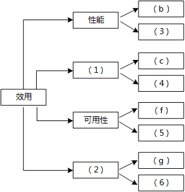

### 问题1

在架构评估过程中，质量属性效用树（utility tree）是对系统质量属性进行识别和优先级排序的重要工具。请给出合适的质量属性，填入图1-1中（1）、（2）空白处；并选择题干描述中的（a）～（o），将恰当的序号填入（3）～（6）空白处，完成该系统的效用树。

**参考答案**

（1）安全性
（2）可修改性
（3）（h）
（4）（l）
（5）（j）
（6）（n）

**答案解析**

效用树（Utility Tree）是ATAM等架构评估方法中的核心工件，用于把“效用/质量”自顶向下分解为可度量、可验证的具体场景（QA Scenario），并在此基础上排序优先级与风险。顶层一般以Utility为根，下一层是质量属性（如性能、可用性、安全性、可修改性、可测试性等），再往下是场景。
本题给定的大量条目（b）（c）（f）（h）（j）（l）（n）等，天然对应不同质量关注点：如（b）（h）更偏性能（响应时间、视频帧率/分辨率），（j）（f）更偏可用性/容错（故障后的业务连续性），（c）（l）（i）与安全性紧密相关，（g）（n）（m）与可修改性/可扩展性直接相关。题图仅给出两条分支待填，结合内容密度与场景显著性，最合理的是**“安全性”和“可修改性”两大属性作为二级分支，即（1）=安全性、（2）=可修改性。原因在于：公安行业对数据与访问安全**、持续变更/集成新中间件的诉求突出，且题干（c）（l）（i）（g）（n）（m）均围绕这两类属性给出明确承诺或风险提示。
对四个场景占位（3）～（6），需做到属性与场景语义强匹配：
（3）挂在性能/流媒体能力相关的叶子下最合适，而题干中唯一明确规格化“视频实时性”的是（h）“20fps、600×480”，直接反映吞吐、时延、码率与负载的耦合，因此选（h）。
（4）与安全性/数据保护强相关；（l）“用户信息授权访问99.999%安全性”即是访问控制、最小权限、审计与加密的量化目标，故（4）=（l）。
（5）与可用性/容错切换强相关；（j）“主站断电3秒内重定向到备用站”是RTO（恢复时间目标）的明确指标，也体现冗余、健康探测、GSLB/Anycast/心跳等设计，故（5）=（j）。
（6）与可修改性最贴近；（n）“Web界面接口变更1周内完成”属于修改成本与节拍的量化约束，覆盖UI层解耦、前后端分离、适配层等策略，故（6）=（n）。

**浓缩知识点**：架构评估方法 （1）安全性 （2）可修改性 效用树（Utility Tree）是ATAM等架构评估方法中的核心工件，用于把“效用/质量”自顶向下分解为可度量、可验证的具体场景（QA Scenario），并在此基础上排序优先级与风险。顶层一般以Utility为根，下一层是质量属性（如性能、可用性、安全性、可修改性、可测试性等），再往下是场景。 本题给定的大量条目（b）（c）（f）（h）（j）（l）（n）等，天然对应不同质量关注点：如（b）（h）更偏性能（响应时间、视频帧率/分辨率），（j）（f）更偏可用性/容错（故障后的业务连续性），（c）（l）（i）与安全性紧密相关，（g）（n）（m）与可修改

---

### 问题2

在架构评估过程中，需要正确识别系统的架构风险、敏感点和权衡点，并进行合理的架构决策。请用300字以内的文字给出系统架构风险、敏感点和权衡点的定义，并从题干描述中的（a）～（o）各选出1个属于系统架构风险、敏感点和权衡点的描述。

**参考答案**

架构风险：系统架构风险是指架构设计中潜在的、存在问题的架构决策所带来的隐患。
敏感点：是指为了实现某种特定的质量属性，一个或多个构件所具有的特性。
权衡点：是影响多个质量属性的特性，是多个质量属性的敏感点。
架构风险：（m）；敏感点：（e）；权衡点：（i）。

**答案解析**

架构风险强调后果与不确定性：当需求尚未收敛或关键决策缺乏验证时，系统可能在后期暴露出高代价问题。
本题（m）直接指出“实时监控业务逻辑尚未达成共识”，会带来需求漂移、重复建设、接口不稳等连锁反应，典型风险表现为：模块边界反复调整、代码分叉、版本兼容负担加剧、上线节奏被动——最终损害可修改性与可维护性。因此将（m）归类为架构风险最为贴切。
敏感点的关键是“某个设计取值对单一质量属性的显著影响”。（e）指出“查询时延目标会影响数据传输协议与处理流程的设计”，这正是性能属性下的核心敏感点：例如是否采用二进制RPC/HTTP/3、是否启用服务端聚合/缓存/预计算、是否引入异步化与批处理、是否在内核/网络栈上开启零拷贝/长连接复用等。任何一项的微小取值变化都会对性能产生显著影响，因此（e）是标准的性能敏感点。
权衡点强调“质量属性影响的一高一低”。（i）“更改加密级别影响安全与性能”就是经典的Security vs. Performance对立：更强算法/更长密钥/更高握手强度→更高CPU开销、更大时延；反之则可能降低抗攻击能力。

**浓缩知识点**：架构评估方法 架构风险：系统架构风险是指架构设计中潜在的、存在问题的架构决策所带来的隐患。 敏感点：是指为了实现某种特定的质量属性，一个或多个构件所具有的特性。 架构风险强调后果与不确定性：当需求尚未收敛或关键决策缺乏验证时，系统可能在后期暴露出高代价问题。 本题（m）直接指出“实时监控业务逻辑尚未达成共识”，会带来需求漂移、重复建设、接口不稳等连锁反应，典型风险表现为：模块边界反复调整、代码分叉、版本兼容负担加剧、上线节奏被动——最终损害可修改性与可维护性。因此将（m）归类为架构风险最为贴切。

---

## 7. 2017年11月第1题（架构评估方法）

- 题号：0020170501001
- 题目标签：架构评估方法
- 难度：简单
- 频率：高频
- 浓缩知识点：架构评估方法；重点围绕题干场景、架构决策与质量属性进行分析。

### 题目说明

阅读以下关于软件架构评估的叙述，在答题纸上回答问题1和问题2。
【说明】
某单位为了建设健全的公路桥梁养护管理档案，拟开发一套公路桥梁在线管理系统。在系统的需求分析与架构设计阶段，用户提出的需求、质量属性描述和架构特性如 下：
（a） 系统用户分为高级管理员、数据管理员和数据维护员等三类；
（b） 系统应该具备完善的安全防护措施，能够对黑客的攻击行为进行检测与防御；
（c） 正常负载情况下，系统必须在0.5秒内对用户的查询请求进行响应；
（d） 对查询请求处理时间的要求将影响系统的数据传输协议和处理过程的设计；
（e） 系统的用户名不能为中文，要求必须以字母开头，长度不少于5个字符；
（f） 更改系统加密的级别将对安全性和性能产生影响；
（g） 网络失效后，系统需要在10秒内发现错误并启用备用系统；
（h） 查询过程中涉及的桥梁与公路的实时状态视频传输必须保证画面具有1024×768的分辨率， 40帧 /秒的速率；
（i） 在系统升级时，必须保证在10人月内可添加一个新的消息处理中间件；
（j） 系统主站点断电后，必须在3秒内将访问请求重定向到备用站点；
（k） 如果每秒钟用户查询请求的数量是10个，处理单个请求的时间为 30 毫秒，则系统应保证在 1秒内完成用户的查询请求；
（l） 对桥梁信息数据库的所有操作都必须进行完整记录；
（m） 更改系统的Web界面接口必须在4人周内完成；
（n） 如果"养护报告生成"业务逻辑的描述尚未达成共识，可能导致部分业务功能 模块规则的矛盾，影响系统的可修改性；
（o） 系统必须提供远程调试接口，并支持系统的远程调试。
在对系统需求、质量属性描述和架构特性进行分析的基础上，系统的架构师给出了三个候选的架构设计方案，公司目前正在组织系统开发的相关人员对系统架构进行评估。

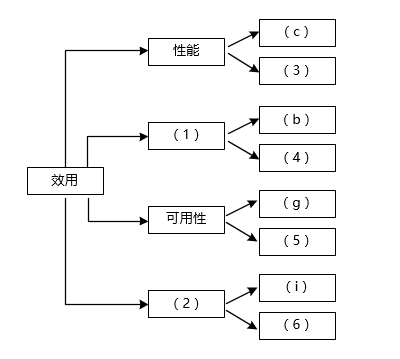

### 问题1

在架构评估过程中，质量属性效用树 （utility tree） 是对系统质量属性进行识别和优先级排序的重要工具。请给出合适的质量属性，填入图 1-1 中 （1）、（2） 空白处；并选择题干描述的 （a）~（o） ，填入（3） ~（6） 空白处，完成该系统的效用树。

**参考答案**

（1）安全性 （2）可修改性 （3）（h）或（K） （4）（l） （5）（j） （6）（m）

**答案解析**

根据题干描述，安全性、可修改性、性能和可用性是最为重要的质量属性。安全性影响数据的保密性、完整性；可修改性影响系统未来功能扩展的能力；性能决定系统响应时间；可用性确保系统在出现故障时能够继续正常运作。
安全性：由于系统需要对黑客攻击进行防御，并对数据库操作进行完整记录，安全性是系统必须要重点考虑的质量属性。
可修改性：由于系统在未来可能会进行升级和更改（例如增加消息处理中间件或更改Web界面），需要具备较好的可修改性。
（h）：查询过程中涉及的桥梁与公路的实时状态视频传输必须保证画面具有1024×768的分辨率，40帧/秒的速率。这要求系统具有足够的处理能力和性能。
（l）：对桥梁信息数据库的所有操作进行完整记录，属于系统的安全性需求，确保数据的一致性和完整性。
（j）：系统主站点断电后必须在3秒内将请求重定向到备用站点，涉及系统的可用性，需要考虑冗余和故障转移机制。
（m）：系统Web界面接口的更改必须在规定时间内完成，涉及系统的可修改性，要求架构具备一定的灵活性和扩展性。

**浓缩知识点**：架构评估方法 （1）安全性 （2）可修改性 （3）（h）或（K） （4）（l） （5）（j） （6）（m） 根据题干描述，安全性、可修改性、性能和可用性是最为重要的质量属性。安全性影响数据的保密性、完整性；可修改性影响系统未来功能扩展的能力；性能决定系统响应时间；可用性确保系统在出现故障时能够继续正常运作。 安全性：由于系统需要对黑客攻击进行防御，并对数据库操作进行完整记录，安全性是系统必须要重点考虑的质量属性。

---

### 问题2

在架构评估过程中，需要正确识别系统的架构风险、敏感点和权衡点，并进行合理的架构决策。请用 300 字以内的文字给出系统架构风险、敏感点和权衡点的定义，并从题干（a） ~（o） 中分别选出1个对系统架构风险、敏感点和权衡点最为恰当的描述。

**参考答案**

系统架构风险是指架构设计中潜在的、存在问题的架构决策所带来的隐患。
敏感点是指为了实现某种特定的质量属性，一个或多个构件所具有的特性。
权衡点是指影响多个质量属性的特性，是多个质量属性的敏感点。
风险点：（n）
敏感点：（d）
权衡点：（f）

**答案解析**

架构风险：架构风险指架构设计中的潜在问题，它们可能导致系统在实施过程中遇到不可预见的挑战，从而影响系统的稳定性、性能和可扩展性。例如，架构师未充分考虑用户需求的变化或技术演进可能导致架构的固化。 对应描述：（n）"养护报告生成"业务逻辑的描述尚未达成共识，可能导致部分业务功能模块规则的矛盾，影响系统的可修改性。这个问题说明了系统可能面临的架构风险，未达成共识的业务逻辑会导致架构的不可修改性。
敏感点：敏感点指的是为了实现某一特定质量属性，系统中某个组件或模块的关键特性。例如，性能敏感点可能涉及数据库的查询处理速度或网络的传输速率。 对应描述：（d）查询请求处理时间的要求将影响系统的数据传输协议和处理过程的设计。这说明了查询请求处理时间的敏感性，设计时需要优先考虑该特性。
权衡点：权衡点是在多个质量属性之间需要做出的平衡。通常，设计时需要在性能、安全性、可用性等多个方面找到合适的折中点。 对应描述：（f）更改系统加密的级别将对安全性和性能产生影响。设计时需要在安全性和性能之间做出平衡，过高的加密级别可能导致系统性能的下降。

**浓缩知识点**：架构评估方法 系统架构风险是指架构设计中潜在的、存在问题的架构决策所带来的隐患。 敏感点是指为了实现某种特定的质量属性，一个或多个构件所具有的特性。 架构风险：架构风险指架构设计中的潜在问题，它们可能导致系统在实施过程中遇到不可预见的挑战，从而影响系统的稳定性、性能和可扩展性。例如，架构师未充分考虑用户需求的变化或技术演进可能导致架构的固化。 对应描述：（n）"养护报告生成"业务逻辑的描述尚未达成共识，可能导致部分业务功能模块规则的矛盾，影响系统的可修改性。这个问题说明了系统可能面临的架构风险，未达成共识的业务逻辑会导致架构的不可修改性。 敏感点：敏感点指的是为了实现某一特定质量属性，系统中某

---

## 8. 2019年11月第1题（架构评估方法）

- 题号：0020190501001
- 题目标签：架构评估方法
- 难度：简单
- 频率：高频
- 浓缩知识点：架构评估方法；重点围绕题干场景、架构决策与质量属性进行分析。

### 题目说明

阅读以下关于软件架构设计与评估的叙述，在答题纸上回答问题1和问题2。
【说明】
某电子商务公司为了更好地管理用户，提升企业销售业绩，拟开发一套用户管理系统。该系统的基本功能是根据用户的消费级别、消费历史、信用情况等指标将用户划分为不同的等级，并针对不同等级的用户提供相应的折扣方案 。在需求分析与架构设计阶段，电子商务公司提出的需求、质量属性描述和架构特性如下 ：
（a）用户目前分为普通用户、银卡用户、金卡用户和白金用户四个等级，后续需要能够根据消费情况进行动态调整；
（b）系统应该具备完善的安全防护措施，能够对黑客的攻击行为进行检测与防御；
（c）在正常负载情况下，系统应在0.5秒内对用户的商品查询请求进行响应；
（d）在各种节假日或公司活动中，针对所有级别用户，系统均能够根据用户实时的消费情况动态调整折扣力度；
（e）系统主站点断电后，应在5秒内将请求重定向到备用站点；
（f）系统支持中文昵称，但用户名要求必须以字母开头，长度不少于8个字符；
（g）当系统发生网络失效后，需要在15秒内发现错误并启用备用网络；
（h）系统在展示商品的实时视频时，需要保证视频画面具有1024×768像素的分辨率，40帧/秒的速率；
（i）系统要扩容时，应保证在10人月内完成所有的部署与测试工作；
（j）系统应对用户信息数据库的所有操作都进行完整记录；
（k）更改系统的Web界面接口必须在4人周内完成；
（l）系统必须提供远程调试接口，并支持远程调试 。
在对系统需求、质量属性描述和架构特性进行分析的基础上，该系统架构师给出了两种候选的架构设计方案，公司目前正在组织相关专家对系统架构进行评估。

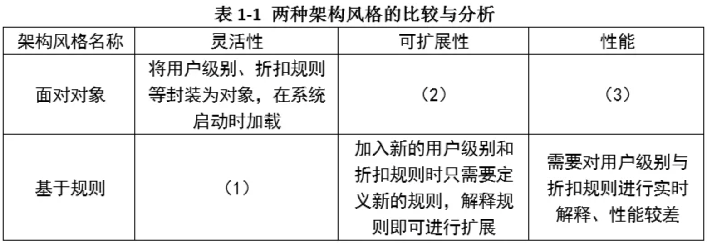

### 问题1

针对用户级别与折扣规则管理功能的架构设计问题，李工建议采用面向对象的架构风格，而王工则建议采用基于规则的架构风格。请指出该系统更适合采用哪种架构风格，并从用户级别、折扣规则定义的灵活性、可扩展性和性能三个方面对这两种架构风格进行比较与分析，填写表1-1中的（1）~（3）空白处。

**参考答案**

用户级别与折扣规则管理功能更适合采用基于规则的架构风格。
（1）将用户级别、折扣规则等描述为可动态改变的规则数据；
（2）加入新的用户级别和折扣规则时需要重新定义新的对象，并需要重启系统；
（3）用户级别和折扣规则已经在系统内编码，可直接运行，性能较好。

**答案解析**

该问题考察不同架构风格对复杂业务规则管理的适应性。面向对象（OO）架构将用户等级和折扣策略直接建模为类与对象，逻辑直观、性能较好，但存在缺陷：当新增或修改等级与规则时，往往需要扩展类层次、改动源代码，甚至重启系统重新部署，缺乏灵活性。基于规则的架构则将规则抽象为可配置的数据（如规则库、条件-动作对），通过规则引擎在运行时动态加载与匹配，能根据用户实时消费情况自动调整折扣，不需要频繁修改核心代码。结合题干中关于“等级动态调整”“节假日实时折扣调整”等场景，显然基于规则架构更契合。
从三个维度比较：灵活性上，规则架构能动态增删改规则，而 OO 架构受制于类定义；可扩展性上，规则架构可以轻松支持未来新增等级和优惠策略，而 OO 架构则需要重构；性能上，OO 架构因逻辑直接固化在代码中，运行效率高，而规则架构需额外解析规则、查找匹配，性能稍逊，但可通过规则优化、缓存策略缓解。综合来看，本系统属于“用户分级 + 折扣策略”高度动态的场景，应优先采用基于规则的架构风格，并在实现中结合 OO 管理基础实体，兼顾灵活性与性能。

**浓缩知识点**：架构评估方法 用户级别与折扣规则管理功能更适合采用基于规则的架构风格。 （1）将用户级别、折扣规则等描述为可动态改变的规则数据； 该问题考察不同架构风格对复杂业务规则管理的适应性。面向对象（OO）架构将用户等级和折扣策略直接建模为类与对象，逻辑直观、性能较好，但存在缺陷：当新增或修改等级与规则时，往往需要扩展类层次、改动源代码，甚至重启系统重新部署，缺乏灵活性。基于规则的架构则将规则抽象为可配置的数据（如规则库、条件-动作对），通过规则引擎在运行时动态加载与匹配，能根据用户实时消费情况自动调整折扣，不需要频繁修改核心代码。结合题干中关于“等级动态调整”“节假日实时折扣调整”等场景，显然基于规则

---

### 问题2

在架构评估过程中，质量属性效用树（utility tree）是对系统质量属性进行识别和优先级排序的重要工具。请将合适的质量属性名称填入图1-1中（1）、（2）空白处，并选择题干描述的（a）~（l）填入（3）~（6）空白处，完成该系统的效用树。

**参考答案**

（1）安全性
（2）可修改性
（3）（h）
（4）（j）
（5）（e）
（6）（k）

**答案解析**

题干中涉及的属性可归纳如下：
安全性包括（b）安全防护与（j）操作记录；
性能包括（c）查询响应、（h）视频分辨率与帧率；
可用性包括（e）站点切换、（g）备用网络启用；
可修改性包括（i）扩容时间、（k）界面修改时限。
根据图 1-1 的空缺，填入（1）安全性、（2）可修改性，并选择（3）(h)、（4）(j)、（5）(e)、（6）(k) 即可。

**浓缩知识点**：架构评估方法 （1）安全性 （2）可修改性 题干中涉及的属性可归纳如下： 安全性包括（b）安全防护与（j）操作记录；

---

## 9. 2020年11月第1题（架构评估方法）

- 题号：0020200501001
- 题目标签：架构评估方法
- 难度：简单
- 频率：高频
- 浓缩知识点：架构评估方法；重点围绕题干场景、架构决策与质量属性进行分析。

### 题目说明

阅读以下关于软件架构设计与评估的叙述，在答题纸上回答问题1和问题2。
[说明]
某公司拟开发一套在线软件开发系统，支持用户通过浏览器在线进行软件开发活动。该系统的重要功能包括代码编辑、语法高亮显示、代码编译、系统调试、代码仓库管理等。在需求分析与架构设计阶段，公司提出的需求和质量属性描述如下:
a)根据用户的付费情况对用户进行分类，并根据类别提供相应的开发功能;
b)在正常负载情况下，系统应该在0.2s内对用户的界面操作请求进行响应;
c)系统应该具备完善的安全防护措施，能够对黑客的攻击行为进行检测和防御;
d)系统主站点断电后，应在3s内将请求重定向到备用站点;
e)系统支持中文昵称，但用户名必须以字母开头，长度不少于8个字符; .
f)系统宕机后，需要在15s内发现错误并启用备用系统;
g)在正常负载情况下，用户的代码提交请求应在0. 5s内完成;
h)系统支持硬件设备灵活扩容，应保证在2人天内完成所有的部署与测试工作;
i)系统需要针对代码仓库的所有操作进行详细记录，便于后期查阅与审计;
j)更改系统web界面风格需要在4人天内完成;
k)系统本身需要提供远程调试接口，支持开发团队进行远程排错;
在对系统需求、质量属性和架构特性进行分析的基础上，该公司的系统架构师给出了两种候选的架构设计方案，公司目前正在组织相关专家对候选系统架构进行评估。

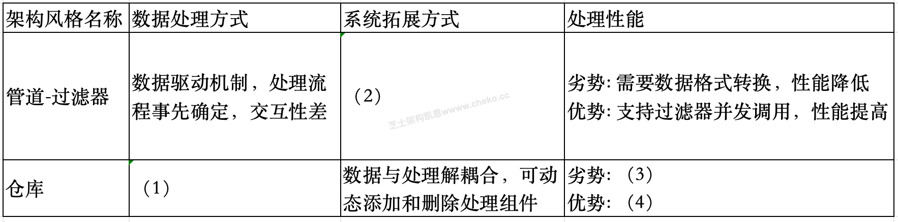

### 问题1

针对该系统的功能，李工建议采用管道过滤器(pipe and filter) 的架构风格，而王工则建议采用仓库(repository)架构风格。请指出该系统更适合采用哪种架构风格，并针对系统的主要功能，从数据处理方式、系统的可扩展性和处理性能三个方面对这两种架构风格进行比较与分析，填写表1-1中的(1)~ (4)空白处。

**参考答案**

应该采用仓库风格。
表(1) - (4)空的空白分别为:
（1）数据存储在中心仓库，处理流程独立，支持交互式处理。
（2）数据与处理紧密关联，调整处理流程需要系统重新启动。
（3）数据与处理分离，需要加载数据，性能降低。
（4）数据处理组件之间一般无依赖关系，可并发调用，提高性能。

**答案解析**

从系统的核心功能看：代码编辑/语法高亮/编译/调试/代码仓库管理，本质是围绕中心代码与元数据开展的一系列交互式活动，强调“多工具围绕同一份项目/仓库数据的协同与一致性”。
仓库架构将系统关键数据（项目、版本、提交、构建产物、调试会话元数据等）集中在统一的数据仓库中，周边功能组件（编辑器服务、编译服务、调试服务、权限与审计服务等）通过标准接口访问仓库：这使得（1）数据处理以数据为中心、流程彼此独立，天然支持交互式与回溯操作；（2）可扩展性强：新增语法检查器、静态分析、SAST/DAST、安全审计、远程调试探针等，只需对接仓库接口与事件流即可，最小化对既有流程的侵扰；（3）一致性与可追溯：所有操作统一落库，便于实现 a）差异视图、b）多版本管理、c）细粒度权限与全面审计（i），与题干的安全合规需求高度贴合。
与之对比，管道过滤器强调固定顺序的数据流：输入沿若干过滤器经管道依次处理，适合数据加工型、批处理/流式场景（例如编译器前端流水线、日志清洗等）。
但本题场景多为人机交互、随机访问、频繁回退/跳转的模式，流程不是严格线性的；当要改变步骤或插拔新工具时，常需重排管道或重启（对应表中（2）），对已有会话与中间态处理不友好。性能层面，仓库风格因组件围绕共享数据工作，若需要跨组件计算则可能出现多次加载/反序列化，数据与处理分离，需要加载数据，性能降低（对应（3））；仓库架构 无强依赖、可并发/并行，对吞吐友好（对应（4））。
综合“在线 IDE + 代码仓库管理 + 审计 + 远程调试（k）”的需求权重，仓库架构更契合系统形态，同时更容易与权限模型、审计日志、分支/标签/提交等领域概念对齐，后续叠加消息总线/事件溯源可进一步提升扩展性与可观测性。

**浓缩知识点**：架构评估方法 应该采用仓库风格。 表(1) - (4)空的空白分别为: 从系统的核心功能看：代码编辑/语法高亮/编译/调试/代码仓库管理，本质是围绕中心代码与元数据开展的一系列交互式活动，强调“多工具围绕同一份项目/仓库数据的协同与一致性”。 仓库架构将系统关键数据（项目、版本、提交、构建产物、调试会话元数据等）集中在统一的数据仓库中，周边功能组件（编辑器服务、编译服务、调试服务、权限与审计服务等）通过标准接口访问仓库：这使得（1）数据处理以数据为中心、流程彼此独立，天然支持交互式与回溯操作；（2）可扩展性强：新增语法检查器、静态分析、SAST/DAST、安全审计、远程调试探针等，只需对接仓库

---

### 问题2

在架构评估过程中，质量属性效用树(utilitytree)是对系统质量属性进行识别和优先级排序的重要工具。请将合适的质量属性名称填入图1-1中(1)、(2) 空白处，并选择题干描述的(a)~(k)填入(3)~ (6) 空白处，完成该系统的效用树。
#443px #396px

**参考答案**

(1)安全性
(2)可修改性
(3) g
(4) i
(5) f
(6) j

**答案解析**

质量属性效用树用于把抽象的质量关注点分解为可度量的场景并排序。
在线开发系统的关键非功能关注通常围绕：性能、可用性、安全性、可修改性四大类。
题干中：（b）（g）（k）等体现性能/响应性与接口能力，（d）（f）体现可用性/恢复性（RTO、切换时间），（c）（i）体现安全性/审计（攻击检测、操作留痕），（h）（j）（e）体现可修改性/可演进性/可维护性（硬件扩容与部署时限、界面风格变更、用户名规则）。
据此，在效用树的顶层，我们将（1）放置为安全性，因为该系统承载代码与仓库等高价值资产，需优先考虑攻击检测/防御与全量审计（i）；（2）为可修改性，以支撑频繁的界面与工具链演进（j、h）。
在叶子层，选择能代表典型质量场景且可度量的项：（3）填 g，它为“0.5s 提交”的性能场景，指导架构在存储、缓存、并发控制、事务边界上制定明确预算；（4）填 i，它对代码仓库的全操作审计提出要求，导出不可抵赖、可追踪的日志与合规模型；（5）填 f，规定15s 内故障检测与切换，明确健康探测、心跳、HA/故障转移与观测链路；（6）填 j，以4 人·天为上限，约束前端组件化、主题切换机制与样式隔离设计。

**浓缩知识点**：架构评估方法 (1)安全性 (2)可修改性 质量属性效用树用于把抽象的质量关注点分解为可度量的场景并排序。 在线开发系统的关键非功能关注通常围绕：性能、可用性、安全性、可修改性四大类。

---

## 10. 2021年11月第1题（架构评估方法）

- 题号：0020210501001
- 题目标签：架构评估方法
- 难度：简单
- 频率：高频
- 浓缩知识点：架构评估方法；重点围绕题干场景、架构决策与质量属性进行分析。

### 题目说明

阅读以下关于软件架构设计与评估的叙述，在答题纸上回答问题1和问题2。
【说明】
某公司拟开发一套机器学习应用开发平台，支持用户使用浏览器在线进行基于机器学习的智能应用开发活动。
该平台的核心应用场景是用户通过拖拽算法组件灵活定义机器学习流程，采用自助方式进行智能应用设计、实现与部署，并可以开发新算法组件加入平台中。在需求分析与架构设计阶段，公司提出的需求和质量属性描述如下：
（a）平台用户分为算法工程师、软件工程师和管理员等三种角色，不同角色的功能界面有所不同；
（b）平台应该具备数据库保护措施，能够预防核心数据库被非授权用户访问；
（c）平台支持分布式部署，当主站点断电后，应在20秒内将请求重定向到备用站点；
（d）平台支持初学者和高级用户两种界面操作模式，用户可以根据自己的情况灵活选择合适的模式；
（e）平台主站点宕机后，需要在15秒内发现错误并启用备用系统；
（f）在正常负载情况下，机器学习流程从提交到开始执行，时间间隔不大于5秒；
（g）平台支持硬件扩容与升级，能够在3人•天内完成所有部署与测试工作；
（h）平台需要对用户的所有操作过程进行详细记录，便于审计工作；
（i）平台部署后，针对界面风格的修改需要在3人•天内完成；
（j）在正常负载情况下，平台应在0.5秒内对用户的界面操作请求进行响应；
（k）平台应该与目前国内外主流的机器学习应用开发平台的界面风格保持一致；
（l）平台提供机器学习算法的远程调试功能，支持算法工程师进行远程调试。
在对平台需求、质量属性描述和架构特性进行分析的基础上，公司的架构师给出了三种候选的架构设计方案，公司目前正在组织相关专家对平台架构进行评估。架构进行评估。

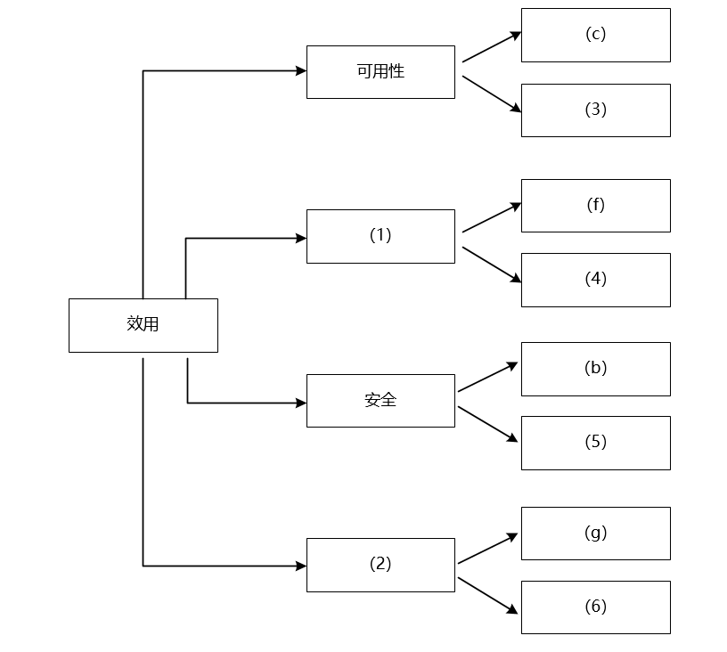

### 问题1

在架构评估过程中，质量属性效用树（utility tree）是对系统质量属性进行识别和优先级排序的重要工具。 请将合适的质量属性名称填入图1-1中(1)、(2)空白处，并从题干中的(a)-(l)中选择合适的质量属性描述，填入(3)-(6)空白处，完成该平台的效用树。

**参考答案**

（1）性能
（2）可修改性
（3）（e）可用性
（4）（j）性能
（5）（h）安全性
（6）（i）可修改

**答案解析**

质量效用树是一种在架构评估中广泛应用的工具，它的核心作用是将抽象的质量属性分解为具体的场景，并进一步细化为需求描述，以便于优先级排序和评估。
在软件体系结构中，常见的质量属性包括 性能、可用性、安全性和可修改性。
根据题干提供的需求：(e) 强调“主站点宕机后需要在 15 秒内发现错误并启用备用系统”，这是对 系统故障恢复时间 的要求，典型属于 可用性；(j) 强调“在正常负载情况下，平台应在 0.5 秒内对用户界面操作请求进行响应”，这是系统 响应时间 的要求，属于 性能；(h) 要求“对用户所有操作进行详细记录以便审计”，这是 安全性 的具体要求；(i) 要求“界面风格修改需要在 3 人·天内完成”，这是针对 系统修改代价与效率 的限定，属于 可修改性。
因此，质量效用树中 (1) 应为 性能，(2) 应为 可修改性。在下层分支中，填入对应的需求描述即可。

**浓缩知识点**：架构评估方法 （1）性能 （2）可修改性 质量效用树是一种在架构评估中广泛应用的工具，它的核心作用是将抽象的质量属性分解为具体的场景，并进一步细化为需求描述，以便于优先级排序和评估。 在软件体系结构中，常见的质量属性包括 性能、可用性、安全性和可修改性。

---

### 问题2

针对该系统的功能，赵工建议采用解释器（interpreter）架构风格，李工建议采用管道过滤器（pipe-and-filter）的架构风格，王工则建议采用隐式调用（implicit invocation）架构风格。请针对平台的核心应用场景，从机器学习流程定义的灵活性和学习算法的可扩展性两个方面对三种架构风格进行对比与分析，并指出该平台更适合采用哪种架构风格。

**参考答案**

解释器：机器学习流程定义的灵活性高，可扩展能力强，因为解释器风格可以通过自定义流程规则及配套流程解释引擎开发，做到用户层面的流程完全定义，而不需要修改代码，所以无论是修改已有的业务流程，还是要扩展不同的角色，创建新角色的流程都非常便利。
管道过滤器：机器学习流程定义的灵活性较低，可扩展能力较弱，因为管道过滤器是把数据处理职能做成过滤器，把数据传递做成管道，此时如果流程不发生变化，是可以通过这种方式实现的，但一旦流程变化，或是扩展功能，需要对过滤器进行修改调整，或是流程在程序层面重建，此时必须修改代码完成任务。
隐式调用：机器学习流程定义的灵活性一般，可扩展能力一般，隐式调用强调的是通过间接方式进行调用，如采用事件机制，要完成某个动作时先触发事件，事件与相关动作关联，以提升灵活度，本题中可把角色执行业务的流程用事件触发。这种做法比管道过滤器强，但弱于完全自定义的解释器。
经过综合比较与分析，可以看出该系统更适合使用解释器风格。

**答案解析**

平台的核心应用场景是“用户通过拖拽算法组件，灵活定义机器学习流程”，并要求能够 支持新算法组件的加入。因此，架构风格的选择必须围绕“流程灵活性”和“算法扩展性”展开。
解释器风格：解释器风格通常通过定义一套规则语言与解释引擎，将业务逻辑以规则或脚本的方式表达，并由解释器运行。这意味着用户可以通过配置或脚本定义不同的流程，而无需更改系统核心代码。对于本平台，用户拖拽形成的机器学习流程可以直接映射为流程脚本，由解释器执行。这样既保证了流程定义的高度灵活性，又支持通过增加规则扩展新的算法组件。因此，解释器风格在本场景下具备最高的适配性。
管道过滤器风格：管道过滤器模型强调将数据处理分解为若干过滤器，并通过管道依次传递数据。这种架构在 数据流固定、流程稳定 的场景中效率很高，例如编译器的词法分析-语法分析-语义分析。但在本题场景下，用户需要灵活调整流程，例如“先做特征选择还是先做数据清洗”，这就意味着管道结构必须频繁重构。而且扩展新算法组件往往需要重新实现新的过滤器，并修改现有的管道。因此，该风格在本场景下的灵活性与扩展性不足。
隐式调用风格：隐式调用通过 事件机制 实现对象间解耦。用户操作触发事件，系统中已注册的算法组件或功能模块响应事件完成工作。这种模式确实能在一定程度上支持灵活性，但它更适合于“消息驱动”的场景，而非“全局流程定义”。在机器学习流程的建模中，用户希望以“整体流程图”的形式掌控执行逻辑，而隐式调用则缺乏这样的全局可控性。因此其灵活性与扩展性虽优于管道过滤器，但不及解释器。
综上所述，结合平台需求，解释器风格能够更好地支持用户自助式流程定义和算法扩展，因此是最佳的架构选择。

**浓缩知识点**：架构评估方法 解释器：机器学习流程定义的灵活性高，可扩展能力强，因为解释器风格可以通过自定义流程规则及配套流程解释引擎开发，做到用户层面的流程完全定义，而不需要修改代码，所以无论是修改已有的业务流程，还是要扩展不同的角色，创建新角色的流程都非常便利。 管道过滤器：机器学习流程定义的灵活性较低，可扩展能力较弱，因为管道过滤器是把数据处理职能做成过滤器，把数据传递做成管道，此时如果流程不发生变化，是可以通过这种方式实现的，但一旦流程变化，或是扩展功能，需要对过滤器进行修改调整，或是流程在程序层面重建，此时必须修改代码完成任务。 平台的核心应用场景是“用户通过拖拽算法组件，灵活定义机器学习流程”，并

---

## 11. 2022年11月第1题（架构评估方法）

- 题号：0020220501001
- 题目标签：架构评估方法
- 难度：简单
- 频率：高频
- 浓缩知识点：架构评估方法；重点围绕题干场景、架构决策与质量属性进行分析。

### 题目说明

阅读以下关于软件架构设计与评估的叙述，在答题纸上回答问题1和问题2。
【说明】
某电子商务公司拟升级其会员与促销管理系统，向用户提供个性化服务，提高用户的粘性。在项目立项之初，公司领导层一致认为本次升级的主要目标是提升会员管理方式的灵活性，由于当前用户规模不大，业务也相对简单，系统性能方面不做过多考虑。新系统除了保持现有的四级固定会员制度外，还需要根据用户的消费金额、偏好、重复性等相关特征动态调整商品的折扣力度，并支持在特定的活动周期内主动筛选与活动主题高度相关的用户集合，提供个性化的打折促销活动。
在需求分析与架构设计阶段，公司提出的需求和质量属性描述如下：
（a）管理员能够在页面上灵活设置折扣力度规则和促销活动逻辑，设置后即可生效；
（b）系统应该具备完整的安全防护措施，支持对恶意攻击行为进行检测与报警；
（c）在正常负载情况下，系统应在0.3秒内对用户的界面操作请求进行响应；
（d）用户名是系统唯一标识，要求以字母开头，由数字和字母组合而成，长度不少于6个字符；
（e）在正常负载情况下，用户支付商品费用后在3秒内确认订单支付信息；
（f）系统主站点电力中断后，应在5秒内将请求重定向到备用站点；
（g）系统支持横向存储扩展，要求在2人•天内完成所有的扩展与测试工作；
（h）系统宕机后，需要在10秒内感知错误，并自动启动热备份系统；
（i）系统需要内置接口函数，支持开发团队进行功能调试与系统诊断；
（j）系统需要为所有的用户操作行为进行详细记录，便于后期查阅与审计；
（k）支持对系统的外观进行调整和配置，调整工作需要在4•人天内完成。
在对系统需求、质量属性描述和架构特性进行分析的基础上，系统架构师给出了两种候选的架构设计方案，公司目前正在组织相关专家对系统架构进行评估。

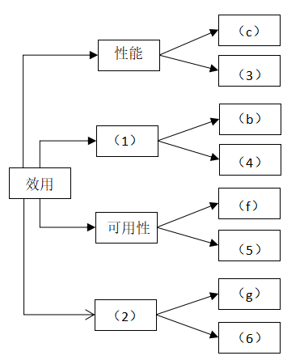

### 问题1

在架构评估过程中，质量属性效用树（utility tree）是对系统质量属性进行识别和优先级排序的重要工具。请将合适的质量属性名称填入图1-1中(1)、(2)空白处，并选择题干描述的(a)～(k)填入(3)～(6)空白处，完成该系统的效用树。

**参考答案**

（1）安全性
（2）可修改性
（3）（e）
（4）（j）
（5）（h）
（6）（k）

**答案解析**

质量属性效用树的设计关键在于根据系统需求，将用户关注的质量属性进行分解、映射，并结合优先级进行结构化展现。
（1）安全性：与系统的安全防护、审计相关。题干中（b）描述的是对恶意攻击的检测，（j）描述的是用户行为日志，两者均体现对系统运行过程中的可追踪、可检测能力，属于安全性范畴。
（2）可修改性：指系统对变更（尤其是业务逻辑变更）的适应能力。（g）描述的是系统支持扩展的能力、（k）涉及界面调整。
而对应的需求项具体分析如下：
（a）涉及规则配置，界面上操作，归属于易用性较为合适，说是一个功能性需求也可以。
（e）为性能属性的体现，用户支付后3秒内完成确认，对系统响应的时效性有明确要求。
（j）用户行为日志记录，归属安全性中的审计能力，保证系统运行的透明度与可追责。
（h）系统宕机后的自动恢复体现了可用性属性中的故障恢复能力。
（k）界面调整配置支持，明确限定了人力工时范围，体现了系统在界面层的可配置性，归属于可修改性。

**浓缩知识点**：架构评估方法 （1）安全性 （2）可修改性 质量属性效用树的设计关键在于根据系统需求，将用户关注的质量属性进行分解、映射，并结合优先级进行结构化展现。 （1）安全性：与系统的安全防护、审计相关。题干中（b）描述的是对恶意攻击的检测，（j）描述的是用户行为日志，两者均体现对系统运行过程中的可追踪、可检测能力，属于安全性范畴。

---

### 问题2

针对该系统的功能，李工建议采用面向对象的架构风格，将折扣力度计算和用户筛选分别封装为独立对象，通过对象调用实现对应的功能；王工则建议采用解释器（interpreters）架构风格，将折扣力度计算和用户筛选条件封装为独立的规则，通过解释规则实现对应的功能。请针对系统的主要功能，从折扣规则的可修改性、个性化折扣定义灵活性和系统性能三个方面对这两种架构风格进行比较与分析，并指出该系统更适合采用哪种架构风格。

**参考答案**

应该选择解释器架构风格。
折扣规则的可修改性：解释器更强。规则以外部化的DSL/规则表/表达式存储，运行时解析，无需改动业务类与编译部署，可快速上线与灰度；面向对象通常需要修改类层级或策略集合并重新发布，修改面相代码、耦合更深。
个性化折扣定义灵活性：解释器更强。可组合条件、权重、时效、冲突优先级等形成千人千面的规则集；面向对象虽可用策略/装饰/责任链等模式组合，但变体爆炸与组合复杂度上升，长期维护成本高。
系统性能：面向对象通常优于解释器。解释器涉及解析/解释执行/动态绑定带来额外开销；面向对象的静态分派与固定流程更轻量。

**答案解析**

本系统的设计目标是实现促销规则的灵活配置与快速响应业务变更，并不是以性能为首要目标。因此应优先考虑系统的灵活性与可维护性。
解释器架构风格通过将业务规则从代码逻辑中解耦，支持业务方独立制定与调整规则，匹配该系统对“灵活配置”“个性化促销”的核心需求。
尽管解释器在性能上略逊，但在用户量不大的初期阶段性能影响可控，而在后续可通过缓存、中间代码等技术手段优化性能。
综合评估，解释器架构风格更符合该系统的核心诉求。

**浓缩知识点**：架构评估方法 应该选择解释器架构风格。 折扣规则的可修改性：解释器更强。规则以外部化的DSL/规则表/表达式存储，运行时解析，无需改动业务类与编译部署，可快速上线与灰度；面向对象通常需要修改类层级或策略集合并重新发布，修改面相代码、耦合更深。 本系统的设计目标是实现促销规则的灵活配置与快速响应业务变更，并不是以性能为首要目标。因此应优先考虑系统的灵活性与可维护性。 解释器架构风格通过将业务规则从代码逻辑中解耦，支持业务方独立制定与调整规则，匹配该系统对“灵活配置”“个性化促销”的核心需求。

---

## 12. 2024年11月第1题（架构评估方法）

- 题号：0020241101001
- 题目标签：架构评估方法
- 难度：简单
- 频率：高频
- 浓缩知识点：架构评估方法；重点围绕题干场景、架构决策与质量属性进行分析。

### 题目说明

阅读以下关于软件架构设计与评估的叙述，在答题纸上回答问题1和问题2。
【说明】
某软件公司拟为一所大型写字楼开发一套访客登记系统，以提升访客管理的效率和安全性。在系统需求分析与架构设计阶段，用户提出的部分需求和关键质量属性场景如下：
（a）网络失效后，系统需要在 3 分钟内发现并启用备用网络系统；
（b）对查询请求处理时间的要求将影响系统的数据传输协议和处理过程的设计；
（c）系统能够抵御 99.999% 的黑客攻击；
（d）能够连续运行的时间不小于240小时；
（e）系统可以数据进行导入导出，要求在1分钟内完成数据导出导出；
（f）系统根据用户量访问量的增加拓展空间，要求在3天完成；
（g）系统分为三个不同的国家语言，支持搜索自动填充补全等；
公司目前正在组织系统开发的相关人员对系统架构进行评估。

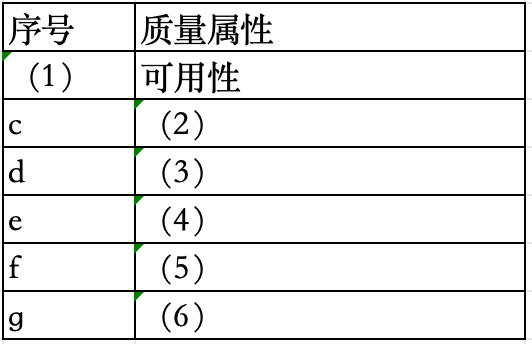

### 问题1

在架构评估过程中，质量属性效用树是对系统质量属性进行识别和优先级排序的重要工具。请选择题干描述的（a）～（m），填入（1）～（6）空白处。

**参考答案**

（1）a（2）安全性（3）可用性 （4）性能（5）可修改性（6）易用性

**答案解析**

质量属性效用树是架构评估中常用的工具，其核心是识别、分类和排序系统的关键质量属性。题干中 (a)～(g) 的场景正对应了不同的质量属性。
(a) 网络故障切换要求系统能在 3 分钟内恢复服务，体现了系统的可用性；
(b) 查询请求处理时间与协议优化直接相关，这是典型的性能问题；
(c) 系统需抵御黑客攻击，保障数据与服务安全，体现安全性；
(d) 要求系统连续运行 240 小时，属于可用性的稳定性体现；
(e) 数据导入导出在 1 分钟内完成，这是性能要求；
(f) 用户访问量增加时，3 天内完成扩展，说明系统需具备较强的可修改性（可扩展性）；
(g) 多语言与自动补全功能属于人机交互体验，体现易用性。
综上，正确匹配为（1）a（2）安全性（3）可用性（4）性能（5）可修改性（6）易用性。此题重点在于熟悉各类质量属性的定义与应用场景。

**浓缩知识点**：架构评估方法 （1）a（2）安全性（3）可用性 （4）性能（5）可修改性（6）易用性 质量属性效用树是架构评估中常用的工具，其核心是识别、分类和排序系统的关键质量属性。题干中 (a)～(g) 的场景正对应了不同的质量属性。 (a) 网络故障切换要求系统能在 3 分钟内恢复服务，体现了系统的可用性；

---

### 问题2

针对质量属性可靠性可以使用ping/echo和心跳模式实现，请分别简述ping/echo和心跳的实现原理。张工认为从资源利用率的角度来看心跳比较适合，简述理由？

**参考答案**

Ping/Echo 模式是主控端主动探测目标节点是否在线的一种机制，目标节点响应后即可判断其健康状态；而心跳机制是由被监控节点周期性向主控端发送心跳信号，主控端根据是否连续收到心跳来判断节点健康状态。
张工认为从资源利用率角度来看，心跳机制更适合大规模系统，因为它将压力从主控端分摊至各节点，避免了集中式的探测请求造成系统资源浪费，具备更好的扩展性与网络效率。

**答案解析**

Ping/Echo 模式是较为常见的节点健康检测方法。主控端通过定时发送 Ping 请求，若被监控节点正常工作，会返回 Echo 应答。该方法实现简单，适用于小规模或测试场景。但在大规模系统中，主控端需要同时管理大量探测请求，容易造成 CPU、网络带宽和内存开销过大，影响系统性能与可扩展性。
心跳机制的核心思想是“被监控节点自己证明自己存在”。节点会周期性地向主控端发送心跳包，通常为轻量级数据结构，主控端只需检查是否在指定时间窗口内收到心跳消息。如果心跳信号中断，便可认为节点出现故障。由于心跳包通常较小且由各节点独立发送，因此不会形成集中压力，能够更好地适应 分布式系统和大规模集群场景。
张工认为心跳机制更优，主要基于资源利用率和可扩展性的考虑。心跳避免了主控端高频、大量发起探测的资源开销，更加经济高效，符合大规模系统对可靠性和性能的双重要求。

**浓缩知识点**：架构评估方法 Ping/Echo 模式是主控端主动探测目标节点是否在线的一种机制，目标节点响应后即可判断其健康状态；而心跳机制是由被监控节点周期性向主控端发送心跳信号，主控端根据是否连续收到心跳来判断节点健康状态。 张工认为从资源利用率角度来看，心跳机制更适合大规模系统，因为它将压力从主控端分摊至各节点，避免了集中式的探测请求造成系统资源浪费，具备更好的扩展性与网络效率。 Ping/Echo 模式是较为常见的节点健康检测方法。主控端通过定时发送 Ping 请求，若被监控节点正常工作，会返回 Echo 应答。该方法实现简单，适用于小规模或测试场景。但在大规模系统中，主控端需要同时管理大量探测请求

---

> **知识点分组：架构质量属性场景**

## 13. 2018年11月第1题（架构质量属性场景）

- 题号：0020180501001
- 题目标签：架构质量属性场景
- 难度：简单
- 频率：高频
- 浓缩知识点：架构质量属性场景；重点围绕题干场景、架构决策与质量属性进行分析。

### 题目说明

阅读以下关于软件系统设计的叙述，在答题纸上回答问题1至问题3。
【说明】
某文化产业集团委托软件公司开发一套文化用品商城系统，业务涉及文化用品销售、定制、竞拍和点评等板块，以提升商城的信息化建设水平。该软件公司组织项目组完成了需求调研，现已进入到系统架构设计阶段。考虑到系统需求对架构设计决策的影响，项目组先列出了可能影响系统架构设计的部分需求如下：
（a）用户界面支持用户的个性化定制；
（b）系统需要支持当前主流的标准和服务，特别是通信协议和平台接口；
（c）用户操作的响应时间应不大于3秒，竞拍板块不大于1秒；
（d）系统具有故障诊断和快速恢复能力；
（e）用户密码需要加密传输；
（f） 系统需要支持不低于2GB的数据缓存；
（g）用户操作停滞时间超过一定时限需要重新登录验证；
（h）系统支持用户选择汉语、英语或法语三种语言之一进行操作。
项目组提出了两种系统架构设计方案：瘦客户端C/S架构和胖客户端C/S架构，经过对上述需求逐条分析和讨论，最终决定采用瘦客户端C/S架构进行设计。

### 问题1

在系统架构设计中，决定系统架构设计的非功能性需求主要有四类：操作性需求、性能需求、安全性需求和文化需求。请简要说明四类需求的含义。

**参考答案**

操作性需求（Operational Requirements）：指系统完成任务所需的操作环境要求及如何满足系统将来可能的需求变更的要求。
性能需求（Performance Requirements）：针对系统性能要求的指标。常见的包括：响应时间、吞吐率。
安全性需求（Security Requirements）：防止系统崩溃和保证数据安全所需要采取的保护措施或预防措施。
文化需求（Cultural Requirements）：使用本系统的不同用户群体对系统提出的特有要求。

**答案解析**

在系统架构设计中，非功能性需求的四类含义如下：
操作性需求（Operational Requirements）：这类需求关注系统能够完成任务所需的操作环境要求，并确保系统能够适应未来可能的需求变化，涉及到系统的可移植性和可维护性。例如，系统能否在不同的平台上运行，如何进行系统的后续更新与维护等。
性能需求（Performance Requirements）：性能需求描述了系统必须满足的性能指标，通常包括响应时间、吞吐率等。例如，系统的响应时间不能超过3秒，竞拍板块的响应时间不能超过1秒等。
安全性需求（Security Requirements）：这类需求主要包括防止系统崩溃和保证数据安全所采取的保护措施。例如，要求用户密码加密传输，防止数据泄露或遭受攻击。
文化需求（Cultural Requirements）：文化需求是指系统必须考虑的，针对不同用户群体的特定要求。例如，系统支持不同语言的用户界面，或者支持个性化定制，符合当地文化习惯的需求。

**浓缩知识点**：架构质量属性场景 操作性需求（Operational Requirements）：指系统完成任务所需的操作环境要求及如何满足系统将来可能的需求变更的要求。 性能需求（Performance Requirements）：针对系统性能要求的指标。常见的包括：响应时间、吞吐率。 在系统架构设计中，非功能性需求的四类含义如下： 操作性需求（Operational Requirements）：这类需求关注系统能够完成任务所需的操作环境要求，并确保系统能够适应未来可能的需求变化，涉及到系统的可移植性和可维护性。例如，系统能否在不同的平台上运行，如何进行系统的后续更新与维护等。

---

### 问题2

根据表1-1的分类，将题干所给出的系统需求（a）~（h）分别填入（1） ~ （4）。

**参考答案**

（1）（b）（d）
（2）（c）（f）
（3）（e）（g）
（4）（a）（h）

**答案解析**

根据前面对四类非功能性需求的定义，我们可以将每条需求分类：
操作性需求关注的是系统的操作环境、维护与扩展能力。例如，需求（b）涉及到系统需要支持主流的标准和服务，特别是通信协议和平台接口，属于操作性需求；需求（d）要求系统具有故障诊断与快速恢复能力，属于操作性需求，因为它关心系统如何在发生故障时恢复正常运行。
性能需求关注的是系统的处理能力、响应速度等性能指标。例如，需求（c）涉及到响应时间要求，特别是竞拍板块不超过1秒，属于性能需求；需求（f）要求系统支持不低于2GB的数据缓存，属于性能需求，因为缓存大小会直接影响系统的性能。
安全性需求涉及到防止系统故障、数据安全等措施。例如，需求（e）涉及用户密码加密传输，属于安全性需求；需求（g）涉及用户操作停滞超过一定时限需要重新登录验证，属于安全性需求，因为它有助于防止未授权访问。
文化需求关注的是系统在文化和用户习惯方面的适应性。例如，需求（a）提到用户界面支持个性化定制，属于文化需求，因为它考虑了不同用户的偏好；需求（h）提到支持汉语、英语或法语三种语言之一进行操作，属于文化需求，因为它涉及到不同地区用户的语言需求。

**浓缩知识点**：架构质量属性场景 （1）（b）（d） （2）（c）（f） 根据前面对四类非功能性需求的定义，我们可以将每条需求分类： 操作性需求关注的是系统的操作环境、维护与扩展能力。例如，需求（b）涉及到系统需要支持主流的标准和服务，特别是通信协议和平台接口，属于操作性需求；需求（d）要求系统具有故障诊断与快速恢复能力，属于操作性需求，因为它关心系统如何在发生故障时恢复正常运行。

---

### 问题3

请用100字以内文字说明瘦客户端C/S架构能够满足题干中给出的哪些系统需求。

**参考答案**

瘦客户端C/S架构能更好满足：（a）（b）（d）（h）

**答案解析**

瘦客户端C/S架构将业务逻辑集中在服务器端，客户端负责展示和部分交互，因此在多个方面具有优势：
个性化定制（a）：瘦客户端的界面定制主要依赖于服务器端进行统一管理和更新，能够快速实现个性化定制，减少客户端更新负担。
标准和服务支持（b）：瘦客户端更容易适配新的标准和服务，特别是在不断发展的通信协议和平台接口方面，服务器端可迅速进行适配和升级。
故障诊断与恢复（d）：瘦客户端的业务逻辑集中在服务器端，因此一旦出现故障，只需要修复服务器端，而不需要更新多个客户端，故障恢复更加高效。
语言选择（h）：瘦客户端可以通过服务器端的配置轻松支持多语言界面，确保不同用户群体的需求得到满足。

**浓缩知识点**：架构质量属性场景 瘦客户端C/S架构能更好满足：（a）（b）（d）（h） 瘦客户端C/S架构将业务逻辑集中在服务器端，客户端负责展示和部分交互，因此在多个方面具有优势： 个性化定制（a）：瘦客户端的界面定制主要依赖于服务器端进行统一管理和更新，能够快速实现个性化定制，减少客户端更新负担。

---

## 14. 2019年11月第5题（架构质量属性场景）

- 题号：0020190501005
- 题目标签：架构质量属性场景
- 难度：简单
- 频率：高频
- 浓缩知识点：架构质量属性场景；重点围绕题干场景、架构决策与质量属性进行分析。

### 题目说明

阅读以下关于Web系统架构设计的叙述，在答题纸上回答问题1至问题3。
【说明】
某公司拟开发一个物流车辆管理系统，该系统可支持各车辆实时位置监控、车辆历史轨迹管理、违规违章记录管理、车辆固定资产管理、随车备品及配件更换记录管理、车辆寿命管理等功能需求。其非功能性需求如下：
（1）系统应支持大于50个终端设备的并发请求；
（2）系统应能够实时识别车牌，识别时间应小于1s；
（3）系统应7×24小时工作；
（4）具有友好的用户界面；
（5）可抵御常见SQL注入攻击 ；
（6）独立事务操作响应时间应小于3s；
（7）系统在故障情况下，应在1小时内恢复；
（8）新用户学习使用系统的时间少于1小时 。
面对系统需求 ，公司召开项目组讨论会议，制订系统设计方案 ，最终决定基于分布式架构设计实现该物流车辆管理系统，应用Kafka、Redis数据缓存等技术实现对物流车辆自身数据、业务数据进行快速、高效的处理。

### 问题1

请将上述非功能性需求（1）~（8）归类到性能、安全性、可用性、易用性这四类非功能性需求。

**参考答案**

性能：（1）、（2）、（6）
安全性：（5）
可用性：（3）、（7）
易用性：（4）、（8）

**答案解析**

非功能性需求是系统在“如何运行”层面的约束，主要分类包括性能、安全性、可用性、易用性等。
性能相关的是系统吞吐、响应、实时性，所以（1）支持 50+ 并发、（2）实时识别车牌 <1s、（6）独立事务响应 <3s 都是性能指标；
安全性关注攻击防护与非法访问阻断，因此（5）“抵御 SQL 注入”属于安全性；
可用性关注系统稳定性与故障恢复能力，（3）“7×24 稳定运行”体现持续服务能力，（7）“故障后 1 小时恢复”体现恢复时间目标（RTO）；
易用性强调界面友好与学习成本，（4）界面友好、（8）新用户学习时间 <1 小时均属易用性。

**浓缩知识点**：架构质量属性场景 性能：（1）、（2）、（6） 安全性：（5） 非功能性需求是系统在“如何运行”层面的约束，主要分类包括性能、安全性、可用性、易用性等。 性能相关的是系统吞吐、响应、实时性，所以（1）支持 50+ 并发、（2）实时识别车牌 <1s、（6）独立事务响应 <3s 都是性能指标；

---

### 问题2

经项目组讨论，完成了该系统的分布式架构设计，如图5-1所示。请从下面给出的（a）~（j）中进行选择，补充完善图5-1中（1）~（7）处空白的内容。
（a）数据存储层
（b）Struct2
（c）负载均衡层
（d）表现层
（e）HTTP协议
（f）Redis数据缓存
（g）Kafka分发消息
（h）分布式通信处理层
（i）逻辑处理层
（j）CDN内容分发

**参考答案**

（1）（d）
（2）（e）
（3）（i）
（4）（h）
（5）（g）
（6）（f）
（7）（a）

**答案解析**

图 5-1 是典型的 分层分布式架构。从下至上依次为：数据存储层、缓存层、消息队列层、逻辑处理层、通信层、表现层。
首先，（7）为最底层的数据存储层（a），负责保存车辆运行历史、轨迹、违规记录、资产与寿命信息；
其上（6）使用 Redis（f）进行高速缓存，适合存放车辆实时状态与热点数据；
（5）为 Kafka 消息分发（g），在分布式通信中充当高吞吐消息队列，缓冲采集与分析的峰值流量；
（4）为 分布式通信处理层（h），负责协调消息与服务调用；
（3）为 逻辑处理层（i），处理业务逻辑，如轨迹计算、寿命预测、违规记录写入；
（2）为 HTTP 协议（e），作为表现层与逻辑层交互的标准协议；
（1）为 表现层（d），负责用户界面与交互。
架构关键点在于 Kafka 与 Redis 的分工：Kafka 适合流式、异步解耦，支撑高并发数据流传输与日志分发；而 Redis 用于高频读写缓存，降低数据库压力。
这样设计的优势是：①性能上，缓存加速查询，消息队列消峰填谷；②可用性上，通信层具备冗余与高可用集群；③扩展性上，表现层和逻辑层可横向扩展；④安全性上，可在表现层部署防火墙、SQL 注入防护与用户认证。整体架构与题干中的分布式、快速处理、实时性要求高度一致。

**浓缩知识点**：架构质量属性场景 （1）（d） （2）（e） 图 5-1 是典型的 分层分布式架构。从下至上依次为：数据存储层、缓存层、消息队列层、逻辑处理层、通信层、表现层。 首先，（7）为最底层的数据存储层（a），负责保存车辆运行历史、轨迹、违规记录、资产与寿命信息；

---

### 问题3

该物流车辆管理系统需抵御常见的SQL注入攻击，请用200字以内的文字说明什么是SQL注入攻击，并列举出两种抵御SQL注入攻击的方式。

**参考答案**

SQL注入攻击是一种利用应用程序对用户输入数据的处理不当，通过在输入中插入恶意的SQL代码来实现对数据库的攻击方式。攻击者可以通过注入恶意SQL语句来执行未经授权的数据库操作，如删除表、泄露数据等。要抵御SQL注入攻击，可以采取以下两种方式：
使用参数化查询：通过预编译SQL语句并将用户输入的数据作为参数传递，而不是直接拼接到SQL语句中，可以有效防止SQL注入攻击。
输入验证和过滤：对用户输入的数据进行严格的验证和过滤，确保输入数据符合预期格式和范围，过滤掉可能包含恶意SQL代码的字符，从而防止注入攻击。

**答案解析**

SQL 注入攻击是最常见的 Web 安全漏洞之一，攻击者在表单、URL 参数、HTTP 请求头中注入恶意 SQL 片段，绕过程序逻辑直接在数据库执行。例如，在登录输入框输入 ’ OR ’1’=’1 可绕过身份验证，或构造 DROP TABLE 删除数据表。其危害包括：①信息泄露（车辆信息、资产数据）；②数据篡改（违规记录、轨迹被恶意修改）；③破坏完整性（删除表、注入垃圾数据）。
防御 SQL 注入的根本是不信任用户输入。主要手段有两类：①参数化查询/预编译：在 JDBC/MyBatis 等框架中使用 PreparedStatement，系统自动将输入作为参数绑定，避免拼接到 SQL 字符串中，从源头阻断注入；②输入验证与过滤：采用白名单策略，验证输入是否符合业务规则，如车牌必须为特定格式，数值型字段不得含特殊字符。此外，还可辅以数据库安全审计、防火墙、最小化权限（限制应用账户仅能执行所需操作）、存储过程封装等措施，实现纵深防御。在本系统中，应结合 Redis 缓存、Kafka 消息队列做数据隔离，减少数据库直暴露面。

**浓缩知识点**：架构质量属性场景 SQL注入攻击是一种利用应用程序对用户输入数据的处理不当，通过在输入中插入恶意的SQL代码来实现对数据库的攻击方式。攻击者可以通过注入恶意SQL语句来执行未经授权的数据库操作，如删除表、泄露数据等。要抵御SQL注入攻击，可以采取以下两种方式： 使用参数化查询：通过预编译SQL语句并将用户输入的数据作为参数传递，而不是直接拼接到SQL语句中，可以有效防止SQL注入攻击。 SQL 注入攻击是最常见的 Web 安全漏洞之一，攻击者在表单、URL 参数、HTTP 请求头中注入恶意 SQL 片段，绕过程序逻辑直接在数据库执行。例如，在登录输入框输入 ’ OR ’1’=’1 可绕过身份验

---

## 15. 2020年11月第5题（架构质量属性场景）

- 题号：0020200501005
- 题目标签：架构质量属性场景
- 难度：简单
- 频率：高频
- 浓缩知识点：架构质量属性场景；重点围绕题干场景、架构决策与质量属性进行分析。

### 题目说明

阅读以下关于Web系统架构设计的叙述， 在答题纸上回答问题1至问题3。
【说明】
开发基于Web的基业设备检测系统，以实现对多种工业数据的分类采集，运行状态检测以及相关信息的管理该系统应具备以下功能：
现场设备状态采集功能，根据数据类型对设备检测指标状态信号进行分类采集，设备采集数据传输功能；9-11月可靠的传输技术，实现将设备数据从制造现场传输到系统后台设备检测显示功能；对设备的运行状态工作以及报警状态进行检测并提供相应的图形化界面设备信息管理功能；支持设备运行历史状态，报警记录参数信息的查询。
同时，该系统还需满足以下非功能性需求。
（a）系统应支持大于100个工业设备的运行检测
（b）设备数据以制造现场传输到系统后台传输时间小于1s
（c）系统应在7*24小时工作
（d）可抵御XSS攻击
（e）系统在故障情况下，应在0。5小时内恢复
（f）支持数据审计
面对系统需求，公司召开项目讨论会议，制定系统设计方案，最终决定使用三层拓补结构，即现场设备数据采集层、Web检测服务层和前端Web显示层。

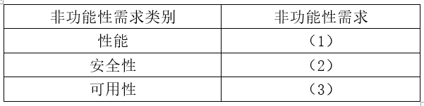

### 问题1

请按照性能、安全性和可用性三种非功能需求分类将题干的（a）～（f）填入 （1）～（3） 空白处。非功能性需求归类表：

**参考答案**

（1）a、b
（2）d、f
（3）c、e

**答案解析**

非功能需求的本质在于对系统“如何表现”的约束。
性能关注吞吐、时延与容量等指标：
(a)“支持 >100 台设备”体现容量/吞吐要求，属于性能的规模化承载能力；
(b)“传输时间 <1s”是典型的端到端时延指标，也归于性能。
安全性强调抵御攻击与可追溯：
(d)“抵御 XSS”是输入与输出链路的前端安全控制（输入校验、输出编码、CSP 等），
(f)“数据审计”要求对敏感操作与数据流进行日志留痕与合规审计，二者均属安全范畴。
可用性关注服务可达与故障恢复：
(c)“7×24 连续运行”直指持续可服务能力（MTBF/维护窗口设计），
(e)“0.5 小时内恢复”是RTO（恢复时间目标）的明确承诺，属于故障后的恢复/切换能力。

**浓缩知识点**：架构质量属性场景 （1）a、b （2）d、f 非功能需求的本质在于对系统“如何表现”的约束。 性能关注吞吐、时延与容量等指标：

---

### 问题2

该系统Web检测服务层拟采用SSM框架进行系统研发，SSM工作流程图如下图5-1所示，请从下面给出的（a） ～ （k）中进行选择，补充完善图5-1中（1） ～（7）处空白的内容：
（a） Connection pool
（b） Struts2
（c） Persistent Layer
（d） Mybatis
（e） HTTP
（f） MVC
（g） Kafka
（h） ViewLayer
（i） Jsp
（j） Conrtoller Layer
（k） Spring

**参考答案**

（1）a
（2）c
（3）d
（4）k
（5）j
（6）h
（7）i

**答案解析**

SSM 由 Spring + Spring MVC + MyBatis 组成，面向 Web 的典型调用链为：
浏览器经 HTTP（图中已给）将请求交由前端控制器（DispatcherServlet），路由至控制器层（Controller Layer）（5），控制器调用服务/业务并进一步访问持久层（Persistent Layer）（2）。
持久层借助 MyBatis（3）组织 SQL、映射结果，底层通过连接池（Connection pool）（1）复用数据库连接以降低创建/销毁开销与时延抖动。
全局由 Spring（4）负责 IOC/DI、AOP 与事务管理（声明式事务对读写分离、重试、回滚尤为关键），向上返回模型数据交由视图层（View Layer）（6）渲染，
最终通过 JSP（7）生成动态页面响应。
以上映射与 SSM 的职责边界一致：Controller 聚合与编排、Service 承载领域逻辑、DAO/MyBatis 负责数据访问、连接池提供资源高效复用。
为何不是干扰项？**Struts2（b）**属另一套 MVC 框架，非 SSM 组合；**Kafka（g）**是分布式日志/消息流平台，用于异步解耦与高吞吐日志/指标收集，不是持久层或视图层组件；**MVC（f）**是架构模式而非具体落位构件。
结合本题背景，SSM 在本系统中的优势包括：清晰的分层解耦（便于将采集层推送的数据经服务层校验后入库）、易测试/易维护（IOC 促进可替换实现、AOP 统一横切关注点如审计与鉴权）、性能与可靠性可控（连接池 + MyBatis 缓存 + 事务配置 + 拦截器限流）。在满足 Q1 的三类非功能需求时：性能可通过连接池参数、SQL 调优、缓存与异步批处理保障；安全可通过 Spring MVC 拦截器 + XSS 过滤 + 审计 AOP 实现；可用性可配合健康检查、熔断/降级与只读模式，并在部署层面（反向代理/多实例）支持滚动升级与快速恢复。

**浓缩知识点**：架构质量属性场景 （1）a （2）c SSM 由 Spring + Spring MVC + MyBatis 组成，面向 Web 的典型调用链为： 浏览器经 HTTP（图中已给）将请求交由前端控制器（DispatcherServlet），路由至控制器层（Controller Layer）（5），控制器调用服务/业务并进一步访问持久层（Persistent Layer）（2）。

---

### 问题3

该工业设备检测系统拟采用工业控制领域中统一的数据访问机制，实现与各种不同设备的数据交互，请用100以内的文字说明采用标准的数据访问机制的原因。

**参考答案**

通过采用标准的数据访问机制，可以屏蔽不同设备之间数据交互的差异，解决了系统使用数据不一致性，又在一定程度上减低了数据结构与应用系统的耦合度，减少了应用系统的维护的工作量。

**答案解析**

工业现场设备厂商、协议与数据语义高度异构（如采集频率、编码、时间戳精度、质量码、告警语义各异）。若平台为每类设备定制适配，系统将陷入“接口爆炸”与“语义碎片化”，导致测试矩阵膨胀、版本演进困难。
标准数据访问机制（可理解为统一的采集 SDK/Agent、抽象的设备驱动层、统一传输与数据模型，如统一点表/标签模型、时间序列与事件模型、质量位与告警码表）可在设备侧封装差异，在平台侧只面向统一接口与模型：
其一，互操作性提升——新设备接入只需实现对标准接口/模型的映射；
其二，可扩展性增强——设备量级增长时，接入流程复用，便于横向扩容与灰度上线；
其三，低耦合与可维护——业务服务只依赖标准语义，不感知设备细节，便于规则/报表/监控复用；
其四，质量与合规——统一数据字典、审计字段与校验规则（如来源、时间、校验和、签名）让追踪与审计可落地；
其五，性能与稳定性——标准机制可集中优化（批量传输、压缩、边缘缓冲、断点续传、幂等重放），减少端到端时延与抖动。

**浓缩知识点**：架构质量属性场景 通过采用标准的数据访问机制，可以屏蔽不同设备之间数据交互的差异，解决了系统使用数据不一致性，又在一定程度上减低了数据结构与应用系统的耦合度，减少了应用系统的维护的工作量。 工业现场设备厂商、协议与数据语义高度异构（如采集频率、编码、时间戳精度、质量码、告警语义各异）。若平台为每类设备定制适配，系统将陷入“接口爆炸”与“语义碎片化”，导致测试矩阵膨胀、版本演进困难。 标准数据访问机制（可理解为统一的采集 SDK/Agent、抽象的设备驱动层、统一传输与数据模型，如统一点表/标签模型、时间序列与事件模型、质量位与告警码表）可在设备侧封装差异，在平台侧只面向统一接口与模型：

---

## 16. 2025年5月第1题（架构质量属性场景）

- 题号：0020250501001
- 题目标签：架构质量属性场景
- 难度：简单
- 频率：高频
- 浓缩知识点：架构质量属性场景；重点围绕题干场景、架构决策与质量属性进行分析。

### 问题1

根据上述系统描述，依次写出每条需求对应的系统质量属性。
用户提交模型训练任务时，系统应在 1 分钟内分配资源并开始任务运行（1）；
数据库发生故障时，能够在 20 分钟内切换至备用数据库，保证平台继续运行（2）；
服务器发生故障时，能够自动切换至备用服务器，保障系统业务连续（3）；
系统出现故障时，平台能够继续正常运行并通知管理员，同时应提供相关的操作日志、系统日志、访问日志和调试日志等信息（4）；
用户界面需自动适配不同设备的分辨率和屏幕比例（5）；
提供常用快捷键操作，提升平台易用性（6）；
系统支持切换界面语言，方便不同语言背景用户使用（7）；
支持远程用户进行测试和操作，但需限定为注册用户（8）；
系统应支持来自不同终端设备（如浏览器、命令行工具、移动设备等）和操作系统（如 Windows、Linux、macOS）的注册用户同时远程访问与操作平台，系统需能正确解析并响应各类客户端的指令，保证功能一致性与协同操作能力（9）；
当系统功能需要调整时，应在 3 天内完成功能修改和部署上线（10）；
系统需具备良好的故障恢复能力，在发生系统级故障时，15 分钟内需完成修复（11）；
系统需具备良好的异常容错机制，部分模块出错不应影响平台整体运行（12）。

**参考答案**

（1）性能（2）可用性（3）可用性（4）可用性（5）易用性（6）易用性（7）易用性（8）可测试性（9）互操作性（10）可修改性（11）可用性（12）可用性

**答案解析**

本题要求把自然语言需求映射到系统质量属性。第1条强调“1分钟内分配资源并启动”，典型关注响应时间与吞吐，归属性能。第2、3条提出“数据库/服务器故障后切换并持续运行”，其核心是服务不中断与高可用，因此归为可用性。第4条要求“故障仍可运行并上报且提供各类日志”，体现容错、降级与运行可观测性，其度量对象是业务是否可继续，仍归可用性。第5、6、7条围绕适配不同分辨率、多语言、快捷键等交互体验改良，显然指向易用性。第8条“仅注册用户可远程测试与操作”，强调可控测试、可观测与可隔离性，面向测试组织与执行的便利，归可测试性。第9条要求“多终端多OS并发、统一解析与一致语义”，本质是跨平台、跨协议、跨形态的协议与语义兼容，归互操作性。第10条“3天内改动上线”，直指变更成本与发布效率，归可修改性。第11条“系统级故障15分钟内恢复”，度量的是恢复时间目标（RTO）与业务连续性，归可用性。第12条“模块出错不影响整体”，强调故障隔离、降级与容错，仍归可用性。
需要注意的是，实务中“可用性/可靠性/可恢复性”常被混用，但在质量属性分类里更推荐以是否保持对外可用服务来判定归类：只要指标落在不中断、可切换、可恢复、可继续等范畴，优先归入可用性；若主要关注故障率、平均无故障时间等统计性指标，再偏向可靠性。本题第2/3/4/11/12条都以“业务是否继续提供”为判据，因而可用性更贴切。此外，第8条若从“认证授权、安全性”理解也可成立，但题干将其与“测试和操作”捆绑，意在可控测试与受限访问，以可测试性为佳；第9条若从“跨端适配”理解可落在可移植性，但其强调“同时远程访问、正确解析指令、保证一致性与协同”，更符合互操作性对接口/协议/语义一致与协作的要求。该映射方案与标准答案一致，亦与常见质量属性术语库（如SEI、ISO/IEC 25010）相容。

**浓缩知识点**：架构质量属性场景 （1）性能（2）可用性（3）可用性（4）可用性（5）易用性（6）易用性（7）易用性（8）可测试性（9）互操作性（10）可修改性（11）可用性（12）可用性 本题要求把自然语言需求映射到系统质量属性。第1条强调“1分钟内分配资源并启动”，典型关注响应时间与吞吐，归属性能。第2、3条提出“数据库/服务器故障后切换并持续运行”，其核心是服务不中断与高可用，因此归为可用性。第4条要求“故障仍可运行并上报且提供各类日志”，体现容错、降级与运行可观测性，其度量对象是业务是否可继续，仍归可用性。第5、6、7条围绕适配不同分辨率、多语言、快捷键等交互体验改良，显然指向易用性。第8条“仅注册用

---

### 问题2

根据题干描述，将下图空白处补充完整，并说明该平台为什么适合用解释器风格

**参考答案**

（1）程序执行的当前状态（2）解释器引擎（3）解释器引擎的内部状态
该平台适合采用解释器风格架构，是因为其核心功能是对用户提交的 Python 模型代码进行解析和执行，而不需要用户关注底层硬件实现。
解释器风格能够将代码解析为抽象语法树，并逐条解释执行，天然适用于这种“代码即任务”的场景。它不仅支持灵活地扩展新语法和命令，还便于在执行过程中嵌入日志记录、调试信息和资源调度逻辑，增强系统的可控性与可维护性。因此，解释器风格非常契合该平台对动态性、灵活性和任务控制能力的需求。

**答案解析**

解释器风格由“程序（待解释的指令序列/AST）”“解释器引擎”“引擎内部状态”“程序执行的当前状态”等构件协作完成。程序执行的当前状态刻画运行时上下文（如指令计数器、作用域栈、变量与张量缓存、随机种子、会话与资源句柄等），解释器引擎负责将用户代码解析为中间表示并驱动逐条执行，引擎内部状态保存解释器自身的控制信息（如调度策略、优化开关、后端选择、算子注册表、插件与安全沙箱策略等）。对本平台而言，用户“提交代码即提交任务”，平台需在不暴露硬件复杂性的前提下对脚本进行静态/动态分析、依赖解析、算子/设备匹配、数据与日志通道编排，随后按策略在GPU/CPU/分布式集群上执行——这些都与解释器在运行时做决策的特性天然契合。
采用解释器风格的收益体现在四方面：（1）动态性与灵活性）解释器可在运行期装载扩展、热插新算子、新优化pass，便于快速适配不同模型与框架版本；（2）可控性与可观测性）解释执行过程中可以细粒度插桩：操作日志、系统/访问/调试日志统一采集；出错时可回溯到当前程序状态以便断点续训、自动重试与幂等提交；（3）资源与安全治理）解释器在语义层能拦截敏感操作，执行配额与隔离（限显存、限并发、沙箱/容器化），实现“注册用户远程操作但受控”；（4）可维护性与可演进性）当“3天内功能修改上线”时，多数变更可通过新增/调整内置指令或规则完成，无需改动用户脚本；多端接入（浏览器/CLI/移动端）只需统一向解释器投递标准化指令，解释器保证指令语义一致，支撑题干第9条的互操作性目标。综上，解释器风格既满足“代码即任务、自动匹配资源”的业务本质，又在可用性、可修改性、互操作性与可测试性等质量属性上提供了工程化落点，因而是该平台的契合架构选择。

**浓缩知识点**：架构质量属性场景 （1）程序执行的当前状态（2）解释器引擎（3）解释器引擎的内部状态 该平台适合采用解释器风格架构，是因为其核心功能是对用户提交的 Python 模型代码进行解析和执行，而不需要用户关注底层硬件实现。 解释器风格由“程序（待解释的指令序列/AST）”“解释器引擎”“引擎内部状态”“程序执行的当前状态”等构件协作完成。程序执行的当前状态刻画运行时上下文（如指令计数器、作用域栈、变量与张量缓存、随机种子、会话与资源句柄等），解释器引擎负责将用户代码解析为中间表示并驱动逐条执行，引擎内部状态保存解释器自身的控制信息（如调度策略、优化开关、后端选择、算子注册表、插件与安全沙箱策略等）。

---

## 17. 2025年11月第1题（架构质量属性场景）

- 题号：0020251101001
- 题目标签：架构质量属性场景
- 难度：简单
- 频率：高频
- 浓缩知识点：架构质量属性场景；重点围绕题干场景、架构决策与质量属性进行分析。

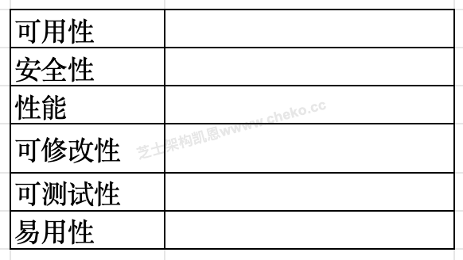

### 问题1

请将上述场景（a～n）与填入下表对应位置

**参考答案**

（1）可用性 d l n
（2）安全性 g
（3）性能 a b
（4）可修改性 c i m
（5）可测试性 e f
（6）易用性 h j k

**答案解析**

本题考察考生对常见质量属性及其典型场景特征的理解和识别能力。
首先，可用性关注系统在发生故障或特殊情况下能否继续提供服务及恢复能力。场景 d 明确描述“故障恢复时间不超过 5 分钟”；l 要求在系统升级时不影响既有充电会话；n 描述手机离线时提供安全模式和历史记录显示，这三条都体现了系统在异常情况下仍能对外提供服务，因此归为可用性。可用性和可靠性真题中基本不会同时出现，因为可用性是可靠性的子属性。这道真题又一次证明了这个结论。
性能主要体现为响应时间、吞吐量、资源利用率等。a 中的“3 秒内响应”典型属于响应时间要求；b 中的“CPU 使用率不超过 40% 且同时支持大量设备”体现了资源利用率与并发能力，因此归入性能属性。
安全性关注信息保护和访问控制，g 使用 AES-256 加密用户敏感信息，属于典型的信息安全场景。
可修改性强调系统在需求变化、功能扩展时，修改成本和风险。c 要求 10 个工作日内集成新 API，i 要求运维可在 2 小时内替换模块，m 通过配置文件新增计费策略，这三条都体现“改动快、影响面可控”，因此属于可修改性。
可测试性在于系统是否易于被构造测试场景与执行自动化测试，e 的恶劣天气仿真与 f 的远程测试调用接口都明显便于测试设计，体现可测试性。
易用性关注用户学习成本和使用体验，h 的多语言与无障碍支持、j 的新用户 60 秒上手、k 的多分辨率自适应均指向用户交互体验，因此归为易用性。

**浓缩知识点**：架构质量属性场景 （1）可用性 d l n （2）安全性 g 本题考察考生对常见质量属性及其典型场景特征的理解和识别能力。 首先，可用性关注系统在发生故障或特殊情况下能否继续提供服务及恢复能力。场景 d 明确描述“故障恢复时间不超过 5 分钟”；l 要求在系统升级时不影响既有充电会话；n 描述手机离线时提供安全模式和历史记录显示，这三条都体现了系统在异常情况下仍能对外提供服务，因此归为可用性。可用性和可靠性真题中基本不会同时出现，因为可用性是可靠性的子属性。这道真题又一次证明了这个结论。

---

### 问题2

质量属性场景一般包含哪 6 个组成部分？并指出场景c中“集成新 API”以及场景d 中“故障恢复时间不超过 5 分钟”分别对应哪两个组成部分。

**参考答案**

质量属性场景的六个组成部分为：刺激源 刺激 环境 制品 响应 响应度量
“集成新 API”属于刺激
“故障恢复时间不超过五分钟”——属于响应度量

**答案解析**

质量属性场景是 ATAM、QAW 等架构方法中非常重要的概念，一般由六个部分构成，用于将质量需求写成“可讨论、可评估、可验证”的形式。这六部分分别是：刺激源、刺激、环境、制品、响应、响应度量。
其中，刺激源描述是谁或什么引发了场景（例如：用户、管理员、外部系统、硬件故障等）；刺激则是具体发生的事件或请求（例如：提交一个新功能需求、系统某模块发生宕机、用户发起一次支付操作等）；环境说明场景发生时的系统状态，如正常运行、高负载、维护模式、网络不稳定等；制品指该场景作用到哪个系统元素上，如整个系统、某服务、某模块或数据库；响应是系统在该刺激下采取的行为，如切换到备机、重新启动服务、记录日志、返回错误提示等；响应度量则将响应变为可度量的指标，如在 5 分钟内恢复、99.99% 正常运行时间、响应小于 3 秒等。
在本题中，“可在 10 个工作日内集成新 API”这一描述，从质量属性场景角度来看，“集成新 API 的需求被提出”就是对系统的一个刺激，通常由运营或业务部门提出，因此归类为 刺激。而“故障恢复时间不超过五分钟”对应的是系统对“发生故障”这一刺激所做出的恢复动作所需时间，是一个典型的响应度量，用于衡量可用性场景是否达标。
那么我们记忆的时候，其实是可以把它分成两块。我们可以把它看成左侧是刺激，不管是刺激的对象还是刺激的方式，我们都把它归为刺激一类。右侧，我们把它当做“响应”。不管是响应的对象、响应的方式、响应的度量还是响应的环境，都把它当做响应。这样，你就把整个问题化解了。我们不是直接把它分解成很复杂的那几块，而是先把它分解到中间状态（左右两边），然后再去向下分解记忆，如下图所示。
各个场景逐项解析。
a）本场景中，刺激源是用户，刺激是用户通过 APP 或现场终端发起“开始充电”请求，环境为系统正常运行状态，制品是充电业务系统。系统的响应是处理请求并返回成功或失败结果，响应度量是响应时间不超过 3 秒。该场景主要体现系统的性能。
b）本场景中，刺激源是大量用户或充电设备，刺激是大量设备同时发起充电或资源分配请求，环境是超过 300 个设备同时运行的高并发状态，制品是充电调度系统。系统需要继续稳定处理请求，这是响应；CPU 使用率低于 40% 是响应度量。该场景主要体现系统的性能。
c）刺激源是运营方，刺激是提出集成新的支付或计费 API 的需求，环境是系统已经上线并正常运行，制品是支付、计费及接口模块。系统的响应是完成设计、开发、联调和上线，响应度量是在 10 个工作日内完成且不影响原有业务。该场景主要体现可修改性。
d）本场景中，刺激源可以是软件或服务器节点，刺激是发生软件故障或节点宕机，环境是系统正在正常对外服务，制品是发生故障的服务或节点。系统的响应是进行故障转移、重启或恢复服务，响应度量是 5 分钟内恢复正常服务。该场景主要体现可用性。
e）本场景中，刺激源是测试人员或测试平台，刺激是模拟雷电、暴雨、电压波动、网络抖动等异常情况，环境是仿真测试环境，制品是充电系统及相关通信、控制模块。系统的响应是能够接受这些异常条件并完成测试，响应度量是能够覆盖题目规定的各类仿真场景。该场景主要体现可测试性。
f）本场景中，刺激源是第三方测试平台，刺激是远程调用 RESTful 或 gRPC 测试接口，环境是自动化回归测试环境，制品是系统测试接口及相关业务模块。系统的响应是接受测试调用并返回结果，响应度量是第三方平台能够通过这些接口完成自动化测试。该场景主要体现可测试性。
g）本场景中，刺激源是用户或业务系统，刺激是产生、存储或传输用户敏感信息，环境是系统正常运行和通信过程中，制品是账号、密码、位置等敏感数据。系统的响应是对敏感数据进行加密处理，响应度量是达到 AES-256 的加密要求。该场景主要体现安全性。
h）本场景中，刺激源是不同类型的用户，刺激是用户访问和操作系统，环境包括不同语言、不同交互设备以及无障碍使用条件，制品是系统用户界面。系统的响应是提供多语言、字体放大、语音播报等功能，响应度量是达到规定的无障碍和可访问性标准。该场景主要体现易用性。
i）本场景中，刺激源是运维人员，刺激是发现故障模块并需要进行替换，环境是生产系统正常运行且不依赖开发人员，制品是计费、风控等业务模块。系统的响应是允许运维人员通过配置完成模块替换，响应度量是在 2 小时内完成且无需开发人员参与。该场景主要体现可维护性和可修改性。
j）本场景中，刺激源是首次使用系统的新用户，刺激是用户尝试完成一次充电操作，环境是用户没有系统使用经验，制品是 APP 或终端操作界面。系统的响应是通过清晰的界面和操作流程帮助用户完成操作，响应度量是 60 秒内能够独立完成一次充电。该场景主要体现易用性中的易学性。
k）本场景中，刺激源是用户及不同类型的终端设备，刺激是通过手机、平板、PC 或大屏访问系统，环境是不同分辨率和终端类型，制品是系统前端界面。系统的响应是自动调整布局和控件显示方式，响应度量是页面布局清晰、控件能够正常使用。该场景主要体现易用性和适应性。
l）本场景中，刺激源是运维人员或发布系统，刺激是对业务子系统进行滚动升级，环境是生产系统正在运行且存在正在进行的充电会话，制品是被升级的业务子系统。系统的响应是逐步升级和切换节点，响应度量是已有充电会话不中断、正在充电的用户不受影响。该场景主要体现可用性。
m）本场景中，刺激源是运营或运维人员，刺激是新增或修改分时电价、阶梯计费等策略，环境是系统已经部署运行，制品是充电策略模块。系统的响应是读取配置文件并应用新的策略，响应度量是无需重新编译和重新发布程序。该场景主要体现可修改性。
n）本场景中，刺激源是外部网络，刺激是手机网络连接中断，环境是用户正在使用 APP 的离线状态，制品是 APP、本地缓存和同步模块。系统的响应是自动进入安全模式，展示本地缓存信息，并在网络恢复后自动同步数据；响应度量是断网期间基本信息仍然可见，网络恢复后能够自动完成同步。该场景主要体现可用性和容错能力。

**浓缩知识点**：架构质量属性场景 质量属性场景的六个组成部分为：刺激源 刺激 环境 制品 响应 响应度量 “集成新 API”属于刺激 质量属性场景是 ATAM、QAW 等架构方法中非常重要的概念，一般由六个部分构成，用于将质量需求写成“可讨论、可评估、可验证”的形式。这六部分分别是：刺激源、刺激、环境、制品、响应、响应度量。 其中，刺激源描述是谁或什么引发了场景（例如：用户、管理员、外部系统、硬件故障等）；刺激则是具体发生的事件或请求（例如：提交一个新功能需求、系统某模块发生宕机、用户发起一次支付操作等）；环境说明场景发生时的系统状态，如正常运行、高负载、维护模式、网络不稳定等；制品指该场景作用到哪个系统元素

---

### 问题3

用户个人信息、位置信息可能长度较长，而 AES-256 为定长128bit（16 字节）块加密算法。对于超长数据，系统应如何处理才能正确进行加密？请从处理流程上进行说明。

**参考答案**

对于长度超过 16 字节的用户敏感数据，应采用：
对原始数据进行分块处理，按 16 字节划分多个数据块；
对最后一个不足 16 字节的数据块进行填充（Padding）（如 PKCS#7）；
结合合适的分组工作模式（如 CBC、CFB、GCM 等），逐块加密；
最终将多个密文块按顺序组合形成完整密文数据。

**答案解析**

本题重点考察对 分组对称加密算法工作机制的理解。AES-256 是一种分组加密算法，其密钥长度为 256bit，但分组长度固定为 128bit（16 字节）。这意味着：算法一次只能对 16 字节的明文块进行加密，不能直接对任意长度的长数据一次性处理。因此，对于用户账号、密码、位置信息等长度可能超过 16 字节的数据，需要采用“分块 + 填充 + 模式”的方式来完成加密。
首先，根据 AES 的分组大小，将原始明文数据按 16 字节划分成若干块，中间的完整块可以直接参与后续加密流程。对于最后一个不足 16 字节的块，必须采用标准的填充算法（如 PKCS#7），在明文末尾补足若干字节，使其恰好达到 16 字节长度。
完成分块与填充后，需要结合合适的分组工作模式，例如 CBC、CFB、OFB 或 GCM 等。在 CBC 模式中，每个明文块在加密前会与前一个密文块（或初始向量 IV）进行异或，提高安全性；GCM 模式还同时提供机密性与完整性校验，适合网络传输场景。
系统在实现时，对每个 16 字节块依次调用 AES-256 原语进行加密，得到对应的密文块，然后将所有密文块按原有顺序拼接，形成完整的密文数据。在解密时，按相同模式逐块解密，并在最后一块移除填充字节，即可恢复原始超长明文。通过这种分块、填充和组合的方式，可以让定长分组算法正确、安全地处理任意长度的用户敏感数据。

**浓缩知识点**：架构质量属性场景 对于长度超过 16 字节的用户敏感数据，应采用： 对原始数据进行分块处理，按 16 字节划分多个数据块； 本题重点考察对 分组对称加密算法工作机制的理解。AES-256 是一种分组加密算法，其密钥长度为 256bit，但分组长度固定为 128bit（16 字节）。这意味着：算法一次只能对 16 字节的明文块进行加密，不能直接对任意长度的长数据一次性处理。因此，对于用户账号、密码、位置信息等长度可能超过 16 字节的数据，需要采用“分块 + 填充 + 模式”的方式来完成加密。 首先，根据 AES 的分组大小，将原始明文数据按 16 字节划分成若干块，中间的完整块可以直接参与后续

---

> **知识点分组：可靠性与容错架构**

## 18. 2015年11月第3题（可靠性与容错架构）

- 题号：0020150501003
- 题目标签：可靠性与容错架构
- 难度：简单
- 频率：中频
- 浓缩知识点：可靠性与容错架构；重点围绕题干场景、架构决策与质量属性进行分析。

### 题目说明

阅读以下关于嵌入式系统可靠性设计方面的描述，回答问题1至问题3。
【说明】
某宇航公司长期从事宇航装备的研制工作，嵌入式系统的可靠性分析与设计已成为该公司产品研制中的核心工作，随着宇航装备的综合化技术发展，嵌入式软件规模发生了巨大变化，代码规模已从原来的几十万扩展到上百万，从而带来了由于软件失效而引起系统可靠性降低的隐患。公司领导非常重视软件可靠性工作，决定抽调王工程师等5人组建可靠性研究团队，专门研究提高本公司宇航装备的系统可靠性和软件可靠性问题，并要求在三个月内，给出本公司在系统和软件设计方面如何考虑可靠性设计的方法和规范。可靠性研究团队很快拿出了系统及硬件的可靠性提高方案，但对于软件可靠性问题始终没有研究出一种普遍认同的方法。

### 问题1

请用200字以内文字说明系统可靠性的定义及包含的4个子特性，并简要指出提高系统可靠性一般采用哪些技术？

**参考答案**

可靠性是指产品在规定的条件下和规定的时间内完成规定功能的能力。子特性：成熟性，容错性，易恢复性，可靠性的依从性。
提高可靠性的技术：（1）N版本程序设计（2） 恢复块方法（3） 防卫式程序设计（4）双机热备或集群系统（5）冗余设计

**答案解析**

系统可靠性定义：系统可靠性强调的是 在规定环境、规定时限内执行预期功能的能力。它不仅仅是“不会出错”，更重要的是即便出现异常，也要能够恢复并维持可接受的运行状态。可靠性子特性如下：
成熟性：系统具有稳定运行的能力，错误发生概率低。
容错性：在部分组件失效或运行错误时，系统能通过冗余、回滚或其他机制继续运行。
易恢复性：一旦系统出现故障，能够快速恢复正常功能，减少停机时间。
可靠性依从性：系统符合相关标准和规范，可靠性可验证和可度量。
提高系统可靠性的常用技术：
N 版本程序设计：通过多个功能等价但独立开发的程序版本，运行时采用表决机制选择正确结果，防止单点错误导致系统崩溃。
恢复块方法：在程序运行时设置“主块”和“备用块”，当主块结果经验证失败时，回退到备用块执行，确保功能实现。
防卫式编程：在代码设计时预先考虑潜在错误输入和运行环境异常，进行边界检查和异常处理。
双机热备/集群：通过多台设备冗余备份，提高系统可用性和可靠性。
冗余设计：包括硬件冗余、信息冗余、时间冗余，确保部分失效时系统仍可运行。

**浓缩知识点**：可靠性与容错架构 可靠性是指产品在规定的条件下和规定的时间内完成规定功能的能力。子特性：成熟性，容错性，易恢复性，可靠性的依从性。 提高可靠性的技术：（1）N版本程序设计（2） 恢复块方法（3） 防卫式程序设计（4）双机热备或集群系统（5）冗余设计 系统可靠性定义：系统可靠性强调的是 在规定环境、规定时限内执行预期功能的能力。它不仅仅是“不会出错”，更重要的是即便出现异常，也要能够恢复并维持可接受的运行状态。可靠性子特性如下： 成熟性：系统具有稳定运行的能力，错误发生概率低。

---

### 问题2

王工带领的可靠性研究团队之所以没能快速取得软件可靠性问题的技术突破，其核心原因是他们没有搞懂高可靠性软件应具备的特点。软件可靠性一般致力于系统性地减少和消除对软件程序性能有不利影响的系统故障。除非被修改，否则软件系统不会随着时间的推移而发生退化。请根据你对软件可靠性的理解，给出表3-1所列出的硬件可靠性特征对应的软件可靠性特征之间的差异或相似之处，将答案写在答题纸上。

**参考答案**

（1） 不考虑软件演化的情况下，失效率在统计上是非增的
（2） 如果不使用该软件，永远不会发生失效
（3） 软件维护会创建新的软件代码
（4） 软件失效之前很少会有报警

**答案解析**

硬件和软件在可靠性特征上有显著差异：
失效率随时间变化：：硬件的失效率通常呈“浴盆曲线”：初期（磨合期）高、稳定期低、老化期高。但软件不发生物理老化，在 不考虑演化时，其失效率统计上是非增的，只要代码不修改，错误模式不会随时间增加。
使用与失效关系：硬件即便闲置也会因老化（如元件氧化）导致失效；而 软件如果不被运行，则永远不会发生失效，因为其错误是逻辑性的，而非物理性的。
维护影响：硬件维护通常是替换损坏部件，不会引入新故障；但 软件维护需要修改或增加代码，这既可能修复缺陷，也可能引入新的错误。
故障报警特征：硬件往往在失效前会出现物理征兆（如温度升高、性能下降），而 软件失效之前通常没有明显报警，错误多在运行中直接暴露（如异常终止）。
因此，软件可靠性工作应从 开发过程管理、预防性设计和维护控制 出发，而非照搬硬件的可靠性分析模式。

**浓缩知识点**：可靠性与容错架构 （1） 不考虑软件演化的情况下，失效率在统计上是非增的 （2） 如果不使用该软件，永远不会发生失效 硬件和软件在可靠性特征上有显著差异： 失效率随时间变化：：硬件的失效率通常呈“浴盆曲线”：初期（磨合期）高、稳定期低、老化期高。但软件不发生物理老化，在 不考虑演化时，其失效率统计上是非增的，只要代码不修改，错误模式不会随时间增加。

---

### 问题3

王工带领的可靠性研究团队在分析了大量相关资料基础上，提出软件的质量和可靠性必须在开发过程构建到软件中，也就是说，为了提高软件的可靠性，必须在需求分析、设计阶段开展软件可靠性筹划和设计。研究团队针对本公司承担的飞行控制系统制定出了一套飞控软件的可靠性设计要求。飞行控制系统是一种双余度同构型系统，输入采用了独立的两路数据通道，在系统内完成输入数据的交叉对比、表决制导率计算，输出数据的交叉对比、表决、输出等功能，系统的监控模块实现对系统失效或失步的检测与宠位。其软件的可靠性设计包括恢复块方法和N版本程序设计方法。请根据恢复块方法工作原理完成图3-1，在（1）～（4）中填入恰当的内容。并比较恢复块方法与N版本程序设计方法，将比较结果（5）～（8）填入表3-2中。

**参考答案**

（1）主块
（2）验证测试
（3）输出正确结果
（4）异常处理
（5）表决
（6）后向恢复
（7）差
（8）好

**答案解析**

恢复块方法是一种 后向恢复机制。其基本流程是：
运行 主块（1），即默认实现的功能模块；
执行结果必须通过 验证测试（2），确保输出正确；
如果验证通过，则 输出正确结果（3）；
若验证失败，则进入 异常处理（4），调用备用实现（备用块），直到获得正确结果。
N 版本程序设计（NVP）与恢复块方法比较：
判别方式（5）：NVP 使用 表决 机制比较多个版本的输出，选择多数一致结果；恢复块方法依赖单一版本的验证测试。
恢复机制（6）：恢复块属于 后向恢复，即失败后回退并执行备用块；NVP 属于 前向恢复，直接通过表决选择正确输出。
开销（7）：恢复块实现相对简单，通常需要较少的冗余资源；NVP 需要多个独立版本并行执行，代价 高。因此恢复块方法的代价相对 差。
可靠性（8）：NVP 不依赖单一验证测试，而是依靠多版本独立实现的差异化提高正确率，因此可靠性 更好。

**浓缩知识点**：可靠性与容错架构 （1）主块 （2）验证测试 恢复块方法是一种 后向恢复机制。其基本流程是： 运行 主块（1），即默认实现的功能模块；

---

> **知识点分组：领域驱动设计**

## 19. 2025年11月第2题（领域驱动设计）

- 题号：0020251101002
- 题目标签：领域驱动设计
- 难度：中等
- 频率：中频
- 浓缩知识点：领域驱动设计；重点围绕题干场景、架构决策与质量属性进行分析。

### 问题1

（1）简要说明领域驱动设计（DDD）的基本思想。（2）给出“限界上下文”的严格定义，并说明其在复杂系统（如本点菜系统）中的作用和好处。

**参考答案**

（1）DDD 强调以业务领域为中心，通过领域专家与开发人员共同建立统一语言，根据业务边界划分领域、构建领域模型，用模型驱动设计实现。
（2）限界上下文：在特定边界内，一个领域模型及其术语、规则保持语义一致的区域，边界外可以有不同含义。好处：消除概念冲突，限制复杂度，支持团队拆分与独立演进。

**答案解析**

此题出自北京交通大学一硕士论文 《支持离线模式的易迭代餐饮系统设计与实现》。
领域驱动设计（DDD）的核心思想是：将软件设计的重心从“技术”转移到“业务领域”，通过与领域专家密切合作，形成一套贯穿需求、设计和实现的统一语言（Ubiquitous Language），围绕领域模型组织代码结构（而不是围绕数据库或技术框架）。DDD 通常会划分领域层、应用层、基础设施层等，并强调聚合、实体、值对象、领域服务等概念，用清晰的模型来承载复杂业务规则。
限界上下文（Bounded Context） 是 DDD 中最关键的划分单元，可以理解为“统一语言适用的边界”。在一个限界上下文内部，诸如“订单”“菜品”“原料”等术语有清晰且唯一的语义，模型与规则高度一致；而在另一个上下文中，同名概念可以有不同含义，例如“订单”在“交易上下文”里重支付状态，在“结算上下文”里重对账金额。
通过为复杂系统划分多个限界上下文，可以：① 控制模型规模，降低复杂度；② 避免跨团队、跨系统的概念冲突；③ 支撑团队按上下文拆分为独立服务，形成清晰的微服务边界，独立演进与部署。
本案例中，将“订单交易、菜品基础信息、门店运营、员工权限”等拆分为不同上下文，有利于分别建模和优化，避免一个庞大的“上帝模型”。

**浓缩知识点**：领域驱动设计 （1）DDD 强调以业务领域为中心，通过领域专家与开发人员共同建立统一语言，根据业务边界划分领域、构建领域模型，用模型驱动设计实现。 （2）限界上下文：在特定边界内，一个领域模型及其术语、规则保持语义一致的区域，边界外可以有不同含义。好处：消除概念冲突，限制复杂度，支持团队拆分与独立演进。 此题出自北京交通大学一硕士论文 《支持离线模式的易迭代餐饮系统设计与实现》。 领域驱动设计（DDD）的核心思想是：将软件设计的重心从“技术”转移到“业务领域”，通过与领域专家密切合作，形成一套贯穿需求、设计和实现的统一语言（Ubiquitous Language），围绕领域模型组织代码结构（而

---

### 问题2

请将下列要素归入合适的架构层：a. 基础能力层、b. 日志采集、c. 桌台、d. 包裹、e.Ktor、f.Realm、g.Ajax、h.Spring Security、i. 网络层、j.SQLite、k. 业务层、l. 服务层、m. 原料、n. 表示层、o. 设备层、p. 统一代理能力、q. 持久层、r. 领域上下文

**参考答案**

（1）n　（2）e　（3）g　（4）l　（5）p　（6）k　（7）a　（8）b　（9）c　（10）q　（11）f

**答案解析**

（1）表示层、（2）Ktor、（3）Ajax。 最上方明显是用户直接接触的客户端，包括“移动端”和“网页端”，因此整个（1）属于 表示层。移动端中已经给出了 iOS、Android，（2）需要补充移动端相关技术，Ktor可以作为客户端网络通信组件，用于向服务端发起HTTP请求，因此（2）选择 Ktor。网页端已经给出HTML5、CSS3、JavaScript、Vue，（3）需要补充典型Web异步通信技术，因此选择 Ajax。大家可以简单理解为：这一层解决的就是“用户怎么看、怎么操作、前端怎么和后端通信”。
（4）服务层、（5）统一代理能力。 表示层下面不能直接把所有请求扔给具体的员工管理、订单管理等业务模块，中间通常还需要一个统一的服务入口，因此（4）属于 服务层。服务层内部的（5）是一条横跨整个系统的公共访问能力，可以统一接收移动端和网页端请求，再向后面的具体业务模块进行调用，因此填写 统一代理能力。做这种题时可以观察一个特点：大框一般填“某某层”，大框里面的小框一般填“某种具体能力或者组件”。
（6）业务层。 这一层最好判断，因为里面已经出现了“员工管理、菜单管理、桌台管理、原料管理、订单管理、支付管理”等内容，这些都属于系统真正要完成的业务功能，因此（6）就是 业务层。所谓业务层，就是“系统到底要干什么”的地方，例如点菜、支付、订单、员工管理，这些都属于具体业务，而不是底层技术。
（7）基础能力层、（8）日志采集。 这一层已有“跨平台支持、交易数据同步、配置数据同步”等功能。这些功能并不只属于订单或者菜单某一个业务模块，而是很多业务都可以共同使用的通用能力，因此（7）应该是 基础能力层。剩下的（8）也应该是类似的横向公共能力，所以选择 日志采集。
（9）桌台。 右侧是“数据实体”，已经列出了餐饮集团、用户、员工、订单、支付、菜单等业务数据对象。（9）同样应该填写一个具体的数据实体。结合左边业务层已经存在“桌台管理”，这里填写 桌台最自然。也就是说，业务层里面有“桌台管理”这个功能，数据实体里面则存在“桌台”这个业务对象。像“领域上下文”“网络层”“设备层”显然不是一个具体的数据实体，所以可以排除。
（10）持久层、（11）Realm。 最下方直接出现了MySQL、Redis和一个数据库图标，所以这一层负责数据保存和访问，（10）显然属于 持久层。对于（11），我更建议写 Realm。原因是这个案例同时强调iOS、Android移动端和离线能力，Realm本身就是适用于移动端的本地数据库，可以在断网时保存本地订单和配置数据，网络恢复以后再进行同步。

**浓缩知识点**：领域驱动设计 （1）n （2）e （3）g （4）l （5）p （6）k （7）a （8）b （9）c （10）q （11）f （1）表示层、（2）Ktor、（3）Ajax。 最上方明显是用户直接接触的客户端，包括“移动端”和“网页端”，因此整个（1）属于 表示层。移动端中已经给出了 iOS、Android，（2）需要补充移动端相关技术，Ktor可以作为客户端网络通信组件，用于向服务端发起HTTP请求，因此（2）选择 Ktor。网页端已经给出HTML5、CSS3、JavaScript、Vue，（3）需要补充典型Web异步通信技术，因此选择 Ajax。大家可以简单理解为：这一层解决的就是“用户怎

---

### 问题3

在网络质量较差甚至间歇性断网的情况下，点单业务可能遇到哪些典型问题（至少列出 3 种），请结合本案例给出对应的解决思路。

**参考答案**

下单时网络中断导致订单未能上传云端，出现云端与门店数据不一致。
重试机制处理不当，可能出现订单重复提交。
不同终端对同一桌台或订单并发操作，弱网情况下产生冲突或覆盖。
菜品配置在终端缓存过期或未及时同步，导致价格/可售状态不一致。
对应措施示例：
在终端/边端使用本地事务 + 本地缓存保存订单，网络恢复后再异步同步到云端，采用最终一致性策略。
所有订单采用全局唯一 ID + 幂等接口，云端对重复提交进行去重。
建立对账机制（日结、账单对比）。

**答案解析**

弱网环境下，最关键的挑战是如何在“网络经常出问题”的现实前提下，仍然保证业务“可用”，并在事后通过一定手段达成数据最终一致性。首先，点单操作不能依赖即时访问云端，因此在终端或边端需要使用本地事务将订单可靠写入本地数据库，即使云端不可达，也要保证“门店账本”是完整的。这些本地订单随后通过后台任务、消息队列等方式逐步同步到云端，一旦网络条件恢复，即可完成补传。
与此同时，需要设计全局唯一订单号（例如终端号 + 时间戳 + 序列）并在云端实现幂等消费，避免重试导致重复订单。其次，可设置日终对账流程：云端与各门店对比订单汇总金额与笔数，若不一致则回溯增量日志。

**浓缩知识点**：领域驱动设计 下单时网络中断导致订单未能上传云端，出现云端与门店数据不一致。 重试机制处理不当，可能出现订单重复提交。 弱网环境下，最关键的挑战是如何在“网络经常出问题”的现实前提下，仍然保证业务“可用”，并在事后通过一定手段达成数据最终一致性。首先，点单操作不能依赖即时访问云端，因此在终端或边端需要使用本地事务将订单可靠写入本地数据库，即使云端不可达，也要保证“门店账本”是完整的。这些本地订单随后通过后台任务、消息队列等方式逐步同步到云端，一旦网络条件恢复，即可完成补传。 与此同时，需要设计全局唯一订单号（例如终端号 + 时间戳 + 序列）并在云端实现幂等消费，避免重试导致重复订单。其次，可

---

> **知识点分组：软件架构风格与模式**

## 20. 2026年5月第1题（软件架构风格与模式）

- 题号：0020260501001
- 题目标签：软件架构风格与模式
- 难度：中等
- 频率：中频
- 浓缩知识点：软件架构风格与模式；重点围绕题干场景、架构决策与质量属性进行分析。

### 题目说明

阅读以下关于数据处理与入侵检测系统架构的叙述，在答题纸上回答问题1-3。
【说明】
某大型园区计划建设一套安全态势感知与入侵检测系统，对园区出口流量、服务器日志、终端安全事件、应用访问日志和设备运行状态进行统一采集、处理、分析和告警。系统需要持续接收多源异构数据，完成格式转换、噪声过滤、特征提取、规则匹配、异常检测和告警通知等处理，并将高风险事件推送给安全运营人员。
在需求分析阶段，用户提出了如下质量属性场景：
（a）当网络采集节点发生故障时，系统应在30秒内切换到备用采集节点，并继续接收关键安全事件；
（b）在日常高峰期，系统应支持每秒5万条日志的接入与处理，普通告警的端到端延迟不超过3秒；
（c）系统需要对安全管理员进行身份认证和权限控制，并记录所有规则配置和处置操作；
（d）当新增一种日志来源或攻击检测规则时，开发人员应在2人天内完成接入、测试和上线；
（e）当告警通知服务暂时不可用时，系统应将告警事件暂存，服务恢复后自动补发，避免告警丢失；
（f）系统应能够识别异常登录、暴力破解、端口扫描等攻击行为，并生成处置建议。
架构师提出两种候选架构风格。方案一采用批处理风格，定期汇总日志文件后集中分析，适合离线统计和报表生成；方案二采用管道-过滤器风格，将采集、清洗、转换、特征提取、检测和告警拆分为多个过滤器，并通过数据流管道连接，支持各处理环节独立扩展和替换。项目组需要结合入侵检测系统实时性、可扩展性和可维护性的要求完成架构分析。
视频解析
收起视频
非会员试看权益剩余 5 / 5 次

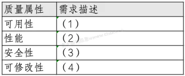
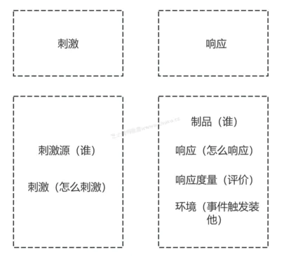

### 问题1

根据题干中的质量属性描述，将场景归入可用性、安全性、性能、可修改性等质量属性，并说明a 所对应的质量属性场景的基本描述要素。

**参考答案**

可用性：场景（a）和（e）。其中（a）强调采集节点故障后30秒内切换备用节点并继续接收事件，（e）强调告警通知服务不可用时暂存并恢复后补发，都体现故障情况下继续提供服务或恢复服务的能力。
性能：场景（b）。每秒5万条日志、端到端延迟不超过3秒，属于吞吐量和响应时间要求。
安全性：场景（c）和（f）。身份认证、权限控制、审计记录，以及异常登录、暴力破解、端口扫描识别都属于安全防护和攻击检测。
可修改性：场景（d）。新增日志来源或攻击检测规则要求2人天内完成接入、测试和上线，关注的是修改成本、影响范围和上线效率。
质量属性场景通常由六个要素描述：刺激源、刺激、环境、制品、响应、响应度量。
以（a）为例，刺激源是采集节点或故障事件，刺激是采集节点故障，环境是系统运行期间，制品是数据采集链路，响应是切换备用节点并继续接收关键事件，响应度量是30秒内完成切换。

**答案解析**

本问考查质量属性场景的识别和表达。解题时不能只凭质量属性名称判断，而要看题干中的刺激、响应和响应度量。场景（a）中“采集节点故障”“30秒内切换备用节点”“继续接收关键安全事件”说明系统在故障发生后仍能恢复并维持服务，属于可用性。场景（e）中告警通知服务暂时不可用时先暂存、恢复后补发，本质也是通过缓冲和补偿避免服务中断或告警丢失，因此也应归入可用性。这两处有时会被写成可靠性，考试中如果备选质量属性给的是可用性、安全性、性能、可修改性，通常按“故障恢复、不中断、恢复时间”归到可用性。
场景（b）给出了每秒5万条日志和端到端延迟不超过3秒，前者是吞吐量，后者是响应时间，都是性能属性的典型度量。场景（c）包含身份认证、权限控制和操作审计，场景（f）包含异常登录、暴力破解、端口扫描识别和处置建议，均围绕防护、检测、授权和追踪展开，属于安全性。场景（d）要求新增日志来源或攻击检测规则在2人天内完成接入、测试和上线，强调修改成本、影响范围和交付效率，属于可修改性。
质量属性场景的六要素要完整记忆：刺激源、刺激、环境、制品、响应、响应度量。以（a）为例，刺激源可以是故障节点或运行环境中的故障事件，刺激是采集节点失效，环境是系统正常运行或高峰运行期间，制品是数据采集链路，响应是切换备用采集节点并继续接收关键事件，响应度量是30秒内完成。答题时如果能把分类和六要素结合起来，说明你不是机械背定义，而是能把质量属性场景落到具体架构需求上。
书本上有书本上的记法，我个人比较喜欢按照上图这种方法来记：首先把它分成左右两边：左侧是刺激，右侧是响应。
刺激：分为谁来刺激，以及怎么刺激。
响应：分为谁来响应、怎么响应，以及怎么去评价响应。
环境：整个事件触发的一个环境。
那么在这个基础上，你再把用户的场景描述套到我们的六要素里面，就比较容易了。
那么另外几个场景描述6 要素的识别，大家可以自行去比对，试用上面的方法，看看和这里的答案对不对。
性能场景：刺激源是业务系统、安全设备、日志采集节点等日志来源，刺激是持续向系统发送大量日志并触发普通告警处理，环境是日常高峰期，制品是日志接入模块、日志处理模块和告警处理链路，响应是系统接收、解析、处理日志并生成普通告警，响应度量是系统每秒支持 5 万条日志的接入与处理，普通告警端到端延迟不超过 3 秒。
安全性场景：刺激源是安全管理员，刺激是登录系统并进行规则配置、告警处置等操作，环境是系统正常运行期间，制品是身份认证模块、权限控制模块和审计日志模块，响应是系统验证管理员身份、检查操作权限并记录规则配置和处置操作，响应度量是未授权用户不能越权操作，所有规则配置和处置操作都被完整记录、可追溯。
可修改性 / 可扩展性场景：刺激源是开发人员或提出新增需求的安全运营人员，刺激是新增一种日志来源或新增一种攻击检测规则，环境是系统需要扩展日志接入能力或攻击检测能力时，制品是日志接入模块、规则引擎、检测规则配置模块和测试发布机制，响应是系统支持开发人员完成新日志来源或新检测规则的接入、配置、测试和上线，响应度量是开发人员应在 2 人天内完成接入、测试和上线。
可靠性 / 可用性场景：刺激源是告警通知服务或外部通知通道，刺激是告警通知服务暂时不可用导致告警无法立即发送，环境是系统运行过程中通知服务发生临时故障，制品是告警通知模块、消息队列和告警事件暂存模块，响应是系统将告警事件暂存，等通知服务恢复后自动补发，响应度量是告警事件不丢失，服务恢复后能够自动补发。
功能性场景：刺激源是攻击者、异常登录行为或异常网络访问行为，刺激是出现异常登录、暴力破解、端口扫描等攻击行为，环境是系统正常进行安全监测期间，制品是攻击检测模块、规则引擎、告警分析模块和处置建议模块，响应是系统识别攻击行为、生成安全告警并给出处置建议，响应度量是能够识别异常登录、暴力破解、端口扫描等指定攻击行为，并生成对应处置建议。

**浓缩知识点**：软件架构风格与模式 可用性：场景（a）和（e）。其中（a）强调采集节点故障后30秒内切换备用节点并继续接收事件，（e）强调告警通知服务不可用时暂存并恢复后补发，都体现故障情况下继续提供服务或恢复服务的能力。 性能：场景（b）。每秒5万条日志、端到端延迟不超过3秒，属于吞吐量和响应时间要求。 本问考查质量属性场景的识别和表达。解题时不能只凭质量属性名称判断，而要看题干中的刺激、响应和响应度量。场景（a）中“采集节点故障”“30秒内切换备用节点”“继续接收关键安全事件”说明系统在故障发生后仍能恢复并维持服务，属于可用性。场景（e）中告警通知服务暂时不可用时先暂存、恢复后补发，本质也是通过缓冲和补偿

---

### 问题2

在批处理架构与管道-过滤器架构之间，为入侵检测和告警处理选择更合适的架构风格并说明理由。

**参考答案**

更适合选择管道-过滤器架构风格。
理由如下：第一，入侵检测系统面对的是连续到达的日志、流量和终端事件，处理链路天然可以拆分为采集、格式转换、清洗、特征提取、规则匹配、异常检测、告警生成等步骤，符合管道-过滤器的流水线处理特征。第二，各过滤器职责单一，便于独立替换和扩展，例如新增一种攻击规则时只需要扩展规则匹配或检测过滤器，不必改动整个系统。第三，各过滤器之间通过数据流连接，便于并行处理、缓冲削峰和分布式部署，有利于满足实时告警和高吞吐要求。第四，管道-过滤器风格便于复用已有过滤器，例如清洗、归一化、告警通知等组件可在不同数据源之间复用。
批处理架构更适合离线统计、日报月报、历史安全分析等周期性任务，但它需要等待数据批次形成后再统一处理，实时性较弱，不适合作为关键告警链路的主架构。

**答案解析**

本问考查架构风格选择。入侵检测和安全态势感知系统面对的是持续到达的日志、流量、终端事件和设备状态，业务目标是边接入、边清洗、边分析、边告警，因此更适合管道-过滤器风格。该风格把系统拆成一串过滤器，每个过滤器完成相对独立的数据转换或分析任务，过滤器之间通过管道传递数据。对应到本题，可以形成采集、协议解析、格式归一化、噪声过滤、特征提取、规则匹配、异常检测、事件关联、风险评分、告警生成和告警通知等流水线。这种拆分与入侵检测的处理路径高度一致，也便于对某个过滤器进行扩容、替换或灰度上线。
与批处理相比，管道-过滤器的优势主要有三点。第一，实时性更好，数据不必等到日志文件批量汇总后再处理，可以在管道中逐步流转，满足普通告警3秒内送达的要求。第二，可修改性更好，新增一种日志格式时主要影响解析或归一化过滤器，新增攻击规则时主要影响规则匹配或异常检测过滤器，不需要重写整条链路。第三，可扩展性更好，高吞吐场景下可以对热点过滤器做并行实例、消息缓冲和背压控制。
批处理风格并非没有价值，它适合离线报表、历史攻击趋势分析、样本回放和模型训练数据准备，但它天然要等待批次形成，难以承担实时告警主链路。所以本题最合理的答法是：实时入侵检测主链路采用管道-过滤器，离线统计或报表子系统可保留批处理。这样既给出选择，也体现了架构权衡。
进一步展开时，可以把管道-过滤器和题干质量属性对应起来。实时性来自数据在管道中的连续流动，高吞吐来自过滤器可并行和可水平扩展，可修改性来自过滤器职责单一、替换边界清楚，安全运营可追溯性来自每个过滤器输出中间事件和处理日志。同时也要看到这种风格的代价：如果多个过滤器都需要共享上下文，状态管理会复杂；如果某个下游过滤器处理慢，管道可能积压，需要背压、限流和降级；如果告警生成后再回溯原始日志，需要链路追踪和事件 ID 串联。把优点和代价都写出来，能体现架构权衡，而不是简单背“管道-过滤器适合数据流处理”。

**浓缩知识点**：软件架构风格与模式 更适合选择管道-过滤器架构风格。 理由如下：第一，入侵检测系统面对的是连续到达的日志、流量和终端事件，处理链路天然可以拆分为采集、格式转换、清洗、特征提取、规则匹配、异常检测、告警生成等步骤，符合管道-过滤器的流水线处理特征。第二，各过滤器职责单一，便于独立替换和扩展，例如新增一种攻击规则时只需要扩展规则匹配或检测过滤器，不必改动整个系统。第三，各过滤器之间通过数据流连接，便于并行处理、缓冲削峰和分布式部署，有利于满足实时告警和高吞吐要求。第四，管道-过滤器风格便于复用已有过滤器，例如清洗、归一化、告警通知等组件可在不同数据源之间复用。 本问考查架构风格选择。入侵检测和安全

---

### 问题3

基于所选架构风格，补充系统中的主要构件。

**参考答案**

可按数据流向补充如下构件：数据采集过滤器、协议解析/格式转换过滤器、数据清洗过滤器、特征提取过滤器、规则匹配过滤器、异常检测过滤器、事件关联过滤器、风险评分过滤器、告警生成过滤器、告警通知过滤器和可视化展示过滤器。各过滤器之间通过消息队列、流式管道或内存缓冲通道连接。
若需要体现运行支撑，还可以补充规则库、特征库、攻击样本库、告警事件库、审计日志库、配置中心、监控告警模块等辅助构件。一个合理的数据处理链路可以写成：采集原始日志和流量数据 → 解析与归一化 → 去重和噪声过滤 → 提取 IP、端口、用户、行为序列等特征 → 匹配规则或模型检测 →事件关联与风险评分 → 生成告警 → 推送给安全运营平台。

**答案解析**

本问考查把架构风格落成构件的能力。管道-过滤器不是简单把模块名排一排，而是要求每个过滤器有清晰输入、处理职责和输出，并且过滤器之间通过连接件传递数据。在本题中，最基本的数据流可以写成：数据采集过滤器接入网络流量、服务器日志、终端事件和应用访问日志；协议解析和格式转换过滤器把不同来源的数据转换为统一事件格式；数据清洗过滤器负责去重、补全字段、过滤噪声和异常格式；特征提取过滤器提取 IP、端口、用户、时间窗口、访问频率、行为序列等特征；规则匹配过滤器按照攻击规则、黑白名单和阈值规则进行匹配；异常检测过滤器结合统计模型或机器学习模型发现未知异常；事件关联过滤器把多个低级事件关联为高风险安全事件；风险评分过滤器给出等级；告警生成和告警通知过滤器负责写入告警库并推送给安全运营人员。
除主链路过滤器外，还应补充支撑构件。规则库保存攻击规则和检测策略，特征库保存可复用特征定义，攻击样本库用于模型训练和回放验证，告警事件库存储告警结果，审计日志库记录管理员配置和处置行为，配置中心用于规则和过滤器参数下发，监控模块用于观察吞吐量、延迟、积压和失败率。过滤器之间的连接件可以是消息队列、流处理通道、内存缓冲或事件总线。若题目要求画图或填空，顺序通常按“采集-转换-清洗-分析-告警-展示”展开；若是简答，最好同时写出主链路构件和运行支撑构件，答案会更完整。
作答时还可以按职责层次补充连接件和数据存储。输入侧需要采集代理、日志接收器、流量镜像接入和终端事件接入；处理侧需要解析、清洗、特征、规则、模型和关联过滤器；输出侧需要告警库、通知服务、安全运营工作台和可视化大屏；支撑侧需要规则管理、模型管理、配置中心、监控告警和审计。如果题干强调每秒5万条日志和3秒延迟，应在答案中体现消息队列、流式处理和并行过滤器；如果强调新增规则2人天上线，应体现插件化规则或独立规则匹配过滤器。也就是说，构件不是凭空列举，而是从题干质量属性和数据处理链路推导出来。

**浓缩知识点**：软件架构风格与模式 可按数据流向补充如下构件：数据采集过滤器、协议解析/格式转换过滤器、数据清洗过滤器、特征提取过滤器、规则匹配过滤器、异常检测过滤器、事件关联过滤器、风险评分过滤器、告警生成过滤器、告警通知过滤器和可视化展示过滤器。各过滤器之间通过消息队列、流式管道或内存缓冲通道连接。 若需要体现运行支撑，还可以补充规则库、特征库、攻击样本库、告警事件库、审计日志库、配置中心、监控告警模块等辅助构件。一个合理的数据处理链路可以写成：采集原始日志和流量数据 → 解析与归一化 → 去重和噪声过滤 → 提取 IP、端口、用户、行为序列等特征 → 匹配规则或模型检测 →事件关联与风险评分 → 生成告

---

> **知识点分组：微服务与云原生架构**

## 21. 2024年5月第1题（微服务与云原生架构）

- 题号：0020240501001
- 题目标签：微服务与云原生架构
- 难度：中等
- 频率：中频
- 浓缩知识点：微服务与云原生架构；重点围绕题干场景、架构决策与质量属性进行分析。

### 问题1

简述微服务架构，并对比单体架构和微服务架构的优缺点。

**参考答案**

微服务架构是一种将应用拆分为多个小型、独立部署的服务单元的架构模式。每个服务聚焦于一个业务功能，运行在独立进程中，通过轻量级协议（如 HTTP/REST、消息队列等）与其他服务通信。服务间松耦合、自治开发、独立部署，常配合容器化和 DevOps 实现快速迭代和弹性伸缩。
微服务架构的优点在于服务独立、易于扩展部署，支持技术异构，有利于故障隔离和小团队并行开发，提高了系统的灵活性和开发效率；但缺点是系统整体复杂度高，带来通信开销、运维监控难度增加、跨服务数据一致性难以保障，同时对自动化运维和服务治理能力提出更高要求。

**答案解析**

单体架构是将系统的所有功能模块统一构建为一个整体应用的架构模式。所有业务模块、逻辑处理、UI、数据库访问都在一个进程中运行，部署时打包为一个整体，统一上线。
微服务架构是将系统按照业务边界拆分为多个小型独立服务的架构模式。每个服务自治运行、独立部署，通过轻量级通信（如 HTTP/REST、消息队列）协同工作。微服务架构的特点特点是：
服务松耦合，独立扩展；
支持技术多样性；
易于规模化协作和弹性部署；
运维与治理要求更高。
单体架构是一体化构建部署的整体系统，适合简单场景；微服务架构则将系统拆解成多个独立服务，提升灵活性和扩展性，适合大型复杂系统。

**浓缩知识点**：微服务与云原生架构 微服务架构是一种将应用拆分为多个小型、独立部署的服务单元的架构模式。每个服务聚焦于一个业务功能，运行在独立进程中，通过轻量级协议（如 HTTP/REST、消息队列等）与其他服务通信。服务间松耦合、自治开发、独立部署，常配合容器化和 DevOps 实现快速迭代和弹性伸缩。 微服务架构的优点在于服务独立、易于扩展部署，支持技术异构，有利于故障隔离和小团队并行开发，提高了系统的灵活性和开发效率；但缺点是系统整体复杂度高，带来通信开销、运维监控难度增加、跨服务数据一致性难以保障，同时对自动化运维和服务治理能力提出更高要求。 单体架构是将系统的所有功能模块统一构建为一个整体应用的架构

---

### 问题2

在架构评估过程中，质量属性效用树（Utility Tree）常用于识别和排序系统的重要质量属性。根据以下描述的需求片段，从选项中选择合适的质量属性，填写在图中空白处（1）～（3），完成简化的效用树结构。A. 性能 B. 安全性 C. 可用性

**参考答案**

A, B, C

**答案解析**

（1） 查询响应时间：查询响应时间是系统对请求做出响应所需的时间，直接体现系统处理速度和响应效率。 对应质量属性：A. 性能（Performance）
（2）身份认证与访问控制：涉及对用户身份的验证和资源访问权限的限制，关系到系统的数据和功能不被非法使用。对应质量属性：B. 安全性（Security）
（3）故障检测与恢复机制：系统在出现故障后，能否被及时发现并迅速恢复运行，体现了系统的持续运行能力。 对应质量属性：C. 可用性（Availability）

**浓缩知识点**：微服务与云原生架构 A, B, C （1） 查询响应时间：查询响应时间是系统对请求做出响应所需的时间，直接体现系统处理速度和响应效率。 对应质量属性：A. 性能（Performance） （2）身份认证与访问控制：涉及对用户身份的验证和资源访问权限的限制，关系到系统的数据和功能不被非法使用。对应质量属性：B. 安全性（Security）

---

### 问题3

用质量属性6要素描述可用性质量属性场景描述。

**参考答案**

刺激源：系统内部、系统外部
刺激：疏忽、错误、崩溃、时间
环境：正常操作、降级模式
制品：系统处理器、通信信道、持久存储器、进程
系统响应：检测事件并进行以下一个或多个活动：将其记录下来。通知适当的各方，包括用户和其他系统。根据已定义的规则禁止导致错误或故障的事件源。在一段预先指定的时间间隔内不可用，其中，时间间隔取决于系统的关键程度。在正常或降级模式下运行。
响应度量：故障修复时间

**答案解析**

质量属性场景描述 = 刺激源+刺激+环境+制品+响应+响应度量，如下图所示
可用性、可修改性、性能、可测试性、易用性和安全性/ 的场景描述方法是书本重点，曾经考过一道大题，所以内容虽然多还是需要看和记。这部分不再展开，请参考红宝书相关章节。

**浓缩知识点**：微服务与云原生架构 刺激源：系统内部、系统外部 刺激：疏忽、错误、崩溃、时间 质量属性场景描述 = 刺激源+刺激+环境+制品+响应+响应度量，如下图所示 可用性、可修改性、性能、可测试性、易用性和安全性/ 的场景描述方法是书本重点，曾经考过一道大题，所以内容虽然多还是需要看和记。这部分不再展开，请参考红宝书相关章节。

---

> **知识点分组：云边端与智能架构**

## 22. 2017年11月第3题（云边端与智能架构）

- 题号：0020170501003
- 题目标签：云边端与智能架构
- 难度：中等
- 频率：高频
- 浓缩知识点：云边端与智能架构；重点围绕题干场景、架构决策与质量属性进行分析。

### 题目说明

阅读以下关于机器人操作系统架构的描述，回答问题1至问题3。
【说明】
随着人工智能技术的发展，工业机器人已成为当前工业界的热点研究对象。某宇航设备公司为了扩大业务范围，决策层研究决定准备开展工业机器人研制新业务。公司将论证工作交给了软件架构师王工，王工经过分析和调研，从机器人市场现状、领域需求、组成及关键技术和风险分析等方面开展了综合论证。论证报告指出：首先，为了保障本公司机器人研制的持续性，应根据领域需求选择一种适应的设计架构；其次，为了规避风险，公司的研制工作不能从零开始，应该采用国际开源社区所提供机器人操作系统（Robot Operating System, ROS）作为机器人开发的基本平台。
在讨论会上，架构师李工提出不同意见，他认为公司针对宇航领域已开发了某款嵌 入式实时操作系统，且被多种宇航装备使用，可靠性较高。因此应该采用现有架构体系作为机器人的开发平台。会上王工说明了机器人操作系统与该款操作系统的差别，要沿用需要进行改造，投入较大。经过激烈讨论，公司领导同意了王工采用ROS的意见。

### 问题1

王工拟采用的ROS具有分布式进程框架，以点对点设计以及服务和节点管理器方式， 使得执行程序可以各自独立地设计，松散地、实时地组合起来。这些进程可以按照功能包和功能包集的方式分组，因而可以容易地分享和发布。请用400字以内文字说明ROS与嵌入式实时操作系统的共同点，以及在实时性和任务通信方式两个方面的差异。

**参考答案**

ROS与嵌入式实时操作系统的共同点：
（1）系统微型化
（2）系统专用性强
（3）软硬件依赖性强
（4）系统资源受限
ROS与嵌入式实时操作系统的差异：
实时性：ROS弱于嵌入式实时操作系统。
通信方式：ROS的通信方式较为丰富，嵌入式实时操作系统通信方式单一。

**答案解析**

共同点：
系统微型化：ROS和嵌入式实时操作系统（RTOS）都属于微型化系统，设计上要求高效利用资源。它们都用于对资源受限的设备进行控制，且通常运行在嵌入式硬件上，因此必须在有限的资源下提供稳定的性能。
系统专用性强：这两种操作系统通常面向特定的应用场景。ROS主要用于机器人系统，而嵌入式实时操作系统多用于嵌入式设备和实时控制任务。
软硬件依赖性强：无论是ROS还是RTOS，都高度依赖于硬件平台，通常需要根据特定硬件来进行定制开发。两者的操作效率和稳定性与底层硬件的兼容性和性能密切相关。
系统资源受限：由于它们主要应用于嵌入式环境，这意味着它们的计算资源（如存储、内存、处理能力）都相对有限，要求系统在资源管理上做出优化。
差异：
实时性：ROS的实时性相对较弱，它主要注重任务的灵活性和扩展性，适用于机器人系统的复杂任务调度。由于其通信机制基于消息传递，因此在处理时间敏感的任务时可能存在延迟。而嵌入式实时操作系统通常设计为确定性系统，能够确保在严格的时间约束下完成任务，具有严格的实时性能保证。它们能够满足对时间的高精度要求，确保任务在规定时间内完成。
通信方式：ROS提供了丰富的通信机制，包括发布/订阅模式、服务调用、动作等多种通信方式。这种灵活性使得ROS可以处理复杂的分布式系统和多任务协调。然而，嵌入式实时操作系统的通信机制通常较为简单，更多采用信号量、消息队列等较基础的同步/异步机制。这些机制虽然简单，但对于一些实时任务来说更为高效。

**浓缩知识点**：云边端与智能架构 ROS与嵌入式实时操作系统的共同点： （1）系统微型化 共同点： 系统微型化：ROS和嵌入式实时操作系统（RTOS）都属于微型化系统，设计上要求高效利用资源。它们都用于对资源受限的设备进行控制，且通常运行在嵌入式硬件上，因此必须在有限的资源下提供稳定的性能。

---

### 问题2

ROS为应用程序间通信提供了主题（Topic） 、服务（Service）和动作（Action） 三种消息通信方式，每种通信方式都有其特点。请将以下给出的三类通信的主要特点填入表3-1中（1）-（5）的空白处，将答案写在答题纸上。
（a） 适合用于传输传感器信息（数据流）
（b） 能够知道是否调用成功
（c） 一对多模式
（d） 有握手信号
（e） 服务执行完会有反馈
（f） 可以监控长时间执行的进程
（g） 较复杂
（h） 可能让系统过载（数据太多）
（i） 服务执行完之前，程序会等待
（j） 建立通信较慢
（k） 可能丢失数据

**参考答案**

（1）（2）（c）（k）
（3）（4）（i）（j）
（5） （f）

**答案解析**

ROS提供了三种主要的通信方式，每种方式适用于不同的应用场景：
主题（Topic）：主题采用发布/订阅模式，适用于数据流（如传感器信息）。它支持一对多模式，即一个发布者可以向多个订阅者发送信息。然而，由于数据量可能很大，它也可能导致系统过载。
服务（Service）：服务采用请求/响应模式，适用于需要确认结果的任务。它能够确保服务执行完后返回反馈，且在服务执行前，客户端会等待响应。然而，建立服务的通信会比较慢。
动作（Action）：动作适用于监控长时间执行的任务。它提供了更多的交互和反馈功能，支持任务的实时监控和控制，且具有握手信号机制，能够在任务执行时提供状态反馈。

**浓缩知识点**：云边端与智能架构 （1）（2）（c）（k） （3）（4）（i）（j） ROS提供了三种主要的通信方式，每种方式适用于不同的应用场景： 主题（Topic）：主题采用发布/订阅模式，适用于数据流（如传感器信息）。它支持一对多模式，即一个发布者可以向多个订阅者发送信息。然而，由于数据量可能很大，它也可能导致系统过载。

---

### 问题3

ROS的架构定义了ROS系统由多个各自独立的节点（组件）组成，并且各个节点之间可以通过发布/订阅（ Publish /Subscribe ）消息模型进行通信。图3-1给出一个简单机器人结构实例，请根据以下文字描述，补充图3-1中（1）~（5） 处空白，将答案写在答题纸上。
"机器人开始阶段，所有节点都要注册（Registration）到Master上，注册后，摄像头节点声明它要发布（Publish）一个叫作/image_data的消息。另外两个节点（图像处理节点和图像显示节点）声明它们需要订阅（Subscribe）这个/image_data消息。因此，一旦摄像头节点收到相机发送的数据（Data），就立即将数据/image_data直接发送到另外两个节点。

**参考答案**

（1）Registration （2）Data （3）Publish （4）Subscribe （5）Subscribe

**答案解析**

在ROS系统中，所有的节点（组件）在启动时都需要先注册到Master节点上，Master负责协调节点之间的通信。之后，摄像头节点发布图像数据，图像处理节点和图像显示节点订阅这个数据流并进行处理和显示。每个节点根据其功能定义其操作步骤，如发布（Publish）或订阅（Subscribe）消息。ROS的架构通过这种松散耦合的设计，促进了模块化和可扩展性，使得各个组件可以独立开发和部署。

**浓缩知识点**：云边端与智能架构 （1）Registration （2）Data （3）Publish （4）Subscribe （5）Subscribe 在ROS系统中，所有的节点（组件）在启动时都需要先注册到Master节点上，Master负责协调节点之间的通信。之后，摄像头节点发布图像数据，图像处理节点和图像显示节点订阅这个数据流并进行处理和显示。每个节点根据其功能定义其操作步骤，如发布（Publish）或订阅（Subscribe）消息。ROS的架构通过这种松散耦合的设计，促进了模块化和可扩展性，使得各个组件可以独立开发和部署。

---

## 23. 2021年11月第5题（云边端与智能架构）

- 题号：0020210501005
- 题目标签：云边端与智能架构
- 难度：中等
- 频率：高频
- 浓缩知识点：云边端与智能架构；重点围绕题干场景、架构决策与质量属性进行分析。

### 题目说明

阅读以下关于Web系统架构设计的叙述，在答题纸上回答问题1至问题3。
【说明】
某公司拟开发一个智能家居管理系统，该系统的主要功能需求如下：1)用户可使用该系统客户端实现对家居设备的控制，且家居设备可向客户端反馈实时状态；2)支持家居设备数据的实时存储和查询；3)基于用户数据，挖掘用户生活习惯，向用户提供家居设备智能化使用建议。
基于上述需求，该公司组建了项目组，在项目会议上，张工给出了基于家庭网关的传统智能家居管理系统的设计思路，李工给出了基于云平台的智能家居系统的设计思路。经过深入讨论，公司决定采用李工的设计思路。

### 问题1

请用400字以内的文字简要描述基于家庭网关的传统智能家居管理系统和基于云平台的智能家居管理系统在网关管理、数据处理和系统性能等方面的特点，以说明项目组选择李工设计思路的原因。

**参考答案**

基于家庭网关的传统智能家居管理系统主要特点包括：网关管理：家庭网关作为中心控制设备，负责连接和管理各种智能设备，但功能受限于硬件性能和扩展性。数据处理：数据处理主要在本地进行，对于大规模数据处理和存储能力有限，难以实现复杂智能算法和数据分析。系统性能：受限于网关硬件性能，系统响应速度和处理能力有限，难以支持大规模智能家居设备的管理和控制。
基于云平台的智能家居管理系统特点包括：网关管理：云平台作为中心控制设备，可实现远程管理和监控，支持多设备连接和管理。数据处理：数据处理和存储在云端进行，具有强大的计算和存储能力，支持复杂智能算法和大规模数据处理。系统性能：云平台具有高性能和可扩展性，能够提供快速响应和稳定的服务，支持大规模智能家居设备的管理和控制。
项目组选择李工设计思路的原因可能是基于云平台的智能家居管理系统具有更强大的数据处理和存储能力，能够支持复杂智能算法和大规模数据处理，同时具备远程管理和监控功能，提供更灵活、稳定和高效的智能家居管理解决方案，满足未来智能家居发展的需求和趋势。

**答案解析**

本题考查对比分析两种智能家居架构设计方案的能力，重点在于理解家庭网关与云平台在架构上的差异，及其对系统性能、扩展性和未来发展的影响。
从网关管理角度来看，基于家庭网关的系统采用局部中心式架构，家庭网关作为智能家居的“中枢”，管理本地设备通信和协议转换。但这种方式对网关硬件的性能要求高，系统升级和设备兼容性受限，而且每个家庭独立维护一个网关，缺乏统一的远程管理手段。而基于云平台的系统则以云端服务为核心，家庭网关变成了简单的接入节点，设备控制和管理集中在云端，具备远程配置、集中管理的能力，更易实现规模化部署与运维。
从数据处理能力看，传统家庭网关架构将数据处理限制在本地，资源有限，仅适用于简单的状态记录和控制逻辑。无法有效支持数据挖掘、行为分析和机器学习等高级功能。而云平台拥有强大的计算资源和灵活的数据调度能力，可以对来自不同家庭的大量数据进行实时分析，实现复杂的用户画像、场景自动化以及智能推荐等功能，显著提升系统的“智能化”水平。
从系统性能和扩展性角度出发，传统网关方案受限于硬件设备的处理能力和网络条件，当设备数量增长或功能复杂度增加时，容易出现性能瓶颈。而基于云平台的系统具有天然的可扩展性，借助负载均衡、微服务架构等方式，能够动态扩展服务节点，保持系统稳定运行，支持高并发、高可靠的服务需求。

**浓缩知识点**：云边端与智能架构 基于家庭网关的传统智能家居管理系统主要特点包括：网关管理：家庭网关作为中心控制设备，负责连接和管理各种智能设备，但功能受限于硬件性能和扩展性。数据处理：数据处理主要在本地进行，对于大规模数据处理和存储能力有限，难以实现复杂智能算法和数据分析。系统性能：受限于网关硬件性能，系统响应速度和处理能力有限，难以支持大规模智能家居设备的管理和控制。 基于云平台的智能家居管理系统特点包括：网关管理：云平台作为中心控制设备，可实现远程管理和监控，支持多设备连接和管理。数据处理：数据处理和存储在云端进行，具有强大的计算和存储能力，支持复杂智能算法和大规模数据处理。系统性能：云平台具有高性能和

---

### 问题2

请从下面给出的(a) ~ (j) 中进行选择，补充完善图5-1中空(1) ~ (6)处的内容，协助李工完成该系统的架构设计方案。
(a) Wi-Fi
(b) 蓝牙
(c)驱动程序
(d)数据库
(e)家庭网关
(f)云平台
(g)微服务
(h)用户终端
(i)鸿蒙
(j)TCP/IP

**参考答案**

（1）（h）用户终端
（2）（i）鸿蒙
（3）（f）云平台
（4）（d）数据库
（5）（e）家庭网关
（6）（c）驱动程序

**答案解析**

架构图从用户使用端到设备控制端分为应用层、系统层、平台层与设备层：
用户终端代表用户操作的入口；
鸿蒙是用于智能终端的国产操作系统；
云平台承担系统主控与数据处理功能；
数据库用于存储用户行为数据与设备状态；
家庭网关作为设备接入节点；
驱动程序直接控制硬件设备的运行。

**浓缩知识点**：云边端与智能架构 （1）（h）用户终端 （2）（i）鸿蒙 架构图从用户使用端到设备控制端分为应用层、系统层、平台层与设备层： 用户终端代表用户操作的入口；

---

### 问题3

该系统需实现用户终端与服务端的双向可靠通信，请用300字以内的文字从数据传输可靠性的角度对比分析TCP和UDP通信协议的不同，并说明该系统应采用哪种通信协议。

**参考答案**

TCP（传输控制协议）和UDP（用户数据报协议）是两种常用的传输层协议，它们在数据传输可靠性方面有所不同。TCP提供可靠的、面向连接的数据传输服务，具有数据完整性校验、流量控制和拥塞控制等机制，确保数据的可靠传输，但因为这些机制会增加通信开销，导致传输速度相对较慢。UDP则是一种无连接的传输协议，不提供数据完整性校验、流量控制和拥塞控制，传输速度快，但数据传输可靠性较差，可能会丢失数据包或乱序传输。
在实现用户终端与服务端的双向可靠通信的系统中，应该选择TCP通信协议。由于系统需要保证数据传输的可靠性，确保数据完整性和顺序性，采用TCP协议能够提供可靠的数据传输服务，保证数据的准确传输，同时TCP的流量控制和拥塞控制机制也有助于维持通信的稳定性。尽管TCP会带来一定的通信开销，但在要求数据传输可靠性较高的场景下，选择TCP通信协议是更为合适的选择。

**答案解析**

本题主要考查对 TCP 和 UDP 两种传输层协议的理解。
在智能家居管理系统中，用户终端需要通过网络控制家电设备，如开关、状态查询、模式调节等。这些操作属于“控制类通信”，特点是需要确保命令的正确传达与设备的准确反馈，一旦指令丢失或失序，可能导致严重的执行偏差甚至安全隐患。
TCP（传输控制协议）是面向连接的协议，采用“三次握手”建立连接，具有确认应答机制、重传机制和顺序控制机制，能保证数据包的完整、准确、有序到达。尤其适用于要求可靠性较高的数据传输场景，如智能设备状态同步、配置下发、报警反馈等。
**UDP（用户数据报协议）**虽然具有较低的开销和更快的传输速度，但属于无连接协议，不保证数据的完整性与顺序性，不具备重传与拥塞控制机制，存在丢包和乱序的风险，适用于如视频流、语音通话等对实时性要求高但可容忍部分数据丢失的场景。
结合本系统的需求，涉及到命令控制与状态反馈的可靠性，显然需要选择 TCP 协议以保障通信的准确性和稳定性。尽管 TCP 的传输效率稍低，但智能家居控制操作频率相对较低，不存在大规模数据并发传输，因此可以接受其带来的开销。

**浓缩知识点**：云边端与智能架构 TCP（传输控制协议）和UDP（用户数据报协议）是两种常用的传输层协议，它们在数据传输可靠性方面有所不同。TCP提供可靠的、面向连接的数据传输服务，具有数据完整性校验、流量控制和拥塞控制等机制，确保数据的可靠传输，但因为这些机制会增加通信开销，导致传输速度相对较慢。UDP则是一种无连接的传输协议，不提供数据完整性校验、流量控制和拥塞控制，传输速度快，但数据传输可靠性较差，可能会丢失数据包或乱序传输。 在实现用户终端与服务端的双向可靠通信的系统中，应该选择TCP通信协议。由于系统需要保证数据传输的可靠性，确保数据完整性和顺序性，采用TCP协议能够提供可靠的数据传输服务，保证数据

---

## 24. 2022年11月第5题（云边端与智能架构）

- 题号：0020220501005
- 题目标签：云边端与智能架构
- 难度：中等
- 频率：高频
- 浓缩知识点：云边端与智能架构；重点围绕题干场景、架构决策与质量属性进行分析。

### 题目说明

阅读以下关于 Web 系统架构设计的叙述，在答题纸上回答问题1至问题3。
【说明】
某公司拟开发一套基于边缘计算的智能门禁系统，用于如园区、新零售、工业现场等存在来访、被访业务的场景。来访者在来访前，可以通过线上提前预约的方式将自己的个人信息记录在后台，被访者在系统中通过此请求后，来访者在到访时可以直接通过"刷脸"的方式通过门禁，无需做其他验证。此外，系统的管理员可对正在运行的门禁设备进行管理。
基于项目需求，该公司组建项目组，召开了项目讨论会。会上，张工根据业务需求并结合边缘计算的思想，提出本系统可由访客注册模块、模型训练模块、端侧识别模块与设备调度平台模块等四项功能组成。李工从技术层面提出该系统可使用 Flask 框架与 SSM 框架为基础来开发后台服务器，将开发好的系统通过 Docker 进行部署，并使用 MQTT 协议对 Docker 进行管理。

### 问题1

MQTT 协议在工业物联网中得到广泛的应用，请用300字以内的文字简要说明 MQTT 协议。

**参考答案**

MQTT（消息队列遥测传输）是一个基于发布/订阅模式的消息协议。它工作在 TCP/IP协议族上，是为硬件性能低下的远程设备以及网络状况糟糕的情况下而设计的发布/订阅型消息协议。MQTT协议是轻量、简单、开放和易于实现的。

**答案解析**

MQTT 的核心优势在于 轻量化与高效传输。其工作流程是：终端设备（客户端）将消息发布到 Broker，Broker 根据订阅关系分发消息。与 HTTP 的请求/响应模式不同，MQTT 的 发布/订阅机制 可以实现一对多通信，极大提升消息分发效率。协议层面仅需极少数据报文，典型报文长度只有几字节，非常适合嵌入式设备和低功耗传感器。
在工业物联网中，设备数量庞大且网络复杂，MQTT 的 QoS（消息服务质量等级）机制 可以保证消息至少一次、至多一次或保证一次送达，提升系统可靠性。同时，MQTT 还支持持久会话、遗嘱消息等特性，为工业场景下的设备管理与状态同步提供保障。因此，MQTT 成为边缘计算与物联网中事实上的标准协议。

**浓缩知识点**：云边端与智能架构 MQTT（消息队列遥测传输）是一个基于发布/订阅模式的消息协议。它工作在 TCP/IP协议族上，是为硬件性能低下的远程设备以及网络状况糟糕的情况下而设计的发布/订阅型消息协议。MQTT协议是轻量、简单、开放和易于实现的。 MQTT 的核心优势在于 轻量化与高效传输。其工作流程是：终端设备（客户端）将消息发布到 Broker，Broker 根据订阅关系分发消息。与 HTTP 的请求/响应模式不同，MQTT 的 发布/订阅机制 可以实现一对多通信，极大提升消息分发效率。协议层面仅需极少数据报文，典型报文长度只有几字节，非常适合嵌入式设备和低功耗传感器。 在工业物联网中，设备数量庞

---

### 问题2

在会议上，张工对功能模块进行了更进一步的说明：访客注册模块用于来访者提交申请与被访者确认申请，主要处理提交来访申请、来访申请审核业务，同时保存访客数据，为训练模块准备训练数据集；模型训练模块用于使用访客数据进行模型训练，为端侧设备的识别业务提供模型基础；端侧识别模块在边缘门禁设备上运行，使用训练好的模型来识别来访人员，与云端服务协作完成访客来访的完整业务；设备调度平台模块用于对边缘门禁设备进行管理，管理人员能够使用平台对边缘设备进行调度管理与状态监控，实现云端协同。
图5-1给出了基于边缘计算的智能门禁系统架构图，请结合 HTTP 协议和 MQTT 协议的特点，为图5-1中（1）～（6）处选择合适的协议；并结合张工关于功能模块的描述，补充完善图5-1中（7）～（10）处的空白。

**参考答案**

（1）HTTP
（2）MQTT
（3）MQTT
（4）MQTT
（5）HTTP
（6）HTTP
（7）端侧识别
（8）模型训练
（9）设备调度
（10）访客注册

**答案解析**

在该系统架构中，不同通信环节需选择合适的协议：
（1）、（5）、（6）选 HTTP：访问者与被访者通过 Web/移动端发起请求，适合使用 HTTP 协议，其通用性强，兼容浏览器与服务器的交互；管理员访问管理平台同样基于 HTTP。
（2）、（3）、（4）选 MQTT：边缘设备与云端交互时，要求轻量、实时、低带宽消耗，MQTT 协议更适合设备状态上报、指令下发等场景。
模块补充部分：
（7）端侧识别：部署在门禁前端，完成刷脸识别；
（8）模型训练：基于采集的访客数据生成识别模型；
（9）设备调度：用于边缘设备的统一调度与监控；
（10）访客注册：负责来访者预约与数据录入。

**浓缩知识点**：云边端与智能架构 （1）HTTP （2）MQTT 在该系统架构中，不同通信环节需选择合适的协议： （1）、（5）、（6）选 HTTP：访问者与被访者通过 Web/移动端发起请求，适合使用 HTTP 协议，其通用性强，兼容浏览器与服务器的交互；管理员访问管理平台同样基于 HTTP。

---

### 问题3

请用300字以内的文字，从数据通信、数据安全和系统性能等方面简要分析在传统云计算模型中引入边缘计算模型的优势。

**参考答案**

数据通信：通信更快捷，数据量更少。因为数据处理对比在边缘设备上完成，通信更多时候只传输匹配与结果的指令。
数据安全：数据以加密方式存储在需要用到的边缘设备上，本地化处理比对，减少原始信息在网上的传递带来的安全隐患。黑客也无法通过攻破一个结点使整个系统瘫痪。
系统性能：性能更高，以人脸识别为例，在进行识别时，只在本地进行比对不用把人脸数据传递到远程服务器对比。

**答案解析**

传统云计算模式下，所有数据需集中上传云端处理，存在 延迟高、带宽消耗大、安全风险集中 等问题。引入边缘计算后，数据可以在靠近数据源的边缘节点处理，极大减少长距离传输，提升通信效率与实时响应能力。
在数据安全方面，边缘计算通过 本地化存储与计算，减少了原始敏感数据在网络中传输的机会，黑客即使入侵单个节点也难以获取全局数据，降低系统整体风险。
在系统性能上，边缘节点承担部分 AI 推理或数据预处理工作，云端只需负责复杂计算与集中管理，形成“边-云协同”的模式。这样不仅缓解云端压力，也提升了用户侧的交互体验，特别适合智能门禁、无人零售、工业物联网等 对实时性和安全性要求高的场景。

**浓缩知识点**：云边端与智能架构 数据通信：通信更快捷，数据量更少。因为数据处理对比在边缘设备上完成，通信更多时候只传输匹配与结果的指令。 数据安全：数据以加密方式存储在需要用到的边缘设备上，本地化处理比对，减少原始信息在网上的传递带来的安全隐患。黑客也无法通过攻破一个结点使整个系统瘫痪。 传统云计算模式下，所有数据需集中上传云端处理，存在 延迟高、带宽消耗大、安全风险集中 等问题。引入边缘计算后，数据可以在靠近数据源的边缘节点处理，极大减少长距离传输，提升通信效率与实时响应能力。 在数据安全方面，边缘计算通过 本地化存储与计算，减少了原始敏感数据在网络中传输的机会，黑客即使入侵单个节点也难以获取全局数据，降

---

## 25. 2025年5月第4题（云边端与智能架构）

- 题号：0020250501004
- 题目标签：云边端与智能架构
- 难度：中等
- 频率：高频
- 浓缩知识点：云边端与智能架构；重点围绕题干场景、架构决策与质量属性进行分析。

### 问题1

请简要说明这两种AI的基本定义，并结合实际应用场景，说明端侧AI相较于云端AI的三项优势。

**参考答案**

云端AI是指将AI模型部署在云服务器上进行训练与推理，适合处理高复杂度、需要大数据支撑的任务；而端侧AI则是在本地设备上运行模型，更注重实时性、隐私性和对网络的独立性。相比之下，端侧AI具有三大优势：一是响应速度快，适用于自动驾驶等需毫秒级决策的场景；二是数据无需上传，能保护用户隐私，如本地人脸识别；三是在离线或弱网环境下仍能正常运行，适合智能农机等应用。

**答案解析**

云端AI是指将人工智能模型部署在远程云服务器上，借助强大的算力和海量数据资源完成模型的训练和推理，适用于对计算能力要求高、需集中管理和大规模数据分析的场景，如金融风控、搜索引擎和智能客服等。而端侧AI则是将模型部署在本地终端设备（如手机、摄像头、无人机等）上运行，强调对实时响应、数据隐私和网络独立性的支持。
相较于云端AI，端侧AI在以下三个方面具有显著优势：
一是低延迟，响应更快，因为数据无需上传云端处理，模型在本地即可推理，适用于自动驾驶、智能安防等需要毫秒级响应的场景；
二是数据本地处理，隐私性更强，用户敏感信息（如语音、图像）不经云端传输，有效降低隐私泄露风险，如智能手机中的本地语音识别与人脸解锁功能；
三是离线可用，网络依赖小，即使在无网或弱网环境下也能正常运行，广泛应用于边远地区的农业无人机、巡检机器人等任务中。

**浓缩知识点**：云边端与智能架构 云端AI是指将AI模型部署在云服务器上进行训练与推理，适合处理高复杂度、需要大数据支撑的任务；而端侧AI则是在本地设备上运行模型，更注重实时性、隐私性和对网络的独立性。相比之下，端侧AI具有三大优势：一是响应速度快，适用于自动驾驶等需毫秒级决策的场景；二是数据无需上传，能保护用户隐私，如本地人脸识别；三是在离线或弱网环境下仍能正常运行，适合智能农机等应用。 云端AI是指将人工智能模型部署在远程云服务器上，借助强大的算力和海量数据资源完成模型的训练和推理，适用于对计算能力要求高、需集中管理和大规模数据分析的场景，如金融风控、搜索引擎和智能客服等。而端侧AI则是将模型部署在本地终

---

### 问题2

资源池的核心架构设计需要考虑以下三个方面：（a）资源抽象与异构计算 （b）动态调度与能效优化（c）安全机制与隔离
下表列出了一些资源池设计方法，请将相应的类别填入下标空格处。

**参考答案**

（1）b （2）c （3）a （4）c （5）b （6）b （7）a

**答案解析**

（1）“基于任务优先级、能耗阈值和硬件亲和性（如NPU加速）动态分配资源” 此设计方法强调任务调度、硬件亲和性与能耗门限，属于典型的动态调度与能效优化（b）。
（2）“通过虚拟化或容器技术隔离多用户任务，防止资源争抢” 该方法体现了提供隔离能力，典型属于安全机制与隔离（c） 的范畴。
（3） “将端侧设备的CPU、GPU、NPU等异构算力统一抽象为虚拟资源池，屏蔽硬件差异，实现灵活调度” 明确提到对异构算力的统一抽象，正是资源抽象与异构计算（a） 的核心思想。
（4） “本地数据处理避免敏感信息上传云端，结合硬件级安全模块实现端到端加密” 这是为了实现数据安全和隐私保护，典型属于安全机制与隔离（c） 的范畴。
（5） “根据负载自动调整算力分配” 动态调整资源以匹配当前计算需求，属于动态调度与能效优化（b）。
（6）“近存计算优化” 优化计算路径、降低能耗、提升效率，也归类为动态调度与能效优化（b） 。
（7） “通过模型蒸馏、量化和稀疏编码压缩模型体积，适配端侧资源限制” 本质上是为了让模型适应不同硬件能力，也是一种资源抽象与异构计算（a） 的技术手段。

**浓缩知识点**：云边端与智能架构 （1）b （2）c （3）a （4）c （5）b （6）b （7）a （1）“基于任务优先级、能耗阈值和硬件亲和性（如NPU加速）动态分配资源” 此设计方法强调任务调度、硬件亲和性与能耗门限，属于典型的动态调度与能效优化（b）。 （2）“通过虚拟化或容器技术隔离多用户任务，防止资源争抢” 该方法体现了提供隔离能力，典型属于安全机制与隔离（c） 的范畴。

---

### 问题3

请根据下列指标对比三种资源池架构，前3空填写“高”“中”或“低”，后3空填写相应资源池的典型适用场景。
李工在当前项目中基于系统资源实时调度需求高，且系统规模相对固定，决定采用集中式资源池架构。但王工指出该方案存在以下三个潜在缺陷。请结合集中式资源池架构特点，指出这三项可能的缺陷。

**参考答案**

（1）低（2）高（3）低（4）中（5）高（6）中
（7）集中式资源池适用于系统规模中等、部署集中、资源调度实时性要求高、运维集中化、安全性要求高的场景
（8）分布式资源池适用于多业务、多地域部署或边缘计算等资源分散场景
（9）混合式资源池则适用于需同时支持云端与本地、具备弹性扩展需求的复杂业务系统。
集中式资源池的缺陷主要包括：扩展能力弱，难以灵活应对业务增长；存在单点故障风险，影响系统稳定性；不适用于用户分布广泛的场景，难以满足边缘计算对低延迟的需求。

**答案解析**

在资源池架构设计中，三种主流模式——集中式资源池、分布式资源池、混合式资源池，适用于不同业务场景，其性能特点、部署策略和适用范围存在明显差异。
集中式资源池适合系统规模中等、部署区域集中的场景，特别是在对资源调度的实时性、管理统一性和数据安全性有较高要求时表现优越。其采用单一控制面统一调度所有计算和存储资源，可实现快速响应与调度优化，便于实施安全策略与统一运维。因此，常见于金融、电信、数据中心等需要高吞吐、集中管理的行业系统。
分布式资源池适用于业务广泛分布、系统跨地域部署或边缘计算需求较强的环境。它通过多个节点组成资源网络，各自独立、协同运行，具备良好的扩展性与故障隔离能力，即使部分节点宕机也不会影响整个系统。其典型应用包括IoT平台、车联网、CDN、跨省政务服务等场景，能满足低延迟、地域就近计算等需求。
混合式资源池结合集中式与分布式的优势，既能通过中心节点统一管控，又能利用边缘节点进行分布式扩展和优化处理，适合业务复杂、层级多样、需要灵活调度与快速扩展的企业架构。例如在大型互联网企业或政企单位中，云端处理核心任务，边缘负责本地计算，是数字化转型背景下常见选择。

**浓缩知识点**：云边端与智能架构 （1）低（2）高（3）低（4）中（5）高（6）中 （7）集中式资源池适用于系统规模中等、部署集中、资源调度实时性要求高、运维集中化、安全性要求高的场景 在资源池架构设计中，三种主流模式——集中式资源池、分布式资源池、混合式资源池，适用于不同业务场景，其性能特点、部署策略和适用范围存在明显差异。 集中式资源池适合系统规模中等、部署区域集中的场景，特别是在对资源调度的实时性、管理统一性和数据安全性有较高要求时表现优越。其采用单一控制面统一调度所有计算和存储资源，可实现快速响应与调度优化，便于实施安全策略与统一运维。因此，常见于金融、电信、数据中心等需要高吞吐、集中管理的行业系统。

---

## 26. 2025年11月第4题（云边端与智能架构）

- 题号：0020251101004
- 题目标签：云边端与智能架构
- 难度：中等
- 频率：高频
- 浓缩知识点：云边端与智能架构；重点围绕题干场景、架构决策与质量属性进行分析。

### 问题1

给出“智能化操作系统”的定义，并列举 5 个以上典型的智能化功能。

**参考答案**

智能化操作系统是指在传统操作系统的基础上，深度集成人工智能（AI）能力，使系统能够具备自感知、自决策、自优化的能力，并能够根据任务场景变化自动调节资源、实现高效推理与更加自然的人机交互。
典型智能化功能包括：1. 智能调度（AI 驱动的任务/资源调度）2. 智能化 UI 交互（自然语言、人脸、手势等多模态）3. 智能运维（自动检测、预测、自治性优化）4. 智能安全防护（行为识别、智能风险分析）5. 数据流动优化（数据路径自适应与强化学习优化）6. 云边协同智能决策（任务下沉、动态分割）7. 智能功耗管理（AI 预测式能耗控制）

**答案解析**

智能化操作系统本质上是传统操作系统与人工智能技术的深度融合，它不再只是“资源管理与任务调度”的基础系统，而是通过 系统级 AI 模型与智能策略引擎 让 OS 具有“感知—分析—决策—执行”的能力链条。其内部通常包含智能调度器、智能策略中心、AI 推理模块、智能感知组件等。与普通 OS 最大的差异是：传统 OS 以静态规则为主，而智能化 OS 以动态学习、自适应优化为核心，从而在复杂不确定环境中保持高性能与高稳定性。
同时，智能化 OS 需要在系统级支持多模态感知、智能安全、预测性运维、数据流动优化等，这些都依赖系统本身具备 AI 模型的部署能力与调度能力。随着边缘计算、IoT、智能机器人等场景兴起，智能化 OS 成为嵌入式系统发展的关键趋势。

**浓缩知识点**：云边端与智能架构 智能化操作系统是指在传统操作系统的基础上，深度集成人工智能（AI）能力，使系统能够具备自感知、自决策、自优化的能力，并能够根据任务场景变化自动调节资源、实现高效推理与更加自然的人机交互。 典型智能化功能包括：1. 智能调度（AI 驱动的任务/资源调度）2. 智能化 UI 交互（自然语言、人脸、手势等多模态）3. 智能运维（自动检测、预测、自治性优化）4. 智能安全防护（行为识别、智能风险分析）5. 数据流动优化（数据路径自适应与强化学习优化）6. 云边协同智能决策（任务下沉、动态分割）7. 智能功耗管理（AI 预测式能耗控制） 智能化操作系统本质上是传统操作系统与人工智能技术

---

### 问题2

根据公司“嵌入式智能融合 OS”建设目标，老王老李需要判断系统能力属于：AI for OS 还是 OS for AI，现给出 11 项系统能力，请分类并说明理由：
a、智能化调度、b、系统动态调优、c、获得无限算力（扩容）、d、获得推理能力、e、更好的可靠性、f、更好的安全性、g、运维简单化、h、云端边端协同、i、更好的虚拟隔离环境、j、人机交互 AI 化、k、智能化数据流动

**参考答案**

页面未显示参考答案

**答案解析**

“AI for OS”与“OS for AI”是智能化操作系统中的两个核心概念，它们的定位不同：前者强调“AI 让操作系统变得更聪明”，后者强调“操作系统让 AI 能够运行得更好”。判断时关键看 作用方向：是 AI 主动改变 OS 工作方式，还是 OS 主动为 AI 提供基础设施。
从 AI for OS 角度看：智能化调度（a）与系统动态调优（b）本质上是 AI 在分析系统运行状态后，对调度器、资源管理策略进行自适应调整；智能运维（g）依赖机器学习完成故障预测、配置自愈，因此属于 AI 驱动型能力；人机交互 AI 化（j）明显依赖语音、多模态、NLP，因此是 AI 赋予 OS 新能力；智能数据流动（k）则由 AI 根据流量模式、任务类型优化数据路径，所以属于 AI 驱动优化。此类能力共同特点是：AI 作为智能大脑，改善 OS 的决策逻辑，使 OS 行为从“静态规则”变为“智能自治”。
而 OS for AI 则更多强调基础支撑，如无限算力（c）依靠虚拟化、分布式资源池、弹性伸缩等技术，是 OS 为 AI 提供资源；推理能力（d）需要 OS 提供 AI 加速器驱动、推理框架调度等；可靠性（e）和安全性（f）是 OS 的基础属性，直接决定 AI 运行的环境稳定性；虚拟隔离（i）也属于 OS 的资源抽象能力，为 AI 服务隔离安全；云边协同（h）则是 OS 通过分布式管理框架承载 AI 模型下沉与任务分发，因此属于 OS 为 AI 建设运行平台。总体来说，OS for AI 特点是：操作系统提供算力、环境、调度、隔离等基础设施，使 AI 模型能稳定、安全、高效地运行。

**浓缩知识点**：云边端与智能架构 “AI for OS”与“OS for AI”是智能化操作系统中的两个核心概念，它们的定位不同：前者强调“AI 让操作系统变得更聪明”，后者强调“操作系统让 AI 能够运行得更好”。判断时关键看 作用方向：是 AI 主动改变 OS 工作方式，还是 OS 主动为 AI 提供基础设施。 从 AI for OS 角度看：智能化调度（a）与系统动态调优（b）本质上是 AI 在分析系统运行状态后，对调度器、资源管理策略进行自适应调整；智能运维（g）依赖机器学习完成故障预测、配置自愈，因此属于 AI 驱动型能力；人机交互 AI 化（j）明显依赖语音、多模态、NLP，因此是 AI 赋予 O

---

### 问题3

说明“轻量化内核”的定义与主要特点。

**参考答案**

轻量化内核是指在保证关键实时性、安全性与基础资源管理能力的前提下，对传统内核进行裁剪、模块化设计，以降低资源占用（CPU、内存、功耗），适用于嵌入式设备、IoT 芯片、边缘节点等资源受限场景的操作系统内核。
主要特点：1. 核心功能高度裁剪（仅保留必需机制）2. 模块化、组件化，可按需加载 3. 高实时性与低延迟 4. 占用资源少（KB 级或低 MB 级） 5. 低功耗运行 6. 对 AI 推理可进行算子微内核化或调度优化 7. 更适合边缘设备、传感器节点等场景

**答案解析**

轻量化内核是面向嵌入式系统的重要内核形态，其核心理念是“只做最必要的事”。由于嵌入式设备常常受限于 CPU 性能、存储空间、功耗预算，因此不能使用大型通用操作系统的完整内核，而需要将内核裁剪为最小可用集。其典型技术包括：微内核化、模块化驱动架构、按需加载、中断与任务调度精简化、同步原语减少等。此外，随着 AI 模型下沉到边缘设备，轻量化内核开始具备对 AI 推理任务的专门优化，例如轻量级算子管理、异构加速器调度接口、DMA 数据通道优化等，使资源有限的设备也能进行小型推理任务。
与传统 OS 内核相比，轻量化内核强调高可控性、可验证性、低延迟以及对关键任务的实时保障。一些 RTOS、IoT OS（如 LiteOS、Zephyr、FreeRTOS）都是典型代表。由于裁剪充分，轻量化内核往往可以以 KB 级体积在 MCU 上运行，同时保持 determinism（确定性）行为，这是嵌入式 AI 场景的重要基础。

**浓缩知识点**：云边端与智能架构 轻量化内核是指在保证关键实时性、安全性与基础资源管理能力的前提下，对传统内核进行裁剪、模块化设计，以降低资源占用（CPU、内存、功耗），适用于嵌入式设备、IoT 芯片、边缘节点等资源受限场景的操作系统内核。 主要特点：1. 核心功能高度裁剪（仅保留必需机制）2. 模块化、组件化，可按需加载 3. 高实时性与低延迟 4. 占用资源少（KB 级或低 MB 级） 5. 低功耗运行 6. 对 AI 推理可进行算子微内核化或调度优化 7. 更适合边缘设备、传感器节点等场景 轻量化内核是面向嵌入式系统的重要内核形态，其核心理念是“只做最必要的事”。由于嵌入式设备常常受限于 CPU 性能、

---

## 27. 2026年5月第2题（云边端与智能架构）

- 题号：0020260501002
- 题目标签：云边端与智能架构
- 难度：中等
- 频率：高频
- 浓缩知识点：云边端与智能架构；重点围绕题干场景、架构决策与质量属性进行分析。

### 题目说明

阅读以下关于居家养老智能系统架构设计的叙述，在答题纸上回答问题1-4。
【说明】
某养老服务机构计划建设一套面向独居老人的居家养老智能系统。系统需要在老人住所内部署温湿度传感器、光照传感器、水电表、烟雾报警器、跌倒检测设备、浴室滞留检测设备、一键呼叫按钮、智能药盒和陪护机器人等终端设备，实时采集环境、健康、用电用水和紧急求助信息。系统还需要支持机器人送药、送餐提醒和紧急救援联动，在老人发生跌倒、长时间未活动或燃气异常时及时通知家属、社区医生和养老服务中心。
项目组拟采用云边端协同架构，将系统划分为感知层、边缘层、平台层和应用层。感知层负责终端设备的数据采集和执行控制；边缘层部署在家庭网关或社区网关中，负责协议转换、本地缓存、离线告警和低时延联动；平台层负责设备管理、消息接入、流式处理、业务数据存储和统一调度；应用层为养老机构、家属和医生提供 Web 看板、移动 App、告警处置和服务派单功能。
由于老人住所网络可能出现弱网或短时断网，边缘网关还需要保存连续采样数据，并根据消息重要程度选择不同的 MQTT QoS 等级。
视频解析
收起视频
非会员试看权益剩余 5 / 5 次

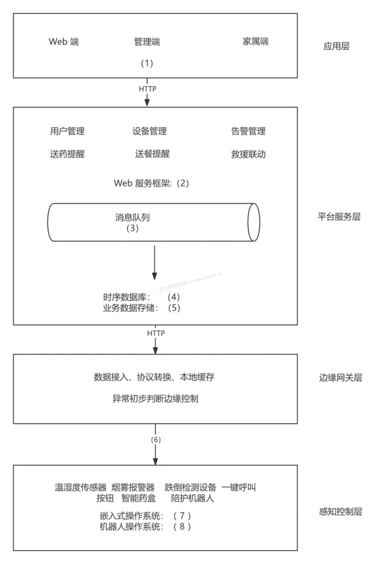

### 问题1

结合备选技术，补充系统分层中的关键技术。
A. Vue.js
B. Flask
C. TDengine
D. MySQL
E. MQTT
F. Kafka
G. FreeRTOS
H. ROS

**参考答案**

（1）Vue.js
（2）Flask
（3）Kafka
（4）TDengine
（5）MySQL
（6）MQTT
（7）FreeRTOS
（8）ROS

**答案解析**

最上层是应用层，Web 端通常使用 Vue.js 这类前端框架实现；平台服务层负责业务接口、设备管理、告警管理等，可使用 Flask 提供 Web 服务；传感器数据具有明显的时间序列特征，适合使用 TDengine 存储；用户、设备、告警规则等结构化业务数据适合使用 MySQL；边缘网关与设备之间常用 MQTT 进行轻量级物联网通信；平台内部异步消息传递可使用 Kafka；普通嵌入式设备适合运行 FreeRTOS；陪护机器人涉及感知、运动控制和任务调度，适合使用 ROS。

**浓缩知识点**：云边端与智能架构 （1）Vue.js （2）Flask 最上层是应用层，Web 端通常使用 Vue.js 这类前端框架实现；平台服务层负责业务接口、设备管理、告警管理等，可使用 Flask 提供 Web 服务；传感器数据具有明显的时间序列特征，适合使用 TDengine 存储；用户、设备、告警规则等结构化业务数据适合使用 MySQL；边缘网关与设备之间常用 MQTT 进行轻量级物联网通信；平台内部异步消息传递可使用 Kafka；普通嵌入式设备适合运行 FreeRTOS；陪护机器人涉及感知、运动控制和任务调度，适合使用 ROS。

---

### 问题2

说明时序数据库的含义，以及边缘网关为什么适合使用时序数据库。

**参考答案**

时序数据库是面向时间序列数据设计的数据库，数据通常由时间戳、指标值和标签组成，适合保存传感器、设备状态、能耗、监控指标等连续采样数据。它通常支持高频写入、按时间范围查询、滑动窗口聚合、降采样、压缩存储、数据保留策略和快速趋势分析。
边缘网关适合使用时序数据库的原因包括：第一，居家养老设备会持续产生温湿度、电表、设备心跳、跌倒检测等时间序列数据；第二，边缘侧就近存储可减少上传云端的压力；第三，弱网或断网时可先本地缓存，网络恢复后再同步；第四，边缘规则可直接基于最近一段时间的数据做本地告警，例如长时间未活动、水电异常或浴室滞留；第五，时间窗口查询和趋势分析有利于护理人员判断老人状态变化。

**答案解析**

本问考查时序数据库的适用场景。时序数据库是面向时间序列数据优化的数据库，数据通常由时间戳、指标值和标签组成，例如设备编号、房间编号、老人编号、采集类型、采集时间和采样值。它不是普通关系表里多一个时间字段，而是在高频写入、按时间范围查询、窗口聚合、降采样、压缩存储、数据保留策略和趋势分析方面做了专门优化。典型场景包括物联网传感器、设备监控、能源表计、车联网轨迹和系统性能指标。
居家养老系统非常适合使用时序数据库。温湿度、光照、水电表、药盒状态、设备心跳和行为检测结果都具有连续采样特征，数据量大且天然按时间查询。边缘网关使用时序数据库有几个实际价值：第一，弱网或短时断网时可以本地保存连续采样数据，网络恢复后再同步到云端，避免数据缺口；第二，边缘规则可以直接查询最近5分钟、30分钟或24小时的变化趋势，例如判断长时间未活动、夜间用水异常、浴室滞留或室内温度异常；第三，本地聚合和降采样可以减少上云流量，只上传摘要、异常片段或必要明细；第四，连续历史数据能帮助护理人员观察老人状态变化，而不是只看到单点告警。
因此，本题不能只答“用来存传感器数据”，应进一步写出高频写入、时间窗口查询、断网缓存、本地告警和云端减压这些关键词。
从工程实现看，边缘侧使用时序数据库还要考虑容量和同步策略。边缘网关不可能长期保存全部历史数据，因此可设置保留周期、压缩策略和降采样策略，例如保留最近7天明细、最近30天分钟级聚合，并在网络恢复后按时间戳和设备编号增量同步到云端。对告警判断而言，时序数据库能支持“连续多次异常”“一段时间内没有活动”“夜间用水突增”等窗口规则，这比只看某一次上报更可靠。答题时如果能写出“时间戳、标签、窗口聚合、断网缓存、恢复同步”，就能明显区别于普通数据库概念题。

**浓缩知识点**：云边端与智能架构 时序数据库是面向时间序列数据设计的数据库，数据通常由时间戳、指标值和标签组成，适合保存传感器、设备状态、能耗、监控指标等连续采样数据。它通常支持高频写入、按时间范围查询、滑动窗口聚合、降采样、压缩存储、数据保留策略和快速趋势分析。 边缘网关适合使用时序数据库的原因包括：第一，居家养老设备会持续产生温湿度、电表、设备心跳、跌倒检测等时间序列数据；第二，边缘侧就近存储可减少上传云端的压力；第三，弱网或断网时可先本地缓存，网络恢复后再同步；第四，边缘规则可直接基于最近一段时间的数据做本地告警，例如长时间未活动、水电异常或浴室滞留；第五，时间窗口查询和趋势分析有利于护理人员判断老人状

---

### 问题3

先把QoS 0、QoS 1、QoS 2填入下方表格合适的位置，然后解释 MQTT QoS 0、QoS 1、QoS 2 的含义，并说明关键告警为什么可使用 QoS 2。

**参考答案**

MQTT QoS 0 表示最多一次发送，发送方只发一次，不确认送达，消息可能丢失，但开销最低，适合温湿度等普通高频数据。
QoS 1 表示至少一次送达，通过确认机制保证消息到达，但可能重复，适合一般状态上报、设备心跳或普通告警。
QoS 2 表示恰好一次送达，通过更完整的握手机制避免丢失和重复，可靠性最高，但通信开销也最大。
跌倒、一键呼叫、燃气异常、浴室长时间滞留等关键告警可使用 QoS 2，因为这类消息一旦丢失会影响救援时效，重复触发又可能造成误派单或重复处置。

**答案解析**

本问考查 MQTT QoS 机制和业务分级。QoS 0 表示最多一次，发布端只发送一次，不等待确认，消息可能丢失，但交互最少、开销最低，适合温湿度、光照、普通心跳等高频且可容忍少量丢失的数据。QoS 1 表示至少一次，发送方通过确认机制保证消息至少到达一次，但在网络抖动或重传时可能重复，适合设备状态、一般告警、药盒开关状态等需要到达但可通过消息 ID 去重的数据。QoS 2 表示恰好一次，通过更完整的握手流程保证消息既不丢失也不重复，可靠性最高，但通信轮次和状态维护成本也最高。
养老场景不能简单把所有消息都设为 QoS 2。普通环境数据几秒钟就会上报一次，丢一条通常不会影响判断；若全部使用 QoS 2，会增加网关和平台压力，反而影响关键告警。但跌倒、一键呼叫、燃气异常、浴室长时间滞留这类事件具有强时效和强业务后果，一旦丢失可能延误救援，重复触发又可能造成重复派单、家属反复通知或应急资源浪费，因此可以使用 QoS 2，并配合告警编号、幂等处理和处置状态机。答题时要体现“按消息重要性选择 QoS”的思想，而不是把 QoS 2 描述成通用最优方案。
还要注意 QoS 与业务幂等并不矛盾。即使使用 QoS 2 保证 MQTT 层恰好一次，也不能完全替代应用层幂等，因为业务系统还可能因重试、网关补发、消费者失败或人工补录产生重复事件。所以关键告警最好同时携带告警 ID、设备 ID、时间戳和事件类型，在平台侧建立告警状态机，避免同一次跌倒事件重复生成多个处置工单。如果题目问“为什么关键告警使用 QoS 2”，不能只写“更可靠”，应补充关键告警的业务后果：丢失会延误救援，重复会浪费应急资源并干扰家属和医生判断。

**浓缩知识点**：云边端与智能架构 MQTT QoS 0 表示最多一次发送，发送方只发一次，不确认送达，消息可能丢失，但开销最低，适合温湿度等普通高频数据。 QoS 1 表示至少一次送达，通过确认机制保证消息到达，但可能重复，适合一般状态上报、设备心跳或普通告警。 本问考查 MQTT QoS 机制和业务分级。QoS 0 表示最多一次，发布端只发送一次，不等待确认，消息可能丢失，但交互最少、开销最低，适合温湿度、光照、普通心跳等高频且可容忍少量丢失的数据。QoS 1 表示至少一次，发送方通过确认机制保证消息至少到达一次，但在网络抖动或重传时可能重复，适合设备状态、一般告警、药盒开关状态等需要到达但可通过消息 ID

---

## 28. 2026年5月第3题（云边端与智能架构）

- 题号：0020260501003
- 题目标签：云边端与智能架构
- 难度：中等
- 频率：高频
- 浓缩知识点：云边端与智能架构；重点围绕题干场景、架构决策与质量属性进行分析。

### 题目说明

阅读以下关于 AI 决策的智能安防管理架构的叙述，在答题纸上回答问题1-3。
【说明】
某产业园区计划建设一套智能安防管理系统，对人员通行、车辆出入、重点区域周界、访客身份和异常事件进行统一管理。园区内已经部署摄像头、智能门禁、闸机、生物识别终端、红外周界探测器、巡检机器人和边缘网关等设备。系统需要支持人脸识别、身份核验、异常闯入识别、黑名单告警、门禁联动、事件派单、大屏展示以及与物业、公安、消防等第三方系统集成。
架构师提出采用 AIoT 分层架构，将系统划分为感知层、边缘层、AI 决策层和应用层。感知层负责采集视频、门禁、身份和周界等原始信息；边缘层负责设备接入、协议适配、本地缓存、边缘推理和低时延联动；AI 决策层负责模型推理、视觉分析、规则分析、事件关联和风险判断；应用层负责事件中心、处置流程、可视化展示、移动端通知和第三方系统集成。
系统设计图中需要放置的组件包括：智能门禁、生物识别设备、身份核验服务、周界防护设备、边缘网关、边缘控制器、AI 模型、视觉分析引擎、规则/认知引擎、事件中心、APP、大屏展示和第三方系统集成模块。项目组还需要分析该四层架构在设备异构、边缘资源、模型准确性、数据安全和运维管理方面可能存在的不足。

### 问题1

说明感知层、边缘层、AI 决策层和应用层的主要职责。

**参考答案**

感知层负责采集园区物理世界的原始信息，包括视频图像、门禁刷卡记录、人脸或指纹等生物特征、周界报警、车辆出入和环境传感数据。
边缘层负责设备接入、协议适配、视频或图片预处理、本地缓存、边缘推理和低时延联动，例如在网络不稳定时仍能完成本地开门、拦截或声光告警。
AI 决策层负责模型推理、视觉分析、身份核验、规则分析、事件关联、风险评分和策略生成，把单点告警转化为可处置的安全事件。
应用层负责事件中心、处置流程、工单派发、可视化大屏、移动端通知、报表统计以及与物业、公安、消防等第三方系统集成。

**答案解析**

本问考查 AIoT 分层架构的职责边界。感知层的关键词是“采集和执行”，它负责把园区物理世界中的视频、门禁刷卡、人脸或指纹、车辆出入、周界报警和巡检状态转换为系统可处理的数据，同时也可能执行开门、关闸、声光报警等基础动作。边缘层的关键词是“就近接入和低时延处理”，它负责把摄像头、门禁、闸机和传感器接入系统，完成协议适配、数据预处理、本地缓存、轻量推理和本地联动。例如网络断开时，边缘控制器仍应能根据本地白名单完成门禁控制，或在周界异常时触发现场声光告警。
AI 决策层的关键词是“识别、关联和判断”。它不只是运行一个 AI 模型，而是综合视觉分析、身份核验、规则引擎、事件关联和风险评分，把分散的摄像头画面、门禁记录和周界事件组合成可解释的安全判断。应用层的关键词是“展示、流转和处置”，包括事件中心、告警确认、工单派发、移动端通知、大屏展示、统计报表以及物业、公安、消防等第三方系统集成。
容易混淆的是身份核验和门禁联动。身份采集设备属于感知层，身份比对算法或核验服务属于 AI 决策层，低时延开门控制可能落在边缘层，最终处置流程和展示则在应用层。能把一个跨层功能拆成多个职责，是架构题得分的关键。
答题时可以用“数据从哪里来、在哪里快速处理、在哪里做智能判断、最后由谁处置”来组织。摄像头画面和门禁刷卡记录来自感知层；边缘层负责把多设备数据整理成统一事件，并在低时延场景下先做本地联动；AI 决策层把单点数据变成判断结果，例如黑名单人员进入、异常闯入或尾随通行；应用层把判断结果转为可执行流程，例如通知保安、生成工单、联动公安或消防。如果把 AI 决策层和应用层混在一起，答案会显得像功能清单；如果把边缘层只写成“传输数据”，又会漏掉边缘推理和本地联动。

**浓缩知识点**：云边端与智能架构 感知层负责采集园区物理世界的原始信息，包括视频图像、门禁刷卡记录、人脸或指纹等生物特征、周界报警、车辆出入和环境传感数据。 边缘层负责设备接入、协议适配、视频或图片预处理、本地缓存、边缘推理和低时延联动，例如在网络不稳定时仍能完成本地开门、拦截或声光告警。 本问考查 AIoT 分层架构的职责边界。感知层的关键词是“采集和执行”，它负责把园区物理世界中的视频、门禁刷卡、人脸或指纹、车辆出入、周界报警和巡检状态转换为系统可处理的数据，同时也可能执行开门、关闸、声光报警等基础动作。边缘层的关键词是“就近接入和低时延处理”，它负责把摄像头、门禁、闸机和传感器接入系统，完成协议适配、数

---

### 问题2

将智能门禁、生物识别、身份核验、周界防护、边缘网关、AI 模型、视觉分析引擎、规则/认知引擎、事件中心、第三方系统集成、APP 或大屏等组件放入合适层次。

**参考答案**

感知层：智能门禁、闸机、生物识别采集设备、摄像头、周界防护设备、红外探测器、巡检机器人采集端等，主要负责采集和执行。
边缘层：边缘网关、边缘控制器、本地缓存、本地联动模块、边缘推理节点等，主要负责接入、协议转换和低时延控制。
AI 决策层：AI 模型、视觉分析引擎、规则/认知引擎、身份核验服务、事件关联分析、风险评分模块等，主要负责识别、推理和决策。
应用层：事件中心、APP、大屏展示、告警处置、工单流转、报表统计和第三方系统集成模块等，主要面向用户和业务流程。
若图中要求放置“身份核验”，可将采集设备放在感知层，将身份核验算法或服务放在 AI 决策层；第三方系统集成一般放在应用层或集成适配层。

**答案解析**

本问考查组件归层。归层时不要只看组件名称，要看它在系统中承担的主要职责。智能门禁、闸机、摄像头、生物识别采集设备、周界防护设备、红外探测器和巡检机器人采集端直接面对现场，负责采集原始信息或执行现场动作，应放在感知层。边缘网关、边缘控制器、本地缓存、本地联动模块和边缘推理节点承担设备接入、协议转换、预处理、断网缓存和低时延控制，应放在边缘层。
AI 模型、视觉分析引擎、规则/认知引擎、身份核验服务、事件关联分析和风险评分模块的职责是识别、推理、关联和决策，应放在 AI 决策层。其中视觉分析引擎可以做人脸识别、车辆识别、入侵检测、轨迹分析；规则/认知引擎可以把“非工作时间进入重点区域”“黑名单人员靠近门禁”“周界报警同时摄像头出现人员”这类条件组合成风险事件。事件中心、APP、大屏展示、告警处置、工单流转、报表统计和第三方系统集成模块面向业务用户和外部系统，应放在应用层。
如果题目给出身份核验这样的跨层组件，可以拆开回答：生物特征采集终端在感知层，身份核验算法或服务在 AI 决策层，核验结果触发的开门联动可能在边缘层，核验记录展示和审计在应用层。这种拆分比机械地把组件放到单一层更符合实际架构。
如果题目是图中填空，可以优先根据箭头和数据流判断。离设备最近、输入原始视频/刷卡/探测信号的空一般填感知组件；连接多种设备并向上转发的一般填边缘网关；接收预处理数据并输出识别结果或风险判断的一般填 AI 模型、视觉分析引擎或规则引擎；面向用户展示或外部联动的一般填事件中心、APP、大屏和第三方集成。同时要注意“第三方系统集成”不是感知层设备，它通常属于应用层的对外接口或集成适配模块，用来把处置结果同步给物业、公安、消防等外部系统。

**浓缩知识点**：云边端与智能架构 感知层：智能门禁、闸机、生物识别采集设备、摄像头、周界防护设备、红外探测器、巡检机器人采集端等，主要负责采集和执行。 边缘层：边缘网关、边缘控制器、本地缓存、本地联动模块、边缘推理节点等，主要负责接入、协议转换和低时延控制。 本问考查组件归层。归层时不要只看组件名称，要看它在系统中承担的主要职责。智能门禁、闸机、摄像头、生物识别采集设备、周界防护设备、红外探测器和巡检机器人采集端直接面对现场，负责采集原始信息或执行现场动作，应放在感知层。边缘网关、边缘控制器、本地缓存、本地联动模块和边缘推理节点承担设备接入、协议转换、预处理、断网缓存和低时延控制，应放在边缘层。 AI 模型、

---

### 问题3

列举该四层 AIoT 架构可能存在的五类不足或风险。

**参考答案**

可能存在的不足或风险包括：
设备兼容和协议适配复杂，不同厂商门禁、摄像头和传感器接口不统一。
边缘算力和存储有限，难以长期保存高清视频或运行大模型。
AI 模型存在误报、漏报和场景泛化不足问题，例如光照变化、遮挡、口罩、拥挤场景都会影响识别准确率。
隐私与数据安全风险高，人脸、轨迹和门禁记录需要加密、脱敏、访问控制和审计。
云边协同复杂，模型版本、规则配置、告警状态和处置结果需要保持一致。
还可以补充：网络故障影响联动、模型更新灰度困难、第三方系统集成成本高、误告警带来运营压力、设备远程运维复杂等。

**答案解析**

AIoT 智能安防的风险要从 IoT、AI 和安防业务三条线同时分析。IoT 侧首先是设备异构和协议适配风险，不同厂家摄像头、门禁、闸机、生物识别终端和周界设备接口不统一，如果缺少统一设备模型和适配层，后续联动、监控和运维会非常困难。其次是边缘资源受限，边缘节点算力、存储和网络条件有限，高清视频长期保存、大模型推理和多路并发分析都可能超出能力边界，需要做本地预处理、轻量模型、事件片段上传和云边协同。
AI 侧风险主要是模型准确性和可运营性。光照变化、遮挡、逆光、雨雪、口罩、摄像头角度、人员拥挤都会影响人脸识别和入侵检测，带来误报和漏报。误报会增加保安派单和运营成本，漏报则可能导致真实安全事件未处置。模型还涉及版本管理、灰度发布、效果评估和回滚机制，如果没有统一管理，园区不同区域可能运行不同模型版本，难以解释结果差异。
安防业务侧还要关注隐私安全、合规和处置闭环。人脸、轨迹、门禁记录、访客身份都属于敏感数据，需要加密、脱敏、权限控制和审计；事件中心如果没有状态机、责任人、超时升级和闭环反馈，即使识别到了异常，也可能停留在告警列表里无人处理。其他可写风险包括网络故障影响联动、第三方系统集成成本高、设备远程升级失败、规则配置不一致等。答题时每类风险最好带一个业务后果。
展开风险时，可以补充治理措施来增强答案深度。设备异构可通过统一设备接入规范、适配器和设备模型解决；边缘资源不足可通过边缘预处理、轻量模型和云端复核缓解；模型误报漏报可通过样本持续标注、阈值调优、人工复核和灰度发布降低；隐私风险可通过最小权限、加密存储、脱敏展示和审计日志控制；云边协同可通过配置版本号、模型版本号、心跳、状态同步和回滚机制保障。考试问“问题”时主要列问题即可，但附带一两句解决方向，可以让解析更像完整架构分析。

**浓缩知识点**：云边端与智能架构 可能存在的不足或风险包括： 设备兼容和协议适配复杂，不同厂商门禁、摄像头和传感器接口不统一。 AIoT 智能安防的风险要从 IoT、AI 和安防业务三条线同时分析。IoT 侧首先是设备异构和协议适配风险，不同厂家摄像头、门禁、闸机、生物识别终端和周界设备接口不统一，如果缺少统一设备模型和适配层，后续联动、监控和运维会非常困难。其次是边缘资源受限，边缘节点算力、存储和网络条件有限，高清视频长期保存、大模型推理和多路并发分析都可能超出能力边界，需要做本地预处理、轻量模型、事件片段上传和云边协同。 AI 侧风险主要是模型准确性和可运营性。光照变化、遮挡、逆光、雨雪、口罩、摄像头角度

---

> **知识点分组：知识图谱与智能问答**

## 29. 2025年5月第2题（知识图谱与智能问答）

- 题号：0020250501002
- 题目标签：知识图谱与智能问答
- 难度：困难
- 频率：中频
- 浓缩知识点：知识图谱与智能问答；重点围绕题干场景、架构决策与质量属性进行分析。

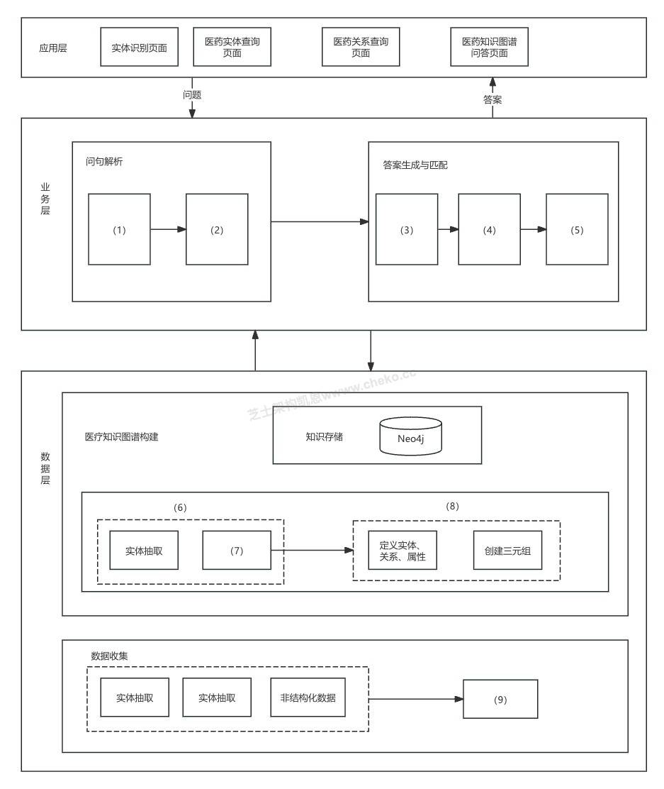
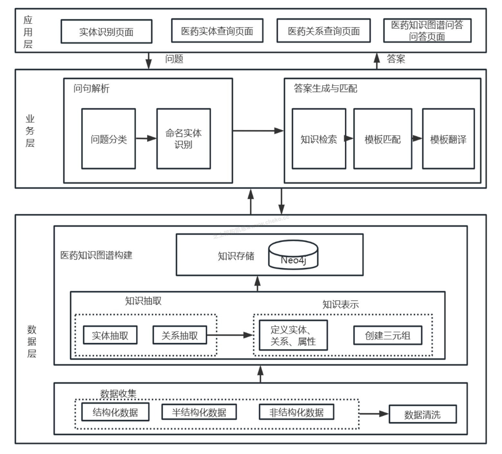

### 问题1

根据题干描述的内容，将下列选项填入图中合适位置
（a）知识检索（b）模板翻译（c）数据清洗（d）命名实体识别（e）知识表示（f）模板匹配（g）问题分类（h）知识抽取 （i）关系抽取

**参考答案**

（1）g（2）d（3）a（4）f（5）b（6）h（7）i（8）e（9）c

**答案解析**

整个系统是一个典型的医疗问答系统+知识图谱构建架构，从下到上分为：
数据层：包括原始数据收集、清洗、抽取实体和知识。构建结构化知识图谱，存储于 Neo4j。
业务层：接收用户问题后进行解析（问题分类、实体识别），然后生成结构化查询（模板翻译、匹配）并从图数据库检索答案。
应用层：提供不同功能页面，面向用户展示，如“实体说明页面”、“关系查询页面”等。
(1) g. 问题分类 问句处理的第一步通常是对问题进行分类，如判断是查实体、查关系等。
(2) d. 命名实体识别 在用户问题中识别出疾病、药物等实体，是问句理解中的关键步骤。
(3) a. 知识检索 匹配后执行查询，进入图数据库中检索答案。
(4) f. 模板匹配 将翻译后的模板与已有模板库匹配，确定合适的查询方式。
(5) b. 模板翻译 将结构化的语义解析结果转换为查询模板，比如转换成 Cypher 查询语句。
(6) h. 知识抽取 从原始数据中提取结构化信息，为知识图谱构建做准备。
(7) i. 关系抽取 从非结构化或半结构化的文本中，自动识别并提取 实体之间存在的语义关系。。
(8) e. 知识表示 对抽取的知识进行结构化表达，例如 RDF 三元组，定义实体、关系和属性。
(9) c. 数据清洗 对原始数据（尤其是非结构化数据）进行预处理，包括去噪、去重、格式规范等。

**浓缩知识点**：知识图谱与智能问答 （1）g（2）d（3）a（4）f（5）b（6）h（7）i（8）e（9）c 整个系统是一个典型的医疗问答系统+知识图谱构建架构，从下到上分为： 数据层：包括原始数据收集、清洗、抽取实体和知识。构建结构化知识图谱，存储于 Neo4j。

---

### 问题2

在构建医药知识图谱系统中，选择哪类数据库更适合存储知识图谱数据？请明确说明数据库类型及推荐技术实现，并结合医药数据特性说明理由。

**参考答案**

推荐使用图数据库（Graph Database），如 Neo4j、Amazon Neptune 等，来存储医药知识图谱数据。因为医药领域的知识结构普遍基于三元组，图数据库能以节点和边的形式自然建模实体及其复杂关系，尤其适合表示药物相互作用、疾病关联等语义网络。图数据库还支持高效的关系遍历、多跳查询和图算法分析，如最短路径、社区发现等，有助于深入挖掘潜在医学关联。此外，Neo4j 提供的 Cypher 查询语言便于灵活表达医学图谱中的复杂语义关系。

**答案解析**

在医药行业构建知识图谱时，推荐使用图数据库（Graph Database），如 Neo4j、Amazon Neptune 或 ArangoDB，这类数据库以“节点+边”的形式存储信息，天然适配知识图谱中的三元组结构，例如「阿司匹林」→（治疗）→「血栓性疾病」或「阿司匹林」→（副作用）→「胃肠道出血」，可直观表达药物、疾病、基因、症状等实体之间复杂的多对多关系。
图数据库支持高效的多跳关系查询，优于关系型数据库在复杂语义链路处理方面的性能，同时还支持图算法用于疾病传播路径分析、药品聚类和关键实体发现等高级任务。在 Neo4j 中，可通过类 SQL 的 Cypher 查询语言进行灵活的模式匹配与关系推理，其图形可视化界面适合医药专家理解图谱结构，且生态成熟，易于与 NLP、向量数据库和机器学习系统集成，广泛应用于药物发现、智能问答（如“哪些药物不能与华法林同时使用？”）和病例辅助分析等场景。

**浓缩知识点**：知识图谱与智能问答 推荐使用图数据库（Graph Database），如 Neo4j、Amazon Neptune 等，来存储医药知识图谱数据。因为医药领域的知识结构普遍基于三元组，图数据库能以节点和边的形式自然建模实体及其复杂关系，尤其适合表示药物相互作用、疾病关联等语义网络。图数据库还支持高效的关系遍历、多跳查询和图算法分析，如最短路径、社区发现等，有助于深入挖掘潜在医学关联。此外，Neo4j 提供的 Cypher 查询语言便于灵活表达医学图谱中的复杂语义关系。 在医药行业构建知识图谱时，推荐使用图数据库（Graph Database），如 Neo4j、Amazon Neptune 或 A

---

### 问题3

下图是 Scrapy 框架的核心结构图，其中挖空了三个关键组件，请根据图示结构，在图中标记的位置填入相应的模块名称，并请简要解释什么是“异步IO”。

**参考答案**

（1） Scheduler（调度器）（2） Scrapy Engine（引擎）（3）Item Pipeline（项目管道）
在异步IO模式下，程序向操作系统发起I/O请求（如读文件、收网络数据）后，不会阻塞等待结果返回，而是立即返回并继续执行其他逻辑。当I/O操作完成后，操作系统会通过回调函数、事件通知或信号等方式通知程序，程序再去处理结果。

**答案解析**

完整的 Scrapy 架构图如下图所示。Scrapy 是一个基于事件驱动和组件解耦设计的高效 Python 爬虫框架，其核心由 Scrapy Engine 驱动各模块协同工作，实现请求的调度、页面的下载、数据的解析与存储。其主要组件包括 Scheduler（管理请求队列）、Downloader（负责抓取网页）、Spider（解析网页数据）、Item Pipeline（处理和存储数据）及中间件（提供灵活的处理钩子）。整体数据流从 Spider 生成请求开始，经由 Engine 分发至 Downloader 并返回响应，再交由 Spider 提取数据，最终交由 Pipeline 存储，形成完整的爬虫闭环流程。该架构具有高扩展性、清晰的数据流向和良好的模块隔离性。
异步IO是一种“非阻塞 + 回调机制”的输入输出处理方式，程序在发起I/O操作后无需等待结果返回，而是将操作交由操作系统异步完成，待I/O结束后通过事件、信号或回调函数等机制通知程序继续处理结果。常见实现方式包括事件驱动模型（如Node.js的事件循环）、IO多路复用（如epoll）、信号/回调通知（如Windows IOCP）、以及协程与异步结合（如Python的asyncio）。这种机制能够显著提升并发性能，降低线程开销，尤其适合构建高吞吐量、高并发的网络系统。

**浓缩知识点**：知识图谱与智能问答 （1） Scheduler（调度器）（2） Scrapy Engine（引擎）（3）Item Pipeline（项目管道） 在异步IO模式下，程序向操作系统发起I/O请求（如读文件、收网络数据）后，不会阻塞等待结果返回，而是立即返回并继续执行其他逻辑。当I/O操作完成后，操作系统会通过回调函数、事件通知或信号等方式通知程序，程序再去处理结果。 完整的 Scrapy 架构图如下图所示。Scrapy 是一个基于事件驱动和组件解耦设计的高效 Python 爬虫框架，其核心由 Scrapy Engine 驱动各模块协同工作，实现请求的调度、页面的下载、数据的解析与存储。其主要组件包

---

## 30. 2026年5月第4题（知识图谱与智能问答）

- 题号：0020260501004
- 题目标签：知识图谱与智能问答
- 难度：困难
- 频率：中频
- 浓缩知识点：知识图谱与智能问答；重点围绕题干场景、架构决策与质量属性进行分析。

### 题目说明

阅读以下关于学习路径推荐与智能辅助系统的叙述，在答题纸上回答问题1-3。
【说明】
某在线教育企业计划建设一套智能学习系统，为软考、职业资格考试和企业内训用户提供个性化学习服务。系统需要根据用户的基础水平、学习目标、做题记录、课程学习行为和阶段测评结果，动态生成学习路径，并在学习过程中提供智能答疑、错因分析、课程推荐、学习提醒和效果反馈。
项目组在设计系统时，将用户的学习过程抽象为若干状态。用户进入系统后，首先处于“学习进行中”状态。在该状态下，系统持续记录用户的课程观看、做题情况、知识点掌握度和学习时长等信息。当用户主动结束本次学习，或系统检测到学习任务完成后，用户可以进入“退出学习”状态。
在学习过程中，系统会定期进行信息采集，包括用户画像、学习行为、测评结果、题目作答、错题记录和学习资源使用情况。系统根据采集到的数据，结合知识图谱、用户画像模型、掌握度模型和推荐模型，对用户当前学习情况进行分析，并向智能辅导模块发起课程推荐。智能辅导模块根据用户的薄弱知识点、前置依赖关系、目标考试要求和学习进度，推荐相应课程、练习题和复习资源。
当用户在学习过程中遇到问题时，可以进入智能辅导状态。智能辅导模块支持智能答疑、错因分析、学习提醒、资源匹配和个性化讲解。完成辅导后，系统会根据用户新的学习行为和反馈结果，重新调整学习建议，并返回学习进行中状态。
系统还设置了效果评估环节。用户完成阶段学习后，系统会进入效果评估状态，对用户的阶段测评成绩、知识点掌握度、错题变化、学习完成率和课程吸收情况进行分析。效果评估结果一方面会形成效果反馈，用于调整后续学习策略；另一方面也会作为学习评估结果反馈给学习过程，用于判断用户是否需要继续巩固、重新学习或进入下一阶段内容。
系统试运行后发现两个问题：一是新注册用户缺少历史学习行为和测评数据，系统推荐准确率较低；二是部分基础薄弱学生被推荐了过多高级知识点，跳过了必要的前置基础内容，导致学习路径过难。项目组需要从冷启动、知识依赖推理、数据质量和推荐鲁棒性等角度分析原因并提出改进思路。
视频解析
收起视频
非会员试看权益剩余 5 / 5 次

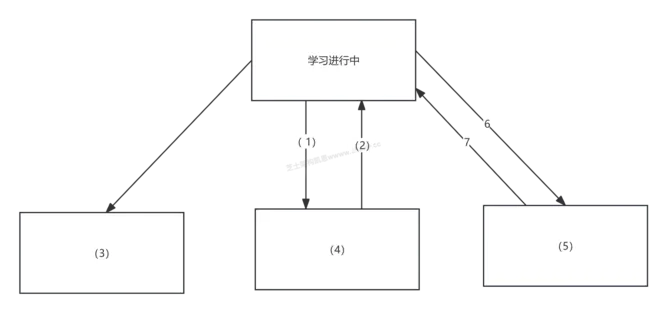

### 问题1

根据题干内容填写下面图片中空白部分。

**参考答案**

（1）信息采集
（2）课程推荐
（3）退出学习
（4）智能辅导中
（5）效果评估
（6）效果反馈
（7）学习评估

**答案解析**

本问考查的是个性化学习系统的闭环设计，围绕“学习进行中”这个核心状态，不断完成信息采集、智能辅导、效果评估和反馈调整。
在学习进行中状态下，系统需要持续进行信息采集。这里的信息采集不是泛泛地收集用户数据，而是要覆盖用户画像、学习目标、基础水平、课程观看记录、练习作答情况、错题记录、阶段测评结果、知识点掌握度、学习时长、资源使用情况和反馈评价等内容。这些数据分别回答“用户是谁”“要学什么”“现在会什么”“学过什么”“哪里薄弱”“资源是否有效”等问题。若系统只采集点击次数和观看时长，就很难判断用户是否真正掌握了知识点，也难以支撑后续推荐。
系统采集到学习数据后，需要进入智能辅导环节。智能辅导中更关注学习过程中的即时支持，例如智能答疑、错因分析、相似题推荐、薄弱知识点提醒、课程推荐、学习计划提醒和阶段测评建议。它解决的是“用户当前卡在哪里、下一步该补什么、用什么资源补”的问题。比如用户在“软件架构风格”相关题目上连续出错，系统不应只推荐更多同类难题，而应先分析其是否没有掌握“构件、连接件、约束”等基础概念，再推荐管道-过滤器、事件驱动、黑板架构等进阶内容。
学习路径推荐则更偏路线生成，它不是普通的内容推荐。路径推荐需要结合目标知识点、前置依赖、难度梯度、掌握阈值、考试时间、用户基础和学习偏好，生成从基础到进阶的学习顺序，并随着新的作答数据和测评结果动态调整。对于基础薄弱的用户，系统应优先补齐先修知识，再逐步进入综合案例、论文素材和高阶应用，而不能直接推送高级知识点，否则容易造成学习路径过难。
效果评估是闭环中的关键环节。用户完成阶段学习后，系统需要根据阶段测评成绩、知识点掌握度变化、错题减少情况、课程完成率、学习活跃度和资源反馈，对学习效果进行判断。效果评估结果一方面形成效果反馈，用于调整后续辅导内容和推荐策略；另一方面形成学习评估，用于判断用户是否需要继续巩固、重新学习或进入下一阶段。这样，系统才能形成“信息采集—智能辅导—学习推荐—效果评估—反馈调整”的闭环。

**浓缩知识点**：知识图谱与智能问答 （1）信息采集 （2）课程推荐 本问考查的是个性化学习系统的闭环设计，围绕“学习进行中”这个核心状态，不断完成信息采集、智能辅导、效果评估和反馈调整。 在学习进行中状态下，系统需要持续进行信息采集。这里的信息采集不是泛泛地收集用户数据，而是要覆盖用户画像、学习目标、基础水平、课程观看记录、练习作答情况、错题记录、阶段测评结果、知识点掌握度、学习时长、资源使用情况和反馈评价等内容。这些数据分别回答“用户是谁”“要学什么”“现在会什么”“学过什么”“哪里薄弱”“资源是否有效”等问题。若系统只采集点击次数和观看时长，就很难判断用户是否真正掌握了知识点，也难以支撑后续推荐。

---

### 问题2

新用户推荐准确率低的原因是什么？如何解决这个问题？

**参考答案**

新用户推荐准确率低的主要原因是缺少历史学习行为、测评数据、作答记录、偏好信息和目标约束，系统无法准确判断其基础水平、薄弱知识点和学习偏好，因此用户画像和掌握度模型不稳定。
改进思路包括入门测评、兴趣/目标问卷、基于规则的初始路径、利用相似用户迁移、热门资源兜底和专家标注知识图谱。

**答案解析**

冷启动的本质是缺少可用于建模和推荐的历史数据。新注册用户没有课程浏览、做题记录、错题分布、阶段测评和资源反馈，系统无法准确判断他的基础水平、学习目标、薄弱知识点和学习偏好，因此初始画像和掌握度估计不稳定，推荐准确率自然偏低。对软考或职业资格考试场景来说，用户可能有工作经验但缺少考试训练，也可能刚入门但点击了高级课程，如果没有入门测评和目标问卷，模型很容易把少量行为误判为真实能力。
缓解思路包括入门诊断测评、目标和时间问卷、专家维护知识图谱、基于规则的初始路径、热门资源或基础资源兜底、相似用户迁移、内容特征推荐，以及适度探索曝光。答题时只写“数据少”不够，应说明少了哪些数据、影响了哪些模型，以及可以如何补数据或用规则兜底。
从系统设计角度看，冷启动不能完全依赖模型自己学习，因为初期数据不足时模型输出不稳定。更稳的做法是用“测评 + 规则 + 专家知识 + 少量探索”建立初始画像。例如新用户注册时选择考试科目、备考时间和基础水平，再做10到20道诊断题，系统根据知识点覆盖情况生成初始掌握度；新课程上线时由教研人员标注知识点、难度、适用阶段和先修要求；新知识点加入大纲时先由专家维护依赖关系，再用用户数据逐步校正。这样冷启动阶段有规则兜底，数据积累后再逐步交给推荐模型优化。

**浓缩知识点**：知识图谱与智能问答 新用户推荐准确率低的主要原因是缺少历史学习行为、测评数据、作答记录、偏好信息和目标约束，系统无法准确判断其基础水平、薄弱知识点和学习偏好，因此用户画像和掌握度模型不稳定。 改进思路包括入门测评、兴趣/目标问卷、基于规则的初始路径、利用相似用户迁移、热门资源兜底和专家标注知识图谱。 冷启动的本质是缺少可用于建模和推荐的历史数据。新注册用户没有课程浏览、做题记录、错题分布、阶段测评和资源反馈，系统无法准确判断他的基础水平、学习目标、薄弱知识点和学习偏好，因此初始画像和掌握度估计不稳定，推荐准确率自然偏低。对软考或职业资格考试场景来说，用户可能有工作经验但缺少考试训练，也可能刚入

---

### 问题3

基础薄弱学生得到的路径过难，系统过度推荐高级知识。分别从路径推理和数据角度分析鲁棒性差的原因。

**参考答案**

路径推理角度：可能没有严格建模前置知识依赖和拓扑顺序，没有设置基础知识掌握阈值，也没有把知识点难度梯度纳入约束，导致系统在推荐高级知识点前没有检查用户是否掌握必要前置内容。还可能只按资源热度或相似用户行为推荐，忽略了个体基础差异。
数据角度：可能存在作答数据稀疏、测评样本不足、知识点标签错误、题目难度标注不准、历史行为不能真实反映掌握度、训练样本偏向中高水平用户等问题。如果错题和薄弱知识点没有及时回流，模型也会低估基础知识缺口。
改进可从两方面入手：推理侧建立知识图谱和前置依赖约束，设置掌握阈值和路径回退机制；数据侧提高知识点标注质量，增加诊断测评，对低基础用户单独建模，并将作答、错因和学习反馈及时回流。

**答案解析**

本问要把路径推理问题和数据问题分开分析。路径推理角度看，基础薄弱学生被推荐大量高级知识，通常说明系统没有严格使用知识点前置依赖和拓扑顺序。例如在学习架构设计时，用户还没有掌握质量属性、架构风格和 UML 基础，系统却直接推荐 ATAM、DSSA 或微服务治理，就会造成路径过难。合理路径应先检查前置知识掌握阈值，再按难度梯度逐步推进，并在测评不达标时回退到基础知识或补充练习。若系统只按热度、相似用户点击或高级课程转化率推荐，就会把“别人常学”误当成“当前用户适合学”。
数据角度看，鲁棒性差可能来自作答数据稀疏、测评样本不足、知识点标签错误、题目难度标注不准、课程资源标签过粗、历史行为不能真实反映掌握度、训练样本偏向中高水平用户等问题。行为数据尤其容易误导模型，用户点开高级课程不代表能够学习，高观看时长也可能是反复听不懂。若错题、错因和阶段测评没有及时回流，模型会低估基础缺口。
改进可从两方面写：推理侧建立知识图谱和先修依赖约束，设置掌握阈值、难度梯度、路径回退和补救学习机制；数据侧提高知识点标注质量，增加诊断测评和错因标签，对低基础用户单独建模，对异常行为降权，并用人工规则为关键基础知识设置硬约束。所谓鲁棒性，就是在数据稀疏、标签有噪声、用户基础很弱时，系统仍能给出保守、可完成、能逐步提升的学习路径。
这里的“鲁棒性”可以理解为推荐系统面对异常、稀疏或低质量输入时仍能给出合理结果。对基础薄弱用户，系统应宁可保守推荐基础补救内容，也不能因为点击了高级课程就跳过先修知识。工程上可设置硬性路径约束：关键前置知识未达阈值时，高级知识点只允许预览或少量探索，不进入主路径；连续错题时触发路径回退；测评样本不足时降低模型置信度，优先采用规则路径。数据侧则要做标签审核、题目难度校准、异常行为过滤和分层评估，分别观察低基础、中等基础和高基础用户的推荐效果，避免整体准确率掩盖低基础群体体验差的问题。

**浓缩知识点**：知识图谱与智能问答 路径推理角度：可能没有严格建模前置知识依赖和拓扑顺序，没有设置基础知识掌握阈值，也没有把知识点难度梯度纳入约束，导致系统在推荐高级知识点前没有检查用户是否掌握必要前置内容。还可能只按资源热度或相似用户行为推荐，忽略了个体基础差异。 数据角度：可能存在作答数据稀疏、测评样本不足、知识点标签错误、题目难度标注不准、历史行为不能真实反映掌握度、训练样本偏向中高水平用户等问题。如果错题和薄弱知识点没有及时回流，模型也会低估基础知识缺口。 本问要把路径推理问题和数据问题分开分析。路径推理角度看，基础薄弱学生被推荐大量高级知识，通常说明系统没有严格使用知识点前置依赖和拓扑顺序。例如在学

---

> **知识点分组：SOA 与企业应用集成**

## 31. 2013年11月第1题（SOA 与企业应用集成）

- 题号：0020130501001
- 题目标签：SOA 与企业应用集成
- 难度：简单
- 频率：高频
- 浓缩知识点：SOA 与企业应用集成；重点围绕题干场景、架构决策与质量属性进行分析。

### 题目说明

阅读以下关于企业应用系统集成架构设计的说明，在答题纸上回答问题1和问题2。
【说明】
某航空公司希望对构建于上世纪七、八十年代的主要业务系统进行改造与集成，提高企业的竞争力。由于集成过程非常复杂，公司决定首先以Ramp Coordination系统为例进行集成过程的探索与验证。
在航空业中，Ramp Coordination是指飞机从降落到起飞过程中所需要进行的各种业务活动的协调过程。通常每个航班都有一位员工负责Ramp Coordination，称之为Ramp Coordinator。由Ramp Coordinator协调的业务活动包括检查机位环境、卸货和装货等。
由于航班类型、机型的不同，Ramp Coordination的流程有很大差异。图1-1 （a）所示的流程主要针对短期中转航班，这类航班在机场稍作停留后就起飞；图1-1（b）所示的流程主要针对到达航班，通常在机场过夜后第二天起飞；图1-1（c）所示的流程主要针对离港航班，这类航班是每天的第一班飞机。这三种类型的航班根据长途/短途、国内/国外等因素还可以进一步细分，每种细分航班类型的Ramp Coordination的流程也略有不同。
为了完成上述业务，Ramp Coordination信息系统需要从乘务人员管理系统中提取航班乘务员的信息、从订票系统中提取乘客信息、从机务人员管理系统中提取机务人员信息、接收来自航班调度系统的航班到达事件。其中乘务人员管理系统和航班调度系统运行在大型主机系统之上，机务人员管理系统运行在Unix操作系统之上，订票系统基于Java语言，具有Web界面，运行在Linux操作系统之上。
目前Ramp Coordination信息系统主要由人工完成所有协调工作，效率低且容易出错。公司领导要求集成后的Ramp Coordination信息系统能够针对不同需求迅速开展业务流程，灵活、高效地完成协调任务。
针对上述要求，公司IT部门的架构师经过分析与讨论，最终采用面向服务的架构，以服务为中心进行Ramp Coordination信息系统的集成工作。

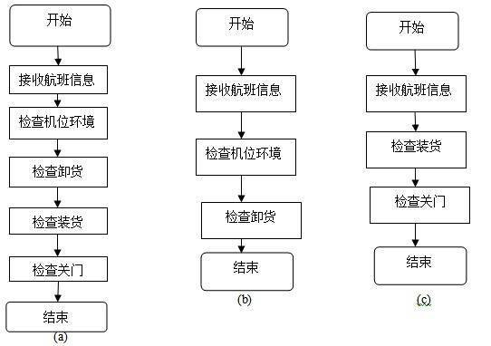
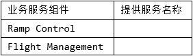

### 问题1

服务建模是对Ramp Coordination信息系统进行集成的首要工作，公司的架构师首先对Ramp Coordination信息系统进行服务建模，识别出系统中的两个主要业务服务组件：
（1）Ramp Control：负责Ramp Coordination信息系统中各种相关业务活动的组件；
（2）Flight Management：负责航班相关信息的管理，包括航班日程、乘客信息等。针对上述服务模型，结合题干描述，请为每个业务服务组件提供的服务进行分析与整理，完成表1-1中的空白部分。

**参考答案**

（1）检查机位环境、检查卸货、检查装货、检查关门
（2）接收航班信息

**答案解析**

对Ramp Coordination信息系统进行服务建模的起点，是把可复用、可编排的业务能力抽象为“服务”，并与后端异构系统的资源解耦。题干明确：Ramp Coordinator要协调的业务活动包含检查机位环境、卸货、装货等；结合图示三类典型航班流程（中转、到达过夜、离港首班），我们可进一步识别在放行前的关门检查也是常见的关键节点。因此，在“以服务为中心”的SOA方法下，把这些与地面保障现场直接耦合的可操作性步骤，统一归入 Ramp Control 业务服务组件最为合理。它们的共同特征是：面向运行现场、与航班在站位的一次保障周期强相关、对外呈现为可编排的原子或复合服务（如“检查卸货”可能细分为货舱门状态检测、ULD核对、卸载清单校验等）。将这些能力打包为Ramp Control的服务，可以被前端工作流或规则引擎按不同航班类型灵活编排，满足“流程差异大”的诉求。
与此相对，Flight Management 的职责是航班信息管理：题干指出系统需“从乘务人员管理系统提取乘务员信息、从订票系统提取乘客信息、从机务系统提取机务信息、接收航班调度系统的到达事件”。这些都属于“航班主数据与运行态数据的汇聚、维护与发布”。因此在服务边界上，Flight Management对外暴露的最核心能力应是接收与管理航班信息（包括日程、乘客、事件与关联系统人员信息），为Ramp Control等下游流程提供“事实源”。这类服务偏向信息型（Information Services），强调一致性、时效性与订阅/推送（例如，航班到达事件被接收后触发Ramp流程实例的启动或变更）。
拓展来说，这种划分具备三点好处：第一，高内聚低耦合——现场操作类能力与信息管理类能力边界清晰；第二，可编排性——Ramp Control的原子服务可以被BPMN/规则驱动按航班类型动态组合，契合“流程差异大”的业务现实；第三，可演进性——当后端异构来源或接入方式变化时，只需在Flight Management侧适配，不影响Ramp Control的服务契约。

**浓缩知识点**：SOA 与企业应用集成 （1）检查机位环境、检查卸货、检查装货、检查关门 （2）接收航班信息 对Ramp Coordination信息系统进行服务建模的起点，是把可复用、可编排的业务能力抽象为“服务”，并与后端异构系统的资源解耦。题干明确：Ramp Coordinator要协调的业务活动包含检查机位环境、卸货、装货等；结合图示三类典型航班流程（中转、到达过夜、离港首班），我们可进一步识别在放行前的关门检查也是常见的关键节点。因此，在“以服务为中心”的SOA方法下，把这些与地面保障现场直接耦合的可操作性步骤，统一归入 Ramp Control 业务服务组件最为合理。它们的共同特征是：面向运行现场

---

### 问题2

对Ramp Coordination信息系统的集成涉及对乘务人员管理系统、航班调度系统、机务人员管理系统和订票系统的组织与协调，公司架构师决定采用企业服务总线（Enterprise Service Bus，ESB）技术进行系统集成，请用200字以内的文字对ESB的定义进行描述，给出ESB的五个主要功能，并针对题干描述，将恰当的内容填入图1-2中的（1）~（6）。

**参考答案**

ESB是传统中间件技术与XML、Web服务等技术结合的产物，主要支持异构系统集成。ESB基于内容的路由和过滤，具备复杂数据的传输能力，并可以提供一系列的标准接口。ESB的主要功能：
（1）服务位置透明性；（2）传输协议转换；（3）消息格式转换；（4）消息路由；
（5）消息增强；（6）安全性；（7）监控与管理。

**答案解析**

在本案例中，企业需要把分散在大型主机、Unix、Linux/Java Web等平台上的多个关键系统——乘务人员管理、航班调度、机务人员管理、订票系统——与新的Ramp Coordination信息系统进行统一编排与协同。典型挑战是异构、差异与演进：平台不同（Mainframe/Unix/Linux）、语言不同（COBOL/Unix C/Java）、接口风格不同（文件、消息、API、Web界面背后服务），以及事件驱动（航班到达/离港）与数据拉取（人员/乘客清单）并存。为同时达成松耦合互联、服务化封装、可路由可监控，采用ESB是业界成熟做法。
为什么是ESB？
首先，ESB通过服务注册/发现屏蔽“调用者—提供者”的位置耦合，实现服务位置透明；当航班调度系统从主机迁移或扩容时，Ramp侧既有流程无须改代码，只需更新注册信息。
其次，ESB内置协议桥接（如JMS/HTTP/SOAP/REST/MQ/File/主机接入适配器），解决“主机事务网关—消息中间件—HTTP API”之间的互通。
第三，消息格式转换与数据映射能力，解决主机EBCDIC报文、机务系统专有格式与Java Web系统XML/JSON之间的语义对齐；配合基于内容的智能路由与过滤，能按航班类型、机场规则、航站运行态等把消息投递到相应的Ramp Control服务编排。
第四，消息增强在生产环境极其关键：可统一施加**安全（鉴权、签名、加解密）、可靠性（重试、补偿、幂等）、事务边界、审计日志、追踪ID（Correlation ID）**等横切关注点，避免把非功能逻辑散落在各业务系统中。第五，监控与管理（可观测性）让运维能从总线上实时观察服务可用性、吞吐与延迟，进行告警与容量规划，支撑“灵活、高效”的业务目标。
图1-2的填写思路：外部四个分支节点分别代表四套源系统/应用（乘务、航调、机务、订票），每个节点的内层标注其提供的关键信息（乘务人员信息、航班到达事件、机务人员信息、乘客信息），中心为ESB；另一个分支为Ramp Coordination信息系统，它既是消费者（订阅航班到达事件、拉取乘客/人员清单），也是提供者（向下游或门户暴露“协调进度/状态”等服务）。这样的布局突出了“系统在外、服务在中（ESB）、流程在内（Ramp）”的集成拓扑：上游系统变化不影响Ramp流程，只需在ESB层完成适配；Ramp侧可依据航班类型在BPM/规则引擎中快速编排调用Ramp Control与Flight Management等服务，满足“针对不同需求迅速开展业务流程”的诉求。

**浓缩知识点**：SOA 与企业应用集成 ESB是传统中间件技术与XML、Web服务等技术结合的产物，主要支持异构系统集成。ESB基于内容的路由和过滤，具备复杂数据的传输能力，并可以提供一系列的标准接口。ESB的主要功能： （1）服务位置透明性；（2）传输协议转换；（3）消息格式转换；（4）消息路由； 在本案例中，企业需要把分散在大型主机、Unix、Linux/Java Web等平台上的多个关键系统——乘务人员管理、航班调度、机务人员管理、订票系统——与新的Ramp Coordination信息系统进行统一编排与协同。典型挑战是异构、差异与演进：平台不同（Mainframe/Unix/Linux）、语言不同（C

---

## 32. 2016年11月第1题（SOA 与企业应用集成）

- 题号：0020160501001
- 题目标签：SOA 与企业应用集成
- 难度：简单
- 频率：高频
- 浓缩知识点：SOA 与企业应用集成；重点围绕题干场景、架构决策与质量属性进行分析。

### 题目说明

阅读以下关于软件架构设计的叙述，在答题纸上回答问题1至问题3 。
【说明】
某软件公司为某品牌手机厂商开发一套手机应用程序集成开发环境，以提高开发手机应用程序的质量和效率。在项目之初，公司的系统分析师对该集成开发环境的需求进行了调研和分析，具体描述如下：
a.需要同时支持该厂商自行定义的应用编程语言的编辑、界面可视化设计、编译、调试等模块，这些模块产生的模型或数据格式差异较大，集成环境应提供数据集成能力。集成开发环境还要支持以适配方式集成公司现有的应用模拟器工具。
b.经过调研，手机应用开发人员更倾向于使用Windows系统，因此集成开发环境的界面需要与Windows平台上的主流开发工具的界面风格保持一致。
c.支持相关开发数据在云端存储，需要保证在云端存储数据的机密性和完整性。
d.支持用户通过配置界面依据自己的喜好修改界面风格，包括颜色、布局、代码高亮方式等，配置完成后无需重启环境。
e.支持不同模型的自动转换。在初始需求中定义的机器性能条件下，对于一个包含50个对象的设计模型，将其转换为相应代码框架时所消耗时间不超过5秒。
f.能够连续运行的时间不小于240小时，意外退出后能够在10秒之内自动重启。
g.集成开发环境具有模块化结构，支持以模块为单位进行调试、测试与发布。
h.支持应用开发过程中的代码调试功能：开发人员可以设置断点，启动调试，编辑器可以自动卷屏并命中断点，能通过变量监视器查看当前变量取值。
在对需求进行分析后，公司的架构师小张查阅了相关的资料，认为该集成开发环境应该采用管道-过滤器（Pipe-Filter）的架构风格，公司的资深架构师王工在仔细分析后，认为应该采用数据仓储（Data Repository）的架构风格。公司经过评审，最终采用了王工的方案。

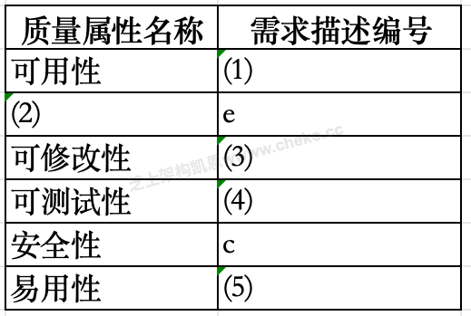

### 问题1

识别软件架构质量属性是进行架构设计的重要步骤。请分析题干中的需求描述，填写表1-1中（1）～（5）处的空白。

**参考答案**

（1）f （2）性能 （3）d （4）g （5）b

**答案解析**

在软件架构设计中，识别质量属性是将需求转化为架构决策的重要环节。通过分析题干需求，可以发现不同需求对应不同的质量属性。
需求 f：要求系统连续运行时间 ≥240 小时，且异常退出后能在 10 秒内恢复。这显然属于 可用性 的要求，因此表中（1）应填 f。可用性主要衡量系统在规定条件下维持运行和快速恢复的能力。
需求 e：要求模型转换 50 个对象时不超过 5 秒，体现了系统处理任务的效率，即 性能。因此（2）填性能。性能是衡量系统响应时间、处理速度的重要指标。
需求 d：强调界面风格可修改且无需重启，说明系统需要具备良好的 可修改性。因此（3）填 d。可修改性保障用户在不破坏系统整体稳定性的前提下自由调整界面配置。
需求 g：系统具备模块化结构，支持单独调试、测试与发布，明显属于 可测试性。因此（4）填 g。可测试性关注系统能否被验证和定位问题。
需求 b：界面需要与主流工具风格一致，属于提升用户操作便利性的 易用性。因此（5）填 b。易用性直接影响用户的学习成本和开发效率。
而像 需求 a 和 c，一个涉及功能实现（数据集成与工具适配），另一个涉及 安全性（数据的机密性与完整性），并未出现在本表对应的考查点中，因此不在本题答案范围。
综上，正确填法为：
（1）f → 可用性
（2）性能 → 响应时间限制
（3）d → 可修改性
（4）g → 可测试性
（5）b → 易用性

**浓缩知识点**：SOA 与企业应用集成 （1）f （2）性能 （3）d （4）g （5）b 在软件架构设计中，识别质量属性是将需求转化为架构决策的重要环节。通过分析题干需求，可以发现不同需求对应不同的质量属性。 需求 f：要求系统连续运行时间 ≥240 小时，且异常退出后能在 10 秒内恢复。这显然属于 可用性 的要求，因此表中（1）应填 f。可用性主要衡量系统在规定条件下维持运行和快速恢复的能力。

---

### 问题2

请在阅读题干需求描述的基础上，从交互方式、数据结构、控制结构和扩展方法4个方面对两种架构风格进行比较，填写表1-2中（1）～（4）处的空白。

**参考答案**

（1）星型（工具之间通过中心结点进行交互）（2）数据流（或流式数据）
（3）数据驱动（4）模型适配（与数据仓储进行数据适配）

**答案解析**

架构风格的选择决定了系统运行时的交互方式、数据存储组织、控制逻辑以及未来的可扩展性。
交互方式（1）：数据仓储风格中，所有模块通过一个中心数据仓库（或黑板系统）进行交互，这种模式类似 星型结构，即中心仓库是“星心”，其他工具是“星角”，通过仓库共享数据。相比之下，管道-过滤器风格是线性或链式交互，数据在模块之间依次流动。
数据结构（2）：管道-过滤器风格的本质是数据流（流式数据），每个过滤器对输入流进行处理并输出新的数据流。而仓库风格则依赖一个持久化的共享数据存储（如数据库、语法树等），各模块围绕该中心数据展开操作。
控制结构（3）：仓库风格通常采用 数据驱动 控制，即当仓库数据发生变化时，触发相应模块执行。与之相对，管道-过滤器是 数据流驱动，即控制由输入流推动。
扩展方法（4）：在仓库风格下，新增功能通常需要围绕数据模型进行 模型适配，以保证与中央仓库的数据一致性。而在管道-过滤器中，扩展通常通过新增过滤器模块，并将其插入数据流管道中完成。
综合来看，仓库风格更适合题干描述的 IDE 项目，因为其需求核心是 不同工具和数据的集成共享，而非简单的数据流处理。

**浓缩知识点**：SOA 与企业应用集成 （1）星型（工具之间通过中心结点进行交互）（2）数据流（或流式数据） （3）数据驱动（4）模型适配（与数据仓储进行数据适配） 架构风格的选择决定了系统运行时的交互方式、数据存储组织、控制逻辑以及未来的可扩展性。 交互方式（1）：数据仓储风格中，所有模块通过一个中心数据仓库（或黑板系统）进行交互，这种模式类似 星型结构，即中心仓库是“星心”，其他工具是“星角”，通过仓库共享数据。相比之下，管道-过滤器风格是线性或链式交互，数据在模块之间依次流动。

---

### 问题3

在确定采用数据仓库架构风格后，王工给出了集成开发环境的架构图。请填写图1-1中（1）～（4）处的空白，完成该集成开发环境的架构图。

**参考答案**

（1）模型/数据库/语法结构树（2）编辑器（3）适配器（4）应用模拟器工具

**答案解析**

数据仓储风格的核心在于 中央数据存储 和 围绕数据进行操作的功能模块。结合题干需求，可以逐一对应：
（1）模型/数据库/语法结构树：仓库的中心必须是数据实体。在 IDE 场景中，最合理的中心数据是 语法结构树（AST）或类似的模型/数据库，因为编译、调试、可视化设计等都基于语法树或统一的中间模型进行处理。
（2）编辑器：编辑器是 IDE 的核心模块之一，负责源代码输入、语法高亮和界面操作，必须直接与仓库交互，以保证用户修改的代码能即时反映到仓库数据中。
（3）适配器：题干中明确提到需要通过适配方式集成公司现有的模拟器工具，因此在仓库结构中必须增加一个 适配器 作为桥梁。
（4）应用模拟器工具：通过适配器对接的现有工具就是 模拟器，它可以运行编译后的程序，支持调试和测试。
因此，架构图应围绕“数据仓库 + 模块”的模式进行，仓库位于中央，其他功能（如编辑器、编译器、适配器等）分布在周围，通过仓库交互。

**浓缩知识点**：SOA 与企业应用集成 （1）模型/数据库/语法结构树（2）编辑器（3）适配器（4）应用模拟器工具 数据仓储风格的核心在于 中央数据存储 和 围绕数据进行操作的功能模块。结合题干需求，可以逐一对应： （1）模型/数据库/语法结构树：仓库的中心必须是数据实体。在 IDE 场景中，最合理的中心数据是 语法结构树（AST）或类似的模型/数据库，因为编译、调试、可视化设计等都基于语法树或统一的中间模型进行处理。

---

## 33. 2018年11月第5题（SOA 与企业应用集成）

- 题号：0020180501005
- 题目标签：SOA 与企业应用集成
- 难度：简单
- 频率：高频
- 浓缩知识点：SOA 与企业应用集成；重点围绕题干场景、架构决策与质量属性进行分析。

### 题目说明

阅读以下关于Web系统设计的叙述，在答题纸上回答问题1至问题3。
【说明】
某银行拟将以分行为主体的银行信息系统，全面整合为由总行统一管理维护的银行信息系统，实现统一的用户账户管理、转账汇款、自助缴费、理财投资、贷款管理、网上支付、财务报表分析等业务功能。但是，由于原有以分行为主体的银行信息系统中，多个业务系统采用异构平台、数据库和中间件，使用的报文交换标准和通信协议也不尽相同，使用传统的EAI解决方案根本无法实现新的业务模式下异构系统间灵活的交互和集成。因此，为了以最小的系统改进整合现有的基于不同技术实现的银行业务系统，该银行拟采用基于ESB的面向服务架构（SOA）集成方案实现业务整合。

### 问题1

请分别用200字以内的文字说明什么是面向服务架构（SOA）以及ESB在SOA中的作用与特点。

**参考答案**

面向服务架构（SOA）是一种软件架构设计理念，将应用程序的功能模块抽象为可重用的服务，通过服务之间的松耦合和相互通信来实现系统的灵活性、可扩展性和互操作性。SOA强调服务的独立性、标准化接口和服务的组合，使得系统更易于维护、扩展和集成。
企业服务总线（ESB）是SOA架构中的关键组件，用于实现不同服务之间的通信、消息路由、转换和协调。ESB提供了统一的消息传递机制和中介服务，可以实现服务之间的解耦和集成，同时具备消息传递、安全性、事务管理等功能。其特点包括灵活性、可扩展性、异步通信、消息路由和转换、安全性和监控等，为构建复杂的分布式系统提供了支持。ESB在SOA中扮演着关键的角色，促进了服务之间的互联和协作，提高了系统的可靠性和可维护性。

**答案解析**

SOA 的本质在于将企业内部各类异构系统统一抽象为“服务”，通过标准化接口（如 WSDL、REST API）和消息交互（如 XML、JSON）进行组合调用，从而避免过去点对点集成的复杂依赖。
SOA 的优势在于提高系统的可重用性与扩展性：例如，银行“用户认证”“账户查询”“支付处理”都可以独立封装为服务，在不同业务场景下复用或编排。对银行而言，这意味着不同分行的异构系统不必全部重写，而是通过服务封装与组合实现统一化管理。
ESB 在 SOA 中的角色是“胶水”与“高速公路”。传统 EAI 往往依赖定制适配器实现点对点连接，扩展困难。而 ESB 提供了统一的总线式通信模式，具备协议转换、数据格式转换、路由、异步队列、事务管理与安全控制等功能，避免了各系统间的直接依赖。例如，分行 A 使用 SOAP，分行 B 使用 JMS，通过 ESB 可统一转化为 XML 消息并传递到核心系统。这样，银行能在保持原有异构系统的同时，实现集中管理与灵活扩展，满足业务快速迭代需求。

**浓缩知识点**：SOA 与企业应用集成 面向服务架构（SOA）是一种软件架构设计理念，将应用程序的功能模块抽象为可重用的服务，通过服务之间的松耦合和相互通信来实现系统的灵活性、可扩展性和互操作性。SOA强调服务的独立性、标准化接口和服务的组合，使得系统更易于维护、扩展和集成。 企业服务总线（ESB）是SOA架构中的关键组件，用于实现不同服务之间的通信、消息路由、转换和协调。ESB提供了统一的消息传递机制和中介服务，可以实现服务之间的解耦和集成，同时具备消息传递、安全性、事务管理等功能。其特点包括灵活性、可扩展性、异步通信、消息路由和转换、安全性和监控等，为构建复杂的分布式系统提供了支持。ESB在SOA中扮演着

---

### 问题2

基于该信息系统整合的实际需求，项目组完成了基于SOA的银行信息系统架构设计方案。该系统架构图如图5-1所示：
请从（a）~ （j）中选择相应内容填入图5-1的（1）~ （6），补充完善架构设计图。
（a）数据层
（b）界面层
（c）业务层
（d）bind
（e）企业服务总线ESB
（f） XML
（g）安全验证和质量管理
（h）publish
（i）UDDI
（j）组件层
（k）BPEL

**参考答案**

（1）（c）业务层 （2）（i）UDDI （3）（h）publish
（4）（e）企业服务总线ESB （5）（g）安全验证和质量管理 （6）（j）组件层

**答案解析**

该架构图体现了 SOA 的分层设计。最上层通常是界面层，其下是业务层（1），用于封装银行的核心业务逻辑，如账户管理、支付、理财等。
业务层服务通过 UDDI（2） 注册与发现机制提供查询能力，结合 publish（3） 操作实现服务发布。底层的服务交互通过 ESB（4） 实现消息传递与中介功能，是整个 SOA 的枢纽，屏蔽不同系统的协议差异。ESB 周围附加 安全验证与质量管理（5），确保服务调用符合安全与 SLA 要求。最底层则是 组件层（6），对应银行原有的系统或第三方模块，如支付网关、核心账务、报表分析模块等。
通过这样的设计，银行可以把原本分散在各分行的异构系统统一在一个面向服务的平台下。用户请求从界面层进入，经业务层调用服务，再通过 ESB 转发到不同组件。这样既实现了业务解耦与灵活编排，又为后续扩展提供了清晰的架构支撑。尤其在跨分行业务场景下，ESB 提供的统一通信与安全管控能显著降低集成复杂度，并避免传统 EAI 的“接口爆炸”。

**浓缩知识点**：SOA 与企业应用集成 （1）（c）业务层 （2）（i）UDDI （3）（h）publish （4）（e）企业服务总线ESB （5）（g）安全验证和质量管理 （6）（j）组件层 该架构图体现了 SOA 的分层设计。最上层通常是界面层，其下是业务层（1），用于封装银行的核心业务逻辑，如账户管理、支付、理财等。 业务层服务通过 UDDI（2） 注册与发现机制提供查询能力，结合 publish（3） 操作实现服务发布。底层的服务交互通过 ESB（4） 实现消息传递与中介功能，是整个 SOA 的枢纽，屏蔽不同系统的协议差异。ESB 周围附加 安全验证与质量管理（5），确保服务调用符合安全与 SLA 要

---

### 问题3

针对银行信息系统的数据交互安全性需求，列举3种可实现信息系统安全保障的措施。

**参考答案**

采用 HTTPS 协议或传输加密，确保数据机密性。
使用 信息摘要/数字签名，保证数据完整性。
部署 防火墙/入侵检测/网络扫描，提升系统防御能力。

**答案解析**

银行信息系统对安全性要求极高，尤其在数据交互层面必须保证机密性、完整性、可用性。
常见措施包括：①通信加密：通过 HTTPS、SSL/TLS 或专用加密通道，防止交易数据在传输过程中被窃取或篡改；②完整性校验：利用信息摘要（MD5、SHA-256）和数字签名机制，确保交易指令和报文在传输中未被篡改，且来源可信；③访问控制与边界防护：部署防火墙、入侵检测/防御系统，结合网络扫描与漏洞修复，防止黑客攻击和非法访问。
除此之外，还可结合数据库审计、双因素认证、行为监测等措施，构建纵深防御体系。对银行而言，采用这些多层安全手段，才能确保在 ESB 架构下的分布式服务交互环境中，业务数据不被泄露或破坏。

**浓缩知识点**：SOA 与企业应用集成 采用 HTTPS 协议或传输加密，确保数据机密性。 使用 信息摘要/数字签名，保证数据完整性。 银行信息系统对安全性要求极高，尤其在数据交互层面必须保证机密性、完整性、可用性。 常见措施包括：①通信加密：通过 HTTPS、SSL/TLS 或专用加密通道，防止交易数据在传输过程中被窃取或篡改；②完整性校验：利用信息摘要（MD5、SHA-256）和数字签名机制，确保交易指令和报文在传输中未被篡改，且来源可信；③访问控制与边界防护：部署防火墙、入侵检测/防御系统，结合网络扫描与漏洞修复，防止黑客攻击和非法访问。

---
