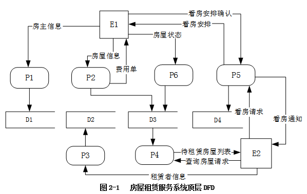
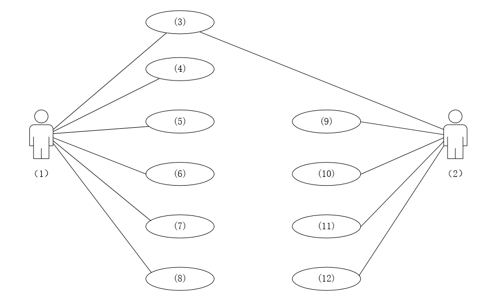
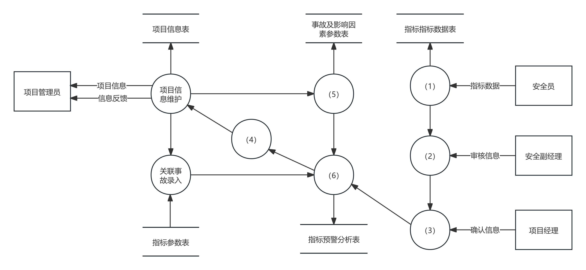
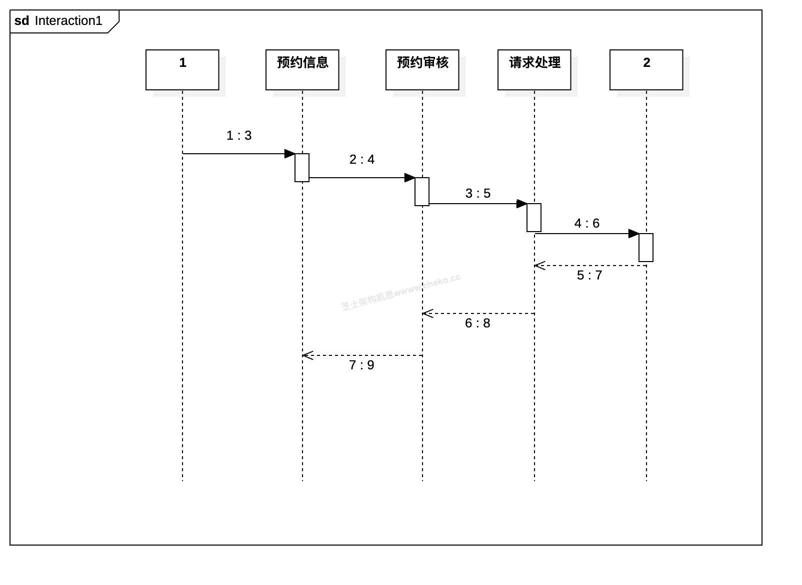
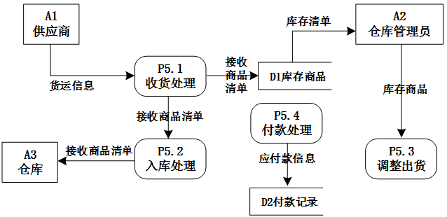
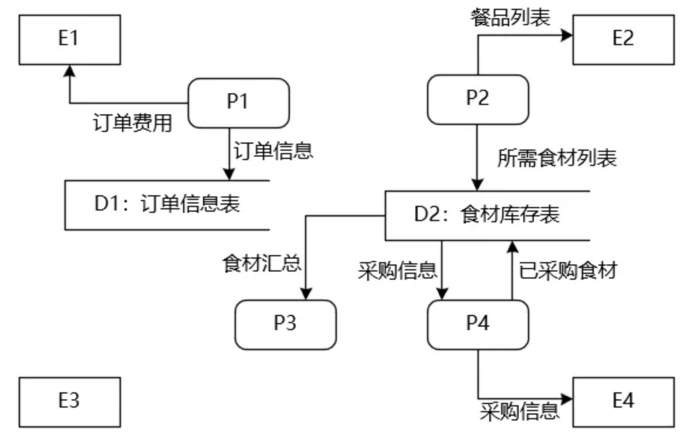

# 案例题_系统设计与建模

- 对应软考高级系统架构设计师章节：软件工程基础知识、系统架构设计基础知识、未来信息综合技术、信息系统架构设计理论与实践

- 大题数量：10
- 小问数量：31

---

> **知识点分组：类图与实体建模**

## 1. 2016年11月第2题（类图与实体建模）

- 题号：0020160501002
- 题目标签：类图与实体建模
- 难度：简单
- 频率：高频
- 浓缩知识点：类图与实体建模；重点围绕题干场景、架构决策与质量属性进行分析。

### 题目说明

阅读以下关于软件系统建模的叙述，在答题纸上回答问题1至问题3。
【说明】
某软件公司计划开发一套教学管理系统，用于为高校提供教学管理服务。该教学管理系统基本的需求包括：
（1）系统用户必须成功登录到系统后才能使用系统的各项功能服务；
（2）管理员（Registrar）使用该系统管理学校（University）、系（Department）、教师（Lecturer）、学生（Student）和课程（Course）等教学基础信息；
（3）学生使用系统选择并注册课程，必须通过所选课程的考试才能获得学分；如果考试不及格，必须参加补考，通过后才能获得课程学分；
（4）教师使用该系统选择所要教的课程，并从系统获得选择该课程的学生名单；
（5）管理员使用系统生成课程课表，维护系统所需的有关课程、学生和教师的信息；
（6）每个月到了月底系统会通过打印机打印学生的考勤信息。
项目组经过分析和讨论，决定采用面向对象开发技术对系统各项需求建模。

### 问题1

用例建模用来描述待开发系统的功能需求，主要元素是用例和参与者。请根据题目所述需求，说明教学服务系统中有哪些参与者。

**参考答案**

学生、教师、管理员、时间、打印机。

**答案解析**

“参与者”是指系统外部与系统发生交互的实体，可能是用户、设备或其他系统。
本题中，显性参与者为“学生”“教师”“管理员”；隐性参与者为“时间”（定时触发打印考勤）和“打印机”（执行打印操作）。

**浓缩知识点**：类图与实体建模 学生、教师、管理员、时间、打印机。 “参与者”是指系统外部与系统发生交互的实体，可能是用户、设备或其他系统。 本题中，显性参与者为“学生”“教师”“管理员”；隐性参与者为“时间”（定时触发打印考勤）和“打印机”（执行打印操作）。

---

### 问题2

用例是对系统行为的动态描述，用例获取是需求分析阶段的主要任务之一。请指出在面向对象系统建模中，用例之间的关系有哪几种类型？对题目所述教学服务系统的需求建模时， "登录系统"用例与"注册课程"用例之间、"参加考试"用例与"参加补考"用例之间的关系分别属于哪种类型？

**参考答案**

用例之间的关系包括：包含、扩展、泛化。
"登录系统"用例与"注册课程"用例之间的关系为：包含关系。
"参加考试"用例与"参加补考"用例之间的关系为：扩展关系。

**答案解析**

用例之间的关系主要有泛化（Generalization）、包含（Include）和扩展（Extend）。
（1）当可以从两个或多个用例中提取公共行为时，可以使用包含关系来表示。
（2）如果一个用例混合了两种或两种以上不同场景，即根据情况可能发生多种分支，则可以将这个用例分为一个基本用例和一个或多个扩展用例。
（3）当多个用例共同拥有一个类似的结构和行为的时候，可以将它们的共性抽象成父用例，其他的用例作为泛化关系中的子用例。
在本题中，“注册课程”用例在执行前必须登录系统，因此“登录系统”是其 必要行为，为包含关系；而“补考”只有在考试不及格的情况下才会触发，不是所有学生都必须补考，因此为扩展关系。

**浓缩知识点**：类图与实体建模 用例之间的关系包括：包含、扩展、泛化。 "登录系统"用例与"注册课程"用例之间的关系为：包含关系。 用例之间的关系主要有泛化（Generalization）、包含（Include）和扩展（Extend）。 （1）当可以从两个或多个用例中提取公共行为时，可以使用包含关系来表示。

---

### 问题3

类图主要用来描述系统的静态结构，是组件图和配置图的基础。请指出在面向对象系统建模中，类之间的关系有哪几种类型？对题目所述教学服务系统的需求建模时，类University与类Student之间、类University和类Department之间、类Student和类Course之间的关系分别属于哪种类型？

**参考答案**

类之间的关系包括：关联、聚合、组合、依赖、泛化、实现（可写可不写，因为实现是接口与类之间的关系，而接口是一种特殊的类）。
类University与类Student之间的关系是聚合关系。
类University与类Department之间的关系是组合关系。类Student与类Course之间的关系是关联关系。

**答案解析**

类University与类Student之间的关系是整体与部分关系。并且我要换成其他业务系统的时候，可以不设计类University，类Student可以单独设计。他们没有紧密关系，也就是我说的具有不同的生存周期，口诀好聚好散，所以是聚合关系。
类University和类Department之间的关系是整体与部分的关系，两者具有相同的生存周期。你不能说设计一个系统，其中有类Department，但是没有有类University，这个说不通。所以它们之间是组合关系。
同理，类Student和类Course我认为也是聚合关系，但是官方是关联关系，这个说不太通。因为关联包含了聚合和组合，粒度太粗了。

**浓缩知识点**：类图与实体建模 类之间的关系包括：关联、聚合、组合、依赖、泛化、实现（可写可不写，因为实现是接口与类之间的关系，而接口是一种特殊的类）。 类University与类Student之间的关系是聚合关系。 类University与类Student之间的关系是整体与部分关系。并且我要换成其他业务系统的时候，可以不设计类University，类Student可以单独设计。他们没有紧密关系，也就是我说的具有不同的生存周期，口诀好聚好散，所以是聚合关系。 类University和类Department之间的关系是整体与部分的关系，两者具有相同的生存周期。你不能说设计一个系统，其中有类Department，

---

## 2. 2018年11月第2题（类图与实体建模）

- 题号：0020180501002
- 题目标签：类图与实体建模
- 难度：简单
- 频率：高频
- 浓缩知识点：类图与实体建模；重点围绕题干场景、架构决策与质量属性进行分析。

### 题目说明

阅读以下关于软件系统建模的叙述，在答题纸上回答问题1至问题3。
【说明】
某公司欲建设一个房屋租赁服务系统，统一管理房主和租赁者的信息，提供快捷的租赁服务。本系统的主要功能描述如下：
登记房主信息。记录房主的姓名、住址、身份证号和联系电话等信息，并写入房主信息文件。
登记房屋信息。记录房屋的地址、房屋类型（如平房、带阳台的楼房、独立式住宅等）、楼层、租金及房屋状态（待租赁、已出租）等信息，并写入房屋信息文件。一名房主可以在系统中登记多套待租赁的房屋。
登记租赁者信息。记录租赁者的个人信息，包括：姓名、性别、住址、身份证号和电话号码等，并写入租赁者信息文件。
安排看房。已经登记在系统中的租赁者，可以从待租赁房屋列表中查询待租赁房屋信息。租赁者可以提出看房请求，系统安排租赁者看房。对于每次看房，系统会生成一条看房记录并将其写入看房记录文件中。
收取手续费。房主登记完房屋后，系统会生成一份费用单，房主根据费用单交纳相应的费用。
变更房屋状态。当租赁者与房主达成租房或退房协议后，房主向系统提交变更房屋状态的请求。系统将根据房主的请求，修改房屋信息文件。

### 问题1

若采用结构化方法对房屋租赁服务系统进行分析，得到如图2-1所示的顶层DFD。使用题干中给出的词语，给出图2-1中外部实体E1~E2、加工P1~P6以及数据存储D1~D4的名称。

**参考答案**

E1：房主 E2：租赁者
P1：登记房主信息 P2：登记房屋信息
P3：登记租赁者信息 P4：查询租赁房屋信息
P5：安排看房 P6：变更房屋状态
D1：房主信息文件 D2：租赁者信息文件
D3：房屋信息文件 D4：看房记录文件

**答案解析**

外部实体可以是和系统交互的人或角色，以及和系统交互的外部系统或服务。根据题目中的描述，与本系统进行交互的角色是房主和租赁者。根据E1和P1之间的数据流 "房主信息"，结合题目描述可知，E1表示的是房主，E2表示的是租赁者。
题目的描述中已经明确给出了系统的6个功能，需要将这些功能与加工P1-P6进行对应，这需要借助于各个加工的输入输出数据流进行分析，根据E1和P1之间的数据流"房主信息"可知，这条数据流符合"登记房主信息"功能的描述，因此可以确定P1是"登记房主信息"，同时可以确定D1是"房主信息文件"。E1和P2之间的数据流"房屋信息""费用单"，这些都与房屋登记相关，因此P2是"登记房屋信息"。同时可以确定，D3对应的是"房屋信息文件"。同理，根据数据流及题干描述，可以推断出：P3对应"登记租赁者信息"、P4对应"查询租赁房屋信息"、P5对应"安排看房"以及P6对应"变更房屋状态"。

**浓缩知识点**：类图与实体建模 E1：房主 E2：租赁者 P1：登记房主信息 P2：登记房屋信息 外部实体可以是和系统交互的人或角色，以及和系统交互的外部系统或服务。根据题目中的描述，与本系统进行交互的角色是房主和租赁者。根据E1和P1之间的数据流 "房主信息"，结合题目描述可知，E1表示的是房主，E2表示的是租赁者。 题目的描述中已经明确给出了系统的6个功能，需要将这些功能与加工P1-P6进行对应，这需要借助于各个加工的输入输出数据流进行分析，根据E1和P1之间的数据流"房主信息"可知，这条数据流符合"登记房主信息"功能的描述，因此可以确定P1是"登记房主信息"，同时可以确定D1是"房主信息文件"。E1和P

---

### 问题2

若采用信息工程（Information Engineering）方法对房屋租赁服务系统进行分析，得到如图2-2所示的ERD。请给出图2-2中实体（1）~ （5）的名称。

**参考答案**

（1）房主 （2）房屋 （3）房屋类型 （4）租赁者 （5）看房安排

**答案解析**

本问题考查信息工程方法中的模型ER图。ER图中包含两个主要元素：实体和联系。实体是现实世界中可以区别于其他对象的"事件"或"物体"，本题要求补充图2-2中的实体。根据题目描述和实体之间的联系可知，（1）和（2）分别对应房主和房屋，两者之间的联系为"房主拥有房屋"。同理可以推断出，（3）~（5）分别是实体"房屋类型" "租赁者"和"看房安排"。
这里比较容易错的是房屋类型有的同学写成房屋信息。他的依据是看到"登记房屋信息。记录房屋的地址、房屋类型（如平房、带阳台的楼房、独立式住宅等）、楼层、租金及房屋状态（待租赁、已出租）等信息，并写入房屋信息文件。"
这里你要看到（3）这个位置要和其他内容是 1 对多的关系，一个房屋信息只能对应一个房屋，所以这里比较合理的显然是房屋类型。
另外最难的是房屋安排。这个几乎做不对。因为题目里没有提到房屋安排和租客看房还有一对多的关系。这个留给大家讨论。

**浓缩知识点**：类图与实体建模 （1）房主 （2）房屋 （3）房屋类型 （4）租赁者 （5）看房安排 本问题考查信息工程方法中的模型ER图。ER图中包含两个主要元素：实体和联系。实体是现实世界中可以区别于其他对象的"事件"或"物体"，本题要求补充图2-2中的实体。根据题目描述和实体之间的联系可知，（1）和（2）分别对应房主和房屋，两者之间的联系为"房主拥有房屋"。同理可以推断出，（3）~（5）分别是实体"房屋类型" "租赁者"和"看房安排"。 这里比较容易错的是房屋类型有的同学写成房屋信息。他的依据是看到"登记房屋信息。记录房屋的地址、房屋类型（如平房、带阳台的楼房、独立式住宅等）、楼层、租金及房屋状态（待租

---

### 问题3

（1）信息工程方法中的"实体（entity）" 与面向对象方法中的"类（class）"之间有哪些不同之处？
（2）在面向对象方法中通常采用用例（Use Case）来捕获系统的功能需求。用例可以按照不同的层次来进行划分，其中的Essential Use Cases和Real Use Cases有哪些区别？
请用100字以内文字解释说明上述两个问题。

**参考答案**

（1）实体用于数据建模，而类用于面向对象建模。实体只有属性，而类有属性和操作。
（2）Essential Use Cases 可翻译为抽象用例，Real Use Cases 可翻译为真实用例。它们是区别在于：Essential Use Cases 用于分析阶段，Real Use Cases 用于设计阶段。Essential Use Cases 描述用例的本质属性，它与如何实现这个用例无关，独立于实现该用例的软硬件技术。Real Use Cases 描述的是用例的实现方式，表达了设计和实现该用例时所采用的方法和技术。

**答案解析**

实体（Entity）是信息工程方法中的核心概念，强调数据存储结构，主要描述属性和关系；而类（Class）是面向对象的核心单元，除属性外，还包含方法，强调封装和行为。两者虽然都用于建模，但出发点不同：前者面向数据，后者面向对象。
用例（Use Case）是面向对象需求分析的重要工具。Essential Use Case（抽象用例）着眼于用户目标和系统职责，不包含 UI 或技术实现，强调“做什么”；Real Use Case（真实用例）则面向设计与实现，描述具体的操作流程、界面、输入输出，强调“怎么做”。两者的关系类似于需求分析与系统设计的分工，前者抽象，后者具体。

**浓缩知识点**：类图与实体建模 （1）实体用于数据建模，而类用于面向对象建模。实体只有属性，而类有属性和操作。 （2）Essential Use Cases 可翻译为抽象用例，Real Use Cases 可翻译为真实用例。它们是区别在于：Essential Use Cases 用于分析阶段，Real Use Cases 用于设计阶段。Essential Use Cases 描述用例的本质属性，它与如何实现这个用例无关，独立于实现该用例的软硬件技术。Real Use Cases 描述的是用例的实现方式，表达了设计和实现该用例时所采用的方法和技术。 实体（Entity）是信息工程方法中的核心概念，强调数据存储结

---

## 3. 2020年11月第2题（类图与实体建模）

- 题号：0020200501002
- 题目标签：类图与实体建模
- 难度：简单
- 频率：高频
- 浓缩知识点：类图与实体建模；重点围绕题干场景、架构决策与质量属性进行分析。

### 题目说明

阅读下列说明，回答问题1至问题3，将解答填入答题纸的对应栏内。
[说明]
某企业委托软件公司开发一-套包裹信息管理系统，以便于对该企业通过快递收发的包裹信息进行统一管理。在系统设计阶段，需要对不同快递信息的包裹单信息进行建模，其中，邮政包裹单如图2-1所示:

### 问题1

请说明关系型数据库开发中，逻辑数据模型设计过程包含哪些任务?该包裹单的逻辑数据模型中应该包含哪些实体?并指出每个关系模式的主键属性。

**参考答案**

逻辑数据模型设计过程包含的任务:（1）确定数据模型（2）将E-R 图转换成为指定的数据模型（3）确定完整性约束和（4）确定用户视图。
包裹单的逻辑数据模型中包含的实体:(1)收件人(主键:电话);(2)寄件人(主键:电话);(3)包裹单(主键:编号)。

**答案解析**

逻辑数据模型设计是数据库开发的核心步骤，主要任务是将需求分析阶段得到的 E-R 模型转化为关系模型。
其过程通常包含：①确定数据模型：选择关系模型作为描述工具；②将 E-R 转换为关系模式：识别实体及其属性，明确主键与外键；③确定完整性约束：如实体完整性（主键唯一非空）、参照完整性（外键依赖）、用户自定义完整性（资费、费用范围约束等）；④确定用户视图：保证不同角色用户能够基于逻辑模型进行数据访问。
在本题所给的邮政包裹单中，至少应抽取三个实体：收件人、寄件人、包裹单。收件人与寄件人分别以电话为主键，因为电话在业务中往往是唯一标识用户的属性；包裹单则以编号为主键，唯一标识每一份快递记录。这种设计保证了实体之间的唯一性和完整性。
在关系模式层面，还应注意实体间的关联，例如包裹单与寄件人、收件人之间存在多对一的联系，可通过外键实现。通过这样的逻辑数据模型，可以支持系统的统一管理和高效查询。

**浓缩知识点**：类图与实体建模 逻辑数据模型设计过程包含的任务:（1）确定数据模型（2）将E-R 图转换成为指定的数据模型（3）确定完整性约束和（4）确定用户视图。 包裹单的逻辑数据模型中包含的实体:(1)收件人(主键:电话);(2)寄件人(主键:电话);(3)包裹单(主键:编号)。 逻辑数据模型设计是数据库开发的核心步骤，主要任务是将需求分析阶段得到的 E-R 模型转化为关系模型。 其过程通常包含：①确定数据模型：选择关系模型作为描述工具；②将 E-R 转换为关系模式：识别实体及其属性，明确主键与外键；③确定完整性约束：如实体完整性（主键唯一非空）、参照完整性（外键依赖）、用户自定义完整性（资费、费用范围约

---

### 问题2

请说明什么是超类实体?结合图中包裹单信息，试设计一种超类实体，给出完整的属性列表。

**参考答案**

超类实体是将多个实体中相同的属性组合起来构造出的新实体。用户(姓名、电话、单位名称、详细地址)

**答案解析**

在数据库设计中，超类实体用于抽取多个实体间的共同属性，以减少冗余并提高一致性。
子类实体则继承超类的公共属性，并在此基础上定义自身的特有属性。
在本题场景下，“收件人”和“寄件人”虽然是两个不同角色，但都包含 姓名、电话、单位名称、详细地址 等共性字段。如果不进行抽象，就会在数据库中形成两份重复的字段定义，既浪费存储，又可能导致数据不一致。
因此，可以抽象出一个名为“用户”的超类实体，统一保存公共信息；寄件人与收件人则作为用户的不同角色，通过额外字段（如角色类型）或关系表加以区分。这样设计能使数据库更简洁，维护成本更低，同时方便后续扩展（如未来增加“中转站联系人”等新的角色，也可复用该超类结构）。

**浓缩知识点**：类图与实体建模 超类实体是将多个实体中相同的属性组合起来构造出的新实体。用户(姓名、电话、单位名称、详细地址) 在数据库设计中，超类实体用于抽取多个实体间的共同属性，以减少冗余并提高一致性。 子类实体则继承超类的公共属性，并在此基础上定义自身的特有属性。

---

### 问题3

请说明什么是派生属性?结合图2-1中包裹单信息说明哪个属性是派生属性。

**参考答案**

派生属性是指某个实体的非主键属性由该实体其他非主键属性决定。包裹单中的总计是由资费、挂号费、保价费、回执费计算得出，所以是派生属性。

**答案解析**

派生属性指不必单独存储，而可通过计算得出的属性。
它的值依赖于同一实体或相关实体的其他属性。例如，在工资管理系统中，“年收入”可以由“月薪×12”计算得出。在本题的包裹单中，“总计”费用显然不是独立输入的，而是由多个字段（资费、挂号费、保价费、回执费）相加计算得出，因此“总计”是典型的派生属性。
在逻辑建模中，对派生属性的处理一般有两种方式：①不存储，仅在需要时由系统计算（保证一致性，节省空间）；②冗余存储，用于提高查询效率，但需维护触发器或存储过程，确保在源字段更新时同步更新派生属性。对于本系统而言，“总计”常用于前端显示和业务核算，因此可采用存储计算并显示，或采用 SQL 视图动态生成。合理识别派生属性，有助于模型既保证数据一致性，又在性能需求与存储代价之间取得平衡。

**浓缩知识点**：类图与实体建模 派生属性是指某个实体的非主键属性由该实体其他非主键属性决定。包裹单中的总计是由资费、挂号费、保价费、回执费计算得出，所以是派生属性。 派生属性指不必单独存储，而可通过计算得出的属性。 它的值依赖于同一实体或相关实体的其他属性。例如，在工资管理系统中，“年收入”可以由“月薪×12”计算得出。在本题的包裹单中，“总计”费用显然不是独立输入的，而是由多个字段（资费、挂号费、保价费、回执费）相加计算得出，因此“总计”是典型的派生属性。

---

## 4. 2021年11月第2题（类图与实体建模）

- 题号：0020210501002
- 题目标签：类图与实体建模
- 难度：简单
- 频率：高频
- 浓缩知识点：类图与实体建模；重点围绕题干场景、架构决策与质量属性进行分析。

### 题目说明

阅读以下关于软件系统设计与建模的叙述，在答题纸上回答问题1至问题3。
【说明】
某医院拟委托软件公司开发一套预约挂号管理系统，以便为患者提供更好的就医体验，为医院提供更加科学的预约管理。本系统的主要功能描述如下：(a)注册登录，(b)信息浏览，(c)账号管理，(d)预约挂号，(e)查询与取消预约，(F)号源管理，(g)报告查询，(h)预约管理，(i)报表管理和(j)信用管理等。

### 问题1

若采用面向对象方法对预约挂号管理系统进行分析，得到如图2-1所示的用例图。请将合适的参与者名称填入图2-1中的(1)和(2)处，使用题干给出的功能描述(a)~(j)，完善用例(3)~(12)的名称，将正确答案填在答题纸上。

**参考答案**

（1）预约人员（患者）
（2）医院管理人员
（3）（a）注册登录
（4）-（8） （b）信息浏览 （c）账号管理 （d）预约挂号（e）查询与取消预约（g）报告查询
（9）-（12） （f）号源管理（h）预约管理（i）报表管理（j）信用管理

**答案解析**

该问考查UML中的用例图填充，首先根据题意可以分析出患者这个参与者。而另一个参与者题目没有明示，然而从号源管理、预约管理等用例来看，定性为"医院管理员"较为合适，医院管理员是一个系统中比较常见的角色，起系统管理职能。然后通过用例的名称来分析判断哪些用例归属于患者哪些归属于医院管理员，按这个逻辑很容易分析出：
患者：（a）注册登录（b）信息浏览 （c）账号管理 （d）预约挂号（e）查询与取消预约（g）报告查询
医院管理员：（a）注册登录（f）号源管理（h）预约管理（i）报表管理（j）信用管理
从而根据图中参与者对应的用例数给参与者和用例定位到具体的空中。

**浓缩知识点**：类图与实体建模 （1）预约人员（患者） （2）医院管理人员 该问考查UML中的用例图填充，首先根据题意可以分析出患者这个参与者。而另一个参与者题目没有明示，然而从号源管理、预约管理等用例来看，定性为"医院管理员"较为合适，医院管理员是一个系统中比较常见的角色，起系统管理职能。然后通过用例的名称来分析判断哪些用例归属于患者哪些归属于医院管理员，按这个逻辑很容易分析出： 患者：（a）注册登录（b）信息浏览 （c）账号管理 （d）预约挂号（e）查询与取消预约（g）报告查询

---

### 问题2

预约人员(患者)登录系统后发起预约挂号请求，进入预约界面。进行预约挂号时使用数据库访问类获取医生的相关信息，在数据库中调用医生列表，并调取医生出诊时段表，将医生出诊时段反馈到预约界面，并显示给预约人员；预约人员选择医生及就诊时间后确认预约，系统反馈预约结果，并向用户显示是否预约成功。
采用面向对象方法对预约挂号过程进行分析，得到如图2-2所示的顺序图，使用题干中给出的描述，完善图2-2中对象(1)，及消息(2)~(4)的名称，将正确答案填在答题纸上，请简要说明在描述对象之间的动态交互关系时，协作图与顺序图存在哪些区别。

**参考答案**

（1）预约人员（患者）
（2）预约挂号请求
（3）显示医生可预约时段
（4）显示预约是否成功
顺序图强调的是对象交互的时间次序。通信图强调的是对象之间的组织结构。

**答案解析**

顺序图的核心是 消息传递的时间先后关系，重点表现从用户发出请求到系统反馈结果的过程。
根据题意，首先由患者发出预约挂号请求 (2)；系统调取医生时段并返回可预约时间 (3)；最终，系统确认预约并反馈结果 (4)。在 UML 中，顺序图用于刻画“什么时候发生什么”，强调交互的时间序列；而协作图（通信图）则更适合表现 对象之间的静态关系和消息连接，即“谁与谁通信”。两者都属于交互图，互为补充。

**浓缩知识点**：类图与实体建模 （1）预约人员（患者） （2）预约挂号请求 顺序图的核心是 消息传递的时间先后关系，重点表现从用户发出请求到系统反馈结果的过程。 根据题意，首先由患者发出预约挂号请求 (2)；系统调取医生时段并返回可预约时间 (3)；最终，系统确认预约并反馈结果 (4)。在 UML 中，顺序图用于刻画“什么时候发生什么”，强调交互的时间序列；而协作图（通信图）则更适合表现 对象之间的静态关系和消息连接，即“谁与谁通信”。两者都属于交互图，互为补充。

---

### 问题3

采用面向对象方法开发软件，通常需要建立对象模型、动态模型和功能模型，请分别介绍这3种模型，并详细说明它们之间的关联关系，针对上述模型，说明哪些模型可用于软件的需求分析？

**参考答案**

对象模型用于描述系统数据结构：动态模型用于描述系统控制结构：功能模型用于描述系统功能。
这3种模型都涉及数据、控制和操作等共同的概念，但侧重点不同，从不同侧面反映了系统的实质性内容，综合起来全面地反映了对目标系统的需求。
功能模型指明了系统应该"做什么"：动态模型明确规定了什么时候做：对象模型则定义了做事情的实体。
对象模型、动态模型和功能模型均可用于软件的需求分析。

**答案解析**

该题考查 OMT 方法的 OOA 三模型。对象模型关注系统的静态结构，帮助识别系统中的核心数据实体及关系；动态模型则描述对象随事件触发而发生的状态变化，强调系统的时间逻辑与控制流；功能模型则面向数据处理过程，反映用户需求对“功能”的直观要求。三者存在紧密关联：对象模型提供系统实体，功能模型定义系统功能，动态模型决定何时触发何种功能。三者结合起来，共同反映系统需求的全貌。由于需求分析既要明确数据、功能，又要体现控制逻辑，因此三者均可在需求分析阶段使用。

**浓缩知识点**：类图与实体建模 对象模型用于描述系统数据结构：动态模型用于描述系统控制结构：功能模型用于描述系统功能。 这3种模型都涉及数据、控制和操作等共同的概念，但侧重点不同，从不同侧面反映了系统的实质性内容，综合起来全面地反映了对目标系统的需求。 该题考查 OMT 方法的 OOA 三模型。对象模型关注系统的静态结构，帮助识别系统中的核心数据实体及关系；动态模型则描述对象随事件触发而发生的状态变化，强调系统的时间逻辑与控制流；功能模型则面向数据处理过程，反映用户需求对“功能”的直观要求。三者存在紧密关联：对象模型提供系统实体，功能模型定义系统功能，动态模型决定何时触发何种功能。三者结合起来，共同反映系统需

---

## 5. 2022年11月第2题（类图与实体建模）

- 题号：0020220501002
- 题目标签：类图与实体建模
- 难度：简单
- 频率：高频
- 浓缩知识点：类图与实体建模；重点围绕题干场景、架构决策与质量属性进行分析。

### 题目说明

阅读以下关于软件系统设计与建模的叙述，在答题纸上回答问题1至问题3。
【说明】
煤炭生产是国民经济发展的主要领域之一，其煤矿的安全非常重要。某能源企业拟开发一套煤矿建设项目安全预警系统，以保护煤矿建设项目从业人员生命安全。本系统的主要功能包括如下(a)～(h)所述。
(a) 项目信息维护
(b) 影响因素录入
(c) 关联事故录入
(d) 安全评价得分
(e) 项目指标预警分析
(f) 项目指标填报
(g) 项目指标审核
(h)项目指标确认

### 问题1

王工根据煤矿建设项目安全预警系统的功能要求，设计完成了系统的数据流图，如图2-1所示。请使用题干中描述的功能(a)～(h)，补充完善空(1)～(6)处的内容，并简要介绍数据流图在分层细化过程中遵循的数据平衡原则。

**参考答案**

（1）f
（2）g
（3）h
（4）d
（5）b
（6）e
细化分层数据平衡原则：（1）子图与父图之间的平衡：父图与子图之间的平衡要求子图边界上的输入/输出数据流必须与其父图对应的输入/输出数据流保持一致。如果父图中某个加工的数据流在子图中对应多条数据流，但这些数据流的数据项总量与父图中的数据流相匹配，则仍然保持平衡。（2）子图内部平衡：子图内部加工的输入和输出需保持平衡。

**答案解析**

从安全员→(1)→项目指标数据表，推断(1)是“项目指标填报”；
从安全副经理→(2)以及填报→审核，推断(2)是“项目指标审核”；
从项目经理→(3)以及审核→确认，推断(3)是“项目指标确认”；
图中(6)与“指标预警分析”相连，应为“项目指标预警分析”；
图中(5)与“事故及影响因素参数表”相连，应为“影响因素录入”；
剩余未出现的功能只有“安全评价得分”，因此(4)应为它。
分层细化数据平衡原则：
父图与子图平衡：子图的输入输出必须与父图对应的数据流保持一致，若拆分为多条数据流，其数据项总和仍需与父图一致。
子图内部平衡：每个加工的输入和输出需成对出现，避免黑洞（只输入无输出）、奇迹（只输出无输入）、灰洞（输入输出不合理匹配）。

**浓缩知识点**：类图与实体建模 （1）f （2）g 从安全员→(1)→项目指标数据表，推断(1)是“项目指标填报”； 从安全副经理→(2)以及填报→审核，推断(2)是“项目指标审核”；

---

### 问题2

请根据【问题1】中数据流图表示的相关信息，补充完善煤矿建设项目安全预警系统总体E-R图（见图2-2）中实体(1)～(6)的具体内容，将正确答案填在答题纸上。

**参考答案**

（1）项目管理员
（2）项目经理
（3）项目指标数据
（4）~（6）指标参数、项目信息、事故及影响因素参数

**答案解析**

由数据流图可知：安全员负责填报，副经理审核，经理确认，因此(2)对应“项目经理”；
审核与确认作用的对象是“项目指标数据”，因此(3)应为该实体；
数据流图中有“项目管理员”，因此(1)为“项目管理员”；
其他三处为系统核心数据表，应分别是“指标参数、项目信息、事故及影响因素参数”，顺序对应(4)～(6)。

**浓缩知识点**：类图与实体建模 （1）项目管理员 （2）项目经理 由数据流图可知：安全员负责填报，副经理审核，经理确认，因此(2)对应“项目经理”； 审核与确认作用的对象是“项目指标数据”，因此(3)应为该实体；

---

### 问题3

在结构化分析和设计过程中，数据流图和数据字典是常用的技术手段，请用200字以内的文字简要说明它们在软件需求分析和设计阶段的作用。

**参考答案**

在软件需求分析阶段: 数据流图主要用于建立软件的需求模型，以图形化方式呈现业务数据的流动和处理过程。数据字典则是关于数据的信息集合，用于对数据流图中每个组成部分加以定义和说明。
在软件设计阶段: 数据流图主要用于经过一系列设计转换后，产生由模块图表示的软件设计模型;详细设计阶段数据流图可进行模块内部的数据流设计。数据字典用于描述系统中各类数据，为数据库概要设计、逻辑设计提供支持。

**答案解析**

在软件工程的结构化分析与设计过程中，数据流图（DFD）和数据字典（DD） 是两个相辅相成的重要工具。
首先，数据流图以图形化方式展示了系统中数据的流动与加工过程，它从功能角度刻画了系统如何接收输入、进行处理并生成输出。相比自然语言描述，数据流图能够清晰揭示业务活动之间的关系，避免需求表述的模糊和歧义。
在需求分析阶段，数据流图的作用主要体现在帮助分析人员与用户进行沟通，建立系统的功能模型，从而明确用户需求，形成一致的功能认知；在设计阶段，数据流图进一步细化为分层模型，既可以作为模块划分的依据，又能用于接口数据的定义，保证后续设计的合理性和可实现性。同时，在分层细化过程中，数据流图还必须遵循数据平衡原则，即父图与子图的输入输出保持一致，每个加工必须有对应的输入和输出，避免出现“黑洞”“奇迹”或“灰洞”等问题，这样才能确保功能模型的正确性和完整性。
其次，数据字典是对数据流图中涉及的所有数据流、数据存储、数据项等进行精确定义的工具，它类似于一份系统数据的“说明书”。在需求分析阶段，数据字典为每个数据元素提供统一的命名、格式和含义，从而消除了不同开发人员和用户之间对数据理解的偏差。在设计阶段，数据字典则作为系统实现的基础，保证数据在不同模块之间传递时的完整性与一致性。同时，它还能支持一致性检查和完整性检查，防止因数据定义不清或使用不当导致系统逻辑错误。

**浓缩知识点**：类图与实体建模 在软件需求分析阶段: 数据流图主要用于建立软件的需求模型，以图形化方式呈现业务数据的流动和处理过程。数据字典则是关于数据的信息集合，用于对数据流图中每个组成部分加以定义和说明。 在软件设计阶段: 数据流图主要用于经过一系列设计转换后，产生由模块图表示的软件设计模型;详细设计阶段数据流图可进行模块内部的数据流设计。数据字典用于描述系统中各类数据，为数据库概要设计、逻辑设计提供支持。 在软件工程的结构化分析与设计过程中，数据流图（DFD）和数据字典（DD） 是两个相辅相成的重要工具。 首先，数据流图以图形化方式展示了系统中数据的流动与加工过程，它从功能角度刻画了系统如何接收输入、进

---

> **知识点分组：区块链架构**

## 6. 2025年5月第5题（区块链架构）

- 题号：0020250501005
- 题目标签：区块链架构
- 难度：困难
- 频率：中频
- 浓缩知识点：区块链架构；重点围绕题干场景、架构决策与质量属性进行分析。

### 问题1

请简要说明区块链技术的六个层次，并简要描述每一层的功能和作用。（12分）

**参考答案**

区块链技术体系可分为以下六个层次，每一层分别承担特定的功能：
数据层 功能：负责区块链中数据的结构定义与存储，如区块结构、链式结构、时间戳、哈希函数、非对称加密和梅克尔树等。作用：确保数据的完整性、不可篡改性和可验证性。
网络层 功能：负责节点间的数据传播与通信，采用P2P网络协议。作用：构建一个去中心化、点对点的传输网络，支持节点发现、数据广播与同步等。
共识层 功能：定义各个节点之间如何就数据达成一致的机制，如PoW（工作量证明）、PoS（权益证明）、PBFT（拜占庭容错）等。作用：保障全网数据一致性，防止双重支付和分叉问题。
激励层 功能：设定经济激励机制，用于奖励参与维护区块链网络运行的节点。作用：吸引节点参与系统运行，并对不良行为起到制约作用。
合约层 功能：支持智能合约的定义与执行，允许用户设定自动执行的逻辑规则。作用：实现业务逻辑自动化执行，提高效率，减少人为干预。
应用层 功能：为用户提供各类应用接口和可视化工具，实现具体的业务功能。作用：承载具体的区块链应用，如农产品溯源、数字资产管理、身份认证等。

**答案解析**

区块链技术体系通常分为六个层次，每一层都有独立又协同的功能。首先是数据层，它负责数据的结构定义与存储，是区块链的“地基”，包括区块、链式结构、时间戳、哈希函数、非对称加密、梅克尔树等技术，确保数据一旦写入就无法被篡改，具有高度可信度。
其次是网络层，这一层让区块链中的所有节点可以像“点对点通信网”一样自由交流。它采用P2P协议，实现数据广播、同步和节点发现，保证所有节点在没有中心服务器的情况下依然能高效协作。
接着是共识层，它定义了各个节点如何就交易达成一致，例如比特币的工作量证明（PoW）、以太坊的权益证明（PoS）、联盟链常用的PBFT等。这一层相当于“仲裁系统”，确保全网账本一致性，避免双重支付等问题。
激励层是吸引和管理参与者的关键，通过代币或交易费机制，奖励诚实节点、惩罚作恶行为。没有激励机制，很难维持一个长久运行的公有链系统。
合约层则是承载业务逻辑的地方，支持智能合约的编写和执行，让“合同自动履行”成为可能，从而提高效率，减少人为干预。它常见于以太坊等平台，推动了DeFi、NFT等生态的发展。
最后是应用层，这一层面向终端用户，提供具体应用接口，比如数字钱包、供应链溯源系统、身份认证平台等。它将复杂的底层技术封装成易用的界面，是用户实际接触和感知区块链的入口。

**浓缩知识点**：区块链架构 区块链技术体系可分为以下六个层次，每一层分别承担特定的功能： 数据层 功能：负责区块链中数据的结构定义与存储，如区块结构、链式结构、时间戳、哈希函数、非对称加密和梅克尔树等。作用：确保数据的完整性、不可篡改性和可验证性。 区块链技术体系通常分为六个层次，每一层都有独立又协同的功能。首先是数据层，它负责数据的结构定义与存储，是区块链的“地基”，包括区块、链式结构、时间戳、哈希函数、非对称加密、梅克尔树等技术，确保数据一旦写入就无法被篡改，具有高度可信度。 其次是网络层，这一层让区块链中的所有节点可以像“点对点通信网”一样自由交流。它采用P2P协议，实现数据广播、同步和节点发现，保证所

---

### 问题2

该系统中涉及三类角色：信息填写人员、核对人员、审核人员。请简要说明三类人员在业务流程中的主要操作步骤与职责差异，字数控制在400字以内。

**参考答案**

在区块链溯源系统中，信息填写人员负责第一步的数据录入工作，主要采集并填写农产品在生产、加工、运输等环节的基础信息，确保数据完整、及时上传。核对人员在其后对录入的信息进行内容核实，包括检查数据是否准确、是否存在遗漏或格式错误，是系统的数据质量保障环节。审核人员作为最终把关者，负责对核对通过的数据进行审批确认，一旦审核通过，信息将被正式写入区块链，不可篡改，确保数据的权威性与可追溯性。三类人员层层把关，构建了一个完整的数据采集与验证闭环。

**答案解析**

在信息系统中，角色的划分不仅影响业务流程的清晰度和效率，也决定了数据质量与系统安全性。本题中出现的三类人员——信息填写人员、核对人员、审核人员，体现了“逐级验证、分层控制”的设计原则，是常见的多角色业务流程建模方式，广泛应用于政务平台、物流追踪、电子票据、农产品溯源等系统中。
首先，信息填写人员处于流程的起点，负责将原始业务数据录入系统，如农产品的品种、产地、采摘时间、运输批次等关键字段。他们面对的是第一手数据，其工作核心在于完整性与时效性，确保信息应填尽填、及时入库，是区块链“上链信息”的来源。
接下来，核对人员承担数据校验的任务，他们不再进行业务采集，而是复查信息填写人员提交的数据是否真实、合理、无误。例如是否存在时间冲突、是否缺项、字段值是否符合规范等。此环节的关键在于准确性与一致性控制，往往需要结合规则库或后台比对系统进行审核。
最后，审核人员作为数据流转前的“终审关口”，通常由有资质的监管角色或系统管理员担任，主要职责是对核对通过的数据做最终确认。一旦审核通过，数据即被写入区块链，变成不可篡改的信息。因此，该角色承担的是权威性与责任确认的任务。

**浓缩知识点**：区块链架构 在区块链溯源系统中，信息填写人员负责第一步的数据录入工作，主要采集并填写农产品在生产、加工、运输等环节的基础信息，确保数据完整、及时上传。核对人员在其后对录入的信息进行内容核实，包括检查数据是否准确、是否存在遗漏或格式错误，是系统的数据质量保障环节。审核人员作为最终把关者，负责对核对通过的数据进行审批确认，一旦审核通过，信息将被正式写入区块链，不可篡改，确保数据的权威性与可追溯性。三类人员层层把关，构建了一个完整的数据采集与验证闭环。 在信息系统中，角色的划分不仅影响业务流程的清晰度和效率，也决定了数据质量与系统安全性。本题中出现的三类人员——信息填写人员、核对人员、审核人员，体现

---

### 问题3

介绍下什么是智能合约，并说明智能合约包含哪三方面

**参考答案**

智能合约是一种运行在区块链上的自动化程序，用于在满足预设条件时自动执行合同条款。它不依赖第三方，具有去中心化、不可篡改和自动执行的特点，广泛应用于数字资产转账、供应链管理等场景。
智能合约主要包含以下三方面内容：1. 参与方身份信息：包括合同各方的地址、公钥等。2. 合约执行规则：明确合同执行的条件、逻辑和触发机制。3. 状态与结果记录：记录合同执行状态、数据变更及最终结果，确保全网可验证与追溯。

**答案解析**

智能合约（Smart Contract）是一种部署在区块链上的自动化协议程序，用于在特定条件被满足时自动执行预设的合约条款。这一概念最早由密码学家尼克·萨博提出，随着以太坊等平台的发展而广泛应用。与传统合同相比，智能合约不依赖中介或人工干预，一旦部署即不可更改，所有执行过程由区块链网络自动完成，确保了安全性与可信度。
智能合约的核心特点包括自动执行、去中心化、不可篡改和全网可验证。具体而言，只要合约设定的触发条件被满足，系统就会立即自动执行相关操作，无需等待或人为操作。同时，合约代码和执行记录对全体参与节点公开，增强了透明性和可追溯性。
为了实现这些功能，一个智能合约通常包含三方面的内容。第一是参与方的身份信息，也就是合同的发起人、接收方等身份标识，通常以区块链地址或公钥表示，用于明确操作权限。第二是合约执行规则，即程序逻辑部分，定义了“在什么条件下，执行什么操作”，这是合约自动运行的基础。第三是状态与结果记录，系统在每次合约执行后会更新状态数据并将结果写入区块链，确保信息无法被篡改且可供验证。

**浓缩知识点**：区块链架构 智能合约是一种运行在区块链上的自动化程序，用于在满足预设条件时自动执行合同条款。它不依赖第三方，具有去中心化、不可篡改和自动执行的特点，广泛应用于数字资产转账、供应链管理等场景。 智能合约主要包含以下三方面内容：1. 参与方身份信息：包括合同各方的地址、公钥等。2. 合约执行规则：明确合同执行的条件、逻辑和触发机制。3. 状态与结果记录：记录合同执行状态、数据变更及最终结果，确保全网可验证与追溯。 智能合约（Smart Contract）是一种部署在区块链上的自动化协议程序，用于在特定条件被满足时自动执行预设的合约条款。这一概念最早由密码学家尼克·萨博提出，随着以太坊等平台的发展而

---

> **知识点分组：顺序图与交互建模**

## 7. 2024年5月第2题（顺序图与交互建模）

- 题号：0020240501002
- 题目标签：顺序图与交互建模
- 难度：中等
- 频率：中频
- 浓缩知识点：顺序图与交互建模；重点围绕题干场景、架构决策与质量属性进行分析。

### 问题1

在序列图存在哪三种消息？

**参考答案**

同步消息（Synchronous Message）
异步消息（Asynchronous Message）
返回消息（Return Message）

**答案解析**

UML 序列图的核心是展示对象之间的交互过程，其中“消息”是最关键的元素。常见的三类消息如下：
同步消息：表示发送者发出请求后必须等待接收者完成处理才能继续执行。这类消息体现了严格的时序依赖，常见于函数调用或 RPC 调用。通常以实线加实心箭头表示。
异步消息：发送者发出消息后无需等待接收者完成即可继续自身的行为。这种消息体现了并行与解耦，适用于事件驱动、消息队列等场景。图中用实线加空心箭头表示。
返回消息：表示接收者处理完毕后返回的结果，通常用虚线箭头表示，体现了操作完成的反馈过程。

**浓缩知识点**：顺序图与交互建模 同步消息（Synchronous Message） 异步消息（Asynchronous Message） UML 序列图的核心是展示对象之间的交互过程，其中“消息”是最关键的元素。常见的三类消息如下： 同步消息：表示发送者发出请求后必须等待接收者完成处理才能继续执行。这类消息体现了严格的时序依赖，常见于函数调用或 RPC 调用。通常以实线加实心箭头表示。

---

### 问题2

请根据这个业务场景，补充序列图中标数字部分。

**参考答案**

访问者
被访者
提交预约内容
提交申请
提交审核
审核处理
返回处理结果
返回审核结果
返回预约结果

**答案解析**

在该预约流程中，交互主体包括访问者、系统、预约审核模块和被访者等对象。结合业务场景，序列图中的数字应填充如下：
1 表示访问者，其通过微信公众号发起操作；
2 表示被访者，系统在审核通过后将预约信息推送给其处理；
3~5 描述访问者提交预约内容，系统将申请转发到审核模块；
6 表示审核模块对预约请求进行审批；
7~9 表示审核结果与最终预约信息返回给访问者及相关方。

**浓缩知识点**：顺序图与交互建模 访问者 被访者 在该预约流程中，交互主体包括访问者、系统、预约审核模块和被访者等对象。结合业务场景，序列图中的数字应填充如下： 1 表示访问者，其通过微信公众号发起操作；

---

### 问题3

系统分析设计过程中两种交互图的选取原则。

**参考答案**

在系统分析设计过程中，我们常用两种交互图来描述系统的动态行为：序列图（顺序图）和通信图（或者说协作图）。
当你需要清晰地展示消息的时间顺序，以及对象之间交互的时序关系时，选择序列图。序列图强调的是时间顺序，它像电影胶片一样，按时间顺序展示了每个对象发送和接收消息的时刻。适用于描述复杂交互流程，特别是涉及多个对象之间消息传递顺序至关重要的场景，例如异步操作、并发行为等。
当你需要清晰地展示对象之间的静态关系，以及它们之间如何通过消息进行协作时，选择通信图。通信图强调的是对象之间的连接关系，它像地图一样，展示了对象之间的链接路径以及消息如何在这些路径上传递。适用于描述系统结构，以及对象之间协作关系，特别是需要清晰地展现对象之间静态连接关系的场景。

**答案解析**

UML 提供了两种常用的交互图：序列图与通信图。
序列图注重时间维度的交互过程，强调“先后顺序”。当我们需要描述业务流程的动态行为，特别是涉及多个对象之间复杂的消息传递、异步调用或并发操作时，序列图非常直观。例如访客预约系统中，提交、审核、通知的流程顺序至关重要，因此选用序列图建模。
通信图则突出对象之间的静态结构关系，强调“谁与谁交互”。当需要从系统结构的角度出发，展示对象间的连接关系和消息路由时，通信图更适合。它类似一张对象协作关系图，适合在系统结构设计阶段使用。

**浓缩知识点**：顺序图与交互建模 在系统分析设计过程中，我们常用两种交互图来描述系统的动态行为：序列图（顺序图）和通信图（或者说协作图）。 当你需要清晰地展示消息的时间顺序，以及对象之间交互的时序关系时，选择序列图。序列图强调的是时间顺序，它像电影胶片一样，按时间顺序展示了每个对象发送和接收消息的时刻。适用于描述复杂交互流程，特别是涉及多个对象之间消息传递顺序至关重要的场景，例如异步操作、并发行为等。 UML 提供了两种常用的交互图：序列图与通信图。 序列图注重时间维度的交互过程，强调“先后顺序”。当我们需要描述业务流程的动态行为，特别是涉及多个对象之间复杂的消息传递、异步调用或并发操作时，序列图非常直观。例

---

### 问题4

UML序列图中表示条件分支的片段包括哪些？

**参考答案**

UML序列图中表示条件分支的片段包括：
alt（Alternative）：表示“如果-否则”条件分支（if-else）
opt（Optional）：表示可选执行（if）
loop（Loop）：表示循环执行（如for、while）
break：表示中断流程的执行（类似break语句）
par（Parallel）：表示并发分支执行
region（Critical）：表示临界区，即互斥执行块

**答案解析**

UML 序列图提供了多种片段（Combined Fragments）来表示复杂的控制逻辑，其中与条件分支或流程控制相关的主要有：
alt：用于表示互斥选择，类似 if-else 语句。例如在预约审核时，若审核通过则继续推送消息，否则结束流程。
opt：表示某一操作是可选的，类似 if 条件。例如系统是否通知门禁管理人员可以用 opt 表达。
loop：用于表示循环操作，如系统批量处理多个预约申请。
break：表示跳出当前片段，中断执行流程。
par：表示多个分支可以并行执行。
region：表示临界区，保证片段中的操作互斥执行。

**浓缩知识点**：顺序图与交互建模 UML序列图中表示条件分支的片段包括： alt（Alternative）：表示“如果-否则”条件分支（if-else） UML 序列图提供了多种片段（Combined Fragments）来表示复杂的控制逻辑，其中与条件分支或流程控制相关的主要有： alt：用于表示互斥选择，类似 if-else 语句。例如在预约审核时，若审核通过则继续推送消息，否则结束流程。

---

> **知识点分组：业务流程与活动建模**

## 8. 2014年11月第2题（业务流程与活动建模）

- 题号：0020140501002
- 题目标签：业务流程与活动建模
- 难度：简单
- 频率：中频
- 浓缩知识点：业务流程与活动建模；重点围绕题干场景、架构决策与质量属性进行分析。

### 问题1

请用300以内文字说明数据流图（Data Flow Diagram）的基本元素及其作用。

**参考答案**

数据流：数据流是数据在系统内传播的路径，因此由一组成分固定的数据组成。
外部实体：代表系统之外的实体，可以是人、物或其他软件系统。
加工（处理）：加工是对数据进行处理的单元，它接收一定的数据输入，对其进行处理，并产生输出。
数据存储：表示信息的静态存储，可以是文件、文件的一部分、数据库的元素等。

**答案解析**

数据流图（DFD）是结构化分析方法中用于表达逻辑数据运动与处理的核心模型，强调“做什么而非怎么做”。其基本元素与画法遵循一套统一约束，以保证图面的可读性、一致性和可验证性。首先，外部实体承担环境角色，是系统边界的锚点：例如“供应商”“银行支付网关”“仓库管理员”等。它们不会在系统内部实现任何处理逻辑，仅通过数据流与系统交互，从而明确系统的输入输出边界。其次，加工（Process）体现系统行为，是把输入数据转化为输出结果的功能节点。加工必须既有输入又有输出，否则就会出现黑洞或奇迹等语义错误。加工的命名宜采用“动宾短语”（如“生成应付账款”“核对到货清单”），以突出处理动作和对象。第三，数据存储表示静态数据的安置之所，强调数据的持久化存在。它不能直接与外部实体或其他数据存储相连，必须经过某个加工来读写，这是 DFD 的重要语法约束之一。第四，数据流用带箭头的线段表示，明确数据从哪里来、到哪里去、包含哪些关键数据项（可在流名中体现，如“到货清单”“对账结果”），并且一条流的起点与终点必须是加工、数据存储或外部实体之一，不能指向自己，也不能悬空。
从建模价值看，DFD 的四要素共同完成了从业务观察到系统逻辑的抽象：外部实体规定了系统边界与交互角色；数据流承载业务语义的传递；加工定义了价值创造与数据变换；数据存储保证信息可追溯与可复用。配合分层分解（Level-0、Level-1…）与平衡原则（Balancing），可将复杂业务在不同粒度层面清晰展开；同时，通过命名一致性与接口对齐，为后续的数据字典、实体关系、用例与流程协同提供依据。把握这些元素及其约束，有助于在库存管理场景中准确刻画“收货、入库、对账、付款、更新库存、调整出货信息”等活动的逻辑数据通道，避免实现阶段因理解偏差产生的返工。

**浓缩知识点**：业务流程与活动建模 数据流：数据流是数据在系统内传播的路径，因此由一组成分固定的数据组成。 外部实体：代表系统之外的实体，可以是人、物或其他软件系统。 数据流图（DFD）是结构化分析方法中用于表达逻辑数据运动与处理的核心模型，强调“做什么而非怎么做”。其基本元素与画法遵循一套统一约束，以保证图面的可读性、一致性和可验证性。首先，外部实体承担环境角色，是系统边界的锚点：例如“供应商”“银行支付网关”“仓库管理员”等。它们不会在系统内部实现任何处理逻辑，仅通过数据流与系统交互，从而明确系统的输入输出边界。其次，加工（Process）体现系统行为，是把输入数据转化为输出结果的功能节点。加工必须既有输

---

### 问题2

数据流图在绘制过程中可能出现多种语法错误，请分析图2-1所示数据流图中哪些地方有错误，并分别说明错误的类型。

**参考答案**

1、加工P5.3仅有输入流，缺少输出流，这属于黑洞。
2、加工P5.4仅有输出流，缺少输入流，这属于奇迹。
3、D1到A2：缺少处理数据流的加工。
4、D2：数据存储没有输出的数据流。

**答案解析**

数据流图的常见错误分为逻辑错误与语法错误两大类。逻辑错误主要指加工节点输入输出不平衡：
①黑洞——加工只有输入无输出，好比数据“被吞掉”；
②奇迹——加工无输入却能输出数据，仿佛“凭空变出”；
③灰洞——输入与输出在语义或数量级上不相称（如“输入一个订单号，输出整套综合统计报表”），违反了合理的因果与守恒。
语法错误聚焦于连线/对象的法定组合关系，例如数据存储与外部实体、数据存储与数据存储之间禁止直连，必须经由加工读写；不允许悬空数据流；同一层级图的父子平衡也必须成立，即上层输入/输出在下层应能追溯到具体加工与数据存储的组合。
回到图2-1：
P5.3 只有输入无输出，典型黑洞。这往往意味着该处理缺少对外可观察的结果（如状态更新、回执、日志入库等），会导致数据“无处安放”。
P5.4 只有输出无输入，是奇迹，说明缺少必要的触发或来源（例如应有的“应付账款信息”“对账结果”等输入）。
D1→A2 直接连线违反了数据存储不可直接与外部实体相连的规则，正确做法应当是：由某个加工从 D1 读取或写入，再与 A2 交互（如“生成对账单并发送给供应商”）。
D2 没有输出数据流，体现为数据只“写入不被读取”或“仅被动堆积”。就业务而言，库存管理场景应当存在从 D2（库存/商品数据） 输出到“入库处理、出货调整、对账/对外查询”的流，如果缺失，说明数据使用闭环不完整。

**浓缩知识点**：业务流程与活动建模 1、加工P5.3仅有输入流，缺少输出流，这属于黑洞。 2、加工P5.4仅有输出流，缺少输入流，这属于奇迹。 数据流图的常见错误分为逻辑错误与语法错误两大类。逻辑错误主要指加工节点输入输出不平衡： ①黑洞——加工只有输入无输出，好比数据“被吞掉”；

---

### 问题3

系统建模过程中为了保证数据模型和过程模型的一致性，需要通过数据-过程-CRUD矩阵来实现数据模型和过程模型的同步，请在表2-1所示CRUD矩阵（1）～（5）中填入相关操作。

**参考答案**

（1）R
（2）R
（3）CRU
（4）RU
（5）CRUD

**答案解析**

数据–过程–CRUD 矩阵用于把“过程模型（DFD 的加工/活动）”与“数据模型（实体/数据存储）”逐格映射，确保读写关系全覆盖、无越权、无遗漏。其中：C（Create） 创建新记录，R（Read） 读取，U（Update） 更新，D（Delete） 删除。构建矩阵的关键是基于业务语义逐一判断每个加工对每个数据存储的操作类型，并与DFD中的数据流方向、名称、含义保持一致，形成一致性与可追溯性证据链。
结合题干场景逐格解释：
（1）R：如“收货处理/核对到货清单”需要读取“供应商信息”之类的主数据以比对收货项，属于 Read。
（2）R：付款处理需要读取供应商档案、历史付款记录或应付策略等主数据，确定付款方式与合并策略，故为 Read。
（3）CRU：对库存商品而言，收货完成后会对“已有商品”更新库存数量（U），而新采购商品会创建新商品记录（C）；同时在质检或上架确认后可能再次更新（U） 状态/库位等，因此为 CRU。
（4）RU：调整出货时，系统需要 读取（R）库存商品 来确认当前库存数量；同时，出货操作可能导致库存商品的数量 更新（U）。但是出货过程并不会新建库存，也不会删除库存。所以（4）是 RU。
（5）CRUD：付款处理和付款记录的关系最为复杂：C（Create）：生成新的应付账款时，需要创建付款记录。 R（Read）：合并付款、对账或查询历史账款时，需要读取付款记录。 U（Update）：付款完成后，要更新付款状态（未付款 → 已付款），金额可能也要调整。 D（Delete）：部分场景下，付款完成后旧的应付账款记录可能被清除或归档（逻辑删除）。这个有争议，就是付款记录是否有必要删除。

**浓缩知识点**：业务流程与活动建模 （1）R （2）R 数据–过程–CRUD 矩阵用于把“过程模型（DFD 的加工/活动）”与“数据模型（实体/数据存储）”逐格映射，确保读写关系全覆盖、无越权、无遗漏。其中：C（Create） 创建新记录，R（Read） 读取，U（Update） 更新，D（Delete） 删除。构建矩阵的关键是基于业务语义逐一判断每个加工对每个数据存储的操作类型，并与DFD中的数据流方向、名称、含义保持一致，形成一致性与可追溯性证据链。 结合题干场景逐格解释：

---

## 9. 2019年11月第2题（业务流程与活动建模）

- 题号：0020191101002
- 题目标签：业务流程与活动建模
- 难度：简单
- 频率：中频
- 浓缩知识点：业务流程与活动建模；重点围绕题干场景、架构决策与质量属性进行分析。

### 题目说明

阅读下列说明，回答问题1至问题3 ，将解答填入答题纸的对应栏内。
【说明】
某软件企业为快餐店开发一套在线订餐管理系统，主要功能包括：
（1）在线订餐：已注册客户通过网络在线选择快餐店所提供的餐品种类和数量后提交订单，系统显示订单费用供客户确认，客户确认后支付订单所列各项费用。
（2）厨房备餐：厨房接收到客户已付款订单后按照订单餐品列表选择各类食材进行餐品加工。
（3）食材采购：当快餐店某类食材低于特定数量时自动向供应商发起采购信息，包括食材类型和数量。供应商接收到采购信息后按照要求将食材送至快餐店并提交已采购的食材信息。系统自动更新食材库存 。
（4）生成报表：每个周末和月末，快餐店经理会自动收到系统生成的统计报表，报表中详细列出了本周或本月订单的统计信息以及库存食材的统计信息。现采用数据流图对上述订餐管理系统进行分析与设计，系统未完成的0层数据流图。如图2-1 所示。

### 问题1

（8分）根据订餐管理系统功能说明，请在图2-1所示数据流图中给出外部实体E1~E4和加工P1~ P4的具体名称。

**参考答案**

E1：客户
E2：厨房
E3：经理
E4：供应商
P1：在线订餐
P2：厨房备餐
P3：生成报表
P4：食材采购

**答案解析**

判定外部实体与处理过程的关键，是紧扣题干对业务边界与职责的描述，并遵循数据流图（DFD）关于实体（External Entity）、加工/处理（Process）、数据存储（Data Store）、**数据流（Data Flow）**的语义。
题干中的四类对外参与者明确为：客户（发起下单与支付、接收订单确认）、厨房（依据已付款订单进行备餐）、供应商（按系统自动发起的需求补货并上报采购明细）、经理（按周末/月末接收系统统计报表）。这四者都位于系统边界之外，承担输入或接收输出的角色，因此应标注为 E1～E4。四个核心业务活动恰对应四个加工（P）：在线订餐（订单创建、费用计算与确认支付）、厨房备餐（根据订单清单组织生产）、食材采购（库存阈值触发、发送采购信息、供应商回填与库存更新）、生成报表（定时汇总订单与库存信息并通知经理）。
总体来看就是，客户提交“餐品订单”→系统确认费用与支付→“已付款订单”触发厨房备餐；库存监测触发“采购信息”→供应商送货并反馈“已采购食材信息”→系统更新库存；到期定时任务触发“生成报表”→经理接收“统计报表”。
这些触发和输出与四个加工的职责一一对应，不存在跨层代办或职责重叠，符合单一职责与层次清晰的 DFD 规范。此外，注意不要把仓储/库存、订单库等数据持久化对象误标为外部实体，它们是系统内部的数据存储（D），通常在 0 层 DFD 中以 D1、D2 等表示。综上，E/P 的命名与归属与题干描述严格吻合，既能支撑后续数据流补全，又能保证 0 层图的语义一致性与可读性。

**浓缩知识点**：业务流程与活动建模 E1：客户 E2：厨房 判定外部实体与处理过程的关键，是紧扣题干对业务边界与职责的描述，并遵循数据流图（DFD）关于实体（External Entity）、加工/处理（Process）、数据存储（Data Store）、**数据流（Data Flow）**的语义。 题干中的四类对外参与者明确为：客户（发起下单与支付、接收订单确认）、厨房（依据已付款订单进行备餐）、供应商（按系统自动发起的需求补货并上报采购明细）、经理（按周末/月末接收系统统计报表）。这四者都位于系统边界之外，承担输入或接收输出的角色，因此应标注为 E1～E4。四个核心业务活动恰对应四个加工（P）：在线订餐（

---

### 问题2

（8 分）根据数据流图规范和订餐管理系统功能说明，请说明在图2-1中需要补充哪些数据流可以构造出完整的0层数据流图。

**参考答案**

（1）增加E1到P1数据流"餐品订单"；
（2）增加P1到P2数据流"餐品订单"；
（3）增加D1到P3数据流"订单汇总"；
（4）增加P3到E3数据流"统计报表"。

**答案解析**

补流的逻辑依据主要有三点：(A) 黑洞/灰洞/无输入错误检查，(B) 平衡性（Balancing），(C) 业务时序与触发机制。
第一，自检“无输入/无输出”。若某处理只有输出无输入（或反之），就是黑洞/白洞错误。题干提示 P1“在线订餐”只有输出（例如生成订单确认或已付款订单），但未见客户输入数据，违反“加工必须由输入驱动”的规则，因此需要补充 E1→P1 的“餐品订单”数据流，以表达“客户选择餐品并提交订单”的初始输入。同理，P2“厨房备餐”应由已付款订单触发。如果 0 层不细分支付环节，可将“已付款订单”抽象为“餐品订单”（含“已支付”状态）从 P1→P2 直接传递，体现事件驱动的实时性与可追溯性，这也优于“P2 主动去 D1 检索”的轮询式触发。
第二，校验 P3“生成报表”的输入与输出平衡。根据题干，报表至少包含订单统计与库存统计两部分。0 层可将订单侧的输入抽象为 D1→P3 的“订单汇总”，库存侧若已在图中体现为另一数据存储（如 D2 库存），还应并行输入“库存汇总”；若题面仅要求最小必要补流，至少需要“订单汇总”。另一方面，P3 不能是“黑洞”，应有输出流指向经理（E3），即 P3→E3 的“统计报表”。
第三，事件驱动优于轮询驱动。为何不是 D1→P2 而是 P1→P2？如果用 D1→P2 表达“厨房从数据库主动拉单”，则备餐触发依赖人工/定时轮询，实时性与业务一致性较弱；P1→P2 则在订单确认后即时推送，满足“支付即出单”的餐饮场景，更贴近真实业务。此处体现 DFD 设计中对触发条件与时效性的把握：尽量让上游加工的确定性输出成为下游加工的直接输入，减少不必要的数据库轮询。

**浓缩知识点**：业务流程与活动建模 （1）增加E1到P1数据流"餐品订单"； （2）增加P1到P2数据流"餐品订单"； 补流的逻辑依据主要有三点：(A) 黑洞/灰洞/无输入错误检查，(B) 平衡性（Balancing），(C) 业务时序与触发机制。 第一，自检“无输入/无输出”。若某处理只有输出无输入（或反之），就是黑洞/白洞错误。题干提示 P1“在线订餐”只有输出（例如生成订单确认或已付款订单），但未见客户输入数据，违反“加工必须由输入驱动”的规则，因此需要补充 E1→P1 的“餐品订单”数据流，以表达“客户选择餐品并提交订单”的初始输入。同理，P2“厨房备餐”应由已付款订单触发。如果 0 层不细分支付环节

---

### 问题3

根据数据流图的含义，请说明数据流图和系统流程图之间有哪些方面的区别。

**参考答案**

（1）数据流图中的处理过程可并行；系统流程图在某个时间点只能处于一个处理过程。
（2）数据流图展现系统的数据流；系统流程图展现系统的控制流。
（3）数据流图展现全局的处理过程，过程之间遵循不同的计时标准；系统流程图中处理过程遵循一致的计时标准。

**答案解析**

数据流图（DFD）与系统流程图（Flowchart）都是结构化分析/设计阶段的常用图法，但二者的关注点与抽象层次不同。
其一，在并行性与执行观念上不同。 DFD 描述的是系统在逻辑层的“数据如何在系统内外与各处理之间流动”以及“被何种加工转换”，不等价于单线程的执行轨迹；不同处理可以由不同事件/定时/条件触发，天然支持并行/并发表达（例如“在线订餐”与“食材采购”的事件驱动可并行发生）。而系统流程图更多是沿着一条控制流路径，自上而下刻画“此刻先做什么，再做什么”，默认单条控制线推进，强调时序步骤与分支/循环。
其二，在描述对象上不同。 DFD 的核心元素是外部实体、加工、数据存储、数据流，突出数据的产生、汇聚、分发与落库，回答“数据从哪里来、到哪里去、被怎样变换”。系统流程图的元素是处理框、判断框、连接/流程线等，突出控制条件与执行路径，回答“在什么条件下走哪条路、下一步是什么”。因此，DFD 更适合需求分析阶段的逻辑建模与跨域数据依赖阐明；流程图更适合设计/实现阶段的过程控制与算法/业务步骤表达。
其三，在“计时标准/触发节拍”的表达上不同。 DFD 中的各处理可由异步事件、定时任务、外部输入等多源触发，不要求整体服从统一时钟；同一 0 层图内，不同加工可有不同的采样周期、批处理窗口或实时推送机制。而流程图常假定同一条控制流在统一“执行时序”下推进（尽管可含子流程/并发分支，但在表达上仍以控制先后为主）。
在本题场景中，用 DFD 搭建 0 层图能够清晰地把“客户下单”“厨房备餐”“供应商补货”“经理收报表”等数据关系与系统边界讲明白；若需要描述“下单后如何进行支付校验、失败重试、超时回滚”等控制细节，再用系统流程图或活动图/时序图表达，会更贴切开发实现需要。

**浓缩知识点**：业务流程与活动建模 （1）数据流图中的处理过程可并行；系统流程图在某个时间点只能处于一个处理过程。 （2）数据流图展现系统的数据流；系统流程图展现系统的控制流。 数据流图（DFD）与系统流程图（Flowchart）都是结构化分析/设计阶段的常用图法，但二者的关注点与抽象层次不同。 其一，在并行性与执行观念上不同。 DFD 描述的是系统在逻辑层的“数据如何在系统内外与各处理之间流动”以及“被何种加工转换”，不等价于单线程的执行轨迹；不同处理可以由不同事件/定时/条件触发，天然支持并行/并发表达（例如“在线订餐”与“食材采购”的事件驱动可并行发生）。而系统流程图更多是沿着一条控制流路径，自上而下刻

---

> **知识点分组：UML 行为建模**

## 10. 2015年11月第2题（UML 行为建模）

- 题号：0020150501002
- 题目标签：UML 行为建模
- 难度：简单
- 频率：中频
- 浓缩知识点：UML 行为建模；重点围绕题干场景、架构决策与质量属性进行分析。

### 题目说明

阅读以下关于系统设计建模的说明，在答题纸上回答问题1至问题3。
【说明】
某公司拟研制一款高空监视无人直升机，该无人机采用遥控一自主复合型控制实现垂直升降。该直升机飞行控制系统由机上部分和地面部分组成，机上部分主要包括无线电传输设备、飞控计算机、导航设备等，地面部分包括遥控操纵设备、无线电传输设备以及地面综合控制计算机等。其主要工作原理是地面综合控制计算机负责发送相应指令，飞控计算机按照预定程序实现相应功能。经过需求分析，对该无人直升机控制系统纵向控制基本功能整理如下：
（a）飞控计算机加电后，应完成系统初始化，飞机进入准备起飞状态；
（b）在准备起飞状态中等待地面综合控制计算机发送起飞指令，飞控计算机接收到起飞指令后，进入垂直起飞状态；
（c）垂直起飞过程中如果飞控计算机发现飞机飞行异常，飞行控制系统应转入无线电遥控飞行状态，地面综合控制计算机发送遥控指令；
（d）垂直起飞达到预定起飞高度后，飞机应进入高度保持状态；
（e）飞控计算机在收到地面综合控制计算机发送的目标高度后，飞机应进入垂直升降状态，接近目标高度；垂直升降过程中出现飞机飞行异常，控制系统应转入无线电遥控飞行；
（f）飞机到达目标高度后，应进入高度保持状态，完成相应的任务；
（g）飞机在接到地面综合控制计算机发送的任务执行结束指令后，进入飞机降落状态；
（h）飞机降落过程中如果出现飞机飞行异常，控制系统应转入无线电遥控飞行；
（i）飞机降落到指定着陆高度后，进入飞机着陆状态，应按照预定着陆算法，进行着陆；
（j）无线电遥控飞行中，地面综合控制计算机发送着陆指令，飞机进入着陆状态，应按照预定着陆算法，进行着陆。

### 问题1

状态图和活动图是软件系统设计建模中常用的两种手段，请用200字以内文字简要说明状态图和活动图的含义及其区别。

**参考答案**

状态图主要用于描述一个对象在其生存期间的动态行为，表现一个对象所经历的状态序列，引起状态转移的事件（event），以及因状态转移而伴随的动作（action）。
活动图可以用于描述系统的工作流程和并发行为。活动图其实可看作状态图的特殊形式，活动图中一个活动结束后将立即进入下一个活动（在状态图中状态的转移可能需要事件的触发）。
两者最大的区别是：状态图侧重于描述行为的结果，而活动图侧重描述行为的动作。其次活动图可描述并发行为，而状态图不能。

**答案解析**

状态图（State Machine Diagram）关注的是某一特定对象（如“纵向控制子系统”或“飞控计算机中的高度保持控制器”）在整个生命周期内可能处于的离散状态及其之间的事件驱动转移，并在转移上标注守卫条件与动作（entry/do/exit/action）。其价值在于：当系统受到外部事件（如“收到起飞指令”）或内部事件（如“到达预定高度”）时，如何从当前稳定状态跃迁到下一稳定状态并执行相应动作（如“解锁油门、升力闭环接管”）。因此，状态图特别适合**协议、设备控制器、模式管理（如自主/遥控/告警）**等“状态主导”的对象建模。关键要点：离散状态、事件驱动、转移动作、守卫条件。
活动图（Activity Diagram）则强调流程视角：从起点到终点的活动/动作流转，天然支持分叉与合并、并发与同步、泳道（责任主体）等结构，对于业务过程、用例执行轨迹、算法步骤的表达更直观。在活动图中，控制流/对象流决定执行先后，一个活动完成通常立即流向下一个活动，无需外部事件触发；同时可通过决策/合并/分叉/汇合结点表现条件分支与并发。因此，活动图更适合描述流程驱动的问题，例如“地面下发目标高度→飞控进入垂直升降→接近目标后转入高度保持→等待任务结束”。
本质差异在于：状态图=对象的结果性状态+事件触发的转移；活动图=动作序列+流程控制+并发。在无人机案例中，若要呈现模式切换（例如从“垂直起飞”到“高度保持”或“异常→R/C”），状态图更契合；若要呈现GCC与FCC的工作分工、指令下发与响应流程，泳道活动图更直观。

**浓缩知识点**：UML 行为建模 状态图主要用于描述一个对象在其生存期间的动态行为，表现一个对象所经历的状态序列，引起状态转移的事件（event），以及因状态转移而伴随的动作（action）。 活动图可以用于描述系统的工作流程和并发行为。活动图其实可看作状态图的特殊形式，活动图中一个活动结束后将立即进入下一个活动（在状态图中状态的转移可能需要事件的触发）。 状态图（State Machine Diagram）关注的是某一特定对象（如“纵向控制子系统”或“飞控计算机中的高度保持控制器”）在整个生命周期内可能处于的离散状态及其之间的事件驱动转移，并在转移上标注守卫条件与动作（entry/do/exit/actio

---

### 问题2

根据题干中描述的基本功能需求，架构师王工通过对需求的分析和总结给出了无人直升机控制系统纵向控制状态图（图2-1）。请根据题干描述，提炼出相应状态及条件，并完善图2-1所示状态图中的（1）～（5），将答案填写在答题纸中。

**参考答案**

（1）垂直起飞状态
（2）飞机飞行异常
（3）高度保持状态
（4）垂直升降状态
（5）无线遥控飞行状态

**答案解析**

本题要求依据（a）～（j）将纵向控制状态机补齐。梳理如下：
由（b）可知：准备起飞在收到起飞指令事件后进入垂直起飞，故（1）应为垂直起飞状态。此处是典型的命令触发转移，表示模式从地面准备切换至由FCC控制的起飞闭环。
关于（2），从（c）（e）（h）知：垂直起飞/垂直升降/降落中若发现飞机飞行异常（如传感器失真、姿态越界、功率不足），系统统一转入R/C，体现故障—安全模式的异常分支条件。因此（2）应为飞机飞行异常（或同义“飞行异常”）。将其抽象为统一守卫条件可减少图中重复，突出了“安全优先”的设计理念。
由（d）可知：垂直起飞达到预定起飞高度（条件满足）后，进入高度保持，因此（3）为高度保持状态。这是目标达成触发的模式稳定化，便于后续任务装订。
由（e）可知：在高度保持期间，一旦收到目标高度指令，应进入垂直升降逼近目标；因此（4）为垂直升降状态。这体现了命令驱动—数值目标—连续控制的链路。
对于（5），从（c）（e）（h）（j）串联可见：无论在哪个飞行阶段，一旦出现飞行异常，或在R/C中收到着陆指令，都汇聚到一个统一的人在回路的遥控模式。该模式下GCC直接下发控制量或终止命令，属于安全冗余。故（5）必须是无线电遥控飞行状态。
综上，（1）～（5）与题干陈述形成完备的模式拓扑：准备起飞→（起飞指令）→垂直起飞→（达预定高度）→高度保持→（下发目标高度）→垂直升降→（到达目标）→高度保持→（任务结束）→降落→（达着陆高度）→着陆；其间任一主流程状态在异常时均可断点转入R/C，并在R/C下可由着陆指令收束到着陆。

**浓缩知识点**：UML 行为建模 （1）垂直起飞状态 （2）飞机飞行异常 本题要求依据（a）～（j）将纵向控制状态机补齐。梳理如下： 由（b）可知：准备起飞在收到起飞指令事件后进入垂直起飞，故（1）应为垂直起飞状态。此处是典型的命令触发转移，表示模式从地面准备切换至由FCC控制的起飞闭环。

---

### 问题3

根据题目中描述的基本功能需求，架构师王工给出了无人直升机控制系统纵向控制的顶层活动图（图2-2）。请根据题干描述，完善图2-2活动图的（1）-（9），将答案填写在答题纸中

**参考答案**

（1）地面综合控制计算机
（2）下传起飞就绪信息
（3）垂直起飞
（4）高度保持
（5）发送目标高度
（6）垂直升降
（7）发送任务结束指令
（8）飞机降落
（9）无线电遥控飞行

**答案解析**

顶层泳道活动图旨在刻画控制流程与责任主体。根据题干，主体至少包含GCC（地面综合控制计算机）与FCC/飞机两个泳道：前者负责指令生成与下发，后者负责飞行控制执行与状态反馈。据此：
（1）应为地面综合控制计算机。在泳道图中，泳道=责任边界，用以划分谁发起或完成某个活动。
起始阶段（a）与（b）说明：FCC初始化完成并进入准备起飞，随后等待GCC的起飞指令。在流程上，常见的前置为地面完成联检/就绪确认，因此（2）填下传起飞就绪信息合理：它既可表示链路连通与状态同步，也为后续起飞指令提供业务前提。
飞机在收到起飞指令后执行（3）垂直起飞，到达预定起飞高度转入（4）高度保持，与（d）一致。
随后GCC会下发数值目标，即（5）发送目标高度；FCC据此进入（6）垂直升降逼近目标，与（e）吻合。
到达目标高度后再度高度保持并执行任务；任务完成由GCC触发（7）发送任务结束指令，FCC转入（8）飞机降落阶段，与（g）一致。
贯穿上述任何阶段，一旦检测到飞行异常，流程分叉至（9）无线电遥控飞行；在该泳道中，GCC可直接下发着陆指令（见（j）），流程以着陆收束。

**浓缩知识点**：UML 行为建模 （1）地面综合控制计算机 （2）下传起飞就绪信息 顶层泳道活动图旨在刻画控制流程与责任主体。根据题干，主体至少包含GCC（地面综合控制计算机）与FCC/飞机两个泳道：前者负责指令生成与下发，后者负责飞行控制执行与状态反馈。据此： （1）应为地面综合控制计算机。在泳道图中，泳道=责任边界，用以划分谁发起或完成某个活动。

---
