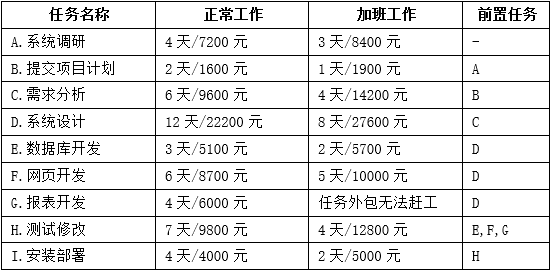
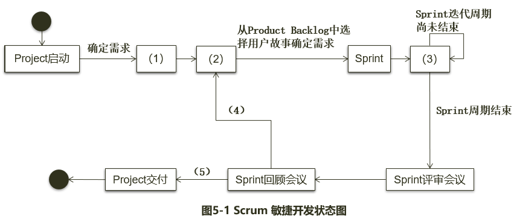

# 案例题_项目管理

- 对应软考高级系统架构设计师章节：信息系统基础知识、软件工程基础知识

- 大题数量：2
- 小问数量：7

---

> **知识点分组：项目进度计划**

## 1. 2013年11月第2题（项目进度计划）

- 题号：0020130501002
- 题目标签：项目进度计划
- 难度：简单
- 频率：中频
- 浓缩知识点：项目进度计划；重点围绕题干场景、架构决策与质量属性进行分析。

### 题目说明

阅读以下关于某项目开发计划的说明，在答题纸上回答问题1至问题4。
【说明】
某软件公司拟开发一套电子商务系统，王工作为项目组负责人负责编制项目计划。由于该企业业务发展需要，CEO急于启动电子商务系统，要求王工尽快准备一份拟开发系统的时间和成本估算报告。
项目组经过讨论后，确定出与项目相关的任务如表2-1所示。其中，根据项目组开发经验，分别给出了正常工作及加班赶工两种情况下所需的时间和费用。

### 问题1

请用400字以内文字说明王工拟编制的项目计划中应包括哪些内容。

**参考答案**

王工在接到任务后，项目计划应包括：一是项目总计划：涵盖范围计划、工作分解与任务定义、任务排序、资源与人员需求、进度安排、费用估算与成本控制等关键内容。二是项目辅助计划：包括质量保障、沟通机制、人力资源配置、风险识别与应对策略、采购流程安排等。

**答案解析**

项目计划主要分为 两大类内容：1. 项目总计划（围绕“做什么、怎么做、何时完成、花多少”）2. 项目辅助计划（围绕“如何确保质量、沟通、风险、人力、采购”）。
一、项目总计划包括
范围计划：明确电子商务系统的目标与交付边界。
工作分解结构（WBS）：将项目拆分为具体任务，如表中A至I各任务。
活动定义与排序：根据前置任务制定合理的任务执行顺序。
资源需求与资源计划：确定每项任务所需人力、技术与资金资源。
费用估算：基于正常/加班模式，测算每条路径的成本。
进度计划与进度压缩分析：计算关键路径，评估赶工方案下的工期最短可能性。
二、项目辅助计划包括
质量计划：确保开发成果符合需求与标准。
沟通计划：确保项目干系人之间信息传达顺畅。
人力资源计划：合理配置与分配开发人员。
风险计划：识别关键任务（如D、H）可能的进度与成本风险。
采购计划：若涉及外包或采购工具，也需纳入计划。

**浓缩知识点**：项目进度计划 王工在接到任务后，项目计划应包括：一是项目总计划：涵盖范围计划、工作分解与任务定义、任务排序、资源与人员需求、进度安排、费用估算与成本控制等关键内容。二是项目辅助计划：包括质量保障、沟通机制、人力资源配置、风险识别与应对策略、采购流程安排等。 项目计划主要分为 两大类内容：1. 项目总计划（围绕“做什么、怎么做、何时完成、花多少”）2. 项目辅助计划（围绕“如何确保质量、沟通、风险、人力、采购”）。 一、项目总计划包括

---

### 问题2

请根据表2-1，分别给出正常工作和最短工期（加班工作）两种情况下完成此项目所需的时间和费用。

**参考答案**

正常工作成本=74200元。正常工作工期=41天。最短工期成本=91000元。最短工期=27天。

**答案解析**

正常工作成本=7200元+1600元+9600元+22200元+5100元+8700元+6000元+9800元+4000元=74200元。正常工作工期=4+2+6+12+6+7+4=41天。
最短工期就是通过加班缩短关键路径，这里其他没有问题，关键是 E 需不不需要加班。凯恩认为不需要，缩短 E 不会改变关键路径，因此最短工期成本=8400元+1900元+14200元+27600元+5100元+10000元+6000元+12800元+5000元=91000元。最短工期=3+1+4+8+5+4+2=27天。

**浓缩知识点**：项目进度计划 正常工作成本=74200元。正常工作工期=41天。最短工期成本=91000元。最短工期=27天。 正常工作成本=7200元+1600元+9600元+22200元+5100元+8700元+6000元+9800元+4000元=74200元。正常工作工期=4+2+6+12+6+7+4=41天。 最短工期就是通过加班缩短关键路径，这里其他没有问题，关键是 E 需不不需要加班。凯恩认为不需要，缩短 E 不会改变关键路径，因此最短工期成本=8400元+1900元+14200元+27600元+5100元+10000元+6000元+12800元+5000元=91000元。最短工期=3+1+4+8

---

### 问题3

如果项目在系统调研阶段用了7天时间才完成，公司要求尽量控制成本，王工可在后续任务中采取什么措施来保证项目能按照正常工作进度完成？

**参考答案**

在"B提交项目计划"和"I安装部署"任务中采用加班工作措施，以使得能够按照正常工作进度完成。

**答案解析**

首先给出下面加班压缩一天的费用，然后用贪心算法选取费用最低的节点尝试来做压缩。压缩的时候一定要优先压缩关键路径上的工作，否则不会缩短工期，这个要注意。
在"B提交项目计划"和"I安装部署"任务中采用加班工作措施，以使得能够按照正常工作进度完成。
然后参照下图，对需要加班的节点做修改

**浓缩知识点**：项目进度计划 在"B提交项目计划"和"I安装部署"任务中采用加班工作措施，以使得能够按照正常工作进度完成。 首先给出下面加班压缩一天的费用，然后用贪心算法选取费用最低的节点尝试来做压缩。压缩的时候一定要优先压缩关键路径上的工作，否则不会缩短工期，这个要注意。 在"B提交项目计划"和"I安装部署"任务中采用加班工作措施，以使得能够按照正常工作进度完成。

---

### 问题4

如果企业CEO想在34天后系统上线，王工应该采取什么措施来满足这一要求？这种情况下完成项目所需的费用是多少？

**参考答案**

标准时长41天的任务，要34天完成，应赶工7天。具体赶工的任务包括：将A、B、H、I四个任务加班完成，这样正好弥补之前延误的7天工期，最终以79700元完成项目。

**答案解析**

这里同样也要参照下表算出加班压缩一天的费用，然后用贪心算法选取费用最低的节点尝试来做压缩。压缩的时候一定要优先压缩关键路径上的工作，否则不会缩短工期，这个要注意。可以看到将A、B、H、I四个任务加班完成，这样正好弥补之前延误的7天工期。

**浓缩知识点**：项目进度计划 标准时长41天的任务，要34天完成，应赶工7天。具体赶工的任务包括：将A、B、H、I四个任务加班完成，这样正好弥补之前延误的7天工期，最终以79700元完成项目。 这里同样也要参照下表算出加班压缩一天的费用，然后用贪心算法选取费用最低的节点尝试来做压缩。压缩的时候一定要优先压缩关键路径上的工作，否则不会缩短工期，这个要注意。可以看到将A、B、H、I四个任务加班完成，这样正好弥补之前延误的7天工期。

---

> **知识点分组：Scrum 与敏捷项目管理**

## 2. 2016年11月第5题（Scrum 与敏捷项目管理）

- 题号：0020160501005
- 题目标签：Scrum 与敏捷项目管理
- 难度：简单
- 频率：中频
- 浓缩知识点：Scrum 与敏捷项目管理；重点围绕题干场景、架构决策与质量属性进行分析。

### 题目说明

阅读以下关于Scrum敏捷开发过程的叙述，在答题纸上回答问题1至问题3。
【说明】
Scrum是一个增量的、迭代的敏捷软件开发过程。某软件公司计划开发一个基于Web的Scrum项目管理系统，用于支持项目团队采用Scrum敏捷开发方法进行软件开发，辅助主管智能决策。此项目管理系统提供的主要服务包括项目团队的管理、敏捷开发过程管理和工件的管理。
Scrum敏捷开发中，项目团队由Scrum主管、产品负责人和开发团队人员三种不同的角色组成，其开发过程由若干个Sprint（短的迭代周期，通常为2到4周）活动组成。
Product Backlog是在Scrum过程初期产生的一个按照商业价值排序的需求列表，该列表条目的体现形式通常为用户故事。在每一个Sprint活动中，项目团队从Product Backlog中挑选最高优先级的用户故事进行开发。被挑选的用户故事在Sprint计划会议上经过细化分解为任务，同时初步估算每一个任务的预计完成时间，编写Sprint Backlog。
在Sprint活动期间，项目团队每天早晨需举行每日站立会议，重新估算剩余任务的预计完成时间，更新Sprint Backlog、Sprint燃尽图和Release燃尽图。在每个Sprint活动结束时，项目团队召开评审会议和回顾会议，交付产品增量，总结Sprint期间的工作情况和问题。此时，如果Product Backlog中还有未完成的用户故事，则项目团队将开始筹备下一个Sprint活动迭代。
为完成Scrum项目管理系统，考虑到系统的智能决策需求，公司决定使用MVC架构模式开发该项目管理系统。具体来说，系统采用轻量级J2EE架构和SSH框架进行开发，使用MySQL数据库作为底层存储。

### 问题1

Scrum项目管理软件需真实模拟Scrum敏捷开发流程，请根据你的理解完成图5-1给出的Scrum敏捷开发状态图，填写其中（1）～（5）的内容。

**参考答案**

（1）制定Product Backlog
（2）Sprint计划会议
（3）每日站立会议
（4）Product Backlog中还有未完成的用户故事
（5）已交付Product Backlog中的所有用户故事

**答案解析**

状态图是 UML（统一建模语言）中用来描述对象动态行为的重要建模工具，它通过“状态”和“事件”来表现一个对象在其生命周期内可能经历的变化。一个对象通常经历多个状态，这些状态通过触发事件相互转换。在软件工程案例题中，状态图经常用于描述业务流程或系统运行流程。
在题目中，Scrum 的敏捷开发过程本身就是一个迭代、循环的过程，因此非常适合用状态图来表现：
（1）制定Product Backlog：这是整个过程的起点，Scrum 项目必须先建立一个用户故事驱动的需求清单（Product Backlog），它决定了后续迭代要完成的内容。
（2）Sprint计划会议：这是 Product Backlog 向实际开发落地的第一步，团队挑选高优先级用户故事并分解为任务，形成 Sprint Backlog。
（3）每日站立会议：这是迭代周期中最关键的日常活动，每天更新任务剩余时间并调整 Sprint Backlog。
（4）Product Backlog中还有未完成的用户故事：这是一个条件事件，如果在某次 Sprint 完成后，仍然存在未完成的需求，系统将继续进入下一个 Sprint 迭代。
（5）已交付Product Backlog中的所有用户故事：这是终止条件事件，意味着系统需求已全部实现，Scrum 项目结束。

**浓缩知识点**：Scrum 与敏捷项目管理 （1）制定Product Backlog （2）Sprint计划会议 状态图是 UML（统一建模语言）中用来描述对象动态行为的重要建模工具，它通过“状态”和“事件”来表现一个对象在其生命周期内可能经历的变化。一个对象通常经历多个状态，这些状态通过触发事件相互转换。在软件工程案例题中，状态图经常用于描述业务流程或系统运行流程。 在题目中，Scrum 的敏捷开发过程本身就是一个迭代、循环的过程，因此非常适合用状态图来表现：

---

### 问题2

根据题干描述，本系统采用MVC架构模式，请从备选答案a~n中分别选出属于MVC架构模型中的模型（Model）、视图(View)和控制器（Controller）的相关内容描述填入表5-1的空（1）～（3）处。
备选答案：

**参考答案**

（1）b、c、d、h、k、l、m、n
（2）a、f
（3）e、j

**答案解析**

MVC（Model-View-Controller）是一种经典的架构模式，用于分离表示逻辑、业务逻辑和数据逻辑。软考经常考察考生对 MVC 三层之间的理解。
Model（模型层）：负责应用的业务逻辑和数据处理，包括实体类、业务对象、数据库交互类等。在题干的选项里，b、c、d、h、k、l、m、n都是数据对象或逻辑处理类，因此属于模型。
View（视图层）：负责数据展示，是用户看到的 UI 部分。一般与图形界面、报表、页面直接相关。a、f带有“界面”或“图”的词汇，显然属于视图层。
Controller（控制器层）：负责接收用户请求，并调用模型与视图完成交互。控制器通常带有动词特征，例如“管理”“处理”“调度”。因此，e、j最符合控制器层的特征。
解题技巧：
视图（View） → 与“图形”“界面”直接相关。
控制器（Controller） → 动作 + 名词，如“会议调度器”“任务处理器”。
模型（Model） → 实体类、数据、对象。
g 和 i 没被选入，是因为它们虽然看起来与流程相关，但题干中说明系统是流程管理工具，会议和交付属于过程事件，而不是系统要管理的具体对象，因此不属于 MVC 中的三部分。

**浓缩知识点**：Scrum 与敏捷项目管理 （1）b、c、d、h、k、l、m、n （2）a、f MVC（Model-View-Controller）是一种经典的架构模式，用于分离表示逻辑、业务逻辑和数据逻辑。软考经常考察考生对 MVC 三层之间的理解。 Model（模型层）：负责应用的业务逻辑和数据处理，包括实体类、业务对象、数据库交互类等。在题干的选项里，b、c、d、h、k、l、m、n都是数据对象或逻辑处理类，因此属于模型。

---

### 问题3

根据项目组给出的系统设计方案，将备选答案a~l的内容填写在图5-2中的空（1）～（9），完成系统架构图。
备选答案：

**参考答案**

(1)d
(2)f
(3)h
(4)e
(5)a
(6)k
(7)j
(8)b
(9)c

**答案解析**

本题结合了 MVC 模式 + J2EE 分层架构 + SSH 框架 的应用，要求考生能够把架构图与框架组件一一对应。
在题干中已经明确：系统采用轻量级 J2EE 架构、SSH（Struts + Spring + Hibernate）框架、MySQL 数据库。因此我们需要将备选项逐层填入系统架构图：
（1）= d Sitemesh：“用户界面，可采用（1）框架、（2）框架。”Sitemesh 是典型的页面装饰/布局框架，负责视图拼装与统一外观，属于表现层可用的 UI 框架之一，放在最左侧“用户界面”恰当。
（2）= f JQuery：JQuery 用于前端交互与 DOM 操作，同样归属表现层 UI 能力，与 Sitemesh 搭配覆盖“外观+交互”。
（3）= h 控制层：“MVC 架构的（3），控制（4）与表现层的交互，采用（5）框架。”——这里（3）应是 MVC 的 Controller，承担“协调视图与后端”的职责。
（4）= e 业务逻辑层：句子里“控制（4）与表现层的交互”中的（4）就是被 Controller 协调的一端，即业务逻辑层（Service）。Controller 接收请求→调用业务→返回视图模型，语义完全吻合。
（5）= a Struts2：在 “采用（5）框架” 位置放 Struts2，正是用于实现 MVC 的控制层（Action/拦截器链等），历史上与 Sitemesh、JQuery 常作组合。
（6）= k 视图层：图下方有一排“分层标签”，紧贴最左“用户界面/表现层”方块的就是视图层。将（6）标为 View（视图层）与上面的 Sitemesh、JQuery 对应。
（7）= j Web 层：紧邻 MVC 方块下方的标签应是 Web 层（承载 Controller、过滤器、拦截器等 Web 端职责），因此（7）选 j Web 层最合适。
（8）= b Hibernate 持久层：对应图中“通过对象关系映射（OR-Mapping）由数据库对象映射为领域对象”的方块，Hibernate 正是典型的 ORM/持久化实现。
（9）= c 数据库服务（MySQL）：最右端“存放数据”为数据库层；在备选中 MySQL/PostgreSQL 二选一，题面常见默认搭配是 Hibernate + MySQL，因此选 c。

**浓缩知识点**：Scrum 与敏捷项目管理 (1)d (2)f 本题结合了 MVC 模式 + J2EE 分层架构 + SSH 框架 的应用，要求考生能够把架构图与框架组件一一对应。 在题干中已经明确：系统采用轻量级 J2EE 架构、SSH（Struts + Spring + Hibernate）框架、MySQL 数据库。因此我们需要将备选项逐层填入系统架构图：

---
