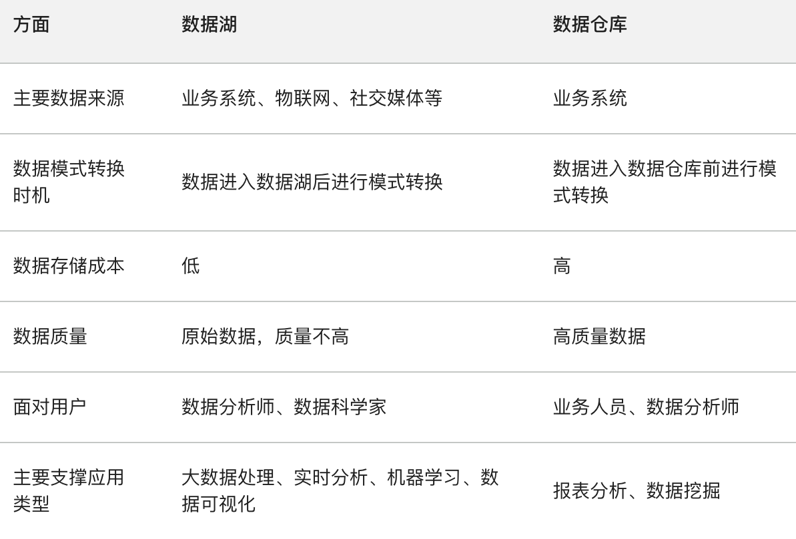

# 论文题_大数据架构

- 对应软考高级系统架构设计师章节：信息系统基础知识、数据库设计基础知识、未来信息综合技术、大数据架构设计理论与实践

- 题目数量：7

---

> **知识点分组：多源数据集成**

## 1. 2023年11月第2题（多源数据集成）

- 题号：0020230502002
- 题目标签：多源数据集成
- 难度：中等
- 频率：高频
- 浓缩知识点：多源数据集成；围绕项目背景、架构方案、实施效果与问题分析组织论文答案。

### 论文题目

论多数据源集成的应用与实现

多数据源集成是指在一个系统中同时使用多个不同的数据源，如数据库、API、文件等，以实现数据的整合和共享。这种方法在实际应用中非常常见，可以带来许多好处，包括数据的完整性、实时性和灵活性等。
请围绕"论多数据源集成的应用与实现"论题，依次从以下三个方面进行论述。

概要叙述你参与管理和开发的软件项目以及在其中所担任的主要工作。
详细论述多数据源集成的应用以及方法。
结合你具体参与管理和开发的实际项目，举例说明多数据源集成的应用，并详细描述多数据源集成的应用的效果。

### 参考思路 / 答案解析

随着企业系统数字化转型升级的深入推进,企业内部通常存在多种异构数据源系统,如ERP、CRM、SCM等。这些分散的数据源通常存在数据标准不一致、系统平台不同等问题,给企业统一管控和跨系统分析决策带来了很大的挑战。多数据源集成技术正是为了解决这一痛点应运而生。它能够将不同系统、不同格式的数据整合到同一个平台,构建企业级数据中心,为统一的分析决策提供支撑。

实现企业多数据源集成需要遵循以下基本原则:（1）数据抽取原则。设计灵活、高效的抽取机制,确保能够从各数据源系统获取所需的全量和增量数据。（2）数据转换原则。根据企业数据标准,对采集到的原始数据执行规范化转换,如码值转换、字段拆分等。（3）元数据管理原则。详细记录数据字段、存储位置、生命周期等元数据,实现数据资产可视可管。（4）集成服务原则。以服务化方式向上层系统和应用提供规范的数据访问能力,如ODBC/JDBC连接。

常用的多数据源集成方法有:（1）ETL工具利用Informatica、DataStage等工具实现抽取、转换、加载的数据集成流程。（2）数据虚拟化。通过构建虚拟数据视图,实现对底层多源数据的统一查询访问。（3）数据湖技术。
将各数据源数据按原貌导入统一的数据湖存储平台,并在之上构建统一的分析应用。

以某企业集团为例,笔者负责实施了集团级的多数据源集成平台建设,集成了多达30余个异构系统的数据。具体做法如下:
选择优秀ETL工具(DataStage)作为集成引擎,搭建高效的集成作业流程。针对核心系统设计实时数据抽取方案,利用CDC等增量抽取技术;其他系统每日全量抽取。实现各异构数据源向标准化物理模型的规范转换,集成公共主数据模型。构建企业级数据服务层,提供元数据搜索、数据质量监控、统一查询等能力。在集成数据平台基础上,开发企业经营数据分析应用及各业务智能分析应用。该集成平台的建设完整解决了集团内多源异构数据统一管控和高效利用的问题,成为集团数据智能化转型的坚实数据基础。

当前数据已成为企业最核心的战略资产,多数据源集成技术则是企业赋能核心生产要素的关键基础。通过规范化的统一集成管理,企业可充分整合利用内外部数据资源,开展全方位数据驱动的经营决策,推动数字化转型,实现更高质量发展。

---

## 2. 2024年11月第3题（多源数据集成）

- 题号：0020241102003
- 题目标签：多源数据集成
- 难度：中等
- 频率：高频
- 浓缩知识点：多源数据集成；围绕项目背景、架构方案、实施效果与问题分析组织论文答案。

### 论文题目

随着信息技术的不断发展，数据来源日益丰富多样，企业、机构和组织中往往存在多个不同的业务系统，如客户关系管理系统、企业资源规划系统、供应链管理系统等，每个系统都有自己独立的数据存储和管理方式。同时，互联网的普及使得大量外部数据，如社交媒体数据、传感器数据、网页数据等也成为重要的数据来源。这些数据在结构、语义和格式上存在很大差异，为了充分发挥数据的价值，需要将这些多源异构的数据进行集成。
请围绕"论多源异构数据集成方法"论题，依次从以下三个方面进行论述。
1、概要叙述你参与分析设计的软件项目以及你在其中所承担的主要工作。
2、多源异构数据集成的主要内容，以及实现异构数据源集成的技术路线。
3、具体阐述你参与的软件项目是如何做到多源异构数据集成，过程中遇到哪些问题，是如何解决的，以及处理后的效果如何。

### 参考思路 / 答案解析

在信息技术飞速发展的当下，数字化浪潮席卷了各个行业和领域。企业、机构和组织在日常运营与业务拓展过程中，积累了海量的数据。这些数据来源极为广泛，既涵盖了企业内部多个不同的业务系统，如客户关系管理系统（CRM）用于记录客户信息、交互历史与销售机会，企业资源规划系统（ERP）整合了财务、采购、生产等核心业务流程数据，供应链管理系统（SCM）聚焦于供应链环节的物流、库存、供应商等数据；还囊括了丰富的外部数据，像社交媒体数据反映了用户的兴趣爱好、消费倾向与社交行为，传感器数据实时监测物理环境或设备状态，网页数据包含了大量公开的资讯、市场动态等 。
然而，这些数据存在严重的多源异构问题。不同数据源的数据在结构上大相径庭，有的是规整的结构化数据，可清晰地用二维表结构表示；有的则是半结构化数据，如 XML、JSON 格式，有一定的结构但又不够严谨；还有大量非结构化数据，像文本、图像、音频、视频，缺乏预设的数据模型。语义层面，同一术语在不同系统可能含义迥异，例如 "销售额"，在销售系统可能指订单金额，在财务系统或许是已到账金额。格式上，日期格式可能有 "YYYY - MM - DD""MM/DD/YYYY" 等多种，数值精度、编码方式也各不相同。
这种多源异构的数据状况严重阻碍了数据价值的充分发挥。数据分散在各个孤立的系统中，形成了一个个 "数据孤岛"，难以进行统一的分析、挖掘与利用。企业无法快速获取全面、准确的数据洞察，这对决策的及时性与科学性造成了负面影响，限制了业务的协同发展与创新突破。例如，在精准营销场景中，若不能将 CRM 系统的客户基本信息与社交媒体数据中客户的兴趣偏好有效集成，就难以实现个性化的精准营销推送，导致营销资源浪费，客户转化率低下。
因此，多源异构数据集成成为了数字化时代亟待解决的关键问题。它对于打破数据壁垒，实现数据的互联互通与共享，构建统一、全面的数据视图起着至关重要的作用。通过有效的数据集成，企业能够整合分散的数据资源，挖掘数据间潜在的关联与价值，为数据分析、决策支持、业务流程优化等提供坚实的数据基础，从而提升企业的核心竞争力，在激烈的市场竞争中抢占先机，实现可持续发展。本文将结合实际参与的软件项目，深入探讨多源异构数据集成的主要内容、技术路线，以及项目实施过程中的具体实践、问题解决与成效评估。

随着互联网技术的飞速发展与消费者购物习惯的转变，电商行业呈现出爆发式增长态势。[具体电商企业名称] 作为行业内的重要参与者，业务不断扩张，不仅在多个电商平台开展业务，还构建了自有官网和移动端应用。在业务拓展过程中，企业积累了海量的数据，这些数据来源广泛且类型复杂，涵盖了不同电商平台的交易数据、自有平台的用户行为数据、供应链系统中的物流与库存数据，以及第三方市场调研机构提供的行业数据等 。
这些多源异构的数据给企业带来了严峻的挑战。数据分散在各个独立的系统中，形成了一个个 "数据孤岛"。不同系统的数据格式、结构和语义存在巨大差异，例如，在不同电商平台上，商品的属性定义、价格表示方式、订单状态标识都不尽相同；自有平台的用户行为数据以日志形式记录，与结构化的交易数据难以直接关联；供应链系统的数据则侧重于物流轨迹和库存数量，与销售数据的对接也存在诸多困难。这种数据的混乱状况严重阻碍了企业对自身业务的全面了解与深度分析。
在精准营销方面，由于无法将各平台的用户数据有效整合，企业难以构建全面、准确的用户画像，导致营销活动缺乏针对性，营销资源浪费严重，客户转化率低下。在供应链管理中，销售数据与库存、物流数据的脱节，使得企业难以实现精准的库存管理和高效的物流配送，增加了运营成本，降低了客户满意度。在市场分析与决策制定上，缺乏统一、准确的数据支持，使得企业对市场趋势的判断出现偏差，决策的及时性和科学性受到严重影响。
为了打破数据壁垒，充分发挥数据的价值，提升企业的核心竞争力，[具体电商企业名称] 启动了数据整合与分析平台项目。该项目旨在整合企业内外部的多源异构数据，构建一个统一的数据仓库，为企业的数据分析、决策支持、业务优化等提供坚实的数据基础。通过该项目，企业期望实现精准营销、优化供应链管理、提升客户体验，从而在激烈的市场竞争中脱颖而出，实现可持续发展。

在这个数据整合与分析平台项目中，我担任数据架构师这一关键角色。我的主要职责贯穿了项目的整个生命周期，从前期的规划设计到中期的技术选型与实施，再到后期的系统优化与维护，都发挥着核心作用。
在项目的规划设计阶段，我深入了解企业的业务需求和战略目标，与各个业务部门进行密切沟通，收集他们对数据的需求和期望。通过对企业现有数据资源的全面调研和分析，我明确了需要集成的数据类型、来源以及数据之间的关联关系。基于这些深入的了解，我负责设计数据集成架构，构建一个能够满足企业当前业务需求且具有良好扩展性的架构蓝图，以适应未来业务发展和数据增长的需求。
在技术选型方面，我需要综合考虑多源异构数据的特点、数据量的大小、数据更新的频率以及企业的技术实力和预算等因素。经过对市场上众多数据集成工具和技术的详细评估和对比测试，我选择了合适的工具和技术来实现数据的抽取、转换和加载（ETL）过程。例如，针对不同数据源的数据抽取，我选用了具有强大适配能力的工具，能够快速、稳定地从关系型数据库、NoSQL 数据库、文件系统等多种数据源中获取数据；在数据转换环节，利用专业的数据转换工具和脚本语言，实现了数据格式的统一、数据质量的清洗以及数据语义的标准化；在数据加载阶段，根据数据仓库的架构和性能要求，选择了高效的数据加载方式，确保数据能够准确、及时地加载到目标数据仓库中。
在项目实施过程中，我负责制定详细的 ETL 流程，明确数据从各个数据源抽取、经过转换处理后加载到数据仓库的具体步骤和规则。同时，我还需要解决项目实施过程中遇到的各种技术难题。例如，在处理海量数据时，面临着数据处理效率低下的问题，我通过优化 ETL 算法、采用分布式计算技术等方式，有效地提高了数据处理速度；在数据一致性方面，针对不同数据源数据更新不同步的问题，我设计了数据同步机制，确保数据在集成过程中的一致性和准确性。
此外，我还承担着团队协调和技术指导的职责。与数据开发团队、数据分析团队、运维团队等密切协作，确保各个团队之间的沟通顺畅和工作协同。为团队成员提供技术培训和指导，提升团队整体的技术水平和业务能力，保障数据集成工作的顺利进行和系统的稳定运行。在项目上线后的维护阶段，我持续关注数据集成系统的运行状态，及时发现并解决出现的问题，对系统进行优化和升级，以满足企业不断变化的业务需求。
三、多源异构数据集成的主要内容与技术路线

数据清洗是多源异构数据集成中至关重要的前置环节，其核心任务是对原始数据进行细致审查与校正，全力消除数据中存在的不完整、错误、重复以及格式不一致等各类质量问题，从而显著提升数据的准确性、一致性和可用性。在实际的数据环境中，数据质量问题广泛存在且形式多样。
缺失值是较为常见的数据质量问题之一。例如在电商交易数据中，可能存在部分订单记录缺失客户的联系方式，这可能是由于用户在下单时未填写完整信息，或者在数据传输过程中出现丢失。缺失值的存在会严重影响数据分析的完整性和准确性，若直接用于分析，可能导致分析结果出现偏差，无法真实反映业务情况。在客户行为分析中，如果大量客户记录缺失购买时间或购买金额等关键信息，就难以准确洞察客户的购买习惯和消费偏好。
重复值也是不容忽视的问题。在企业的客户信息管理系统中，可能会因为数据录入错误或系统同步问题，出现重复的客户记录。这些重复记录不仅会占据额外的存储空间，增加数据存储成本，还会干扰数据分析的准确性。在进行客户数量统计或客户价值分析时，重复记录会导致数据的重复计算，使分析结果出现虚高，误导企业的决策。
错误值同样会对数据质量产生负面影响。在供应链系统的物流数据中，可能会出现货物重量或体积的错误记录，这可能是由于传感器故障、人工录入失误等原因导致。错误值的存在会使企业对物流成本、库存管理等方面的决策出现偏差，影响供应链的高效运作。
数据格式不一致也是常见问题。不同数据源的数据格式往往存在差异，如日期格式可能有 "YYYY - MM - DD""MM/DD/YYYY""DD - MMM - YYYY" 等多种形式；数值精度也可能各不相同，有些数据可能保留两位小数，而有些则保留整数。这种格式上的不一致会给数据的整合和分析带来极大困难，在进行时间序列分析或数据关联分析时，需要花费大量时间和精力进行格式转换和统一，否则无法进行有效的数据分析。
数据清洗通过一系列科学、严谨的方法来解决这些问题。对于缺失值，可根据数据的特点和业务需求选择合适的处理方式。若数据量较大且缺失值占比较小，可直接删除缺失值所在的记录；若缺失值较多，则可采用均值填充、中位数填充、回归预测等方法进行填补。在客户年龄数据中，若存在部分缺失值，可以通过计算其他客户年龄的平均值或中位数来填充缺失值，以保证数据的完整性。对于重复值，可通过建立唯一标识或使用数据匹配算法来识别并删除重复记录。在客户信息管理系统中，可以根据客户的身份证号码、手机号码等唯一标识来判断是否为重复记录，将重复的记录进行删除，确保数据的唯一性。对于错误值，可通过数据验证规则、领域知识或机器学习算法进行识别和纠正。在物流数据中，可以根据货物的实际情况和行业标准，建立数据验证规则，对货物重量和体积的错误值进行纠正。对于数据格式不一致的问题，可通过编写数据转换脚本或使用专门的数据格式转换工具，将数据统一转换为标准格式，以便后续的分析和处理。

数据转换是多源异构数据集成的关键环节，其核心内涵是将数据从一种格式、结构或类型转变为另一种，以契合数据集成和分析的特定需求。这一过程主要涵盖结构转换、格式转换和语义转换三个重要方面。
结构转换主要是针对不同数据源数据组织形式的差异进行调整。在电商数据中，关系型数据库中的订单数据通常以二维表格形式存储，每条记录包含订单编号、客户 ID、商品 ID、购买数量、购买金额等字段，而在一些文档型数据库（如 MongoDB）中，订单数据可能以文档形式存储，每个订单是一个独立的文档，包含嵌套的子文档来描述商品详情等信息。为了实现数据的统一集成和分析，就需要进行结构转换，将文档型数据转换为关系型数据结构，或者反之。可以使用 ETL 工具或编写自定义脚本，按照预定的规则，将文档型数据中的字段提取出来，重新组织成关系型数据库所需的表格结构，使不同结构的数据能够在统一的框架下进行处理和分析。
格式转换主要解决数据在表现形式上的不一致问题。在日期格式方面，不同系统可能采用不同的表示方式，如 "2024 - 01 - 01""01/01/2024""2024 年 1 月 1 日" 等。为了确保数据在时间维度上的一致性和可比性，需要将这些不同格式的日期统一转换为标准的 "YYYY - MM - DD" 格式。在数值格式上，可能存在精度、单位等差异。在财务数据中，金额可能以元为单位，也可能以万元为单位，且小数位数不同。此时，需要将金额数据统一转换为相同的单位和精度，如统一以元为单位，保留两位小数，以便进行准确的数值计算和比较分析。可以使用数据处理工具或编程语言中的数据转换函数，按照设定的格式模板，对数据进行批量转换，确保数据格式的一致性。
语义转换则致力于消除不同数据源中数据含义的歧义。在不同的业务系统中，同一术语可能具有不同的含义，或者不同的术语表达相同的含义。在销售系统中，"销售额" 可能指的是订单生成时的金额，而在财务系统中，"销售额" 可能是指实际到账的金额；在客户管理系统中，"客户状态" 在一个系统中可能用 "活跃""休眠""流失" 来表示，而在另一个系统中可能用 "1""2""3" 来编码表示。为了实现数据的有效集成和共享，需要建立语义映射关系，将不同系统中的数据语义进行统一和标准化。可以通过创建语义字典或本体模型，明确各个术语在不同系统中的含义和对应关系，然后在数据转换过程中，根据语义映射规则，将数据转换为统一的语义表达，使不同系统的数据能够在语义层面上相互理解和融合。
数据转换对于实现数据的统一和集成具有不可替代的重要性。它能够使来自不同数据源的数据在格式、结构和语义上达成一致，打破数据之间的隔阂，为后续的数据融合和深入分析奠定坚实基础。通过数据转换，企业能够将分散在各个系统中的数据整合为一个有机的整体，实现数据的互联互通和共享，从而充分挖掘数据的潜在价值，为企业的决策制定、业务优化和创新发展提供有力的数据支持。

数据融合是多源异构数据集成的核心目标，其本质是将来自不同数据源、具有不同格式和结构的数据，有机整合为一个统一的数据集，从而为企业提供全面、准确、有洞察力的数据视图，有力支持深入的数据分析、科学的决策制定以及高效的应用开发。
在实际操作中，数据融合的过程较为复杂且精细。以电商企业的数据融合为例，企业需要整合多个电商平台的交易数据、自有平台的用户行为数据、供应链系统中的物流与库存数据，以及第三方市场调研机构提供的行业数据等。在整合交易数据时，需要将不同电商平台上的订单信息，包括订单编号、商品详情、价格、支付方式、交易时间等，按照统一的标准进行梳理和合并。同时，要将自有平台的用户行为数据，如用户浏览记录、搜索关键词、收藏商品、加入购物车等行为信息，与交易数据进行关联，以便深入分析用户的购买决策过程和消费行为模式。
在融合物流与库存数据时，需要将供应链系统中的物流轨迹信息，如发货时间、运输路径、到货时间等，以及库存数据，包括库存数量、库存位置、补货周期等，与交易数据相结合，实现对供应链的全面监控和优化管理。通过分析物流数据与交易数据的关联关系，可以及时发现物流配送中的问题，如延迟交付、运输损坏等，从而采取相应的措施进行改进；通过分析库存数据与交易数据的关系，可以实现精准的库存管理，避免库存积压或缺货现象的发生，降低运营成本，提高客户满意度。
行业数据的融合也至关重要。第三方市场调研机构提供的行业数据，如市场规模、竞争对手分析、消费者趋势等，能够为企业提供宏观的市场视角和行业动态信息。将这些行业数据与企业内部的交易数据、用户行为数据、物流与库存数据进行融合，可以帮助企业更好地了解市场竞争态势，把握市场机会，制定科学合理的发展战略。通过分析行业数据与企业交易数据的对比情况，企业可以评估自身在市场中的地位和竞争力，找出差距和优势，从而有针对性地调整业务策略；通过分析消费者趋势数据与用户行为数据的契合度，企业可以提前预测市场需求的变化，及时推出符合消费者需求的产品和服务，提升市场占有率。
数据融合能够显著提高数据的完整性、准确性和可用性。通过整合多源数据，填补了单一数据源中可能存在的数据缺失，使数据更加完整；通过对不同数据源的数据进行交叉验证和比对，纠正了数据中的错误和不一致性，提高了数据的准确性；通过将数据统一整合到一个数据集中，方便了数据的查询、分析和应用，大大提升了数据的可用性。在客户关系管理中，通过融合客户在各个渠道的交互数据，企业可以构建全面、准确的客户画像，深入了解客户的需求、偏好和行为习惯，从而实现个性化的精准营销和客户服务，提高客户忠诚度和满意度。

ETL（Extract, Transform, Load）即提取、转换、加载，是一种广泛应用于数据集成领域的传统技术，尤其在处理结构化数据时展现出显著优势。其工作流程严谨且有序，首先是提取环节，从各类数据源，如关系型数据库（如 MySQL、Oracle）、文件系统（如 CSV 文件、Excel 文件）、API 接口等，依据预先设定的规则和条件，抽取所需的原始数据。在电商数据集成项目中，从 MySQL 数据库中抽取订单表、用户表等数据，从文件系统中读取商品信息的 CSV 文件，以及通过 API 接口获取第三方支付平台的交易流水数据。
接着进入转换环节，这是 ETL 技术的核心环节。在该环节中，对抽取的原始数据进行全方位的处理，包括数据清洗，去除重复值、纠正错误值、填充缺失值；数据格式转换，将不同格式的数据统一转换为目标格式，如将日期格式统一为 "YYYY - MM - DD"；数据标准化，使数据符合特定的标准和规范，如将商品分类按照统一的分类体系进行调整；数据聚合，对数据进行汇总、计算，如计算每个用户的购买总金额、每个商品的销售数量等。通过这些转换操作，使原始数据符合目标系统的要求和规范，为后续的加载和分析奠定良好基础。
最后是加载环节，将经过转换处理后的数据，按照预定的方式和规则，加载到目标数据存储系统中，如数据仓库（如 Hive 数据仓库）、数据湖（如基于 Hadoop 的数据湖）或其他数据库中。在加载过程中，需要考虑数据的加载效率、数据的完整性和一致性等问题，确保数据能够准确无误地加载到目标系统中，为后续的数据分析和应用提供可靠的数据支持。
在本电商数据集成项目中，ETL 技术具有高度的适用性。由于项目中涉及大量的结构化交易数据、用户数据和商品数据，这些数据具有明确的结构和格式，非常适合使用 ETL 工具进行处理。通过 ETL 工具（如 Kettle、Informatica 等），可以方便地配置数据抽取、转换和加载的规则和流程，实现数据的自动化处理。利用 Kettle 的图形化界面，能够轻松地设计 ETL 作业，将来自不同数据源的数据抽取、清洗、转换后，加载到 Hive 数据仓库中，为后续的数据分析和报表生成提供数据基础。ETL 技术在处理大规模结构化数据时具有较高的效率和稳定性，能够满足项目对数据处理的准确性和时效性要求。

数据虚拟化是一种先进的数据集成技术，其原理是通过构建一个抽象层，对分布在不同数据源的数据进行逻辑整合和集成，屏蔽数据的物理存储位置、格式和访问方式等技术细节，为用户提供一个统一的数据视图，使用户能够像访问单一数据源一样访问和管理多源数据。
在电商数据集成项目中，数据虚拟化技术在满足实时查询需求方面具有独特优势。随着电商业务的快速发展，企业对实时数据分析和决策支持的需求日益迫切。例如，在促销活动期间，企业需要实时了解商品的销售情况、库存变化、用户的购买行为等信息，以便及时调整营销策略和库存管理策略。传统的数据集成方式，如 ETL 技术，通常需要先将数据抽取、转换后加载到目标数据仓库中，这个过程需要一定的时间，无法满足实时查询的需求。
而数据虚拟化技术则不同，它通过实时查询各个数据源，动态地获取和整合数据，无需事先将数据全部加载到本地。当用户发起一个关于实时销售数据的查询时，数据虚拟化引擎会根据查询请求，自动解析并将其分发到相关的数据源，如各个电商平台的数据库、自有平台的日志系统等，然后从这些数据源中实时获取数据，并进行集成和转换，最后将结果返回给用户。这种方式能够快速响应用户的查询请求，提供近乎实时的数据洞察，帮助企业及时做出决策。
数据虚拟化技术还具有很强的灵活性和可扩展性。它可以轻松地集成新的数据源，而无需对整个数据集成架构进行大规模的修改。当企业引入新的电商平台或数据源时，只需在数据虚拟化层进行简单的配置和映射，就可以将新的数据纳入到统一的数据视图中，供用户查询和分析。这使得企业能够快速适应业务的变化和发展，不断拓展数据的来源和应用场景。
3. 2.3 中间件技术
中间件在数据集成中扮演着至关重要的桥梁角色，其主要作用是屏蔽数据源的差异，实现不同数据源之间的数据高效传输与集成。在多源异构数据环境中，数据源的类型繁多，包括关系型数据库、非关系型数据库（如 MongoDB、Redis）、文件系统、消息队列等，它们在数据存储方式、接口规范、数据格式等方面存在巨大差异。
中间件通过提供统一的接口和协议，将这些差异隐藏起来，使应用程序能够以统一的方式访问和操作不同的数据源。中间件可以实现不同数据库之间的数据交互，将关系型数据库中的数据与非关系型数据库中的数据进行整合。在电商数据集成中，中间件可以将 MySQL 数据库中的订单数据与 MongoDB 中的用户评论数据进行关联和整合，为数据分析提供更全面的数据支持。中间件还可以实现数据的高效传输，通过优化数据传输算法和协议，减少数据传输的延迟和带宽消耗，提高数据集成的效率。
中间件能够实现数据的高效传输与集成。它通过建立数据传输通道，实现数据在不同数据源之间的快速流动。在数据传输过程中，中间件可以对数据进行实时的转换和处理，确保数据的一致性和准确性。中间件可以在数据从数据源传输到目标系统的过程中，对数据进行格式转换、数据清洗等操作，使数据能够直接被目标系统使用，无需额外的处理步骤。中间件还可以实现数据的异步传输和批量传输，提高数据传输的效率和可靠性。在处理大量数据时，中间件可以将数据分成多个批次进行传输，避免一次性传输大量数据导致的网络拥塞和系统性能下降；同时，通过异步传输方式，使数据传输与应用程序的其他操作并行进行，提高系统的整体运行效率。

在本项目中，确定数据源是数据集成的首要任务。我们对企业内部和外部的数据源进行了全面梳理。内部数据源主要包括多个电商平台的交易数据库，如淘宝、京东等平台的订单数据、商品数据；自有官网和移动端应用的用户行为日志数据，记录了用户的浏览、搜索、点击等行为；供应链管理系统中的物流与库存数据，涵盖了货物的运输轨迹、库存数量和位置等信息。外部数据源则有第三方市场调研机构提供的行业报告数据，以及社交媒体平台上与企业品牌和产品相关的舆情数据。
设计 ETL 流程时，我们选用了专业的 ETL 工具 Kettle。首先进行数据抽取，从不同数据源采用不同的抽取方式。对于关系型数据库，利用 Kettle 的数据库连接插件，通过 SQL 查询语句抽取所需数据；对于日志文件，使用文件读取插件，按照日志的格式和规则进行逐行读取；对于 API 接口数据，配置相应的 API 调用参数，实现数据的实时或定时抽取。在抽取订单数据时，从电商平台的 MySQL 数据库中，根据设定的时间范围，抽取指定时间段内的订单记录；对于用户行为日志数据，从日志文件服务器上读取当天生成的日志文件。
数据清洗环节，针对数据中存在的缺失值、重复值和错误值等问题，使用 Kettle 提供的数据清洗功能和自定义规则进行处理。对于缺失值，若某个字段缺失值较少，直接删除该记录；若缺失值较多，则根据业务逻辑，使用均值、中位数或其他相关字段进行填充。在处理客户年龄字段的缺失值时，通过计算其他客户年龄的平均值进行填充。对于重复值，利用 Kettle 的去重组件，根据唯一标识字段，如订单编号、用户 ID 等，去除重复记录。对于错误值，编写自定义的校验规则，如检查订单金额是否为负数、日期格式是否正确等，对错误数据进行纠正或标记。
数据转换过程中，依据数据的特点和目标数据仓库的要求，制定了详细的转换规则。在结构转换方面，将文档型的用户评论数据转换为关系型数据结构，以便与其他结构化数据进行关联分析。在格式转换上，将不同格式的日期统一转换为 "YYYY - MM - DD" 格式，将金额数据统一转换为以元为单位且保留两位小数的格式。在语义转换中，建立了语义映射表，将不同平台上表示相同含义但术语不同的数据进行统一，如将不同电商平台上的 "商品类目" 统一映射为标准的商品分类体系。
数据加载阶段，将经过清洗和转换的数据加载到目标数据仓库中。采用增量加载的方式，对于每天更新的数据，只加载新增和修改的数据，以提高加载效率和减少数据冗余。利用 Kettle 的数据库写入插件，将数据插入到数据仓库的相应表中，并确保数据的完整性和一致性。
为了满足实时查询和分析的需求，我们搭建了数据虚拟化平台。选用了 Denodo 数据虚拟化工具，通过在该平台上配置数据源连接和数据视图，将分布在不同数据源的数据进行逻辑整合。当用户发起查询时，数据虚拟化引擎根据查询请求，自动从各个数据源获取数据，并进行实时的集成和转换，将结果返回给用户。在查询实时销售数据时，数据虚拟化平台能够快速从各个电商平台的数据库和自有平台的交易系统中获取最新数据，并进行汇总和分析，为用户提供实时的销售报表和数据分析结果。
在中间件架构方面，我们引入了 API 网关和消息队列等中间件。使用 Nginx 作为 API 网关，对不同系统的 API 接口进行统一管理和路由转发。通过 API 网关，实现了对不同接口标准的适配，如将 REST API 和 SOAP 协议的接口进行统一封装，使外部应用能够以统一的方式访问不同系统的数据。同时，引入 Kafka 消息队列，用于解耦不同系统之间的数据传输。在数据集成过程中，将需要传输的数据发送到 Kafka 消息队列中，由接收方系统从队列中获取数据进行处理，提高了数据传输的可靠性和异步性，确保了数据集成的高效稳定运行。

在数据集成过程中，数据质量问题较为突出。缺失值是一个常见问题，在电商交易数据中，部分订单记录缺失客户的联系方式，这可能是由于用户在下单时未填写完整信息，或者在数据传输过程中出现丢失。在客户行为分析中，这些缺失联系方式的订单记录会影响对客户购买行为的全面分析，无法准确进行客户回访和营销活动。
重复值也给数据处理带来了困扰。在企业的客户信息管理系统中，由于数据录入错误或系统同步问题，出现了重复的客户记录。这些重复记录不仅占据了额外的存储空间，还会干扰数据分析的准确性，在进行客户数量统计或客户价值分析时，会导致数据的重复计算，使分析结果出现偏差。
错误值同样不容忽视。在供应链系统的物流数据中，出现了货物重量或体积的错误记录，这可能是由于传感器故障、人工录入失误等原因导致。这些错误的物流数据会影响企业对物流成本的核算和库存管理的决策，导致物流配送计划出现偏差。
为了解决这些数据质量问题，我们使用了专业的数据清洗工具，如 OpenRefine 和 Python 的数据处理库 Pandas。利用 OpenRefine 的聚类和去重功能，对客户信息数据进行处理，识别并删除重复的客户记录。通过 Pandas 编写自定义的数据清洗规则，对交易数据中的缺失值进行填充，根据订单的其他相关信息，如购买商品的品类、金额等，推测客户的可能联系方式，进行合理填充。对于物流数据中的错误值，通过建立数据验证规则，结合物流行业的标准和实际业务情况，对货物重量和体积进行校验和纠正，确保数据的准确性和可靠性。

不同数据源的数据格式存在显著差异，给数据集成带来了很大挑战。在日期格式方面，各个数据源的表示方式各不相同。电商平台 A 使用 "MM/DD/YYYY" 格式，电商平台 B 使用 "YYYY - MM - DD" 格式，而自有平台的日志数据中可能使用 "DD - MMM - YYYY" 格式。在数值格式上，也存在精度和单位的差异。在财务数据中，金额可能以元为单位，也可能以万元为单位，且小数位数不同；在商品库存数据中，数量可能以整数表示，也可能精确到小数点后一位。
为了解决数据格式不一致的问题，我们制定了详细的数据转换规则。在日期格式转换上，编写 Python 脚本，利用日期处理库（如 datetime 库），根据不同的日期格式进行解析和重新格式化，将所有日期统一转换为 "YYYY - MM - DD" 格式，确保在时间维度上的数据一致性和可比性。在数值格式转换方面，根据数据的单位和精度要求，进行相应的转换操作。对于金额数据，统一转换为以元为单位，并保留两位小数；对于库存数量数据，根据业务需求，统一转换为整数或指定的小数精度，以便进行准确的数值计算和分析。同时，利用 ETL 工具 Kettle 的格式转换功能，对大量数据进行批量格式转换，提高数据处理效率。

不同系统的数据接口标准不一致，是数据集成过程中面临的又一难题。部分系统采用 REST API 接口，具有简洁、灵活的特点，通过 HTTP 协议进行数据传输，数据以 JSON 或 XML 格式返回；而另一部分系统则使用 SOAP 协议接口，基于 XML 格式进行数据交换，具有严格的规范和复杂的消息结构。这种接口标准的差异，使得在集成不同系统的数据时，需要进行复杂的接口适配工作。
为了解决数据接口不兼容的问题，我们采用了 API 网关和编写适配程序的方案。引入 Nginx 作为 API 网关，对不同系统的 API 接口进行统一管理和路由转发。通过 API 网关，将不同格式的接口请求进行转换和适配，使外部应用能够以统一的方式访问不同系统的数据。对于 REST API 和 SOAP 协议接口，在 API 网关中配置相应的转换规则，将 RESTful 风格的请求转换为 SOAP 协议能够接受的格式，反之亦然。同时，针对一些特殊的接口需求，编写自定义的适配程序。在集成一个使用 SOAP 协议的供应链系统和多个使用 REST API 的电商平台时，通过编写适配程序，实现了数据在不同接口之间的顺畅传输和交互，确保了数据集成的顺利进行。

经过多源异构数据集成的一系列处理，数据质量得到了显著提升。数据的完整性得到了保障，通过填充缺失值和纠正错误值，使得数据记录更加完整，能够全面反映业务情况。在客户行为分析中，完整的客户数据能够准确描绘客户的购买路径和偏好，为精准营销提供有力支持。数据的准确性大幅提高，通过去重和数据验证，消除了重复数据和错误数据的干扰，使得数据分析结果更加可靠。在财务数据分析中，准确的金额数据和交易记录，为企业的财务决策提供了准确的依据。
数据查询和分析效率得到了极大提高。数据虚拟化平台的搭建，实现了实时查询和分析功能，用户能够快速获取所需的数据洞察。在促销活动期间，企业能够实时了解商品的销售情况、库存变化和用户购买行为，及时调整营销策略和库存管理策略，提高了企业的市场响应速度。通过优化 ETL 流程和数据存储结构，数据的加载和查询速度明显加快，以往需要数小时才能完成的数据分析任务，现在只需几分钟即可完成，大大提高了工作效率。
集成后的数据为企业决策提供了有力支持，取得了显著的业务成果。在精准营销方面，通过整合多源数据，构建了全面、准确的用户画像，实现了个性化的精准营销推送。根据用户的兴趣爱好、购买历史和行为习惯，向用户推送个性化的商品推荐和营销活动，提高了客户的转化率和忠诚度。在一次针对特定用户群体的精准营销活动中，转化率相比以往提高了 30%，销售额增长了 25%。
在供应链管理中，销售数据与物流、库存数据的有效集成，实现了精准的库存管理和高效的物流配送。通过实时监控库存水平和销售趋势，企业能够提前做好补货计划，避免库存积压或缺货现象的发生，降低了库存成本。同时，优化了物流配送路线和时间，提高了物流配送效率，客户满意度提升了 20%。在市场分析与决策制定上，基于集成的多源数据，企业能够深入了解市场趋势、竞争对手动态和消费者需求变化，为企业的战略规划和业务决策提供了科学依据，帮助企业在激烈的市场竞争中抢占先机，实现了可持续发展。

在本电商数据集成项目中，通过综合运用 ETL 技术、数据虚拟化和中间件技术，成功实现了多源异构数据的集成。这一过程极大地提升了数据质量，使数据的完整性、准确性和可用性得到显著改善，为后续的数据分析和应用奠定了坚实基础。数据查询和分析效率得到了质的飞跃，数据虚拟化平台实现了实时查询和分析，满足了企业对实时数据洞察的迫切需求；优化后的 ETL 流程和数据存储结构，大幅缩短了数据处理时间，提高了工作效率。集成后的数据为企业决策提供了强大支持，在精准营销、供应链管理和市场分析等方面取得了显著业务成果，有力推动了企业的发展。
然而，项目实施过程中也暴露出一些不足之处。在数据质量方面，尽管采取了多种数据清洗和校验措施，但仍难以完全消除数据中的潜在错误和不一致性。部分数据的来源复杂，数据生成和采集过程缺乏有效的质量控制机制，导致一些隐藏的数据质量问题在后期分析中才被发现。在数据格式转换和接口适配方面，虽然制定了详细的规则和采用了相应的技术手段，但随着数据源的不断增加和业务的持续发展，新的数据格式和接口类型不断涌现，给数据集成带来了新的挑战，需要不断投入人力和时间进行适配和调整。
展望未来，多源异构数据集成技术将朝着智能化、自动化和实时化的方向不断发展。随着人工智能和机器学习技术的飞速发展，它们将更深入地融入数据集成领域。利用机器学习算法自动识别和处理数据质量问题，如自动检测和纠正缺失值、错误值和重复值，将大大提高数据清洗的效率和准确性；通过深度学习模型实现数据语义的自动理解和映射，减少人工配置语义映射关系的工作量和错误率。自动化技术将使数据集成过程更加高效和便捷，例如自动发现和集成新的数据源，自动生成数据抽取、转换和加载的规则，减少人工干预，降低人为错误的风险。
实时化的数据集成将成为未来的重要趋势。随着业务对实时性要求的不断提高，能够实时获取和集成数据，为企业提供即时的数据洞察，将成为数据集成技术的核心竞争力。在金融交易、智能交通、工业物联网等领域，实时数据集成对于及时决策和风险控制至关重要。未来的数据集成技术需要更好地支持实时数据处理，实现数据的实时采集、传输、转换和分析，满足企业对实时业务的需求。
多源异构数据集成技术在不断发展和创新的过程中，将为企业和社会带来更大的价值。我们应持续关注技术发展动态，积极探索和应用新的技术和方法，不断优化数据集成方案，以应对日益复杂的数据环境和业务需求，为企业的数字化转型和创新发展提供强有力的数据支持 。

---

> **知识点分组：分布式存储**

## 3. 2013年11月第4题（分布式存储）

- 题号：0020130502004
- 题目标签：分布式存储
- 难度：简单
- 频率：中频
- 浓缩知识点：分布式存储；围绕项目背景、架构方案、实施效果与问题分析组织论文答案。

### 论文题目

论分布式存储系统架构设计
分布式存储系统（Distributed Storage System）通常将数据分散存储在多台独立的设备上。传统的网络存储系统采用集中的存储服务器存放所有数据，存储服务器成为系统性能的瓶颈，也是可靠性和安全性的焦点，不能满足大规模存储应用的需要。分布式存储系统采用可扩展的系统结构，利用多台存储服务器分担存储负荷，利用位置服务器定位存储信息，它不但提高了系统的可靠性、可用性和存取效率，还易于扩展。
请围绕"论分布式存储系统架构设计"论题，依次从以下三个方面进行论述。

概要叙述你参与分析和开发的分布式存储系统项目以及你所承担的主要工作。
简要说明在分布式存储系统架构设计中所使用的分布式存储技术及其实现机制，详细叙述你在具体项目中选用了哪种分布式存储技术，说明其原因和实施效果。

### 参考思路 / 答案解析

我参与分析和开发的分布式存储系统项目是一个面向大型企业的云存储平台，该平台需要支持海量数据存储、高并发访问和多数据中心部署。我在项目中担任架构师，负责总体架构设计和技术方案制定。

分布式存储系统架构设计中常用的分布式存储技术包括：文件系统：将数据组织成文件并存储在多个节点上，如 HDFS、GlusterFS。对象存储：将数据存储为对象，并通过键值对进行访问，如 Amazon S3、Swift。块存储：将数据存储为大小相等的块，并通过块地址进行访问，如 Ceph、RBD。技术实现机制

数据分片：将数据分割成多个片，并存储在不同的节点上。数据复制：将数据复制到多个节点上，提高数据的可靠性。一致性：保证多个节点上的数据一致性。负载均衡：将请求分散到多个节点上，提高系统的性能。

在该项目中，我选用了对象存储技术，主要原因如下：对象存储具有良好的扩展性和 scalability，可以满足海量数据存储的需求。对象存储的访问方式简单，易于使用。对象存储的成本相对较低。

该项目采用了对象存储技术，并结合项目实际情况，采取了以下措施:采用多数据中心部署，提高系统的可靠性和可用性。采用负载均衡技术，提高系统的性能。采用数据加密技术，提高数据的安全性。分布式存储系统架构设计是一门复杂的技术，需要根据具体的需求和场景进行设计和调整，以获得最佳的效果。

---

> **知识点分组：数据分片**

## 4. 2020年11月第1题（数据分片）

- 题号：0020200502001
- 题目标签：数据分片
- 难度：简单
- 频率：中频
- 浓缩知识点：数据分片；围绕项目背景、架构方案、实施效果与问题分析组织论文答案。

### 论文题目

论数据分片技术及其应用

数据分片就是按照一定的规则，将数据集划分成相互独立正交的数据子集。然后将数据子集分布到不同的节点上，通过设计合理的数据分片规则，可将系统中的数据分布在不同的物理数据库中，达到提升应用系统数据处理速度的目的。
请围绕"论数据分片技术及其应用"论题，依次从以下三个方面进行论述。

概要叙述你参与管理和开发软件的项目以及承担的工作
Hash分片，一致性Hash分片和按照数据范围分片是三种常用的数据分片方式
具体阐述你参与管理和开发的项目，且采用了哪些分片方式，并且具体说明其实现过程和应用效果。

### 参考思路 / 答案解析

我参与管理和开发的项目是一个大型的社交网络平台，该平台拥有数亿用户和海量数据。为了应对数据量激增带来的挑战，我们采用了数据分片技术来提升系统的性能和可扩展性。我主要负责系统架构设计和技术方案制定。

数据分片方式可以分为Hash分片。Hash分片是将数据根据某个字段的哈希值进行分片，哈希值相同的數據存放在同一个分片上。这种方式简单易行，但容易出现数据倾斜问题。

一致性Hash。一致性Hash分片是改进的Hash分片方式，它可以保证数据在各个分片上均匀分布。一致性Hash分片使用虚拟节点来解决数据倾斜问题。

按照数据范围分片。按照数据范围分片是将数据根据某个字段的范围进行分片，例如将用户数据按照年龄范围分片。这种方式可以保证数据在各个分片上均衡分布，但需要预先定义数据范围。

我们在项目中采用了Hash分片和一致性Hash分片两种方式。
Hash分片。我们将用户数据按照用户ID进行Hash分片，哈希值相同的用户数据存放在同一个分片上。这种方式简单易行，但容易出现数据倾斜问题。
一致性Hash分片。我们将用户数据按照用户ID进行一致性Hash分片，可以保证数据在各个分片上均匀分布。一致性Hash分片使用虚拟节点来解决数据倾斜问题。

我们使用Redis作为分片中间件，负责将数据路由到不同的分片上。具体实现过程如下：客户端将数据发送给Redis。Redis根据数据的分片规则计算数据应该存放在哪个分片上。Redis将数据路由到目标分片。

通过采用数据分片技术，我们有效地提升了系统的性能和 scalability。具体应用效果如下：数据查询速度提升了10倍以上。系统能够支持更大的数据量。系统的扩展性得到了增强。

数据分片技术是一种有效的提升系统性能和 scalability 的技术。在实践中，需要根据具体的需求选择合适的数据分片方式。

---

> **知识点分组：数据湖与湖仓一体**

## 5. 2019年11月第3题（数据湖与湖仓一体）

- 题号：0020190502003
- 题目标签：数据湖与湖仓一体
- 难度：简单
- 频率：高频
- 浓缩知识点：数据湖与湖仓一体；围绕项目背景、架构方案、实施效果与问题分析组织论文答案。

### 论文题目

论数据湖技术及其应用

近年来，随着移动互联网、物联网、工业互联网等技术的不断发展，企业级应用面临的数据规模不断增大，数据类型异常复杂。针对这一问题，业界提出"数据湖（Data Lake） "这一新型的企业数据管理技术。数据湖是一个存储企业各种原始数据的大型仓库， 支持对任意规模的结构化、半结构化和非结构化数据进行集中式存储，数据按照原有结构进行存储，无须进行结构化处理；数据湖中的数据可供存取、处理、分析及传输，支撑大数据处理 、实时分析、机器学习、数据可视化等多种应用，最终支持企业的智能决策过程。
请围绕"数据湖技术及其应用"论题，依次从以下三个方面进行论述。

概要叙述你所参与管理或开发的软件项目，以及你在其中所承担的主要工作。
详细阐述数据湖技术，并从主要数据来源、数据模式 (（Schema )）转换时机、数据存储成本、数据质量、面对用户和主要支撑应用类型等5个方面详细论述数据湖技术与数据仓库技术的差异。
详细说明你所参与的软件开发项目中，如何采用数据湖技术进行企业数据管理，并说明具体实施过程以及应用效果 。

### 参考思路 / 答案解析

我参与管理和开发的项目是一个大型的金融科技平台，该平台面向金融机构，旨在提供一站式金融服务解决方案。该平台采用了数据湖技术来存储和管理来自不同业务部门的海量数据。我主要负责数据架构设计和技术方案制定。

数据湖技术与数据仓库技术的差异

我们在项目中采用了以下步骤来构建数据湖：数据采集：从不同业务系统、物联网设备和社交媒体等数据源采集数据。数据存储：将采集到的数据存储在 Hadoop、HDFS 等分布式存储系统中。数据处理：对数据进行清洗、转换和加工，以满足不同应用的需求。数据分析：使用 Hive、Spark 等大数据分析工具进行数据分析。
数据可视化：使用 Tableau、Power BI 等数据可视化工具将分析结果呈现给用户。

我们首先制定了数据湖建设规划，明确了数据湖的建设目标、范围和技术方案。然后，我们按照规划进行数据湖的建设、测试和部署。最后，我们对数据湖进行了试运行和优化。

通过采用数据湖技术，我们有效地整合了企业内外部数据，为企业提供了统一的数据视图。具体应用效果如下：数据查询速度提高了10倍以上。数据分析效率提高了50%。支持了新的业务应用，例如实时风控、精准营销等。

数据湖技术是一种新型的企业数据管理技术，可以有效地解决数据孤岛问题，为企业提供统一的数据视图和强大的数据分析能力。

---

## 6. 2022年11月第4题（数据湖与湖仓一体）

- 题号：0020220502004
- 题目标签：数据湖与湖仓一体
- 难度：简单
- 频率：高频
- 浓缩知识点：数据湖与湖仓一体；围绕项目背景、架构方案、实施效果与问题分析组织论文答案。

### 论文题目

论湖仓一体架构及其应用

随着 5G、大数据、人工智能、物联网等技术的不断成熟，各行各业的业务场景日益复杂， 企业数据呈现出大规模、多样性的特点，特别是非结构化数据呈现出爆发式增长趋势。在这 一背景下，企业数据管理不再局限于传统的结构化 OLTP数据交易过程，而是提出了多样化、异质性数据的实时处理要求。传统的数据湖在事务一致性及实时处理方面有所欠缺，而数据仓库(Data Warehouse)也无法应对高并发、 多数据类型的处理。因此，支持事务一致性、提供高并发实时处理及分析能力的湖仓一体架构应运而生。湖仓一体架构在成本、灵活性、统一数据存储、多元数据分 析等多方面具备优势，正逐步转化为下一代数据管理系统的核心竞争力。
请围绕"湖仓一体架构及其应用"论题，依次从以下三个方面进行论述。

概要叙述你参与管理和开发的、采用湖仓一体架构的软件项目以及你在其中所承担的主要工作。
请对湖仓一体架构进行总结与分析，给出其中四类关键特征，并简要对这四类关键特征的内涵进行阐述。
具体阐述你参与管理和开发的项目是如何采用湖仓一体架构的，并围绕上述四类关键特征，详细论述在项目设计与实现过程中遇到了哪些实际问题，是如何解决的。

### 参考思路 / 答案解析

我参与管理和开发的项目是一个基于湖仓一体架构的实时数据分析平台，该平台主要应用于金融领域，旨在帮助金融机构进行实时风控和精准营销。我主要负责系统架构设计和技术方案制定。

湖仓一体架构是一种融合了数据湖和数据仓库优势的新型数据架构，它能够同时满足数据湖的低成本、高扩展性和数据仓库的强一致性、高性能等需求。湖仓一体架构的四类关键特征如下：
统一数据存储：湖仓一体架构打破了数据湖和数据仓库之间的数据孤岛，将所有数据统一存储在一个平台上，为数据分析提供统一的数据源。
多元数据分析：湖仓一体架构支持结构化、半结构化和非结构化等多种类型数据的存储和分析，能够满足不同业务场景的需求。
实时数据处理：湖仓一体架构支持实时数据摄入和处理，能够满足实时风控、实时推荐等实时数据分析的需求。
敏捷数据治理：湖仓一体架构提供完善的数据治理工具和方法，能够确保数据的质量和安全。

该系统采用湖仓一体架构，由以下几层组成：数据接入层：负责采集来自各种数据源的数据，包括数据库、日志文件、传感器等。数据存储层：负责存储所有数据，包括结构化、半结构化和非结构化数据。数据计算层：负责对数据进行清洗、转换、分析和处理。数据服务层：对外提供数据查询、分析和可视化等服务。

我们在项目中采用了 Apache Hudi 作为数据湖存储层，Hudi 能够将结构化、半结构化和非结构化数据统一存储在一个表中，并支持 ACID 事务，保证数据的强一致性。

我们在项目中采用了 Apache Spark 作为数据计算层，Spark 支持多种数据分析框架，例如 SQL、Hive、机器学习等，能够满足不同业务场景的需求。

我们在项目中采用了 Apache Kafka 作为实时数据摄入平台，Kafka 能够支持高并发的数据摄入，并保证数据的实时性。

我们在项目中采用了 Apache Atlas 作为数据治理平台，Atlas 能够提供数据字典、数据血缘、数据质量等数据治理功能，确保数据的质量和安全。

我们在项目设计与实现过程中遇到了以下问题：数据格式不统一：来自不同数据源的数据格式不统一，导致数据难以整合。数据质量不高：部分数据存在缺失、错误等问题，影响分析结果的准确性。实时处理性能不足：面对海量数据，实时处理性能难以满足需求。

我们采取了以下措施来解决这些问题：制定数据标准：统一数据格式，方便数据整合。进行数据清洗：清理数据中的缺失、错误等问题，提高数据质量。优化算法和架构：提高实时处理性能，满足需求。

湖仓一体架构是一种先进的数据架构，具有广阔的应用前景。我们在项目中实践了湖仓一体架构，取得了良好的效果。我们相信，湖仓一体架构将成为未来数据管理的主流架构。

---

> **知识点分组：Lambda 架构**

## 7. 2024年5月第1题（Lambda 架构）

- 题号：0020240502001
- 题目标签：Lambda 架构
- 难度：中等
- 频率：中频
- 浓缩知识点：Lambda 架构；围绕项目背景、架构方案、实施效果与问题分析组织论文答案。

### 论文题目

论大数据lambda架构
大数据处理架构是专门用于处理和分析巨量复杂数据集的软件架构。它通常包括数据收集、存储、处理、分析和可视化等多个层面，旨在从海量、多样化的数据中提取有价值的信息。Lambda架构是大数据平台里最成熟、最稳定的架构，它是一种将批处理和流处理结合起来的大数据处理系统架构，其核心思想是将批处理作业和实时流处理作业分离，各自独立运行，资源互相隔离，解决传统批处理架构的延迟问题和流处理架构的准确性问题。
请围绕"大数据处理架构及其应用"论题，依次从以下三个方面进行论述。

概要叙述你参与管理和开发的软件项目以及你在其中所承担的主要工作。
Lambda体系结构将数据流分为三个层次：批处理层 （batch layer）、加速层（speed Layer）和服务层（serving layer），请简要分析这三个层次的特性和用途。
具体阐述你参与管理和开发的项目是如何基于Lambda架构实现大数据处理的。

### 参考思路 / 答案解析

我参与管理和开发的软件项目是一个大数据处理平台，旨在帮助企业处理和分析大规模的复杂数据集。作为项目的一员，我的主要工作是在架构设计、开发和测试等方面提供支持。我负责与团队合作，确保平台的可扩展性、性能和稳定性，并与利益相关者进行沟通，确保项目的顺利推进。此外，我还负责监控和优化平台的性能，以确保高效的数据处理和分析能力。

批处理层（batch layer）：批处理层是Lambda架构的基础，主要用于处理大规模的离线数据。它接收和存储原始数据，并执行批量处理作业以生成批处理视图。批处理层的特点是处理过程较慢，但能够处理大规模数据并生成准确的结果。批处理层适用于需要全量数据分析和离线数据处理的场景，例如生成历史趋势分析报告或构建机器学习模型。

加速层（speed layer）：加速层是用于实时数据处理的层次。它接收实时数据流并通过流处理作业进行实时计算和处理。加速层的特点是处理速度快，但结果可能不够准确，因为它只处理实时数据而不考虑历史数据。加速层适用于需要快速响应和实时分析的场景，例如实时监控系统或实时推荐系统。

服务层（serving layer）：服务层是提供数据查询和访问接口的层次。它整合批处理层和加速层的结果，并提供一致的查询接口供用户查询和访问数据。服务层的特点是能够提供实时和历史数据的查询结果，以支持各种类型的数据分析和应用。服务层适用于各种数据消费场景，例如数据可视化、报表生成和实时应用程序的数据访问。

在我参与管理和开发的项目中，我们采用了Lambda架构来实现大数据处理。我们首先搭建了一个可扩展的数据存储系统，用于接收和存储原始数据。这些数据包括批处理数据和实时数据流。

在批处理层，我们设计和实现了批处理作业，用于对存储的原始数据进行离线处理。这些作业可以执行各种数据转换、清洗和聚合操作，生成批处理视图。我们使用分布式计算框架（如Apache Hadoop或Apache Spark）来处理大规模数据集，并将结果存储在适合批量查询的数据存储中。

在加速层，我们建立了实时数据流处理系统。我们使用流处理框架（如Apache Kafka或Apache Flink）来接收和处理实时数据流。我们设计和实现了流处理作业，用于实时计算和处理数据，并将结果发送到服务层和加速层的存储中。

在服务层，我们整合了批处理层和加速层的结果，并提供了查询接口供用户访问和查询数据。服务层的查询接口可以支持各种类型的查询操作，包括实时查询和历史查询。用户可以通过该接口执行复杂的数据分析操作，并获取他们所需的数据结果。

通过Lambda架构，我们能够同时处理批处理和实时处理的需求。批处理层提供了准确的离线数据分析结果，而加速层则提供了实时数据的快速处理和响应能力。服务层整合了这两个层次的结果，为用户提供一致的数据查询接口，使他们能够根据自己的需求进行数据访问和分析。

在项目开发和管理过程中，我负责设计和实现Lambda架构的各个层次，并确保它们之间的协调和集成。我参与开发和调优批处理作业和流处理作业，以提高数据处理和计算的效率。此外，我还负责监控系统性能，并进行性能优化，以确保系统能够稳定高效地处理和分析大规模的复杂数据集。

通过Lambda架构的应用，我们的项目能够有效地处理和分析大数据，提取有价值的信息，并支持各种数据消费场景和应用需求。

---
