# 系统架构设计师综合知识题（1078395）

- 对应软考高级系统架构设计师章节：计算机系统基础知识、嵌入式系统架构设计理论与实践

- 页面标题：系统架构设计师综合知识题 - 学习模式模式 - 操作系统
- 题目数量：74
- 子题数量：87
- 

---

> **知识点分组：操作系统分类**

## 1. 分时操作系统时间片固定，（）会导致系统轮换时间长。
- 知识域：操作系统 | 知识点：操作系统分类 | 来源：2025年11月第15题
- 标签：操作系统分类、低频、第2章 计算机系统基础知识

### 子题 1

- A. 用户数量多
- B. 用户数量少
- C. 程序规模大
- D. 线程数量少

- 答案：A
- 浓缩知识点：

分时操作系统采用时间片轮转调度机制，核心是将CPU时间划分为固定时长的时间片，让多个用户或进程轮流获取CPU使用权，以此保障多用户的及时响应。当时间片长度固定时，系统完成一轮全量轮转的总时间主要取决于用户或进程的数量，用户或进程数量越多，轮转周期就越长，单个用户或进程等待再次获得CPU的时间也会相应增加。此外，时间片的设置需要兼顾响应性与系统效率：时间片过长会让系统趋近于批处理模式，无法保证分时系统的及时性；时间片过短则会频繁触发进程切换，额外增加系统开销，降低整体运行效率。需要注意的是，程序规模、线程数量并非直接影响轮转周期的因素，程序大小不决定时间片分配逻辑，线程数量也不直接对应轮转的单位主体。

- 解析：

本题考察的是分时操作系统时间片轮转调度机制。
用户数量多：分时系统按用户轮流分配时间片，用户数增加会直接导致轮换周期变长，因此选项 A；用户数量少：用户减少会加快轮转速度，因此不会导致轮换时间长；程序规模大：程序规模与时间片调度无直接关系，不影响轮换时间长短；线程数量少：线程数量不直接决定轮换周期，因此不会导致轮换时间变长。
本小问答案是 用户数量多。分时系统按用户轮流分配时间片，用户数增加会直接导致轮换周期变长，因此选项 A。
因此，选项 A 正确。

---

> **知识点分组：磁盘管理**

## 2. 某计算机系统输入/输出采用双缓冲工作方式，其工作过程如下图所示，假设磁盘块与缓冲区大小相同，每个盘块读入缓冲区的时间T为 10μs，由缓冲区送至用户区的时间 M 为 6μs，系统对每个磁盘块数据的处理时间 C 为 2μs。若用户需要将大小为 10 个磁盘块的 Doc1 文件逐块从磁盘读入缓冲区，并送至用户区进行处理，那么采用双缓冲需要花费的时间为（）μs，比使用单缓冲节约了（）μs时间。
- 知识域：操作系统 | 知识点：磁盘管理 | 来源：2016年11月第5题
- 标签：磁盘管理、高频、第2章 计算机系统基础知识

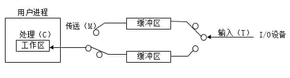

### 子题 1

- A. 100
- B. 108
- C. 162
- D. 180

- 答案：B
- 浓缩知识点：

缓冲机制核心是缓解I/O设备与CPU的速度不匹配问题，单缓冲与双缓冲是两种基础实现方案。单缓冲模式下，磁盘读入缓冲区、缓冲区数据传至用户区为连续不可拆分的阶段，必须与数据处理阶段串行执行，处理n个数据块时，若读入加传区的总时间远大于处理时间，总耗时为（读入时间T+传区时间M+处理时间C）加上(n-1)倍的T+M，因为每次都要等缓冲区完成读入和传区才能开启下一轮读入。双缓冲模式通过设置两个独立缓冲区交替使用，可让磁盘读入操作与缓冲区传区、数据处理操作并行进行，当读入时间T不小于M+C时，n个数据块总耗时为T+M+C+(n-1)*T，后续每个数据块仅需等待读入时间即可；若T小于M+C，后续每个块耗时则取T与M+C的最大值。双缓冲打破了单缓冲中缓冲区只能被单操作占用的瓶颈，让I/O与计算操作尽可能重叠，在批量处理连续数据块的场景中，相比单缓冲能大幅减少总耗时，两者的时间差就是双缓冲节约的时间，这类机制常应用于磁盘连续读写、网络批量数据接收等场景。

- 解析：

此题看起来考察磁盘管理。

### 子题 2

- A. 0
- B. 8
- C. 54
- D. 62

- 答案：C
- 浓缩知识点：

缓冲机制核心是缓解I/O设备与CPU的速度不匹配问题，单缓冲与双缓冲是两种基础实现方案。单缓冲模式下，磁盘读入缓冲区、缓冲区数据传至用户区为连续不可拆分的阶段，必须与数据处理阶段串行执行，处理n个数据块时，若读入加传区的总时间远大于处理时间，总耗时为（读入时间T+传区时间M+处理时间C）加上(n-1)倍的T+M，因为每次都要等缓冲区完成读入和传区才能开启下一轮读入。双缓冲模式通过设置两个独立缓冲区交替使用，可让磁盘读入操作与缓冲区传区、数据处理操作并行进行，当读入时间T不小于M+C时，n个数据块总耗时为T+M+C+(n-1)*T，后续每个数据块仅需等待读入时间即可；若T小于M+C，后续每个块耗时则取T与M+C的最大值。双缓冲打破了单缓冲中缓冲区只能被单操作占用的瓶颈，让I/O与计算操作尽可能重叠，在批量处理连续数据块的场景中，相比单缓冲能大幅减少总耗时，两者的时间差就是双缓冲节约的时间，这类机制常应用于磁盘连续读写、网络批量数据接收等场景。

- 解析：

此题看起来考察磁盘管理。

---

## 3. 在磁盘上存储数据的排列方式会影响 I/O 服务的总时间。假设每磁道划分成10个物理块，每块存放1个逻辑记录。逻辑记录 R1，R2， ...， R10 存放在同一个磁道上， 记录的安排顺序如下表所示: 假定磁盘的旋转速度为 30ms/周，磁头当前处在 R1的开始处。若系统顺序处理这些记录，使用单缓冲区，每个记录处理时间为 6ms，则处理这 10 个记录的最长时间为 （）；若对信息存储进行优化分布后，处理10个记录的最少时间为（）。

- 知识域：操作系统 | 知识点：磁盘管理 | 来源：2017年11月第6题
- 标签：磁盘管理、高频、第2章 计算机系统基础知识

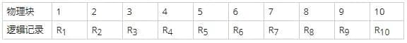

### 子题 1

- A. 189ms
- B. 208ms
- C. 289ms
- D. 306ms

- 答案：D
- 浓缩知识点：

磁盘处理同一磁道上的记录时，总耗时主要由单记录的读取处理时间和记录间的旋转定位时间构成。单记录读取时间可通过磁盘旋转一周时间除以每磁道物理块数计算，加上记录处理时间即为单记录的基础耗时。在未优化的连续顺序存储场景中，若记录处理时间大于单块读取时间，处理完当前记录后磁头会错过下一条记录的起始位置，需要额外等待旋转定位的时间，这会显著增加整体耗时。为减少这类额外开销，可采用优化存储策略，将记录按特定间隔存放，让处理完当前记录的耗时恰好匹配磁头旋转到下一条记录起始位置的时间，从而消除旋转定位延迟，此时总耗时仅为单记录基础耗时乘以记录总数。这类优化思路属于磁盘IO性能优化的一部分，核心是通过合理规划数据物理分布来减少机械操作带来的延迟，类似的还有针对寻道时间的优化算法，都是从降低机械开销角度提升IO效率的常用手段。

- 解析：

此题考察磁盘管理相关概念。
首先题干提到每磁道划分成10个物理块，并且磁头转动一周的时间是 30ms，那么扫过一个物理块的时间就是 3ms。加上处理的时间 6ms，读取并处理 R1一共需要 9 毫秒。这里有的同学会疑问，为啥不是边读取边处理，默认处理是要数据全局信息，所以需要读取完毕之后才能处理，需要两者时间相加。

而从 R2 开始，多了一个旋转定位时间，此时磁头位于 R4 开始处，磁头需重新转一圈到 R2，需要经过 8 个物理块，需要 8*3 = 24ms，然后读取 R2 并处理需要 9ms，合集需要 9 + 24 + 9 = 42ms。，后面的 R3 至 R10 与 R2 的情况一致。所以一共耗时 9 + 33 × 9 = 306 毫秒。
本题后面一问要求计算处理10个记录的最少时间。所谓分布优化，就是让R1处理完之后，磁头的位置在R2处，其实只要把记录间隔存放，就能达到这个目标。在物理块1中存放R1，在物理块4中存放R2，在物理块7中存放R3，依此类推，这样可以做到每条记录的读取与处理时间之和均为9ms，所以处理10条记录一共耗时90ms。

### 子题 2

- A. 60ms
- B. 90ms
- C. 109ms
- D. 180ms

- 答案：B
- 浓缩知识点：

磁盘处理同一磁道上的记录时，总耗时主要由单记录的读取处理时间和记录间的旋转定位时间构成。单记录读取时间可通过磁盘旋转一周时间除以每磁道物理块数计算，加上记录处理时间即为单记录的基础耗时。在未优化的连续顺序存储场景中，若记录处理时间大于单块读取时间，处理完当前记录后磁头会错过下一条记录的起始位置，需要额外等待旋转定位的时间，这会显著增加整体耗时。为减少这类额外开销，可采用优化存储策略，将记录按特定间隔存放，让处理完当前记录的耗时恰好匹配磁头旋转到下一条记录起始位置的时间，从而消除旋转定位延迟，此时总耗时仅为单记录基础耗时乘以记录总数。这类优化思路属于磁盘IO性能优化的一部分，核心是通过合理规划数据物理分布来减少机械操作带来的延迟，类似的还有针对寻道时间的优化算法，都是从降低机械开销角度提升IO效率的常用手段。

- 解析：

此题考察磁盘管理相关概念。
首先题干提到每磁道划分成10个物理块，并且磁头转动一周的时间是 30ms，那么扫过一个物理块的时间就是 3ms。加上处理的时间 6ms，读取并处理 R1一共需要 9 毫秒。这里有的同学会疑问，为啥不是边读取边处理，默认处理是要数据全局信息，所以需要读取完毕之后才能处理，需要两者时间相加。

而从 R2 开始，多了一个旋转定位时间，此时磁头位于 R4 开始处，磁头需重新转一圈到 R2，需要经过 8 个物理块，需要 8*3 = 24ms，然后读取 R2 并处理需要 9ms，合集需要 9 + 24 + 9 = 42ms。，后面的 R3 至 R10 与 R2 的情况一致。所以一共耗时 9 + 33 × 9 = 306 毫秒。
本题后面一问要求计算处理10个记录的最少时间。所谓分布优化，就是让R1处理完之后，磁头的位置在R2处，其实只要把记录间隔存放，就能达到这个目标。在物理块1中存放R1，在物理块4中存放R2，在物理块7中存放R3，依此类推，这样可以做到每条记录的读取与处理时间之和均为9ms，所以处理10条记录一共耗时90ms。

---

## 4. 在磁盘调度管理中，应先进行移臂调度，再进行旋转调度。假设磁盘移动臂位于21号柱面上，进程的请求序列如下表所示。如果采用最短移臂调度算法，那么系统的响应序列应为（）。
- 知识域：操作系统 | 知识点：磁盘管理 | 来源：2018年11月第1题
- 标签：磁盘管理、高频、第2章 计算机系统基础知识

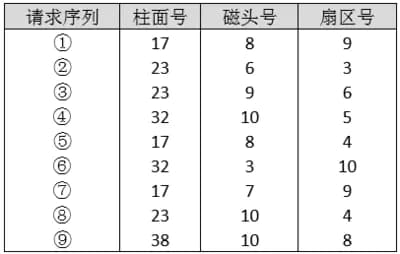

### 子题 1

- A. ②⑧③④⑤①⑦⑥⑨
- B. ②③⑧④⑥⑨①⑤⑦
- C. ①②③④⑤⑥⑦⑧⑨
- D. ②⑧③⑤⑦①④⑥⑨

- 答案：D
- 浓缩知识点：

最短移臂优先调度（SSTF）是常用的磁盘调度算法，核心是每次选择与当前磁头所在柱面距离最近的I/O请求来服务，能有效减少总寻道时间，相比先来先服务（FCFS）算法寻道效率更高，但存在远端请求长期无法被响应的“饿死”隐患。磁盘调度需遵循先移臂调度确定目标柱面，再在同一柱面内按扇区号从小到大执行旋转调度的流程，当多个I/O请求处于同一柱面时，要依据旋转调度规则排序处理。

- 解析：

本题考察的是磁盘调度算法中的最短移臂优先调度（SSTF）。
最短移臂调度算法（SSTF）是一种常见的磁盘调度算法，它的核心思想是每次选择距离当前磁头所在柱面最近的请求进行服务，以此最小化寻道时间。SSTF算法优于FCFS（先来先服务）和SCAN（电梯算法）在于能减少总的寻道时间，但也存在可能饿死远端请求的风险。
初始磁头位置在21号柱面：
第一步：离21最近的是23号柱面（距离2），请求号为②、⑧、③。由于它们位于同一柱面，按扇区号从小到大排序，响应顺序为：②⑧③。
第二步：23之后，最近的是17号柱面（距离6），请求号为⑤、⑦、①，按扇区从小到大排序，响应顺序为：⑤⑦①。
第三步：17号之后，最近的是剩下的是柱面32（请求④、⑥）。
第四步：32号之后，最近的是柱面38（请求⑨）。
最终响应序列：②⑧③⑤⑦①④⑥⑨。
因此，选项D正确。

---

## 5. 在磁盘调度管理中，应先进行移臂调度，再进行旋转调度。假设磁盘移动臂位于 20 号柱面上，进程的请求序列如下表所示。如果采用最短移臂调度算法，那么系统的单应序列应为（）
- 知识域：操作系统 | 知识点：磁盘管理 | 来源：2022年11月第4题
- 标签：磁盘管理、高频、第2章 计算机系统基础知识

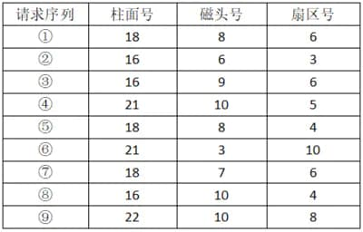

### 子题 1

- A. ②⑧③④⑤①⑦⑥⑨
- B. ②③⑧④⑥⑨①⑤⑦
- C. ④⑥⑨⑤⑦①②⑧③
- D. ④⑥⑨⑤⑦①②③⑧

- 答案：C
- 浓缩知识点：

最短寻道时间优先（SSTF）是操作系统磁盘调度中典型的移臂调度算法，核心是每次选取距离当前磁头所在柱面最近的I/O请求来执行，以此缩短整体寻道时间。磁盘调度需遵循先移臂调度、后旋转调度的顺序，通过移臂调度确定柱面的访问序列后，磁头到达目标柱面时，再通过旋转调度处理该柱面内的请求，同一柱面内通常按扇区编号由小到大（或更贴近磁头当前旋转位置）的顺序响应请求。不过该算法存在明显局限性，可能会导致距离当前磁头较远的请求长期无法得到服务，出现“饥饿”问题，实际应用中需根据业务场景合理选择调度算法。

- 解析：

本题考察的是 操作系统中磁盘调度算法（最短寻道时间优先 SSTF） 的应用。
SSTF（Shortest Seek Time First）最短寻道时间优先调度算法是指每次选择距离当前磁头所在柱面最近的请求进行服务，从而减少寻道时间。
起始位置：柱面20。
第一步：寻找距离柱面20最近的柱面请求：
柱面21（④、⑥）：距离1，柱面18（①、⑤、⑦）：距离2，柱面22（⑨）：距离2，柱面16（②、③、⑧）：距离4
最近的是柱面21，有请求④（扇区5）、⑥（扇区10），按扇区从小到大排列响应：④⑥。
第二步：当前磁头位于柱面21，继续寻找最近柱面：
柱面22（⑨）：距离1，柱面18（①、⑤、⑦）：距离3，柱面16（②、③、⑧）：距离5，优先访问柱面22的请求⑨。
第三步：当前位置柱面22，最近的是柱面18（①、⑤、⑦），距离4，按扇区从小到大响应⑤（扇区4）、⑦（扇区6）、①（扇区6）。
第四步：再到柱面16（②、③、⑧），距离2，按扇区从小到大访问②（扇区3）、⑧（扇区4）、③（扇区6）。
最终响应顺序为：④⑥⑨⑤⑦①②⑧③。
因此，选项 C 正确。

---

## 6. 当用户首次打开一个文件时，操作系统通常会执行以下哪项操作（）。
- 知识域：操作系统 | 知识点：磁盘管理 | 来源：2025年5月第21题
- 标签：磁盘管理、中等、高频、第2章 计算机系统基础知识

### 子题 1

- A. 将整个文件内容立即读入内存中
- B. 读取文件的FCB（File Control Block）或其等效的元数据结构
- C. 先将文件的一部分读入缓冲区
- D. 立即将文件加载到硬盘的缓存中

- 答案：B
- 浓缩知识点：

操作系统中，用户打开文件的核心操作并非直接读取文件内容，而是首先定位并加载该文件的文件控制块（FCB）或等效元数据结构，这类结构存储着文件的存储位置、大小、访问权限、创建与修改时间等关键管理信息，系统会将其暂存到内存的特定区域，以此建立用户进程与文件的关联，为后续的读写、修改等操作提供基础依据。为优化内存利用率与IO效率，操作系统采用按需加载策略，仅当用户发起读操作时，才会依据元数据中的位置信息从磁盘读取对应内容，部分场景下会借助缓冲区来减少磁盘IO次数，而文件访问权限校验、存储空间定位等核心环节，均依赖打开阶段加载的元数据完成。

- 解析：

本题考察的是文件系统的基本操作流程，特别是文件打开操作的内部机制。

---

## 7. 一个磁盘有 10 个磁头、10 个磁道，每个盘面 16 个扇区，系统字长 16 位，问位图存储需要多少字节（）。
- 知识域：操作系统 | 知识点：磁盘管理 | 来源：2025年11月第12题
- 标签：磁盘管理、中等、高频、第2章 计算机系统基础知识

### 子题 1

- A. 100
- B. 200
- C. 128
- D. 256

- 答案：B
- 浓缩知识点：

位图是常用的磁盘空间管理技术，核心是用单个二进制位对应一个磁盘块（通常以扇区为单位）的使用状态，位值为1代表块已占用，位值为0代表块空闲。计算位图存储容量时，先通过磁头数×磁道数×每磁道扇区数算出磁盘总块数，总块数就是位图所需的总二进制位数，再将总位数除以8转换为字节数。若涉及系统字长，当计算出的字节数不是字长对应字节数（如16位字长对应2字节）的整数倍时，需向上取整以满足字长对齐要求，部分场景下字长对最终容量无直接影响。此外，位图优势是占用空间小、块状态查询与修改效率高，适合管理块数量多的磁盘；缺点是难以快速定位连续空闲块，对大量连续空间需求的场景支持性差。

- 解析：

本题考查位图法管理磁盘空间的容量计算。
位图中每一个二进制位对应一个磁盘块，这里通常按扇区作为分配单位，因此先计算磁盘共有多少个扇区：10 个磁头表示 10 个盘面，10 个磁道、每盘面每磁道有 16 个扇区，所以总扇区数为 10×10×16＝1600，也就需要 1600 个二进制位来表示这些扇区的占用情况。
再将位数换算成字节，1600÷8＝200 字节。答案选 B。

---

> **知识点分组：进程管理**

## 8. 进程P1、P2、P3和P4的前趋图如下所示： 若用PV操作控制进程P1～P4并发执行的过程，则需要设置5个信号量S1、S2、S3、S4和S5，且信号量S1-S5的初值都等于0。下图中a、b和c处应分别填写（）；d、e和f处应分别填写（）。

- 知识域：操作系统 | 知识点：进程管理 | 来源：2013年11月第2题
- 标签：进程管理、高频、第2章 计算机系统基础知识

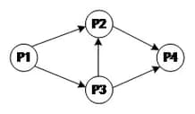
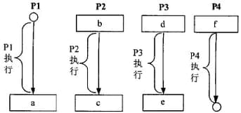

### 子题 1

- A. V(S1)V(S2)、P(S1)V(S3)和V(S4)
- B. P(S1)V(S2)、P(S1)P(S2)和V(S1)
- C. V(S1)V(S2)、P(S1)P(S3)和V(S4)
- D. P(S1)P(S2)、V(S1)P(S3)和V(S2)

- 答案：C
- 浓缩知识点：

用PV操作实现进程前驱约束是进程同步的典型应用，核心规则清晰明确：用于同步的信号量初始值需设为0，代表进程需等待前驱事件完成；前驱进程执行完毕后，要对每个对应后继的信号量执行V操作，以此传递“已完成、可启动”的信号；后继进程启动前，需对所有依赖前驱的信号量执行P操作，确保所有前置条件满足后再推进自身逻辑。当一个进程存在多个前驱时，需为每个前驱单独设置信号量，启动前依次执行对应P操作，等待所有前驱的通知；若一个进程有多个后继，要为每个后继配置独立信号量，完成后逐一执行V操作，分别触发各后继的执行。同时要牢记P操作是申请等待、V操作是释放通知，二者不能混淆，否则会打破进程间的时序约束，引发提前执行、永久等待等同步问题。这类基于信号量的同步逻辑，还可延伸应用到生产者消费者、读者写者等复杂进程协作场景，本质都是通过PV操作的配对，实现进程间的有序协作。

- 解析：

本题考察的是用信号量实现前驱约束（进程同步）。
信号量初值为0表示“需等待”。在前趋图中，每一条有向边用一个信号量表示“前驱完成后释放，后继开始时等待”。根据图中依赖关系：P1→P2 用S1，P1→P3 用S2，P3→P2 用S3，P2→P4 用S4，P3→P4 用S5。
问题1：
A选项 V(S1)V(S2)、P(S1)V(S3)和V(S4)：b处为P2开始位置，P2应等待P1与P3完成，应为P(S1)与P(S3)同时等待，但该项把P(S3)放在V后续组合不当，且缺少对S3的等待顺序一致性表达，错误。
B选项 P(S1)V(S2)、P(S1)P(S2)和V(S1)：a处在P1末尾应释放给P2和P3的两个信号量，应为V(S1)与V(S2)，而不是P；c处应释放给P4的是S4，而不是V(S1)，错误。
C选项 V(S1)V(S2)、P(S1)P(S3)和V(S4)：a为P1结束后向P2、P3分别发信号，故V(S1)V(S2)正确；b为P2开始需等待来自P1和P3的S1与S3，故P(S1)P(S3)正确；c为P2结束后通知P4可继续，故V(S4)正确。此项正确。
D选项 P(S1)P(S2)、V(S1)P(S3)和V(S2)：a处错误地用P；c处应发S4而非S2，错误。
所以选择 C。

### 子题 2

- A. P(S2)、V(S3)V(S5)和P(S4)P(S5)
- B. V(S2)、P(S3)V(S5)和V(S4)P(S5)
- C. P(S2)、V(S3)P(S5)和P(S4)V(S5)
- D. V(S2)、V(S3)P(S5)和P(S4)V(S5)

- 答案：A
- 浓缩知识点：

用PV操作实现进程前驱约束是进程同步的典型应用，核心规则清晰明确：用于同步的信号量初始值需设为0，代表进程需等待前驱事件完成；前驱进程执行完毕后，要对每个对应后继的信号量执行V操作，以此传递“已完成、可启动”的信号；后继进程启动前，需对所有依赖前驱的信号量执行P操作，确保所有前置条件满足后再推进自身逻辑。当一个进程存在多个前驱时，需为每个前驱单独设置信号量，启动前依次执行对应P操作，等待所有前驱的通知；若一个进程有多个后继，要为每个后继配置独立信号量，完成后逐一执行V操作，分别触发各后继的执行。同时要牢记P操作是申请等待、V操作是释放通知，二者不能混淆，否则会打破进程间的时序约束，引发提前执行、永久等待等同步问题。这类基于信号量的同步逻辑，还可延伸应用到生产者消费者、读者写者等复杂进程协作场景，本质都是通过PV操作的配对，实现进程间的有序协作。

- 解析：

本题考察的是用信号量实现前驱约束（进程同步）。
信号量初值为0表示“需等待”。在前趋图中，每一条有向边用一个信号量表示“前驱完成后释放，后继开始时等待”。根据图中依赖关系：P1→P2 用S1，P1→P3 用S2，P3→P2 用S3，P2→P4 用S4，P3→P4 用S5。
问题2：
A选项 P(S2)、V(S3)V(S5)和P(S4)P(S5)：d为P3开始需等待来自P1的S2，故P(S2)正确；e为P3结束后需分别通知P2与P4，故V(S3)V(S5)正确；f为P4开始需等待来自P2与P3的S4与S5，故P(S4)P(S5)正确。此项正确。
B选项 V(S2)、P(S3)V(S5)和V(S4)P(S5)：d应为等待而非释放，V(S2)错误；f应为等待两个信号量而非对S4执行V，错误。
C选项 P(S2)、V(S3)P(S5)和P(S4)V(S5)：e处对S5不应等待而应释放，P(S5)错误；f处对S5不应释放而应等待，V(S5)错误。
D选项 V(S2)、V(S3)P(S5)和P(S4)V(S5)：同样把等待与释放颠倒，错误。
所以选择 A。

---

## 9. 在实时操作系统中，两个任务并发执行，一个任务要等待另一个任务发来消息，或建立某个条件后再向前执行，这种制约性合作关系被称为任务的（）。
- 知识域：操作系统 | 知识点：进程管理 | 来源：2013年11月第5题
- 标签：进程管理、高频、第2章 计算机系统基础知识

### 子题 1

- A. 同步
- B. 互斥
- C. 调度
- D. 执行

- 答案：A
- 浓缩知识点：

进程同步是并发执行的多个进程或任务间的一种时序协作制约关系，核心是保障任务按预期的先后次序协同推进，比如某任务需等待其他任务完成特定操作、传递消息或满足预设条件后，才能继续执行后续流程，像生产者-消费者模型中消费者等待生产者生成数据的场景就属于典型的同步应用。它和进程互斥存在本质区别，互斥是解决多任务对临界资源的访问冲突问题，聚焦资源的排他性访问，而同步侧重任务间的时序配合。在实时操作系统中，同步机制是保障任务执行时序正确性、实现复杂任务协作的关键基础，广泛应用于工业控制、嵌入式设备等对时序要求严苛的场景。

- 解析：

本题考察的是进程管理中的同步与互斥。
同步：指多个任务之间在执行过程中存在一定的先后次序，一个任务需要等待另一个任务满足条件或发来消息后才能继续执行，这是一种时序上的协作关系；互斥：指多个任务不能同时访问某个共享资源，是资源访问冲突的解决机制，与题干所述的时序协调无关；调度：是操作系统根据策略分配 CPU 等资源给不同任务的过程，不涉及任务间的时序合作；执行：仅指任务运行的过程，不是任务间合作关系的术语。
本小问答案是 同步。指多个任务之间在执行过程中存在一定的先后次序，一个任务需要等待另一个任务满足条件或发来消息后才能继续执行，这是一种时序上的协作关系。
因此，选项 A 正确。

---

## 10. 某航空公司机票销售系统有 n 个售票点，该系统为每个售票点创建一个进程 Pi（i=1，2，...，n）管理机票销售。假设 Tj（j=1，2，...，m）单元存放某日某航班的机票剩余票数，Temp 为 Pi 进程的临时工作单元，x 为某用户的订票张数。初始化时系统应将信号量 S 赋值为（）。Pi 进程的工作流程如下图所示，若用 P 操作和 V 操作实现进程间的同步与互斥，则图中空（a），空（b）和空（c）处应分别填入（）。
- 知识域：操作系统 | 知识点：进程管理 | 来源：2015年11月第1题
- 标签：进程管理、高频、第2章 计算机系统基础知识

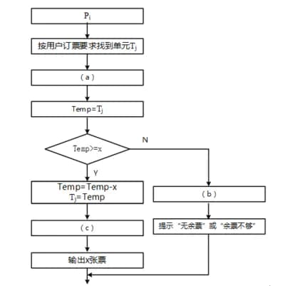

### 子题 1

- A. 0
- B. 1
- C. 2
- D. 3

- 答案：B
- 浓缩知识点：

互斥信号量是实现进程互斥访问临界资源的核心机制，临界资源指一次仅能被一个进程访问的资源，比如共享数据、独占硬件等。互斥信号量的初始值固定为1，标识临界资源初始处于可用状态，仅允许一个进程进入对应的临界区。使用时需遵循固定逻辑：进入临界区前必须执行P操作申请资源，若信号量值为0则进程阻塞等待；无论临界区内的操作成功或失败，只要退出临界区就必须执行V操作释放资源，确保信号量回归可用状态，避免出现资源竞争、死锁或进程永久阻塞的问题。此外，P、V操作属于原子操作，执行过程不可被中断，这是保证互斥机制有效的关键，能彻底防止多个进程同时操作临界资源引发的数据错乱等异常。

- 解析：

本题考察的是信号量在进程互斥中的应用。
本小问答案是 1。允许一次仅一个进程进入临界区，满足互斥要求。
A. 0：表示资源不可用，会导致所有进程一开始就阻塞，错误。
B. 1：允许一次仅一个进程进入临界区，满足互斥要求，正确。
C. 2：与题干限定不匹配，错误。
D. 3：会允许同时多个进程进入临界区，破坏互斥，错误。
因此，选项 B 正确。

### 子题 2

- A. P（S），V（S）和V（S）
- B. P（S），P（S）和V（S）
- C. V（S），P（S）和P（S）
- D. V（S），V（S）和P（S）

- 答案：A
- 浓缩知识点：

互斥信号量是实现进程互斥访问临界资源的核心机制，临界资源指一次仅能被一个进程访问的资源，比如共享数据、独占硬件等。互斥信号量的初始值固定为1，标识临界资源初始处于可用状态，仅允许一个进程进入对应的临界区。使用时需遵循固定逻辑：进入临界区前必须执行P操作申请资源，若信号量值为0则进程阻塞等待；无论临界区内的操作成功或失败，只要退出临界区就必须执行V操作释放资源，确保信号量回归可用状态，避免出现资源竞争、死锁或进程永久阻塞的问题。此外，P、V操作属于原子操作，执行过程不可被中断，这是保证互斥机制有效的关键，能彻底防止多个进程同时操作临界资源引发的数据错乱等异常。

- 解析：

本题考察的是信号量在进程互斥中的应用。
本小问答案是 P（S），V（S）和V（S）。Pi 进程的工作流程如下图所示，若用 P 操作和 V 操作实现进程间的同步与互斥，则图中空（a），空（b）和空（c）处应分别填入P（S），V（S）和V（S）。
A. P（S），V（S）和V（S）：P（S），V（S）和V（S）与题干限定一致，正确。
B. P（S），P（S）和V（S）：与题干限定不匹配，错误。
C. V（S），P（S）和P（S）：与题干限定不匹配，错误。
D. V（S），V（S）和P（S）：与题干限定不匹配，错误。
因此，选项 A 正确。

---

## 11. 若系统中存在 n 个等待事务Ti（i =0，1，2，...，n-1），其中：T0 正等待被 T1 锁住的数据项 A1，T1 正等待被 T2 锁住的数据项 A2，...，Ti 正等待被 Ti+1 锁住的数据项 Ai+1，...，Tn-1 正等待被 T0 锁住的数据项 A0，则系统处于（）状态。
- 知识域：操作系统 | 知识点：进程管理 | 来源：2015年11月第3题
- 标签：进程管理、中等、高频、第2章 计算机系统基础知识

### 子题 1

- A. 封锁
- B. 死锁
- C. 循环
- D. 并发处理

- 答案：B
- 浓缩知识点：

死锁是指一组进程或事务在并发执行时，因互相等待对方独占的资源，陷入全部无法继续推进的僵持状态。构成死锁需同时满足四个必要条件：一是互斥条件，资源仅能被一个进程独占使用；二是请求和保持条件，进程已持有部分资源，仍请求其他进程占有的资源；三是不剥夺条件，进程已占有的资源不能被强制剥夺；四是环路等待条件，进程间形成环形的资源等待链，比如事务依次循环等待对方资源的闭环结构。此外要明确，封锁只是事务独占资源的手段，单独封锁不会必然引发死锁；并发处理是进程同时执行的状态，和死锁的资源僵持状态完全不同，“循环”只是死锁环路等待特征的通俗表述，并非专业的系统状态术语。

- 解析：

本题考察的是死锁的概念及必要条件。
此外要明确，封锁只是事务独占资源的手段，单独封锁不会必然引发死锁。并发处理是进程同时执行的状态，和死锁的资源僵持状态完全不同，“循环”只是死锁环路等待特征的通俗表述，并非专业的系统状态术语。
本小问答案是 死锁。题干中的“i 正等待被 Ti+1 锁住的数据项 Ai+1，...，Tn-1 正等待被 T0 锁住的数据项 A0，则系统处于死锁状态”对应死锁。
因此，选项 B 正确。

---

## 12. 某计算机系统中的进程管理采用三态模型，那么下图所示的PCB（进程控制块）的组织方式采用（），图中（）。
- 知识域：操作系统 | 知识点：进程管理 | 来源：2018年11月第2题
- 标签：进程管理、中等、高频、第2章 计算机系统基础知识

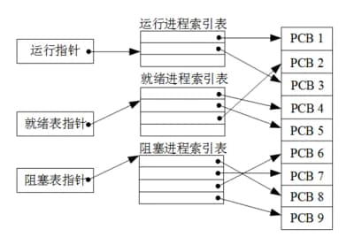

### 子题 1

- A. 顺序方式
- B. 链接方式
- C. 索引方式
- D. Hash

- 答案：C
- 浓缩知识点：

进程三态模型将进程分为运行态、就绪态、阻塞态三类核心状态，进程控制块（PCB）是操作系统管控进程的核心数据载体，其常见组织方式有四种：顺序方式是把所有PCB按进程号或创建顺序线性存放，查找效率偏低，适合进程数量少的系统；链接方式是按进程状态将PCB分别组成链表，比如就绪队列、阻塞队列，便于灵活处理进程状态转换；索引方式是为不同状态的进程单独建立索引表，表项存储对应PCB的内存指针，查找定位效率高，多处理器系统中常用这种方式，统计各状态进程数时，直接计数对应索引表的表项数量即可；Hash方式是根据PCB的某一关键字做散列存储，查找速度快但需解决散列冲突问题。

- 解析：

本题考察的是PCB（进程控制块）的组织方式及三态进程模型。
进程三态模型将进程分为运行态、就绪态、阻塞态三类核心状态，进程控制块（PCB）是操作系统管控进程的核心数据载体，其常见组织方式有四种：顺序方式是把所有PCB按进程号或创建顺序线性存放，查找效率偏低，适合进程数量少的系统。链接方式是按进程状态将PCB分别组成链表，比如就绪队列、阻塞队列，便于灵活处理进程状态转换。索引方式是为不同状态的进程单独建立索引表，表项存储对应PCB的内存指针，查找定位效率高，多处理器系统中常用这种方式，统计各状态进程数时，直接计数对应索引表的表项数量即可。Hash方式是根据PCB的某一关键字做散列存储，查找速度快但需解决散列冲突问题。
本小问答案是 索引方式。题干中的“某计算机系统中的进程管理采用三态模型，那么下图所示的PCB（进程控制块）的组织方式”对应索引方式。
因此，选项 C 正确。

### 子题 2

- A. 有1个运行进程，2个就绪进程，4个阻塞进程
- B. 有2个运行进程，3个就绪进程，3个阻塞进程
- C. 有2个运行进程，3个就绪进程，4个阻塞进程
- D. 有3个运行进程，2个就绪进程，4个阻塞进程

- 答案：C
- 浓缩知识点：

进程三态模型将进程分为运行态、就绪态、阻塞态三类核心状态，进程控制块（PCB）是操作系统管控进程的核心数据载体，其常见组织方式有四种：顺序方式是把所有PCB按进程号或创建顺序线性存放，查找效率偏低，适合进程数量少的系统；链接方式是按进程状态将PCB分别组成链表，比如就绪队列、阻塞队列，便于灵活处理进程状态转换；索引方式是为不同状态的进程单独建立索引表，表项存储对应PCB的内存指针，查找定位效率高，多处理器系统中常用这种方式，统计各状态进程数时，直接计数对应索引表的表项数量即可；Hash方式是根据PCB的某一关键字做散列存储，查找速度快但需解决散列冲突问题。

- 解析：

本题考察的是PCB（进程控制块）的组织方式及三态进程模型。
本小问答案是 有2个运行进程，3个就绪进程，4个阻塞进程。，图中有2个运行进程，3个就绪进程，4个阻塞进程。
A. 有1个运行进程，2个就绪进程，4个阻塞进程：与题干限定不匹配，错误。
B. 有2个运行进程，3个就绪进程，3个阻塞进程：与题干限定不匹配，错误。
C. 有2个运行进程，3个就绪进程，4个阻塞进程：有2个运行进程，3个就绪进程，4个阻塞进程与题干限定一致，正确。
D. 有3个运行进程，2个就绪进程，4个阻塞进程：与题干限定不匹配，错误。
因此，选项 C 正确。

---

## 13. 在支持多线程的操作系统中，假设进程 P 创建了线程 T1、T2 和 T3，那么下列说法正确的是（）。
- 知识域：操作系统 | 知识点：进程管理 | 来源：2020年11月第2题
- 标签：进程管理、高频、第2章 计算机系统基础知识

### 子题 1

- A. 该进程中已打开的文件是不能被 T1、T2 和 T3 共享的
- B. 该进程中T1的栈指针是不能被 T2 共享的，但可被 T3 共享
- C. 该进程中 T1 的栈指针是不能被 T2 和 T3 共享的
- D. 该进程中某线程的栈指针是可以被 T1、T2 和 T3 共享的

- 答案：C
- 浓缩知识点：

在支持多线程的操作系统中，同一进程下的多个线程共享进程级核心资源，包括代码段、数据段、堆内存、已打开的文件句柄、信号量、全局变量、定时器等，这些资源由进程统一管理，线程可共同访问以实现协作。同时每个线程拥有独立的私有运行上下文，涵盖寄存器集合（包含栈指针）、专属线程栈、线程局部存储、程序计数器等，这类私有资源是线程独立执行任务的基础，能避免线程间执行状态互相干扰，保障多线程并发执行的有序性，比如线程栈用于存储自身函数调用的局部变量、返回地址，栈指针指向当前栈帧位置，这类资源无法被其他线程访问。

- 解析：

本题考察的是线程与进程资源的共享与私有的基本概念。

---

## 14. 假设系统中互斥资源R的可用数为25。T0时刻进程P1、P2、P3、P4 对资源R的最大需求数、已分配资源数和尚需资源数的情况如表a所示，则系统（）。
- 知识域：操作系统 | 知识点：进程管理 | 来源：2021年11月第5题
- 标签：进程管理、中等、高频、第2章 计算机系统基础知识

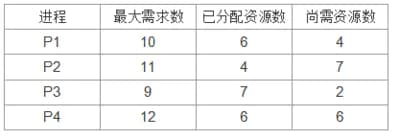

### 子题 1

- A. 只能先给 P1 进行分配，因为分配后系统状态是安全的
- B. 只能先给 P3 进行分配，因为分配后系统状态是安全的
- C. 可以先给 P1、P3 进行分配，因为分配后系统状态是安全的
- D. 不能给 P3 进行分配，因为分配后系统状态是不安全的

- 答案：B
- 浓缩知识点：

银行家算法是操作系统中用于避免死锁的经典算法，核心通过判断系统是否处于安全状态，即存在安全序列，来决定资源分配。计算当前可用资源时，用系统总资源减去各进程已分配资源的总和。安全状态的判定逻辑为：若存在某个进程的尚需资源数小于等于当前可用资源，即可优先为其分配资源，待该进程完成后释放其占用的全部资源，更新系统可用资源，再重复此过程，若最终所有进程都能依次完成，则系统处于安全状态。需要注意的是，不安全状态并不等同于必然死锁，但安全状态可确保系统不会进入死锁；当拟为某进程分配资源时，需先模拟分配操作，再检查是否仍能构造出安全序列，若无法构造则不可分配，反之则可执行分配。

- 解析：

本题考察的是银行家算法与系统安全状态（安全序列） 的判定。

---

## 15. 要实现多任务间的协同工作，操作系统必须提供任务间的通信手段。嵌入式操作系统一般都会提供多任务间通信的方法，其中（）是任务间最直接、最明显的通信方法，也是访问共享的数据结构，即不同的任务都可以访问同一地址空间。（）作为一种更高级的通信方式，能够在同一处理器的各个任务间传递任意长度（理论上只受物理内存和机器字长限制）的信息。
- 知识域：操作系统 | 知识点：进程管理 | 来源：2023年11月第1题
- 标签：进程管理、高频、第2章 计算机系统基础知识

### 子题 1

- A. 共享内存
- B. Socket
- C. 消息传递
- D. 信号量

- 答案：A
- 浓缩知识点：

嵌入式多任务通信与同步机制中，共享内存是任务间最直接高效的通信方式，它通过让不同任务访问同一地址空间实现数据结构共享，无需数据拷贝，通信速度最快，但自身缺乏消息边界与访问控制逻辑，通常需搭配信号量等同步工具避免数据竞争。消息队列属于高级异步通信机制，支持在同处理器任务间传递任意长度（理论上受物理内存限制）的结构化消息，具备明确的消息边界与排队调度能力，可有效解耦任务执行时序，适配需完整消息传递、异步协作的场景。此外，信号量并非通信手段，核心作用是任务同步与临界区互斥管控，无数据传输能力；Socket多用于跨主机或网络环境的任务/进程通信，在嵌入式单处理器本地任务通信中因开销较高较少作为优先选择。

- 解析：

本题考察的是要实现多任务间的协同工作，操作系统必须提供任务间的通信手段。嵌入式操作系相关知识。
嵌入式多任务通信与同步机制中，共享内存是任务间最直接高效的通信方式，它通过让不同任务访问同一地址空间实现数据结构共享，无需数据拷贝，通信速度最快，但自身缺乏消息边界与访问控制逻辑，通常需搭配信号量等同步工具避免数据竞争。Socket多用于跨主机或网络环境的任务/进程通信，在嵌入式单处理器本地任务通信中因开销较高较少作为优先选择。消息队列属于高级异步通信机制，支持在同处理器任务间传递任意长度（理论上受物理内存限制）的结构化消息，具备明确的消息边界与排队调度能力，可有效解耦任务执行时序，适配需完整消息传递、异步协作的场景。
本小问答案是 共享内存。题干中的“任务间最直接、最明显的通信方法，也是访问共享的数据结构，即不同的任务都可以访问同一地址空间”对应共享内存。
因此，选项 A 正确。

### 子题 2

- A. 共享内存
- B. Socket
- C. 消息队列
- D. 信号量

- 答案：C
- 浓缩知识点：

嵌入式多任务通信与同步机制中，共享内存是任务间最直接高效的通信方式，它通过让不同任务访问同一地址空间实现数据结构共享，无需数据拷贝，通信速度最快，但自身缺乏消息边界与访问控制逻辑，通常需搭配信号量等同步工具避免数据竞争。消息队列属于高级异步通信机制，支持在同处理器任务间传递任意长度（理论上受物理内存限制）的结构化消息，具备明确的消息边界与排队调度能力，可有效解耦任务执行时序，适配需完整消息传递、异步协作的场景。此外，信号量并非通信手段，核心作用是任务同步与临界区互斥管控，无数据传输能力；Socket多用于跨主机或网络环境的任务/进程通信，在嵌入式单处理器本地任务通信中因开销较高较少作为优先选择。

- 解析：

本题考察的是要实现多任务间的协同工作，操作系统必须提供任务间的通信手段。嵌入式操作系相关知识。
嵌入式多任务通信与同步机制中，共享内存是任务间最直接高效的通信方式，它通过让不同任务访问同一地址空间实现数据结构共享，无需数据拷贝，通信速度最快，但自身缺乏消息边界与访问控制逻辑，通常需搭配信号量等同步工具避免数据竞争。Socket多用于跨主机或网络环境的任务/进程通信，在嵌入式单处理器本地任务通信中因开销较高较少作为优先选择。消息队列属于高级异步通信机制，支持在同处理器任务间传递任意长度（理论上受物理内存限制）的结构化消息，具备明确的消息边界与排队调度能力，可有效解耦任务执行时序，适配需完整消息传递、异步协作的场景。
本小问答案是 消息队列。题干中的“消息队列作为一种更高级的通信方式，能够在同一处理器的各个任务间传递任意长度（理论上只受物理内存和机器字长限制）的信息”对应消息队列。
因此，选项 C 正确。

---

## 16. 单 CPU 系统中，多任务并发运行时采用的运行方式是（）。
- 知识域：操作系统 | 知识点：进程管理 | 来源：2023年11月第13题
- 标签：进程管理、中等、高频、第2章 计算机系统基础知识

### 子题 1

- A. 顺序运行
- B. 任务交替运行
- C. 并行运行
- D. 以上都不是

- 答案：B
- 浓缩知识点：

单核CPU系统中，多任务并发并非真正的同时运行，由于单核核心同一时间仅能处理一个任务，操作系统会借助时间分片调度机制，让多个任务交替占用CPU执行，每个任务仅在CPU上运行一小段毫秒级的时间就触发切换，从用户视角看会产生多个任务同时运行的错觉，这是并发执行的典型表现。要注意区分并发与并行两个概念：并发是宏观上多个任务同时推进、微观上交替执行，适配单核运行环境；而并行则是依托多个CPU核心，让多个任务真正在同一时间同步执行，多见于多核或多处理器系统。操作系统通过上下文切换完成任务间的切换操作，这也是进程与线程调度的核心基础，能有效提升系统资源利用率与整体任务处理效率。

- 解析：

本题考察的是进程管理的基本概念。
顺序运行：指的是程序或任务按顺序一个接一个执行，通常在单任务系统中使用。多任务系统中不会采用顺序运行来处理多个任务；任务交替运行：在单核 CPU 的系统中，虽然有多个任务同时存在，但由于 CPU 的核心数量限制，实际上每次只能运行一个任务。操作系统通过时间分片的方式，轮流让不同任务执行。每个任务在 CPU 上执行一段时间（如 0.01 秒），然后切换到下一个任务，这种方式称为任务交替运行。表面上看，多个任务是同时运行...；并行运行：指的是多个任务在多个 CPU 核心上同时执行。单 CPU 系统由于只有一个处理器，不可能实现并行运行，只能实现任务交替运行。
本小问答案是 任务交替运行。在单核 CPU 的系统中，虽然有多个任务同时存在，但由于 CPU 的核心数量限制，实际上每次只能运行一个任务。操作系统通过时间分片的方式，轮流让不同任务执行。每个任务在 CPU 上执行一段时间（如 0.01 秒），然后切换到下一个任务，这种方式称为任务交替运行。表面上看，多个任务是同时运行...
因此，选项 B 正确。

---

## 17. 操作系统中，（）是资源分配和管理的最小单位。
- 知识域：操作系统 | 知识点：进程管理 | 来源：2023年11月第25题
- 标签：进程管理、高频、第2章 计算机系统基础知识

### 子题 1

- A. 进程
- B. 线程
- C. 作业
- D. 程序段

- 答案：A
- 浓缩知识点：

在操作系统中，进程是进行资源分配和管理的最小单位，它是拥有独立功能的程序执行活动，操作系统的各类资源调度与管理操作均围绕进程展开。与之相关的概念需明确区分：线程是进程内部的基本执行单元，是CPU调度和执行的最小单位，自身不独立拥有系统资源，依赖所属进程获取资源；作业是用户提交给操作系统的任务集合，可包含一个或多个进程，作业调度侧重于对多进程的整体管理；程序段则是程序中可独立执行的代码片段，不属于资源管理的基本单位，仅为程序内部的逻辑结构部分。

- 解析：

本题考察的是操作系统中，（）是资源分配和管理的最小单位相关知识。
与之相关的概念需明确区分：线程是进程内部的基本执行单元，是CPU调度和执行的最小单位，自身不独立拥有系统资源，依赖所属进程获取资源。作业是用户提交给操作系统的任务集合，可包含一个或多个进程，作业调度侧重于对多进程的整体管理。程序段则是程序中可独立执行的代码片段，不属于资源管理的基本单位，仅为程序内部的逻辑结构部分。
本小问答案是 进程。题干中的“资源分配和管理的最小单位”对应进程。
因此，选项 A 正确。

---

## 18. （）设计规定软件设计人员应为软件组件定义正式、精确和可验证的接口规范，该规范应使用前提条件、后置条件和不变式来扩展抽象数据类型的普通定义。
- 知识域：操作系统 | 知识点：进程管理 | 来源：2023年11月第26题
- 标签：进程管理、中等、高频、第2章 计算机系统基础知识

### 子题 1

- A. 契约式
- B. 面向对象
- C. 结构化
- D. 原型

- 答案：A
- 浓缩知识点：

契约式设计（DbC）是一种聚焦组件接口约束的软件设计方法论，核心是为软件组件制定正式、精确且可验证的接口规范，通过前提条件、后置条件、不变式三个核心要素拓展抽象数据类型定义。其中，前提条件明确调用组件前调用者需满足的要求，后置条件规定组件执行后要达成的结果状态，不变式是组件全生命周期内必须持续维持的属性规则。它区别于侧重对象封装继承的面向对象设计、关注模块功能分解的结构化设计、聚焦需求快速验证的原型设计，通过清晰的契约约束强化组件间可信协作，能显著提升系统可靠性与可维护性，相关规范还可作为组件测试、验证的明确依据，在大型分布式系统、金融航天等高可靠性要求的软件开发场景中应用广泛。

- 解析：

本题考察的是契约式设计的基本概念。
它区别于侧重对象封装继承的面向对象设计、关注模块功能分解的结构化设计、聚焦需求快速验证的原型设计，通过清晰的契约约束强化组件间可信协作，能显著提升系统可靠性与可维护性，相关规范还可作为组件测试、验证的明确依据，在大型分布式系统、金融航天等高可靠性要求的软件开发场景中应用广泛。契约式设计（DbC）是一种聚焦组件接口约束的软件设计方法论，核心是为软件组件制定正式、精确且可验证的接口规范，通过前提条件、后置条件、不变式三个核心要素拓展抽象数据类型定义。
本小问答案是 契约式。题干中的“契约式设计规定软件设计人员应为软件组件定义正式、精确和可验证的接口规范，该规范应使用前提条件、后置条件和不变式来扩展抽”对应契约式。
因此，选项 A 正确。

---

## 19. 多道程序设计技术不仅使CPU得到充分利用，同时改善 I/O设备和内存的（），从而提高了整个系统的资源利用率和系统吞吐量（单位时间内处理作业（程序）的个数），最终提高了整个系统的效率。
- 知识域：操作系统 | 知识点：进程管理 | 来源：2024年5月第2题
- 标签：进程管理、中等、高频、第2章 计算机系统基础知识

### 子题 1

- A. 可靠性
- B. 利用率
- C. 稳定性
- D. 兼容性

- 答案：B
- 浓缩知识点：

多道程序设计技术的核心逻辑是当某个作业因等待I/O操作进入阻塞状态时，CPU不会闲置，而是立即调度执行其他就绪状态的作业，以此实现CPU、内存、I/O设备等系统资源的并发交替运作。该技术的核心价值在于大幅提升各类系统资源的利用率，进而提高系统吞吐量与整体运行效率，需要注意的是，它并不直接作用于系统的可靠性、稳定性与兼容性，其中可靠性关乎系统故障频率，稳定性侧重性能恒定表现，兼容性指向软硬件协同能力，这些均与多道程序设计的核心目标无关。

- 解析：

本题考察的是多道程序设计技术的优势和作用。
该技术的核心价值在于大幅提升各类系统资源的利用率，进而提高系统吞吐量与整体运行效率，需要注意的是，它并不直接作用于系统的可靠性、稳定性与兼容性，其中可靠性关乎系统故障频率，稳定性侧重性能恒定表现，兼容性指向软硬件协同能力，这些均与多道程序设计的核心目标无关。
本小问答案是 利用率。题干中的“道程序设计技术不仅使CPU得到充分利用，同时改善 I/O设备和内存的利用率从而提高了整个系统的资源利用率和系统吞吐量（单位时间内处理作业（程序）的个数”对应利用率。
因此，选项 B 正确。

---

## 20. 操作系统进程在其存在的过程中存在三种状态，下列那种状态转换是不能发生的（）。
- 知识域：操作系统 | 知识点：进程管理 | 来源：2024年5月第30题
- 标签：进程管理、中等、高频、第2章 计算机系统基础知识

### 子题 1

- A. 等待到执行
- B. 等待到就绪
- C. 就绪到执行
- D. 执行到等待

- 答案：A
- 浓缩知识点：

操作系统进程核心三态为就绪、执行、等待，就绪态是进程已获取除CPU外的全部资源，等待调度器分配CPU；执行态是进程正占用CPU运行；等待态是进程因等待I/O完成、资源释放等事件，主动放弃CPU暂停运行。合法状态转换包括：就绪到执行（调度器选中进程）、执行到就绪（时间片耗尽或被高优先级进程抢占）、执行到等待（进程触发等待事件）、等待到就绪（等待的事件完成）。其中存在关键的非法转换逻辑：等待态无法直接跳转至执行态，必须先转为就绪态，经调度器调度后才能进入执行态，因为等待态进程未完成前置事件准备，不具备直接占用CPU运行的条件。此外可拓展了解，部分系统在三态基础上还增加了创建、终止状态，构成五态模型，但三态仍是进程状态转换的核心基础。

- 解析：

本题考察的是操作系统中进程的三态模型，即就绪（Ready）、执行（Running）、等待（Blocked） 三种基本状态及其之间的转换。
合法状态转换包括：就绪到执行（调度器选中进程）、执行到就绪（时间片耗尽或被高优先级进程抢占）、执行到等待（进程触发等待事件）、等待到就绪（等待的事件完成）。其中存在关键的非法转换逻辑：等待态无法直接跳转至执行态，必须先转为就绪态，经调度器调度后才能进入执行态，因为等待态进程未完成前置事件准备，不具备直接占用CPU运行的条件。此外可拓展了解，部分系统在三态基础上还增加了创建、终止状态，构成五态模型，但三态仍是进程状态转换的核心基础。
本小问答案是 等待到执行。题干中的“操作系统进程在其存在的过程中存在三种状态，下列那种状态转换是不能发生的等待到执行”对应等待到执行。
因此，选项 A 正确。

---

## 21. 下面哪一个不属于操作系统死锁预防的办法，（）。
- 知识域：操作系统 | 知识点：进程管理 | 来源：2024年11月第7题
- 标签：进程管理、中等、高频、第2章 计算机系统基础知识

### 子题 1

- A. 破坏互斥
- B. 破坏请求和保持
- C. 破坏不可抢占
- D. 破坏循环等待

- 答案：A
- 浓缩知识点：

死锁预防的核心逻辑是破坏死锁产生的四大必要条件中的任意一个，这四大必要条件分别是互斥、请求与保持、不可剥夺、循环等待。在实际的操作系统设计中，常用的预防策略主要针对后三个条件展开：破坏请求和保持可通过两种方式实现，一是要求进程在执行前一次性申请所需的全部资源，二是规定进程申请新资源前必须释放已持有的所有资源；破坏不可抢占则是允许系统在进程无法获取所需新资源时，强制收回该进程已占用的资源，调配给其他进程使用；破坏循环等待通常采用资源有序分配法，即给所有资源统一编号，要求进程严格按照编号递增的顺序申请资源，从根源上避免资源请求环路的形成。而互斥条件因多数独占型资源如打印机、磁带机等的物理或逻辑特性，天然要求同一时间只能被一个进程占用，无法通过操作系统手段人为消除，因此破坏互斥并不是一种实际可行的死锁预防手段。

- 解析：

本题考察的是死锁预防的基本策略。
在实际的操作系统设计中，常用的预防策略主要针对后三个条件展开：破坏请求和保持可通过两种方式实现，一是要求进程在执行前一次性申请所需的全部资源，二是规定进程申请新资源前必须释放已持有的所有资源。而互斥条件因多数独占型资源如打印机、磁带机等的物理或逻辑特性，天然要求同一时间只能被一个进程占用，无法通过操作系统手段人为消除，因此破坏互斥并不是一种实际可行的死锁预防手段。破坏不可抢占则是允许系统在进程无法获取所需新资源时，强制收回该进程已占用的资源，调配给其他进程使用。破坏循环等待通常采用资源有序分配法，即给所有资源统一编号，要求进程严格按照编号递增的顺序申请资源，从根源上避免资源请求环路的形成。
本小问答案是 破坏互斥。而互斥条件因多数独占型资源如打印机、磁带机等的物理或逻辑特性，天然要求同一时间只能被一个进程占用，无法通过操作系统手段人为消除，因此破坏互斥并不是一种实际可行的死锁预防手段。
因此，选项 A 正确。

---

## 22. 操作系统低优先级进程被高优进程抢占或者时间片用光，由执行态变（）。
- 知识域：操作系统 | 知识点：进程管理 | 来源：2024年11月第9题
- 标签：进程管理、高频、第2章 计算机系统基础知识

### 子题 1

- A. 就绪态
- B. 等待态
- C. 睡眠态
- D. 阻塞态

- 答案：A
- 浓缩知识点：

进程存在就绪态、执行态、阻塞态三种基本状态，其中阻塞态也可被称为等待态或睡眠态。进程状态会随系统场景发生转换：就绪态进程被CPU调度选中后将进入执行态；处于执行态的进程，若时间片用尽或是被高优先级进程抢占，会转为就绪态等待下一次调度，这类状态切换由调度策略引发，并非资源缺失导致；若执行态进程需要等待特定资源或事件（如I/O操作完成），则会进入阻塞态；当阻塞态进程等待的事件达成后，会重新回到就绪态，等待CPU调度。

- 解析：

本题考察的是进程三态模型。
进程存在就绪态、执行态、阻塞态三种基本状态，其中阻塞态也可被称为等待态或睡眠态。当阻塞态进程等待的事件达成后，会重新回到就绪态，等待CPU调度。
本小问答案是 就绪态。题干中的“操作系统低优先级进程被高优进程抢占或者时间片用光，由执行态变就绪态”对应就绪态。
因此，选项 A 正确。

---

## 23. 一个多道批处理系统中仅有P1和P2两个作业，P2比P1晚20ms到达，它们的计算和I/O操作顺序如下： P1: 计算40ms，I/O 60ms，计算40ms P2: 计算100ms，I/O 40ms，计算40ms 若不考虑调度和切换时间，则完成两个作业需要的时间最少是（）。

- 知识域：操作系统 | 知识点：进程管理 | 来源：2024年11月第15题
- 标签：进程管理、中等、高频、第2章 计算机系统基础知识

### 子题 1

- A. 190
- B. 200
- C. 210
- D. 220

- 答案：D
- 浓缩知识点：

多道批处理系统的核心优势在于通过资源并行利用提升效率，其逻辑是当某个作业因等待I/O操作暂停执行时，操作系统会将CPU分配给其他就绪作业，避免CPU空闲，同时I/O设备与CPU可并行运作，这是它区别于单道批处理系统的关键。在计算多道作业的最短完成时间时，核心是梳理各作业的到达时间、计算与I/O各阶段的时长，跟踪CPU与I/O资源的占用节点：作业I/O完成后若CPU被占用则需等待，CPU空闲时立即调度就绪作业执行；若存在多作业共用I/O设备的情况，还需考虑I/O资源的竞争等待。实际场景中，多道作业的调度还会受调度算法（如短作业优先、先来先服务等）影响，无抢占式调度下需遵循作业就绪顺序安排CPU资源，最终目标都是最大化资源利用率，压缩整体作业完成时长。

- 解析：

本题考察的是多道程序环境下的作业并行调度与最短完成时间计算。
首先明白什么是多道作业。在多道作业中，内存中的多个作业会交替使用 CPU 和其他系统资源。当一个作业因等待 I/O 操作而暂停执行时，操作系统会将 CPU 资源分配给其他就绪的作业，从而提高 CPU 的利用率。当 I/O 操作完成后，该作业会再次进入就绪状态，等待下一次获得 CPU 资源继续执行。

---

## 24. 应用程序在用户态使用特权指令进行系统调用，是（）。
- 知识域：操作系统 | 知识点：进程管理 | 来源：2024年11月第47题
- 标签：进程管理、中等、高频、第2章 计算机系统基础知识

### 子题 1

- A. 信号中断
- B. 溢出中断
- C. 访管中断
- D. 外部中断

- 答案：C
- 浓缩知识点：

操作系统为保障系统安全与资源合理管控，将程序运行划分为用户态与内核态两个权限级别。处于用户态的应用程序不具备直接执行特权指令的权限，若需请求内核提供的硬件访问、进程管理等服务，需通过系统调用机制主动触发访管中断，也就是监控陷入，这是一种软件中断，可安全实现用户态到内核态的切换，由内核代为执行特权操作后再回退至用户态。此外要明确，访管中断与其他中断类型不同：溢出中断是算术运算溢出引发的异常中断，外部中断由键盘、定时器等外部硬件设备触发，信号中断并非操作系统中断的标准分类范畴。

- 解析：

本题考察的是操作系统中断类型中的访管中断（监控陷入） 的基本概念。
此外要明确，访管中断与其他中断类型不同：溢出中断是算术运算溢出引发的异常中断，外部中断由键盘、定时器等外部硬件设备触发，信号中断并非操作系统中断的标准分类范畴。
本小问答案是 访管中断。题干中的“应用程序在用户态使用特权指令进行系统调用”对应访管中断。
因此，选项 C 正确。

---

## 25. 假设系统中有5个进程，每个进程最多需要2个资源。为了保证系统不发生死锁，系统中至少应提供（）个资源。
- 知识域：操作系统 | 知识点：进程管理 | 来源：2025年5月第22题
- 标签：进程管理、中等、高频、第2章 计算机系统基础知识

### 子题 1

- A. 5
- B. 6
- C. 8
- D. 10

- 答案：B
- 浓缩知识点：

死锁避免中，保证系统无死锁的最小资源量可按核心逻辑推导：当系统为每个进程分配其最大资源需求数减1的资源后，只要额外再持有1个资源，就必然能让至少一个进程获取足够资源完成执行，该进程释放资源后，其余进程可依次获取所需资源推进，从根本上打破死锁形成的条件。通用计算方式为：若各进程最大资源需求相同，最小资源量等于进程总数乘以单个进程最大资源需求减1的差，再加上1；若各进程最大资源需求不同，则将每个进程的（最大需求-1）求和后再加1即可。该方法基于安全状态判定逻辑，通过预留关键资源确保系统始终存在可推进的进程，适用于多数资源分配类的死锁规避场景。

- 解析：

本题考察的是死锁避免的必要条件与资源分配理论。

---

## 26. 在操作系统中，进程从运行状态转变为就绪状态的典型触发原因是以下哪一项（）。
- 知识域：操作系统 | 知识点：进程管理 | 来源：2025年5月第53题
- 标签：进程管理、高频、第2章 计算机系统基础知识

### 子题 1

- A. 主动让出 CPU
- B. 执行信号量的 wait() 操作
- C. 发生缺页中断
- D. 请求磁盘 I/O 操作

- 答案：A
- 浓缩知识点：

进程状态转换是操作系统进程管理的核心内容之一，其中运行态转就绪态的核心特征是进程未等待任何资源或事件，仅暂时失去CPU使用权，进入就绪队列等待下一次调度。触发该转换的场景主要有两类，一是进程主动调用yield等系统调用主动让出CPU；二是进程的时间片耗尽，被操作系统强制抢占CPU。需要注意区分运行态转阻塞态的情况，当进程执行信号量wait操作且资源不可用、发生缺页中断需等待内存页加载、发起磁盘或网络I/O请求需等待操作完成时，进程会因等待特定资源或事件进入阻塞态，这和运行转就绪的本质区别在于前者是等待资源/事件，后者仅需等待CPU调度。

- 解析：

本题考察的是进程三态模型（就绪、运行、阻塞） 中状态转换的触发条件。

---

## 27. 两个线程共享一个临界资源，使用互斥信号量（mutex semaphore）进行同步控制。若此时互斥信号量的值为 -1，则说明（）。
- 知识域：操作系统 | 知识点：进程管理 | 来源：2025年11月第45题
- 标签：进程管理、高频、第2章 计算机系统基础知识

### 子题 1

- A. 两个线程都进入了临界区
- B. 两个线程都未进入临界区
- C. 一个线程进入了临界区，另一个正在等待
- D. 两个线程都在等待

- 答案：C
- 浓缩知识点：

互斥信号量是操作系统中协调多线程或进程共享临界资源访问的关键机制，初始值通常与可用临界资源数量对应，比如单个临界资源对应的互斥信号量初始值设为1。它依靠P（wait）和V（signal）两种核心操作实现管控：执行P操作时信号量值减1，若结果小于0，当前线程或进程需进入等待队列；执行V操作时信号量值加1，若结果小于等于0，需唤醒等待队列中的一个线程或进程。信号量的数值有明确状态指示：值大于0代表当前可用临界资源数量；等于0表示无可用资源且无等待线程/进程；小于0时，其绝对值就是正在等待该临界资源的线程/进程数量。除互斥场景外，信号量还可实现线程间同步协作，应对更复杂并发需求，核心是避免竞态条件，保障共享资源访问的安全与有序。

- 解析：

本题考察的是信号量（Semaphore）机制中互斥信号量的工作原理。

---

## 28. 发生中断时，下列工作通常不属于操作系统中断处理程序直接完成的是（）。
- 知识域：操作系统 | 知识点：进程管理 | 来源：2026年5月第7题
- 标签：进程管理、中等、高频、第2章 计算机系统基础知识

### 子题 1

- A. 保护现场
- B. 查找中断向量表
- C. 保存全部通用寄存器的业务语义状态
- D. 提供中断服务程序

- 答案：C
- 浓缩知识点：

中断响应时，硬件和操作系统会完成保存现场、查中断向量、转入中断服务程序等动作。但具体业务语义状态或全部通用寄存器的保存策略与体系结构、调用约定和中断处理实现有关，不能简单归为操作系统必然直接完成。中断处理流程通常包括中断响应、保存必要现场、识别中断源、查找中断向量、执行中断服务程序和中断返回。硬件保存的断点和状态字、操作系统保存的寄存器现场要区分；“全部业务语义状态”不是标准中断处理步骤。

- 解析：

本题考察的是中断处理。

---

## 29. 关于父进程和子进程的关系，下列说法错误的是（）。
- 知识域：操作系统 | 知识点：进程管理 | 来源：2026年5月第9题
- 标签：进程管理、中等、高频、第2章 计算机系统基础知识

### 子题 1

- A. 父进程和子进程必须共享同一进程控制块
- B. 父进程和子进程是两个独立的进程
- C. 子进程可以继承父进程打开的部分文件和运行环境
- D. 父进程和子进程可并发执行

- 答案：A
- 浓缩知识点：

父进程创建子进程后，二者属于不同的进程，具有不同的进程标识 PID 和各自独立的进程控制块 PCB。子进程可以继承父进程的部分资源和运行环境，例如打开的文件描述符、环境变量和权限信息，但资源继承并不意味着共享同一个 PCB。父进程和子进程都是独立的调度实体，可以并发或交替执行。

- 解析：

本题考察的是进程管理。
选项 A 错误。进程控制块 PCB 用于记录某个进程的标识、状态、调度信息和资源使用情况，每个进程都有自己独立的 PCB。父进程创建子进程后，二者是两个不同的进程，不会共享同一个进程控制块。
选项 B 正确。父进程和子进程具有不同的 PID，是操作系统中的两个独立进程。
选项 C 正确。创建子进程时，子进程可以继承父进程的部分资源和运行环境。例如，在 Unix/Linux 系统中，子进程可以继承父进程打开的文件描述符。
选项 D 正确。父进程和子进程均可被操作系统独立调度，因此可以并发执行；在单核处理器上通常表现为交替执行，在多核处理器上则可能同时执行。
因此，正确答案为 A。

---

> **知识点分组：内存管理**

## 30. 某操作系统采用分页存储管理方式，下图给出了进程A和进程B的页表结构。如果物理页的大小为 512 字节，那么进程 A 逻辑地址为 1111（十进制）的变量存放在（）号物理内存页中。假设进程A的逻辑页 4 与进程B的逻辑页 5 要共享物理页 8，那么应该在进程A页表的逻辑页 4 和进程B页表的逻辑页 5 对应的物理页处分别填（）。
- 知识域：操作系统 | 知识点：内存管理 | 来源：2013年11月第1题
- 标签：内存管理、简单、高频、第2章 计算机系统基础知识

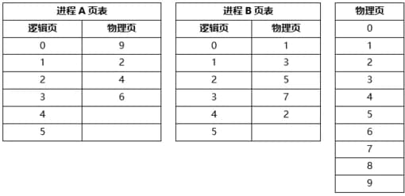

### 子题 1

- A. 9
- B. 2
- C. 4
- D. 6

- 答案：C
- 浓缩知识点：

分页存储管理中，物理页大小通常设置为2的整数次幂，这样能通过拆分逻辑地址的二进制位快速分离逻辑页号与页内偏移：取逻辑地址二进制的低n位作为页内偏移，n为页大小对应的幂次，比如页大小512字节对应2的9次幂，就取低9位，剩余的高位部分即为逻辑页号；通过该逻辑页号查询进程页表，可得到对应的物理页号，再将物理页号与页内偏移拼接就能得到最终的物理地址。此外，内存共享可通过让多个进程的不同逻辑页映射到同一个物理页实现，此时这些进程的页表中，对应共享逻辑页的表项都要填写同一个物理页号，这样既能实现进程间的数据或代码共享，还能有效节省内存空间。

- 解析：

本题考察的是分页存储管理中逻辑地址到物理地址的映射方法，以及共享页的设置。

### 子题 2

- A. 4、5
- B. 5、4
- C. 5、8
- D. 8、8

- 答案：D
- 浓缩知识点：

分页存储管理中，物理页大小通常设置为2的整数次幂，这样能通过拆分逻辑地址的二进制位快速分离逻辑页号与页内偏移：取逻辑地址二进制的低n位作为页内偏移，n为页大小对应的幂次，比如页大小512字节对应2的9次幂，就取低9位，剩余的高位部分即为逻辑页号；通过该逻辑页号查询进程页表，可得到对应的物理页号，再将物理页号与页内偏移拼接就能得到最终的物理地址。此外，内存共享可通过让多个进程的不同逻辑页映射到同一个物理页实现，此时这些进程的页表中，对应共享逻辑页的表项都要填写同一个物理页号，这样既能实现进程间的数据或代码共享，还能有效节省内存空间。

- 解析：

本题考察的是分页存储管理中逻辑地址到物理地址的映射方法，以及共享页的设置。

---

## 31. 假设系统采用段式存储管理方法，进程P的段表如下所示。逻辑地址（）不能转换为对应的物理地址；不能转换为对应的物理地址的原因是进行（）。
- 知识域：操作系统 | 知识点：内存管理 | 来源：2015年11月第2题
- 标签：内存管理、高频、第2章 计算机系统基础知识

### 子题 1

- A. (0，790)和(2，88)
- B. (1，30)和(3，290)
- C. (2，88)和(4，98)
- D. (0，810)和(4，120)

- 答案：D
- 浓缩知识点：

段式存储管理中，进程的逻辑地址由段号与段内偏移两部分组成，在完成逻辑地址到物理地址的转换过程中，会依托段表获取对应段的段长信息，核心的合法性检查环节是判断段内偏移是否大于等于该段的段长，若满足该条件则会触发地址越界错误，这类错误属于地址转换环节的内存访问合法性错误，和除法除零、算术溢出等运算类错误无关联。段式存储通过这种基于段长的检查机制，能够有效限定单个进程的内存访问范围，避免进程非法越界访问其他内存区域，以此保障内存空间的安全性与进程间的内存隔离性。

- 解析：

本题考察的是段式存储管理中的地址越界检查。

### 子题 2

- A. 除法运算时除数为零
- B. 算术运算时有溢出
- C. 逻辑地址到物理地址转换时地址越界
- D. 物理地址到逻辑地址转换时地址越界

- 答案：C
- 浓缩知识点：

段式存储管理中，进程的逻辑地址由段号与段内偏移两部分组成，在完成逻辑地址到物理地址的转换过程中，会依托段表获取对应段的段长信息，核心的合法性检查环节是判断段内偏移是否大于等于该段的段长，若满足该条件则会触发地址越界错误，这类错误属于地址转换环节的内存访问合法性错误，和除法除零、算术溢出等运算类错误无关联。段式存储通过这种基于段长的检查机制，能够有效限定单个进程的内存访问范围，避免进程非法越界访问其他内存区域，以此保障内存空间的安全性与进程间的内存隔离性。

- 解析：

本题考察的是段式存储管理中的地址越界检查。

---

## 32. 进程P有8个页面，页号分别为0~7，页面大小为4K ，假设系统给进程P分配了4个存储块，进程P的页面变换表如下所示。表中状态位等于1和0分别表示页面在内存和不在内存。若进程P要访问的逻辑地址为十六进制 5148H，则该地址经过变换后， 其物理地址应为十六进制（）；如果进程P要访问的页面6不在内存，那么应该淘汰页号为（）的页面。
- 知识域：操作系统 | 知识点：内存管理 | 来源：2019年11月第2题
- 标签：内存管理、简单、高频、第2章 计算机系统基础知识

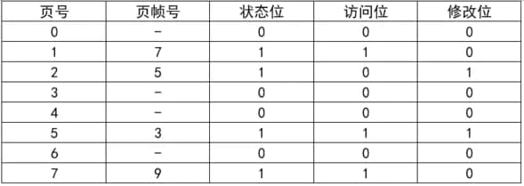

### 子题 1

- A. 3148H
- B. 5148H
- C. 7148H
- D. 9148H

- 答案：A
- 浓缩知识点：

在分页及段页式存储管理机制中，若页面大小为2的整数次幂，逻辑地址可按位拆分，高位部分为页号，低部位数与页大小的二进制位数一致的部分为页内偏移；物理地址通过页表映射得到，计算方式为对应页帧号乘以页面大小后加上页内偏移。进行页面置换时，通常优先选择最近未被访问（访问位为0）的页面淘汰，若多个页面访问状态相同，则优先淘汰未修改（修改位为0）的页面——这是因为已修改页面淘汰前需写回外存，会额外增加系统开销；这类结合访问位与修改位的置换逻辑，是Clock等高效置换算法的核心思路，能在保证内存利用率的同时降低置换的系统消耗。

- 解析：

本题考察的是段页式地址变换与页面置换策略。
问题 1：逻辑地址转换为物理地址
页面大小为 4KB，即 2^12 字节，因此逻辑地址低 12 位为页内偏移，高位为页号。
逻辑地址：5148H = 0101 0001 0100 1000B
高位（页号）为：5H
页内偏移地址：148H
查页面变换表，页号 5 在内存中，对应页帧号为 3。
物理地址 = 页帧号 × 页大小 + 页内地址 = 3 × 1000H + 148H = 3148H
所以第一空选择 A. 3148H

### 子题 2

- A. 1
- B. 2
- C. 5
- D. 7

- 答案：B
- 浓缩知识点：

在分页及段页式存储管理机制中，若页面大小为2的整数次幂，逻辑地址可按位拆分，高位部分为页号，低部位数与页大小的二进制位数一致的部分为页内偏移；物理地址通过页表映射得到，计算方式为对应页帧号乘以页面大小后加上页内偏移。进行页面置换时，通常优先选择最近未被访问（访问位为0）的页面淘汰，若多个页面访问状态相同，则优先淘汰未修改（修改位为0）的页面——这是因为已修改页面淘汰前需写回外存，会额外增加系统开销；这类结合访问位与修改位的置换逻辑，是Clock等高效置换算法的核心思路，能在保证内存利用率的同时降低置换的系统消耗。

- 解析：

本题考察的是段页式地址变换与页面置换策略。
问题 2：页面置换选择
当前在内存的页面有：页号 1、2、5、7（状态位为 1）。
如果访问页面 6，需要置换一个已有页面。
根据页面置换策略，一般先淘汰：

---

## 33. 分页内存管理的核心是将虚拟内存空间和物理内存空间皆划分为大小相同的页面，并以页面作为内存空间的最小分配单位。下图给出了内存管理单元的虚拟地址到物理地址的翻译过程，假设页面大小为4KB，那么CPU发出虚拟地址0010000000000100后，其访问的物理地址是（）。
- 知识域：操作系统 | 知识点：内存管理 | 来源：2020年11月第8题
- 标签：内存管理、简单、高频、第2章 计算机系统基础知识

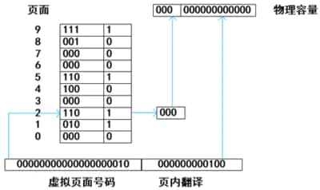

### 子题 1

- A. 0110000000000100
- B. 0100000000000100
- C. 1100000000000000
- D. 1100000000000010

- 答案：A
- 浓缩知识点：

分页内存管理会将虚拟内存与物理内存划分为大小相等的页面，页面大小通常取2的整数次幂，这种设定能让地址拆分更高效，比如4KB对应2^12字节，逻辑地址的低12位可直接作为页内偏移，剩余高位则为虚拟页号。逻辑地址由虚拟页号和页内偏移组成，物理地址由物理块号与相同的页内偏移拼接而成，页内偏移在地址转换过程中保持不变。页表是地址转换的核心，用于记录虚拟页号到物理块号的映射关系，同时页表项中通常包含有效位，取值为0或1，有效位为1表示该页已装入物理内存，地址转换可正常进行；为0则表示该页不在内存中，访问时会触发缺页中断，需将页从外存调入内存后再完成访问。

- 解析：

本题考察的是分页存储地址转换原理。
分页系统中，逻辑地址由页号和页内偏移两部分组成，物理地址由物理块号和页内偏移组成，且页内偏移在虚拟地址和物理地址中保持一致。

---

## 34. 以下关于计算机内存管理的描述中，（）属于段页式内存管理的描述。
- 知识域：操作系统 | 知识点：内存管理 | 来源：2020年11月第9题
- 标签：内存管理、高频、第2章 计算机系统基础知识

### 子题 1

- A. 一个程序就是一段，使用基址极限对来进行管理
- B. 一个程序分为许多固定大小的页面，使用页表进行管理
- C. 程序按逻辑分为多段，每一段内又进行分页，使用段页表来进行管理
- D. 程序按逻辑分成多段，用一组基址极限对来进行管理。 基址极限对存放在段表里

- 答案：C
- 浓缩知识点：

段页式内存管理是融合段式与页式存储管理优势的内存管理方案，它先按照程序的逻辑功能将其划分为多个独立的段，再把每个段拆分为固定大小的页面。该管理模式依靠段表和页表配合完成地址转换，段表中存储各段对应的页表起始地址，页表则负责记录页号到物理内存块号的映射关系。它既保留了段式管理按逻辑划分程序的灵活性，方便程序的模块化开发、共享与保护，又具备页式管理中内存分配规整、内存碎片少的优点，同时弥补了段式管理易产生较大内存碎片、页式管理缺乏逻辑划分的不足。

- 解析：

本题考察的是段页式存储管理方式。

---

## 35. 某计算机系统页面大小为 4K，进程 P1 的页面变换表如下图示，看 P1 要访问数据的逻辑地址为十六进制 1B1AH，那么该逻辑地址经过变换后，其对应的物理地址应为十六进制（）。
- 知识域：操作系统 | 知识点：内存管理 | 来源：2021年11月第1题
- 标签：内存管理、高频、第2章 计算机系统基础知识

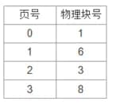

### 子题 1

- A. 1B1AH
- B. 3B1AH
- C. 6B1AH
- D. 8B1AH

- 答案：C
- 浓缩知识点：

分页存储管理地址转换的核心知识点：页面大小通常设为2的整数次幂，页内偏移地址的二进制位数等于该幂次，比如4KB对应2的12次方，页内偏移就占12位，对应十六进制的3位。逻辑地址由高位的页号和低位的页内偏移组成，拆分时按页内偏移的位数截取，低位部分为页内偏移，剩余高位是页号。地址转换需依托页表，先通过页号查询页表得到对应的物理块号，再计算物理地址：用物理块号乘以页面大小得到物理块的起始地址，加上页内偏移（逻辑与物理的页内偏移完全一致）即可，十六进制场景下可简化操作，比如4KB对应十六进制的1000H，直接将物理块号与页内偏移的十六进制数拼接就能快速得到物理地址。页表的核心作用是建立逻辑页到物理块的映射关系，是实现地址转换的关键依据。

- 解析：

本题考察的是分页存储管理中的地址转换原理。
逻辑地址由两部分组成：页号和页内偏移地址。其中：

---

## 36. 内存分段的特点是（）。
- 知识域：操作系统 | 知识点：内存管理 | 来源：2024年11月第53题
- 标签：内存管理、高频、第2章 计算机系统基础知识

### 子题 1

- A. 固定的
- B. 相等的
- C. 可动态变化的
- D. 不可变的

- 答案：C
- 浓缩知识点：

内存分段是操作系统中依托程序逻辑结构实现的内存管理方式，会将程序划分为代码段、数据段、堆栈段等功能相对独立的段。其核心特性包含段长度可动态变化，程序运行期间堆、栈段能随需求增长或缩减；各段支持独立加载、按需装入，灵活性较强；还可给不同段设置差异化访问权限以实现内存保护，同时支持代码段共享与数据段隔离，相比分页管理更契合程序的逻辑组织逻辑，能有效提升内存空间的利用效率。

- 解析：

本题考察的是操作系统中段式存储管理（内存分段）的基本特点。

---

> **知识点分组：前趋图**

## 37. 某计算机系统中有一个CPU、一台输入设备和一台输出设备，假设系统中有四个作业T1、T2、T3和T4，系统采用优先级调度，且T1的优先级>T2的优先级>T3的优先级>T4的优先级。每个作业具有三个程序段：输入Ii、计算Ci和输出Pi(i=1,2,3,4)，其执行顺序为Ii→Ci→Pi。这四个作业各程序段并发执行的前趋图如下所示。图中①、②、③分别为（），④、⑤、⑥分别为（）。
- 知识域：操作系统 | 知识点：前趋图 | 来源：2014年11月第1题
- 标签：前趋图、高频、第2章 计算机系统基础知识

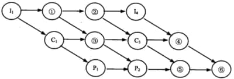

### 子题 1

- A. I2、C2、C4
- B. I2、I3、C2
- C. C2、P3、C4
- D. C2、P3、P4

- 答案：B
- 浓缩知识点：

在多道程序并发执行的系统中，当CPU、输入设备、输出设备均为单台时，同类型资源的使用需按作业优先级顺序串行占用，高优先级作业的对应程序段优先使用资源；每个作业内部固定遵循输入程序段、计算程序段、输出程序段的先后执行逻辑，这是作业内部的前趋约束。前趋图用于表示多作业程序段的并发执行依赖关系，图中节点对应各作业的不同程序段，边代表执行的先后顺序，依赖关系包含两类：一是同资源链路的串行依赖，输入链路需按优先级依次排列各作业的输入段，CPU链路依次排列计算段，输出链路依次排列输出段；二是作业内部的阶段依赖，即任意作业的计算段必须在其输入段完成后才能执行，输出段必须在其计算段完成后才能执行。分析前趋图空缺节点时，需同时满足这两类依赖，既遵循同资源的优先级串行规则，也不能打破作业自身的阶段执行顺序。

- 解析：

本题考察的是前趋图表示的资源顺序约束与作业程序段的先后依赖。
本小问答案是 I2、I3、C2。图中①、②、③分别为I2、I3、C2，④、⑤、⑥分别为。
A. I2、C2、C4：②不是CPU段；③不是C4。
B. I2、I3、C2：I2、I3、C2与题干限定一致，正确。
C. C2、P3、C4：①、②都不可能是输出段P3。
D. C2、P3、P4：①、②不在输出链路上，错误。
因此，选项 B 正确。

### 子题 2

- A. C2、C4、P4
- B. I2、I3、C4
- C. I3、P3、P4
- D. C4、P3、P4

- 答案：D
- 浓缩知识点：

在多道程序并发执行的系统中，当CPU、输入设备、输出设备均为单台时，同类型资源的使用需按作业优先级顺序串行占用，高优先级作业的对应程序段优先使用资源；每个作业内部固定遵循输入程序段、计算程序段、输出程序段的先后执行逻辑，这是作业内部的前趋约束。前趋图用于表示多作业程序段的并发执行依赖关系，图中节点对应各作业的不同程序段，边代表执行的先后顺序，依赖关系包含两类：一是同资源链路的串行依赖，输入链路需按优先级依次排列各作业的输入段，CPU链路依次排列计算段，输出链路依次排列输出段；二是作业内部的阶段依赖，即任意作业的计算段必须在其输入段完成后才能执行，输出段必须在其计算段完成后才能执行。分析前趋图空缺节点时，需同时满足这两类依赖，既遵循同资源的优先级串行规则，也不能打破作业自身的阶段执行顺序。

- 解析：

本题考察的是前趋图表示的资源顺序约束与作业程序段的先后依赖。
本小问答案是 C4、P3、P4。，④、⑤、⑥分别为C4、P3、P4。
A. C2、C4、P4：④不是C2；⑤不是CPU段。
B. I2、I3、C4：④不在输入链路上。
C. I3、P3、P4：④不是输入段。
D. C4、P3、P4：C4、P3、P4与题干限定一致，正确。
因此，选项 D 正确。

---

## 38. 前趋图是一个有向无环图，记为:→={（Pi，Pj）} | 在 Pj 开始前，Pi 需要完成 }。假设系统中进程P={P1，P2，P3，P4，P5，P6，P7，P8}，且进程的前趋图如下： 那么前趋图可记为：（）。

- 知识域：操作系统 | 知识点：前趋图 | 来源：2017年11月第5题
- 标签：前趋图、高频、第2章 计算机系统基础知识

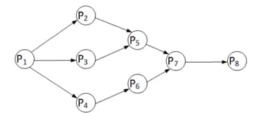

### 子题 1

- A. →={（P2，P1），（P3，P1），（P4，P1），（P6，P4），（P7，P5），（P7，P6），（P8，P7）}
- B. →={（P1，P2），（P1，P3），（P1，P4），（P2，P5），（P5，P7），（P6，P7），（P7，P8）}
- C. →={（P1，P2），（P1，P3），（P1，P4），（P2，P5），（P3，P5），（P4，P6），（P5，P7），（P6，P7），（P7，P8）}
- D. →={（P2，P1），（P3，P1），（P4，P1），（P5，P2），（P5，P3），（P6，P4），（P7，P5），（P7，P6），（P8，P7）}

- 答案：C
- 浓缩知识点：

前趋图是用于描述进程间执行先后约束关系的有向无环图（DAG），核心规则是图中的有向边（Pi，Pj）代表Pi完成后Pj才能开始执行，这类图不允许出现循环结构，否则会引发进程执行死锁问题。在操作系统中，它常被用于刻画进程同步逻辑、作业调度先后顺序等场景。梳理前趋图的边集时，需逐一明确每个进程的前驱（前置完成的进程）与后继（后续启动的进程），保证边的方向为前驱指向后继，同时要完整覆盖所有约束关系，避免出现边方向反转、关键约束边遗漏等错误，以此准确反映进程间的执行依赖逻辑。

- 解析：

本题考察的是前趋图（有向无环图，DAG）对进程先后约束关系的表示。
根据定义，有向边（Pi，Pj）表示Pj开始前Pi必须完成。从给定图中逐一读取所有有向边，可得到：P1→P2、P1→P3、P1→P4、P2→P5、P3→P5、P4→P6、P5→P7、P6→P7、P7→P8，正好与选项C一致。
A选项把方向全部反了（如写成P2→P1），与“先做Pi再做Pj”的含义相反，错误。
B选项遗漏了关键边P3→P5与P4→P6，边集合不完整，错误。
C选项完整且方向正确，逐条对应图中的每一条有向边，正确。
D选项同样把方向反转（如写成P5→P2而非P2→P5），与定义不符，错误。
因此，选择 C。

---

## 39. 前趋图是一个有向无环图，记为:→={（Pi，Pj）} | 在 Pj 开始前，Pi 需要完成 }。假设系统中进程 P={P1，P2，P3，P4 ，P5 ，P6，P7，P8} ，且进程的前趋图如下： 那么，该前趋图可记为（）。

- 知识域：操作系统 | 知识点：前趋图 | 来源：2019年11月第1题
- 标签：前趋图、高频、第2章 计算机系统基础知识

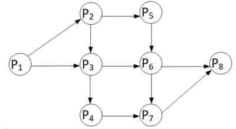

### 子题 1

- A. →={（P1，P2），（P1，P3），（P1，P4），（P2，P5），（P3，P5），（P4，P7），（P5，P6），（P6，P7），（P6，P8），（P7，P8）}
- B. →={（P1，P2），（P3，P1），（P4，P1），（P5，P2），（P5，P3），（P6，P4），（P7，P5），（P7，P6），（P6，P8），（P8，P7）}
- C. →={（P1，P2），（P1，P3），（P1，P4），（P2，P5），（P3，P6），（P4，P7），（P5，P6），（P6，P7），（P6，P8），（P7，P8）}
- D. →={（P1，P2），（P1，P3），（P2，P3），（P2，P5），（P3，P6），（P3，P4），（P4，P7），（P5，P6），（P6，P7），（P6，P8），（P7，P8）}

- 答案：D
- 浓缩知识点：

前趋图是用于刻画进程、任务等执行先后依赖关系的有向无环图（DAG），图中的有向边（Pi，Pj）代表执行约束，即必须在Pi完成后，Pj才能启动。它常被应用于操作系统进程调度、项目进度管理（如PERT图）、并行任务规划等场景，帮助梳理执行逻辑、避免资源冲突与任务死锁。构建和校验前趋图时，需精准匹配实际依赖逻辑，要确保涵盖所有必要的先后关联边，不能遗漏关键依赖，也不能添加不存在的依赖关系，同时严格规避循环依赖，否则会破坏有向无环的核心属性，导致任务无法按序推进。

- 解析：

本题考察的是前趋图的构建与依赖关系的识别。
前趋图用于描述进程之间的执行先后关系，通常用于任务调度、项目管理（如PERT图）等场景中。
A选项：包含了图中不存在的边（如P1→P4、P3→P5），缺失应有的边（如P2→P3），错误。
B选项：方向完全错误，且包含逆向依赖，不符合DAG定义，错误。
C选项：缺少必要边（如P2→P3），包含不存在的边（如P1→P4），错误。
D选项：完全符合图中结构，包含所有有效依赖关系，是正确答案。
选择选项 D。

---

## 40. 前趋图是一个有向无环图，记为:→={（Pi，Pj）} | 在 Pj 开始前，Pi 需要完成 }。假设系统中进程 P={P1，P2，P3，P4，P5，P6，P7}，且进程的前趋图如下： 那么，该前趋图可记为（）。

- 知识域：操作系统 | 知识点：前趋图 | 来源：2020年11月第1题
- 标签：前趋图、高频、第2章 计算机系统基础知识

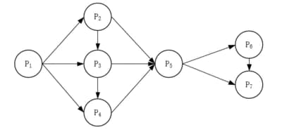

### 子题 1

- A. →={（P1，P2），（P3，P1），（P4，P1），（P5，P2），（P5，P3），（P6，P4），（P7，P5），（P7，P6），（P5，P6），（P4，P5），（P6，P7）}
- B. →={（P1，P2），（P1，P3），（P1，P4），（P2，P5），（P2，P3），（P3，P4），（P3，P5），（P4，P5），（P5，P6），（P5，P7），（P6，P7）}
- C. →={（P1，P2），（P1，P3），（P1，P4），（P2，P5），（P2，P3），（P3，P4），（P5，P3），（P4，P5），（P5，P6），（P7，P5），（P6，P7）}
- D. →={（P1，P2），（P1，P3），（P2，P3），（P2，P5），（P3，P6），（P3，P4），（P4，P7），（P5，P6），（P6，P7），（P6，P5），（P7，P5）}

- 答案：B
- 浓缩知识点：

前趋图是一种有向无环图（DAG），核心用于描述进程或任务间的先后执行约束关系，图中有序对(Pi,Pj)表示必须在Pi执行完成后，Pj才能启动，这类图绝对不能存在环结构，否则会引发循环依赖导致死锁。读取前趋图时，需严格遵循箭头指向梳理所有依赖关系，不能颠倒边的方向，也不能凭空添加或遗漏合法的先后约束。它在操作系统进程调度、项目任务编排等场景中广泛应用，能清晰界定并发执行单元间的逻辑先后，保障执行流程的正确性与合理性。

- 解析：

本题考察的是前趋图（有向无环图，DAG）中边的含义与读取。
根据图中的箭头方向，能够读出全部先后约束：P1→P2、P1→P3、P1→P4；P2→P3、P3→P4；P2→P5、P3→P5、P4→P5；P5→P6、P5→P7；P6→P7。
A选项：包含多处方向颠倒与不存在的边，例如（P3，P1）与（P4，P1）应为从P1指向P3、P4；（P5，P2）与（P5，P3）方向也应为P2、P3指向P5；还将（P7，P5）写反且同时给出（P7，P6）与（P6，P7）造成矛盾，因此错误。
B选项：与图中所有箭头一致，既包含P1到P2/P3/P4，亦包含P2到P3、P3到P4，以及到P5的三条入边和从P5到P6、P7及P6到P7的关系，完全正确。
C选项：将（P5，P3）与（P7，P5）写反，正确应为（P3，P5）与（P5，P7），因此错误。
D选项：给出不存在或方向错误的边，如（P3，P6）与（P4，P7）在图中并无；同时（P6，P5）与（P7，P5）方向应为从P5指向P6、P7，故错误。
因此，选项 B 正确。

---

## 41. 前趋图是一个有向无环图，记为:→={（Pi，Pj）} | 在 Pj 开始前，Pi 需要完成 }，假设系统中进程P={P1，P2，P3，P4，P5，P6，P7，P8}，且进程的前驱图如下：
- 知识域：操作系统 | 知识点：前趋图 | 来源：2021年11月第4题
- 标签：前趋图、高频、第2章 计算机系统基础知识

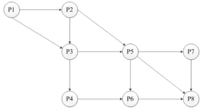

### 子题 1

- A. {（P1，P2），（P3，P1），（P4，P1），（P5，P2），（P5，P3），（P6，P4），（P7，P5），（P7，P6），（P5，P6），（P4，P5），（P6，P7），（P7，P6）}
- B. {（P1，P2），（P1，P3），（P2，P5），（P2，P3），（P3，P4），（P3，P5），（P4，P5），（P5，P6），（P5，P7），（P8，P5），（P6，P7），（P7，P8）}
- C. {（P1，P2），（P1，P3），（P2，P3），（P2，P5），（P3，P4），（P3，P5），（P4，P6），（P5，P6），（P5，P7），（P5，P8），（P6，P8），（P7，P8）}
- D. {（P1，P2），（P1，P3），（P2，P3），（P2，P5），（P3，P6），（P3，P4），（P4，P7），（P5，P6），（P6，P7），（P6，P5），（P7，P5），（P7，P8）}

- 答案：C
- 浓缩知识点：

前趋图是用于描述进程执行先后依赖关系的有向无环图（DAG），其中节点对应进程，图中的显式有向边（Pi,Pj）代表直接前趋关系，即只有当Pi执行完成后，Pj才能启动，这种直接依赖仅由图中存在的有向边定义，不能随意添加、遗漏或颠倒边的方向，同时前趋图不能存在环，否则会引发进程循环等待的逻辑错误。此外，要区分直接前趋与间接前趋：若进程间依赖需经过至少一个中间进程传递，则属于间接前趋关系，这类关系不会体现在直接前趋的边集合中。前趋图是进程同步设计的重要工具，能清晰梳理进程间的依赖逻辑，帮助构建正确的进程执行序列。

- 解析：

本题考察的是前趋图（DAG）中直接前趋关系的识别。
直接前趋仅对应图中的有向边。观察图可读出边：P1→P2、P1→P3、P2→P3、P2→P5、P3→P4、P3→P5、P4→P6、P5→P6、P5→P7、P5→P8、P6→P8、P7→P8，刚好与选项C一致。
A选项：包含不存在的边与明显错误方向，例如（P3，P1）、（P4，P1）与（P7，P6），还出现与图相悖的关系（如同时给出（P7，P6）与（P6，P7）会形成环），不符合有向无环图且与图不符，错误。
B选项：大部分边方向正确，但把（P4，P6）误写为（P4，P5），并将（P5，P8）误写为（P8，P5），同时多写了（P6，P7）这条图中不存在的边，因此整体不正确。
C选项：逐一与图中连线吻合，无多写、漏写或方向错误，完全对应所有直接前趋关系，因此正确。
D选项：包含图中不存在或方向错误的边，如（P3，P6）、（P4，P7）、（P6，P7），还出现与图相反方向的（P6，P5）、（P7，P5），因此错误。

---

## 42. 前趋图是一个有向无环图，记为:→={（Pi，Pj）} | 在 Pj 开始前，Pi 需要完成 }，假设系统中进程P= { P1，P2，P3，P4，P5，P6，P7，P8 }，且进程的前趋图如下图所示。那么，该前趋图可记为（）
- 知识域：操作系统 | 知识点：前趋图 | 来源：2022年11月第2题
- 标签：前趋图、高频、第2章 计算机系统基础知识

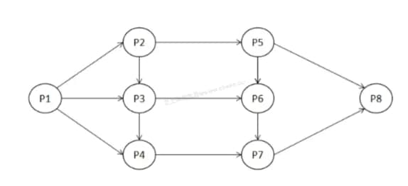

### 子题 1

- A. {（P1，P2），（P1，P3），（P1，P4），（P2，P5），（P3，P5），（P4，P7），（P5，P6），（P5，P7），（P7，P6），（P4，P5），（P6，P7），（P7，P8）}
- B. {（P1，P2），（P1，P3），（P1，P4），（P2，P3），（P2，P5），（P3，P4），（P3，P6），（P4，P7），（P5，P6），（P5，P8），（P6，P7），（P7，P8）}
- C. {（P1，P2），（P1，P3），（P1，P4），（P2，P3），（P2，P5），（P3，P4），（P3，P5），（P4，P6），（P5，P7），（P5，P8），（P6，P7），（P7，P8）}
- D. {（P1，P2），（P1，P3），（P2，P3），（P2，P5），（P3，P4），（P3，P6），（P4，P7），（P5，P6），（P5，P8），（P6，P7），（P6，P8），（P7，P8）}

- 答案：B
- 浓缩知识点：

前趋图是用于表示进程或任务间先后依赖关系的有向无环图，简称DAG，图中节点代表任务或进程，有向边（Pi,Pj）表示必须在Pi完成后，Pj才能开始执行。它是进程同步、项目进度调度等场景的常用工具，可通过拓扑排序得到符合所有依赖约束的合法执行序列，且图中绝对不能存在环路，否则会引发循环依赖导致任务无法推进甚至死锁。在将前趋图转化为边集表示时，需准确捕捉每个节点的直接前驱关系，避免遗漏或错误添加依赖边；除此之外，前趋图还可延伸应用于关键路径分析，助力优化任务执行流程，提升整体调度效率。

- 解析：

题目考察的是进度图的表示方法，尤其是针对有向无环图（DAG）的进度依赖关系。
根据图中提供的信息，可以将图的结构转化为进度图中相应的依赖关系。图中的各节点表示不同的任务，而边表示任务之间的先后依赖关系。
在该图中，任务 P1 需要在 P2 和 P3 开始之前完成，任务 P3 必须在 P5 完成之后才能开始，P6 需要在 P5 完成之后开始，P7 必须等 P6 完成后开始，P8 需要在 P5 或 P7 完成后开始等。
通过分析图形的结构，可以发现该图的拓扑排序为：
P1 -> P2 -> P3 -> P5 -> P6 -> P7 -> P8
即任务的执行顺序应当是 P1 → P2 → P3 → P5 → P6 → P7 → P8。
因此，该进度图可以表示为：
{（P1，P2），（P1，P3），（P1，P4），（P2，P3），（P2，P5），（P3，P4），（P3，P5），（P4，P6），（P5，P7），（P5，P8），（P6，P7），（P7，P8）}
该进度图的表示方式符合进度依赖的要求。
选择选项 B。

---

> **知识点分组：嵌入式系统**

## 43. 在嵌入式系统设计中，用来进行 CPU 调试的常用接口是（）。
- 知识域：操作系统 | 知识点：嵌入式系统 | 来源：2013年11月第6题
- 标签：嵌入式系统、中等、高频、第16章 嵌入式系统架构设计理论与实践

### 子题 1

- A. PCI接口
- B. USB接口
- C. 网络接口
- D. JTAG接口

- 答案：D
- 浓缩知识点：

嵌入式系统中，JTAG接口是CPU调试的常用底层硬件接口，它遵循IEEE 1149.1国际标准，除了调试CPU，还可用于DSP、FPGA等各类嵌入式器件的程序下载与硬件调试。与之区分的是，PCI接口为高速外设总线接口，主要作用是扩展硬件设备；USB接口主打外设连接与数据传输，仅能通过转接方式间接支持调试，本身并非专用调试接口；网络接口以通信功能为核心，虽可实现远程调试，但不属于嵌入式CPU的专用底层调试接口。

- 解析：

本题考察的是嵌入式系统调试接口的基本概念。
与之区分的是，PCI接口为高速外设总线接口，主要作用是扩展硬件设备。USB接口主打外设连接与数据传输，仅能通过转接方式间接支持调试，本身并非专用调试接口。网络接口以通信功能为核心，虽可实现远程调试，但不属于嵌入式CPU的专用底层调试接口。嵌入式系统中，JTAG接口是CPU调试的常用底层硬件接口，它遵循IEEE 1149.1国际标准，除了调试CPU，还可用于DSP、FPGA等各类嵌入式器件的程序下载与硬件调试。
本小问答案是 JTAG接口。题干中的“在嵌入式系统设计中，用来进行 CPU 调试的常用接口”对应JTAG接口。
因此，选项 D 正确。

---

## 44. 看门狗（Watch Dog）是嵌入式系统中一种常用的保证系统可靠性的技术，（）会产生看门狗中断。
- 知识域：操作系统 | 知识点：嵌入式系统 | 来源：2013年11月第7题
- 标签：嵌入式系统、高频、第16章 嵌入式系统架构设计理论与实践

### 子题 1

- A. 软件喂狗
- B. 处理器温度过高
- C. 外部中断
- D. 看门狗定时器超时

- 答案：D
- 浓缩知识点：

看门狗是嵌入式系统中保障运行可靠性的核心技术，依托内置定时器实现功能。系统正常工作时，需定期执行“喂狗”操作重置定时器，防止其超时；若程序因卡死、跑飞等异常无法按时喂狗，看门狗定时器超时就会触发看门狗中断，部分场景下还会触发系统复位，使系统恢复正常。需注意，软件喂狗是维持看门狗正常状态的主动操作，并非中断触发原因；处理器温度过高、外部中断属于独立的系统事件，与看门狗的触发逻辑无关联，不会引发看门狗中断。看门狗技术目前广泛应用于工业控制、车载电子等对稳定性要求严苛的嵌入式场景，可有效避免系统故障后长期陷入停滞状态。

- 解析：

本题考察的是嵌入式系统中看门狗（Watchdog）电路的工作原理和应用。
处理器温度过高、外部中断属于独立的系统事件，与看门狗的触发逻辑无关联，不会引发看门狗中断。需注意，软件喂狗是维持看门狗正常状态的主动操作，并非中断触发原因。若程序因卡死、跑飞等异常无法按时喂狗，看门狗定时器超时就会触发看门狗中断，部分场景下还会触发系统复位，使系统恢复正常。
本小问答案是 看门狗定时器超时。题干中的“看门狗（Watch Dog）是嵌入式系统中一种常用的保证系统可靠性的技术看门狗定时器超时会产生看门狗中断”对应看门狗定时器超时。
因此，选项 D 正确。

---

## 45. 以下关于实时操作系统（RTOS）任务调度器的叙述中，正确的是（）。
- 知识域：操作系统 | 知识点：嵌入式系统 | 来源：2013年11月第8题
- 标签：嵌入式系统、高频、第16章 嵌入式系统架构设计理论与实践

### 子题 1

- A. 任务之间的公平性是最重要的调度目标
- B. 大多数 RTOS 调度算法都是抢占方式（可剥夺方式）
- C. RTOS 调度器都采用了基于时间片轮转的调度算法
- D. 大多数 RTOS 调度算法只采用一种静态优先级调度算法

- 答案：B
- 浓缩知识点：

实时操作系统（RTOS）的任务调度核心目标是保障任务执行的确定性与及时性，这与以任务公平性为核心目标的分时操作系统存在本质区别。绝大多数RTOS采用抢占式调度机制，当高优先级任务进入就绪状态时，可立即剥夺低优先级任务的CPU使用权，以此确保高优先级任务能在规定时限内响应并完成。RTOS的调度算法并非单一固定，静态优先级调度是常用类型，但也有不少系统采用动态优先级调度，比如最早截止时间优先EDF算法，部分系统还会结合多种调度策略，而多用于分时系统的时间片轮转算法，并非RTOS的通用调度选择。

- 解析：

本题考察的是实时操作系统任务调度策略的基本特点。

---

## 46. 在嵌入式操作系统中，板级支持包 BSP 作为对硬件的抽象，实现了（）。
- 知识域：操作系统 | 知识点：嵌入式系统 | 来源：2015年11月第6题
- 标签：嵌入式系统、中等、高频、第16章 嵌入式系统架构设计理论与实践

### 子题 1

- A. 硬件无关性，操作系统无关性
- B. 硬件有关性，操作系统有关性
- C. 硬件无关性，操作系统有关性
- D. 硬件有关性，操作系统无关性

- 答案：B
- 浓缩知识点：

板级支持包BSP是嵌入式系统中衔接底层硬件平台与嵌入式操作系统的关键中间层，具备硬件有关性与操作系统有关性两大核心特性。硬件有关性体现在它必须针对具体硬件平台定制开发，不同CPU架构、外设布局、板卡设计都需要匹配专属BSP，以此精准适配和管理硬件资源；操作系统有关性则指其接口规范需与目标嵌入式操作系统的内核要求完全契合，不同嵌入式操作系统（如Linux、VxWorks、RT-Thread等）内核交互标准不同，BSP需按对应标准适配才能让系统稳定调用硬件。BSP可有效屏蔽底层硬件的复杂性与差异性，大幅降低嵌入式操作系统在不同硬件平台间的移植难度，是嵌入式系统开发与移植中不可或缺的组成部分。

- 解析：

本题考察的是嵌入式系统中板级支持包（BSP，或称硬件抽象层HAL）的作用与特性。
硬件无关性，操作系统无关性：BSP 直接面向底层硬件，具有显著的硬件相关性，不具备硬件无关性；硬件有关性，操作系统有关性：BSP 是嵌入式系统中的中间层，它负责将特定硬件平台与特定操作系统绑定起来，因此它必须对硬件平台进行适配（硬件有关性），同时要与目标操作系统的内核接口保持一致（操作系统有关性）；硬件无关性，操作系统有关性：BSP 明确依赖于具体硬件，不能实现硬件无关性；硬件有关性，操作系统无关性：BSP 不同于标准的驱动程序，其接口往往与操作系统有关，不能做到操作系统无关。
本小问答案是 硬件有关性，操作系统有关性。BSP 是嵌入式系统中的中间层，它负责将特定硬件平台与特定操作系统绑定起来，因此它必须对硬件平台进行适配（硬件有关性），同时要与目标操作系统的内核接口保持一致（操作系统有关性）。
因此，选项 B 正确。

---

## 47. 以下描述中，（）不是嵌入式操作系统的特点。
- 知识域：操作系统 | 知识点：嵌入式系统 | 来源：2015年11月第7题
- 标签：嵌入式系统、高频、第16章 嵌入式系统架构设计理论与实践

### 子题 1

- A. 面向应用，可以进行裁剪和移植
- B. 用于特定领域，不需要支持多任务
- C. 可靠性高，无需人工干预独立运行，并处理各类事件和故障
- D. 要求编码体积小，能够在嵌入式系统的有效存储空间内运行

- 答案：B
- 浓缩知识点：

嵌入式操作系统是适配嵌入式硬件的专用系统，核心特点有这些：它面向特定应用场景，可根据需求进行功能裁剪与硬件移植；多数情况下需要支持多任务处理，以此满足实时响应、并发事件处理等实际需求，并非不需要多任务；具备高可靠性，能在少人工干预甚至无干预的状态下独立运行，有效应对各类运行事件与故障；受嵌入式系统存储资源有限的约束，要求系统编码体积小巧，适配有限的存储空间。

- 解析：

本题考察的是嵌入式操作系统的基本特征。

---

## 48. 嵌入式软件设计需要考虑（）以保障软件良好的可移植性。
- 知识域：操作系统 | 知识点：嵌入式系统 | 来源：2015年11月第8题
- 标签：嵌入式系统、中等、高频、第16章 嵌入式系统架构设计理论与实践

### 子题 1

- A. 先进性
- B. 易用性
- C. 硬件无关性
- D. 可靠性

- 答案：C
- 浓缩知识点：

嵌入式软件可移植性的核心保障在于硬件无关性设计，软件开发时需避免直接依赖特定硬件的独有特性，可通过搭建硬件抽象层封装硬件操作、采用标准化接口协议或通用编程语言来实现硬件无关性，以此让软件能够在不同硬件平台之间快速完成适配与迁移。此外需明确，软件的先进性、易用性、可靠性属于不同维度的软件质量属性：先进性侧重技术前沿性，易用性关注用户操作友好度，可靠性指向系统长期稳定运行能力，这些属性分别服务于技术领先、用户体验、系统稳定等不同目标，与可移植性无直接关联，无法作为保障软件可移植性的核心设计原则。

- 解析：

本题考察的是嵌入式系统可移植性的设计原则。
此外需明确，软件的先进性、易用性、可靠性属于不同维度的软件质量属性：先进性侧重技术前沿性，易用性关注用户操作友好度，可靠性指向系统长期稳定运行能力，这些属性分别服务于技术领先、用户体验、系统稳定等不同目标，与可移植性无直接关联，无法作为保障软件可移植性的核心设计原则。嵌入式软件可移植性的核心保障在于硬件无关性设计，软件开发时需避免直接依赖特定硬件的独有特性，可通过搭建硬件抽象层封装硬件操作、采用标准化接口协议或通用编程语言来实现硬件无关性，以此让软件能够在不同硬件平台之间快速完成适配与迁移。
本小问答案是 硬件无关性。题干中的“嵌入式软件设计需要考虑硬件无关性以保障软件良好的可移植性”对应硬件无关性。
因此，选项 C 正确。

---

## 49. 实时操作系统（RTOS）内核与应用程序之间的接口称为（）。
- 知识域：操作系统 | 知识点：嵌入式系统 | 来源：2016年11月第2题
- 标签：嵌入式系统、中等、高频、第16章 嵌入式系统架构设计理论与实践

### 子题 1

- A. I/O接口
- B. PCI
- C. API
- D. GUI

- 答案：C
- 浓缩知识点：

实时操作系统（RTOS）中，内核与应用程序之间的交互接口为应用程序编程接口（API），它是RTOS提供的一组标准化函数集合，应用程序可通过调用这些API实现任务调度、进程间通信、资源同步与互斥等内核级功能，从而高效借助RTOS的核心能力完成复杂任务。需要注意区分易混淆的相关概念：I/O接口主要承担数据输入输出的软硬件通道作用，与内核和应用的编程交互无关；PCI是外设部件互连的硬件总线标准，用于实现外设与主机硬件层面的连接；GUI即图形用户界面，是面向终端用户的可视化交互界面，并非内核与应用之间的程序级交互接口。此外，不同RTOS的API会有自身特性，但核心功能都围绕内核资源调用与任务管理展开，是应用开发依托RTOS的关键桥梁。

- 解析：

本题考察的是实时操作系统中内核与应用的接口形式。
需要注意区分易混淆的相关概念：I/O接口主要承担数据输入输出的软硬件通道作用，与内核和应用的编程交互无关。PCI是外设部件互连的硬件总线标准，用于实现外设与主机硬件层面的连接。实时操作系统（RTOS）中，内核与应用程序之间的交互接口为应用程序编程接口（API），它是RTOS提供的一组标准化函数集合，应用程序可通过调用这些API实现任务调度、进程间通信、资源同步与互斥等内核级功能，从而高效借助RTOS的核心能力完成复杂任务。GUI即图形用户界面，是面向终端用户的可视化交互界面，并非内核与应用之间的程序级交互接口。
本小问答案是 API。题干中的“实时操作系统（RTOS）内核与应用程序之间的接口”对应API。
因此，选项 C 正确。

---

## 50. 以下关于实时操作系统（RTOS）的叙述中，不正确的是（）。
- 知识域：操作系统 | 知识点：嵌入式系统 | 来源：2017年11月第4题
- 标签：嵌入式系统、中等、高频、第16章 嵌入式系统架构设计理论与实践

### 子题 1

- A. RTOS 不能针对硬件变化进行结构与功能上的配置及裁剪
- B. RTOS 可以根据应用环境的要求对内核进行裁剪和重配
- C. RTOS 的首要任务是调度一切可利用的资源来完成实时控制任务
- D. RTOS 实质上就是一个计算机资源管理程序，需要及时响应实时事件和中断

- 答案：A
- 浓缩知识点：

实时操作系统（RTOS）是专为实时控制任务设计的系统，它具备可裁剪性与可配置性这一关键特性，能够根据硬件环境的变化、不同应用场景的需求，灵活调整内核的结构与功能，以此适配资源有限的硬件平台，最大程度节省系统资源。RTOS的核心目标是统筹调度系统所有可利用资源，确保实时任务在规定时限内准确完成，同时它必须具备快速响应实时事件与外部中断的能力，保障任务执行的确定性。需要明确的是，认为RTOS无法针对硬件变化进行配置及裁剪的说法是错误的，这正是RTOS适配多场景应用的重要优势之一，广泛应用于工业控制、嵌入式设备、航空航天等对响应速度和执行确定性要求高的领域。

- 解析：

本题考察的是实时操作系统（RTOS, Real-Time Operating System）的核心特性。

---

## 51. 嵌入式系统设计一般要考虑低功耗， 软件设计也要考虑低功耗设计，软件低功耗设计一般采用（）。
- 知识域：操作系统 | 知识点：嵌入式系统 | 来源：2018年11月第9题
- 标签：嵌入式系统、中等、高频、第16章 嵌入式系统架构设计理论与实践

### 子题 1

- A. 结构优化、编译优化和代码优化
- B. 软硬件协同设计、开发过程优化和环境设计优化
- C. 轻量级操作系统、算法优化和仿真实验
- D. 编译优化技术、软硬件协同设计和算法优化

- 答案：D
- 浓缩知识点：

嵌入式软件低功耗设计的核心策略包含编译优化技术、软硬件协同设计与算法优化三类。编译优化可通过指令精简、代码压缩等方式生成能效更高的目标代码，减少CPU无效运行时长以降低功耗；软硬件协同设计强调软件功能与硬件特性的适配，比如利用专用硬件模块承担原本由软件实现的运算任务，避免软硬件不匹配带来的冗余功耗；算法优化则从逻辑层面入手，通过采用低复杂度算法、动态调整运算精度等方式，减少数据处理量与系统运行时间，从根源上降低能耗。实际设计中这三类策略常结合使用，同时要注意，结构优化、开发过程优化多针对软件效率或开发流程，并非低功耗专属优化手段，仿真实验属于功耗评估方法，不属于优化策略范畴。

- 解析：

本题考察的是**嵌入式系统中软件层面功耗优化的策略*。
结构优化、编译优化和代码优化：虽然编译优化确实是低功耗设计的一种方式，但结构优化和代码优化主要是提高效率和可维护性，不是针对低功耗的专门手段，排除；软硬件协同设计、开发过程优化和环境设计优化：开发过程优化和环境设计优化主要关注开发效率和开发环境，与功耗控制无直接关系，排除；轻量级操作系统、算法优化和仿真实验：轻量级操作系统和算法优化确实可能影响功耗，但“仿真实验”是一种评估手段，不是功耗控制策略，排除；编译优化技术、软硬件协同设计和算法优化：这三项都是针对低功耗设计的重要手段。编译优化能生成能效更高的目标代码，软硬件协同设计能避免冗余功耗，算法优化可减少系统运行时间，是目前软件功耗控制的核心方法。因此，这。
本小问答案是 编译优化技术、软硬件协同设计和算法优化。这三项都是针对低功耗设计的重要手段。编译优化能生成能效更高的目标代码，软硬件协同设计能避免冗余功耗，算法优化可减少系统运行时间，是目前软件功耗控制的核心方法。因此，这。
因此，选项 D 正确。

---

## 52. 某嵌入式实时操作系统采用了某种调度算法，当某任务执行接近自己的截止期时，调度算法将把该任务的优先级调整到系统最高优先级，让该任务获取CPU资源运行。请问此类调度算法是（）。
- 知识域：操作系统 | 知识点：嵌入式系统 | 来源：2019年11月第9题
- 标签：嵌入式系统、中等、高频、第16章 嵌入式系统架构设计理论与实践

### 子题 1

- A. 优先级调度算法
- B. 抢占式优先级调度算法
- C. 最晚截止期调度算法
- D. 最早截止期调度算法

- 答案：C
- 浓缩知识点：

实时操作系统调度算法中，最小松弛时间调度算法又称最晚截止期调度算法是典型的动态优先级调度策略，它以任务的松弛时间为核心依据调度，松弛时间为任务截止时间减去当前时间再减去剩余执行时间，当任务接近截止期、剩余执行时间紧张时，松弛时间会大幅缩减，系统会动态将该任务优先级调至最高，保障其在截止期前完成，这类算法适配硬实时场景，能灵活响应任务执行中的时间紧迫性变化。与之区分的是，固定优先级调度算法与抢占式优先级调度算法的优先级多为静态分配，不会随任务截止期临近动态调整；最早截止期调度算法则是选取绝对截止时间最早的任务执行，不考量任务当前的时间缓冲余量，无法依据任务接近截止期的程度动态调整优先级。

- 解析：

本题考察的是嵌入式实时操作系统的调度算法。
与之区分的是，固定优先级调度算法与抢占式优先级调度算法的优先级多为静态分配，不会随任务截止期临近动态调整。实时操作系统调度算法中，最小松弛时间调度算法又称最晚截止期调度算法是典型的动态优先级调度策略，它以任务的松弛时间为核心依据调度，松弛时间为任务截止时间减去当前时间再减去剩余执行时间，当任务接近截止期、剩余执行时间紧张时，松弛时间会大幅缩减，系统会动态将该任务优先级调至最高，保障其在截止期前完成，这类算法适配硬实时场景，能灵活响应任务执行中的时间紧迫性变化。最早截止期调度算法则是选取绝对截止时间最早的任务执行，不考量任务当前的时间缓冲余量，无法依据任务接近截止期的程度动态调整优先级。
本小问答案是 最晚截止期调度算法。题干中的“请问此类调度算法”对应最晚截止期调度算法。
因此，选项 C 正确。

---

## 53. 混成系统是嵌入式实时系统的一种重要的子类。以下关于混成系统的说法中，正确的是（）。
- 知识域：操作系统 | 知识点：嵌入式系统 | 来源：2019年11月第10题
- 标签：嵌入式系统、中等、高频、第16章 嵌入式系统架构设计理论与实践

### 子题 1

- A. 混成系统一般由离散分离组件并行组成，组件之间的行为由计算模型进行控制
- B. 混成系统一般由离散分离组件和连续组件并行或串行组成 ，组件之间的行为由计算模型进行控制
- C. 混成系统一般由连续组件串行组成，组件之间的行为由计算模型进行控制
- D. 混成系统一般由离散分离组件和连续组件并行或串行组成，组件之间的行为由同步/异步事件进行管理

- 答案：B
- 浓缩知识点：

混成系统作为嵌入式实时系统的重要子类，融合了离散事件系统与连续动态系统的特性，其组件可由离散分离组件与连续组件以并行或串行的方式组合构成，核心依靠计算模型来协调管控各组件的运行行为，并非单纯通过同步或异步事件进行管理。这类系统能同时处理离散逻辑切换与连续状态变化，在工业过程控制、自动驾驶、航空航天等对实时性与动态性要求较高的场景中有着广泛应用。

- 解析：

本题考察的是嵌入式实时系统中混成系统（Hybrid System）的基本概念。

---

## 54. 实时操作系统主要用于有实时要求的过程控制等领域。因此，在实时操作系统中，对于来自外部的事件必须在（）。
- 知识域：操作系统 | 知识点：嵌入式系统 | 来源：2020年11月第4题
- 标签：嵌入式系统、高频、第16章 嵌入式系统架构设计理论与实践

### 子题 1

- A. 一个时间片内进行处理
- B. 一个周转时间内进行处理
- C. 一个机器周期内进行处理
- D. 被控对象允许的时间范围内进行处理

- 答案：D
- 浓缩知识点：

实时操作系统简称RTOS，主要服务于工业控制、航空航天等对响应时效有严格要求的场景，其核心特性是必须在被控对象允许的时间范围内完成对外部事件的响应与处理，该时限由具体应用场景的实际需求决定。要注意区分其他操作系统的时间相关概念：分时操作系统依赖时间片进行调度，这一机制与实时系统的响应逻辑无直接关联；批处理系统以周转时间，也就是任务从提交到完成的总时长，作为效率评价指标，并非实时系统的时间约束标准；机器周期是硬件层面的极短时长，通常不具备实时任务响应时限的工程参考意义。

- 解析：

本题考察的是实时操作系统的基本定义与响应时限要求。

---

## 55. 嵌入式实时操作系统与一般操作系统相比，具备许多特点。以下不属于嵌入式实时操作系统特点的是（）
- 知识域：操作系统 | 知识点：嵌入式系统 | 来源：2021年11月第2题
- 标签：嵌入式系统、高频、第16章 嵌入式系统架构设计理论与实践

### 子题 1

- A. 可剪裁性
- B. 实时性
- C. 通用性
- D. 可固化性

- 答案：C
- 浓缩知识点：

嵌入式实时操作系统（RTOS）是专为嵌入式设备定制的专用操作系统，核心特性围绕嵌入式场景需求展开。它具备可剪裁性，能依据目标硬件的资源规模和应用功能需求，灵活裁剪系统功能模块，有效节省内存与算力消耗，适配从微型传感器到工业控制单元等不同规格的嵌入式硬件。强实时性是其核心属性，系统的任务调度、中断响应等操作都有严格的时间约束，可保障关键控制任务在指定时限内完成，这也是它区别于普通操作系统的关键。同时它具备可固化性，通常被直接固化到Flash ROM等非易失性存储器中，设备开机即可直接运行系统，无需像桌面操作系统那样从外部存储介质加载。与追求适配多硬件、多应用场景的通用操作系统不同，嵌入式实时操作系统以定制化为核心，通用性较弱，无法像通用系统那样在各类硬件平台和应用场景下随意迁移使用，多服务于工业控制器、汽车ECU、智能家居芯片等特定嵌入式场景。

- 解析：

本题考察的是嵌入式实时操作系统的特性。
它具备可剪裁性，能依据目标硬件的资源规模和应用功能需求，灵活裁剪系统功能模块，有效节省内存与算力消耗，适配从微型传感器到工业控制单元等不同规格的嵌入式硬件。强实时性是其核心属性，系统的任务调度、中断响应等操作都有严格的时间约束，可保障关键控制任务在指定时限内完成，这也是它区别于普通操作系统的关键。与追求适配多硬件、多应用场景的通用操作系统不同，嵌入式实时操作系统以定制化为核心，通用性较弱，无法像通用系统那样在各类硬件平台和应用场景下随意迁移使用，多服务于工业控制器、汽车ECU、智能家居芯片等特定嵌入式场景。同时它具备可固化性，通常被直接固化到Flash ROM等非易失性存储器中，设备开机即可直接运行系统，无需像桌面操作系统那样从外部存储介质加载。
本小问答案是 通用性。与追求适配多硬件、多应用场景的通用操作系统不同，嵌入式实时操作系统以定制化为核心，通用性较弱，无法像通用系统那样在各类硬件平台和应用场景下随意迁移使用，多服务于工业控制器、汽车ECU、智能家居芯片等特定嵌入式场景。
因此，选项 C 正确。

---

## 56. 以下关于鸿蒙操作系统的叙述中，不正确的是（）
- 知识域：操作系统 | 知识点：嵌入式系统 | 来源：2022年11月第9题
- 标签：嵌入式系统、中等、高频、第16章 嵌入式系统架构设计理论与实践

### 子题 1

- A. 鸿蒙操作系统整体架构采用分层的层次化设计，从下向上依次为：内核层、系统服务层、框架层和应用层
- B. 鸿蒙操作系统内核层采用宏内核设计，拥有更强的安全特性和低时延特点
- C. 鸿蒙操作系统架构采用了分布式设计理念，实现了分布式软总线、分布式设系统的虚拟化、分布式数据管理和分布式任务调度等四种分布式能力
- D. 架构的系统安全性主要体现在搭载 HarmonyOS 的分布式终端上，可以保证"正确的人，通过正确的设备，正确地使用数据"

- 答案：B
- 浓缩知识点：

鸿蒙操作系统采用分层化架构设计，从下到上依次为内核层、系统服务层、框架层、应用层。其内核采用微内核设计，相比宏内核具备更强的安全特性与更低时延，更适配分布式场景需求。鸿蒙核心融入分布式设计理念，具备分布式软总线、分布式系统虚拟化、分布式数据管理、分布式任务调度四大核心分布式能力，可打破不同终端间的壁垒，实现多设备高效协同。在系统安全层面，鸿蒙针对分布式终端构建了身份、设备、数据三者匹配的安全机制，通过精准管控确保正确的人能通过正确的设备合理使用对应数据，全方位保障分布式场景下的系统与数据安全。

- 解析：

本题考察的是鸿蒙操作系统（HarmonyOS）的架构特点与内核设计。

---

## 57. M2M涉及若干重要的技术部分，分别是（），其中 （）对获得的数据进行加工分析，提供决策依据。
- 知识域：操作系统 | 知识点：嵌入式系统 | 来源：2023年11月第27题
- 标签：嵌入式系统、高频、第16章 嵌入式系统架构设计理论与实践

### 子题 1

- A. 智能化机器、M2M硬件、通信网络、中间件、应用
- B. 智能化设备、M2M软件、网络、云平台
- C. 传感器、执行器、网络设备、中央处理系统
- D. 终端设备、网络、中心管理系统、数据库

- 答案：A
- 浓缩知识点：

M2M即机器对机器通信，是实现设备间自主数据传输与交互的技术体系，也是物联网落地应用的重要技术基础，其核心技术模块包含五大类：智能化机器作为数据源头，可自主采集或生成业务相关数据；M2M硬件负责从机器终端提取数据，并实现设备与通信网络的接入适配；通信网络承载数据的远距离传输，涵盖有线、无线、蜂窝网络等多种传输载体；中间件用于衔接异构系统与设备，打破不同平台间的互操作障碍；应用层是价值转化核心，通过对采集数据的清洗、分析、建模，输出可视化结果或决策依据，支撑设备管控、业务优化等场景。目前M2M已广泛应用于工业远程监控、智能电网抄表、智慧农业环境调控等诸多领域。

- 解析：

本题考察的是嵌入式系统。
本小问答案是 智能化机器、M2M硬件、通信网络、中间件、应用。M2M涉及若干重要的技术部分，分别是智能化机器、M2M硬件、通信网络、中间件、应用，其中。
A. 智能化机器、M2M硬件、通信网络、中间件、应用：智能化机器、M2M硬件、通信网络、中间件、应用与题干限定一致，正确。
B. 智能化设备、M2M软件、网络、云平台：与题干限定不匹配，错误。
C. 传感器、执行器、网络设备、中央处理系统：与题干限定不匹配，错误。
D. 终端设备、网络、中心管理系统、数据库：与题干限定不匹配，错误。
因此，选项 A 正确。

### 子题 2

- A. 智能化机器
- B. 网络设备
- C. 中间件
- D. 应用

- 答案：D
- 浓缩知识点：

M2M即机器对机器通信，是实现设备间自主数据传输与交互的技术体系，也是物联网落地应用的重要技术基础，其核心技术模块包含五大类：智能化机器作为数据源头，可自主采集或生成业务相关数据；M2M硬件负责从机器终端提取数据，并实现设备与通信网络的接入适配；通信网络承载数据的远距离传输，涵盖有线、无线、蜂窝网络等多种传输载体；中间件用于衔接异构系统与设备，打破不同平台间的互操作障碍；应用层是价值转化核心，通过对采集数据的清洗、分析、建模，输出可视化结果或决策依据，支撑设备管控、业务优化等场景。目前M2M已广泛应用于工业远程监控、智能电网抄表、智慧农业环境调控等诸多领域。

- 解析：

本题考察的是嵌入式系统。
M2M即机器对机器通信，是实现设备间自主数据传输与交互的技术体系，也是物联网落地应用的重要技术基础，其核心技术模块包含五大类：智能化机器作为数据源头，可自主采集或生成业务相关数据。中间件用于衔接异构系统与设备，打破不同平台间的互操作障碍。
本小问答案是 应用。题干中的“应用对获得的数据进行加工分析，提供决策依据”对应应用。
因此，选项 D 正确。

---

## 58. 嵌入式系统设计中要考虑的因素有（）。
- 知识域：操作系统 | 知识点：嵌入式系统 | 来源：2023年11月第37题
- 标签：嵌入式系统、中等、高频、第16章 嵌入式系统架构设计理论与实践

### 子题 1

- A. 可升级、可配置、易于操作、接口规范、重量、功耗、成本、开发周期
- B. 实时性、容错性、安全性、可靠性、功耗、成本
- C. 可移植性、可维护性、易用性、健壮性、成本、时间
- D. 功能性、性能、可靠性、安全性、成本、时间

- 答案：A
- 浓缩知识点：

嵌入式系统设计需紧扣硬件资源受限的核心特性，兼顾多维度关键因素。首先要保障系统扩展性与兼容性，可升级、可配置能力支撑后续功能迭代，统一接口规范实现与其他设备的顺畅适配，易用性设计则能降低终端用户操作门槛。硬件层面需重点考量重量、功耗，这类因素直接决定设备在移动、低功耗场景（如智能穿戴、野外监测传感器）的续航能力与部署可行性。商业化与开发效率维度上，成本控制是提升产品市场竞争力的关键，合理把控开发周期则影响产品上市节奏。此外，不同细分场景需强化特定属性，比如车载、医疗嵌入式系统要重点保障实时性、容错性与安全性，工业级设备需侧重可靠性与稳定性，消费级产品可更偏向成本控制与用户体验优化。

- 解析：

本题考察的是嵌入式系统设计需综合考虑的多方面因素。
可升级、可配置、易于操作、接口规范、重量、功耗、成本、开发周期：包含了可升级、可配置、易于操作、接口规范、重量、功耗、成本、开发周期。这些因素与嵌入式系统的实际应用紧密相关。例如：可升级与可配置保证系统的扩展性；接口规范保证兼容性；重量和功耗对移动和低功耗设备至关重要；成本与开发周期决定了产品的市场竞争力。该选项最为全面准确；实时性、容错性、安全性、可靠性、功耗、成本：确实是嵌入式系统的关键考虑因素，但遗漏了可升级、接口规范、开发周期等实际开发中必须考量的重要点，因此不够全面；可移植性、可维护性、易用性、健壮性、成本、时间：强调了软件工程层面的设计要素，但嵌入式系统强相关的重量、功耗等硬件层面缺失，适用性不足；功能性、性能、可靠性、安全性、成本、时间：覆盖了部分核心属性，但仍然缺少可配置、可升级、功耗、接口规范等在嵌入式系统场景中极为重要的因素，因此不如 A 全面。
本小问答案是 可升级、可配置、易于操作、接口规范、重量、功耗、成本、开发周期。包含了可升级、可配置、易于操作、接口规范、重量、功耗、成本、开发周期。这些因素与嵌入式系统的实际应用紧密相关。例如：可升级与可配置保证系统的扩展性；接口规范保证兼容性；重量和功耗对移动和低功耗设备至关重要；成本与开发周期决定了产品的市场竞争力。该选项最为全面准确。
因此，选项 A 正确。

---

## 59. （）是最简单的一种调度算法。它的基本思想就是按照任务到达的先后次序来进行调度。它是一种不可抢占的调度方式，如果当前任务占用着 CPU 在运行，那么就要一直等到它执行完毕或者因为某种原因被阻塞，才会让出 CPU 给其他的任务。
- 知识域：操作系统 | 知识点：嵌入式系统 | 来源：2024年5月第1题
- 标签：嵌入式系统、中等、高频、第16章 嵌入式系统架构设计理论与实践

### 子题 1

- A. 先来先服务（FCFS，First-Come, First-Served）
- B. 短作业优先（SJF，Shortest Job First）
- C. 轮转调度（Round Robin）
- D. 最短剩余时间优先（SRTF，Shortest Remaining Time First）

- 答案：A
- 浓缩知识点：

先来先服务（FCFS）是基础且最简单的不可抢占式进程调度算法，核心逻辑为严格遵循进程到达就绪队列的先后次序分配CPU资源，进程一旦获得CPU使用权，会持续执行至完成，或因I/O操作、等待资源等情况阻塞时才主动释放CPU。该算法实现难度低，规则公平直观，符合日常排队逻辑，但存在明显局限性：对长进程更友好，短进程可能因长进程抢占先执行权而等待过久，整体周转时间波动较大，更适配CPU密集型作业场景，不适用于I/O密集型作业占比高的系统。此外，它与短作业优先（SJF）、轮转调度（RR）、最短剩余时间优先（SRTF）等算法形成区分，后三者或基于作业时长调度，或为抢占式调度机制，在调度灵活性和作业适配性上各有侧重。

- 解析：

本题考察的是进程调度算法的基本原理。

---

## 60. 在下列操作系统中，哪个属于实时操作系统？
- 知识域：操作系统 | 知识点：嵌入式系统 | 来源：2025年5月第1题
- 标签：嵌入式系统、中等、高频、第16章 嵌入式系统架构设计理论与实践

### 子题 1

- A. Windows CE
- B. iOS
- C. Android
- D. VxWorks

- 答案：D
- 浓缩知识点：

实时操作系统（RTOS）的核心特征是能为任务提供严格、可预测的响应时间，需在规定时限内完成处理与响应，多应用于航空航天、工业控制、军事装备等对时效性要求极高的场景。典型的商用嵌入式RTOS包括VxWorks，它凭借高可靠性和强实时性，在高端实时需求领域应用广泛。与之相对，不少常见操作系统并非RTOS：Windows CE仅具备有限实时特性，不属于硬实时操作系统；iOS基于Unix内核、Android基于Linux内核，二者均为面向消费终端的通用操作系统，原生不具备实时性，仅Android可通过特定补丁有限增强实时能力，但仍不属于典型RTOS范畴。

- 解析：

本题考察的是在下列操作系统中，哪个属于实时操作系统？相关知识。
iOS基于Unix内核、Android基于Linux内核，二者均为面向消费终端的通用操作系统，原生不具备实时性，仅Android可通过特定补丁有限增强实时能力，但仍不属于典型RTOS范畴。与之相对，不少常见操作系统并非RTOS：Windows CE仅具备有限实时特性，不属于硬实时操作系统。典型的商用嵌入式RTOS包括VxWorks，它凭借高可靠性和强实时性，在高端实时需求领域应用广泛。
本小问答案是 VxWorks。典型的商用嵌入式RTOS包括VxWorks，它凭借高可靠性和强实时性，在高端实时需求领域应用广泛。
因此，选项 D 正确。

---

## 61. 在实时操作系统中，任务需要在严格的时限内完成。对于满足强实时性要求的系统，调度算法必须保证所有任务在截止时间前完成。下列哪种调度算法不属于强实时性调度算法（）。
- 知识域：操作系统 | 知识点：嵌入式系统 | 来源：2025年5月第34题
- 标签：嵌入式系统、中等、高频、第16章 嵌入式系统架构设计理论与实践

### 子题 1

- A. First In First Deadline
- B. Least Laxity First
- C. Earliest Deadline First
- D. Rate Monotonic Scheduling

- 答案：A
- 浓缩知识点：

实时操作系统的调度算法可分为强（硬）实时调度算法和软实时调度算法两类。强实时调度对时限要求极严格，必须确保所有任务在截止时间前完成，否则会引发系统严重故障；软实时调度则允许少量任务超时，不会造成致命影响。常见的强实时调度算法包括三类，分别是最早截止时间优先（EDF），该算法在单处理器系统中可保证任务的可调度性，总是优先调度截止时间最近的任务；最小松弛度优先（LLF），依据任务截止时间与剩余执行时间的差值（松弛度）来确定调度优先级，松弛度越小优先级越高，能有效保障任务按时完成；速率单调调度（RMS），属于固定优先级调度算法，按照任务周期长短分配优先级，任务周期越短，优先级越高。而像First In First Deadline这类结合先来先服务与截止时间的简单调度策略，无法在所有场景下确保强实时任务的时限要求，不属于强实时调度算法范畴。

- 解析：

本题考察的是实时操作系统的调度算法分类。

---

> **知识点分组：文件系统**

## 62. 某文件系统文件存储采用文件索引节点法。假设磁盘索引块和磁盘数据块大小均为 1KB，每个文件的索引节点中有 8 个地址项 iaddr[0]～iaddr[7]，每个地址项大小为 4 字节，其中 iaddr[0]～iaddr[5] 为直接地址索引，iaddr[6] 是一级间接地址索引，iaddr[7] 是二级间接地址索引。如果要访问 icwutil.dll 文件的逻辑块号分别为 0、260 和 518，则系统应分别采用（）。该文件系统可表示的单个文件最大长度是（）KB。
- 知识域：操作系统 | 知识点：文件系统 | 来源：2014年11月第2题
- 标签：文件系统、中等、高频、第2章 计算机系统基础知识

### 子题 1

- A. 直接地址索引、一级间接地址索引和二级间接地址索引
- B. 直接地址索引、二级间接地址索引和二级间接地址索引
- C. 一级间接地址索引、一级间接地址索引和二级间接地址索引
- D. 一级间接地址索引、二级间接地址索引和二级间接地址索引

- 答案：A
- 浓缩知识点：

UNIX类文件系统的inode多级索引存储机制，核心是通过直接地址索引、一级间接地址索引、二级间接地址索引（部分系统还支持三级间接）的组合，兼顾小文件访问效率与大文件存储能力。基础计算逻辑为：若磁盘块（含数据块、索引块）大小为B，地址项大小为b，则单个索引块可容纳的地址项数量为B/b。直接地址索引是inode中直接设置固定数量的地址项指向数据块，对应逻辑块号起始段，访问时无需额外索引块，速度最快；一级间接地址索引是inode指向一个索引块，再由该索引块的地址项指向数据块，可寻址的数据块数量为B/b个，对应直接索引之后的逻辑块号范围；二级间接地址索引则是inode指向一级索引块，一级索引块的每个地址项再指向二级索引块，最后由二级索引块指向数据块，可寻址数据块数量为(B/b)的平方个，对应更大的逻辑块号区间。单个文件的最大存储容量为（直接地址项数 + B/b + (B/b)²）乘以单块大小B，若有三级间接则再加上(B/b)³的部分。这种机制既保证了小文件的快速访问，又大幅拓展了单个文件的可存储容量，适配不同规模文件的存储需求。

- 解析：

本题考察的是UNIX 类 inode 多级索引寻址范围与可寻址文件最大长度。
UNIX类文件系统的inode多级索引存储机制，核心是通过直接地址索引、一级间接地址索引、二级间接地址索引（部分系统还支持三级间接）的组合，兼顾小文件访问效率与大文件存储能力。
本小问答案是 直接地址索引、一级间接地址索引和二级间接地址索引。题干中的“如果要访问 icwutil.dll 文件的逻辑块号分别为 0、260 和 518，则系统应分别”对应直接地址索引、一级间接地址索引和二级间接地址索引。
因此，选项 A 正确。

### 子题 2

- A. 518
- B. 1030
- C. 16514
- D. 65798

- 答案：D
- 浓缩知识点：

UNIX类文件系统的inode多级索引存储机制，核心是通过直接地址索引、一级间接地址索引、二级间接地址索引（部分系统还支持三级间接）的组合，兼顾小文件访问效率与大文件存储能力。基础计算逻辑为：若磁盘块（含数据块、索引块）大小为B，地址项大小为b，则单个索引块可容纳的地址项数量为B/b。直接地址索引是inode中直接设置固定数量的地址项指向数据块，对应逻辑块号起始段，访问时无需额外索引块，速度最快；一级间接地址索引是inode指向一个索引块，再由该索引块的地址项指向数据块，可寻址的数据块数量为B/b个，对应直接索引之后的逻辑块号范围；二级间接地址索引则是inode指向一级索引块，一级索引块的每个地址项再指向二级索引块，最后由二级索引块指向数据块，可寻址数据块数量为(B/b)的平方个，对应更大的逻辑块号区间。单个文件的最大存储容量为（直接地址项数 + B/b + (B/b)²）乘以单块大小B，若有三级间接则再加上(B/b)³的部分。这种机制既保证了小文件的快速访问，又大幅拓展了单个文件的可存储容量，适配不同规模文件的存储需求。

- 解析：

本题考察的是UNIX 类 inode 多级索引寻址范围与可寻址文件最大长度。
索引块与数据块均为 1KB，地址项 4 字节，因此一个索引块可存放 1024/4=256 个地址。直接地址共有 6 项，对应 6 个数据块，逻辑块号范围为 0～5；一级间接地址可指向 256 个数据块，对应逻辑块号范围 6～261；二级间接地址可覆盖 256×256=65536 个数据块，对应逻辑块号范围 262～65797。
据此，逻辑块号 0 落在直接地址范围，260 落在一级间接范围，518 落在二级间接范围，所以依次为直接、一级间接、二级间接，对应问题1选项A。
单个文件可寻址的数据块总数为 6 + 256 + 65536 = 65798 个，每块 1KB，最大长度为 65798KB，对应问题2选项D。

---

## 63. 某文件系统文件存储采用文件索引节点法。假设文件索引节点中有 8 个地址项 iaddr[0]～iaddr[7]，每个地址项大小为 4 字节，其中地址项 iaddr[0]～iaddr[5] 为直接地址索引，iaddr[6] 是一级间接地址索引，iaddr[7] 是二级间接地址索引，磁盘索引块和磁盘数据块大小均为 4KB。该文件系统可表示的单个文件最大长度是（）KB。若要访问 iclsClient.dll 文件的逻辑块号分别为 6、520 和 1030，则系统应分别采用（）。
- 知识域：操作系统 | 知识点：文件系统 | 来源：2016年11月第6题
- 标签：文件系统、中等、高频、第2章 计算机系统基础知识

### 子题 1

- A. 1030
- B. 65796
- C. 1049606
- D. 4198424

- 答案：D
- 浓缩知识点：

UNIX类文件系统普遍采用多级索引节点机制管理文件存储，核心知识包括：首先是索引地址项的层级划分，分为直接地址索引、一级间接地址索引、二级及三级间接地址索引，直接地址索引直接指向数据块，数量有限，用于小文件的快速访问；一级间接地址索引指向存储数据块地址的索引块，可覆盖远多于直接索引的逻辑块；二级间接地址索引则指向存储一级索引块地址的索引块，可覆盖的逻辑块规模为一级间接的平方量级，层级越高，可支持的文件尺寸越大。其次是关键计算逻辑，已知磁盘块大小与地址项大小时，单个索引块能容纳的地址数为磁盘块大小除以地址项大小，比如4KB磁盘块搭配4字节地址项时，单索引块可存储1024个地址；在此基础上，直接索引对应从0开始、数量等于直接地址项数的连续逻辑块，一级间接对应直接索引之后、数量等于单索引块地址数的连续逻辑块，二级间接则从上述范围结束后开始；单个文件的最大长度为直接地址可寻址块数、一级间接可寻址块数、二级间接可寻址块数之和，再乘以单个磁盘块的大小，计算时需注意单位统一。此外，这种多级索引的设计兼顾了效率与存储能力，小文件通过直接索引减少磁盘IO次数，大文件通过多级索引突破单地址项的存储上限，不过访问层级越高的间接索引，所需的磁盘IO次数越多，比如访问二级间接逻辑块需要三次磁盘读写操作，部分系统还会通过三级间接索引进一步拓展最大文件的存储规模。

- 解析：

问题 1：
A选项 1030：不是文件最大长度（KB），而更像数字规模量级，错误。
B选项 65796：与本题给定层次规模不符，错误。
C选项 1049606：与6+1024+1024×1024的组合不匹配，错误。
D选项 4198424：由最大文件长度 = 24KB + 4096KB + 4194304KB精确计算得到，正确。
因此，选择选项 D。

### 子题 2

- A. 直接地址索引、一级间接地址索引和二级间接地址索引
- B. 直接地址索引、二级间接地址索引和二级间接地址索引
- C. 一级间接地址索引、一级间接地址索引和二级间接地址索引
- D. 一级间接地址索引、二级间接地址索引和二级间接地址索引

- 答案：C
- 浓缩知识点：

UNIX类文件系统普遍采用多级索引节点机制管理文件存储，核心知识包括：首先是索引地址项的层级划分，分为直接地址索引、一级间接地址索引、二级及三级间接地址索引，直接地址索引直接指向数据块，数量有限，用于小文件的快速访问；一级间接地址索引指向存储数据块地址的索引块，可覆盖远多于直接索引的逻辑块；二级间接地址索引则指向存储一级索引块地址的索引块，可覆盖的逻辑块规模为一级间接的平方量级，层级越高，可支持的文件尺寸越大。其次是关键计算逻辑，已知磁盘块大小与地址项大小时，单个索引块能容纳的地址数为磁盘块大小除以地址项大小，比如4KB磁盘块搭配4字节地址项时，单索引块可存储1024个地址；在此基础上，直接索引对应从0开始、数量等于直接地址项数的连续逻辑块，一级间接对应直接索引之后、数量等于单索引块地址数的连续逻辑块，二级间接则从上述范围结束后开始；单个文件的最大长度为直接地址可寻址块数、一级间接可寻址块数、二级间接可寻址块数之和，再乘以单个磁盘块的大小，计算时需注意单位统一。此外，这种多级索引的设计兼顾了效率与存储能力，小文件通过直接索引减少磁盘IO次数，大文件通过多级索引突破单地址项的存储上限，不过访问层级越高的间接索引，所需的磁盘IO次数越多，比如访问二级间接逻辑块需要三次磁盘读写操作，部分系统还会通过三级间接索引进一步拓展最大文件的存储规模。

- 解析：

本题考察的是某文件系统文件存储采用文件索引节点法。假设文件索引节点中有 8 个地址项相关知识。
UNIX类文件系统普遍采用多级索引节点机制管理文件存储，核心知识包括：首先是索引地址项的层级划分，分为直接地址索引、一级间接地址索引、二级及三级间接地址索引，直接地址索引直接指向数据块，数量有限，用于小文件的快速访问。二级间接地址索引则指向存储一级索引块地址的索引块，可覆盖的逻辑块规模为一级间接的平方量级，层级越高，可支持的文件尺寸越大。
本小问答案是 一级间接地址索引、一级间接地址索引和二级间接地址索引。题干中的“若要访问 iclsClient.dll 文件的逻辑块号分别为 6、520 和 1030，则系统应分别”对应一级间接地址索引、一级间接地址索引和二级间接地址索引。
因此，选项 C 正确。

---

## 64. 某文件系统采用多级索引结构， 若磁盘块的大小为4KB，每个块号需占4B，那么采用二级索引结构时的文件最大长度可占用（）个物理块。
- 知识域：操作系统 | 知识点：文件系统 | 来源：2018年11月第3题
- 标签：文件系统、中等、高频、第2章 计算机系统基础知识

### 子题 1

- A. 1024
- B. 1024×1024
- C. 2048×2048
- D. 4096×4096

- 答案：B
- 浓缩知识点：

多级索引是为解决单级索引无法支持大文件存储的问题设计的，核心是通过多层层级的索引块拓展可指向的数据块数量。以磁盘块大小4KB、块号占4B的场景为例，单个索引块可存储的块号数为4096字节除以4字节，即1024个。一级索引里索引块直接指向数据块，最多支持1024个数据块；二级索引则是一级索引块存储指向二级索引块的指针，每个二级索引块同样能指向1024个数据块，因此二级索引能支持的最大文件对应物理块数为1024×1024个。以此类推，三级索引可支持1024³个物理块，索引层级越多，能容纳的最大文件规模就越大，这类结构常应用于需要存储大文件的文件系统中。

- 解析：

本题考察的是多级索引结构的文件系统设计原理。
多级索引结构是为了克服单级索引结构（即直接索引）在大文件存储时的问题，特别是在文件很大的情况下。通过使用多级索引，可以将索引链条扩展，以支持大文件的存储。

---

## 65. 假设某计算机的字长为32位，该计算机文件管理系统磁盘空间管理采用位示图(bitmap)记录磁盘的使用情况。若磁盘的容量为300GB，物理块的大小为4MB，那么位示图的大小为（）个字。
- 知识域：操作系统 | 知识点：文件系统 | 来源：2020年11月第3题
- 标签：文件系统、高频、第2章 计算机系统基础知识

### 子题 1

- A. 2400
- B. 3200
- C. 6400
- D. 9600

- 答案：A
- 浓缩知识点：

位示图是文件系统中用于磁盘空间管理的常用机制，通过二进制位标记每个磁盘物理块的使用状态，一般用1和0分别表示磁盘块被占用或空闲。使用位示图时需掌握通用计算逻辑，先计算磁盘总物理块数，即用磁盘总容量除以单个物理块的大小，计算时要注意统一存储单位，比如1GB等于1024MB、1MB等于1024KB等；接着，位示图的总二进制位数与磁盘总物理块数相等，因为每个物理块对应一位标记；最后根据系统字长计算位示图的字数，即用总位数除以字长，比如32位字长就除以32。位示图的优势在于占用空间小、查找空闲块或标记块状态的操作效率高，适合大容量磁盘的空间管理场景，实际应用中要留意字长、存储单位换算等细节，避免出现计算误差。

- 解析：

本题考察的是文件系统中磁盘空间管理机制。
重点在于掌握： 位示图（bitmap）法是如何表示磁盘块使用情况的，能够将容量、块大小转换为块数 → 位数 → 字数。
计算磁盘总物理块数：磁盘容量：300GB，每块大小：4MB

块数
=
300
 GB
4
 MB
=
300
×
1024
4
=
76,800
 块
块数=
4 MB
300 GB
	​

=
4
300×1024
	​

=76,800 块
每个块在位示图中需要1 bit表示：所以位示图总位数 = 块数 = 76800 位
计算位示图总共需要多少个字：
字数
=
76800
32
=
2400
 字
字数=
32
76800
	​

=2400 字

---

## 66. 某文件系统文件存储采用文件索引节点法。每个文件索引节点中有 8 个地址项，每个地址项大小为 4 字节，其中 5 个地址项为直接地址索引，2 个地址项是一级间接地址索引，1 个地址项是二级间接地址索引。磁盘索引块和磁盘数据块大小均为 1KB。若要访问 iclsClient.dll 文件的逻辑块号分别为 1、518，则系统应分别采用（）
- 知识域：操作系统 | 知识点：文件系统 | 来源：2021年11月第52题
- 标签：文件系统、高频、第2章 计算机系统基础知识

### 子题 1

- A. 直接地址索引和直接地址索引
- B. 直接地址索引和一级间接地址索引
- C. 直接地址索引和二级间接地址索
- D. 一级间接地址索引和二级间接地址索引

- 答案：C
- 浓缩知识点：

UNIX类文件系统常采用inode（索引节点）管理文件存储，其索引方式分为直接地址索引、一级间接地址索引、二级间接地址索引三类。若地址项大小为4字节、磁盘块（含索引块和数据块）为1KB，单个索引块可存储1024/4=256个地址项。直接地址索引是inode中前若干个地址项直接指向数据块，对应逻辑块号从0开始到直接地址项数减1，访问效率最高，适用于小文件的前几个逻辑块；一级间接地址索引由inode地址项指向索引块，再通过索引块内的地址项指向数据块，可覆盖的逻辑块数为一级间接地址项数×256，逻辑块号承接直接索引的范围；二级间接地址索引通过两层索引块跳转，先由inode指向一级索引块，一级索引块内的每个地址再指向二级索引块，最终由二级索引块指向数据块，可覆盖256×256=65536个逻辑块，承接一级间接之后的逻辑块范围，用于支持超大文件的存储访问。不同逻辑块号需根据其所属范围匹配对应索引方式，逻辑块号越小越可能使用直接索引，超出直接和一级间接覆盖范围则需采用二级间接索引。

- 解析：

本题考察的是UNIX 类文件系统中 inode（索引节点）索引方式及逻辑块映射机制。
UNIX类文件系统常采用inode（索引节点）管理文件存储，其索引方式分为直接地址索引、一级间接地址索引、二级间接地址索引三类。二级间接地址索引通过两层索引块跳转，先由inode指向一级索引块，一级索引块内的每个地址再指向二级索引块，最终由二级索引块指向数据块，可覆盖256×256=65536个逻辑块，承接一级间接之后的逻辑块范围，用于支持超大文件的存储访问。直接地址索引是inode中前若干个地址项直接指向数据块，对应逻辑块号从0开始到直接地址项数减1，访问效率最高，适用于小文件的前几个逻辑块。一级间接地址索引由inode地址项指向索引块，再通过索引块内的地址项指向数据块，可覆盖的逻辑块数为一级间接地址项数×256，逻辑块号承接直接索引的范围。
本小问答案是 直接地址索引和二级间接地址索。题干中的“若要访问 iclsClient.dll 文件的逻辑块号分别为 1、518，则系统应分别”对应直接地址索引和二级间接地址索。
因此，选项 C 正确。

---

## 67. 若系统正在将（）文件修改的结果写回磁盘时系统发生掉电、则对系统影响相对较大。
- 知识域：操作系统 | 知识点：文件系统 | 来源：2022年11月第3题
- 标签：文件系统、中等、高频、第2章 计算机系统基础知识

### 子题 1

- A. 系统目录
- B. 空闲块
- C. 用户程序
- D. 用户数据

- 答案：A
- 浓缩知识点：

文件系统中，系统目录这类核心元数据是维系文件系统正常运转的关键，它记录着所有文件的存储位置、属性等核心信息，若在其写回磁盘时发生掉电，会直接破坏文件系统的结构完整性，引发文件丢失、系统无法正常识别和管理文件等严重问题，对系统整体运行影响极大。与之相对，空闲块作为磁盘空间管理数据，掉电后可通过磁盘扫描重建，影响相对可控；用户程序和用户数据属于应用层数据，其损坏仅会影响对应程序的运行或特定用户的数据，不会波及文件系统的核心管理功能，系统仍能维持基础运转。此外，类似超级块这类其他文件系统元数据，若在写回时掉电，也会对系统造成严重影响，这类元数据的完整性是文件系统稳定的基础。

- 解析：

本题考察的是文件系统中目录文件的重要性。
用户程序和用户数据属于应用层数据，其损坏仅会影响对应程序的运行或特定用户的数据，不会波及文件系统的核心管理功能，系统仍能维持基础运转。文件系统中，系统目录这类核心元数据是维系文件系统正常运转的关键，它记录着所有文件的存储位置、属性等核心信息，若在其写回磁盘时发生掉电，会直接破坏文件系统的结构完整性，引发文件丢失、系统无法正常识别和管理文件等严重问题，对系统整体运行影响极大。与之相对，空闲块作为磁盘空间管理数据，掉电后可通过磁盘扫描重建，影响相对可控。
本小问答案是 系统目录。题干中的“若系统正在将系统目录文件修改的结果写回磁盘时系统发生掉电、则对系统影响相对较大”对应系统目录。
因此，选项 A 正确。

---

## 68. 操作系统内核，通常包括的功能有（）。
- 知识域：操作系统 | 知识点：文件系统 | 来源：2023年11月第21题
- 标签：文件系统、高频、第2章 计算机系统基础知识

### 子题 1

- A. 进程管理、文件系统管理、设备驱动管理、内存管理
- B. 进程管理、文件系统管理、网络管理、安全管理
- C. 文件管理、设备管理、内存管理、用户管理
- D. 进程管理、内存管理、网络管理、文件管理

- 答案：A
- 浓缩知识点：

操作系统内核是操作系统的核心组成部分，直接与硬件交互并为上层系统及应用提供基础支撑，其核心功能主要包含四大模块：进程管理，负责进程的创建、销毁、状态切换、任务调度以及进程间通信，保障系统任务有序执行；文件系统管理，统筹文件的存储组织、命名规则、访问权限管控与路径解析，实现数据的有序存储和高效访问；设备驱动管理，通过各类设备驱动程序完成硬件的初始化、读写控制等操作，搭建硬件与系统上层的交互桥梁；内存管理，实现内存资源的分配、回收，构建虚拟内存机制并完成地址映射，确保内存资源合理利用。此外，网络管理、安全管理、用户管理等功能虽重要，但多属于操作系统的扩展功能或上层系统服务范畴，并非内核的核心职责模块。

- 解析：

本题考察的是操作系统内核的基本功能组成，是操作系统架构理解中的基础内容。

---

## 69. 某计算机系统采用分页管理方式，页面大小为4KB，主存容量为16GB，采用位示图来记录主存页面的分配情况。问：位示图所占的存储空间为多少KB（）。
- 知识域：操作系统 | 知识点：文件系统 | 来源：2025年5月第3题
- 标签：文件系统、高频、第2章 计算机系统基础知识

### 子题 1

- A. 512
- B. 256
- C. 128
- D. 64

- 答案：A
- 浓缩知识点：

位示图是分页存储管理中用于记录内存页框分配状态的管理机制，核心是用1个二进制位对应1个内存页框，标记其占用或空闲状态。计算位示图占用空间时，先通过主存总容量除以页面大小得出系统总页框数，该数值即为位示图所需的总位数，再依据1字节=8位、1KB=2^10字节等单位换算关系，将总位数转换为目标存储单位。位示图的优势是占用空间极小，页框的分配与回收操作效率较高，适配大内存系统的页管理需求，实际计算中借助2的幂次换算（如1GB=2^30字节）能更高效完成数值推导。

- 解析：

这道题考查的是位示图（bitmap）大小的计算方法:
主存大小：16GB = 16 × 1024 MB = 16 × 1024 × 1024 KB = 16 × 1024 × 1024 × 1024 B
页面大小：4KB = 4 × 1024 B
主存中页面数（页框数） = 总内存大小 ÷ 页面大小
= (16 × 1024 × 1024 × 1024) ÷ (4 × 1024)
= (16 × 1024 × 1024 × 1024) ÷ (4096)
= 2^34 ÷ 2^12 = 2^22 = 4,194,304 页
位示图大小：每一页用1位表示是否被占用，共 4,194,304 位
转换为字节数：4,194,304 ÷ 8 = 524,288 字节 = 512 KB

---

## 70. XML 作为一种可扩展标记语言，被广泛应用于数据交换、配置管理等领域。下列选项中，哪一项不属于 XML 的特点（）。
- 知识域：操作系统 | 知识点：文件系统 | 来源：2025年11月第7题
- 标签：文件系统、高频、第2章 计算机系统基础知识

### 子题 1

- A. XML 的优点是节点（结构）和内容分离
- B. XML Schema 的作用是定义XML 文档的合法构建模块
- C. XML 使用命名空间来区分重复的属性名称
- D. XML 支持显示多种文档格式

- 答案：D
- 浓缩知识点：

XML是用于数据交换、配置管理的可扩展标记语言，核心特点涵盖自描述性、可扩展性、结构与内容分离、跨平台性，还支持通过命名空间解决元素或属性的重名冲突问题。XML Schema 的作用是定义XML 文档的合法构建模块；XML仅负责结构化数据表示，本身不具备文档显示能力，实现多种文档格式的显示需借助XSLT、CSS等专门的渲染或转换技术。

- 解析：

本题考察的是 XML 的基本特点与相关规范 的理解。

---

## 71. 文件的绝对路径是由（）开头的字符串。
- 知识域：操作系统 | 知识点：文件系统 | 来源：2025年11月第13题
- 标签：文件系统、中等、高频、第2章 计算机系统基础知识

### 子题 1

- A. 根目录
- B. 二级目录
- C. 当前目录
- D. 当前文件

- 答案：A
- 浓缩知识点：

文件路径分为绝对路径和相对路径两类，其中绝对路径是从文件系统的根目录出发的完整路径字符串，能不依赖当前所处目录，精准定位任意文件或目录的位置。不同操作系统的根目录标识有差异，类Unix系统（如Linux、macOS）以斜杠“/”作为根目录起始符号，Windows系统则以盘符加反斜杠（如“C:\”）作为根目录起始标识。与之相对的相对路径，是以当前目录（用“.”表示）或上级目录（用“..”表示）为起点的路径，写法更简洁，但定位结果会随当前所处目录的变化而改变。

- 解析：

本题考察的是操作系统中文件路径表示方式（绝对路径与相对路径） 的概念。
根目录：绝对路径必须从根目录写起，例如 /usr/bin/java 或 C:\Windows\system32；二级目录：只是路径中的中间部分，不能作为绝对路径开头；当前目录：这是相对路径的起点，通常用“.”表示，不是绝对路径起点；当前文件：文件不是目录，无法作为路径起点。
本小问答案是 根目录。绝对路径必须从根目录写起，例如 /usr/bin/java 或 C:\Windows\system32。
因此，选项 A 正确。

---

## 72. 某文件目录项 64 字节，其中 4 字节为索引项、60 字节为文件名。若索引项按字节编址，则最多可表示的文件数为（ 2 32 2 32 ）。

- 知识域：操作系统 | 知识点：文件系统 | 来源：2026年5月第4题
- 标签：文件系统、中等、高频、第2章 计算机系统基础知识

### 子题 1

- A. 2
16
2
16
- B. 2
24
2
24
- C. 2
64
2
64
- D. 2
32
2
32

- 答案：D
- 浓缩知识点：

索引项为 
4
4 字节，即 
32
32 位。若索引项按字节编址，理论上可表示 
2
32
2
32
 个不同地址，因此最多可索引 
2
32
2
32
 个文件项。题目中的 
60
60 字节文件名是目录项中的名称空间，不决定索引可表达的地址数量。目录项通常保存文件名、文件控制块地址或索引信息。计算索引可表示数量时看索引项位数，而不是看文件名长度；若按字节编址，n 位索引可表示 
2
𝑛
2
n
 个地址。文件名字段影响命名长度，索引字段才决定可寻址范围。

- 解析：

本题考察的是文件目录与索引。

---

## 73. 对需要随机访问的可变长文件，更适合采用的文件存储分配方式是（）。
- 知识域：操作系统 | 知识点：文件系统 | 来源：2026年5月第8题
- 标签：文件系统、中等、高频、第2章 计算机系统基础知识

### 子题 1

- A. 连续分配
- B. 简单链接分配
- C. 顺序分配
- D. 动态索引分配

- 答案：D
- 浓缩知识点：

随机访问需要能快速定位文件任意位置。连续分配定位快但不适合可变长扩展，链接分配顺序访问友好但随机定位差；索引分配或动态索引分配通过索引表定位数据块，更适合可变长文件的随机访问。连续分配定位快但扩展困难，链接分配便于顺序扩展但随机访问差，索引分配通过索引块记录数据块地址，能兼顾随机定位和动态增长。文件分配方式重点比较连续、链接、索引三类。连续分配地址计算快但扩展困难；链接分配便于增长但随机访问必须沿链查找；索引分配把数据块地址集中放在索引块中，能支持随机访问和动态扩展，代价是维护索引空间。

- 解析：

本题考察的是文件分配方式。

---

## 74. 对需要支持随机访问的可变长文件，可采用（）来兼顾定位能力。
- 知识域：操作系统 | 知识点：文件系统 | 来源：2026年5月第65题
- 标签：文件系统、中等、高频、第2章 计算机系统基础知识

### 子题 1

- A. 索引分配
- B. 纯顺序分配
- C. 无目录分配
- D. 只读镜像分配

- 答案：A
- 浓缩知识点：

索引分配通过索引块记录文件数据块地址，可以支持随机访问，也能适应文件动态增长。纯连续分配扩展困难，纯链接分配随机访问效率低。索引分配把文件的各数据块地址集中记录在索引块中，访问第 k 个逻辑块时可通过索引直接定位物理块。它适合可变长文件和随机访问，但索引块本身占用空间，大文件可能需要多级索引或混合索引。数据库类知识点应先明确数据对象、约束和操作语义。关系模型强调表、元组、属性、键和完整性约束；事务题则围绕原子性、一致性、隔离性和持久性分析。

- 解析：

本题考察的是索引分配。

---
