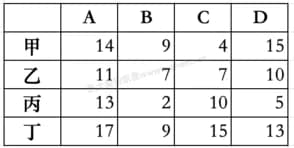
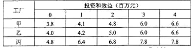
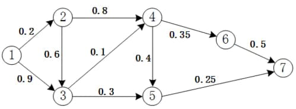
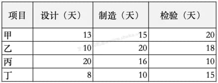
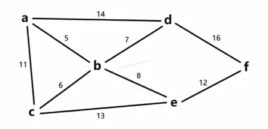
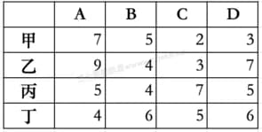

# 系统架构设计师综合知识题（1078412）

- 对应软考高级系统架构设计师章节：信息系统基础知识

- 页面标题：系统架构设计师综合知识题 - 学习模式模式 - 数学与经济管理
- 题目数量：27
- 子题数量：27
- 

---

> **知识点分组：动态规划**

## 1. 某服装店有甲、乙、丙、丁四个缝制小组。甲组每天能缝制 5 件上衣或 6 条裤子；乙组每天能缝制 6 件上衣或 7 条裤子；丙组每天能缝制7件上衣或 8 条裤子；丁组每天能缝制 8 件上衣或 9 条裤子。每组每天要么缝制上衣，要么缝制裤子，不能弄混。订单要求上衣和裤子必须配套（每套衣服包括一件上衣和一条裤子）。只要做好合理安排，该服装店 15 天最多能缝制（211）套衣服。
- 知识域：数学与经济管理 | 知识点：动态规划 | 来源：2014年11月第44题
- 标签：动态规划、中频

### 子题 1

- A. 208
- B. 209
- C. 210
- D. 211

- 答案：D
- 浓缩知识点：

产能配套最大化问题的核心解决逻辑可概括为：先利用比较优势原则完成基础分工，针对具备两类配套产品生产能力的多个单元，通过计算各单元两类产品的效率比值（如乙产品与甲产品的效率比），判断相对生产优势——比值越高，该单元生产乙产品的机会成本越低，应优先安排其生产乙产品；比值越低则优先生产甲产品，以此锁定效率最优的基础产能分配。接着通过等量约束进行灵活调节，对可分配生产时间的单元设变量，结合固定产能列出两类产品的总产能公式，令两类产能相等以保证完全配套，推导变量关系后，在变量的合理取值区间（0至总生产时长）内取能让配套数最大的边界值，最终得到最优结果。这类逻辑可拓展应用于零件组装、成套设备生产等各类需固定比例配套的生产规划场景，核心是通过相对优势分工降低产能浪费，再通过动态平衡实现配套数量最大化。

- 解析：

本题考察的是线性规划思想下的产能配套与质量等量约束。
目标是最大化成套数，即最大化上衣总数与裤子总数的最小值。
在“只能做上衣或裤子”的前提下，应当让“做上衣相对更有优势的组做上衣、做裤子相对更有优势的组做裤子”，再用等量约束平衡上衣与裤子数量。
关键思路与计算过程如下：以各组“裤子/上衣”的相对效率为衡量，甲、乙、丙、丁的比值依次为6/5=1.2、7/6≈1.167、8/7≈1.143、9/8=1.125，数值越大表示“做裤子相对更划算”。因此让甲优先做裤子、丁优先做上衣最优；乙、丙作为可调节项在上衣与裤子之间分配天数以平衡总量。设乙做上衣x天（则做裤子15−x天），丙做上衣y天（则做裤子15−y天）。固定安排为甲15天做裤子、丁15天做上衣。
上衣总数为J=丁8×15+乙6x+丙7y=120+6x+7y。
裤子总数为P=甲6×15+乙7(15−x)+丙8(15−y)=90+[105−7x]+[120−8y]=315−7x−8y。
为使成套数最大，应令上衣与裤子数量相等，即J=P。解方程120+6x+7y=315−7x−8y，得13x+15y=195，即y=13−(13/15)x。将其代回成套数N=J=120+6x+7y=211−x/15。为使N最大，应取x最小且满足0≤x≤15，故取x=0，此时y=13，得到N最大为211。对应的可行安排示例：甲全程做裤子15天，乙全程做裤子15天，丙做上衣13天做裤子2天，丁全程做上衣15天，最终恰好上衣211件、裤子211条。
选择选项 D。

---

## 2. 甲、乙、丙、丁4人加工A、B 、C、D四种工件所需工时如下表所示。指派每人加工一种工件，四人加工四种工件其总工时最短的最优方案中，工件B应由（丁）加工。
- 知识域：数学与经济管理 | 知识点：动态规划 | 来源：2015年11月第46题
- 标签：动态规划、中频

### 子题 1

- A. 甲
- B. 乙
- C. 丙
- D. 丁

- 答案：D
- 浓缩知识点：

指派问题是运筹学中典型的0-1规划问题，一般是将n项任务分配给n个执行者，目标是实现总成本最小化或总收益最大化，常见于人员任务分配、设备资源调度等场景。解决最小化指派问题的经典方法是匈牙利算法，核心思路是通过矩阵变换简化问题：先对成本矩阵的每行减去该行最小值，再对每列减去该列最小值，将原矩阵转化为含多个0元素的简化矩阵，接着在简化矩阵中寻找n个不同行不同列的独立0元素，这些0元素对应的位置就是最优分配方案；若无法直接找到足够的独立0元素，需用最少数量的直线覆盖所有0元素，再用未被覆盖区域的最小元素调整矩阵，重复操作直到找到完美匹配。针对最大化指派问题，可先将原收益矩阵转换为成本矩阵（用矩阵中的最大元素减去每个元素），再用相同算法求解。

- 解析：

本题考察的是指派问题（Assignment Problem）中的匈牙利算法或最优化分配方法。

---

## 3. 某公司有4百万元资金用于甲、乙、丙三厂追加投资。各厂获得不同投资款后的效益见下表。适当分配投资（以百万元为单位）可以获得的最大的总效益为（16.0）百万元。
- 知识域：数学与经济管理 | 知识点：动态规划 | 来源：2016年11月第46题
- 标签：动态规划、中频

### 子题 1

- A. 15.6
- B. 15.8
- C. 16.0
- D. 16.4

- 答案：C
- 浓缩知识点：

资源分配类动态规划属于多阶段决策优化问题，核心用于解决有限资源在多个对象间分配以追求最优目标（如最大效益、最小成本）的场景，常见于项目投资、生产调度、物资配置等领域。这类问题的关键是合理定义状态与状态转移：通常将dp[i][j]定义为把总量为j的资源分配给前i个对象时的最优结果；状态转移需枚举所有可能的资源拆分方式，即dp[i][j]取所有0≤k≤j范围内，dp[i-1][j-k]（前i-1个对象分配j-k资源的最优值）与第i个对象分配k资源的收益或成本之和的最大值。求解时一般先初始化单个对象的资源分配最优值，再逐步将后续对象纳入计算，通过遍历所有可能的资源分配拆分，逐步推导出全对象全资源量的最优解，在离散型资源（如本题以百万元为整数单位）的场景下，这种方法能精准枚举所有可行方案，确保找到全局最优解。

- 解析：

本题考察的是资源分配类动态规划（投资组合优化） 的建模与求解。
设dp[i][j]表示把总资金j（0≤j≤4）分配给前i个工厂（按顺序为甲、乙、丙中的第i个）的最大效益。根据题表可得甲、乙、丙在0～4百万元投资下的效益函数值，状态转移为：dp[i][j] = max₀≤k≤j{ dp[i−1][j−k] + value_i(k) }。枚举总投资为4的分配方案可知，甲、乙、丙分别投资0、1、3百万元时，总效益为4.0+4.2+7.8=16.0百万元，为最大值，因此选择C。

---

> **知识点分组：概率统计**

## 4. 1路和2路公交车都将在10分钟内均匀随机地到达同一车站，则它们相隔4分钟内到达该站的概率为（0.64）。
- 知识域：数学与经济管理 | 知识点：概率统计 | 来源：2013年11月第41题
- 标签：概率统计、中等、中频

### 子题 1

- A. 36
- B. 48
- C. 0.64
- D. 76

- 答案：C
- 浓缩知识点：

几何概型适用于连续型随机变量的概率求解，核心逻辑是事件发生的概率与该事件对应的几何区域度量（长度、面积、体积等）成正比。处理这类问题时，需先将实际问题转化为几何空间问题，明确所有可能结果组成的样本空间，它可对应一维线段、二维平面区域、三维空间区域等，再定位目标事件对应的子区域，最终通过子区域与样本空间的度量比值计算概率。当涉及两个及以上独立的均匀连续随机变量时，常可构建对应维度的几何样本空间，比如二维平面区域，通过区域度量的比值来简化概率计算，这类思路也可推广到更多维度的连续随机变量组合场景中。

- 解析：

本题考察的是几何概型。

---

## 5. 计算机产生的随机数大体上能在（0，1）区间内均匀分布。假设某初等函数 f(x) 在（0，1）区间内取值也在（0，1）区间内，如果由计算机产生的大量的（M个）随机数对（r1，r2）中，符合 r2 ≤ f(r1) 条件的有N个，则 N/M 可作为（求积分 ∫ 0 1 𝑓 ( 𝑥 ) 𝑑 𝑥 ∫ 0 1 ​ f(x)dx）的近似计算结果。

- 知识域：数学与经济管理 | 知识点：概率统计 | 来源：2022年11月第58题
- 标签：概率统计、中频

### 子题 1

- A. 求解方程
𝑓
(
𝑥
)
=
𝑥
f(x)=x
- B. 求
𝑓
(
𝑥
)
f(x)大值
- C. 求
𝑓
(
𝑥
)
f(x)的极小值
- D. 求积分
∫
0
1
𝑓
(
𝑥
)
𝑑
𝑥
∫
0
1
​
f(x)dx

- 答案：D
- 浓缩知识点：

定积分的几何意义是，在区间[a,b]上，函数y=f(x)的定积分∫ₐᵇf(x)dx对应由曲线y=f(x)、直线x=a、x=b以及x轴围成的曲边梯形的面积。几何概型中，当试验的所有可能结果对应一个可度量的区域（比如平面区域的面积）时，某事件发生的概率等于该事件对应的子区域度量与总区域度量的比值，且当试验次数足够大时，事件的发生频率会趋近于其概率。基于这两个知识点延伸出的蒙特卡洛积分法，可利用均匀分布的随机数对，通过统计满足y≤f(x)的样本点在总样本点中的占比，来近似计算函数在区间上的定积分，这种方法不需要复杂的解析运算，特别适合处理高维空间或难以用常规积分方法求解的积分问题，是数值积分领域的重要方法之一。

- 解析：

本题可根据几何概型的原理，结合定积分的几何意义来分析
𝑁
𝑀
M
N
	​

所代表的近似计算结果。
1.分析随机数对
(
𝑟
1
,
𝑟
2
)
(r1,r2)的分布情况
已知计算机产生的随机数对
(
𝑟
1
,
𝑟
2
)
(r1,r2)在
(
0
,
1
)
×
(
0
,
1
)
(0,1)×(0,1)这个正方形区域内均匀分布（其中
(
0
,
1
)
×
(
0
,
1
)
(0,1)×(0,1)表示横坐标
𝑟
1
r1取值范围是
(
0
,
1
)
(0,1)，纵坐标
𝑟
2
r2取值范围也是
(
0
,
1
)
(0,1) ，该正方形区域的面积
𝑆
=
1
×
1
=
1
S=1×1=1 。

---

## 6. x 在 U(0, 1) 区间内均匀分布的情况下，P(X < 0.5) 的值是（1/2）
- 知识域：数学与经济管理 | 知识点：概率统计 | 来源：2025年11月第2题
- 标签：概率统计、中等、中频

### 子题 1

- A. 0
- B. 1
- C. 1/2
- D. 1/4

- 答案：C
- 浓缩知识点：

连续型均匀分布U(a,b)的核心特征是随机变量在区间[a,b]内各点的概率密度恒定，计算其落在某一子区间的概率可遵循几何占比原则：若子区间为[c,d]且满足a≤c<d≤b，则对应概率为该子区间长度与总区间长度的比值，即P(c<X<d)=(d-c)/(b-a)。对于标准均匀分布U(0,1)，总区间长度为1，因此随机变量落在[0,k]（0<k<1）的概率直接等于k；拓展到任意均匀分布U(a,b)，只要目标子区间完全包含在[a,b]范围内，都可通过长度占比快速推导概率，这是因为均匀分布的概率本质上对应区间长度的相对占比，与具体端点数值无关，仅由区间长度差决定。

- 解析：

本题考察的是均匀分布的几何理解。

---

> **知识点分组：建模概念**

## 7. 以下关于数学建模的叙述中，不正确的是（数学模型应该用统一的、普适的标准对其进行评价）。
- 知识域：数学与经济管理 | 知识点：建模概念 | 来源：2016年11月第47题
- 标签：建模概念、困难、中频

### 子题 1

- A. 数学模型是对现实世界的一种简化的抽象描述
- B. 数学建模时需要在简单性和准确性之间求得平衡
- C. 数学模型应该用统一的、普适的标准对其进行评价
- D. 数学建模需要从失败和用户的反馈中学习和改进

- 答案：C
- 浓缩知识点：

数学建模核心知识点：数学模型是对现实世界复杂现象的简化抽象描述，通过合理假设将现实问题转化为可进行数学分析的形式。建模过程中需平衡模型的简单性与准确性，简单性利于模型的求解和理解，但可能牺牲一定描述精度，过度追求准确性易使模型复杂难解，需结合实际需求灵活权衡。数学模型无统一普适的评价标准，需依据具体问题的应用领域、建模目的来设定，比如工程领域可能优先考量精度，实时系统则更关注计算效率与可操作性。此外，数学建模是持续迭代的过程，需从建模失败经验、用户实际反馈中不断调整优化模型，提升其适配性与实用性。

- 解析：

本题考察的是数学建模的基本概念和特点。

---

## 8. 数学模型常带有多个参数，而参数会随环境因素而变化。根据数学模型求出最优解或满意解后，还需要进行（灵敏性分析），对计算结果进行检验，分析计算结果对参数变化的反应程度 。
- 知识域：数学与经济管理 | 知识点：建模概念 | 来源：2019年11月第38题
- 标签：建模概念、中频

### 子题 1

- A. 一致性分析
- B. 准确性分析
- C. 灵敏性分析
- D. 似然性分析

- 答案：C
- 浓缩知识点：

数学建模中，当模型包含多个易受环境因素影响而变动的参数，且已求得最优解或满意解时，灵敏性分析是关键的后续环节。它核心作用是检验计算结果，分析结果对参数变化的响应程度，借此判断模型的鲁棒性，识别对结果影响显著的关键参数，进而优化参数设置，提升模型在实际场景中的适配性与稳定性。与之区分的是，一致性分析聚焦系统各部分的协调性，准确性分析用于评估模型结果与真实值的误差，似然性分析多应用于统计学领域，侧重评估模型适配观测数据的可能性，均不涉及参数变动对模型结果的敏感性研究。

- 解析：

本题考察的是数学建模中灵敏度分析的概念与作用。
与之区分的是，一致性分析聚焦系统各部分的协调性，准确性分析用于评估模型结果与真实值的误差，似然性分析多应用于统计学领域，侧重评估模型适配观测数据的可能性，均不涉及参数变动对模型结果的敏感性研究。数学建模中，当模型包含多个易受环境因素影响而变动的参数，且已求得最优解或满意解时，灵敏性分析是关键的后续环节。
本小问答案是 灵敏性分析。题干中的“根据数学模型求出最优解或满意解后，还需要进行灵敏性分析对计算结果进行检验，分析计算结果对参数变化的反应程度”对应灵敏性分析。
因此，选项 C 正确。

---

## 9. 为近似计算 XYZ 三维空间内由三个圆柱 x2+y2≤1，y2+z2≤1，x2+z2≤1 相交部分 V 的体积，以下四种方案中，（V 位于某正立方体 M 内，利用M内均匀分布的随机点落在 V 中的比例进行计算）最容易理解，最容易编程实现。
- 知识域：数学与经济管理 | 知识点：建模概念 | 来源：2020年11月第34题
- 标签：建模概念、中频

### 子题 1

- A. 在 z=0 平面中的圆 x2+y2≤1 上，近似计算二重积分
- B. 画出 V 的形状，将其分解成多个简单形状，分别计算体积后，再求和
- C. 将 V 看作多个区域的交集，利用有关并集、差集的体积计算交集体积
- D. V 位于某正立方体 M 内，利用M内均匀分布的随机点落在 V 中的比例进行计算

- 答案：D
- 浓缩知识点：

蒙特卡洛方法是依托概率统计原理的数值计算方法，核心是通过大量随机采样，利用样本落在目标区域的比例来估算区域体积、多维积分等数值。面对三圆柱交集这类边界复杂、难以用几何分解或直接公式计算的区域，该方法无需复杂推导，只需生成覆盖目标区域的包含空间内的随机点，判断点是否满足所有区域约束条件，通过命中率就能近似得到目标体积，思路清晰、编程实现简单。除此之外，蒙特卡洛方法的收敛速度不受空间维度影响，在高维复杂空间的数值估算场景中优势显著，常被用于传统解析方法难以处理的不规则几何体测量、高维积分求解等任务。

- 解析：

本题考察的是蒙特卡洛方法在三维几何体积计算中的应用。
蒙特卡洛算法是一种基于概率统计原理的数值计算方法，特别适用于多维积分或复杂几何区域体积估算，具有实现简单、适应性强的特点。
A选项近似计算二重积分：错误。该方法忽略了三维区域 V 的完整结构，且在 z 轴方向的约束无法在该平面表达，近似存在偏差，实现困难。
B选项 分解成多个简单形状：错误。由于三圆柱交集区域的几何形状较复杂，精确分解难度大，且逻辑复杂，不易编程实现。
C选项 利用交集体积公式：错误。虽然理论上可行，但涉及复杂集合运算及体积公式推导，计算与实现复杂度高。
D选项 蒙特卡洛方法：正确。只需生成大量随机点，判断其是否同时满足三个圆柱的条件（即是否在 V 内），通过命中率估算体积，算法思路清晰，编程简单，适用于复杂几何体积的近似计算。
所以选择 D。

---

> **知识点分组：网络流量**

## 10. 小王需要从①地开车到⑦地，可供选择的路线如下图所示。图中，各条箭线表示路段及其行驶方向，箭线旁标注的数字表示该路段的拥堵率（描述堵车的情况，即堵车概率）。拥堵率=1-畅通率，拥堵率=0时表示完全畅通，拥堵率=1时表示无法行驶。根据该图，小王选择拥堵情况最少（畅通情况最好）的路线是（①②③⑤⑦）。
- 知识域：数学与经济管理 | 知识点：网络流量 | 来源：2015年11月第47题
- 标签：网络流量、低频

### 子题 1

- A. ①②③④⑤⑦
- B. ①②③④⑥⑦
- C. ①②③⑤⑦
- D. ①②④⑥⑦

- 答案：C
- 浓缩知识点：

首先要掌握独立事件的概率乘法原理：当多个事件彼此独立时，它们同时发生的概率等于各事件发生概率的乘积。在路线畅通率计算中，单路段畅通率为1减去该路段的拥堵率，而整条路线的畅通率等于路径上所有路段畅通率的乘积，因为只有所有路段都畅通，这条路线才具备完整的通行条件。在此基础上，多路径优化决策的思路是：在存在多条可选路径的场景，比如交通出行、物流运输中，先确定核心决策目标，比如最高畅通率、最短耗时、最低成本等，再针对每条路径，依据路段的对应参数计算出路径的综合目标值，最后通过对比各路径的综合目标值，筛选出最优方案。这类方法可广泛应用于各类需要多方案对比的决策场景，核心是将定性的选择转化为定量的指标计算与对比，提升决策的科学性。

- 解析：

本题考察的是 概率计算中的乘法原理和路径优化问题。
A选项 ①②③④⑤⑦：
畅通率 = (1-0.2) × (1-0.6) × (1-0.1) × (1-0.4) × (1-0.25) = 0.8 × 0.4 × 0.9 × 0.6 × 0.75 = 0.1296
B选项 ①②③④⑥⑦：
畅通率 = (1-0.2) × (1-0.6) × (1-0.1) × (1-0.35) × (1-0.5) = 0.8 × 0.4 × 0.9 × 0.65 × 0.5 = 0.0936
C选项 ①②③⑤⑦：
畅通率 = (1-0.2) × (1-0.6) × (1-0.3) × (1-0.25) = 0.8 × 0.4 × 0.7 × 0.75 = 0.168
D选项 ①②④⑥⑦：
畅通率 = (1-0.2) × (1-0.8) × (1-0.35) × (1-0.5) = 0.8 × 0.2 × 0.65 × 0.5 = 0.052
对比可知，C选项①②③⑤⑦的畅通率最高，为0.168，因此为最佳路线。
正确答案：C. ①②③⑤⑦

---

> **知识点分组：线性规划**

## 11. 在如下线性约束条件下：2x+3y≤30；x+2y≥10；x≥y；x≥5；y≥0，目标函数 2x+3y 的极小值为（17.5）。
- 知识域：数学与经济管理 | 知识点：线性规划 | 来源：2018年11月第43题
- 标签：线性规划、中频

### 子题 1

- A. 5
- B. 17.5
- C. 20
- D. 25

- 答案：B
- 浓缩知识点：

二维线性规划求最值核心知识点：由线性约束不等式确定的可行域是平面凸集，通常为凸多边形或无界区域，确定时需将约束不等式转化为等式画出对应直线，再根据不等式方向筛选符合条件的区域并取交集。线性目标函数的最值，包括极大值、极小值，必然出现在可行域的顶点上，若目标函数与某条约束直线斜率相同，最值也可能在该直线对应的可行域边上的所有点取得。求解时需先定位可行域的所有顶点，再代入目标函数计算比较得出结果；该逻辑可推广至高维线性规划，高维中可行域为凸多面体，最值仍落于顶点，不过高维场景通常借助专业工具完成计算。

- 解析：

本题考察的是线性规划在二维平面下的最值求解问题。
将题中的约束条件取等号作为直线，获得可行域，然后将顶点带入 2x+3y 中来求得最值。
作图法步骤如下，画先根据不等式把区域画出来，然后把 z = 2x+3y （红色虚线部分）直接画出来。
从下往上移动直线看与区域的第一个交点是什么，然后代入求解。

---

## 12. 非负变量 x 和 y,在 x≤4,y≤3 和 x+2y≤8 的约束条件下，目标函数 2x+3y 的最大值为（14）。
- 知识域：数学与经济管理 | 知识点：线性规划 | 来源：2021年11月第45题
- 标签：线性规划、中频

### 子题 1

- A. 13
- B. 14
- C. 15
- D. 16

- 答案：B
- 浓缩知识点：

二元线性规划求目标函数最值的核心知识点：首先要明确包含变量非负约束在内的所有约束条件，这些约束会在二维平面中构成多边形可行域，而线性目标函数的最值必然出现在可行域的顶点或顶点所在的边界线段上。求解时，先通过联立约束条件对应的直线方程，求出可行域所有顶点的坐标，再将各顶点坐标代入目标函数计算取值，比较后即可得到最值。拓展来看，这类思路可延伸至多元线性规划场景，此时常采用单纯形法进行求解；线性规划还广泛应用于资源分配、生产排产等实际问题中。另外需要注意，若目标函数对应的直线与可行域某条边界直线平行，那么该边界上的所有点都是最优解，会存在无数个最值点。

- 解析：

本题考察的是线性规划中目标函数的最大值求解问题。
在线性规划中，常通过作图法或代数法求目标函数在约束条件下的最优解。本题为二元线性规划问题，适合使用图解法或代数法求交点后代入目标函数计算。
根据题意建立约束条件：
x ≤ 4，y ≤ 3，x + 2y ≤ 8，x ≥ 0，y ≥ 0
求这组约束形成的可行域的顶点坐标，然后代入目标函数 2x+3y进行比较。关键交点有：

---

## 13. 如果X和Y都是某线性规划问题的最优解，则当（λ,μ&gt;=0，λ+μ=1）时，λX+μY一定也是其最优解。
- 知识域：数学与经济管理 | 知识点：线性规划 | 来源：2024年5月第9题
- 标签：线性规划、中频

### 子题 1

- A. λ+μ=1
- B. λ,μ>=0，λ+μ=1
- C. λ,μ>=0
- D. λ,μ>=0，λ+μ=2

- 答案：B
- 浓缩知识点：

线性规划问题的可行域是由约束条件确定的凸多面体，属于凸集合，其最优解集合同样具有凸性特征。若存在两个不同的最优解X和Y，那么满足系数λ、μ均非负且λ+μ=1的凸组合λX+μY，必然也是该问题的最优解，这类组合对应X与Y连线上的所有点。进一步拓展可知，当线性规划存在多个最优解时，全部最优解构成一个凸集，任意多个最优解的凸组合都属于最优解范畴；若最优解唯一，则该凸集退化为单个点。

- 解析：

本题考察的是线性规划最优解的凸性性质。
在线性规划中，目标函数是线性的，约束条件构成一个凸多面体（即可行域是一个凸集合）。一个重要的性质是：如果X和Y都是最优解，则在X和Y之间的任意凸组合也是最优解。
所谓凸组合，指的是形如 λX + μY，且满足 λ ≥ 0，μ ≥ 0，λ + μ = 1 的线性组合。它代表从X到Y之间连线上所有点，属于线段内的点。
A选项 λ+μ=1：缺少λ,μ≥0的限制，不一定保证是凸组合，不正确。
B选项 λ,μ≥0，λ+μ=1：符合凸组合的定义，表示X与Y之间所有的线性插值点，这些点也都是最优解，正确。
C选项 λ,μ≥0：这只是线性组合的非负条件，但λ+μ不一定为1，可能会超出X与Y之间的连线段，不一定仍是最优解，不正确。
D选项 λ,μ≥0，λ+μ=2：不满足凸组合的定义，实际表示在X与Y之间连线的外部延长线上，不能保证仍是最优解，不正确。
因此，选项 B 正确。

---

## 14. 已知实数 x、y 满足以下线性不等式约束 x − 1 ≥ 0， x − y ≤ 0， x + y − 4 ≤ 0 求比值 y/x 的最大值（3）。

- 知识域：数学与经济管理 | 知识点：线性规划 | 来源：2025年5月第12题
- 标签：线性规划、中频

### 子题 1

- A. 1
- B. 2
- C. 3
- D. 4

- 答案：C
- 浓缩知识点：

线性规划中处理形如y/x或(y-b)/(x-a)的分式型目标函数时，可将其转化为几何意义求解，y/x对应可行域内的点(x,y)与原点连线的斜率，(y-b)/(x-a)则对应点(x,y)与定点(a,b)连线的斜率。确定线性约束的可行域时，需先画出各约束条件对应的边界直线，再根据不等号方向划定区域，取交集得到可行域，线性约束下的可行域多为凸多边形或无界凸区域。此类斜率型目标函数的最值一般出现在可行域的顶点位置，求解时可先求出可行域的所有顶点，计算各顶点与对应定点连线的斜率，对比后得到最值；若可行域无界，需结合斜率的变化趋势判断是否存在最值。此外，对于其他形式的分式目标函数，也可尝试通过代数变形或几何转换，将问题转化为熟悉的几何量求解，拓展代数最值问题的解题思路。

- 解析：

本题考察线性规划中“直线约束可行域边界与目标函数极值” 的求解思路。
第一步 确定可行域
由 x − 1 ≥ 0 得 x ≥ 1；
由 x − y ≤ 0 得 y ≥ x；
由 x + y − 4 ≤ 0 得 x + y ≤ 4。
第二步 化简约束区间
将 y ≥ x 代入 x + y ≤ 4 可得 x + x ≤ 4，即 2x ≤ 4，故 1 ≤ x ≤ 2。
在此区间内，为使 y/x 最大，应令 y 取可行上界 4 − x，得到目标函数
f(x)= (4 − x)/x = 4/x − 1。
第三步 求极大值
f(x) 随 x 增大而单调递减，故取最小的 x=1，可得 y=3，极大值 f_max = 3/1 = 3。

---

> **知识点分组：应用数学**

## 15. 某企业拟生产甲、乙、丙、丁四个产品。每个产品必须依次由设计部门、制造部门和检验部门进行设计、制造和检验，每个部门生产产品的顺序是相同的。各产品各工序所需的时间如下表所示： 只要适当安排好项目实施顺序，企业最快可以在（84）天全部完成这四个项目。

- 知识域：数学与经济管理 | 知识点：应用数学 | 来源：2013年11月第40题
- 标签：应用数学、中等、高频

### 子题 1

- A. 84
- B. 86
- C. 91
- D. 93

- 答案：A
- 浓缩知识点：

三机同序流水车间调度（工序顺序固定为M1→M2→M3）中，若要最小化总完工时间，可采用Johnson法的扩展形式，核心是通过引入虚拟机器G（G为M1与M2的作业时间之和）、H（H为M2与M3的作业时间之和），将三机问题转化为双机调度问题。后续遵循Johnson法规则：从所有作业的G、H值中找到最小项，若该值属于G，则将对应作业排在当前序列的最前端；若属于H，则排在当前序列的最后端，重复此操作直至所有作业完成排序。得到最优或近似最优序列后，需逐机计算各作业的完工时间，计算时需注意，后一工序的开工时间取该作业前一工序的完工时间与前一作业本工序的完工时间中的较大值，最终最后一个作业的最后工序完工时间即为总工期。此外，Johnson法最初用于双机同序流水车间调度，扩展到三机场景时，当中间机器的最大作业时间不小于首尾两台机器的最大作业时间时，该扩展方法能得到最优解，其他场景下也能得到较优的调度结果，在生产运作管理的作业调度中应用广泛。

- 解析：

本题考察的是三机流水车间（Flow Shop）调度的Johnson法（扩展到三工序），目标是最小化总完工时间（Makespan）。
已知三道工序顺序固定：设计(M1)→制造(M2)→检验(M3)。各作业时间：
甲：(13,15,20)；乙：(10,20,18)；丙：(20,16,10)；丁：(8,10,15)。
当问题为三机同序流水线时，可引入两台“虚拟机器”：G=M1+M2，H=M2+M3，并对(G,H)应用Johnson法排列作业顺序。计算：
丁：G=8+10=18，H=10+15=25
甲：G=13+15=28，H=15+20=35
乙：G=10+20=30，H=20+18=38
丙：G=20+16=36，H=16+10=26
按Johnson法：找全体中最小者。
最小为丁的G=18，排在最前；从余下中最小为丙的H=26，排在最后；
在剩余甲、乙中，最小为甲的G=28，排在当前最前；最后为乙。
由此得到最优序列：丁→甲→乙→丙。
在该序列下，逐机计算完工时间（单位：天）：
丁：M1 0–8；M2 8–18；M3 18–33
甲：M1 8–21；M2 max(18,21)=21–36；M3 max(33,36)=36–56
乙：M1 21–31；M2 max(36,31)=36–56；M3 max(56,56)=56–74
丙：M1 31–51；M2 max(56,51)=56–72；M3 max(74,72)=74–84
总工期（Makespan）=84天，即选项A。

---

## 16. 生产某种产品有两个建厂方案：（1）建大厂，需要初期投资 500 万元。如果产品销路好，每年可以获利 200 万元；如果销路不好，每年会亏损 20 万元。（2）建小厂，需要初期投资 200 万元。如果产品销路好，每年可以获利 100 万元；如果销路不好，每年只能获利 20 万元。市扬调研表明，未来 2 年这种产品销路好的概率为 70%。如果这 2 年销路好，则后续 5 年销路好的概率上升为 80%；如果这 2 年销路不好，则后续5年销路好的概率仅为 10%。为取得7年最大总收益，决策者应（建大厂，总收益略多于 300 万元）。
- 知识域：数学与经济管理 | 知识点：应用数学 | 来源：2014年11月第45题
- 标签：应用数学、中等、高频

### 子题 1

- A. 建大厂，总收益超 500 万元
- B. 建大厂，总收益略多于 300 万元
- C. 建小厂，总收益超 500 万元
- D. 建小厂，总收益略多于 300 万元

- 答案：B
- 浓缩知识点：

风险型多阶段决策常以期望收益最大化为核心决策准则，这类决策需考量多阶段间的状态转移概率，即前期的市场表现等状态结果会改变后续各状态的发生概率。操作时，要先明确不同决策方案的初始投入、各状态下的阶段收益，分阶段计算不同状态路径下的期望收益，再扣除初始投入得到总期望收益，最终通过对比各方案的总期望收益确定最优选择。该方法不仅适用于建厂决策，还可推广到项目投资、产能布局等多类场景，核心是用概率量化不确定性，将多阶段的复杂决策拆解为可计算的期望收益对比，以此实现理性决策。

- 解析：

本题考察的是期望收益计算与不确定性条件下的最优决策（期望最大化）。

---

## 17. 某厂生产的某种电视机，销售价为每台 2500 元，去年的总销售量为 25000 台，固定成本总额为 250 万元，可变成本总额为 4000 万元，税率为 16%，则该产品年销售量的盈亏平衡点为（5000）台（只有在年销售量超过它时才能盈利）。
- 知识域：数学与经济管理 | 知识点：应用数学 | 来源：2020年11月第35题
- 标签：应用数学、中等、高频

### 子题 1

- A. 5000
- B. 10000
- C. 15000
- D. 20000

- 答案：A
- 浓缩知识点：

盈亏平衡点又称保本点，指企业生产经营中总收入恰好等于总成本（含相关税费）时的业务量，此时企业不盈不亏，业务量超过该数值才会产生盈利，不足则亏损。计算盈亏平衡点时，需明确总成本由固定成本和可变成本构成，固定成本是不随业务量变动的支出，比如厂房设备折旧、管理人员固定薪资；可变成本是随业务量成正比例变动的支出，比如生产原材料费用、计件工人工资。如果涉及税费，需将税费计入成本范畴一同核算，通常可先通过已知业务量数据算出可变成本占销售收入的比例，再通过列方程（总收入=固定成本+可变成本+税费）求解对应的盈亏平衡业务量。企业掌握盈亏平衡点的计算与应用，能清晰判断盈利门槛，还可通过优化成本结构（如压缩无效固定支出、降低单位可变成本）、合理调整定价、优化税务筹划等方式降低盈亏平衡点，进而提升盈利空间与市场抗风险能力。

- 解析：

本题考察盈亏平衡点的概念和计算方法。
本题难点在于可变成本的处理方式，由于销售收入为：
25000
×
2500
=
6250
 
万元
25000×2500=6250万元
可变成本为 4000 万元，因此可变成本占比为：
4000
6250
=
64
%
6250
4000
	​

=64%
设盈亏平衡时的销售量为 X 台，列方程如下：

2500000
+
𝑋
×
2500
×
64
%
+
𝑋
×
2500
×
16
%
=
𝑋
×
2500
2500000+X×2500×64%+X×2500×16%=X×2500

2500000
+
𝑋
×
2500
×
(
0.64
+
0.16
)
=
𝑋
×
2500
2500000+X×2500×(0.64+0.16)=X×2500

1000
+
0.8
𝑋
=
𝑋
⇒
𝑋
=
5000
1000+0.8X=X⇒X=5000
该产品的年销售盈亏平衡点为 5000 台，只有在销售量超过该值时，企业才会盈利。

---

## 18. 0-1000的数字里，只有一个5的数字个数（243）。
- 知识域：数学与经济管理 | 知识点：应用数学 | 来源：2024年11月第3题
- 标签：应用数学、中等、高频

### 子题 1

- A. 242
- B. 243
- C. 225
- D. 224

- 答案：B
- 浓缩知识点：

在组合计数的数字计数问题中，针对“仅含一个特定数字”这类题型，核心方法是按数的位数分类讨论，结合排除法与乘法原理求解。分类时需依据数的位数（如一位数、两位数、多位数）拆分问题，分析特定数字在不同数位的分布情况，同时注意最高数位不能为0的数位规则，且要保证其余数位均不出现该特定数字，用乘法原理计算每一类中符合条件的数的数量，最后累加各类结果得到总数。该方法可拓展至仅含单个任意指定数字、含多个相同指定数字等类似计数场景，通过拆分问题、明确各数位可选范围，高效解决复杂数字计数问题。

- 解析：

本题考察的是组合计数与排除法的综合运用。

---

## 19. 100个人，会篮球的有45人，会乒乓球的有53人，会足球的有55人，会篮球和乒乓球的有28人，会篮球和足球的有32人，会乒乓球和足球的有35人，三个都会的有20人，三个都不会的有多少人（22）。
- 知识域：数学与经济管理 | 知识点：应用数学 | 来源：2024年11月第23题
- 标签：应用数学、高频

### 子题 1

- A. 20
- B. 21
- C. 22
- D. 23

- 答案：C
- 浓缩知识点：

三个集合的容斥原理是解决多群体重叠计数问题的核心方法，计算至少满足一个集合条件的总人数时，先累加单个集合的人数，再减去两两集合的交集人数以避免重复统计重叠部分，最后加上三个集合的交集人数弥补之前多扣除的三重重叠部分。该原理可广泛应用于技能覆盖、活动参与、用户画像重叠等多种场景，若已知整体总人数，用总人数减去通过容斥原理算出的满足至少一个条件的人数，就能得到完全不满足任何条件的人数，这是其常见延伸用法。

- 解析：

本题考察的是集合的容斥原理。
对于三个集合，它们的并集计算公式如下：

可以计算得到 45+53+55-28-32-35+20=78，，所以一个都不参加的人数就是 100-78=22
因此，选项 C 正确。

---

## 20. 有5个对象，每个对象有2种取值（例如0或1），假设所有对象的取值彼此独立，那么一共可以组成多少种不同的取值组合（32）。
- 知识域：数学与经济管理 | 知识点：应用数学 | 来源：2025年5月第56题
- 标签：应用数学、中等、高频

### 子题 1

- A. 25
- B. 32
- C. 10
- D. 2
32
2
32

- 答案：B
- 浓缩知识点：

分步乘法计数原理是计算独立事件组合数的核心方法：当存在n个相互独立的对象，每个对象有k种不同的可选取值时，总的取值组合数为k的n次方。这一原理的关键前提是各对象的取值选择彼此独立、互不影响，每一步的选择都不会限制其他对象的可选范围。生活中这类应用很常见，比如n位二进制数的总个数为2的n次方，因为每个数位仅有0、1两种选择；再比如设置m位纯数字密码，每位有0-9共10种选择，总组合数就是10的m次方。

- 解析：

本题考察的是组合数与指数运算的基本知识。
每个对象有2种取值，总共有5个对象。
所有对象的取值彼此独立，因此每个对象的选择不影响其他对象。
总组合数
2
5
=
32
2
5
=32

---

## 21. 75个小朋友去游乐场玩 3 种项目，每个项目收费 5 元。已知：有 20 个小朋友 3 个项目都玩了，55 个小朋友至少玩了两项项目，全体小朋友一共花了 700 元。请问，有多少个小朋友一项项目都没玩（10）。
- 知识域：数学与经济管理 | 知识点：应用数学 | 来源：2025年11月第10题
- 标签：应用数学、高频

### 子题 1

- A. 20
- B. 10
- C. 5
- D. 15

- 答案：B
- 浓缩知识点：

解决这类群体活动统计问题的核心知识点及拓展应用如下：核心知识点包括，一是分类计数法，可按行为参与程度对群体进行无重叠、无遗漏的分类，比如按参与项目数量分为0项、1项、2项、3项四类，以此拆分总人数、总费用等总量指标；二是基础容斥原理的运用，“至少参与k项”的群体规模，等于参与k项及以上各子群体的数量之和，能通过已知的“至少两项”“三项都参与”的数量，反向算出“恰好两项”的群体人数；三是人次概念与等量转换，总花费可通过单价换算为总参与人次，同时总人次也可由不同参与程度的群体人数分别乘以对应参与项数后求和得到，通过这两种计算方式的等式关系，可求解未知的群体数量。这类方法可迁移到社团参与统计、套餐消费统计等多种场景，核心是理清个体数量与行为次数的对应关系，用分类拆分和等量代换拆解复杂问题。

- 解析：

本题考察的是分类计数与简单容斥原理在应用题中的运用。
整体思路是设出“恰好玩 1 项、2 项、3 项”的人数，用总人数与总费用列方程求解，进而求出没玩的那部分人数。

---

## 22. 工作量计算，本来计划 15 天完成，如果要提前 3 天完成，每天工作量需要增加多少（25%）。
- 知识域：数学与经济管理 | 知识点：应用数学 | 来源：2025年11月第11题
- 标签：应用数学、高频

### 子题 1

- A. 10%
- B. 20%
- C. 25%
- D. 30%

- 答案：C
- 浓缩知识点：

工程问题核心知识点：当总工作量固定时，工作时间与工作效率成反比例关系。实际应用中，不管是提前完成还是延迟交付任务，都可紧扣这个反比逻辑分析：若已知原计划工作时间和调整后的工作时间，原时间与新时间的比值，对应新效率与原效率的反比比值；计算效率变化比例时，用（新效率-原效率）÷原效率即可，也可简化为（原工作时间-新工作时间）÷新工作时间×100%来快速算提升比例。为简化计算，还可赋值总工作量为原时间和新时间的最小公倍数，把抽象效率转化为具体数值，这类方法也适用于多人协作、分阶段完成等各类总工作量固定的工程问题，核心始终是抓住总工作量不变的前提，利用时间与效率的反比关系推导数据。

- 解析：

本题考察的是工期缩短与每日工作量增加比例的计算关系。
总工作量保持不变，原计划用 15 天完成，现在要求提前 3 天，即在 12 天内完成同样的工作量。最简单的办法是用最小公倍数。
假设原本的工作量为 60，那么 15 天原来每天做 4 份，现在12 天天，每天做 5 份。增加量 = (5 − 4) / 4 = 1/4 = 25%
这就是最小公倍数（60）带来的好处：直接把工作量化为同一单位，数字秒算。
所以答案是：C 25%

---

## 23. 6个区域铺设光纤，要求这6 个区域之间都能互相通信，则铺设光纤的最低成本为（38）。
- 知识域：数学与经济管理 | 知识点：应用数学 | 来源：2026年5月第1题
- 标签：应用数学、中等、高频

### 子题 1

- A. 38
- B. 36
- C. 37
- D. 39

- 答案：A
- 浓缩知识点：

最小生成树是在连通无向带权图中选取能连通全部顶点且不形成回路的一组边，并使边权总和最小。常用算法包括 Kruskal 和 Prim：Kruskal 按边权从小到大选边，并用连通分量或并查集判断是否成环；Prim 从某个顶点出发，每次选择连接已加入顶点集合与未加入顶点集合的最小权边。解题时不能把所有局部较小的边简单相加，关键是覆盖全部顶点、边数为顶点数减一且不能形成回路。它解决的是“用最低总代价连通所有节点”的网络设计问题，常见于布线、管网、通信链路选型等场景。与最短路径不同，最小生成树关注整体连通代价，不关心某两个顶点之间路径是否最短；若图不连通，则只能得到各连通分量的最小生成森林。

- 解析：

本题考察的是最小生成树。

---

## 24. 甲 20 天完成、乙 30 天完成。甲乙先一起做，剩余工作由甲单独做 15 天完成，则两人一起做了（3 天）天。
- 知识域：数学与经济管理 | 知识点：应用数学 | 来源：2026年5月第2题
- 标签：应用数学、中等、高频

### 子题 1

- A. 2 天
- B. 3 天
- C. 4 天
- D. 5 天

- 答案：B
- 浓缩知识点：

设两人一起做了 
𝑥
x 天。甲效率为 
1
20
20
1
	​

，乙效率为 
1
30
30
1
	​

，甲最后单独做 
15
15 天完成 
15
20
=
3
4
20
15
	​

=
4
3
	​

 的工作，因此两人合做部分完成 
1
4
4
1
	​

。合做效率为 
1
20
+
1
30
=
1
12
20
1
	​

+
30
1
	​

=
12
1
	​

，所以 
𝑥
12
=
1
4
12
x
	​

=
4
1
	​

，
𝑥
=
3
x=3。工程问题的核心是把总工作量设为 1，再把“效率、工作时间、完成量”统一到同一方程中。多人协作时效率相加，单独工作时只计算对应人的效率；剩余工作、先后顺序和“最后由某人完成”是建立方程的关键。

- 解析：

本题考察的是工程问题。

---

## 25. 函数 𝑓 ( 𝑥 ) = ln ⁡ ( 𝑥 2 − 4 𝑥 ) f(x)=ln(x 2 −4x) 的定义域是（ ( − ∞ , 0 ) ∪ ( 4 , + ∞ ) (−∞,0)∪(4,+∞)）。

- 知识域：数学与经济管理 | 知识点：应用数学 | 来源：2026年5月第3题
- 标签：应用数学、高频

### 子题 1

- A. (
−
∞
,
0
]
∪
[
4
,
+
∞
)
(−∞,0]∪[4,+∞)
- B. (
0
,
4
)
(0,4)
- C. (
−
∞
,
0
)
∪
(
4
,
+
∞
)
(−∞,0)∪(4,+∞)
- D. (
−
∞
,
+
∞
)
(−∞,+∞)

- 答案：C
- 浓缩知识点：

自然对数函数 
ln
⁡
(
𝑔
(
𝑥
)
)
ln(g(x)) 要求 
𝑔
(
𝑥
)
>
0
g(x)>0。
𝑥
2
−
4
𝑥
=
𝑥
(
𝑥
−
4
)
x
2
−4x=x(x−4)，解不等式 
𝑥
(
𝑥
−
4
)
>
0
x(x−4)>0，可得 
𝑥
<
0
x<0 或 
𝑥
>
4
x>4，因此定义域为 
(
−
∞
,
0
)
∪
(
4
,
+
∞
)
(−∞,0)∪(4,+∞)。端点 
0
0 和 
4
4 会使真数为 
0
0，不能取。求复合函数定义域时，应逐层列出限制条件：分母不能为 0，偶次根号内非负，对数真数必须大于 0。区间端点是否能取要回代验证，尤其是对数题中真数等于 0 也没有定义，不能因为不等式端点来自因式分解就直接保留。

- 解析：

本题考察的是函数定义域。

---

> **知识点分组：预测与决策**

## 26. 某企业准备将四个工人甲、乙、丙、丁分配在 A、B、C、D 四个岗位。每个工人由于技术水平不同，在不同岗位上每天完成任务所需的工时见下表。适当安排岗位，可使四个工人以最短的总工时（14）全部完成每天的任务。
- 知识域：数学与经济管理 | 知识点：预测与决策 | 来源：2018年11月第42题
- 标签：预测与决策、困难、中频

### 子题 1

- A. 13
- B. 14
- C. 15
- D. 16

- 答案：B
- 浓缩知识点：

指派问题是一类典型的一对一匹配优化问题，属于特殊的0-1整数规划，常用于人员岗位分配、设备任务调度等场景，核心是将n个任务或岗位分配给n个执行者或设备，实现总成本最小化或总收益最大化。这类问题常用匈牙利算法求解，核心逻辑是通过矩阵归约简化问题：先对矩阵每行减去该行最小值完成行归约，再对每列减去该列最小值完成列归约，将原矩阵转化为含多个零元素的简化矩阵，接着寻找分属不同行不同列的独立零元素，若能找到n个，这些零对应的原矩阵数值之和就是最优分配的总成本；若无法找到足够的独立零，需绘制最少数量的直线覆盖所有零元素，用未被覆盖区域的最小元素调整矩阵后，重复上述步骤直到找到最优匹配。针对最大化指派问题，还可通过用矩阵中的最大元素减去所有元素，将其转化为最小化问题后再用匈牙利算法求解。

- 解析：

本题考察的是指派问题（Assignment Problem）中的匈牙利算法或最优化分配方法。

---

## 27. 定性与定量分析方法中，由 Thomas L. Saaty 提出的层次分析法是（AHP）。
- 知识域：数学与经济管理 | 知识点：预测与决策 | 来源：2026年5月第54题
- 标签：预测与决策、中频

### 子题 1

- A. SAAM
- B. AHP
- C. ATAM
- D. CQRS

- 答案：B
- 浓缩知识点：

AHP 即层次分析法，由 Thomas L. Saaty 提出，用于把复杂决策问题分解为目标、准则和方案层次，并通过成对比较得到权重。AHP 层次分析法把复杂决策分解为目标层、准则层和方案层，通过两两比较构造判断矩阵，并计算权重和一致性。它适合定性指标较多但需要量化排序的场景，如方案选型、质量属性权衡和供应商评价。架构类知识点应同时关注结构元素、连接方式、约束和质量属性。实际评估时通常把抽象术语落到具体场景，例如某刺激在特定环境下作用于系统后，系统应给出可度量的响应。

- 解析：

本题考察的是AHP。

---
