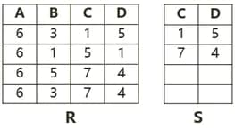
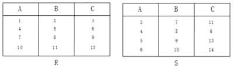

# 系统架构设计师综合知识题（1078405）

- 对应软考高级系统架构设计师章节：数据库设计基础知识、大数据架构设计理论与实践

- 页面标题：系统架构设计师综合知识题 - 学习模式模式 - 数据库系统
- 题目数量：51
- 子题数量：64
- 

---

> **知识点分组：关系代数**

## 1. 若关系R有m个元组，关系S有n个元组，则R和S的笛卡尔积有（m*n）个元组。
- 知识域：数据库系统 | 知识点：关系代数 | 来源：2024年5月第11题
- 标签：关系代数、中频

### 子题 1

- A. n
- B. m
- C. m+n
- D. m*n

- 答案：D
- 浓缩知识点：

笛卡尔积是关系代数中的二元基本操作，用于将两个关系的元组进行所有可能的有序组合以生成新关系。若关系R含m个元组、关系S含n个元组，那么R与S的笛卡尔积的元组总数为m乘以n；同时新关系的属性数量是R和S的属性数量之和。由于笛卡尔积会生成大量冗余元组，实际应用中通常会搭配选择操作使用，比如等值连接就是在笛卡尔积的基础上增加属性等值的选择条件，以此筛选出有实际意义的元组。

- 解析：

本题考察的是关系代数中笛卡尔积的基本概念。
笛卡尔积是关系代数中的一种二元操作，用于将两个关系中的每一个元组进行组合，生成一个新的关系。设关系R有m个元组，关系S有n个元组，则R×S表示所有可能的有序对 (r, s)，其中r∈R，s∈S。
A选项 n：只表示了S中的元组数，与笛卡尔积的结果无关，错误。
B选项 m：只表示了R中的元组数，也不正确。
C选项 m+n：表示的是两关系元组数的总和，而不是它们之间的组合数，错误。
D选项 m×n：正确地表示了笛卡尔积中结果元组的数量。每个R中的元组都与S中的n个元组组合，总共生成m×n个元组，正确。
因此，选项 D 正确。

---

## 2. 给定关系模式R（A，C，D，E）、S（C，D，E），经过自然连接后的属性列数为（4）。
- 知识域：数据库系统 | 知识点：关系代数 | 来源：2024年11月第30题
- 标签：关系代数、中频

### 子题 1

- A. 2
- B. 4
- C. 7
- D. 8

- 答案：B
- 浓缩知识点：

自然连接是关系代数中特殊的等值连接，核心规则如下：它会自动识别两个关系中的所有同名属性，以此为依据进行等值连接操作；连接完成后会自动剔除结果中重复的同名属性列，最终结果的属性列数等于两个关系的属性总数减去二者同名属性的数量，也可理解为结果属性由其中一个关系的独有属性加上仅保留一份的同名公共属性构成。此外，自然连接和普通等值连接的核心区别在于，普通等值连接需手动指定连接属性，且不会去除重复属性列，而自然连接是自动识别同名属性完成等值连接并去重。

- 解析：

本题考察的是关系代数中的自然连接。

---

## 3. 在关系代数中，关系表达式 R − (R − S) 与下列哪一个表达式等价（R ∩ S）。
- 知识域：数据库系统 | 知识点：关系代数 | 来源：2025年11月第3题
- 标签：关系代数、中频

### 子题 1

- A. R ∩ S
- B. R ∪ S
- C. R − S
- D. R × S

- 答案：A
- 浓缩知识点：

关系代数中，关系作为元组的集合，遵循集合运算的各类恒等式。其中差运算与交运算存在关键转换关系：R − (R − S) 等价于 R ∩ S，类似地S − (S − R)也等价于R ∩ S，这是因为从一个关系中移除“属于该关系但不属于另一关系的元组”，剩余的就是同时属于两个关系的元组，即交集。此外，差运算还可转化为交运算与补集的组合，即R − S = R ∩ ¬S，这里的¬S指S在全域关系中的补集。同时要明确关系代数基础集合运算的核心属性：交运算取两关系共有的元组，差运算取仅属于前一关系的元组，并运算取属于任一关系的元组，笛卡尔积则是两关系元组的所有可能组合，其结果的属性数为两关系属性数之和，元组数量为两关系元组数的乘积。掌握这些运算转换关系和特性，可帮助简化关系代数表达式，提升查询优化的效率。

- 解析：

本题考察关系代数中集合运算（差、交、并、笛卡尔积）的等价变换相关知识点。
表达式 R − (R − S) 的含义是：从 R 中去掉那些“属于 R 但不属于 S 的元组”，也就是“只保留既在 R 中又在 S 中的元组”，因此等价于 R ∩ S。
选项 A：R ∩ S 表示既属于 R 又属于 S 的元组集合。根据集合恒等式，R − (R − S) = R ∩ S，所以选项 A 正确。
选项 B：R ∪ S 表示属于 R 或属于 S（或同时属于二者）的所有元组，是“并集”运算，结果通常比交集大，显然不等价于从 R 中删掉不在 S 中的部分，因此选项 B 错误。
选项 C：R − S 表示属于 R 且不属于 S 的元组集合，语义刚好与 R ∩ S 相反，R − (R − S) 是把这些从 R 中去掉，结果绝不可能等于 R − S，因此选项 C 错误。
选项 D：R × S 表示 R 与 S 的笛卡尔积，其结果是所有 (r, s) 组合的元组集合，维数与基数都与简单的集合差、交完全不同，更不可能与 R − (R − S) 等价，因此选项 D 错误。
选择选项 A。

---

## 4. 𝑅 ( 𝐴 , 𝐵 ) R(A,B) 有 5 5 个元组， 𝑆 ( 𝐵 , 𝐶 ) S(B,C) 有 10 10 个元组， 𝑅 R 与 𝑆 S 自然连接结果元组数的可能范围是（ [ 0 , 50 ] [0,50]）。

- 知识域：数据库系统 | 知识点：关系代数 | 来源：2026年5月第21题
- 标签：关系代数、简单、中频

### 子题 1

- A. [
0
,
50
]
[0,50]
- B. [
0
,
5
]
[0,5]
- C. [
5
,
10
]
[5,10]
- D. [
10
,
50
]
[10,50]

- 答案：A
- 浓缩知识点：

自然连接是按两个关系中的同名属性自动进行等值匹配的连接运算，公共属性在结果中只保留一份；结果元组数取决于公共属性取值的匹配情况，若没有匹配则为 0，若匹配充分则可能达到两个关系元组数的乘积。

- 解析：

本题考察的是自然连接基数。
最小值：0如果 R 中所有 B 值和 S 中所有 B 值都不相同，那么一个都匹配不上，结果就是：0
最大值：50如果 R 的 5 个元组和 S 的 10 个元组在 B 上全部取同一个值，那么 R 中每个元组都能和 S 中每个元组匹配：5×10=50
所以范围是：
[
0
,
50
]
[0,50]
因此，选项 A 正确。

---

> **知识点分组：关系数据库**

## 5. 假设关系模式 R（U，F），属性集 U={A，B，C}，函数依赖集 F={A→B，B→C}。若将其分解为 ρ={R1(U1，F1)，R2(U2，F2)}，其中 U1={A，B}，U2={A，C}。那么，关系模式 R、R1、R2 分别达到了（2NF、3NF、3NF）；分解 ρ（无损连接但不保持函数依赖）。
- 知识域：数据库系统 | 知识点：关系数据库 | 来源：2013年11月第3题
- 标签：关系数据库、中等、高频

### 子题 1

- A. 1NF、2NF、3NF
- B. 1NF、3NF、3NF
- C. 2NF、2NF、3NF
- D. 2NF、3NF、3NF

- 答案：D
- 浓缩知识点：

关系数据库范式核心要求：1NF是基础，要求属性具备原子性不可再分；2NF需消除非主属性对候选键的部分函数依赖，若关系候选键为单属性，因不存在部分依赖的前提，天然满足2NF；3NF要消除非主属性对候选键的传递函数依赖，即所有非主属性必须直接依赖于候选键，不能通过其他非主属性间接依赖。

- 解析：

本题考察的是关系数据库范式与无损分解、函数依赖保持。
关系数据库范式核心要求：1NF是基础，要求属性具备原子性不可再分。2NF需消除非主属性对候选键的部分函数依赖，若关系候选键为单属性，因不存在部分依赖的前提，天然满足2NF。3NF要消除非主属性对候选键的传递函数依赖，即所有非主属性必须直接依赖于候选键，不能通过其他非主属性间接依赖。
本小问答案是 2NF、3NF、3NF。题干中的“关系模式 R、R1、R2 分别达到了2NF、3NF、3NF”对应2NF、3NF、3NF。
因此，选项 D 正确。

### 子题 2

- A. 有损连接但保持函数依赖
- B. 既无损连接又保持函数依赖
- C. 有损连接且不保持函数依赖
- D. 无损连接但不保持函数依赖

- 答案：D
- 浓缩知识点：

关系数据库范式核心要求：1NF是基础，要求属性具备原子性不可再分；2NF需消除非主属性对候选键的部分函数依赖，若关系候选键为单属性，因不存在部分依赖的前提，天然满足2NF；3NF要消除非主属性对候选键的传递函数依赖，即所有非主属性必须直接依赖于候选键，不能通过其他非主属性间接依赖。

- 解析：

本题考察的是关系数据库范式与无损分解、函数依赖保持。
设 ρ = {R₁, R₂} 是 R 的一个分解，F 是 R 上的函数依赖集。那么分解 ρ 相对于 F 是无损级联分解的充要条件
(R₁ ∩ R₂) → (R₁ − R₂) 或 (R₁ ∩ R₂) → (R₂ − R₁)。
要注意的是，这两个条件只要有任意一个条件成立就可以了。
满足无损条件{A}→{B} 或 {A}→{C} 成立；但 B→C 在分解后不被保持。
选择选项 D。无损连接但不保持函数依赖

---

## 6. 给定员工关系 EMP（EmpID，Ename，sex，age，tel，DepID）， 其属性含义分别为：员工号、姓名、性别、年龄、电话、部门号； 部门关系 DEP（DepID，Dname，Dtel，DEmpID）， 其属性含义分别为：部门号、部门名、电话、负责人号。若要求 DepID 参照部门关系 DEP 的主码 DepID，则可以在定义 EMP 时用（Foreign Key (DepID) References DEP (DepID)）进行约束。若要查询开发部的负责人姓名、年龄，则正确的关系代数表达式为（ 𝜋 2 , 4 ( 𝜎 1 = 9 ( 𝐸 𝑚 𝑝 ⋈ 𝜎 2 = 开发部 𝐷 𝑒 𝑝 ) ) π 2,4 ​ (σ 1=9 ​ (Emp⋈σ 2=开发部 ​ Dep))）。

- 知识域：数据库系统 | 知识点：关系数据库 | 来源：2013年11月第4题
- 标签：关系数据库、高频

### 子题 1

- A. Primary Key (DepID) On DEP (DepID)
- B. Primary Key (DepID) On EMP (DepID)
- C. Foreign Key (DepID) References DEP (DepID)
- D. Foreign Key (DepID) References EMP (DepID)

- 答案：C
- 浓缩知识点：

数据库中，外键约束是保障参照完整性的关键机制，需在关联的从表中进行声明，格式为Foreign Key(从表关联字段) References 主表(主表主键字段)，以此确保从表的关联字段值均对应主表中已存在的主键值，避免出现无效的关联数据，比如员工表的部门号字段需参照部门表的部门号主键，以此保证员工所属部门都是真实存在的有效部门。而用关系代数实现跨表复杂查询时，通常遵循“先筛选、再连接、后投影”的逻辑：先用选择操作σ筛选出目标数据集，再通过自然连接或等值连接关联相关表，补充必要的匹配条件，最后用投影操作π提取所需属性，这种流程既保证查询逻辑准确，还能通过提前筛选缩减数据量来提升查询效率，比如查询特定部门负责人信息时，就需要先筛选出目标部门，关联员工表后匹配负责人与员工号的对应条件，再提取姓名、年龄等所需字段。

- 解析：

本题考察的是外键约束的定义方式与关系代数表达式（选择、投影、连接）的应用。
本小问答案是 Foreign Key (DepID) References DEP (DepID)。在 EMP 中把 DepID 声明为外键，参照 DEP(DepID)，完全符合题意。
A. Primary Key (DepID) On DEP (DepID)：定义的是 DEP 的主键，不是在 EMP 中建立参照，错误。
B. Primary Key (DepID) On EMP (DepID)：把 EMP 的 DepID 设为主键，与题意不符，错误。
C. Foreign Key (DepID) References DEP (DepID)：在 EMP 中把 DepID 声明为外键，参照 DEP(DepID)，完全符合题意，正确。
D. Foreign Key (DepID) References EMP (DepID)：把 EMP.DepID 参照 EMP 自身，不符合实际参照关系，错误。
因此，选项 C 正确。

### 子题 2

- A. 𝜋 2 , 4 ( 𝜎 1 = 开发部 ( 𝐸 𝑚 𝑝 × 𝐷 𝑒 𝑝 ) ) π 2,4 ​ (σ 1=开发部 ​ (Emp×Dep))
- B. 𝜋 2 , 4 ( 𝜎 1 = 9 ( 𝐸 𝑚 𝑝 ⋈ 𝜎 2 = 开发部 𝐷 𝑒 𝑝 ) ) π 2,4 ​ (σ 1=9 ​ (Emp⋈σ 2=开发部 ​ Dep))
- C. 𝜋 2 , 3 ( 𝐸 𝑚 𝑝 × 𝜎 2 = 开发部 ( 𝐷 𝑒 𝑝 ) ) π 2,3 ​ (Emp×σ 2=开发部 ​ (Dep))
- D. 𝜋 2 , 3 ( 𝜋 1 , 2 , 4 , 6 𝐸 𝑚 𝑝 ⋈ 𝜎 2 = 开发部 ( 𝐷 𝑒 𝑝 ) ) π 2,3 ​ (π 1,2,4,6 ​ Emp⋈σ 2=开发部 ​ (Dep))

- 答案：B
- 浓缩知识点：

数据库中，外键约束是保障参照完整性的关键机制，需在关联的从表中进行声明，格式为Foreign Key(从表关联字段) References 主表(主表主键字段)，以此确保从表的关联字段值均对应主表中已存在的主键值，避免出现无效的关联数据，比如员工表的部门号字段需参照部门表的部门号主键，以此保证员工所属部门都是真实存在的有效部门。而用关系代数实现跨表复杂查询时，通常遵循“先筛选、再连接、后投影”的逻辑：先用选择操作σ筛选出目标数据集，再通过自然连接或等值连接关联相关表，补充必要的匹配条件，最后用投影操作π提取所需属性，这种流程既保证查询逻辑准确，还能通过提前筛选缩减数据量来提升查询效率，比如查询特定部门负责人信息时，就需要先筛选出目标部门，关联员工表后匹配负责人与员工号的对应条件，再提取姓名、年龄等所需字段。

- 解析：

本题考察的是外键约束的定义方式与关系代数表达式（选择、投影、连接）的应用。
本小问答案是 
𝜋
2
,
4
(
𝜎
1
=
9
(
𝐸
𝑚
𝑝
⋈
𝜎
2
=
开发部
𝐷
𝑒
𝑝
)
)
π
2,4
	​

(σ
1=9
	​

(Emp⋈σ
2=开发部
	​

Dep))。先对 Dep 做选择 σ_{2=开发部}（第二属性 Dname），与 Emp 做自然连接（在公共属性 DepID 上），再用 σ_{1=9} 表示 EmpID（第1位）= DEmpID（第9位）锁定负责人，最后投影第2、4位（Ename、age），表达。
A. 
𝜋
2
,
4
(
𝜎
1
=
开发部
(
𝐸
𝑚
𝑝
×
𝐷
𝑒
𝑝
)
)
π
2,4
	​

(σ
1=开发部
	​

(Emp×Dep))：对 Emp × Dep 做选择“第一属性=开发部”，既无明确属性位置语义也缺少负责人条件，错误。
B. 
𝜋
2
,
4
(
𝜎
1
=
9
(
𝐸
𝑚
𝑝
⋈
𝜎
2
=
开发部
𝐷
𝑒
𝑝
)
)
π
2,4
	​

(σ
1=9
	​

(Emp⋈σ
2=开发部
	​

Dep))：先对 Dep 做选择 σ_{2=开发部}（第二属性 Dname），与 Emp 做自然连接（在公共属性 DepID 上），再用 σ_{1=9} 表示 EmpID（第1位）= DEmpID（第9位）锁定负责人，最后投影第2、4位（Ename、age），表达正确。
C. 
𝜋
2
,
3
(
𝐸
𝑚
𝑝
×
𝜎
2
=
开发部
(
𝐷
𝑒
𝑝
)
)
π
2,3
	​

(Emp×σ
2=开发部
	​

(Dep))：Emp 与选出的 Dep 直接笛卡尔积后只投影 2、3 位，既无连接条件也无负责人条件，错误。
D. 
𝜋
2
,
3
(
𝜋
1
,
2
,
4
,
6
𝐸
𝑚
𝑝
⋈
𝜎
2
=
开发部
(
𝐷
𝑒
𝑝
)
)
π
2,3
	​

(π
1,2,4,6
	​

Emp⋈σ
2=开发部
	​

(Dep))：对 Emp 先做投影再与 Dep 自然连接，仅限定部门，未施加 EmpID=DEmpID 的负责人条件，会得到该部门所有员工而非负责人，错误。
因此，选项 B 正确。

---

## 7. 设关系模式R(U,F)，其中U为属性集，F是U上的一组函数依赖，那么函数依赖的公理系统（Armstrong公理系统）中的合并规则是指（A→B，A→C，则A→BC）为F所蕴涵。
- 知识域：数据库系统 | 知识点：关系数据库 | 来源：2014年11月第3题
- 标签：关系数据库、高频

### 子题 1

- A. 若A→B，B→C，则A→C
- B. 若Y⊆X⊆U，则X→Y
- C. A→B，A→C，则A→BC
- D. 若A→B，C⊆B，则A→C

- 答案：C
- 浓缩知识点：

Armstrong公理系统是关系模式中用于函数依赖推理的核心公理体系，包含三条基本推理规则：自反律，即若属性集Y是X的子集（Y⊆X⊆U），则X函数决定Y；增广律，若X→Y，且Z是属性全集U的任意子集，则XZ→YZ；传递律，若X→Y且Y→Z，则X→Z。基于这三条基本规则，可推导出若干常用导出规则，其中合并规则指若X→Y且X→Z，则X→YZ；此外还有分解规则（若X→YZ，则X→Y且X→Z）、伪传递规则（若X→Y且WY→Z，则WX→Z）等，这些规则共同构成了函数依赖推理的完整体系，可用于验证和推导关系模式中所有有效的函数依赖。

- 解析：

本题考察的是Armstrong 公理系统中的函数依赖推理规则。

---

## 8. 若关系模式R和S分别为：R（A，B，C，D），S（B，C，E，F），则关系R与S自然联结运算后的属性列有（6）个，与表达方式 𝜋 1 , 3 , 5 , 6 ( 𝜎 3 < 6 ( 𝑅 ⋈ 𝑆 ) ) π 1,3,5,6 ​ (σ 3<6 ​ (R⋈S))等价的 SQL 语句为：SELECT （A,R.C,E,F） FROM R , S WHERE （ 𝑅 . 𝐵 = 𝑆 . 𝐵 ∧ 𝑅 . 𝐶 = 𝑆 . 𝐶 ∧ 𝑅 . 𝐶 < 𝑆 . 𝐹 R.B=S.B∧R.C=S.C∧R.C<S.F）;

- 知识域：数据库系统 | 知识点：关系数据库 | 来源：2014年11月第4题
- 标签：关系数据库、中等、高频

### 子题 1

- A. 4
- B. 6
- C. 7
- D. 8

- 答案：B
- 浓缩知识点：

自然连接是关系数据库常用连接操作，核心基于两关系同名属性做等值连接，同时自动去除重复同名属性列，计算连接后列数可通过两关系总列数减去重复同名列数量得到，它等价于在笛卡尔积基础上添加所有同名列的等值匹配条件。将关系代数投影运算转换为SQL语句时，若投影列包含两表同名列，必须通过表名加列名的方式消歧；非同名列可直接用列名，也可加表名前缀，且投影列集合需严格匹配运算要求，不能随意增减。当选择运算与自然连接结合时，SQL的WHERE子句需同时包含自然连接的同名列等值条件，以及对应选择要求的列比较条件，所有条件要用AND连接，且选择条件要准确对应到原表列名，注意连接结果列与原表列的映射关系，避免列名混淆或条件逻辑错误。

- 解析：

本题考察的是自然连接、选择与投影组合运算到SQL的等价转换。

### 子题 2

- A. A,R.C,E,F
- B. A,C,S.B,S.E
- C. A,C,S.B,S.C
- D. R.A,R.C,S.B,S.C

- 答案：A
- 浓缩知识点：

自然连接是关系数据库常用连接操作，核心基于两关系同名属性做等值连接，同时自动去除重复同名属性列，计算连接后列数可通过两关系总列数减去重复同名列数量得到，它等价于在笛卡尔积基础上添加所有同名列的等值匹配条件。将关系代数投影运算转换为SQL语句时，若投影列包含两表同名列，必须通过表名加列名的方式消歧；非同名列可直接用列名，也可加表名前缀，且投影列集合需严格匹配运算要求，不能随意增减。当选择运算与自然连接结合时，SQL的WHERE子句需同时包含自然连接的同名列等值条件，以及对应选择要求的列比较条件，所有条件要用AND连接，且选择条件要准确对应到原表列名，注意连接结果列与原表列的映射关系，避免列名混淆或条件逻辑错误。

- 解析：

本题考察的是自然连接、选择与投影组合运算到SQL的等价转换。

### 子题 3

- A. 𝑅 . 𝐵 = 𝑆 . 𝐵 ∧ 𝑅 . 𝐶 = 𝑆 . 𝐶 ∧ 𝑅 . 𝐶 < 𝑆 . 𝐵 R.B=S.B∧R.C=S.C∧R.C<S.B
- B. 𝑅 . 𝐵 = 𝑆 . 𝐵 ∧ 𝑅 . 𝐶 = 𝑆 . 𝐶 ∧ 𝑅 . 𝐶 < 𝑆 . 𝐹 R.B=S.B∧R.C=S.C∧R.C<S.F
- C. 𝑅 . 𝐵 = 𝑆 . 𝐵 ∨ 𝑅 . 𝐶 = 𝑆 . 𝐶 ∨ 𝑅 . 𝐶 < 𝑆 . 𝐵 R.B=S.B∨R.C=S.C∨R.C<S.B
- D. 𝑅 . 𝐵 = 𝑆 . 𝐵 ∨ 𝑅 . 𝐶 = 𝑆 . 𝐶 ∨ 𝑅 . 𝐶 < 𝑆 . 𝐹 R.B=S.B∨R.C=S.C∨R.C<S.F

- 答案：B
- 浓缩知识点：

自然连接是关系数据库常用连接操作，核心基于两关系同名属性做等值连接，同时自动去除重复同名属性列，计算连接后列数可通过两关系总列数减去重复同名列数量得到，它等价于在笛卡尔积基础上添加所有同名列的等值匹配条件。将关系代数投影运算转换为SQL语句时，若投影列包含两表同名列，必须通过表名加列名的方式消歧；非同名列可直接用列名，也可加表名前缀，且投影列集合需严格匹配运算要求，不能随意增减。当选择运算与自然连接结合时，SQL的WHERE子句需同时包含自然连接的同名列等值条件，以及对应选择要求的列比较条件，所有条件要用AND连接，且选择条件要准确对应到原表列名，注意连接结果列与原表列的映射关系，避免列名混淆或条件逻辑错误。

- 解析：

本题考察的是自然连接、选择与投影组合运算到SQL的等价转换。

---

## 9. 若关系R、S如下图所示，则关系R与S进行自然连接运算后的元组个数和属性列数分别为（3和4）；关系代数 𝜋 1 , 4 ( 𝜎 3 = 6 ( 𝑅 × 𝑆 ) ) π 1,4 ​ (σ 3=6 ​ (R×S))与关系代数表达式（ 𝜋 𝐴 , 𝑅 . 𝐷 ( 𝜎 𝑅 . 𝐶 = 𝑆 . 𝐷 ( 𝑅 × 𝑆 ) ) π A,R.D ​ (σ R.C=S.D ​ (R×S))）等价。

- 知识域：数据库系统 | 知识点：关系数据库 | 来源：2015年11月第5题
- 标签：关系数据库、中等、高频

### 子题 1

- A. 6和6
- B. 4和6
- C. 3和6
- D. 3和4

- 答案：D
- 浓缩知识点：

自然连接是特殊的等值连接，执行逻辑为先对两个关系做笛卡尔积，再在所有同名属性上进行等值匹配，最后去除重复的同名属性列。计算自然连接结果时，元组个数由两个关系中同名属性值完全匹配的元组组合数决定，属性列数等于两关系属性总数减去同名属性的数量。在处理带位次的关系代数表达式时，要明确笛卡尔积后的列顺序是原关系属性的依次拼接，选择操作中的位次对应笛卡尔积结果的列序号，转换为命名式表达式时需将位次映射到对应关系的属性，若涉及同名属性必须用所属关系名限定；投影操作的位次同样对应笛卡尔积的列，转换时要明确投影的属性，同名属性需加关系名以避免语义歧义。此外，等值连接和自然连接存在区别：等值连接可在任意属性上设定等值匹配条件，且不会去除重复属性列，而自然连接仅针对同名属性做等值匹配并自动去重列。

- 解析：

本题考察的是自然连接的语义与笛卡尔积上带位次引用的选择与投影等价改写。
本小问答案是 3和4。符合自然连接定义。
A. 6和6：将匹配数和列数都夸大，错误。
B. 4和6：列数不去重同名属性，错误。
C. 3和6：元组数对，列数错，应为 4，错误。
D. 3和4：符合自然连接定义，正确。
因此，选项 D 正确。

### 子题 2

- A. 𝜋 𝐴 , 𝐷 ( 𝜎 𝐶 = 𝐷 ( 𝑅 × 𝑆 ) ) π A,D ​ (σ C=D ​ (R×S))
- B. 𝜋 𝐴 , 𝑅 . 𝐷 ( 𝜎 𝑆 . 𝐶 = 𝑅 . 𝐷 ( 𝑅 × 𝑆 ) ) π A,R.D ​ (σ S.C=R.D ​ (R×S))
- C. 𝜋 𝐴 , 𝑅 . 𝐷 ( 𝜎 𝑅 . 𝐶 = 𝑆 . 𝐷 ( 𝑅 × 𝑆 ) ) π A,R.D ​ (σ R.C=S.D ​ (R×S))
- D. 𝜋 𝑅 . 𝐴 , 𝑅 . 𝐷 ( 𝜎 𝑆 . 𝐶 = 𝑆 . 𝐷 ( 𝑅 × 𝑆 ) ) π R.A,R.D ​ (σ S.C=S.D ​ (R×S))

- 答案：C
- 浓缩知识点：

自然连接是特殊的等值连接，执行逻辑为先对两个关系做笛卡尔积，再在所有同名属性上进行等值匹配，最后去除重复的同名属性列。计算自然连接结果时，元组个数由两个关系中同名属性值完全匹配的元组组合数决定，属性列数等于两关系属性总数减去同名属性的数量。在处理带位次的关系代数表达式时，要明确笛卡尔积后的列顺序是原关系属性的依次拼接，选择操作中的位次对应笛卡尔积结果的列序号，转换为命名式表达式时需将位次映射到对应关系的属性，若涉及同名属性必须用所属关系名限定；投影操作的位次同样对应笛卡尔积的列，转换时要明确投影的属性，同名属性需加关系名以避免语义歧义。此外，等值连接和自然连接存在区别：等值连接可在任意属性上设定等值匹配条件，且不会去除重复属性列，而自然连接仅针对同名属性做等值匹配并自动去重列。

- 解析：

本题考察的是自然连接的语义与笛卡尔积上带位次引用的选择与投影等价改写。
本小问答案是 
𝜋
𝐴
,
𝑅
.
𝐷
(
𝜎
𝑅
.
𝐶
=
𝑆
.
𝐷
(
𝑅
×
𝑆
)
)
π
A,R.D
	​

(σ
R.C=S.D
	​

(R×S))。谓词与投影均与位次等价。
A. 
𝜋
𝐴
,
𝐷
(
𝜎
𝐶
=
𝐷
(
𝑅
×
𝑆
)
)
π
A,D
	​

(σ
C=D
	​

(R×S))：未限定同名列，表达式在 R×S 上歧义且与 3=6 不一致，错误。
B. 
𝜋
𝐴
,
𝑅
.
𝐷
(
𝜎
𝑆
.
𝐶
=
𝑅
.
𝐷
(
𝑅
×
𝑆
)
)
π
A,R.D
	​

(σ
S.C=R.D
	​

(R×S))：谓词为 S.C=R.D（应为 R.C=S.D），错误。
C. 
𝜋
𝐴
,
𝑅
.
𝐷
(
𝜎
𝑅
.
𝐶
=
𝑆
.
𝐷
(
𝑅
×
𝑆
)
)
π
A,R.D
	​

(σ
R.C=S.D
	​

(R×S))：谓词与投影均与位次等价，正确。
D. 
𝜋
𝑅
.
𝐴
,
𝑅
.
𝐷
(
𝜎
𝑆
.
𝐶
=
𝑆
.
𝐷
(
𝑅
×
𝑆
)
)
π
R.A,R.D
	​

(σ
S.C=S.D
	​

(R×S))：谓词为 S.C=S.D，与原式不等价，错误。
因此，选项 C 正确。

---

## 10. 给定关系模式R（A，B，C，D，E）、S（D，E，F，G）和π1,2,4,6（R⋈S），经过自然连接和投影运算后的属性列数分别为（7和4）。
- 知识域：数据库系统 | 知识点：关系数据库 | 来源：2016年11月第7题
- 标签：关系数据库、中等、高频

### 子题 1

- A. 9和4
- B. 7和4
- C. 9和7
- D. 7和7

- 答案：B
- 浓缩知识点：

关系代数中，自然连接与投影是常用的关系操作。自然连接属于连接操作的特殊类型，它会自动识别两个关系中的所有同名属性，基于这些属性做等值连接，并且会去除连接结果中重复的同名属性，因此连接后的属性列数为两个关系的总属性数减去共同同名属性的数量；投影操作则是从指定关系中筛选出特定的属性列，可通过列序号或属性名指定筛选目标，最终结果的属性列数等于所指定筛选的列的数量，同时投影操作会自动消除结果中的重复元组。此外要注意，自然连接和普通等值连接不同，普通等值连接需要手动指定连接的等值条件，且不会自动去除重复的属性列。

- 解析：

本题考察的是关系数据库中的自然连接与投影操作。
自然连接（⋈）是基于所有共同属性（此处是 D 和 E）做等值连接，并去除重复的同名属性。
R 有属性：A, B, C, D, E，S 有属性：D, E, F, G
自然连接 R ⋈ S 后的属性集合为：A, B, C, D, E, F, G，共 7 个属性。
π1,2,4,6（R⋈S） 是对自然连接结果的投影操作，选出第1、2、4、6列。
从上面的属性顺序来看：1 → A，2 → B，3 → C，4 → D，5 → E，6 → F，7 → G
所以 π1,2,4,6（R⋈S） 的结果为属性：A, B, D, F，共 4 列。
因此，选项 B 正确。

---

## 11. 给定关系R（A1，A2，A3，A4， A5）上的函数依赖集 F={A1→A2A5，A2→A3A4，A3→A2}，R的候选关键字为（A1）。函数依赖（A3→A2A4）∈ F+。
- 知识域：数据库系统 | 知识点：关系数据库 | 来源：2016年11月第8题
- 标签：关系数据库、中等、高频

### 子题 1

- A. A1
- B. A1A2
- C. A1A3
- D. A1A2A3

- 答案：A
- 浓缩知识点：

关系数据库中，候选码可通过属性闭包法判定：从某属性（组）出发，依据给定函数依赖推导所有能确定的属性，若最终覆盖关系的全部属性，且该属性（组）无冗余，即去掉任意一个属性后无法覆盖全属性，则为候选码。判断某函数依赖是否属于函数依赖集的闭包F+，可借助阿姆斯特朗公理及其推论：自反、增广、传递公理是基础规则，结合合并规则，如若X→Y且X→Z，则X→YZ、分解规则，如若X→YZ，则X→Y且X→Z、伪传递规则，如若X→Y且WY→Z，则WX→Z等推论，通过闭包推导验证新依赖的有效性，比如已知X→Y、Y→ZW，可先传递推出X→ZW，再结合分解或合并规则推导更多衍生依赖。

- 解析：

本题考察的是关系数据库函数依赖、候选码与闭包推导的基本理论。
问题 1：
确定候选码可用属性闭包法。对 A1 取闭包：A1+，由 A1→A2A5 得到 A2、A5；由 A2→A3A4 得到 A3、A4；又因 A3→A2 已在闭包中，不新增属性。最终 A1+ = {A1,A2,A3,A4,A5}，覆盖全属性，因此 A1 是候选码。
A选项 A1：A1 的闭包覆盖全属性，满足唯一标识元组的要求，正确。
B选项 A1A2：包含冗余属性 A2，因 A1 已能唯一标识，A1A2 不是最小的键，不是候选码，错误。
C选项 A1A3：同理包含冗余属性 A3，非最小，错误。
D选项 A1A2A3：冗余更明显，非最小，错误。
因此，候选关键字为 A1。

### 子题 2

- A. A5→A1A2
- B. A4→A1A2
- C. A3→A2A4
- D. A2→A1A5

- 答案：C
- 浓缩知识点：

关系数据库中，候选码可通过属性闭包法判定：从某属性（组）出发，依据给定函数依赖推导所有能确定的属性，若最终覆盖关系的全部属性，且该属性（组）无冗余，即去掉任意一个属性后无法覆盖全属性，则为候选码。判断某函数依赖是否属于函数依赖集的闭包F+，可借助阿姆斯特朗公理及其推论：自反、增广、传递公理是基础规则，结合合并规则，如若X→Y且X→Z，则X→YZ、分解规则，如若X→YZ，则X→Y且X→Z、伪传递规则，如若X→Y且WY→Z，则WX→Z等推论，通过闭包推导验证新依赖的有效性，比如已知X→Y、Y→ZW，可先传递推出X→ZW，再结合分解或合并规则推导更多衍生依赖。

- 解析：

本题考察的是关系数据库函数依赖、候选码与闭包推导的基本理论。
问题 2：
判断依赖是否属于 F+ 可用阿姆斯特朗公理与闭包推导。
A选项 A5→A1A2：由 F 中无任何以 A5 为决定属性的依赖，且无法经传递推出 A1 或 A2，错误。
B选项 A4→A1A2：F 中无以 A4 为决定属性的依赖，无法推出 A1 或 A2，错误。
C选项 A3→A2A4：F 中直接有 A3→A2；又由 A2→A3A4，可联合得出 A3→A4；合并得到 A3→A2A4，成立，正确。
D选项 A2→A1A5：虽有 A2→A3A4，但无法推出 A1 或 A5，错误。
因此，属于 F+ 的依赖为 A3→A2A4。

---

## 12. 给定关系模式R（U，F），其中：属性集U={A1，A2，A3，A4，A5，A6}，函数依赖集F={A1→A2， A1→A3，A3→A4，A1A5→A6}。关系模式R的候选码为（A1A5），由于R存在非主属性对码的部分函数依赖，所以R属于（1NF）。
- 知识域：数据库系统 | 知识点：关系数据库 | 来源：2017年11月第7题
- 标签：关系数据库、中等、高频

### 子题 1

- A. A1A3
- B. A1A4
- C. A1A5
- D. A1A6

- 答案：C
- 浓缩知识点：

候选码是关系模式中可唯一标识元组的最小属性集，判定常用属性闭包法，即计算目标属性集的闭包，若能覆盖关系的全部属性，且其任意真子集的闭包无法覆盖全属性，即可确定为候选码。数据库范式分为多个层级，层级越高约束越严格：1NF是最低要求，仅需保证属性不可再分；2NF需建立在1NF基础上，消除非主属性对任一候选码的部分函数依赖，若存在非主属性仅依赖候选码的某个真子集，就不满足2NF，只能归为1NF；3NF需在2NF基础上，进一步消除非主属性对候选码的传递函数依赖；BCNF是比3NF更严格的范式，要求所有函数依赖的决定因素本身都是候选码。

- 解析：

本题考察的是候选码的判定与范式（1NF/2NF）的判断。
候选码可通过属性闭包来验证；2NF要求消除非主属性对任一候选码的部分函数依赖，否则仅满足1NF。
问题1：候选码判定
A选项 A1A3：A1可推出A2、A3，且A3→A4，因此A1A3的闭包为{A1,A2,A3,A4}，缺少A5、A6，不能唯一标识元组，错误。
B选项 A1A4：A4不产生新属性，A1的闭包为{A1,A2,A3,A4}，仍缺A5、A6，错误。
C选项 A1A5：A1⇒A2、A3，A3⇒A4，且A1A5⇒A6，闭包为{A1,A2,A3,A4,A5,A6}覆盖全属性，且A1与A5单独都不是码，最小且能唯一标识，正确。
D选项 A1A6：A6无派生，A1A6的闭包与A1类似，缺A5，错误。
选择选项 C。

### 子题 2

- A. 1NF
- B. 2NF
- C. 3NF
- D. BCNF

- 答案：A
- 浓缩知识点：

候选码是关系模式中可唯一标识元组的最小属性集，判定常用属性闭包法，即计算目标属性集的闭包，若能覆盖关系的全部属性，且其任意真子集的闭包无法覆盖全属性，即可确定为候选码。数据库范式分为多个层级，层级越高约束越严格：1NF是最低要求，仅需保证属性不可再分；2NF需建立在1NF基础上，消除非主属性对任一候选码的部分函数依赖，若存在非主属性仅依赖候选码的某个真子集，就不满足2NF，只能归为1NF；3NF需在2NF基础上，进一步消除非主属性对候选码的传递函数依赖；BCNF是比3NF更严格的范式，要求所有函数依赖的决定因素本身都是候选码。

- 解析：

本题考察的是候选码的判定与范式（1NF/2NF）的判断。
2NF需建立在1NF基础上，消除非主属性对任一候选码的部分函数依赖，若存在非主属性仅依赖候选码的某个真子集，就不满足2NF，只能归为1NF。3NF需在2NF基础上，进一步消除非主属性对候选码的传递函数依赖。BCNF是比3NF更严格的范式，要求所有函数依赖的决定因素本身都是候选码。
本小问答案是 1NF。题干中的“由于R存在非主属性对码的部分函数依赖，所以R”对应1NF。
因此，选项 A 正确。

---

## 13. 给定元组演算表达式 𝑅 ∗ = { 𝑡 ∣ ( ∃ 𝑢 ) ( 𝑅 ( 𝑡 ) ∧ 𝑆 ( 𝑢 ) ∧ 𝑡 [ 3 ] < 𝑢 [ 2 ] ) } R ∗ ={t∣(∃u)(R(t)∧S(u)∧t[3]<u[2])}，若关系 R、S 如下图所示，则（R={(1，2，3)，(4，5，6)，(7，8，9)}）。

- 知识域：数据库系统 | 知识点：关系数据库 | 来源：2017年11月第8题
- 标签：关系数据库、中等、高频

### 子题 1

- A. R={(3，7，11)，(5，9，13)，(6，10，14)}
- B. R={(3，7，11)，(4，5，6)，(5，9，13)，(6，10，14)}
- C. R={(1，2，3)，(4，5，6)，(7，8，9)}
- D. R={(1，2，3)，(4，5，6)，(7，8，9)，(10，11，12)}

- 答案：C
- 浓缩知识点：

元组演算中，元组变量（如t、u）会与指定关系绑定，限定其只能取对应关系中的元组；存在量词∃的语义为，只要存在至少一个对应关系的元组满足后续逻辑条件，当前目标元组即符合筛选要求，无需所有元组都满足该条件。元组分量通过“元组变量[下标]”访问，下标通常从1开始，代表取元组的第n个属性值。对于跨关系的元组筛选表达式，最终结果是从绑定的目标关系中筛选出所有满足约束的元组，而非多关系的元组组合，因为最终仅保留目标元组的全部属性。

- 解析：

本题考察关系数据库元组演算的选择与存在量词的使用技巧。
先看 
𝑅
(
𝑡
)
∧
𝑆
(
𝑢
)
∧
𝑡
[
3
]
<
𝑢
[
2
]
)
R(t)∧S(u)∧t[3]<u[2])，t 是 R 中的元组，且 u 是 S 中元组，且 t 中第三个列的数值小于 u 中第 2 个列的数值。
因此，该元组演算表达式的意思是查询关系R和关系S中所有满足 t 元组中的第三个元素小于u元组中的第二个元素的元组组合。
R(t)∧S(u) 是什么意思。t 是 R 中的元组，u 是 S 中的元组，限定了 t,u 元组的范围域。
∃u 代表只要存在一个 u 满足后面的条件就行，比如元组 (7,8,9) 第三列 9 小于 S 元组（6，10，14）中的第二列10，所以是满足条件的。
t│xxx 这里的 t 表示做 R 中元组的投影（取 R 的元素列）。

---

## 14. 给定关系R（A,B,C,D,E）与S（A,B,C,F,G），那么与表达式 𝜋 1 , 2 , 4 , 6 , 7 ( 𝜎 1 < 6 ( 𝑅 ⋈ 𝑆 ) ) π 1,2,4,6,7 ​ (σ 1<6 ​ (R⋈S))等价的 SQL 语句如下：SELECT （R.A，R.B，D，F，G） FROM R，S WHERE （R.A=S.A AND R.B=S.B AND R.C=S.C AND R.A&lt;S.F）；

- 知识域：数据库系统 | 知识点：关系数据库 | 来源：2018年11月第4题
- 标签：关系数据库、中等、高频

### 子题 1

- A. R.A，R.B，R.E，S.C，G
- B. R.A，R.B，D，F，G
- C. R.A，R.B，R.D，S.C，F
- D. R.A，R.B，R.D，S.C，G

- 答案：B
- 浓缩知识点：

关系代数与SQL等价转换的核心知识点：自然连接的本质是对两表所有同名公共属性执行等值连接，连接条件需用AND合取，不可用OR析取；连接后的属性默认按公共属性、左表非公共属性、右表非公共属性的顺序排列。关系代数中的选择运算σ若用列号指定条件，需先对应连接后的属性位置，再映射为SQL中具体的属性名比较；投影运算π的列号同样要转换为对应属性，属性无歧义时可省略表前缀，存在同名冲突则必须添加表名限定。选择运算的条件直接对应SQL的WHERE子句，需准确匹配属性间的逻辑关系，避免列名或比较对象混淆。

- 解析：

本题考察的是关系代数到SQL的等价转换与自然连接后的属性顺序。
本小问答案是 R.A，R.B，D，F，G。给定关系R（A,B,C,D,E）与S（A,B,C,F,G），那么与表达式
𝜋
1
,
2
,
4
,
6
,
7
(
𝜎
1
<
6
(
𝑅
⋈
𝑆
)
)
π
1,2,4,6,7
	​

(σ
1<6
	​

(R⋈S))等价的 SQL 语句如下：SELECTR.A，R.B，D，F，GFROM R，S WHERE。
A. R.A，R.B，R.E，S.C，G：投影包含E与C，但π{1,2,4,6,7}要求的是。
B. R.A，R.B，D，F，G：正好对应。
C. R.A，R.B，R.D，S.C，F：包含C而非G，与目标列集不符，错误。
D. R.A，R.B，R.D，S.C，G：包含C而非F，与目标列集不符，错误。
因此，选项 B 正确。

### 子题 2

- A. R.A=S.A OR R.B=S.B OR R.C=S.C OR R.A<S.F
- B. R.A=S.A OR R.B=S.B OR R.C=S.C OR R.A<S.B
- C. R.A=S.A AND R.B=S.B AND R.C=S.C AND R.A<S.F
- D. R.A=S.A AND R.B=S.B AND R.C=S.C AND R.A<S.B

- 答案：C
- 浓缩知识点：

关系代数与SQL等价转换的核心知识点：自然连接的本质是对两表所有同名公共属性执行等值连接，连接条件需用AND合取，不可用OR析取；连接后的属性默认按公共属性、左表非公共属性、右表非公共属性的顺序排列。关系代数中的选择运算σ若用列号指定条件，需先对应连接后的属性位置，再映射为SQL中具体的属性名比较；投影运算π的列号同样要转换为对应属性，属性无歧义时可省略表前缀，存在同名冲突则必须添加表名限定。选择运算的条件直接对应SQL的WHERE子句，需准确匹配属性间的逻辑关系，避免列名或比较对象混淆。

- 解析：

本题考察的是关系代数到SQL的等价转换与自然连接后的属性顺序。
本小问答案是 R.A=S.A AND R.B=S.B AND R.C=S.C AND R.A<S.F。三对公共属性等值实现自然连接，再加选择条件A<F，完全对应σ{1<6}(R ⋈ S)。
A. R.A=S.A OR R.B=S.B OR R.C=S.C OR R.A<S.F：自然连接应使用等值连接条件的合取，不能用析取OR，且还混入A<R.S.F条件但整体逻辑错误，错误。
B. R.A=S.A OR R.B=S.B OR R.C=S.C OR R.A<S.B：同样用OR，不是自然连接的语义，且比较成R.A<S.B也与σ{1<6}不符，错误。
C. R.A=S.A AND R.B=S.B AND R.C=S.C AND R.A<S.F：三对公共属性等值实现自然连接，再加选择条件A<F，完全对应σ{1<6}(R ⋈ S)，正确。
D. R.A=S.A AND R.B=S.B AND R.C=S.C AND R.A<S.B：最后的比较应是A与F而不是A与B，错误。
因此，选项 C 正确。

---

## 15. 在关系R（A1，A2，A3）和S（A2，A3，A4）上进行关系运算的4个等价的表达式E1、E2、E3和E4如下所示： 𝐸 1 = 𝜋 𝐴 1 , 𝐴 4 ( 𝜎 𝐴 2 < 2018 ∧ 𝐴 4 = ′ 95 ′ ( 𝑅 ⋈ 𝑆 ) ) E 1 ​ =π A 1 ​ ,A 4 ​ ​ (σ A 2 ​ <2018∧A 4 ​ = ′ 95 ′ ​ (R⋈S)) 𝐸 2 = 𝜋 𝐴 1 , 𝐴 4 ( 𝜎 𝐴 2 < 2018 ( 𝑅 ) ⋈ 𝜎 𝐴 4 = ′ 95 ′ ( 𝑆 ) ) E 2 ​ =π A 1 ​ ,A 4 ​ ​ (σ A 2 ​ <2018 ​ (R)⋈σ A 4 ​ = ′ 95 ′ ​ (S)) 𝐸 3 = 𝜋 𝐴 1 , 𝐴 4 ( 𝜎 𝐴 2 < 2018 ∧ 𝑅 . 𝐴 3 = 𝑆 . 𝐴 3 ∧ 𝐴 4 = ′ 95 ′ ( 𝑅 × 𝑆 ) ) E 3 ​ =π A 1 ​ ,A 4 ​ ​ (σ A 2 ​ <2018∧R.A 3 ​ =S.A 3 ​ ∧A 4 ​ = ′ 95 ′ ​ (R×S)) 𝐸 4 = 𝜋 𝐴 1 , 𝐴 4 ( 𝜎 𝑅 . 𝐴 3 = 𝑆 . 𝐴 3 ( 𝜎 𝐴 2 < 2018 ( 𝑅 ) × 𝜎 𝐴 4 = ′ 95 ′ ( 𝑆 ) ) ) E 4 ​ =π A 1 ​ ,A 4 ​ ​ (σ R.A 3 ​ =S.A 3 ​ ​ (σ A 2 ​ <2018 ​ (R)×σ A 4 ​ = ′ 95 ′ ​ (S))) 如果严格按照表达式运算顺序执行，则查询效率最高的是表达式（E2）。

- 知识域：数据库系统 | 知识点：关系数据库 | 来源：2018年11月第5题
- 标签：关系数据库、高频

### 子题 1

- A. E1
- B. E2
- C. E3
- D. E4

- 答案：B
- 浓缩知识点：

关系代数查询优化以最小化中间结果规模与运算代价为核心目标，核心优化策略可总结为：优先将选择运算下推至最接近数据源的位置，利用选择运算的分配律，把针对多关系的选择条件拆分后单独作用于各原始关系，提前剔除不符合条件的元组，大幅缩小后续运算的数据基数；同时优先采用带条件的连接运算，避免直接执行笛卡儿积，因为笛卡儿积会生成两关系元组的全组合，中间结果规模远大于带约束的连接，即便先做选择再执行笛卡儿积，运算代价仍显著高于直接对过滤后的关系做连接。整体遵循“先选择过滤、再执行连接、最后进行投影”的等价运算顺序，这类策略能在保证查询语义不变的前提下，最大化提升查询执行效率，是数据库查询优化中的基础核心准则。

- 解析：

本题考察的是关系代数表达式的等价变换与代价优化原则。
核心原则是：尽可能将选择（σ）下推到越接近数据源越好，尽可能避免先做笛卡儿积（×），优先使用连接（⋈），并减少中间结果规模。题干四式在语义上应等价；常见等价关系为：E1 与 E2 等价（选择下推到连接两端），E3 与 E4 等价（连接转化为对笛卡儿积的选择，并尽量下推选择）。在“严格按写出的运算顺序执行”的前提下，比较中间结果规模与操作类型，E2的执行代价最低。
A选项 E1：先做连接 R ⋈ S，再整体选择 σ{A2<2018 ∧ A4='95'}。先连接后选择会产生较大的中间结果，因为连接在未过滤前参与元组更多，随后再过滤，代价高于先选择再连接，所以不是最优。
B选项 E2：先对 R 与 S 分别执行选择 σ{A2<2018} 与 σ{A4='95'}，再做连接，然后投影。这是标准的“选择下推 + 再连接”策略，能显著缩小参与连接的关系规模，减少连接代价与中间结果，严格按序执行时查询效率最高，因此正确。
C选项 E3：先做笛卡儿积 R × S，再一次性做包含等值连接条件与选择条件的总选择，最后投影。笛卡儿积在未约束时会产生规模巨大的中间结果，随后再用σ过滤，代价通常最高，因此最差。
D选项 E4：先分别下推选择到 R 与 S，随后做笛卡儿积，再用 σ{R.A3=S.A3} 实现等值连接。相比 E3，已经做了部分优化（先选择），中间结果小于 E3；但仍然显式执行了笛卡儿积再过滤为连接，通常劣于直接连接的 E2，因此不是最优。
综上，按照代价最小化与中间结果最小化的优化原则，选择 B（E2）。

---

## 16. 数据库的安全机制中，通过提供（存储过程）供第三方开发人员调用进行数据更新 ，从而保证数据库的关系模式不被第三方所获取。
- 知识域：数据库系统 | 知识点：关系数据库 | 来源：2019年11月第5题
- 标签：关系数据库、中等、高频

### 子题 1

- A. 索引
- B. 视图
- C. 存储过程
- D. 触发器

- 答案：C
- 浓缩知识点：

在数据库安全机制中，存储过程是实现数据操作封装与安全隔离的核心对象之一，它可将数据增删改查等操作逻辑封装为可调用的程序单元，第三方开发人员通过调用存储过程即可完成数据更新，同时不会接触到数据库底层的关系模式、表结构与业务逻辑，有效保障数据安全与结构隐私。此外需明确数据库其他对象的功能边界：索引仅用于优化查询效率，无安全封装作用；视图虽能隐藏部分数据结构，但多数复杂视图不支持直接数据更新，并非专用的更新操作接口；触发器属于被动触发的自动化机制，多用于约束校验、日志记录等场景，无法作为主动调用的数据更新入口。

- 解析：

本题考察的是关系数据库的安全机制与封装手段。
此外需明确数据库其他对象的功能边界：索引仅用于优化查询效率，无安全封装作用。视图虽能隐藏部分数据结构，但多数复杂视图不支持直接数据更新，并非专用的更新操作接口。在数据库安全机制中，存储过程是实现数据操作封装与安全隔离的核心对象之一，它可将数据增删改查等操作逻辑封装为可调用的程序单元，第三方开发人员通过调用存储过程即可完成数据更新，同时不会接触到数据库底层的关系模式、表结构与业务逻辑，有效保障数据安全与结构隐私。触发器属于被动触发的自动化机制，多用于约束校验、日志记录等场景，无法作为主动调用的数据更新入口。
本小问答案是 存储过程。题干中的“数据库的安全机制中，通过提供存储过程供第三方开发人员调用进行数据更新 ，从而保证数据库的关系模式不被第三方所获取”对应存储过程。
因此，选项 C 正确。

---

## 17. 给出关系R（U，F），U={A，B，C，D，E} ，F ={A→BC，B→D，D→E} 。以下关于F说法正确的是（F蕴涵A→D、A→E、B→E，故F存在传递依赖）。若将关系R分解为ρ = {R1（U1，F1）， R2（U2，F2）}， 其中：U1={A，B，C} 、U2 = {B，D，E} ，则分解 ρ（无损连接并保持函数依赖）。
- 知识域：数据库系统 | 知识点：关系数据库 | 来源：2019年11月第6题
- 标签：关系数据库、高频

### 子题 1

- A. F蕴涵A→B、A→C，但 F 不存在传递依赖
- B. F蕴涵E→A、A→C，故F存在传递依赖
- C. F蕴涵A→D、E→A、A→C，但F不存在传递依赖
- D. F蕴涵A→D、A→E、B→E，故F存在传递依赖

- 答案：D
- 浓缩知识点：

Armstrong公理系统是关系数据库中函数依赖推理的核心依据，包含自反律、增广律、传递律三条基本规则，还可派生出分解规则、合并规则等，借助它能从已知函数依赖集推导出所有隐含的函数依赖，比如可从A→BC推导出A→B、A→C，从A→B、B→D、D→E推导出A→D、A→E、B→E这类传递函数依赖，传递函数依赖指的是在X→Y、Y→Z且Y无法决定X的前提下，X对Z形成的间接函数依赖。在关系模式分解中，需重点关注无损连接性和函数依赖保持性两个核心属性：无损连接性可通过分解后两个属性集的交集是否能函数决定其中任一属性集与交集的差集来判断，比如分解为U1、U2时，若U1∩U2能决定U1-U2或U2-U1，则为无损分解；函数依赖保持性则要求分解后各子模式上的函数依赖集合的闭包能覆盖原模式的所有函数依赖，确保原有数据约束在分解后仍能得到维持。

- 解析：

此题考察Armstrong 公理系统 的相关概念。
本小问答案是 F蕴涵A→D、A→E、B→E，故F存在传递依赖。以下关于F说法正确的是F蕴涵A→D、A→E、B→E，故F存在传递依赖。
A. F蕴涵A→B、A→C，但 F 不存在传递依赖：与题干限定不匹配，错误。
B. F蕴涵E→A、A→C，故F存在传递依赖：与题干限定不匹配，错误。
C. F蕴涵A→D、E→A、A→C，但F不存在传递依赖：与题干限定不匹配，错误。
D. F蕴涵A→D、A→E、B→E，故F存在传递依赖：F蕴涵A→D、A→E、B→E，故F存在传递依赖与题干限定一致，正确。
因此，选项 D 正确。

### 子题 2

- A. 无损连接并保持函数依赖
- B. 无损连接但不保持函数依赖
- C. 有损连接并保持函数依赖
- D. 有损连接但不保持函数依赖

- 答案：A
- 浓缩知识点：

Armstrong公理系统是关系数据库中函数依赖推理的核心依据，包含自反律、增广律、传递律三条基本规则，还可派生出分解规则、合并规则等，借助它能从已知函数依赖集推导出所有隐含的函数依赖，比如可从A→BC推导出A→B、A→C，从A→B、B→D、D→E推导出A→D、A→E、B→E这类传递函数依赖，传递函数依赖指的是在X→Y、Y→Z且Y无法决定X的前提下，X对Z形成的间接函数依赖。在关系模式分解中，需重点关注无损连接性和函数依赖保持性两个核心属性：无损连接性可通过分解后两个属性集的交集是否能函数决定其中任一属性集与交集的差集来判断，比如分解为U1、U2时，若U1∩U2能决定U1-U2或U2-U1，则为无损分解；函数依赖保持性则要求分解后各子模式上的函数依赖集合的闭包能覆盖原模式的所有函数依赖，确保原有数据约束在分解后仍能得到维持。

- 解析：

此题考察Armstrong 公理系统 的相关概念。
本小问答案是 无损连接并保持函数依赖。若将关系R分解为ρ = {R1（U1，F1）， R2（U2，F2）}， 其中：U1={A，B，C} 、U2 = {B，D，E} ，则分解 ρ无损连接并保持函数依赖。
A. 无损连接并保持函数依赖：无损连接并保持函数依赖与题干限定一致，正确。
B. 无损连接但不保持函数依赖：与题干限定不匹配，错误。
C. 有损连接并保持函数依赖：与题干限定不匹配，错误。
D. 有损连接但不保持函数依赖：与题干限定不匹配，错误。
因此，选项 A 正确。

---

## 18. 通常在设计关系模式时，派生属性不会作为关系中的属性来存储。按照这个原则，假设原设计的学生关系模式为Students（学号，姓名，性别，出生日期，年龄，家庭地址），那么该关系模式正确的设计应为（Students (学号，姓名，性别，出生日期，家庭地址)）。
- 知识域：数据库系统 | 知识点：关系数据库 | 来源：2020年11月第5题
- 标签：关系数据库、中等、高频

### 子题 1

- A. Students (学号，性别，出生日期，年龄，家庭地址)
- B. Students (学号，姓名，性别，出生日期，年龄)
- C. Students (学号，姓名，性别，出生日期，家庭地址)
- D. Students (学号，姓名，出生日期，年龄，家庭地址)

- 答案：C
- 浓缩知识点：

在关系数据库模式设计中，派生属性指可通过关系内其他属性计算推导得出的属性，比如年龄可由出生日期结合当前日期计算得到。这类属性通常不直接作为关系的存储属性，因为存储派生属性会造成数据冗余，浪费存储空间，更关键的是当它依赖的基础属性变更时，若派生属性未同步更新，极易引发数据不一致问题。正确的处理方式是在需要使用该属性时，通过数据库查询语句结合计算逻辑动态生成，比如利用数据库内置日期函数，基于出生日期实时计算年龄，以此保障数据一致性与存储效率。

- 解析：

本题考察的是关系数据库模式设计中派生属性的处理原则。
Students (学号，性别，出生日期，年龄，家庭地址)：缺少姓名属性，且保留了年龄这个派生属性，不符合要求；Students (学号，姓名，性别，出生日期，年龄)：虽然有姓名，但依然保留了年龄属性，属于派生属性，应删除；Students (学号，姓名，性别，出生日期，家庭地址)：包含学号、姓名、性别、出生日期、家庭地址，去除了年龄属性，符合派生属性不存储的原则；Students (学号，姓名，出生日期，年龄，家庭地址)：包含了年龄属性，违反了不存储派生属性的设计规范。
本小问答案是 Students (学号，姓名，性别，出生日期，家庭地址)。包含学号、姓名、性别、出生日期、家庭地址，去除了年龄属性，符合派生属性不存储的原则。
因此，选项 C 正确。

---

## 19. 给出关系R(U，F)，U={A，B，C，D，E}， F={A→B，D→C，BC→E，AC→B}，求属性闭包的等式成立的是（ ( 𝐴 𝐷 ) 𝐹 + = 𝑈 (AD) F + ​ =U） 。R的候选关键字为（AD）。

- 知识域：数据库系统 | 知识点：关系数据库 | 来源：2020年11月第6题
- 标签：关系数据库、中等、高频

### 子题 1

- A. ( 𝐴 ) 𝐹 + = 𝑈 (A) F + ​ =U
- B. ( 𝐵 ) 𝐹 + = 𝑈 (B) F + ​ =U
- C. ( 𝐴 𝐶 ) 𝐹 + = 𝑈 (AC) F + ​ =U
- D. ( 𝐴 𝐷 ) 𝐹 + = 𝑈 (AD) F + ​ =U

- 答案：D
- 浓缩知识点：

属性闭包是关系数据库中从某一属性集出发，依据给定函数依赖可推导出的所有属性的集合，计算时先将结果集初始化为目标属性集，再反复应用所有函数依赖，把能推导的新属性加入结果集，直到没有属性可添加为止，它是判断超键、候选码的关键依据，若某属性或属性组的闭包等于全属性集U，则其为超键。候选码是能唯一标识关系中元组且无冗余的属性或属性组，计算可采用有向图作图法，即根据函数依赖绘制有向图，寻找入度为0的属性或属性组合，验证其能否遍历图中所有节点，这类属性或组合通常是候选码的核心；也可通过属性闭包验证，从超键中剔除冗余属性得到候选码，候选码可能是单个属性，也可能是多个属性的组合。

- 解析：

此题考察关系数据库的基本理论。
问题 1：考察属性闭包的计算方法。
关系数据库中的 [X]+F=Y 闭包求法包括以下三个步骤：（1）将最终结果属性集设为Y，并将Y初始化为空。（2）检查F中的每一个函数依赖 A→B，如果属性集 A 中所有属性均在 Y 中，而B中有的属性不在 Y 中，则将其加入到 Y 中。（3）重复第二步，直到没有属性可以添加到属性集 Y 中为止，得到的 Y 就是 X 的闭包。
A选项（A）+ F根据 A→B 可得（A）+ F = {A，B} ，B选项（B）+ F 因为不存在B为左侧决定因素的函数依赖，所以（B）+ F = {B} ，C 选项（AC）+ F 根据 A→B，BC→E，AC→B 可得（AC）+ F ={A，B，C，E} ，D 选项（AD）+ F 根据 A→B，D→C， BC→E 可得（AD）+ F ={A，B，C，D，E} = U。所以选 D 选项。

### 子题 2

- A. AD
- B. AB
- C. AC
- D. BC

- 答案：A
- 浓缩知识点：

属性闭包是关系数据库中从某一属性集出发，依据给定函数依赖可推导出的所有属性的集合，计算时先将结果集初始化为目标属性集，再反复应用所有函数依赖，把能推导的新属性加入结果集，直到没有属性可添加为止，它是判断超键、候选码的关键依据，若某属性或属性组的闭包等于全属性集U，则其为超键。候选码是能唯一标识关系中元组且无冗余的属性或属性组，计算可采用有向图作图法，即根据函数依赖绘制有向图，寻找入度为0的属性或属性组合，验证其能否遍历图中所有节点，这类属性或组合通常是候选码的核心；也可通过属性闭包验证，从超键中剔除冗余属性得到候选码，候选码可能是单个属性，也可能是多个属性的组合。

- 解析：

此题考察关系数据库的基本理论。
问题 2：考察候选码的计算方法。
如果有属性或属性组能唯一标识元组，则它就是候选码。候选码的计算分方法有分析法和作图法。个人建议用作图法。作图法就是根据题目给出的函数依赖画出有向图。然后从起点出发找，看是否能遍历所有节点。一个不行再试另一个起点。最后的结果就是候选码。如下图所示。从图很直观地可以看出，入度为零的结点是 A 与 D，从这两个结点的组合出发，能遍历全图，所以候选码是 AD。

可以看到属性闭包也可以通过先做出有向图，然后从某个点出发遍历得到。比如 A 在 F 上的闭包从图中看出就是 (A，D)。

---

## 20. 给定关系模式R（U，F），其中U为属性集，F是U上的一组函数依赖，那么函数依赖的公理系统 （Armstrong 公理系统）中的分解规则是指（若 X→Y，Z⊆Y，则 X→Z）为 F 所蕴涵
- 知识域：数据库系统 | 知识点：关系数据库 | 来源：2022年11月第7题
- 标签：关系数据库、高频

### 子题 1

- A. 若 X→Y，Y→Z，则 X→Z
- B. 若 Y⊆X⊆U，则 X→Y
- C. 若 X→Y，Z⊆Y，则 X→Z
- D. 若 X→Y，Y→Z，则 X→YZ

- 答案：C
- 浓缩知识点：

Armstrong公理系统是关系数据库中推导函数依赖的核心规则体系，包含三条基本公理及三条由其扩展推导的规则。其中三条基本公理分别为：自反律，若属性集Y是X的子集且X属于属性全集U，则X函数决定Y；增广律，若X函数决定Y，Z是U的子集，则X与Z的并集函数决定Y与Z的并集；传递律，若X函数决定Y、Y函数决定Z，则X函数决定Z。基于基本公理可推导出三条实用规则：合并规则，若X分别函数决定Y和Z，则X函数决定Y与Z的并集；伪传递规则，若X函数决定Y，且W与Y的并集函数决定Z，则W与X的并集函数决定Z；分解规则，若X函数决定Y，Z是Y的子集，则X函数决定Z，该规则可将针对复合属性集的函数依赖拆解为多个针对子集的依赖，与合并规则互为逆向操作，常被用于关系模式的规范化设计，辅助优化数据结构、减少冗余。

- 解析：

此题考察Armstrong 公理系统的相关概念。

---

## 21. 给定关系R（A,B,C,D）和S（A,C,E,F），以下（ 𝜋 1 , 2 , 3 , 4 , 7 , 8 ( 𝜎 1 = 5 ∧ 2 > 7 ∧ 3 = 6 ( 𝑅 × 𝑆 ) ) π 1,2,3,4,7,8 ​ (σ 1=5∧2>7∧3=6 ​ (R×S))）与 𝜎 𝑅 . 𝐵 > 𝑆 . 𝐸 ( 𝑅 ⋈ 𝑆 ) σ R.B>S.E ​ (R⋈S)等价

- 知识域：数据库系统 | 知识点：关系数据库 | 来源：2022年11月第8题
- 标签：关系数据库、高频

### 子题 1

- A. 𝜎
2
>
7
(
𝑅
×
𝑆
)
σ
2>7
​
(R×S)
- B. 𝜋
1
,
2
,
3
,
4
,
7
,
8
(
𝜎
1
=
5
∧
2
>
7
∧
3
=
6
(
𝑅
×
𝑆
)
)
π
1,2,3,4,7,8
​
(σ
1=5∧2>7∧3=6
​
(R×S))
- C. 𝜎
2
>
′
7
′
(
𝑅
×
𝑆
)
σ
2>
′
7
′
​
(R×S)
- D. 𝜋
1
,
2
,
3
,
4
,
7
,
8
(
𝜎
1
=
5
∧
2
>
′
7
′
∧
3
=
6
(
𝑅
×
𝑆
)
)
π
1,2,3,4,7,8
​
(σ
1=5∧2>
′
7
′
∧3=6
​
(R×S))

- 答案：B
- 浓缩知识点：

关系代数中，自然连接可通过笛卡尔积、选择与投影的组合实现：关系R与S的自然连接等价于先计算笛卡尔积R×S，再施加所有同名属性相等的选择条件，要注意笛卡尔积中列的对应关系，R的属性在前、S的属性在后，同名属性在笛卡尔积中的列序号需一一对应建立等值条件，最后投影保留R的全部属性及S中与R非同名的属性，以此去除重复的同名属性列。当自然连接需结合额外选择条件时，可将该选择条件与同名属性等值条件合并后共同作用于笛卡尔积，再执行对应投影操作，即可得到等价表达式。此外，书写选择条件时必须保证常量类型匹配，数值常量直接使用数值形式，字符常量需加单引号，类型不匹配会导致语义偏差，引发逻辑错误。

- 解析：

本题考察的是关系代数中自然连接与选择、投影的等价变换。
自然连接 R ⋈ S 等价于在笛卡尔积 R × S 上施加同名属性相等的选择，再去掉重复同名属性进行投影，即 
𝜎
1
=
5
∧
3
=
6
(
𝑅
×
𝑆
)
σ
1=5∧3=6
	​

(R×S)之后再做 π 去除重复列。

---

## 22. 在数据库语句中，having通常与（group by）子句连用。
- 知识域：数据库系统 | 知识点：关系数据库 | 来源：2023年11月第5题
- 标签：关系数据库、中等、高频

### 子题 1

- A. where
- B. select
- C. group by
- D. order by

- 答案：C
- 浓缩知识点：

SQL中，HAVING子句用于对分组聚合后的结果集进行过滤，它必须与GROUP BY子句配合使用。需要注意区分HAVING与WHERE的作用差异：WHERE是在数据分组前筛选单个行数据，且不能以聚合函数作为筛选条件；而HAVING是在GROUP BY完成分组聚合后，针对分组后的整体数据进行过滤，可基于SUM、AVG、COUNT等聚合函数的计算结果设置筛选规则，以此得到符合业务需求的分组集合。此外，当查询中同时存在WHERE、GROUP BY、HAVING时，执行顺序为WHERE先筛选行，再经GROUP BY分组聚合，最后由HAVING过滤分组结果。

- 解析：

本题考察的是SQL语句的语法。

---

## 23. 在关系数据库中，只消除非主属性对码的部分依赖的范式是 （2NF）。
- 知识域：数据库系统 | 知识点：关系数据库 | 来源：2024年5月第33题
- 标签：关系数据库、中等、高频

### 子题 1

- A. BCNF
- B. 1NF
- C. 2NF
- D. 3NF

- 答案：C
- 浓缩知识点：

关系数据库中的范式是用于规范关系模式、减少数据冗余与操作异常的层级化标准。第一范式（1NF）是最基础的要求，规定所有属性的值必须是不可再分的原子值；第二范式（2NF）建立在1NF的基础上，核心目标是消除非主属性对候选码的部分依赖，保证非主属性完全依赖于整个候选码；第三范式（3NF）以满足2NF为前提，进一步消除非主属性对候选码的传递依赖；BCNF作为3NF的强化版本，要求关系中的每个决定因素都必须是候选键，可解决3NF中可能存在的主属性对码的依赖问题，是更为严格的范式标准。

- 解析：

本题考察的是关系数据库中的范式及其对应的规范化目标。
第二范式（2NF）建立在1NF的基础上，核心目标是消除非主属性对候选码的部分依赖，保证非主属性完全依赖于整个候选码。第三范式（3NF）以满足2NF为前提，进一步消除非主属性对候选码的传递依赖。BCNF作为3NF的强化版本，要求关系中的每个决定因素都必须是候选键，可解决3NF中可能存在的主属性对码的依赖问题，是更为严格的范式标准。
本小问答案是 2NF。题干中的“在关系数据库中，只消除非主属性对码的部分依赖的范式”对应2NF。
因此，选项 C 正确。

---

## 24. 在数据库设计的（逻辑设计）阶段进行关系反规范化。
- 知识域：数据库系统 | 知识点：关系数据库 | 来源：2024年5月第34题
- 标签：关系数据库、高频

### 子题 1

- A. 需求分析
- B. 概念设计
- C. 逻辑设计
- D. 物理设计

- 答案：C
- 浓缩知识点：

数据库设计一般分为需求分析、概念设计、逻辑设计、物理设计四个核心阶段。需求分析聚焦梳理用户业务与数据需求，不涉及数据结构设计；概念设计通过E-R模型等构建抽象概念模型，描述实体与关联关系；逻辑设计是将概念模型转化为关系模式等逻辑模型的关键阶段，此阶段会先依据规范化理论优化关系模式，也会结合实际性能需求开展反规范化操作，反规范化通常通过增加冗余字段、合并表等方式，在可接受的一致性损耗内提升数据查询与操作效率，以此平衡数据规范性与系统性能；物理设计则侧重存储结构、索引等物理层面的实现优化，核心是适配硬件与存储环境来提升数据操作效率。

- 解析：

本题考察的是数据库设计流程中各阶段的具体任务。
数据库设计一般分为需求分析、概念设计、逻辑设计、物理设计四个核心阶段。需求分析聚焦梳理用户业务与数据需求，不涉及数据结构设计。概念设计通过E-R模型等构建抽象概念模型，描述实体与关联关系。逻辑设计是将概念模型转化为关系模式等逻辑模型的关键阶段，此阶段会先依据规范化理论优化关系模式，也会结合实际性能需求开展反规范化操作，反规范化通常通过增加冗余字段、合并表等方式，在可接受的一致性损耗内提升数据查询与操作效率，以此平衡数据规范性与系统性能。物理设计则侧重存储结构、索引等物理层面的实现优化，核心是适配硬件与存储环境来提升数据操作效率。
本小问答案是 逻辑设计。题干中的“在数据库设计的逻辑设计阶段进行关系反规范化”对应逻辑设计。
因此，选项 C 正确。

---

## 25. 现有一个学生信息数据库表，其中有一列 "性别"，该列规定只能填写 "男" 或者 "女"。请问这体现了以下哪种完整性约束？（用户定义完整性）
- 知识域：数据库系统 | 知识点：关系数据库 | 来源：2024年11月第14题
- 标签：关系数据库、高频

### 子题 1

- A. 实体完整性
- B. 参照完整性
- C. 用户定义完整性
- D. 以上都不是

- 答案：C
- 浓缩知识点：

数据库完整性约束是保障数据准确性与一致性的核心规则，主要包含三类核心类型。实体完整性聚焦确保数据表中每条记录的唯一性，通常通过主键、唯一约束实现，比如将学生表的学号设为主键避免重复记录。参照完整性用于维护多表关联的一致性，要求外键取值必须匹配关联表的主键有效值，比如学生表的班级编号外键需对应班级表中已存在的编号。用户定义完整性是依据具体业务需求定制的专属约束，涵盖范围广泛，除了规定性别仅能取男或女这类枚举值约束，还包括成绩需在0到100之间、联系电话符合特定格式等场景，能灵活适配不同业务的个性化要求，是对前两类通用约束的重要补充。

- 解析：

本题考察的是现有一个学生信息数据库表，其中有一列 "性别"，该列规定只能填写 "男"相关知识。
实体完整性聚焦确保数据表中每条记录的唯一性，通常通过主键、唯一约束实现，比如将学生表的学号设为主键避免重复记录。参照完整性用于维护多表关联的一致性，要求外键取值必须匹配关联表的主键有效值，比如学生表的班级编号外键需对应班级表中已存在的编号。用户定义完整性是依据具体业务需求定制的专属约束，涵盖范围广泛，除了规定性别仅能取男或女这类枚举值约束，还包括成绩需在0到100之间、联系电话符合特定格式等场景，能灵活适配不同业务的个性化要求，是对前两类通用约束的重要补充。
本小问答案是 用户定义完整性。题干中的“用户定义完整性”对应用户定义完整性。
因此，选项 C 正确。

---

## 26. 对关系实施的各种操作，包括选择、投影、连接、并、交、差、增、删、改等，这些关系操作可以用代数运算的方式表示，其特点是操作的对象和结果都是（集合）操作。
- 知识域：数据库系统 | 知识点：关系数据库 | 来源：2024年11月第31题
- 标签：关系数据库、高频

### 子题 1

- A. 记录
- B. 元组
- C. 集合
- D. 列

- 答案：C
- 浓缩知识点：

关系代数是关系数据库的核心运算体系，以集合论为理论基础，关系在数学层面被定义为元组的集合。关系代数包含选择、投影、连接、并、交、差以及增删改等各类操作，这类操作均为面向集合的整体运算，操作对象与运算结果都是符合关系结构的元组集合。它区别于面向单条记录的处理方式，例如选择操作是从原有关系集合中筛选满足条件的元组构成新集合，投影操作虽聚焦属性列的选取，但最终仍以元组集合的形式输出结果，连接操作则是将两个关系集合中符合条件的元组进行组合形成新的关系集合，增删改操作本质也是对关系集合内的元组元素进行添加、移除或更新，最终输出的依旧是合规的关系集合，这一特性支撑了关系数据库操作的严谨性与统一性。

- 解析：

本题考察的是关系数据库中关系代数操作的基本概念。
关系代数是关系数据库的核心运算体系，以集合论为理论基础，关系在数学层面被定义为元组的集合。关系代数包含选择、投影、连接、并、交、差以及增删改等各类操作，这类操作均为面向集合的整体运算，操作对象与运算结果都是符合关系结构的元组集合。它区别于面向单条记录的处理方式，例如选择操作是从原有关系集合中筛选满足条件的元组构成新集合，投影操作虽聚焦属性列的选取，但最终仍以元组集合的形式输出结果，连接操作则是将两个关系集合中符合条件的元组进行组合形成新的关系集合，增删改操作本质也是对关系集合内的元组元素进行添加、移除或更新，最终输出的依旧是合规的关系集合，这一特性支撑了关系数据库操作的严谨性与统一性。
本小问答案是 集合。题干中的“括选择、投影、连接、并、交、差、增、删、改等，这些关系操作可以用代数运算的方式表示，其特点是操作的对象和结果都”对应集合。
因此，选项 C 正确。

---

## 27. 在关系数据库中，对某个关系 R 执行选择操作（SELECT 查询或关系代数中的 σ 运算），其查询结果是（集合）。
- 知识域：数据库系统 | 知识点：关系数据库 | 来源：2025年11月第4题
- 标签：关系数据库、高频

### 子题 1

- A. 元组
- B. 集合
- C. 属性值
- D. 序偶

- 答案：B
- 浓缩知识点：

关系代数中的选择运算对应SQL里带WHERE子句的SELECT查询的核心行过滤逻辑，属于行级操作，它会从指定关系中筛选出满足给定条件的全部元组，运算结果仍为一个关系。从数学本质来看，关系是元组的集合，所以选择运算的结果也可描述为符合条件的元组集合。需要注意的是，选择运算仅对关系中的行数据进行过滤，不会改变原关系的属性结构，这一点和专注于列选择的投影运算存在明显区别。

- 解析：

本题考察的是关系代数中选择（σ）运算的结果类型这一基本概念。

---

> **知识点分组：函数依赖与候选键**

## 28. 给定关系模式R < U ，F >， U= {A，B，C，D} ， F = {A→C ，AB→D }，则 R 的候选关键字为（AB）
- 知识域：数据库系统 | 知识点：函数依赖与候选键 | 来源：2024年11月第32题
- 标签：函数依赖与候选键、中频

### 子题 1

- A. A
- B. B
- C. AB
- D. C

- 答案：C
- 浓缩知识点：

候选键是关系数据库中能唯一标识关系中元组的最小属性组合，核心在于“唯一标识”与“最小性”，不存在冗余属性。判定候选键最常用属性闭包法：依据给定的函数依赖集，逐步推导某属性集可确定的所有属性即闭包，若闭包包含关系的全部属性，则该属性集是超键；若其任意真子集的闭包都无法覆盖全部属性，那它就是候选键。此外，超键是能唯一标识元组但可能含冗余属性的属性组合，候选键属于最小的超键。实际判定中，若某属性从未出现在函数依赖的右部，那它必然是候选键的组成部分，可作为判定的突破口。

- 解析：

本题考察的是关系数据库中候选键的判定，属于高频考点，需要熟练掌握。
候选键是指能唯一标识关系中元组的属性组合，且是最小的（即不包含冗余属性）。
根据题意： 属性集 U = {A, B, C, D}，函数依赖集 F = {A → C, AB → D}
我们通过属性闭包来判断候选键。
1. 计算 A⁺：
A⁺ = {A}，根据 A → C，A⁺ = {A, C}，无法推出 B 或 D，所以 A 不是候选键。
2. 计算 B⁺：
B⁺ = {B}，无法推出其他属性，B 不是候选键。
3. 计算 AB⁺：
AB⁺ = {A, B}，A → C ⇒ AB⁺ = {A, B, C}，AB → D ⇒ AB⁺ = {A, B, C, D}
AB 的闭包是全属性集 U，说明 AB 是超键，且 A⁺ 和 B⁺ 都不能独立推出全属性，说明 AB 是最小超键，即候选键。
4. 计算 C⁺：
C⁺ = {C}，不能推出其他属性，C 不是候选键。
因此，选项 C 正确。

---

## 29. 给出关系模式：R(a, b, c, d) 和函数依赖集合 a → cd,c → b，候选键是（a）。
- 知识域：数据库系统 | 知识点：函数依赖与候选键 | 来源：2025年5月第52题
- 标签：函数依赖与候选键、中频

### 子题 1

- A. a
- B. b
- C. c
- D. d

- 答案：A
- 浓缩知识点：

候选键是关系模式中可唯一标识每个元组且无冗余属性的属性或属性组，判断候选键常用两种方法：一是属性闭包法，从目标属性（组）出发，依据函数依赖不断推导添加可确定的属性，若最终得到的属性集合覆盖关系的全部属性，且该属性（组）的任意真子集无法达成此效果，即为候选键；二是有向图法，将各属性设为节点，函数依赖x→y对应从x指向y的有向边，若某属性（组）能遍历所有节点，且其真子集不满足该条件，就是候选键。实际判断时，可优先关注仅出现在函数依赖左部的属性，这类属性无法被其他属性推导，通常是候选键的核心组成部分。

- 解析：

本题考察的是候选键的判断。
方法 1：利用属性闭包法。通过计算属性闭包可以发现，只有 a 的闭包能覆盖所有属性，因此它是关系 R 的候选键。
我们先求 a⁺（a的属性闭包）： a → c,d ，得到 a⁺ 初始为 {a}，由于 a → c,d，加入 c,d 到闭包，可以得到 a⁺ = {a, c, d}，再看 c → b，c ∈ a⁺，所以可推出 b 也可以加入闭包，最终：a⁺ = {a, b, c, d} = R 的所有属性所以，a 是候选键 。
方法 2：用有向图的方式直观地表示函数依赖关系。可以看到从 a 出发能够遍历所有节点，所以 a 是候选码。

---

> **知识点分组：事务管理与并发控制**

## 30. 事务是数据库系统中不可分割的逻辑工作单位，（并发性）不属于事务的特性。
- 知识域：数据库系统 | 知识点：事务管理与并发控制 | 来源：2024年5月第10题
- 标签：事务管理与并发控制、中频

### 子题 1

- A. 持久性
- B. 原子性
- C. 一致性
- D. 并发性

- 答案：D
- 浓缩知识点：

事务是数据库中不可分割的逻辑工作单位，核心具备ACID四大固有特性：原子性要求事务作为一个整体操作，要么全部执行成功，要么全部失败回滚，不会出现部分执行的情况；一致性指事务执行前后，数据库的约束规则和数据逻辑始终保持合法一致状态；隔离性是指多个事务并发执行时，每个事务的操作不会被其他事务干扰，避免脏读、不可重复读等问题；持久性表示事务一旦提交，对数据库的修改就会永久保存，即便系统发生故障也不会丢失。需要注意的是，并发性是数据库系统的特性，指多个事务可同时执行，并非事务本身的特性，数据库通过并发控制机制来保障多事务并发场景下的事务隔离性与数据一致性。

- 解析：

本题考察的是数据库事务的ACID特性。
需要注意的是，并发性是数据库系统的特性，指多个事务可同时执行，并非事务本身的特性，数据库通过并发控制机制来保障多事务并发场景下的事务隔离性与数据一致性。持久性表示事务一旦提交，对数据库的修改就会永久保存，即便系统发生故障也不会丢失。事务是数据库中不可分割的逻辑工作单位，核心具备ACID四大固有特性：原子性要求事务作为一个整体操作，要么全部执行成功，要么全部失败回滚，不会出现部分执行的情况。
本小问答案是 并发性。题干中的“事务是数据库系统中不可分割的逻辑工作单位并发性不属于事务的特性”对应并发性。
因此，选项 D 正确。

---

## 31. 在数据库事务的两阶段提交（Two-Phase Commit, 2PC）或事务并发控制中，当事务获取到共享锁（S锁，Shared Lock）后，其访问权限是（只能读不能写）。
- 知识域：数据库系统 | 知识点：事务管理与并发控制 | 来源：2025年11月第46题
- 标签：事务管理与并发控制、中频

### 子题 1

- A. 只能读不能写
- B. 不能读不能写
- C. 能读能写
- D. 不能读能写

- 答案：A
- 浓缩知识点：

共享锁是数据库并发控制锁机制中的基础锁类型，常与排它锁配合使用。持有共享锁的事务仅拥有数据的读取权限，无法执行修改、插入、删除等写操作；多个事务可同时对同一数据对象持有共享锁，以此实现并发读，提升读操作的整体效率。若持有共享锁的事务后续需执行写操作，需先将共享锁升级为排它锁，而排它锁与包括共享锁在内的所有锁类型互斥，同一数据在同一时间仅能被一个事务持有排它锁。在两阶段提交、常规事务并发等场景中，共享锁主要用于只读业务场景，可有效保障多事务读操作下的数据一致性，避免脏读等并发问题。

- 解析：

本题考察的是数据库事务并发控制与锁机制的基本概念。

---

> **知识点分组：数据库范式**

## 32. 如果函数依赖A->B,B->C，则属于哪一范式（2NF），哪一种范式去除多值依赖（4NF）。
- 知识域：数据库系统 | 知识点：数据库范式 | 来源：2023年11月第3题
- 标签：数据库范式、中频

### 子题 1

- A. 1NF
- B. 2NF
- C. 3NF
- D. BCNF

- 答案：B
- 浓缩知识点：

数据库范式是用于规范关系数据库结构、减少数据冗余与操作异常的层级化标准，核心要点如下：1NF是最基础要求，规定所有属性需具备原子性，不可再拆分；2NF需在满足1NF的前提下，消除非主属性对候选码的部分函数依赖，若关系的候选码为单一属性，天然不存在部分依赖，便满足2NF，比如存在函数依赖A→B、B→C且候选码为A时，该关系符合2NF要求；3NF要在2NF基础上，消除非主属性对候选码的传递函数依赖；BCNF进一步强化约束，要求关系中所有决定因素都是候选码，解决主属性之间的依赖问题；4NF需建立在BCNF基础上，消除非平凡且非函数依赖的多值依赖，专门针对多值依赖带来的数据问题。各范式层级递进，从1NF到4NF，对依赖的限制逐步严格，数据冗余和异常问题也会逐步得到解决。

- 解析：

本题考察的是数据库范式的基本概念。
2NF需在满足1NF的前提下，消除非主属性对候选码的部分函数依赖，若关系的候选码为单一属性，天然不存在部分依赖，便满足2NF，比如存在函数依赖A→B、B→C且候选码为A时，该关系符合2NF要求。3NF要在2NF基础上，消除非主属性对候选码的传递函数依赖。BCNF进一步强化约束，要求关系中所有决定因素都是候选码，解决主属性之间的依赖问题。
本小问答案是 2NF。3NF要在2NF基础上，消除非主属性对候选码的传递函数依赖。
因此，选项 B 正确。

### 子题 2

- A. 2NF
- B. 3NF
- C. 4NF
- D. BCNF

- 答案：C
- 浓缩知识点：

数据库范式是用于规范关系数据库结构、减少数据冗余与操作异常的层级化标准，核心要点如下：1NF是最基础要求，规定所有属性需具备原子性，不可再拆分；2NF需在满足1NF的前提下，消除非主属性对候选码的部分函数依赖，若关系的候选码为单一属性，天然不存在部分依赖，便满足2NF，比如存在函数依赖A→B、B→C且候选码为A时，该关系符合2NF要求；3NF要在2NF基础上，消除非主属性对候选码的传递函数依赖；BCNF进一步强化约束，要求关系中所有决定因素都是候选码，解决主属性之间的依赖问题；4NF需建立在BCNF基础上，消除非平凡且非函数依赖的多值依赖，专门针对多值依赖带来的数据问题。各范式层级递进，从1NF到4NF，对依赖的限制逐步严格，数据冗余和异常问题也会逐步得到解决。

- 解析：

本题考察的是数据库范式的基本概念。
3NF要在2NF基础上，消除非主属性对候选码的传递函数依赖。4NF需建立在BCNF基础上，消除非平凡且非函数依赖的多值依赖，专门针对多值依赖带来的数据问题。
本小问答案是 4NF。各范式层级递进，从1NF到4NF，对依赖的限制逐步严格，数据冗余和异常问题也会逐步得到解决。
因此，选项 C 正确。

---

## 33. 关系 𝑅 ( 𝐴 , 𝐵 , 𝐶 ) R(A,B,C) 存在函数依赖 𝐴 → 𝐵 A→B、 𝐵 → 𝐶 B→C 时，按题干给出的依赖情况最高可达到（2NF）。

- 知识域：数据库系统 | 知识点：数据库范式 | 来源：2026年5月第20题
- 标签：数据库范式、困难、中频

### 子题 1

- A. 1NF
- B. 3NF
- C. BCNF
- D. 2NF

- 答案：D
- 浓缩知识点：

2NF 要求在 1NF 基础上消除非主属性对候选键的部分函数依赖。题干给出 
𝑅
(
𝐴
,
𝐵
,
𝐶
)
R(A,B,C) 以及 
𝐴
→
𝐵
A→B、
𝐵
→
𝐶
B→C 等依赖关系时，要先判断部分依赖和传递依赖；若仍存在传递依赖或不满足更高范式条件，则最高只能判断到 2NF。范式题要抓函数依赖：2NF 消除非主属性对候选键的部分依赖，3NF 进一步消除传递依赖，BCNF 对决定因素提出更严格要求。范式判断要从函数依赖和候选键入手。1NF 要求属性原子；2NF 消除非主属性对候选键的部分函数依赖；3NF 消除非主属性对候选键的传递依赖；BCNF 要求每个非平凡函数依赖的决定因素都是候选键。

- 解析：

本题考察的是数据库范式。

---

> **知识点分组：数据库模式结构**

## 34. 采用三级模式结构的数据库系统中，如果对一个表创建聚簇索引，那么改变的是数据库的（内模式）
- 知识域：数据库系统 | 知识点：数据库模式结构 | 来源：2022年11月第5题
- 标签：数据库模式结构、中频

### 子题 1

- A. 外模式
- B. 模式
- C. 内模式
- D. 用户模式

- 答案：C
- 浓缩知识点：

数据库系统的三级模式结构是核心体系框架，包含外模式、模式、内模式三个层级。其中外模式也叫子模式、用户模式，是用户与数据库交互的接口，对应单个或多个用户可见的数据子集，不同用户可拥有不同的外模式。模式是数据库的全局逻辑结构描述，定义了所有数据的逻辑关系与整体框架，作为连接内、外模式的中间层，不涉及数据的物理存储细节。内模式是数据的物理存储实现层，它涵盖了数据的文件组织方式、各类索引结构比如聚簇索引、非聚簇索引、数据压缩存储方式等底层物理实现细节，任何针对数据库物理存储层面的调整，本质上都是对数据库内模式的修改。

- 解析：

本题考察的是数据库三级模式结构中的各个模式含义及其应用。
数据库系统的三级模式结构是核心体系框架，包含外模式、模式、内模式三个层级。其中外模式也叫子模式、用户模式，是用户与数据库交互的接口，对应单个或多个用户可见的数据子集，不同用户可拥有不同的外模式。模式是数据库的全局逻辑结构描述，定义了所有数据的逻辑关系与整体框架，作为连接内、外模式的中间层，不涉及数据的物理存储细节。内模式是数据的物理存储实现层，它涵盖了数据的文件组织方式、各类索引结构比如聚簇索引、非聚簇索引、数据压缩存储方式等底层物理实现细节，任何针对数据库物理存储层面的调整，本质上都是对数据库内模式的修改。
本小问答案是 内模式。题干中的“采用三级模式结构的数据库系统中，如果对一个表创建聚簇索引，那么改变的是数据库的内模式”对应内模式。
因此，选项 C 正确。

---

## 35. 数据库系统的三级模式中，（外模式）用以描述用户（包括程序员和终端用户）看到或使用的那部分数据的逻辑结构，是数据库用户的数据视图，是与某一应用有关的数据的逻辑表示。
- 知识域：数据库系统 | 知识点：数据库模式结构 | 来源：2023年11月第16题
- 标签：数据库模式结构、中等、中频

### 子题 1

- A. 内模式
- B. 概念模式
- C. 外模式
- D. 物理模式

- 答案：C
- 浓缩知识点：

数据库系统的三级模式包含外模式、概念模式、内模式。外模式也叫子模式或用户模式，是面向用户的数据逻辑视图，对应特定应用需求，不同应用可拥有独立的外模式，一个概念模式可对应多个外模式，它能让用户仅接触所需数据，同时保障数据的逻辑独立性，使应用逻辑不受全局数据结构变化影响。概念模式是数据库的全局逻辑结构，是全体数据的公共视图，定义了数据的整体逻辑框架、完整性约束等，是连接外模式与内模式的核心桥梁。内模式又称物理模式，聚焦数据在存储介质上的物理布局，涵盖存储方式、物理顺序、索引设置等内容，负责与硬件存储交互，保障数据的物理独立性，即物理存储的调整不会影响逻辑层的使用。三级模式通过外模式-概念模式、概念模式-内模式两级映射实现数据的逻辑与物理独立性，大幅提升数据库的灵活性、可维护性与安全性。

- 解析：

本题考察的是数据库系统的三级模式结构，即外模式、概念模式和内模式的基本概念。
数据库系统的三级模式包含外模式、概念模式、内模式。外模式也叫子模式或用户模式，是面向用户的数据逻辑视图，对应特定应用需求，不同应用可拥有独立的外模式，一个概念模式可对应多个外模式，它能让用户仅接触所需数据，同时保障数据的逻辑独立性，使应用逻辑不受全局数据结构变化影响。概念模式是数据库的全局逻辑结构，是全体数据的公共视图，定义了数据的整体逻辑框架、完整性约束等，是连接外模式与内模式的核心桥梁。内模式又称物理模式，聚焦数据在存储介质上的物理布局，涵盖存储方式、物理顺序、索引设置等内容，负责与硬件存储交互，保障数据的物理独立性，即物理存储的调整不会影响逻辑层的使用。
本小问答案是 外模式。题干中的“数据库系统的三级模式中外模式用以描述用户（包括程序员和终端用户）看到或使用的那部分数据的逻辑结构，是数据库用户的数据视图，是与某一应用有关的”对应外模式。
因此，选项 C 正确。

---

## 36. 在数据库的三级模式中，（外模式）是描述局部数据的逻辑结构和特征的。
- 知识域：数据库系统 | 知识点：数据库模式结构 | 来源：2024年11月第67题
- 标签：数据库模式结构、中等、中频

### 子题 1

- A. 内模式
- B. 概念模式
- C. 外模式
- D. 逻辑模式

- 答案：C
- 浓缩知识点：

数据库三级模式是数据库架构的核心组成部分，外模式又称子模式或用户模式，用于描述特定用户或应用所需的局部数据逻辑结构与特征，不同用户可对应不同外模式，是用户与数据库交互的直接接口；概念模式也叫模式或逻辑模式，是对整个数据库全局数据逻辑结构和特征的统一描述，作为所有用户的公共视图，由数据库管理员负责维护；内模式即物理模式，聚焦于数据在物理存储层面的结构定义，涵盖存储方式、文件组织、索引构建等内容，是支撑数据库底层存储的核心依据。

- 解析：

本题考察的是数据库三级模式结构的基本概念。
概念模式也叫模式或逻辑模式，是对整个数据库全局数据逻辑结构和特征的统一描述，作为所有用户的公共视图，由数据库管理员负责维护。内模式即物理模式，聚焦于数据在物理存储层面的结构定义，涵盖存储方式、文件组织、索引构建等内容，是支撑数据库底层存储的核心依据。数据库三级模式是数据库架构的核心组成部分，外模式又称子模式或用户模式，用于描述特定用户或应用所需的局部数据逻辑结构与特征，不同用户可对应不同外模式，是用户与数据库交互的直接接口。
本小问答案是 外模式。题干中的“描述局部数据的逻辑结构和特征的”对应外模式。
因此，选项 C 正确。

---

## 37. 数据库系统采用三级模式结构，其中（概念模式）描述了数据库中数据的类型、结构、记录之间的联系、操作及数据完整性和安全性等内容；（外模式）描述了用户使用数据库时所看到的数据视图。
- 知识域：数据库系统 | 知识点：数据库模式结构 | 来源：2025年5月第26题
- 标签：数据库模式结构、中频

### 子题 1

- A. 外模式
- B. 概念模式
- C. 内模式
- D. 物理模式

- 答案：B
- 浓缩知识点：

数据库系统的三级模式结构是保障数据管理逻辑清晰、安全高效的核心架构，包含外模式、概念模式、内模式三个层级。其中概念模式是全局数据的核心逻辑抽象层，定义了数据库中所有数据的逻辑类型、结构、关联关系，以及数据完整性、安全性等全局约束，是数据库的整体逻辑蓝图。外模式是面向用户的视图层，是概念模式的子集，不同用户或应用可对应不同外模式，仅展示其有权访问的数据内容，既实现了数据的逻辑隔离，也保障了数据安全。内模式也称为物理模式，是数据的物理存储实现层，定义了数据在存储介质上的具体存储形式、物理结构与存取方式，这一层与用户操作完全隔离，主要负责优化数据存储性能。三级模式通过两级映射机制，分别实现了逻辑数据独立性和物理数据独立性，确保当数据的逻辑结构或物理存储改变时，用户或应用无需修改代码，大幅提升了系统的可维护性与扩展性。

- 解析：

本题考察的是数据库的三级模式结构（外模式、概念模式、内模式）及其职责分工。
数据库系统的三级模式结构是保障数据管理逻辑清晰、安全高效的核心架构，包含外模式、概念模式、内模式三个层级。外模式是面向用户的视图层，是概念模式的子集，不同用户或应用可对应不同外模式，仅展示其有权访问的数据内容，既实现了数据的逻辑隔离，也保障了数据安全。内模式也称为物理模式，是数据的物理存储实现层，定义了数据在存储介质上的具体存储形式、物理结构与存取方式，这一层与用户操作完全隔离，主要负责优化数据存储性能。
本小问答案是 概念模式。题干中的“数据库系统采用三级模式结构，其中概念模式描述了数据库中数据的类型、结构、记录之间的联系、操作及数据完整性和安全性等内容”对应概念模式。
因此，选项 B 正确。

### 子题 2

- A. 外模式
- B. 概念模式
- C. 内模式
- D. 物理模式

- 答案：A
- 浓缩知识点：

数据库系统的三级模式结构是保障数据管理逻辑清晰、安全高效的核心架构，包含外模式、概念模式、内模式三个层级。其中概念模式是全局数据的核心逻辑抽象层，定义了数据库中所有数据的逻辑类型、结构、关联关系，以及数据完整性、安全性等全局约束，是数据库的整体逻辑蓝图。外模式是面向用户的视图层，是概念模式的子集，不同用户或应用可对应不同外模式，仅展示其有权访问的数据内容，既实现了数据的逻辑隔离，也保障了数据安全。内模式也称为物理模式，是数据的物理存储实现层，定义了数据在存储介质上的具体存储形式、物理结构与存取方式，这一层与用户操作完全隔离，主要负责优化数据存储性能。三级模式通过两级映射机制，分别实现了逻辑数据独立性和物理数据独立性，确保当数据的逻辑结构或物理存储改变时，用户或应用无需修改代码，大幅提升了系统的可维护性与扩展性。

- 解析：

本题考察的是数据库的三级模式结构（外模式、概念模式、内模式）及其职责分工。
数据库系统的三级模式结构是保障数据管理逻辑清晰、安全高效的核心架构，包含外模式、概念模式、内模式三个层级。外模式是面向用户的视图层，是概念模式的子集，不同用户或应用可对应不同外模式，仅展示其有权访问的数据内容，既实现了数据的逻辑隔离，也保障了数据安全。内模式也称为物理模式，是数据的物理存储实现层，定义了数据在存储介质上的具体存储形式、物理结构与存取方式，这一层与用户操作完全隔离，主要负责优化数据存储性能。
本小问答案是 外模式。题干中的“外模式描述了用户使用数据库时所看到的数据视图”对应外模式。
因此，选项 A 正确。

---

> **知识点分组：数据库设计**

## 38. 假设某证券公司的股票交易系统中有正在运行的事务，此时，若要转储该交易系统数据库中的全部数据，则应采用（动态全局转储）方式。
- 知识域：数据库系统 | 知识点：数据库设计 | 来源：2016年11月第9题
- 标签：数据库设计、简单、中频

### 子题 1

- A. 静态全局转储
- B. 动态全局转储
- C. 静态增量转储
- D. 动态增量转储

- 答案：B
- 浓缩知识点：

数据库转储是保障数据库故障恢复的核心手段，核心作用是将数据库数据复制到外部介质，用于故障后的系统数据还原。转储可从两个核心维度划分类型：其一按转储期间是否允许事务运行，分为静态转储与动态转储。静态转储要求转储全程禁止任何事务操作数据库，所得数据天然具备一致性，但会强制中断业务运行，适合业务低峰期或允许短暂停服的场景；动态转储则支持转储过程中事务正常执行，不会影响业务连续性，但转储得到的数据可能存在一致性问题，需结合日志文件后续修正，特别适用于证券交易、实时电商这类无法中断业务的系统。其二按转储数据范围，分为全局转储与增量转储。全局转储是复制数据库的全部数据，后续恢复时仅需调用最新的全局转储文件，操作简便但数据量较大、耗时较长；增量转储仅复制上次转储后发生变更的数据，转储速度快、数据量小，但恢复时需依次结合上次的全局转储文件及后续所有增量转储文件，流程相对复杂。实际应用中，需结合业务连续性需求、数据体量、恢复效率要求等，选择对应的转储组合模式，比如需要全量备份且不能中断业务时，就需采用动态全局转储方式。

- 解析：

本题考察的是数据库转储方式的分类与应用场景。
静态全局转储：全局转储是转储数据库全部数据，静态方式要求转储期间禁止任何事务访问数据库，不能满足题干“有正在运行的事务”的条件；动态全局转储：全局转储数据库全部数据，动态方式允许在转储期间继续进行事务处理，实现转储与事务并发执行；静态增量转储：增量转储只转储自上次转储以来发生变化的数据，且静态方式要求停止事务处理，不；动态增量转储：增量转储且允许事务并发，但题干要求转储全部数据，而非部分变化数据。
本小问答案是 动态全局转储。全局转储数据库全部数据，动态方式允许在转储期间继续进行事务处理，实现转储与事务并发执行。
因此，选项 B 正确。

---

## 39. 某企业开发信息管理系统平台进行 E-R 图设计，人力部门定义的是员工实体具有属性员工号、姓名、性别、出生日期、联系方式和部门，培训部门定义的培训师实体具有属性培训师号，姓名和职称，其中 职称 = {初级培训师，中级培训师，高级培训师}，这种情况属于（结构冲突），在合并 E-R 图时，解决这一冲突的方法是（员工实体中加入职称属性，删除培训师实体）
- 知识域：数据库系统 | 知识点：数据库设计 | 来源：2021年11月第6题
- 标签：数据库设计、简单、中频

### 子题 1

- A. 属性冲突
- B. 结构冲突
- C. 命名冲突
- D. 实体冲突

- 答案：B
- 浓缩知识点：

E-R图集成是数据库概念设计阶段的核心环节，集成过程中通常会面临三类典型冲突：一是属性冲突，指同一属性在不同局部E-R图中属性域、取值范围等定义不一致；二是命名冲突，分为同名异义（同一名称对应不同现实对象）和异名同义（不同名称对应同一现实对象）两种情况；三是结构冲突，包含同一现实世界对象在不同应用场景中被抽象为不同类型元素（如有的抽象为实体、有的抽象为属性）、同一实体在不同局部E-R图中属性数量或排列顺序不同，以及同一对象在一个局部E-R图中作为独立实体、在另一个中作为其他实体子类这类场景。

- 解析：

本题考察的是E-R 图集成中的冲突类型与解决方法。
E-R图集成是数据库概念设计阶段的核心环节，集成过程中通常会面临三类典型冲突：一是属性冲突，指同一属性在不同局部E-R图中属性域、取值范围等定义不一致。三是结构冲突，包含同一现实世界对象在不同应用场景中被抽象为不同类型元素（如有的抽象为实体、有的抽象为属性）、同一实体在不同局部E-R图中属性数量或排列顺序不同，以及同一对象在一个局部E-R图中作为独立实体、在另一个中作为其他实体子类这类场景。二是命名冲突，分为同名异义（同一名称对应不同现实对象）和异名同义（不同名称对应同一现实对象）两种情况。
本小问答案是 结构冲突。题干中的“义的培训师实体具有属性培训师号，姓名和职称，其中 职称 = {初级培训师，中级培训师，高级培训师}，这种情况”对应结构冲突。
因此，选项 B 正确。

### 子题 2

- A. 员工实体和培训师实体均保持不变
- B. 保留员工实体、删除培训师实体
- C. 员工实体中加入职称属性，删除培训师实体
- D. 将培训师实体所有属性并入员工实体，删除培训师实体

- 答案：C
- 浓缩知识点：

E-R图集成是数据库概念设计阶段的核心环节，集成过程中通常会面临三类典型冲突：一是属性冲突，指同一属性在不同局部E-R图中属性域、取值范围等定义不一致；二是命名冲突，分为同名异义（同一名称对应不同现实对象）和异名同义（不同名称对应同一现实对象）两种情况；三是结构冲突，包含同一现实世界对象在不同应用场景中被抽象为不同类型元素（如有的抽象为实体、有的抽象为属性）、同一实体在不同局部E-R图中属性数量或排列顺序不同，以及同一对象在一个局部E-R图中作为独立实体、在另一个中作为其他实体子类这类场景。

- 解析：

本题考察的是E-R 图集成中的冲突类型与解决方法。
本小问答案是 员工实体中加入职称属性，删除培训师实体。将培训师作为员工的一种类别，用“职称”属性加以区分，既保留了所有信息，又消除了结构冲突。
A. 员工实体和培训师实体均保持不变：无法消除结构冲突，错误。
B. 保留员工实体、删除培训师实体：若直接删除培训师实体，会丢失“职称”属性，错误。
C. 员工实体中加入职称属性，删除培训师实体：将培训师作为员工的一种类别，用“职称”属性加以区分，既保留了所有信息，又消除了结构冲突，正确。
D. 将培训师实体所有属性并入员工实体，删除培训师实体：与 C 类似，但未明确“职称”属性是关键合并条件，描述不够准确，错误。
因此，选项 C 正确。

---

## 40. 假设系统中有正在运行的事务，若要转储全部数据库，则应采用（动态全局转储）方式
- 知识域：数据库系统 | 知识点：数据库设计 | 来源：2022年11月第6题
- 标签：数据库设计、中频

### 子题 1

- A. 静态全局转储
- B. 动态增量转储
- C. 静态增量转储
- D. 动态全局转储

- 答案：D
- 浓缩知识点：

数据库转储可从两个维度划分，按转储期间是否允许事务并发操作，分为静态转储和动态转储：静态转储要求转储时无任何事务存取、修改数据库，能保障备份数据一致性，无需额外日志支持，但会暂停业务操作；动态转储允许转储与用户事务并行执行，需搭配日志文件确保备份数据的一致性，适配系统有事务正在运行的场景，不会中断业务。按转储范围可分为全局转储和增量转储：全局转储是对整个数据库进行完整备份，常作为基础全量备份；增量转储仅转储自上次转储后发生变化的数据，多用于后续补充备份。当系统存在运行中事务且需完成全量数据库备份时，动态全局转储是适配的选择，它兼顾了业务连续性与全量备份的需求。

- 解析：

本题考察的是数据库转储方式的相关概念。
静态全局转储：在转储期间不允许对数据库进行任何存取或修改操作，必须等待所有事务完成后才能进行，不适合当前题目中“有正在运行的事务”的情况；动态增量转储：允许转储和事务并发执行，但只转储自上次转储以来发生变化的数据，不是题干中要求的“全部转储”；静态增量转储：同样在转储期间禁止访问数据库，并且只保存部分变化数据，不满足题干条件；动态全局转储：在转储期间允许用户事务并发运行，并对整个数据库进行转储，能够满足在有运行事务的情况下完成全部数据库备份的需求。
本小问答案是 动态全局转储。在转储期间允许用户事务并发运行，并对整个数据库进行转储，能够满足在有运行事务的情况下完成全部数据库备份的需求。
因此，选项 D 正确。

---

## 41. 在 E-R 建模中，用于联系多个实体并可带有自身属性的对象通常称为（关联实体）。
- 知识域：数据库系统 | 知识点：数据库设计 | 来源：2026年5月第18题
- 标签：数据库设计、中频

### 子题 1

- A. 强实体
- B. 关联实体
- C. 域
- D. 视图

- 答案：B
- 浓缩知识点：

当一个联系本身需要记录属性，或者用于连接多个实体时，常把该联系抽象为关联实体。关联实体既表达实体间联系，也可以拥有自己的属性。关联实体用于表达多元联系或带有自身属性的联系，例如“学生选课”同时连接学生和课程，并具有成绩、选课时间等属性。转换为关系表时通常包含参与实体的主键作为外键，并把联系自身属性一起放入该关系。数据库类知识点应先明确数据对象、约束和操作语义。关系模型强调表、元组、属性、键和完整性约束；事务题则围绕原子性、一致性、隔离性和持久性分析。

- 解析：

本题考察的是关联实体。

---

## 42. 将实体联系转换为关系表时，表之间通常依靠（属性）建立联系。
- 知识域：数据库系统 | 知识点：数据库设计 | 来源：2026年5月第19题
- 标签：数据库设计、中频

### 子题 1

- A. 索引文件名
- B. 进程号
- C. 属性
- D. 数据流图

- 答案：C
- 浓缩知识点：

关系模型中表与表之间通过属性值建立关联，典型形式是主键和外键。索引可以提升查询效率，但真正表示实体联系的是属性及其约束。E-R 模型转换为关系模式时，实体一般转换为表，属性转换为字段，联系通过主键和外键表达。一对多联系常把“一”端主键放入“多”端作为外键；多对多联系通常单独建联系表，并包含双方主键及联系属性。架构类知识点应同时关注结构元素、连接方式、约束和质量属性。实际评估时通常把抽象术语落到具体场景，例如某刺激在特定环境下作用于系统后，系统应给出可度量的响应。

- 解析：

本题考察的是关系模式转换。

---

## 43. 50 名学生按班级管理，至少 10 名学生在一个班级。班级与学生联系的基数约束可表示为（班级端 10..50，学生端 1..1）。
- 知识域：数据库系统 | 知识点：数据库设计 | 来源：2026年5月第22题
- 标签：数据库设计、中等、中频

### 子题 1

- A. 班级端 0..1，学生端 0..1
- B. 班级端 10..50，学生端 1..1
- C. 班级端 1..1，学生端 10..50
- D. 班级端 0..50，学生端 0..10

- 答案：B
- 浓缩知识点：

一个学生通常只能属于一个班级，因此学生端为 1..1；一个班级至少 10 人，最多可覆盖题干给出的 50 名学生，因此班级端约束为 10..50。联系基数要分别看实体两端的最小参与次数和最大参与次数，不能只看总人数；题目给出“至少”“最多”“每个”等词时通常就是约束边界。E-R 联系的基数约束描述一个实体实例参与另一个实体实例的最小和最大数量，常写成 
[
𝑚
𝑖
𝑛
,
𝑚
𝑎
𝑥
]
[min,max]。它用于表达业务规则，例如每个班级至少多少学生、每个学生属于几个班级；与主键约束、参照完整性约束配合才能落到关系模型。

- 解析：

本题考察的是基数约束。

---

> **知识点分组：数据库设计过程**

## 44. 在数据库设计过程中，通常将设计分为需求分析、概念设计、逻辑设计和物理设计等阶段。下列选项中，产生关系模型（Relational Model）的阶段是（逻辑设计）。
- 知识域：数据库系统 | 知识点：数据库设计过程 | 来源：2025年11月第38题
- 标签：数据库设计过程、低频

### 子题 1

- A. 概念设计
- B. 物理设计
- C. 逻辑设计
- D. 需求分析

- 答案：C
- 浓缩知识点：

数据库设计是将现实世界的信息结构化存储到数据库中的系统过程，主要分为四个核心阶段。需求分析作为起始环节，重点梳理业务的数据、功能及性能需求，产出需求说明书，为后续建模明确方向；概念设计属于抽象建模层，通过E-R模型等工具提炼实体、属性及实体间的关联关系，形成独立于具体数据库管理系统的概念模型，仅聚焦数据的逻辑关联，不涉及具体实现细节；逻辑设计是衔接概念与物理实现的关键步骤，需要将概念模型转换为适配目标数据库管理系统的逻辑数据模型，针对关系型数据库来说，此阶段会生成包含表结构、字段定义、主键外键约束等内容的关系模型，同时也可针对非关系型数据库转换为对应文档型、键值型等逻辑模型；物理设计则面向实际存储优化，依据所选数据库管理系统的特性，确定数据存储结构、索引策略、访问路径等物理细节，保障数据存储的高效性与访问的便捷性。

- 解析：

本题考察的是数据库设计各阶段的产出及对应模型。
概念设计属于抽象建模层，通过E-R模型等工具提炼实体、属性及实体间的关联关系，形成独立于具体数据库管理系统的概念模型，仅聚焦数据的逻辑关联，不涉及具体实现细节。物理设计则面向实际存储优化，依据所选数据库管理系统的特性，确定数据存储结构、索引策略、访问路径等物理细节，保障数据存储的高效性与访问的便捷性。逻辑设计是衔接概念与物理实现的关键步骤，需要将概念模型转换为适配目标数据库管理系统的逻辑数据模型，针对关系型数据库来说，此阶段会生成包含表结构、字段定义、主键外键约束等内容的关系模型，同时也可针对非关系型数据库转换为对应文档型、键值型等逻辑模型。需求分析作为起始环节，重点梳理业务的数据、功能及性能需求，产出需求说明书，为后续建模明确方向。
本小问答案是 逻辑设计。题干中的“下列选项中，产生关系模型（Relational Model）的阶段”对应逻辑设计。
因此，选项 C 正确。

---

> **知识点分组：特殊数据库系统**

## 45. 以下关于嵌入式数据库管理系统的描述不正确的是（嵌入式数据库管理系统一般不支持多线程并发操作）。
- 知识域：数据库系统 | 知识点：特殊数据库系统 | 来源：2014年11月第7题
- 标签：特殊数据库系统、中等、高频

### 子题 1

- A. 嵌入式数据库管理系统一般只为前端应用提供基本的数据支持
- B. 嵌入式数据库管理系统一般支持实时数据的管理
- C. 嵌入式数据库管理系统一般不支持多线程并发操作
- D. 嵌入式数据库管理系统一般只提供本机服务接口

- 答案：C
- 浓缩知识点：

嵌入式数据库管理系统是适配PDA、车载设备、移动终端等嵌入式环境的轻量级数据库系统，核心特点为小巧高效、低资源占用。它通常作为前端应用的本地数据存储载体，为应用提供基础数据支持；因嵌入式场景常涉及车载导航、实时监控等需求，大多具备实时数据处理与管理能力；现代主流产品如SQLite、Berkeley DB均支持多线程并发操作，可保障多任务环境下的数据一致性与访问效率，“不支持多线程并发”是对这类系统的常见误解；为降低系统复杂度与资源消耗，它一般仅提供本机服务接口，不对外提供远程访问能力。

- 解析：

本题考察的是嵌入式数据库管理系统（EDBMS） 的基本特性。

---

## 46. 在分布式数据库中包括分片透明、复制透明、位置透明和逻辑透明等基本概念，其中：（逻辑透明）是指局部数据模型透明，即用户或应用程序无需知道局部场地使用的是哪种数据模型。
- 知识域：数据库系统 | 知识点：特殊数据库系统 | 来源：2015年11月第4题
- 标签：特殊数据库系统、中等、高频

### 子题 1

- A. 分片透明
- B. 复制透明
- C. 位置透明
- D. 逻辑透明

- 答案：D
- 浓缩知识点：

分布式数据库系统为屏蔽底层分布式架构的复杂性、简化用户操作，设置了四类核心透明性机制。分片透明允许用户直接在全局关系层面操作数据，无需关注数据的具体分片策略；复制透明由系统自动维护多节点数据副本的一致性，用户无需操心数据的复制部署情况；位置透明使用户不必知晓数据的实际存储位置，数据的跨节点迁移不会对应用程序产生影响；逻辑透明又称局部映像透明，是适配异构数据环境的关键机制，用户或应用程序无需了解各局部场地采用的数据模型或操纵语言，系统会自动完成不同数据模型和操纵语言的转换，大幅降低跨场地数据访问的门槛。这四类透明性从数据分片、副本管理、存储位置到异构适配，逐层为分布式数据库的易用性与扩展性提供支撑。

- 解析：

本题考察的是分布式数据库系统的四种透明性。
分片透明允许用户直接在全局关系层面操作数据，无需关注数据的具体分片策略。复制透明由系统自动维护多节点数据副本的一致性，用户无需操心数据的复制部署情况。位置透明使用户不必知晓数据的实际存储位置，数据的跨节点迁移不会对应用程序产生影响。逻辑透明又称局部映像透明，是适配异构数据环境的关键机制，用户或应用程序无需了解各局部场地采用的数据模型或操纵语言，系统会自动完成不同数据模型和操纵语言的转换，大幅降低跨场地数据访问的门槛。
本小问答案是 逻辑透明。逻辑透明又称局部映像透明，是适配异构数据环境的关键机制，用户或应用程序无需了解各局部场地采用的数据模型或操纵语言，系统会自动完成不同数据模型和操纵语言的转换，大幅降低跨场地数据访问的门槛。
因此，选项 D 正确。

---

## 47. 分布式数据库两阶段提交协议中的两个阶段是指（表决阶段、执行阶段）。
- 知识域：数据库系统 | 知识点：特殊数据库系统 | 来源：2017年11月第9题
- 标签：特殊数据库系统、高频

### 子题 1

- A. 加锁阶段、解锁阶段
- B. 获取阶段、运行阶段
- C. 表决阶段、执行阶段
- D. 扩展阶段、收缩阶段

- 答案：C
- 浓缩知识点：

二阶段提交协议（2PC）是保障分布式事务原子性与一致性的经典算法，核心包含协调者与参与者两类角色，整体分为两个核心阶段。表决阶段也叫准备阶段，由协调者发起事务提交准备请求，各参与者本地执行事务并记录redo/undo日志但暂不提交，随后向协调者反馈同意或中止的表决结果。执行阶段即提交阶段，若协调者收到所有参与者的同意反馈，就下发提交命令，参与者正式提交事务并释放资源；若有任一参与者反馈中止，协调者则下发回滚命令，参与者执行回滚操作。需要注意的是，它和聚焦并发控制锁管理的两阶段锁协议（2PL）不同，2PL的阶段是扩展加锁和收缩解锁阶段，二者分属不同的分布式事务控制机制，2PC重点解决的是分布式场景下事务提交的一致性问题。

- 解析：

本题考察的是分布式数据库中的二阶段提交协议（Two-Phase Commit, 2PC），它是确保分布式事务一致性的经典算法。

---

## 48. 数据仓库中数据（相对稳定性）是指数据一旦进入数据仓库后，将被长期保留并定期加载和刷新，可以进行各种查询操作，但很少对数据进行修改和删除操作。
- 知识域：数据库系统 | 知识点：特殊数据库系统 | 来源：2018年11月第6题
- 标签：特殊数据库系统、中等、高频

### 子题 1

- A. 面向主题
- B. 集成性
- C. 相对稳定性
- D. 反映历史变化

- 答案：C
- 浓缩知识点：

数据仓库是为支撑企业管理决策构建的专用数据集，具备四大核心特性。其一为面向主题，即围绕特定分析主题如客户、销售、产品整合数据，区别于业务系统按业务流程组织数据的逻辑；其二是集成性，需整合来自不同业务系统的异构数据，通过统一编码、格式转换等操作消除数据不一致性，确保数据的统一性；其三为相对稳定性，也叫非易失性，数据进入数据仓库后会长期留存，主要用于查询与分析操作，极少进行修改或删除，仅会定期加载新数据完成刷新，这一特性保障了分析数据的一致性与可靠性；其四是反映历史变化，数据仓库会存储不同时间点的数据快照，支持对数据的历史趋势与变化规律进行分析，助力长期决策制定。

- 解析：

本题考察的是数据仓库的四大特点。
其一为面向主题，即围绕特定分析主题如客户、销售、产品整合数据，区别于业务系统按业务流程组织数据的逻辑。其二是集成性，需整合来自不同业务系统的异构数据，通过统一编码、格式转换等操作消除数据不一致性，确保数据的统一性。其三为相对稳定性，也叫非易失性，数据进入数据仓库后会长期留存，主要用于查询与分析操作，极少进行修改或删除，仅会定期加载新数据完成刷新，这一特性保障了分析数据的一致性与可靠性。其四是反映历史变化，数据仓库会存储不同时间点的数据快照，支持对数据的历史趋势与变化规律进行分析，助力长期决策制定。
本小问答案是 相对稳定性。题干中的“指数据一旦进入数据仓库后，将被长期保留并定期加载和刷新，可以进行各种查询操作，但很少对数据进行修改和删除操作”对应相对稳定性。
因此，选项 C 正确。

---

## 49. 分布式数据库系统除了包含集中式数据库系统的模式结构之外，还增加了几个模式级别，其中（全局概念模式）定义分布式数据库中数据的整体逻辑结构，使得数据使用方便，如同没有分布一样。
- 知识域：数据库系统 | 知识点：特殊数据库系统 | 来源：2019年11月第7题
- 标签：特殊数据库系统、中等、高频

### 子题 1

- A. 分片模式
- B. 全局外模式
- C. 分布模式
- D. 全局概念模式

- 答案：D
- 浓缩知识点：

分布式数据库系统在集中式数据库的模式结构基础上扩展了多个专属模式级别，其中全局概念模式是核心组成部分，它定义了整个分布式数据库中所有数据的整体逻辑结构，能够屏蔽数据的物理分布细节，让用户操作分布式数据时就像使用集中式数据库一样便捷。与之配套的还有分片模式，负责将全局概念模式中的数据逻辑划分为若干独立片段；全局外模式则在全局概念模式之上，为不同应用场景定制专属的数据视图，功能类似传统数据库的外模式；分布模式用于明确各数据片段在分布式环境中各个节点的物理存储位置，支撑数据的分布式部署与跨节点访问。

- 解析：

本题考察的是分布式数据库系统的模式结构。
与之配套的还有分片模式，负责将全局概念模式中的数据逻辑划分为若干独立片段。全局外模式则在全局概念模式之上，为不同应用场景定制专属的数据视图，功能类似传统数据库的外模式。分布模式用于明确各数据片段在分布式环境中各个节点的物理存储位置，支撑数据的分布式部署与跨节点访问。
本小问答案是 全局概念模式。题干中的“集中式数据库系统的模式结构之外，还增加了几个模式级别，其中全局概念模式定义分布式数据库中数据的整体逻辑结构，使得数据使用方便，如同没有分布一样”对应全局概念模式。
因此，选项 D 正确。

---

## 50. 在分布式数据库中有分片透明、复制透明、位置透明和逻辑透明等基本概念。其中，（位置透明）是指用户无需知道数据存放的物理位置。
- 知识域：数据库系统 | 知识点：特殊数据库系统 | 来源：2020年11月第7题
- 标签：特殊数据库系统、中等、高频

### 子题 1

- A. 分片透明
- B. 逻辑透明
- C. 位置透明
- D. 复制透明

- 答案：C
- 浓缩知识点：

分布式数据库通过四种核心透明性屏蔽底层数据存储与组织的复杂度，让用户能便捷操作。分片透明允许用户忽略数据的拆分逻辑，直接基于全局数据模型操作，无需知晓数据拆分情况；位置透明支持用户完全不用关心数据的物理存储位置及站点分布，即便数据跨站点迁移，应用程序也无需调整；复制透明让用户不必关注数据的多节点副本冗余情况，系统会自动处理副本的同步更新与一致性维护；逻辑透明又称局部映像透明，用户无需考虑各站点局部数据库的异构数据模型或操纵语言差异，系统会自动完成全局与局部模式的映射转换。这四类透明性从不同层面消除了分布式环境的使用障碍，既提升了易用性，也增强了数据库的扩展性。

- 解析：

本题考察的是分布式数据库的四种透明性的基本概念。
分片透明允许用户忽略数据的拆分逻辑，直接基于全局数据模型操作，无需知晓数据拆分情况。逻辑透明又称局部映像透明，用户无需考虑各站点局部数据库的异构数据模型或操纵语言差异，系统会自动完成全局与局部模式的映射转换。位置透明支持用户完全不用关心数据的物理存储位置及站点分布，即便数据跨站点迁移，应用程序也无需调整。复制透明让用户不必关注数据的多节点副本冗余情况，系统会自动处理副本的同步更新与一致性维护。
本小问答案是 位置透明。题干中的“指用户无需知道数据存放的物理位置”对应位置透明。
因此，选项 C 正确。

---

## 51. 基于网络的数据库系统（Netware Database System，NDB）是基于 4G/5G 的移动通信之上，在逻辑上可以把嵌入式设备看作远程服务器的一个客户端。以下有关 NDB 的摘述中，不正确的是（NDB 是以文件方式存储数据库数据。即数据按照一定格式储存在磁盘中，使用时由应用程序通过相应的驱动程序甚至直接对数据文件进行读写）
- 知识域：数据库系统 | 知识点：特殊数据库系统 | 来源：2021年11月第8题
- 标签：特殊数据库系统、高频

### 子题 1

- A. NDB 主要由客户端、通信协议和远程服务器等三部分组成
- B. NDB 的客户端主要负责提供接口给嵌入式程序，通信协议负责规范客户端与远程服务器之间的通信，远程服务器负责维护服务器上的数据库
数据。
- C. NDB 具有客户端小、支持可剪裁性、代码可重用等特点
- D. NDB 是以文件方式存储数据库数据。即数据按照一定格式储存在磁盘中，使用时由应用程序通过相应的驱动程序甚至直接对数据文件进行读写

- 答案：D
- 浓缩知识点：

基于网络的数据库系统（NDB）是依托4G/5G移动通信技术搭建的网络数据库架构，常将嵌入式设备作为远程服务器的客户端。它由客户端、通信协议、远程服务器三部分组成，客户端负责对接嵌入式程序并提供访问接口，通信协议规范两端交互规则，远程服务器承担数据库数据的存储与维护工作，且NDB具备客户端轻量化、支持功能剪裁、代码可重用的特性，适配嵌入式运行环境。要注意区分NDB与基于文件的数据库系统，NDB的数据存储在远程服务器端，客户端不直接操作数据文件；而基于文件的数据库是将数据按特定格式存在本地磁盘，应用程序可通过驱动甚至直接读写数据文件。

- 解析：

本题考察的是嵌入式数据库与基于网络的数据库系统的区别。

---
