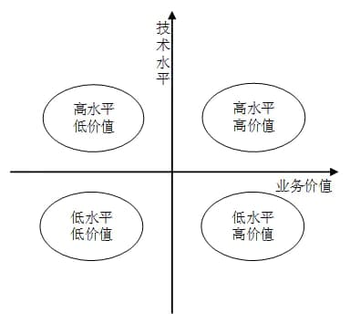

# 系统架构设计师综合知识题（1078436）

- 对应软考高级系统架构设计师章节：信息系统基础知识、系统质量属性与架构评估、软件架构的演化和维护

- 页面标题：系统架构设计师综合知识题 - 学习模式模式 - 系统运行与维护
- 题目数量：16
- 子题数量：24
- 

---

> **知识点分组：可行性分析**

## 1. 以下叙述中，（分析现有系统存在的运行问题）不属于可行性分析的范畴。
- 知识域：系统运行与维护 | 知识点：可行性分析 | 来源：2013年11月第19题
- 标签：可行性分析、低频

### 子题 1

- A. 对系统开发的各种候选方案进行成本/效益分析
- B. 分析现有系统存在的运行问题
- C. 评价该项目实施后可能取得的无形收益
- D. 评估现有技术能力和信息技术是否足以支持系统目标的实现

- 答案：B
- 浓缩知识点：

可行性分析是项目启动阶段评估项目实施价值与落地条件的关键环节，核心涵盖三大维度：经济可行性聚焦成本效益测算，既包含显性资金投入产出分析，也涉及提升效率、优化企业形象等无形收益评估；技术可行性侧重研判现有技术能力、软硬件资源及技术团队水平是否能支撑系统目标实现；运营可行性关注组织架构适配性、人员操作能力、管理流程兼容性等运营落地条件。需要明确，分析现有系统运行问题属于项目前期现状调查与问题诊断范畴，这类工作是为可行性分析提供基础信息支撑，本身不属于可行性分析核心内容。此外，可行性分析核心目标是为项目决策提供科学依据，规避盲目开发风险，而前期调研是前置信息收集工作，二者定位与作用有明确区分。

- 解析：

本题考察的是项目可行性分析的范围。

---

> **知识点分组：评价方法**

## 2. 把应用程序中应用最频繁的那部分核心程序作为评价计算机性能的标准程序，称为（基准测试）程序。（丢包率）不是对 Web 服务器进行性能评估的主要指标。
- 知识域：系统运行与维护 | 知识点：评价方法 | 来源：2013年11月第12题
- 标签：评价方法、简单、高频

### 子题 1

- A. 仿真测试
- B. 核心测试
- C. 基准测试
- D. 标准测试

- 答案：C
- 浓缩知识点：

在计算机性能评估中，基准测试是通用的评测方法，指从应用程序中抽取最常用、最具代表性的核心程序作为标准测试程序来衡量计算机性能，需注意区分相关概念：仿真测试是借助模拟环境评估性能，并不特指核心程序；核心测试并非标准的性能评价术语；标准测试只是泛称，不属于具体的性能评价方法。而Web服务器的核心性能评估指标包括最大并发连接数、响应延迟、吞吐量，其中最大并发连接数衡量服务器同时支持的用户连接能力，响应延迟反映从用户发起请求到服务器作出响应的时长，吞吐量体现单位时间内服务器处理请求的能力，丢包率属于网络传输层面的性能指标，不属于Web服务器本身的性能评估范畴。

- 解析：

本题考察的是计算机性能评估方法与 Web 服务器性能指标。
在计算机性能评估中，基准测试是通用的评测方法，指从应用程序中抽取最常用、最具代表性的核心程序作为标准测试程序来衡量计算机性能，需注意区分相关概念：仿真测试是借助模拟环境评估性能，并不特指核心程序。核心测试并非标准的性能评价术语。
本小问答案是 基准测试。题干中的“把应用程序中应用最频繁的那部分核心程序作为评价计算机性能的标准程序”对应基准测试。
因此，选项 C 正确。

### 子题 2

- A. 丢包率
- B. 最大并发连接数
- C. 响应延迟
- D. 吞吐量

- 答案：A
- 浓缩知识点：

在计算机性能评估中，基准测试是通用的评测方法，指从应用程序中抽取最常用、最具代表性的核心程序作为标准测试程序来衡量计算机性能，需注意区分相关概念：仿真测试是借助模拟环境评估性能，并不特指核心程序；核心测试并非标准的性能评价术语；标准测试只是泛称，不属于具体的性能评价方法。而Web服务器的核心性能评估指标包括最大并发连接数、响应延迟、吞吐量，其中最大并发连接数衡量服务器同时支持的用户连接能力，响应延迟反映从用户发起请求到服务器作出响应的时长，吞吐量体现单位时间内服务器处理请求的能力，丢包率属于网络传输层面的性能指标，不属于Web服务器本身的性能评估范畴。

- 解析：

本题考察的是计算机性能评估方法与 Web 服务器性能指标。
而Web服务器的核心性能评估指标包括最大并发连接数、响应延迟、吞吐量，其中最大并发连接数衡量服务器同时支持的用户连接能力，响应延迟反映从用户发起请求到服务器作出响应的时长，吞吐量体现单位时间内服务器处理请求的能力，丢包率属于网络传输层面的性能指标，不属于Web服务器本身的性能评估范畴。
本小问答案是 丢包率。题干中的“丢包率不是对 Web 服务器进行性能评估的主要指标”对应丢包率。
因此，选项 A 正确。

---

## 3. 在实际应用中，用户通常依靠评价程序来测试系统的性能。以下评价程序中，（合成基准程序）的评测准确程度最低。事务处理性能委员会（Transaction Processing Performance Council, TPC）是制定商务应用基准程序（benchmark）标准规范、性能和价格度量，并管理测试结果发布的非营利组织，其发布的TPC-C是（在线事务处理）的基准程序。
- 知识域：系统运行与维护 | 知识点：评价方法 | 来源：2014年11月第11题
- 标签：评价方法、简单、高频

### 子题 1

- A. 核心程序
- B. 真实程序
- C. 合成基准程序
- D. 小型基准程序

- 答案：C
- 浓缩知识点：

系统性能测试常用的评价程序按评测准确性从高到低分为真实程序、核心程序、小型基准程序、合成基准程序四类，真实程序直接采用实际应用程序测试，准确性最高；核心程序抽取应用关键部分开展评测，准确性次之；小型基准程序是提炼出的小规模测试程序，准确性居中；合成基准程序通过构造模拟典型负载特征的程序完成测试，与实际应用环境差距较大，准确性最低。事务处理性能委员会（TPC）是制定商务应用基准程序标准规范、性能与价格度量规则，并管理测试结果发布的非营利组织，其发布的系列基准程序各有应用场景针对性，其中TPC-C是面向在线事务处理（OLTP）场景的基准程序，可模拟订单处理、支付、发货等典型业务；决策支持、联机分析处理（OLAP）场景则通常对应TPC-H、TPC-DS这类基准程序。

- 解析：

本题考察的是系统性能测试的评价程序类型及 TPC 基准程序应用领域。
系统性能测试常用的评价程序按评测准确性从高到低分为真实程序、核心程序、小型基准程序、合成基准程序四类，真实程序直接采用实际应用程序测试，准确性最高。核心程序抽取应用关键部分开展评测，准确性次之。合成基准程序通过构造模拟典型负载特征的程序完成测试，与实际应用环境差距较大，准确性最低。小型基准程序是提炼出的小规模测试程序，准确性居中。
本小问答案是 合成基准程序。合成基准程序通过构造模拟典型负载特征的程序完成测试，与实际应用环境差距较大，准确性最低。
因此，选项 C 正确。

### 子题 2

- A. 决策支持
- B. 在线事务处理
- C. 企业信息服务
- D. 联机分析处理

- 答案：B
- 浓缩知识点：

系统性能测试常用的评价程序按评测准确性从高到低分为真实程序、核心程序、小型基准程序、合成基准程序四类，真实程序直接采用实际应用程序测试，准确性最高；核心程序抽取应用关键部分开展评测，准确性次之；小型基准程序是提炼出的小规模测试程序，准确性居中；合成基准程序通过构造模拟典型负载特征的程序完成测试，与实际应用环境差距较大，准确性最低。事务处理性能委员会（TPC）是制定商务应用基准程序标准规范、性能与价格度量规则，并管理测试结果发布的非营利组织，其发布的系列基准程序各有应用场景针对性，其中TPC-C是面向在线事务处理（OLTP）场景的基准程序，可模拟订单处理、支付、发货等典型业务；决策支持、联机分析处理（OLAP）场景则通常对应TPC-H、TPC-DS这类基准程序。

- 解析：

本题考察的是系统性能测试的评价程序类型及 TPC 基准程序应用领域。
决策支持、联机分析处理（OLAP）场景则通常对应TPC-H、TPC-DS这类基准程序。事务处理性能委员会（TPC）是制定商务应用基准程序标准规范、性能与价格度量规则，并管理测试结果发布的非营利组织，其发布的系列基准程序各有应用场景针对性，其中TPC-C是面向在线事务处理（OLTP）场景的基准程序，可模拟订单处理、支付、发货等典型业务。
本小问答案是 在线事务处理。题干中的“应用基准程序（benchmark）标准规范、性能和价格度量，并管理测试结果发布的非营利组织，其发布的TPC-C”对应在线事务处理。
因此，选项 B 正确。

---

## 4. 为了测试新系统的性能，用户必须依靠评价程序来评价机器的性能，以下4种评价程序，（合成基准程序）评测的准确程度最低。
- 知识域：系统运行与维护 | 知识点：评价方法 | 来源：2015年11月第13题
- 标签：评价方法、高频

### 子题 1

- A. 小型基准程序
- B. 真实程序
- C. 核心程序
- D. 合成基准程序

- 答案：D
- 浓缩知识点：

系统性能评价常用的基准程序主要分为真实程序、核心程序、小型基准程序和合成基准程序四类，它们的评测准确度呈依次递减的趋势。真实程序直接采用实际业务负载或应用程序开展测试，最能反映系统在真实工作环境中的性能表现，准确度最高；核心程序是从真实程序中抽取使用频率最高、最能体现系统运行特点的部分构建而成，评测准确度仅次于真实程序；小型基准程序选取典型功能或操作模块进行测试，相比合成基准程序更贴近实际场景，但仍无法完整还原真实应用的全部特征；合成基准程序是为测试需求人为构造的模拟程序，虽能模拟系统的典型运行行为，但不可避免与真实业务场景存在差距，因此其评测结果的准确程度在四类基准程序中最低。除了这四类，实际测试中还会根据不同的测试目标选择适配的基准程序，比如侧重CPU性能会选用特定的计算类基准程序，侧重I/O性能则会选取对应的存储测试程序，合理选择基准程序能更精准地评估系统的目标性能。

- 解析：

本题考察的是系统性能评价方法中各种基准程序的特点和准确度差异。
系统性能评价常用的基准程序主要分为真实程序、核心程序、小型基准程序和合成基准程序四类，它们的评测准确度呈依次递减的趋势。核心程序是从真实程序中抽取使用频率最高、最能体现系统运行特点的部分构建而成，评测准确度仅次于真实程序。小型基准程序选取典型功能或操作模块进行测试，相比合成基准程序更贴近实际场景，但仍无法完整还原真实应用的全部特征。
本小问答案是 合成基准程序。小型基准程序选取典型功能或操作模块进行测试，相比合成基准程序更贴近实际场景，但仍无法完整还原真实应用的全部特征。
因此，选项 D 正确。

---

## 5. 把应用程序中应用最频繁的那部分核心程序作为评价计算机性能的标准程序，称为（基准测试）程序。（丢包率）不是对 Web 服务器进行性能评估的主要指标。
- 知识域：系统运行与维护 | 知识点：评价方法 | 来源：2016年11月第13题
- 标签：评价方法、高频

### 子题 1

- A. 仿真测试
- B. 核心测试
- C. 基准测试
- D. 标准测试

- 答案：C
- 浓缩知识点：

基准测试程序是计算机性能评估的常用方法，它选取应用程序中使用最频繁的核心部分作为标准测试程序来评判系统性能，要注意区分易混淆的测试类型：仿真测试侧重模拟应用环境评估性能，核心测试并非行业通用称谓，标准测试泛指按统一标准开展的测试，均和基准测试有明确区别。在Web服务器性能评估中，核心参考指标包括最大并发连接数、响应延迟、吞吐量，分别衡量服务器同时处理连接的能力、处理单请求的耗时、单位时间内处理请求的总量；而丢包率属于网络质量指标，并不属于Web服务器本身的主要性能评估范畴。

- 解析：

本题考察的是基准测试程序与 Web 服务器性能评估指标。
基准测试程序是计算机性能评估的常用方法，它选取应用程序中使用最频繁的核心部分作为标准测试程序来评判系统性能，要注意区分易混淆的测试类型：仿真测试侧重模拟应用环境评估性能，核心测试并非行业通用称谓，标准测试泛指按统一标准开展的测试，均和基准测试有明确区别。
本小问答案是 基准测试。题干中的“把应用程序中应用最频繁的那部分核心程序作为评价计算机性能的标准程序”对应基准测试。
因此，选项 C 正确。

### 子题 2

- A. 丢包率
- B. 最大并发连接数
- C. 响应延迟
- D. 吞吐量

- 答案：A
- 浓缩知识点：

基准测试程序是计算机性能评估的常用方法，它选取应用程序中使用最频繁的核心部分作为标准测试程序来评判系统性能，要注意区分易混淆的测试类型：仿真测试侧重模拟应用环境评估性能，核心测试并非行业通用称谓，标准测试泛指按统一标准开展的测试，均和基准测试有明确区别。在Web服务器性能评估中，核心参考指标包括最大并发连接数、响应延迟、吞吐量，分别衡量服务器同时处理连接的能力、处理单请求的耗时、单位时间内处理请求的总量；而丢包率属于网络质量指标，并不属于Web服务器本身的主要性能评估范畴。

- 解析：

本题考察的是基准测试程序与 Web 服务器性能评估指标。
在Web服务器性能评估中，核心参考指标包括最大并发连接数、响应延迟、吞吐量，分别衡量服务器同时处理连接的能力、处理单请求的耗时、单位时间内处理请求的总量。而丢包率属于网络质量指标，并不属于Web服务器本身的主要性能评估范畴。
本小问答案是 丢包率。题干中的“丢包率不是对 Web 服务器进行性能评估的主要指标”对应丢包率。
因此，选项 A 正确。

---

## 6. 通常用户采用评价程序来评价系统的性能，评测准确度最高的评价程序是（真实程序）。在计算机性能评估中，通常将评价程序中用得最多、最频繁的（核心程序）作为评价计算机性能的标准程序，称其为基准测试程序。
- 知识域：系统运行与维护 | 知识点：评价方法 | 来源：2019年11月第14题
- 标签：评价方法、简单、高频

### 子题 1

- A. 真实程序
- B. 核心程序
- C. 小型基准程序
- D. 核心基准程序

- 答案：A
- 浓缩知识点：

计算机系统性能评价可通过多种测试程序开展，不同类型程序各有特点与适用场景。真实程序直接采用用户实际使用的应用程序，能精准反映系统在真实工作环境下的性能表现，是所有测试程序中评测准确度最高的一类。核心程序则是从真实程序中提炼出使用最频繁、计算最关键的部分，既保留了真实负载的代表性，又简化了测试流程，是目前业内公认较为优质的性能评估方法，常被选作基准测试程序。小型基准程序是针对特定功能或算法开发的小规模程序，能快速完成不同系统的针对性对比，但覆盖的应用场景有限，无法全面体现系统的综合性能。需要注意的是，“核心基准程序”并非性能评价领域的标准分类，实际应用中不存在这类规范的测试程序类型。

- 解析：

本题考察的是计算机系统性能评价方法的分类与应用。
核心程序则是从真实程序中提炼出使用最频繁、计算最关键的部分，既保留了真实负载的代表性，又简化了测试流程，是目前业内公认较为优质的性能评估方法，常被选作基准测试程序。小型基准程序是针对特定功能或算法开发的小规模程序，能快速完成不同系统的针对性对比，但覆盖的应用场景有限，无法全面体现系统的综合性能。需要注意的是，“核心基准程序”并非性能评价领域的标准分类，实际应用中不存在这类规范的测试程序类型。
本小问答案是 真实程序。题干中的“通常用户采用评价程序来评价系统的性能，评测准确度最高的评价程序”对应真实程序。
因此，选项 A 正确。

### 子题 2

- A. 真实程序
- B. 核心程序
- C. 小型基准程序
- D. 核心基准程序

- 答案：B
- 浓缩知识点：

计算机系统性能评价可通过多种测试程序开展，不同类型程序各有特点与适用场景。真实程序直接采用用户实际使用的应用程序，能精准反映系统在真实工作环境下的性能表现，是所有测试程序中评测准确度最高的一类。核心程序则是从真实程序中提炼出使用最频繁、计算最关键的部分，既保留了真实负载的代表性，又简化了测试流程，是目前业内公认较为优质的性能评估方法，常被选作基准测试程序。小型基准程序是针对特定功能或算法开发的小规模程序，能快速完成不同系统的针对性对比，但覆盖的应用场景有限，无法全面体现系统的综合性能。需要注意的是，“核心基准程序”并非性能评价领域的标准分类，实际应用中不存在这类规范的测试程序类型。

- 解析：

本题考察的是计算机系统性能评价方法的分类与应用。
核心程序则是从真实程序中提炼出使用最频繁、计算最关键的部分，既保留了真实负载的代表性，又简化了测试流程，是目前业内公认较为优质的性能评估方法，常被选作基准测试程序。小型基准程序是针对特定功能或算法开发的小规模程序，能快速完成不同系统的针对性对比，但覆盖的应用场景有限，无法全面体现系统的综合性能。需要注意的是，“核心基准程序”并非性能评价领域的标准分类，实际应用中不存在这类规范的测试程序类型。
本小问答案是 核心程序。题干中的“在计算机性能评估中，通常将评价程序中用得最多、最频繁的核心程序作为评价计算机性能的标准程序，称其为基准测试程序”对应核心程序。
因此，选项 B 正确。

---

## 7. 进行系统监视通常有三种方式：一是通过（系统命令），如 UNIX/Linux 系统中的 ps、last 等；二是通过系统记录文件查阅系统在特定时间内的运行状态；三是集成命令、文件记录和可视化技术的监控工具，如（Windows 的 Perfmon） 。
- 知识域：系统运行与维护 | 知识点：评价方法 | 来源：2020年11月第14题
- 标签：评价方法、高频

### 子题 1

- A. 系统命令
- B. 系统调用
- C. 系统接口
- D. 系统功能

- 答案：A
- 浓缩知识点：

系统监视是保障系统稳定运行的核心运维手段，主要有三类实现方式。第一类是通过系统命令快速获取实时状态，比如Linux系统的ps（查看进程）、last（查询登录记录），Windows系统的netstat（查看网络连接）、tasklist（查看进程列表）等，这类工具操作直接，适合即时查看特定系统信息。第二类是查阅系统记录文件，Linux系统通常将各类运行、安全、错误日志集中存储在/var/log目录，Windows系统可通过事件查看器调取系统、应用、安全类日志，这类记录能追溯特定时段的系统运行细节，为故障回溯提供依据。第三类是集成化综合监控工具，这类工具整合了命令调用、日志分析与可视化展示功能，比如Windows的Perfmon（性能监视器）可多维度监控CPU、内存、磁盘、网络等性能指标并生成直观图表，Linux生态中还有Zabbix、Prometheus等开源工具，支持集中式监控、阈值告警等进阶功能，能满足长期系统性能跟踪与多节点集群监控的需求。

- 解析：

本题考察的是系统监视的常用方法与工具。
系统命令：例如 UNIX/Linux 系统中的 ps（查看进程状态）、last（查看登录记录）等，属于通过命令直接获取系统运行状态的方法；系统调用：这是应用程序与操作系统内核交互的接口，用于实现功能调用，不是直接用于系统监视的主要方式；系统接口：指系统对外提供的调用接口，不特指监视功能；系统功能：过于笼统，没有明确对应到命令监视方式。
本小问答案是 系统命令。例如 UNIX/Linux 系统中的 ps（查看进程状态）、last（查看登录记录）等，属于通过命令直接获取系统运行状态的方法。
因此，选项 A 正确。

### 子题 2

- A. Windows 的 netstat
- B. Linux 的 iptables
- C. Windows 的 Perfmon
- D. Linux 的 top

- 答案：C
- 浓缩知识点：

系统监视是保障系统稳定运行的核心运维手段，主要有三类实现方式。第一类是通过系统命令快速获取实时状态，比如Linux系统的ps（查看进程）、last（查询登录记录），Windows系统的netstat（查看网络连接）、tasklist（查看进程列表）等，这类工具操作直接，适合即时查看特定系统信息。第二类是查阅系统记录文件，Linux系统通常将各类运行、安全、错误日志集中存储在/var/log目录，Windows系统可通过事件查看器调取系统、应用、安全类日志，这类记录能追溯特定时段的系统运行细节，为故障回溯提供依据。第三类是集成化综合监控工具，这类工具整合了命令调用、日志分析与可视化展示功能，比如Windows的Perfmon（性能监视器）可多维度监控CPU、内存、磁盘、网络等性能指标并生成直观图表，Linux生态中还有Zabbix、Prometheus等开源工具，支持集中式监控、阈值告警等进阶功能，能满足长期系统性能跟踪与多节点集群监控的需求。

- 解析：

本题考察的是系统监视的常用方法与工具。
Windows 的 netstat：用于查看网络连接和端口状态，属于命令工具，不是集成可视化的综合监控工具；Linux 的 iptables：是防火墙规则配置工具，不是监控工具；Windows 的 Perfmon：性能监视器（Performance Monitor），集成了命令、日志、可视化图表等功能，可监控 CPU、内存、磁盘、网络等多方面的性能，是典型的综合监控工具；Linux 的 top：用于动态查看进程和资源占用情况，但主要是命令行工具，不是集成可视化监控的工具。
本小问答案是 Windows 的 Perfmon。性能监视器（Performance Monitor），集成了命令、日志、可视化图表等功能，可监控 CPU、内存、磁盘、网络等多方面的性能，是典型的综合监控工具。
因此，选项 C 正确。

---

## 8. 软件复杂性度量中，（环路数）可以反映原代码结构的复杂度。
- 知识域：系统运行与维护 | 知识点：评价方法 | 来源：2022年11月第35题
- 标签：评价方法、高频

### 子题 1

- A. 模块数
- B. 环路数
- C. 用户数
- D. 对象数

- 答案：B
- 浓缩知识点：

软件复杂性度量中，能直接反映代码结构复杂度的核心指标是环路数，也就是圈复杂度，它通过统计程序中独立路径的数量来评估代码逻辑的复杂程度，独立路径越多，意味着代码的决策分支、逻辑嵌套越复杂，不仅能直观体现代码结构复杂度，还可辅助判断测试覆盖难度与后期维护成本。与之相对，模块数主要体现程序的模块化拆分程度，并非直接对应代码结构复杂度；用户数属于系统的业务使用维度指标，和代码本身复杂度无关联；对象数是面向对象系统中的设计元素数量，仅能侧面反映系统设计规模，与代码执行逻辑的结构复杂度关联较弱。

- 解析：

本题考察的是软件复杂性度量的概念，特别是衡量代码结构复杂度的指标。
与之相对，模块数主要体现程序的模块化拆分程度，并非直接对应代码结构复杂度。软件复杂性度量中，能直接反映代码结构复杂度的核心指标是环路数，也就是圈复杂度，它通过统计程序中独立路径的数量来评估代码逻辑的复杂程度，独立路径越多，意味着代码的决策分支、逻辑嵌套越复杂，不仅能直观体现代码结构复杂度，还可辅助判断测试覆盖难度与后期维护成本。用户数属于系统的业务使用维度指标，和代码本身复杂度无关联。对象数是面向对象系统中的设计元素数量，仅能侧面反映系统设计规模，与代码执行逻辑的结构复杂度关联较弱。
本小问答案是 环路数。题干中的“软件复杂性度量中环路数可以反映原代码结构的复杂度”对应环路数。
因此，选项 B 正确。

---

> **知识点分组：系统维护**

## 9. 在软件的使用过程中，用户往往会对软件提出新的功能与性能要求。为了满足这些要求，需要修改或再开发软件。在这种情况下进行的维护活动称为（完善性维护）。
- 知识域：系统运行与维护 | 知识点：系统维护 | 来源：2014年11月第21题
- 标签：系统维护、简单、中频

### 子题 1

- A. 改正性维护
- B. 适应性维护
- C. 完善性维护
- D. 预防性维护

- 答案：C
- 浓缩知识点：

软件维护主要分为四类，改正性维护聚焦修复软件已发现的缺陷与运行错误，属于故障后的修复性操作；适应性维护是为适配软件运行环境（如硬件迭代、操作系统升级）或外部业务规则变化（如合规要求调整）而开展的修改；完善性维护是响应用户提出的新功能需求、性能优化诉求进行的软件修改或再开发，是日常软件维护中占比最高的类型；预防性维护则是在软件运行正常时，主动对潜在风险点或老旧模块进行调整，提前规避未来可能出现的问题，提升系统长期可靠性。

- 解析：

本题考察的是软件维护类型的分类与适用场景。
软件维护主要分为四类，改正性维护聚焦修复软件已发现的缺陷与运行错误，属于故障后的修复性操作。适应性维护是为适配软件运行环境（如硬件迭代、操作系统升级）或外部业务规则变化（如合规要求调整）而开展的修改。完善性维护是响应用户提出的新功能需求、性能优化诉求进行的软件修改或再开发，是日常软件维护中占比最高的类型。预防性维护则是在软件运行正常时，主动对潜在风险点或老旧模块进行调整，提前规避未来可能出现的问题，提升系统长期可靠性。
本小问答案是 完善性维护。题干中的“在这种情况下进行的维护活动”对应完善性维护。
因此，选项 C 正确。

---

## 10. 系统上线运行后，用户提出新的需求，需要进行改造代码，提升系统性能，提高运行效率，扩展更多功能，这属于（完善性维护）。
- 知识域：系统运行与维护 | 知识点：系统维护 | 来源：2024年11月第27题
- 标签：系统维护、中频

### 子题 1

- A. 改正性维护
- B. 适应性维护
- C. 完善性维护
- D. 预防性维护

- 答案：C
- 浓缩知识点：

软件维护是软件投入使用后，为修复缺陷、适配环境、满足新需求等开展的修改优化工作，通常分为四类：改正性维护聚焦修复系统已出现的缺陷或错误，比如程序崩溃、输出异常等问题；适应性维护是因外部环境变化，像操作系统升级、数据库更换、合规要求调整等，对软件进行的适配性修改；完善性维护是较为常见的类型，多是响应用户在业务发展中提出的新需求，涵盖功能扩展、性能优化、运行效率提升等多种场景；预防性维护则是未雨绸缪，通过结构优化、技术重构等方式提升系统未来的可维护性与稳定性，并非针对当前问题或需求开展。实际运维中，完善性维护占比往往较高，是软件持续贴合业务发展的重要手段。

- 解析：

本题考察的是软件系统维护的分类。
软件维护是软件投入使用后，为修复缺陷、适配环境、满足新需求等开展的修改优化工作，通常分为四类：改正性维护聚焦修复系统已出现的缺陷或错误，比如程序崩溃、输出异常等问题。适应性维护是因外部环境变化，像操作系统升级、数据库更换、合规要求调整等，对软件进行的适配性修改。完善性维护是较为常见的类型，多是响应用户在业务发展中提出的新需求，涵盖功能扩展、性能优化、运行效率提升等多种场景。预防性维护则是未雨绸缪，通过结构优化、技术重构等方式提升系统未来的可维护性与稳定性，并非针对当前问题或需求开展。
本小问答案是 完善性维护。题干中的“系统上线运行后，用户提出新的需求，需要进行改造代码，提升系统性能，提高运行效率，扩展更多功能，这”对应完善性维护。
因此，选项 C 正确。

---

> **知识点分组：性能指标**

## 11. 对计算机评价的主要性能指标有时钟频率、（数据处理速率）、运算精度和内存容量等。对数据库管理系统评价的主要性能指标有（最大连接数）、数据库所允许的索引数量和最大并发事务处理能力等。
- 知识域：系统运行与维护 | 知识点：性能指标 | 来源：2017年11月第13题
- 标签：性能指标、中频

### 子题 1

- A. 丢包率
- B. 端口吞吐量
- C. 可移植性
- D. 数据处理速率

- 答案：D
- 浓缩知识点：

计算机系统性能指标分为硬件与软件系统两大类别。硬件核心性能指标包含时钟频率、数据处理速率、运算精度、内存容量等，其中数据处理速率直接体现设备处理数据的核心能力，此外字长、存储带宽，以及衡量处理器运算能力的MIPS（每秒百万条指令数）也属于硬件性能评估维度；丢包率、端口吞吐量是路由器、交换机这类网络设备的专属性能指标，可移植性则属于软件质量特性，不属于硬件性能范畴。针对数据库管理系统这类专用软件，其核心性能指标围绕服务承载与数据处理能力展开，主要有最大连接数、支持的索引数量、最大并发事务处理能力，同时事务响应时长、数据查询吞吐量、数据读写效率也是重要评估点；MIPS是处理器专属性能指标，时延抖动属于网络通信领域指标，均与数据库系统性能无直接关联，支持协议和标准属于系统兼容性指标，并非核心性能评估项。

- 解析：

本题考察的是硬件与软件系统的主要性能指标。
丢包率、端口吞吐量是路由器、交换机这类网络设备的专属性能指标，可移植性则属于软件质量特性，不属于硬件性能范畴。硬件核心性能指标包含时钟频率、数据处理速率、运算精度、内存容量等，其中数据处理速率直接体现设备处理数据的核心能力，此外字长、存储带宽，以及衡量处理器运算能力的MIPS（每秒百万条指令数）也属于硬件性能评估维度。
本小问答案是 数据处理速率。题干中的“对计算机评价的主要性能指标有时钟频率、数据处理速率、运算精度和内存容量等”对应数据处理速率。
因此，选项 D 正确。

### 子题 2

- A. MIPS
- B. 支持协议和标准
- C. 最大连接数
- D. 时延抖动

- 答案：C
- 浓缩知识点：

计算机系统性能指标分为硬件与软件系统两大类别。硬件核心性能指标包含时钟频率、数据处理速率、运算精度、内存容量等，其中数据处理速率直接体现设备处理数据的核心能力，此外字长、存储带宽，以及衡量处理器运算能力的MIPS（每秒百万条指令数）也属于硬件性能评估维度；丢包率、端口吞吐量是路由器、交换机这类网络设备的专属性能指标，可移植性则属于软件质量特性，不属于硬件性能范畴。针对数据库管理系统这类专用软件，其核心性能指标围绕服务承载与数据处理能力展开，主要有最大连接数、支持的索引数量、最大并发事务处理能力，同时事务响应时长、数据查询吞吐量、数据读写效率也是重要评估点；MIPS是处理器专属性能指标，时延抖动属于网络通信领域指标，均与数据库系统性能无直接关联，支持协议和标准属于系统兼容性指标，并非核心性能评估项。

- 解析：

本题考察的是硬件与软件系统的主要性能指标。
MIPS是处理器专属性能指标，时延抖动属于网络通信领域指标，均与数据库系统性能无直接关联，支持协议和标准属于系统兼容性指标，并非核心性能评估项。针对数据库管理系统这类专用软件，其核心性能指标围绕服务承载与数据处理能力展开，主要有最大连接数、支持的索引数量、最大并发事务处理能力，同时事务响应时长、数据查询吞吐量、数据读写效率也是重要评估点。
本小问答案是 最大连接数。题干中的“对数据库管理系统评价的主要性能指标有最大连接数、数据库所允许的索引数量和最大并发事务处理能力等”对应最大连接数。
因此，选项 C 正确。

---

## 12. 为了优化系统的性能，有时需要对系统进行调整。对于不同的系统，其调整参数也不尽相同。例如，对于数据库系统，主要包括 CPU /内存使用状况、（查询语句性能）、进程/线程状态、日志文件大小等。对于应用系统，主要包括应用系统的可用性、响应时间、（并发用户数）、特定应用的系统资源占用等。
- 知识域：系统运行与维护 | 知识点：性能指标 | 来源：2018年11月第14题
- 标签：性能指标、简单、中频

### 子题 1

- A. 数据丢包率
- B. 端口吞吐量
- C. 数据处理速率
- D. 查询语句性能

- 答案：D
- 浓缩知识点：

数据库系统性能优化与调整需从多维度切入，核心关注硬件资源状态，包括CPU、内存使用情况，进程线程运行状态，日志文件规模，其中查询语句性能是关键优化方向，查询语句的设计优劣直接决定数据库的响应效率与资源消耗，索引优化、查询计划调整都属于该范畴的优化手段；数据丢包率、端口吞吐量这类网络层面指标，以及过于笼统的数据处理速率，均不属于数据库内部性能优化的核心关注对象。

- 解析：

本题考察的是数据库系统性能优化的关键参数。
数据丢包率、端口吞吐量这类网络层面指标，以及过于笼统的数据处理速率，均不属于数据库内部性能优化的核心关注对象。数据库系统性能优化与调整需从多维度切入，核心关注硬件资源状态，包括CPU、内存使用情况，进程线程运行状态，日志文件规模，其中查询语句性能是关键优化方向，查询语句的设计优劣直接决定数据库的响应效率与资源消耗，索引优化、查询计划调整都属于该范畴的优化手段。
本小问答案是 查询语句性能。题干中的“CPU /内存使用状况、查询语句性能、进程/线程状态、日志文件大小等”对应查询语句性能。
因此，选项 D 正确。

### 子题 2

- A. 并发用户数
- B. 支持协议和标准
- C. 最大连接数
- D. 时延抖动

- 答案：A
- 浓缩知识点：

数据库系统性能优化与调整需从多维度切入，核心关注硬件资源状态，包括CPU、内存使用情况，进程线程运行状态，日志文件规模，其中查询语句性能是关键优化方向，查询语句的设计优劣直接决定数据库的响应效率与资源消耗，索引优化、查询计划调整都属于该范畴的优化手段；数据丢包率、端口吞吐量这类网络层面指标，以及过于笼统的数据处理速率，均不属于数据库内部性能优化的核心关注对象。

- 解析：

本题考察的是数据库系统性能优化的关键参数。
支持协议与标准属于系统兼容性设计范畴，最大连接数是系统设定的负载上限而非当前性能表现，时延抖动为网络通信稳定性指标，均不直接关联应用系统的性能优化核心。应用系统性能优化聚焦运行时的服务能力与效率，核心维度涵盖系统可用性、请求响应时间、并发用户数、特定应用的系统资源占用情况，其中并发用户数是衡量应用系统负载处理能力的核心指标，直接反映系统同时承载用户请求的数量。
本小问答案是 并发用户数。题干中的“应用系统的可用性、响应时间、并发用户数、特定应用的系统资源占用等”对应并发用户数。
因此，选项 A 正确。

---

## 13. 在 Web 服务器的测试中，反映其性能的指标不包括:（链接正确跳转），常见的 Web 服务器性能评测方法有基准性能测试、压力测试和 （可靠性测试）。
- 知识域：系统运行与维护 | 知识点：性能指标 | 来源：2021年11月第37题
- 标签：性能指标、中频

### 子题 1

- A. 链接正确跳转
- B. 最大并发连接数
- C. 响应延迟
- D. 吞吐量

- 答案：A
- 浓缩知识点：

Web服务器性能测试主要用于评估服务器在不同负载下的服务能力与稳定性，核心性能指标涵盖最大并发连接数、响应延迟、吞吐量，分别对应服务器同时处理客户端连接的能力、响应请求的速度、单位时间内处理请求的总量。需要注意，链接跳转正确性属于功能测试范畴，不属于性能指标。常见的Web服务器性能评测方法包括基准性能测试、压力测试以及可靠性测试，其中可靠性测试重点评估服务器长时间运行时的稳定性与故障容忍能力。此外，功能测试聚焦功能是否正确实现，黑盒测试、白盒测试是从测试技术维度划分的测试方法，均不属于性能测试的专项分类。

- 解析：

本题考察的是Web 服务器性能测试的核心指标与常见测试方法。
Web服务器性能测试主要用于评估服务器在不同负载下的服务能力与稳定性，核心性能指标涵盖最大并发连接数、响应延迟、吞吐量，分别对应服务器同时处理客户端连接的能力、响应请求的速度、单位时间内处理请求的总量。
本小问答案是 链接正确跳转。题干中的“链接正确跳转常见的 Web 服务器性能评测方法有基准性能测试、压力测试和”对应链接正确跳转。
因此，选项 A 正确。

### 子题 2

- A. 功能测试
- B. 黑盒测试
- C. 白盒测试
- D. 可靠性测试

- 答案：D
- 浓缩知识点：

Web服务器性能测试主要用于评估服务器在不同负载下的服务能力与稳定性，核心性能指标涵盖最大并发连接数、响应延迟、吞吐量，分别对应服务器同时处理客户端连接的能力、响应请求的速度、单位时间内处理请求的总量。需要注意，链接跳转正确性属于功能测试范畴，不属于性能指标。常见的Web服务器性能评测方法包括基准性能测试、压力测试以及可靠性测试，其中可靠性测试重点评估服务器长时间运行时的稳定性与故障容忍能力。此外，功能测试聚焦功能是否正确实现，黑盒测试、白盒测试是从测试技术维度划分的测试方法，均不属于性能测试的专项分类。

- 解析：

本题考察的是Web 服务器性能测试的核心指标与常见测试方法。
此外，功能测试聚焦功能是否正确实现，黑盒测试、白盒测试是从测试技术维度划分的测试方法，均不属于性能测试的专项分类。常见的Web服务器性能评测方法包括基准性能测试、压力测试以及可靠性测试，其中可靠性测试重点评估服务器长时间运行时的稳定性与故障容忍能力。
本小问答案是 可靠性测试。题干中的“常见的 Web 服务器性能评测方法有基准性能测试、压力测试和可靠性测试”对应可靠性测试。
因此，选项 D 正确。

---

> **知识点分组：遗留系统**

## 14. 遗留系统的演化可以采用淘汰、继承、改造和集成四种策略。若企业中的遗留系统技术含量较高，业务价值较低，在局部领域中工作良好，形成了一个个信息孤岛时，适合于采用（集成）演化策略。
- 知识域：系统运行与维护 | 知识点：遗留系统 | 来源：2013年11月第20题
- 标签：遗留系统、中频

### 子题 1

- A. 淘汰
- B. 继承
- C. 改造
- D. 集成

- 答案：D
- 浓缩知识点：

遗留系统演化主要有淘汰、继承、改造、集成四种策略，需结合系统技术含量与业务价值的不同组合匹配选用。技术含量低且业务价值也低的系统，可采用淘汰策略直接废弃，这类系统对业务无实质支撑意义；技术落后但业务价值高的核心业务支撑系统，适合用继承策略，以必要维护为主保障其稳定运行；技术与业务价值双高的系统，适配改造策略，可通过功能增强、技术升级进一步挖掘其业务价值；技术含量高但业务价值低、易形成信息孤岛的系统，宜采用集成策略，通过互联互通打破数据壁垒，整合分散的系统能力，避免资源闲置与信息割裂。

- 解析：

本题考察的是遗留系统的演化策略。
遗留系统演化主要有淘汰、继承、改造、集成四种策略，需结合系统技术含量与业务价值的不同组合匹配选用。
本小问答案是 集成。题干中的“若企业中的遗留系统技术含量较高，业务价值较低，在局部领域中工作良好，形成了一个个信息孤岛时，适合于”对应集成。
因此，选项 D 正确。

---

## 15. 对于遗留系统的评价框架如下图所示，那么处于"高水平、低价值"区的遗留系统适合于采用的演化策略为（集成）。
- 知识域：系统运行与维护 | 知识点：遗留系统 | 来源：2015年11月第27题
- 标签：遗留系统、中频

### 子题 1

- A. 淘汰
- B. 继承
- C. 改造
- D. 集成

- 答案：D
- 浓缩知识点：

遗留系统演化策略以业务价值高低和技术水平高低为核心划分维度，对应四种典型策略。低业务价值且低技术水平的遗留系统，无业务意义且维护难度大，宜采用淘汰策略直接移除；高业务价值但低技术水平的遗留系统，承载关键业务却难以改造，适合采用继承策略，仅做小范围维护保障业务运转；高业务价值且高技术水平的遗留系统，架构优良且业务核心，可通过改造策略拓展功能、优化性能；高技术水平但低业务价值的遗留系统，技术状态完好但业务场景单一、价值有限，适合采用集成策略，将其整合至其他系统或平台，避免形成信息孤岛，提升整体资源的复用效率。

- 解析：

本题考察的是遗留系统演化策略与系统价值/技术水平矩阵的理解。
高业务价值但低技术水平的遗留系统，承载关键业务却难以改造，适合采用继承策略，仅做小范围维护保障业务运转。低业务价值且低技术水平的遗留系统，无业务意义且维护难度大，宜采用淘汰策略直接移除。高技术水平但低业务价值的遗留系统，技术状态完好但业务场景单一、价值有限，适合采用集成策略，将其整合至其他系统或平台，避免形成信息孤岛，提升整体资源的复用效率。
本小问答案是 集成。题干中的“对于遗留系统的评价框架如下图所示，那么处于"高水平、低价值"区的遗留系统适合于采用的演化策略”对应集成。
因此，选项 D 正确。

---

## 16. 在对遗留系统进行评估时，对于技术含量较高、业务价值较低且仅能完成某个部门的业务管理的遗留系统，一般采用的遗留系统演化策略是（集成）策略。
- 知识域：系统运行与维护 | 知识点：遗留系统 | 来源：2022年11月第39题
- 标签：遗留系统、中频

### 子题 1

- A. 淘汰
- B. 继承
- C. 集成
- D. 改造

- 答案：C
- 浓缩知识点：

遗留系统的演化策略主要依据系统的技术水平（高/低）与业务价值（高/低）两个核心维度划分，共包含四类。淘汰策略适用于技术水平低且业务价值低的系统，这类系统维护成本高且无核心价值，直接废弃即可；继承策略针对技术水平低但业务价值高的系统，这类系统承载核心业务，需维持现有运行状态并做必要的修补，避免核心业务受影响；集成策略适用于技术水平高但业务价值较低的局部业务系统，比如仅支撑单一部门业务的系统，通过将其与其他系统集成，可避免形成信息孤岛，最大化利用现有技术能力；改造策略则针对技术水平与业务价值均高的系统，这类系统具备升级潜力，可在原有基础上优化功能或新增需求，适配业务发展的新要求。

- 解析：

本题考察的是遗留系统的演化策略分类与适用场景。
淘汰策略适用于技术水平低且业务价值低的系统，这类系统维护成本高且无核心价值，直接废弃即可。继承策略针对技术水平低但业务价值高的系统，这类系统承载核心业务，需维持现有运行状态并做必要的修补，避免核心业务受影响。集成策略适用于技术水平高但业务价值较低的局部业务系统，比如仅支撑单一部门业务的系统，通过将其与其他系统集成，可避免形成信息孤岛，最大化利用现有技术能力。改造策略则针对技术水平与业务价值均高的系统，这类系统具备升级潜力，可在原有基础上优化功能或新增需求，适配业务发展的新要求。
本小问答案是 集成。题干中的“统进行评估时，对于技术含量较高、业务价值较低且仅能完成某个部门的业务管理的遗留系统，一般采用的遗留系统演化策略”对应集成。
因此，选项 C 正确。

---
